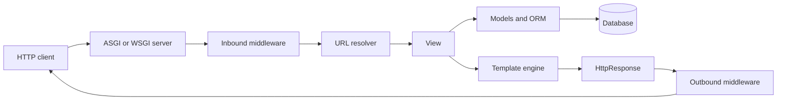

<TLDR>
  <TLDRCell label="what">
    Django is a Python web framework that integrates URL routing, request handling, an ORM, forms, templates, authentication, migrations, and an admin site.
  </TLDRCell>
  <TLDRCell label="when">
    Use it when a server-rendered application or HTTP service benefits from strong conventions and a coherent set of maintained components.
  </TLDRCell>
  <TLDRCell label="how">
    Map paths to thin views, keep data rules in models and services, validate all boundary input, and test the complete request path.
  </TLDRCell>
</TLDR>

## What it is and why it exists

<Term id="django">Django</Term> is a general-purpose Python web framework. It supplies the infrastructure that most database-backed applications otherwise assemble from separate routing, persistence, validation, security, and rendering libraries. Its defaults give a team one recognizable way to turn an HTTP request into a response.

“Batteries included” does not mean that every Django application must use every subsystem. An API-only service can return `JsonResponse` objects without templates, and a small site may never customize the admin. The value is that routing, models, forms, authentication, sessions, caching, internationalization, and operations tooling share conventions and documentation.

Django fits applications whose domain is mostly request-response work over relational data: publishing, internal tools, marketplaces, account portals, and conventional APIs. It is especially useful when schema changes, authentication, administration, and HTML forms must evolve together. A tiny stateless endpoint or a service built around a different concurrency model may need less framework.

Django itself is not Django REST Framework. Core Django can receive and return JSON, but it does not provide DRF serializers, viewsets, routers, or token authentication. Treat those as an optional third-party API layer, with its own configuration and security review.

A Django “project” is the deployed application configuration: settings, root URL configuration, and server entry points. A Django “app” is a reusable Python package that owns a bounded capability such as orders or billing. Apps run inside a project; creating many apps does not create independent services or processes.

## How it works

At startup, Django loads the selected settings module, initializes its application registry, and imports the root <Term id="urlconf">URLconf</Term>. A request then passes through configured <Term id="middleware">middleware</Term>. Django resolves the path against ordered URL patterns, calls the selected view, and sends the resulting `HttpResponse` back through the middleware stack.



The URL resolver checks patterns in order and stops at the first match. Path converters turn matching segments into typed keyword arguments, such as the integer `order_id` in `/orders/<int:order_id>/`. A view is a callable that accepts an `HttpRequest` and returns an `HttpResponse`; class-based views ultimately expose the same contract through `as_view()`.

Middleware wraps the request path like nested layers. Request processing follows the configured order toward the view, while response processing unwinds in reverse. Ordering therefore changes behavior: authentication depends on sessions, and code that assumes `request.user` exists must run after authentication middleware has attached it.

Models describe persistent data and relationships with Python classes. Django turns model operations into SQL through a database backend, but the database still enforces the final constraints and transaction behavior. A model is not a transport schema: exposing every field in JSON couples the public API to storage and can leak internal or sensitive data.

A <Term id="queryset">QuerySet</Term> is a composable, usually lazy database-query description. Calls such as `filter()` and `order_by()` normally build a new QuerySet without issuing SQL. Iteration, `list()`, `len()`, truth testing, and other evaluation operations cause the query to run, after which result caching depends on how the QuerySet is consumed.

A <Term id="migration">migration</Term> records a versioned schema or data operation. `makemigrations` compares model state with recorded migration state and writes migration files; `migrate` applies the resulting dependency graph to a database. Production deployments should commit migration files, inspect them, and coordinate incompatible schema changes with old and new application versions.

Django can run synchronous or asynchronous views. Under an <Term id="asgi">ASGI</Term> server, an async request path can avoid a thread per long-lived connection when every relevant layer supports async operation. One synchronous middleware component can force adaptation, and calling sync-only Django code from an async context can raise `SynchronousOnlyOperation`.

Security features are layered rather than automatic proof of safety. Django templates escape variable output by default, the ORM parameterizes normal query values, CSRF middleware protects browser session writes, and host validation constrains the `Host` header. Authorization, safe object selection, upload limits, secret management, and production TLS remain application and deployment responsibilities.

## Examples

The first example creates a complete in-memory request path. `Client` sends a request through Django's URL resolver, the integer converter supplies `order_id`, and the view returns JSON. The nonnumeric path fails routing before the view runs.

<Depth level="quick">

```python run title="route_request.py"
from django.conf import settings
from django.http import JsonResponse
from django.test import Client
from django.urls import path

settings.configure(
    DEBUG=False,
    SECRET_KEY="example-only",
    ROOT_URLCONF=__name__,
    ALLOWED_HOSTS=["testserver"],
)

import django

django.setup()


def order_detail(request, order_id):
    return JsonResponse({"order_id": order_id, "method": request.method})


urlpatterns = [
    path("orders/<int:order_id>/", order_detail, name="order-detail"),
]

client = Client()
response = client.get("/orders/42/")

print(response.status_code)
print(response.json())
print(client.get("/orders/not-an-int/").status_code)
```

```text
200
{'order_id': 42, 'method': 'GET'}
404
```

</Depth>

The output distinguishes a matched resource-shaped URL from an arbitrary string. In a normal project, settings and URL patterns live in separate modules, but the request contract is unchanged. Tests should use `reverse("order-detail", kwargs={"order_id": 42})` when they are testing a named route rather than the spelling of a literal URL.

The second example defines a model, creates its table in an in-memory SQLite database, and observes the query boundary. Building `paid_orders` executes no `SELECT`; iterating it executes one. The table creation and insert happen before query capture, so the counts describe only QuerySet evaluation.

```python run title="queryset_laziness.py"
from django.conf import settings

settings.configure(
    DEBUG=True,
    SECRET_KEY="example-only",
    DATABASES={
        "default": {
            "ENGINE": "django.db.backends.sqlite3",
            "NAME": ":memory:",
        }
    },
    INSTALLED_APPS=[],
)

import django

django.setup()

from django.db import connection, models
from django.test.utils import CaptureQueriesContext


class Order(models.Model):
    reference = models.CharField(max_length=20, unique=True)
    total = models.DecimalField(max_digits=8, decimal_places=2)
    paid = models.BooleanField(default=False)

    class Meta:
        app_label = "shop"


with connection.schema_editor() as schema_editor:
    schema_editor.create_model(Order)

Order.objects.bulk_create(
    [
        Order(reference="A-100", total="18.50", paid=True),
        Order(reference="A-101", total="9.00", paid=False),
        Order(reference="A-102", total="31.25", paid=True),
    ]
)

paid_orders = Order.objects.filter(paid=True).order_by("reference")

with CaptureQueriesContext(connection) as captured:
    print("queries before evaluation:", len(captured))
    print("paid orders:", [(o.reference, str(o.total)) for o in paid_orders])
    print("queries after evaluation:", len(captured))
```

```text
queries before evaluation: 0
paid orders: [('A-100', '18.50'), ('A-102', '31.25')]
queries after evaluation: 1
```

Application tests normally create tables through migrations and Django's test database. Direct `schema_editor()` use keeps this standalone example short; it is not a replacement for migration files. In production code, put currency rules in an exact decimal representation and enforce important uniqueness or range invariants at the database layer where possible.

The third example implements a small JSON boundary with core Django. It checks malformed JSON separately, then uses a form to convert and validate fields before reading `cleaned_data`. This makes accepted types and limits explicit instead of trusting the decoded dictionary.

```python run title="validated_endpoint.py"
import json

from django.conf import settings
from django.http import JsonResponse
from django.test import Client
from django.urls import path

settings.configure(
    DEBUG=False,
    SECRET_KEY="example-only",
    ROOT_URLCONF=__name__,
    ALLOWED_HOSTS=["testserver"],
)

import django

django.setup()

from django import forms
from django.views.decorators.http import require_POST


class ReservationForm(forms.Form):
    sku = forms.CharField(max_length=20)
    quantity = forms.IntegerField(min_value=1, max_value=50)


@require_POST
def reserve(request):
    try:
        payload = json.loads(request.body)
    except (json.JSONDecodeError, UnicodeDecodeError):
        return JsonResponse({"error": "invalid JSON"}, status=400)

    form = ReservationForm(payload)
    if not form.is_valid():
        return JsonResponse({"errors": form.errors.get_json_data()}, status=400)
    return JsonResponse({"reserved": form.cleaned_data}, status=201)


urlpatterns = [path("reservations/", reserve)]
client = Client()

ok = client.post(
    "/reservations/",
    data=json.dumps({"sku": "KB-7", "quantity": 2}),
    content_type="application/json",
)
bad = client.post(
    "/reservations/",
    data=json.dumps({"sku": "KB-7", "quantity": 0}),
    content_type="application/json",
)

print(ok.status_code, ok.json())
print(bad.status_code, bad.json()["errors"]["quantity"][0]["code"])
```

```text
201 {'reserved': {'sku': 'KB-7', 'quantity': 2}}
400 min_value
```

This endpoint demonstrates parsing and validation, not a complete reservation workflow. A real state change also needs authentication, object-level authorization, CSRF protection when browser cookies authenticate it, a transaction, conflict handling, and idempotency if clients retry. Django's test client disables CSRF checks by default; use `Client(enforce_csrf_checks=True)` for a test meant to exercise that boundary.

## Pitfalls

### Letting URLs imply authorization

> [!PITFALL]
> A converter proves that `/orders/42/` contains an integer. It does not prove that the current user may read order 42.

**Fix:** constrain the object lookup by both identity and authorization scope, or run an explicit policy check before returning data. Test with an authenticated user who owns a different object, not only with anonymous and owner cases. Return behavior should follow the application's disclosure policy without confirming that a forbidden object exists.

### Evaluating related objects one row at a time

> [!PITFALL]
> Iterating a QuerySet and then reading an uncached relation can issue one extra query per result, producing the N+1 query pattern.

**Fix:** use `select_related()` for single-valued foreign-key or one-to-one paths, and `prefetch_related()` for many-valued relations. Capture query counts around a representative view, because adding a template field can reintroduce the problem. Do not add every relation preemptively; unused prefetches cost memory and queries.

### Treating validation as a database constraint

> [!PITFALL]
> Form or serializer validation runs in one application path, while scripts, admin actions, concurrent requests, and bulk operations may write through another path.

**Fix:** validate friendly error conditions at the boundary and also encode durable invariants with field options, `UniqueConstraint`, `CheckConstraint`, foreign keys, and transactions. Catch the database error that can still win a race. Do not call `full_clean()` on every model save by surprise; choose and test a consistent write path.

### Blocking inside async views

> [!PITFALL]
> Declaring a view `async def` does not make synchronous ORM calls, network clients, or middleware nonblocking. It can instead add context switches or raise an async-safety error.

**Fix:** inspect the whole request stack, use Django's async ORM methods where supported, and isolate sync-only work with the documented adapter. Keep transaction-heavy code synchronous because Django 6.0 does not support transactions in async mode. Load-test the deployed ASGI stack rather than inferring concurrency from the view declaration.

### Shipping development settings

> [!PITFALL]
> `runserver`, `DEBUG=True`, a source-controlled `SECRET_KEY`, and permissive host or origin settings are development conveniences, not a production configuration.

**Fix:** run `manage.py check --deploy` against production settings, terminate TLS correctly, restrict hosts and trusted origins, store secrets outside source control, and configure static and uploaded media deliberately. Review proxy headers with the actual proxy topology. Never serve user uploads as trusted executable content.

<Depth level="deep">

## Rendering and form boundaries

Django's template language is intentionally narrower than Python. Templates select and format presentation data; they should not decide authorization or issue surprising database queries. Pass a prepared context from the view and keep custom tags small enough to test as ordinary Python units.

Variable output is HTML-escaped by default, which blocks many injection paths when values are rendered in HTML context. `safe`, `mark_safe()`, and autoescape blocks override that protection and therefore require a provenance argument: who produced this string, how was it sanitized, and for which output context? Escaping for HTML text does not automatically make a value safe inside JavaScript, CSS, or a URL.

Template inheritance gives pages a shared layout, while included templates and inclusion tags extract repeated presentation. Namespaced template paths prevent apps from accidentally selecting another app's file with the same name. A rendered template is still only a response body; headers, status codes, caching, and content type belong to the response contract.

Django forms combine parsing, type conversion, validation, and error reporting. Bind a form to untrusted input, call `is_valid()`, and use `cleaned_data` only after success. Reading raw `request.POST` values after validation discards the conversions and cross-field rules that the form established.

A `ModelForm` derives fields from a model, but explicitly listing editable fields is safer than exposing all present and future fields. Assignment of the current user, tenant, price, approval state, or other server-owned data belongs outside caller-editable form data. Use `save(commit=False)` only when the code also handles required many-to-many writes and the surrounding transaction deliberately.

The admin site is a privileged operations interface generated from model metadata. It is not a public application UI and not an authorization policy by itself. Restrict staff access, implement per-object permissions when needed, keep audit-sensitive workflows explicit, and treat custom admin actions as bulk write endpoints.

## Settings and application startup

Settings are Python configuration loaded before normal request handling. Keep environment-specific values in the deployment environment or a secret store, but parse and validate them into typed values at startup. The string `"False"` is truthy in Python, so direct boolean conversion of environment text is a frequent generated-code bug.

`INSTALLED_APPS` controls application registration, model discovery, templates, management commands, and migrations. Removing or reordering entries can change startup and migration behavior; it is not merely a menu of imports. App configuration code should avoid database queries because startup also occurs during migration commands and before tables are guaranteed to exist.

`MIDDLEWARE` is ordered executable policy. Keep the list short, document dependencies between layers, and test observable behavior with the production ordering. A middleware that reads the request body, consumes a stream, catches every exception, or rewrites security headers can silently change every endpoint.

Management commands run with the same settings and app registry as the application. Make destructive or externally visible commands explicit about target environment, support dry runs where useful, and make retry behavior clear. A generated command that loops over a QuerySet and calls `save()` may be correct for signals but unsuitable for millions of rows or an online migration.

## Error and test boundaries

Expected client errors should become deliberate responses at the boundary where their meaning is known. A missing object can produce `Http404`, invalid input can produce a structured 400 response, and a detected conflict can produce 409. Catching `Exception` in every view collapses programming faults, database failures, and client mistakes into one misleading result.

Unhandled failures should reach centralized logging and error handling with a request correlation identifier and without sensitive local variables in the response. Django's debug error page is diagnostic output for trusted development environments only. A custom error response still needs tests for content type, status, and information disclosure.

Use `RequestFactory` when the unit under test is the view callable and middleware is irrelevant. Use `Client` or `AsyncClient` when routing, middleware, templates, sessions, or response headers are part of the behavior. Choosing the narrower tool is useful only when another test covers the omitted integration boundary.

Test data should make authorization relationships visible: owner, same-tenant non-owner, different-tenant user, staff user, and anonymous caller where relevant. Status-only assertions are weak because a 200 response can still contain another tenant's fields. Assert the response representation and the rows that were or were not changed.

Use `override_settings()` for a setting that is designed to vary at runtime in a test. Modules that copy a setting into a constant during import will not observe a later override, which makes order-dependent tests likely. Prefer reading settings at the behavior boundary unless import-time configuration is intentional.

Keep migration tests separate from tests that begin with the latest schema. A migration test starts from a recorded old state, inserts representative old data, applies the target migration, and checks the new state. This catches data conversions that ordinary model tests cannot exercise.

External services need an explicit seam and a failure contract. Mock the seam in most tests, but retain an integration or contract test that proves request encoding, timeouts, and response parsing against the real protocol. Patching a low-level library everywhere can make tests pass after the application's adapter has drifted.

Time, randomness, and on-commit work also cross boundaries. Freeze or inject time when domain behavior depends on it, make generated identifiers observable, and use `captureOnCommitCallbacks()` when a `TestCase` must assert callbacks registered with `transaction.on_commit()`. Do not assert only that a mock was called before the database outcome is known.

## Query and transaction boundaries

QuerySet laziness makes composition cheap, but it can hide I/O from code review. `filter()` can be called far from the eventual iteration, and templates may trigger relation loads that the view does not visibly perform. Measure at the request boundary with query capture or a profiler, then optimize the access pattern that the response actually uses.

`select_related()` extends one SQL query with joins for single-valued relations. `prefetch_related()` runs additional queries and joins the results in Python, which is appropriate for many-to-many and reverse relations. Neither guarantees a small response: pagination and explicit field selection still matter, and large `IN` clauses or broad prefetches can become their own cost.

Use `transaction.atomic()` when several database operations must commit or roll back together. Keep external HTTP calls and message publication out of a long-running database transaction when possible, because locks remain held while the process waits. If a database change and an event must be coordinated, use a durable outbox or another explicitly designed delivery protocol rather than assuming two separate writes are atomic.

Row locks, uniqueness constraints, and conditional updates solve different races. `select_for_update()` requires a transaction and coordinates writers that follow the same locking protocol; a unique constraint remains the final arbiter for duplicate keys. An `F()` expression can update a field relative to its current database value without a read-modify-write race, but it does not validate unrelated domain invariants by itself.

Tests should prove both the returned response and the stored outcome. `TestCase` wraps tests for isolation and is fast for common database cases, while `TransactionTestCase` is needed when the transaction boundary itself is under test. A test that mocks the ORM cannot demonstrate SQL constraints, locking, middleware order, or migration behavior.

## Sync and async boundaries

Django selects a sync or async calling style for the request stack and adapts when a component uses the other style. Under WSGI, an async view can run but does not gain the full benefits of an async stack. Under ASGI, long-lived requests benefit only when middleware and called libraries do not force a synchronous detour.

Async QuerySet methods use names such as `aget()`, `acreate()`, and `aupdate()`, and QuerySets support `async for`. Methods that only build and return a QuerySet do not need an async variant because they do not execute SQL. Evaluate documentation and types at each call site instead of mechanically prefixing every ORM method with `a`.

Async safety protects global or thread-sensitive state from being used in the wrong context. If sync-only code is called while an event loop is active, Django may raise `SynchronousOnlyOperation`; disabling the protection can corrupt data. Put a cohesive synchronous unit behind `sync_to_async()` when no native async API exists, and do not pass unevaluated QuerySets across that boundary casually.

Cancellation is part of the request contract for long-lived async views. Django can raise `asyncio.CancelledError` when the client disconnects, so cleanup belongs in `try`/`finally` or an async context manager. Cancellation does not retroactively undo a database commit or external side effect; make write semantics explicit before adding streaming or long polling.

## Migration and deployment boundaries

Migration files are executable deployment artifacts, not generated clutter. Review the operations, commit them with the model change, and run `makemigrations --check` in continuous integration so an unrecorded model edit fails early. Use historical models from the `apps` argument inside data migrations rather than importing the current model class.

Zero-downtime schema changes usually require expand and contract. Add a nullable field or a compatible table first, deploy code that can work with both shapes, backfill in controlled batches, switch reads and writes, and only then remove the old shape. The exact plan depends on the database and traffic; a generated migration cannot infer those operational constraints from the model diff.

Before release, apply migrations to a production-like copy, run system checks, collect static assets if used, and exercise the application through its real server interface. `manage.py check --deploy` reports several unsafe settings but cannot verify firewall rules, proxy behavior, object authorization, backup restoration, or capacity. Treat it as one required signal, not a deployment certificate.

</Depth>

<Checkpoint id="backend/django" />

## Further reading

- [Django overview](https://docs.djangoproject.com/en/6.0/intro/overview/)
- [URL dispatcher](https://docs.djangoproject.com/en/6.0/topics/http/urls/)
- [Making queries](https://docs.djangoproject.com/en/6.0/topics/db/queries/)
- [Security in Django](https://docs.djangoproject.com/en/6.0/topics/security/)
- [Deployment checklist](https://docs.djangoproject.com/en/6.0/howto/deployment/checklist/)
