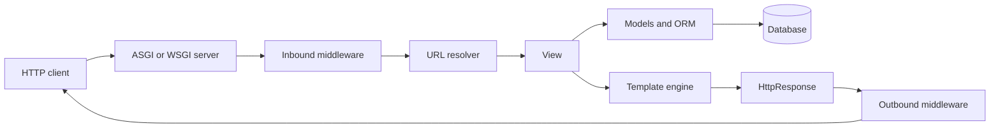

<TLDR>
  <TLDRCell label="what">
    Django 是一个 Python Web 框架，集成 URL 路由、请求处理、ORM、表单、模板、认证、迁移和管理后台。
  </TLDRCell>
  <TLDRCell label="when">
    当服务端渲染应用或 HTTP 服务需要明确约定和一套协调维护的组件时，可以使用 Django。
  </TLDRCell>
  <TLDRCell label="how">
    用 URL 模式把路径映射到精简的视图，在模型和服务中维护数据规则，验证所有边界输入，并测试完整请求路径。
  </TLDRCell>
</TLDR>

## 是什么，为什么存在

<Term id="django">Django</Term> 是一个通用 Python Web 框架。对于由数据库支撑的应用，它提供通常需要分别引入路由、持久化、验证、安全和渲染库才能得到的基础设施。借助这些默认约定，团队可以用一种容易识别的方式把 HTTP 请求转换为响应。

「电池已包含」不代表每个 Django 应用都必须使用全部子系统。只提供 API 的服务可以直接返回 `JsonResponse`，无需使用模板；小型站点也可能从不定制管理后台。它的价值在于路由、模型、表单、认证、会话、缓存、国际化和运维工具共享约定与文档。

Django 适合以关系数据上的请求—响应操作为主的应用，例如内容发布、内部工具、交易平台、账户门户和常规 API。当数据库模式变更、认证、管理后台和 HTML 表单需要协同演进时，它尤其有用。很小的无状态端点，或者以另一种并发模型为中心的服务，可能不需要这么完整的框架。

Django 本身不是 Django REST Framework。Django 核心可以接收和返回 JSON，但不提供 DRF 的序列化器、视图集、路由器或令牌认证。应把 DRF 视为可选的第三方 API 层，并单独配置和审查其安全性。

Django 中的「项目（project）」是部署应用的配置，包含设置、根 URL 配置和服务器入口。「应用（app）」则是可复用的 Python 包，负责订单或账单等边界明确的能力。应用在项目内运行；创建许多应用并不会得到彼此独立的服务或进程。

## 工作原理

启动时，Django 加载选定的设置模块，初始化应用注册表，并导入根<Term id="urlconf">URL 配置（URLconf）</Term>。请求随后经过已配置的<Term id="middleware">中间件（middleware）</Term>。Django 按顺序匹配 URL 模式，调用选中的视图，再让生成的 `HttpResponse` 沿中间件栈返回。



URL 解析器按顺序检查模式，并在首次匹配时停止。路径转换器把匹配片段转换为带类型的关键字参数，例如 `/orders/<int:order_id>/` 中的整数 `order_id`。视图是接收 `HttpRequest` 并返回 `HttpResponse` 的可调用对象；类视图最终也通过 `as_view()` 提供同一契约。

中间件像嵌套层一样包裹请求路径。请求按照配置顺序向视图传递，响应则按相反顺序逐层返回。因此，顺序会改变行为：认证依赖会话，而假定 `request.user` 存在的代码必须在认证中间件完成赋值之后运行。

模型用 Python 类描述持久化数据及其关系。Django 通过数据库后端把模型操作转换为 SQL，但最终约束和事务行为仍由数据库执行。模型不是传输模式：把每个字段都暴露到 JSON 中，会让公共 API 与存储结构耦合，还可能泄露内部数据或敏感数据。

<Term id="queryset">查询集（QuerySet）</Term>是一种可组合且通常惰性的数据库查询描述。`filter()` 和 `order_by()` 等调用一般会构造新的 QuerySet，但不会执行 SQL。迭代、`list()`、`len()`、真值判断等求值操作会触发查询；之后是否缓存结果，则取决于 QuerySet 的使用方式。

<Term id="migration">迁移（migration）</Term>记录受版本控制的数据库模式或数据操作。`makemigrations` 比较模型状态与已记录的迁移状态，并写入迁移文件；`migrate` 则把生成的依赖图应用到数据库。生产部署应提交并检查迁移文件，还要协调不兼容的模式变更，确保新旧应用版本都能正确运行。

Django 可以运行同步或异步视图。在<Term id="asgi">异步服务器网关接口（ASGI）</Term>服务器下，如果相关层都支持异步，异步请求路径在处理长连接时可以避免每个连接占用一个线程。只要有一个同步中间件，就可能触发适配；在异步上下文中调用仅支持同步的 Django 代码，还可能抛出 `SynchronousOnlyOperation`。

安全特性由多层机制共同提供，不能自动证明应用安全。Django 模板默认转义变量输出，ORM 会参数化常规查询值，CSRF 中间件保护使用浏览器会话的写操作，主机验证则限制 `Host` 请求头。授权、安全的对象选择、上传限制、密钥管理和生产 TLS 仍由应用与部署负责。

## 示例

第一个示例在内存中建立完整请求路径。`Client` 通过 Django 的 URL 解析器发送请求，整数转换器提供 `order_id`，视图返回 JSON。非数字路径在视图运行前就无法通过路由匹配。

<Depth level="quick">

```python run title="route_request.py"
from django.conf import settings
from django.http import JsonResponse
from django.test import Client
from django.urls import path

settings.configure(
    DEBUG=False,
    SECRET_KEY="example-only",
    ROOT_URLCONF=__name__,
    ALLOWED_HOSTS=["testserver"],
)

import django

django.setup()


def order_detail(request, order_id):
    return JsonResponse({"order_id": order_id, "method": request.method})


urlpatterns = [
    path("orders/<int:order_id>/", order_detail, name="order-detail"),
]

client = Client()
response = client.get("/orders/42/")

print(response.status_code)
print(response.json())
print(client.get("/orders/not-an-int/").status_code)
```

```text
200
{'order_id': 42, 'method': 'GET'}
404
```

</Depth>

输出区分了符合资源路径结构的 URL 和任意字符串。在普通项目中，设置与 URL 模式位于不同模块，但请求契约不变。如果测试目标是具名路由，而不是某个硬编码 URL 的写法，应使用 `reverse("order-detail", kwargs={"order_id": 42})`。

第二个示例定义模型，在内存 SQLite 数据库中创建表，并观察执行查询的边界。构造 `paid_orders` 不会执行 `SELECT`；迭代它时才执行一次查询。创建表和插入数据发生在查询捕获之前，因此计数只描述 QuerySet 的求值过程。

```python run title="queryset_laziness.py"
from django.conf import settings

settings.configure(
    DEBUG=True,
    SECRET_KEY="example-only",
    DATABASES={
        "default": {
            "ENGINE": "django.db.backends.sqlite3",
            "NAME": ":memory:",
        }
    },
    INSTALLED_APPS=[],
)

import django

django.setup()

from django.db import connection, models
from django.test.utils import CaptureQueriesContext


class Order(models.Model):
    reference = models.CharField(max_length=20, unique=True)
    total = models.DecimalField(max_digits=8, decimal_places=2)
    paid = models.BooleanField(default=False)

    class Meta:
        app_label = "shop"


with connection.schema_editor() as schema_editor:
    schema_editor.create_model(Order)

Order.objects.bulk_create(
    [
        Order(reference="A-100", total="18.50", paid=True),
        Order(reference="A-101", total="9.00", paid=False),
        Order(reference="A-102", total="31.25", paid=True),
    ]
)

paid_orders = Order.objects.filter(paid=True).order_by("reference")

with CaptureQueriesContext(connection) as captured:
    print("queries before evaluation:", len(captured))
    print("paid orders:", [(o.reference, str(o.total)) for o in paid_orders])
    print("queries after evaluation:", len(captured))
```

```text
queries before evaluation: 0
paid orders: [('A-100', '18.50'), ('A-102', '31.25')]
queries after evaluation: 1
```

应用测试一般通过迁移和 Django 测试数据库来创建表。直接使用 `schema_editor()` 只是为了缩短这个独立示例，不能替代迁移文件。在生产代码中，应以精确的十进制表示实现货币规则，并尽可能在数据库层强制执行重要的唯一性或范围不变量。

第三个示例使用 Django 核心实现小型 JSON 边界。它先单独检查格式错误的 JSON，再通过表单转换并验证字段，最后才读取 `cleaned_data`。这样可以明确规定可接受的类型与限制，而不是直接信任解码后的字典。

```python run title="validated_endpoint.py"
import json

from django.conf import settings
from django.http import JsonResponse
from django.test import Client
from django.urls import path

settings.configure(
    DEBUG=False,
    SECRET_KEY="example-only",
    ROOT_URLCONF=__name__,
    ALLOWED_HOSTS=["testserver"],
)

import django

django.setup()

from django import forms
from django.views.decorators.http import require_POST


class ReservationForm(forms.Form):
    sku = forms.CharField(max_length=20)
    quantity = forms.IntegerField(min_value=1, max_value=50)


@require_POST
def reserve(request):
    try:
        payload = json.loads(request.body)
    except (json.JSONDecodeError, UnicodeDecodeError):
        return JsonResponse({"error": "invalid JSON"}, status=400)

    form = ReservationForm(payload)
    if not form.is_valid():
        return JsonResponse({"errors": form.errors.get_json_data()}, status=400)
    return JsonResponse({"reserved": form.cleaned_data}, status=201)


urlpatterns = [path("reservations/", reserve)]
client = Client()

ok = client.post(
    "/reservations/",
    data=json.dumps({"sku": "KB-7", "quantity": 2}),
    content_type="application/json",
)
bad = client.post(
    "/reservations/",
    data=json.dumps({"sku": "KB-7", "quantity": 0}),
    content_type="application/json",
)

print(ok.status_code, ok.json())
print(bad.status_code, bad.json()["errors"]["quantity"][0]["code"])
```

```text
201 {'reserved': {'sku': 'KB-7', 'quantity': 2}}
400 min_value
```

这个端点演示解析和验证，并不是完整的预订工作流。真实的状态变更还需要认证、对象级授权；使用浏览器 Cookie 认证时需要 CSRF 保护，另外还需处理事务、冲突，以及客户端重试时的幂等性。Django 测试客户端默认禁用 CSRF 检查；需要验证这层边界时，应使用 `Client(enforce_csrf_checks=True)`。

## 陷阱

### 把 URL 当作授权依据

> [!PITFALL]
> 路径转换器只能证明 `/orders/42/` 中包含一个整数，不能证明当前用户有权读取订单 42。

**修复方法：** 同时使用对象标识和授权范围限制查询，或者在返回数据前执行明确的策略检查。除了匿名用户和所有者，还要用已登录但拥有另一个对象的用户进行测试。响应行为应遵循应用的信息披露策略，不能借错误信息确认禁用对象存在。

### 逐行加载关联对象

> [!PITFALL]
> 迭代 QuerySet 后再读取未缓存的关联，可能对每条结果额外执行一次查询，形成 N+1 查询模式。

**修复方法：** 对单值外键或一对一关系使用 `select_related()`，对多值关系使用 `prefetch_related()`。围绕有代表性的视图捕获查询数，因为新增一个模板字段就可能再次引入问题。不要预先加载所有关系；未使用的预取同样消耗内存并增加查询。

### 把验证当成数据库约束

> [!PITFALL]
> 表单或序列化器验证只在一个应用路径中运行，脚本、管理操作、并发请求和批量操作可能通过其他路径写入。

**修复方法：** 在边界验证便于解释的错误条件，同时用字段选项、`UniqueConstraint`、`CheckConstraint`、外键和事务表达持久不变量。还要捕获竞态中最终可能出现的数据库错误。不要意外地在每次模型保存时调用 `full_clean()`；应选择并测试一致的写入路径。

### 在异步视图中阻塞

> [!PITFALL]
> 把视图声明为 `async def`，不会让同步 ORM 调用、网络客户端或中间件变成非阻塞操作，反而可能增加上下文切换或触发异步安全错误。

**修复方法：** 检查完整请求栈，在支持的位置使用 Django 异步 ORM 方法，并用文档规定的适配器隔离仅支持同步的工作。Django 6.0 不支持异步模式下的事务，因此事务密集型代码应保持同步。应对部署后的 ASGI 栈做负载测试，不能只根据视图声明推断并发能力。

### 把开发设置带入生产环境

> [!PITFALL]
> `runserver`、`DEBUG=True`、提交到源码库的 `SECRET_KEY`，以及宽松的主机或来源设置，只适合开发环境，不是生产配置。

**修复方法：** 针对生产设置运行 `manage.py check --deploy`，正确终止 TLS，限制主机和可信来源，把密钥保存在源码库之外，并明确配置静态文件与上传媒体。按照实际代理拓扑检查代理请求头。绝不能把用户上传文件当作可信的可执行内容提供。

<Depth level="deep">

## 渲染与表单边界

Django 模板语言特意设计得比 Python 更受限。模板只应选择和格式化展示数据，不应决定授权，也不应发起意料之外的数据库查询。视图应传入准备好的上下文，自定义标签则应足够小，以便像普通 Python 单元一样测试。

变量输出默认执行 HTML 转义，值出现在 HTML 上下文时，这可以阻挡许多注入路径。`safe`、`mark_safe()` 和自动转义块会覆盖这层保护，因此必须说明来源：谁生成了字符串、如何清理，以及它适用于哪种输出上下文。适用于 HTML 文本的转义，不会自动让值在 JavaScript、CSS 或 URL 中安全。

模板继承让多个页面共享布局，被包含的模板和 inclusion tag 则提取重复展示。带命名空间的模板路径可以避免某个应用误选另一个应用中的同名文件。渲染后的模板仍然只是响应体；响应头、状态码、缓存和内容类型属于响应契约。

Django 表单把解析、类型转换、验证和错误报告组合起来。把不可信输入绑定到表单，调用 `is_valid()`，并且只在成功后使用 `cleaned_data`。验证后又读取原始 `request.POST` 值，会丢弃表单已经完成的转换和跨字段规则。

`ModelForm` 根据模型生成字段，但显式列出可编辑字段比暴露所有当前和未来字段更安全。当前用户、租户、价格、审批状态等由服务端控制的数据，不应放在调用方可编辑的表单数据中。只有当代码同时处理必需的多对多写入，并且有意设置周围事务时，才使用 `save(commit=False)`。

管理后台是根据模型元数据生成的高权限运维界面。它不是公共应用 UI，本身也不是授权策略。应限制员工访问，按需实现对象级权限，让需要审计的工作流保持明确，并把自定义管理操作视为批量写端点。

## 设置与应用启动

设置是在常规请求处理前加载的 Python 配置。把环境相关值放在部署环境或密钥存储中，同时在启动时把它们解析并验证为带类型的值。字符串 `"False"` 在 Python 中为真，因此直接对环境变量文本做布尔转换，是生成代码中的常见错误。

`INSTALLED_APPS` 控制应用注册、模型发现、模板、管理命令和迁移。删除条目或调整顺序可能改变启动和迁移行为，它不只是一份导入菜单。应用配置代码应避免查询数据库，因为迁移命令也会触发启动，而此时不能保证数据表已经存在。

`MIDDLEWARE` 是按顺序执行的策略。列表应保持精简，层与层之间的依赖需要记录，还应按生产顺序测试可观察行为。读取请求体、消耗流、捕获所有异常或改写安全响应头的中间件，都可能悄悄改变每个端点。

管理命令使用与应用相同的设置和应用注册表。具有破坏性或外部可见效果的命令，应明确目标环境，在适用时支持试运行，并清楚定义重试行为。生成的命令逐条遍历 QuerySet 并调用 `save()`，或许能正确触发信号，却不适合处理数百万行数据或在线迁移。

## 错误与测试边界

预期的客户端错误应在其含义明确的边界转换为有意设计的响应。对象不存在时可以产生 `Http404`，无效输入可以产生结构化 400 响应，检测到冲突时则可以产生 409。每个视图都捕获 `Exception`，会把编程错误、数据库故障和客户端错误折叠成同一个误导结果。

未处理故障应到达集中日志和错误处理逻辑，携带请求关联标识，同时不在响应中包含敏感局部变量。Django 调试错误页只适用于可信的开发环境。即使自定义了错误响应，也要测试内容类型、状态码和信息披露。

当测试目标是视图可调用对象且中间件无关时，使用 `RequestFactory`。当路由、中间件、模板、会话或响应头属于被测行为时，使用 `Client` 或 `AsyncClient`。只有在其他测试覆盖被省略的集成边界时，选择更窄的工具才有价值。

测试数据应明确表达授权关系，例如所有者、同租户但非所有者、其他租户用户、员工用户，以及适用时的匿名调用方。只断言状态码很薄弱，因为 200 响应仍可能包含其他租户的字段。应同时断言响应表示，以及发生或没有发生变更的数据行。

对于设计为可在测试中动态变化的设置，使用 `override_settings()`。模块在导入时把设置复制到常量后，不会观察之后的覆盖，容易产生依赖执行顺序的测试。除非有意采用导入时配置，否则应在行为边界读取设置。

迁移测试应与直接使用最新数据库模式的测试分开。迁移测试从有记录的旧状态开始，插入有代表性的旧数据，应用目标迁移，再检查新状态。这样可以捕获普通模型测试无法执行的数据转换。

外部服务需要明确的接缝和失败契约。多数测试可以模拟这层接缝，但仍需保留集成测试或契约测试，针对真实协议验证请求编码、超时和响应解析。到处修补底层库，可能让应用适配器已经漂移后测试仍然通过。

时间、随机数和提交后任务同样会跨越边界。领域行为依赖时间时，应冻结或注入时间；生成的标识应可观察；`TestCase` 需要断言 `transaction.on_commit()` 注册的回调时，可以使用 `captureOnCommitCallbacks()`。不能只断言数据库结果尚未确定前某个 Mock 已被调用。

## 查询与事务边界

QuerySet 的惰性让组合操作成本很低，却会在代码审查中隐藏 I/O。`filter()` 调用可能远离最终迭代位置，模板也可能触发视图代码中看不到的关联加载。应在请求边界通过查询捕获或分析器测量，再针对响应实际使用的访问模式优化。

`select_related()` 通过连接单值关系扩展一条 SQL 查询。`prefetch_related()` 执行额外查询，再在 Python 中连接结果，适用于多对多关系和反向关系。两者都不能保证响应很小：仍需分页并显式选择字段，而过大的 `IN` 子句或范围过宽的预取也可能产生新的成本。

多个数据库操作必须一起提交或回滚时，使用 `transaction.atomic()`。应尽量把外部 HTTP 调用和消息发布移出长时间运行的数据库事务，因为进程等待时仍会持有锁。如果数据库变更必须与事件协调，应使用持久化 outbox 或其他明确设计的交付协议，不能假定两次独立写入具有原子性。

行锁、唯一约束和条件更新解决不同的竞态。`select_for_update()` 必须在事务中使用，并协调所有遵循同一加锁协议的写入者；唯一约束仍是重复键的最终裁决者。`F()` 表达式可以基于数据库当前值更新字段，避免先读后写竞态，但它本身不会验证无关的领域不变量。

测试应同时证明返回的响应和持久化结果。`TestCase` 通过包装测试实现隔离，适合快速处理常见数据库用例；当事务边界本身就是测试目标时，则需要 `TransactionTestCase`。模拟 ORM 的测试不能证明 SQL 约束、加锁、中间件顺序或迁移行为。

## 同步与异步边界

Django 为请求栈选择同步或异步调用方式，并在组件采用另一种方式时执行适配。在 WSGI 下，异步视图可以运行，却得不到完整异步栈的优势。在 ASGI 下，只有中间件和被调用库没有迫使代码绕回同步路径时，长时间请求才能真正受益。

异步 QuerySet 方法使用 `aget()`、`acreate()` 和 `aupdate()` 等名称，QuerySet 也支持 `async for`。只构造并返回 QuerySet 的方法不会执行 SQL，因此不需要异步变体。应在每个调用点检查文档与类型，不能机械地给每个 ORM 方法加上 `a` 前缀。

异步安全机制避免全局状态或线程敏感状态出现在错误上下文中。如果事件循环运行时调用仅支持同步的代码，Django 可能抛出 `SynchronousOnlyOperation`；禁用这层保护可能损坏数据。如果没有原生异步 API，应把完整的同步工作单元放在 `sync_to_async()` 后面，也不要随意把未求值的 QuerySet 跨过该边界。

对于长时间运行的异步视图，取消也是请求契约的一部分。客户端断开时，Django 可能抛出 `asyncio.CancelledError`，因此清理逻辑应放在 `try`／`finally` 或异步上下文管理器中。取消不会追溯撤销已经提交的数据库操作或外部副作用；添加流式响应或长轮询前，必须明确写入语义。

## 迁移与部署边界

迁移文件是可执行的部署制品，不是生成的杂物。应检查其中的操作，把迁移与模型变更一起提交，并在持续集成中运行 `makemigrations --check`，让未记录的模型编辑尽早失败。在数据迁移中，应使用 `apps` 参数提供的历史模型，而不是导入当前模型类。

零停机数据库模式变更通常需要先扩展、后收缩。先添加可空字段或兼容表结构，部署能同时处理两种结构的代码，分批回填，切换读写，最后才删除旧结构。具体计划取决于数据库和流量；生成的迁移无法从模型差异中推断这些运维约束。

发布前，应把迁移应用到类似生产的数据副本，运行系统检查，在需要时收集静态资源，并通过真实服务器接口测试应用。`manage.py check --deploy` 能报告多项不安全设置，却不能验证防火墙规则、代理行为、对象授权、备份恢复或容量。应把它视为一项必要信号，而不是部署证书。

</Depth>

<Checkpoint id="backend/django" />

## 延伸阅读

- [Django 概览](https://docs.djangoproject.com/en/6.0/intro/overview/)
- [URL 调度器](https://docs.djangoproject.com/en/6.0/topics/http/urls/)
- [执行查询](https://docs.djangoproject.com/en/6.0/topics/db/queries/)
- [Django 安全机制](https://docs.djangoproject.com/en/6.0/topics/security/)
- [部署检查清单](https://docs.djangoproject.com/en/6.0/howto/deployment/checklist/)
