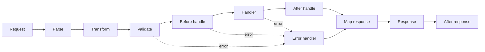

<TLDR>
  <TLDRCell label="what">
    Elysia is a Bun-first TypeScript HTTP framework whose route schemas drive runtime validation, handler types, and response contracts.
  </TLDRCell>
  <TLDRCell label="when">
    Elysia fits when the server and TypeScript client can share API types and the team is prepared to make Bun its primary runtime.
  </TLDRCell>
  <TLDRCell label="how">
    Declare inputs and per-status responses on each route, register lifecycle hooks in the intended scope, then test the real request boundary with `app.handle()` or Eden Treaty.
  </TLDRCell>
</TLDR>

## What it is and why it exists

<Term id="elysia">Elysia</Term> is a TypeScript web framework built primarily for the Bun runtime.
Its chained API composes routes, validation schemas, lifecycle hooks, and plugins. Handler context
exposes a Web-standard `Request`, and returned values ultimately become `Response` objects. You meet it in
Bun HTTP services, full-stack monorepos, and TypeScript systems that want to share server types.

Elysia addresses duplicate descriptions at the HTTP boundary. A conventional project may separately
maintain validators, handler input types, response types, and client interfaces; those descriptions
drift when they evolve independently. Elysia puts a route's path, input schemas, and response schemas
in one declaration, then infers the handler context and application type from it.

The point isn't merely to write a server in TypeScript. TypeScript types disappear after compilation
and cannot reject malicious or malformed network input on their own. An Elysia
<Term id="route-schema">route schema</Term> checks `body`, `query`, `params`, `headers`, `cookie`,
and `response` at runtime while also supplying static types to TypeScript.

The built-in `t` is a TypeBox schema builder tailored to server use. Elysia 1.4 also accepts validators
that implement Standard Schema, so adopting Elysia doesn't force every project to rewrite existing
Zod, Valibot, or other supported schemas. A handler can even use different compatible validators at
different input positions.

Elysia also provides <Term id="eden-treaty">Eden Treaty</Term>. It turns the final Elysia application
type into a tree-shaped, typed client API without generating client files. The path
`/inventory/:sku` maps to a call such as `api.inventory({ sku }).get()`, and status responses can
participate in client-side type narrowing.

That end-to-end type safety has a precise boundary. It depends on the client receiving an application
type compatible with the server at build time. A stale deployment, a non-TypeScript caller, and a
plain HTTP request that bypasses Eden don't become contract-compliant merely because the client
compiled. Public APIs still need a version policy and tests against the real HTTP contract.

Elysia is a natural choice when an application needs Bun, compact route declarations, and a strongly
typed client. If a team must prioritize many runtimes, cannot safely publish server types, or mainly
serves non-TypeScript consumers, Eden's advantage is smaller. Choose the framework based on deployment
constraints, ecosystem compatibility, and how the contract will be delivered.

WebSockets, OpenAPI, authentication, and database adapters are part of the wider ecosystem, but they
aren't prerequisites for understanding Elysia's HTTP core. Learn route schemas, status responses,
hook scope, and the application type first. Add plugins only when a concrete requirement calls for
them, so each boundary remains inspectable.

## How it works

When you call `.get()`, `.post()`, or another route method, you provide a path, a handler, and optional
local configuration. Schemas in that configuration decide whether a request reaches the handler and
provide types for handler parameters. Each chained call returns an Elysia instance whose type includes
the registered routes, and this final type becomes the input to an Eden client.

Request processing isn't one middleware function; it is a staged lifecycle. A
<Term id="lifecycle-hook">lifecycle hook</Term> puts parsing, validation, authorization, response
mapping, and cleanup at a phase with a defined responsibility. Returning a response from a hook can
short-circuit later phases, while a thrown error enters the error-handling path.



The common phases answer different questions:

1. `onRequest` observes a new request before route resolution and suits request-level rate limits or common response headers.
2. `onParse` converts the request payload into `body`; built-in parsers cover the common content types.
3. `onTransform` adjusts context before validation; `derive` also adds per-request values at this phase.
4. After schema validation, `onBeforeHandle` or `resolve` performs pre-handler work such as authentication and authorization.
5. The handler's value passes through `onAfterHandle` and `mapResponse` before becoming an HTTP response.
6. Errors enter `onError`, and `onAfterResponse` performs logging or cleanup after the response is sent.

Validation occurs before domain handler code. A failed validation produces `422 Unprocessable Entity`
by default. If the product contract requires another error document, map it explicitly in schema error
configuration or `onError`. Don't make a database function the first structural validator; that loses
stable field errors and lets untrusted data travel farther into the application.

A response schema may be one schema or a mapping by status code. With a per-status mapping,
`return status(404, payload)` binds the status and payload in one inferable return value. Compared with
assigning `set.status = 404` and then returning an object, `status()` lets TypeScript verify that the
payload satisfies the response schema associated with `404`.

A plugin is another Elysia instance. It can carry routes, decorators, schemas, and hooks before `.use()`
composes it into a parent application. Hooks are encapsulated in their instance and descendants by
default. The `local`, `scoped`, and `global` scopes determine whether they are lifted to a parent or
propagated farther.

Registration order has semantics. Apart from the special global behavior of `onRequest`, an interceptor
normally affects only routes registered after it. An authentication hook placed after a protected route
cannot protect that earlier route, even when the two declarations appear close together in the file.

`app.handle(request)` passes a Web-standard `Request` directly to the application without binding a
port. Eden Treaty uses the same in-process path when it receives an application instance. Those entry
points suit examples and integration tests; put `.listen()` in a separate deployment entry point so
importing the app in a test doesn't seize a port.

## Examples

The next four examples add one contract layer at a time. Each was executed and type-checked with
Bun 1.3.10, Elysia 1.4.30, and TypeScript 6.0.3. Their output comes from fixed local inputs, with no
network calls or random values.

### Path parameters and status responses

The first route keeps its path parameter schema, success response, and not-found response together.
`app.handle()` sends two requests through Elysia's real router and response mapping without starting
a server.

<Depth level="quick">

```typescript run title="route.ts"
import { Elysia, t } from 'elysia'

const books = new Map([
  ['b-7', { id: 'b-7', title: 'Practical Elysia' }]
])

const app = new Elysia().get('/books/:id', ({ params, status }) => {
  const book = books.get(params.id)
  if (!book) return status(404, { error: 'Book not found' })
  return book
}, {
  params: t.Object({ id: t.String({ pattern: '^b-[0-9]+$' }) }),
  response: {
    200: t.Object({ id: t.String(), title: t.String() }),
    404: t.Object({ error: t.String() })
  }
})

for (const path of ['/books/b-7', '/books/b-8']) {
  const response = await app.handle(new Request(`http://local${path}`))
  console.log(response.status, await response.text())
}
```

```text
200 {"id":"b-7","title":"Practical Elysia"}
404 {"error":"Book not found"}
```

</Depth>

The handler's `params.id` type comes from the schema. A missing record is an explicit `404` branch,
not an exception path, and its payload is constrained by the response schema. A request for
`/books/not-valid` would be rejected by the parameter schema before the handler runs.

### Runtime validation of a request body

The second route accepts an order request. `quantity` must be an integer of at least `1`, and successful
creation produces a schema-backed `201` response. The example prints only the failure status so it
doesn't turn detailed development-mode validation text into a stable public contract.

```typescript run title="validation.ts"
import { Elysia, t } from 'elysia'

const app = new Elysia().post('/orders', ({ body, status }) => {
  return status(201, { orderId: 'o-104', quantity: body.quantity })
}, {
  body: t.Object({
    sku: t.String({ minLength: 1 }),
    quantity: t.Integer({ minimum: 1 })
  }),
  response: {
    201: t.Object({ orderId: t.String(), quantity: t.Integer() })
  }
})

async function send(body: unknown) {
  const response = await app.handle(new Request('http://local/orders', {
    method: 'POST',
    headers: { 'content-type': 'application/json' },
    body: JSON.stringify(body)
  }))
  console.log(response.status, response.ok ? await response.text() : 'rejected')
}

await send({ sku: 'tea-1', quantity: 2 })
await send({ sku: 'tea-1', quantity: 0 })
```

```text
201 {"orderId":"o-104","quantity":2}
422 rejected
```

The valid request reaches the handler, where `body.quantity` is inferred as a number. The zero quantity
is rejected before the handler runs. The schema owns the transport shape; business code and persistence
constraints must still decide whether stock is available and whether this caller may place the order.

### Encapsulated plugin scope

The third example keeps an authentication hook and the protected route in one plugin. The parent's
later `/health` route doesn't inherit this local hook, so it needs no API key. The plugin's `/account`
route always passes through the check.

```typescript run title="plugin-scope.ts"
import { Elysia } from 'elysia'

const accountRoutes = new Elysia({ name: 'account-routes' })
  .onBeforeHandle(({ headers, status }) => {
    if (headers['x-api-key'] !== 'demo-key') {
      return status(401, { error: 'Unauthorized' })
    }
  })
  .get('/account', () => ({ plan: 'team' }))

const app = new Elysia()
  .use(accountRoutes)
  .get('/health', () => ({ ok: true }))

async function check(path: string, apiKey?: string) {
  const headers = apiKey ? { 'x-api-key': apiKey } : undefined
  const response = await app.handle(new Request(`http://local${path}`, { headers }))
  console.log(`GET ${path} -> ${response.status}`)
}

await check('/account')
await check('/health')
await check('/account', 'demo-key')
```

```text
GET /account -> 401
GET /health -> 200
GET /account -> 200
```

This structure makes the authorization boundary travel with the route module instead of relying on
global middleware added later by the parent. Real authentication must verify credentials, principals,
and object permissions. The fixed key demonstrates hook execution only and isn't a production design.

### An in-process Eden client

The last example passes the complete application instance directly to Eden Treaty. The client path,
parameters, and responses come from the application type, and the call opens no socket. The error branch
reads the declared `404` payload through `error.value`.

```typescript run title="eden-client.ts"
import { treaty } from '@elysia/eden'
import { Elysia, t } from 'elysia'

const inventory = new Map([['tea-1', 3]])

const app = new Elysia().get('/inventory/:sku', ({ params, status }) => {
  const stock = inventory.get(params.sku)
  if (stock === undefined) return status(404, { error: 'Not found' })
  return { sku: params.sku, stock }
}, {
  params: t.Object({ sku: t.String() }),
  response: {
    200: t.Object({ sku: t.String(), stock: t.Integer() }),
    404: t.Object({ error: t.String() })
  }
})

const api = treaty(app)
const found = await api.inventory({ sku: 'tea-1' }).get()
const missing = await api.inventory({ sku: 'coffee-9' }).get()

console.log(found.status, JSON.stringify(found.data))
console.log(missing.status, JSON.stringify(missing.error?.value))
```

```text
200 {"sku":"tea-1","stock":3}
404 {"error":"Not found"}
```

Passing an instance to `treaty()` works well in tests. A browser or separate service instead receives
a URL and imports the published application type with `import type`. Both forms share a call interface,
but only the URL form crosses a real network, proxy, TLS boundary, and deployed version. Keep a small
set of end-to-end tests before release.

## Pitfalls

### Treating a type assertion as validation

> [!PITFALL]
> Generated code often treats `body as CreateOrder` as input validation; the assertion changes only the compiler's view and checks no field at runtime.

Without a `body` schema, untrusted JSON can carry missing fields, wrong types, or extra properties into
domain code. Interfaces and generics inside the handler cannot repair that boundary because they have
already disappeared from the runtime artifact.

**Fix:** declare a runtime schema at every untrusted input position and validate domain invariants
separately. Test missing values, boundary values, wrong content types, and malformed JSON instead of
checking only whether the editor displays the intended type.

### Exporting the application type too early

> [!PITFALL]
> Saving `const app = new Elysia()` and then adding routes in detached statements leaves the exported variable's type at the empty application.

The runtime routes may still register, so a simple `fetch` test won't expose the problem. Eden depends
on the static `typeof app`; its client can lose paths or acquire the wrong types until a consumer tries
to compile.

**Fix:** keep application composition chained, or assign each returned instance to a deliberate new
variable. Export the application type only from the final composition result. Add a compile-time client
case that accesses important paths and narrows both success and error statuses.

### Ignoring hook order and encapsulation

> [!PITFALL]
> An authentication hook placed after a route normally doesn't retroactively protect it, and a plugin's local hook doesn't automatically protect routes later registered on the parent.

The application can start normally despite this bug, and a public health check still passes. Seeing that
a plugin was passed to `.use()` is not evidence that its authorization logic covers the intended
endpoint.

**Fix:** keep protected routes inside the same plugin or `guard` boundary and register the hook before
those routes. When propagation to a parent is genuinely required, select `scoped` or `global` explicitly,
then probe each protected endpoint without credentials.

### Letting status and response schema drift

> [!PITFALL]
> A generated handler may return `{ error: ... }` under `200`, or mutate `set.status` and return an object that doesn't satisfy that status's response schema.

Clients depend on the status code to choose a success or error branch, not just on the JSON shape.
Declaring only a `200` response prevents Eden from accurately representing business `400`, `401`, `404`,
or conflict states.

**Fix:** declare schemas for the statuses the route actually returns and bind each pair with
`return status(code, payload)`. Test status, content type, and body for every branch instead of snapshotting
only successful JSON.

### Treating shared types as deployment proof

> [!PITFALL]
> A locally compiling Eden client proves only that it matches the application type present at build time, not that the target URL runs the same service version.

Even a monorepo can release the frontend first, roll the server back, or cache an older types package.
Independent consumers are more likely to bypass Eden entirely, so TypeScript cannot detect incorrect
public HTTP behavior for them.

**Fix:** version the shared types package, relate artifacts to service versions, and run real HTTP
contract tests against the release candidate. Client types shorten the feedback loop; they do not replace
compatibility policy, runtime validation, or monitoring.

### Listening during application import

> [!PITFALL]
> If the route-definition module calls `.listen()` during import, tests, scripts, and type consumers acquire port and process side effects.

Tests can become flaky because a port is occupied, and a build tool may start a server merely to inspect
types. A circular dependency can also make an Eden client import server runtime code by mistake.

**Fix:** export the complete `app` without listening, and call `app.listen()` from a separate deployment
entry point. Clients use `import type`; unit and integration tests call the app through `app.handle()`
or `treaty(app)`.

## In the AI era

**What generated code gets wrong here**

Models often mix examples from different Elysia generations. They may keep importing the old
`@elysiajs/eden` namespace in new code or use legacy call syntax that doesn't match the current
`treaty()` result. They also omit request schemas while claiming runtime type safety, append routes
after exporting the application type, place authentication hooks after their target routes, and model
only success while every error falls through to `200` or an untyped exception path.

**Ask your AI to check**

- List each route's `body`, `query`, `params`, `headers`, and per-status response schemas, and identify every unvalidated input.
- Expand plugins and hooks in registration order, stating which `beforeHandle` and `onError` hooks each target route actually runs.
- Compare the application type version used by Eden with the service version to be deployed, then generate contract tests against the real HTTP boundary.

**Review checklist**

- Send malformed, out-of-range, and unauthorized requests to every write route and prove that handler side effects don't occur.
- Confirm that the final `typeof app` includes every route and make the client compile both success and error status branches.
- Confirm that test imports don't bind a port and that only the deployment entry point owns `.listen()` and shutdown.

**Prompt vocabulary**

Use the precise terms `route schema`, `runtime validation`, `response schema by status`, `lifecycle hook`,
`plugin scope`, `registration order`, `final app type`, and `in-process Treaty client`. These terms force
the model to name boundaries. “Generate a type-safe API” doesn't distinguish static assistance, runtime
rejection, and deployment compatibility.

<Depth level="deep">

## Type boundaries and deployment boundaries

An Elysia route declaration participates in three stages, but those stages are not interchangeable.
Understanding the evidence from each one makes “type-safe” a testable claim.

| Stage | Primary input | What it can prove | What it cannot prove |
| --- | --- | --- | --- |
| TypeScript compilation | Final app type and client source | Client call shape matches that type | The target runs that deployed version |
| Elysia runtime | Request, response, and route schemas | This exchange passes declared structural checks | Database invariants and object authorization are correct |
| Release verification | Candidate deployment and public contract | Observable HTTP behavior matches the target contract | Every business scenario is correct |

Type accumulation in the chained API depends on return types. Each route call returns a more specific
Elysia instance type. `typeof app` sees only the variable's current static type; it doesn't reconstruct
later runtime mutations. “The route responds” and “Eden can see the route” therefore need separate tests.

Schema inference has a direction too. Input schemas tell the handler which validated shape it receives,
while response schemas restrict the shapes it may return. If a handler calls an untyped service and
receives `any`, that value can evade compile-time checking; runtime response validation remains a separate
boundary that can stop a bad payload from leaving the service.

Per-status response schemas make success and failure a discriminated union. `status(404, payload)` does
more than set a number: it preserves the status in the return type so both the server and Eden client can
narrow the payload by status. An undeclared exception still needs `onError` to map it to a stable public
error format.

Eden's zero-code-generation model sends the contract through TypeScript types rather than generating and
committing a second client source tree. A monorepo can use `import type` directly; multiple repositories
need a published types-only package. Both designs must pin compatible versions or consumers will see a
type that leads or lags the target service.

Don't bundle the full service implementation into a browser application. A client imports only the type
and gets runtime code from `@elysia/eden`; an artifact check should confirm that server dependencies
haven't leaked into the frontend. Environment reads or database imports in a types package show that the
application type and deployment entry point haven't been separated cleanly.

When a public interface needs an independent description, an OpenAPI plugin can derive a document from
route schemas, but the generated result still needs review. Route schemas describe structure well; they
do not automatically supply authorization semantics, idempotency, transaction boundaries, or compatibility
promises. Treat the generated document as a candidate contract, not as deployment evidence.

Testing should build layered evidence. Pure handler tests locate domain errors, `app.handle()` or
`treaty(app)` covers routing, validation, and response mapping, and real-network tests cover the base URL,
proxy, response headers, TLS, and deployed version. Keep every layer because the preceding one cannot
observe the next layer's failure modes.

## Lifecycle scope and registration order

Elysia's lifecycle has both phase order and registration order. Phase order decides when a hook runs;
registration order decides which routes own it. A review must draw both axes rather than merely list
hook names.

Local scope is the default plugin encapsulation. Hooks inside a plugin apply to that instance and its
descendants, but they don't spill into sibling routes later registered on the parent that uses the plugin.
This default lets authentication, tenant resolution, or response formatting travel with a route module.

| Scope | Coverage | Typical use |
| --- | --- | --- |
| `local` | Current instance and its descendants | Module-private authentication and transformation |
| `scoped` | Parent, current instance, and descendants | Sharing context across a direct composition boundary |
| `global` | All relevant instances that use the plugin | Hooks deliberately propagated through the application |

Larger scope creates more implicit coupling. Don't switch immediately to `global` because one route lacks
a derived value. First decide whether that route belongs inside the plugin or should receive its dependency
as an explicit service. After widening scope, regression-test unrelated routes so they don't accidentally
gain an authentication requirement or response transformation.

A hook must be registered before later routes can inherit it. The same rule applies to the position of
`.use()` in the chain: a parent error handler placed after a plugin may not supply the expected mapping to
that plugin's routes. Put application-wide observation and error boundaries near the beginning of the
composition chain, and keep local rules in the plugin that owns their routes.

`onRequest` is the exception to understand separately. It runs before a route has been selected, so it
lacks ordinary route-level context and acts as a global request event. Logic that needs path parameters
or a validated principal belongs later, in post-validation `beforeHandle` or `resolve`.

`derive` adds typed context values per request during the transform phase and suits synchronous work such
as creating a request ID or normalizing existing context. `resolve` runs after validation and before the
handler, which suits asynchronously resolving a principal from validated credentials. Neither operation
implements authorization by itself; the principal must still be compared with the target resource and action.

Short-circuiting is also part of the contract. When `beforeHandle` returns `401`, the domain handler must
not run. Once an error handler returns a value, the mapping phase still produces the final `Response`.
Tests should assert not only the status but, through a counter or test double, that a short-circuited write
did not occur.

`afterResponse` happens after the response has been sent and suits cleanup or observation that cannot alter
it. Auditing, payment, or message publication that must complete reliably cannot live there alone: the client
already has a result and a later failure cannot be expressed in that response. Such effects need a transaction,
an outbox, or an explicit asynchronous delivery design.

Naming a plugin helps Elysia deduplicate and diagnose it, but the name doesn't create an authorization
boundary. The real boundary comes from the plugin instance, scope, registration position, and tested route
set. A code review should ask for all four instead of accepting “the authentication plugin is installed.”

</Depth>

<Checkpoint id="backend/elysia" />

## Further reading

- [Elysia documentation](https://elysiajs.com/)
- [Elysia validation](https://elysiajs.com/essential/validation)
- [Elysia lifecycle](https://elysiajs.com/essential/life-cycle)
- [Elysia plugins and scope](https://elysiajs.com/essential/plugin)
- [Eden Treaty overview](https://elysiajs.com/eden/treaty/overview)
