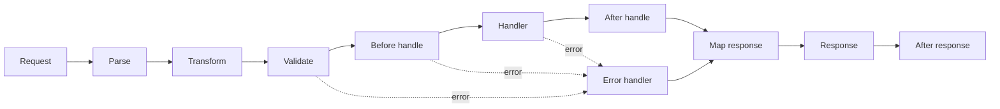

<TLDR>
  <TLDRCell label="what">
    Elysia是面向Bun的TypeScript HTTP框架；路由模式同时驱动运行时验证、处理器类型和响应契约。
  </TLDRCell>
  <TLDRCell label="when">
    当服务端和TypeScript客户端可以共享API类型，且团队愿意把Bun作为主要运行时时，Elysia很合适。
  </TLDRCell>
  <TLDRCell label="how">
    先为每条路由声明输入与各状态码响应，再按作用域注册生命周期钩子，最后用`app.handle()`或Eden Treaty测试真实请求边界。
  </TLDRCell>
</TLDR>

## 是什么，为什么存在

<Term id="elysia">Elysia</Term>是一个以Bun为主要运行时的TypeScript Web框架。
它用链式API组合路由、验证模式、生命周期钩子和插件。处理器上下文会暴露Web标准的
`Request`，返回值最终转换为`Response`。你通常会在Bun HTTP服务、同仓库的全栈应用，
以及希望共享服务端类型的TypeScript系统中遇到它。

Elysia解决的是HTTP边界重复描述的问题。传统项目可能分别维护验证器、处理器输入类型、
响应类型和客户端接口；这些描述一旦独立演进，就会发生漂移。Elysia把一条路由的路径、
输入模式和响应模式放在同一个声明中，再从该声明推断处理器上下文和应用类型。

这里的关键不只是“用TypeScript写服务器”。TypeScript类型在编译后会消失，无法自行拒绝
恶意或格式错误的网络输入。Elysia的<Term id="route-schema">路由模式（route schema）</Term>
会在运行时检查`body`、`query`、`params`、`headers`、`cookie`和`response`，同时向
TypeScript提供静态类型。

框架内置的`t`是针对服务端用法定制的TypeBox模式构造器。Elysia 1.4也接受实现
Standard Schema的验证库，因此采用Elysia不等于所有项目都必须改写现有的Zod、Valibot
或其他受支持模式。一个处理器甚至可以在不同输入位置使用不同的兼容验证器。

Elysia还提供<Term id="eden-treaty">Eden Treaty</Term>。它从最终Elysia应用类型生成
树状的类型化客户端调用界面，不需要生成客户端文件。路径`/inventory/:sku`会对应类似
`api.inventory({ sku }).get()`的调用，状态码响应也能参与客户端的类型收窄。

这种端到端类型安全有明确边界。它依赖客户端在构建时拿到与服务端兼容的应用类型；
已经部署但版本滞后的服务、非TypeScript调用方和绕过Eden的普通HTTP请求，
不会因为客户端编译通过就自动符合契约。公开API仍需要版本策略和真实HTTP契约测试。

当应用需要Bun、紧凑的路由声明和强类型客户端时，Elysia是自然选择。如果团队必须优先
覆盖许多运行时、服务端类型不能安全发布，或者API的主要消费者不是TypeScript，
Eden的优势会减弱；此时应按部署约束、生态兼容性和契约交付方式选择框架。

WebSocket、OpenAPI插件、认证插件和数据库适配器都属于更大的生态，但它们不是理解
Elysia HTTP核心的前提。先掌握路由模式、状态响应、钩子作用域和应用类型，
再按实际需求引入插件，能让边界保持可检查。

## 工作原理

调用`.get()`、`.post()`或其他路由方法时，你提供路径、处理器和可选的本地配置。
配置中的模式决定请求能否进入处理器，并为处理器参数提供类型。链式调用返回的新Elysia
实例类型会累计已经注册的路由，这个最终类型也是Eden客户端的输入。

请求执行不是单个中间件函数，而是分阶段的生命周期。<Term id="lifecycle-hook">生命周期钩子
（lifecycle hook）</Term>把解析、验证、授权、响应改写和清理放在责任明确的位置。
钩子返回响应时，部分后续阶段会被短路；钩子抛错时则进入错误处理路径。



常用阶段各自回答不同问题：

1. `onRequest`在路由解析前观察新请求，适合请求级限流或通用响应头。
2. `onParse`把请求体转换为`body`，内置解析器已覆盖常见内容类型。
3. `onTransform`在验证前调整上下文；`derive`也在这一阶段追加每请求值。
4. 模式验证之后，`onBeforeHandle`或`resolve`执行认证、授权等处理器前逻辑。
5. 处理器的返回值经过`onAfterHandle`和`mapResponse`，再转换为HTTP响应。
6. 错误进入`onError`，响应发送后由`onAfterResponse`完成日志或清理。

验证发生在业务处理器之前。默认验证失败会得到`422 Unprocessable Entity`；若产品契约要求
另一种错误文档，可以在模式的错误配置或`onError`中明确映射。不要让数据库函数承担第一道
结构验证，因为那会丢失稳定的字段错误，也会扩大不可信输入的传播范围。

响应模式可以是单一模式，也可以按状态码映射。按状态码声明时，`return status(404, payload)`
会把状态与负载绑定在一个可推断的返回值中。相比先写`set.status = 404`再返回对象，
`status()`能让TypeScript检查该负载是否符合`404`对应的响应模式。

插件本质上也是Elysia实例。插件可以携带路由、装饰值、模式和钩子，再由`.use()`
组合进父应用。钩子默认封装在自己的实例和后代中；是否提升到父级或全局，
由`local`、`scoped`和`global`作用域决定。

注册顺序具有语义。除`onRequest`的特殊全局行为外，一个拦截钩子通常只影响在它之后
注册的路由。认证钩子写在受保护路由之后，即使源码中两者距离很近，也不能保护前面的路由。

`app.handle(request)`直接把Web标准`Request`交给应用，不需要监听端口。
Eden Treaty接收应用实例时也走这条进程内路径。这两个入口适合示例和集成测试；
部署入口再单独调用`.listen()`，避免测试导入模块时抢占端口。

## 示例

下面四个示例逐步增加一层契约。它们都在Bun 1.3.10、Elysia 1.4.30和TypeScript 6.0.3
下执行并检查过；输出来自同一组固定输入，没有依赖网络或随机值。

### 路径参数与状态响应

第一条路由把路径参数模式、成功响应和未找到响应放在同一处。`app.handle()`让两个请求
直接穿过真实的Elysia路由与响应映射，而不启动服务器。

<Depth level="quick">

```typescript run title="route.ts"
import { Elysia, t } from 'elysia'

const books = new Map([
  ['b-7', { id: 'b-7', title: 'Practical Elysia' }]
])

const app = new Elysia().get('/books/:id', ({ params, status }) => {
  const book = books.get(params.id)
  if (!book) return status(404, { error: 'Book not found' })
  return book
}, {
  params: t.Object({ id: t.String({ pattern: '^b-[0-9]+$' }) }),
  response: {
    200: t.Object({ id: t.String(), title: t.String() }),
    404: t.Object({ error: t.String() })
  }
})

for (const path of ['/books/b-7', '/books/b-8']) {
  const response = await app.handle(new Request(`http://local${path}`))
  console.log(response.status, await response.text())
}
```

```text
200 {"id":"b-7","title":"Practical Elysia"}
404 {"error":"Book not found"}
```

</Depth>

处理器中的`params.id`来自模式推断。未找到记录不是异常路径，而是显式的`404`分支；
这个分支的负载也由响应模式约束。如果请求使用`/books/not-valid`，参数模式会在处理器前拒绝它。

### 请求体的运行时验证

第二条路由接受订单请求。`quantity`必须是至少为`1`的整数，成功创建则返回带模式的
`201`响应。示例只打印失败状态，避免把面向开发环境的详细验证文本当成稳定公共契约。

```typescript run title="validation.ts"
import { Elysia, t } from 'elysia'

const app = new Elysia().post('/orders', ({ body, status }) => {
  return status(201, { orderId: 'o-104', quantity: body.quantity })
}, {
  body: t.Object({
    sku: t.String({ minLength: 1 }),
    quantity: t.Integer({ minimum: 1 })
  }),
  response: {
    201: t.Object({ orderId: t.String(), quantity: t.Integer() })
  }
})

async function send(body: unknown) {
  const response = await app.handle(new Request('http://local/orders', {
    method: 'POST',
    headers: { 'content-type': 'application/json' },
    body: JSON.stringify(body)
  }))
  console.log(response.status, response.ok ? await response.text() : 'rejected')
}

await send({ sku: 'tea-1', quantity: 2 })
await send({ sku: 'tea-1', quantity: 0 })
```

```text
201 {"orderId":"o-104","quantity":2}
422 rejected
```

有效请求到达处理器，而且`body.quantity`被推断为数字。数量为零的请求在调用处理器之前
就被拒绝。模式负责的是传输结构；库存是否足够、调用方能否下单等领域规则仍需业务代码和
持久层约束。

### 插件的封装作用域

第三个示例把认证钩子与受保护路由封装在同一个插件中。父应用随后添加的`/health`
不继承该本地钩子，因此无需API key；插件内部的`/account`则始终经过检查。

```typescript run title="plugin-scope.ts"
import { Elysia } from 'elysia'

const accountRoutes = new Elysia({ name: 'account-routes' })
  .onBeforeHandle(({ headers, status }) => {
    if (headers['x-api-key'] !== 'demo-key') {
      return status(401, { error: 'Unauthorized' })
    }
  })
  .get('/account', () => ({ plan: 'team' }))

const app = new Elysia()
  .use(accountRoutes)
  .get('/health', () => ({ ok: true }))

async function check(path: string, apiKey?: string) {
  const headers = apiKey ? { 'x-api-key': apiKey } : undefined
  const response = await app.handle(new Request(`http://local${path}`, { headers }))
  console.log(`GET ${path} -> ${response.status}`)
}

await check('/account')
await check('/health')
await check('/account', 'demo-key')
```

```text
GET /account -> 401
GET /health -> 200
GET /account -> 200
```

这个结构让权限边界跟随路由模块，而不是依赖父应用稍后补上一段全局中间件。真实认证还要
校验凭据、主体和对象权限；固定key只用于展示钩子是否执行，不能作为生产认证方案。

### 进程内Eden客户端

最后一个示例把完整应用实例直接交给Eden Treaty。客户端路径、参数和响应来自应用类型，
调用不会打开套接字；错误分支通过`error.value`读取已声明的`404`负载。

```typescript run title="eden-client.ts"
import { treaty } from '@elysia/eden'
import { Elysia, t } from 'elysia'

const inventory = new Map([['tea-1', 3]])

const app = new Elysia().get('/inventory/:sku', ({ params, status }) => {
  const stock = inventory.get(params.sku)
  if (stock === undefined) return status(404, { error: 'Not found' })
  return { sku: params.sku, stock }
}, {
  params: t.Object({ sku: t.String() }),
  response: {
    200: t.Object({ sku: t.String(), stock: t.Integer() }),
    404: t.Object({ error: t.String() })
  }
})

const api = treaty(app)
const found = await api.inventory({ sku: 'tea-1' }).get()
const missing = await api.inventory({ sku: 'coffee-9' }).get()

console.log(found.status, JSON.stringify(found.data))
console.log(missing.status, JSON.stringify(missing.error?.value))
```

```text
200 {"sku":"tea-1","stock":3}
404 {"error":"Not found"}
```

把实例传给`treaty()`很适合测试。浏览器或独立服务则传入URL，并用`import type`
取得已发布的应用类型。两种形式共享调用界面，但只有URL形式会经历真实网络、代理、TLS
和已部署版本，因此发布前仍需保留少量端到端测试。

## 陷阱

### 把类型断言当成验证

> [!PITFALL]
> 生成代码常把`body as CreateOrder`当成输入验证；断言只改变编译器看法，运行时不会检查任何字段。

没有`body`模式时，不可信JSON可以携带缺失字段、错误类型或额外属性进入业务逻辑。
处理器内的接口和泛型不能修复这个边界，因为它们已经从运行产物中消失。

**修复方法：** 为每个不可信输入位置声明运行时模式，并单独验证领域不变量。测试缺失值、
边界值、错误内容类型和畸形JSON，而不只测试编辑器是否显示了正确类型。

### 导出过早的应用类型

> [!PITFALL]
> 先保存`const app = new Elysia()`，再用不接收返回值的独立语句添加路由，会让导出的变量类型停留在空应用。

运行时路由可能仍然注册成功，因此简单的`fetch`测试看不出问题。Eden依赖静态的
`typeof app`，客户端会缺少路径或退化为不正确的类型，直到消费方编译时才暴露。

**修复方法：** 保持链式组合，或把每次调用返回的新实例赋回明确变量；只从最终组合结果导出
应用类型。为客户端包增加一个编译期用例，确认关键路径和错误状态可以被正确访问。

### 忽略钩子顺序与封装

> [!PITFALL]
> 放在路由之后的认证钩子通常不会追溯保护该路由；插件中的本地钩子也不会自动保护父应用后来注册的路由。

这类错误最危险的地方是应用可以正常启动，公开健康检查也会通过。只看插件是否被`.use()`
并不足以证明权限检查覆盖了目标端点。

**修复方法：** 把受保护路由放在同一个插件或`guard`边界内，并在路由之前注册钩子。
确实需要向父级传播时显式选择`scoped`或`global`，再用未认证请求逐条验证受保护端点。

### 状态码与响应模式脱节

> [!PITFALL]
> 生成处理器会返回`{ error: ... }`却保留`200`，或修改`set.status`后返回不符合该状态响应模式的对象。

客户端不仅依赖JSON形状，也依赖状态码来选择成功或错误分支。只声明`200`响应，
会让Eden无法准确表示业务中的`400`、`401`、`404`或冲突状态。

**修复方法：** 按实际状态码声明响应模式，并使用`return status(code, payload)`绑定两者。
测试每个状态分支的状态、内容类型和响应体，而不是只对成功JSON做快照。

### 把共享类型当成部署证明

> [!PITFALL]
> Eden客户端在本地编译通过，只能证明它匹配构建时看到的应用类型，不能证明目标URL正在运行同一服务版本。

单仓库也可能出现前端先发布、服务端回滚或缓存旧类型包的情况。独立消费者更可能完全绕过
Eden，因此错误的公开HTTP行为不会由TypeScript捕获。

**修复方法：** 给共享类型包做版本管理，把发布物关联到服务版本，并针对部署候选运行真实
HTTP契约测试。客户端类型用于缩短反馈周期，不替代兼容性政策、运行时验证或监控。

### 在应用模块中立即监听

> [!PITFALL]
> 如果定义路由的模块在导入时就调用`.listen()`，测试、脚本和类型消费者会产生端口与进程副作用。

测试可能因端口占用变得不稳定，构建工具也可能仅为读取类型而启动服务器。循环依赖还会
让Eden客户端错误地导入服务端运行时代码。

**修复方法：** 导出不监听端口的完整`app`，在单独部署入口中调用`app.listen()`。
客户端使用`import type`；单元和集成测试通过`app.handle()`或`treaty(app)`调用应用。

<Depth level="deep">

## 类型边界与部署边界

Elysia的路由声明同时参与三个阶段，但三个阶段不是一回事。理解它们的证据范围，
才能判断“类型安全”究竟保护了什么。

| 阶段 | 主要输入 | 能证明什么 | 不能证明什么 |
| --- | --- | --- | --- |
| TypeScript编译 | 最终应用类型与客户端源码 | 客户端调用形状匹配该类型 | 目标服务已部署同一版本 |
| Elysia运行时 | 请求、响应与路由模式 | 当前交换通过已声明的结构检查 | 数据库不变量与对象授权正确 |
| 发布验证 | 部署候选与公开契约 | 可观察HTTP行为符合目标契约 | 所有业务场景都正确 |

链式API的类型累计依赖返回类型。每次路由调用都返回一个类型更具体的Elysia实例；
`typeof app`只观察变量当前的静态类型，不会回看运行时对象后来发生过哪些变更。
因此“路由能响应”与“Eden能看到路由”需要分别验证。

模式推断也有方向。输入模式告诉处理器已经验证的数据形状，响应模式限制处理器可以返回的
形状。若处理器调用无类型服务并得到`any`，`any`可能绕过编译期检查；运行时响应验证
仍是阻止错误负载离开服务的一道独立边界。

逐状态响应模式让成功与失败成为可区分联合。`status(404, payload)`不只是设置一个数字，
它把状态码保留在返回类型中，让服务端和Eden客户端都能按状态缩小负载类型。
未声明的异常仍需由`onError`转成稳定的公共错误格式。

Eden的零代码生成意味着契约以TypeScript类型传递，而不是生成并提交另一套客户端源码。
同仓库可以直接`import type`，多仓库则需要发布只含类型的包。两种方式都必须固定兼容版本，
否则消费方看到的类型会领先或落后于目标服务。

不要把整个服务实现打进浏览器包。客户端只应导入类型，运行时代码从`@elysia/eden`
取得；构建产物检查应确认服务端依赖没有泄漏到前端。类型包中若包含环境读取或数据库导入，
说明应用类型与部署入口还没有正确分离。

公开接口还需要独立描述时，可以从路由模式生成OpenAPI文档，但生成结果仍要经过评审。
路由模式擅长描述结构，不会自动补全授权语义、幂等性、事务边界或兼容承诺。
把生成文档当作候选契约，而不是部署事实。

测试应形成分层证据。处理器纯逻辑测试定位领域错误，`app.handle()`或`treaty(app)`
覆盖路由、验证和响应映射，真实网络测试再覆盖基础URL、代理、响应头、TLS与部署版本。
每一层都保留，是因为上一层无法观察下一层的故障。

## 生命周期作用域与注册顺序

Elysia的生命周期既有阶段顺序，也有注册顺序。阶段顺序决定“什么时候执行”，注册顺序决定
“哪些路由拥有这个钩子”。审查中必须同时画出两条轴，不能只列钩子名称。

本地作用域是插件封装的默认值。插件内部钩子适用于该实例及其后代，却不会自动溢出到使用
插件的父实例后来注册的兄弟路由。这个默认值让认证、租户解析或响应格式可以随路由模块一起移动。

| 作用域 | 覆盖范围 | 典型用途 |
| --- | --- | --- |
| `local` | 当前实例及其后代 | 模块私有认证与转换 |
| `scoped` | 父级、当前实例及其后代 | 向直接组合边界共享上下文 |
| `global` | 使用该插件的所有相关实例 | 明确需要全应用传播的钩子 |

作用域越大，隐式耦合越多。不要因为某条路由缺少派生值就立即改成`global`；先确认路由是否
本应位于插件内部，或者是否应通过显式服务参数获得依赖。扩大作用域后要回归测试不相关路由，
防止它们意外获得认证要求或响应改写。

钩子必须先注册，后面的路由才能继承。这个规则也适用于`.use()`的组合位置：父级错误处理器
若写在插件之后，插件路由可能不会获得预期映射。把全应用观察和错误边界放在组合链前部，
把局部规则放进拥有目标路由的插件。

`onRequest`是需要单独理解的例外。它在路由尚未确定时运行，因此没有普通路由级上下文，
也按全局请求事件处理。需要路径参数或已验证主体的逻辑不应放在这里；应推迟到验证后的
`beforeHandle`或`resolve`。

`derive`在每个请求的transform阶段增加有类型的上下文值，适合从已存在上下文同步计算
请求ID或规范化信息。`resolve`位于验证之后、处理器之前，适合异步解析已验证凭据对应的主体。
两者都不会自动实现授权，返回的主体仍需与目标资源和动作比较。

短路也是契约的一部分。`beforeHandle`返回`401`后，业务处理器不应执行；错误处理器返回
响应后，映射阶段仍要形成最终`Response`。测试不仅要断言状态，还要用计数器或测试替身证明
被短路的写操作没有发生。

`afterResponse`发生在响应发送之后，适合不改变响应的清理和观测。需要可靠完成的审计、
付款或消息发布不能仅放在这里，因为客户端已经收到结果，后续失败无法通过该响应表达。
这些副作用需要事务、outbox或明确的异步交付设计。

给插件命名有助于框架去重和诊断，但名字本身不定义权限边界。真正的边界来自插件实例、
作用域、注册位置和测试到的路由集合。代码审查应要求展示这四项，而不是接受“已经使用认证插件”
这样的概括。

</Depth>

<Checkpoint id="backend/elysia" />

## 延伸阅读

- [Elysia文档](https://elysiajs.com/)
- [Elysia验证](https://elysiajs.com/essential/validation)
- [Elysia生命周期](https://elysiajs.com/essential/life-cycle)
- [Elysia插件与作用域](https://elysiajs.com/essential/plugin)
- [Eden Treaty概览](https://elysiajs.com/eden/treaty/overview)
