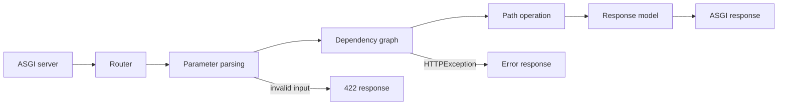

<TLDR>
  <TLDRCell label="what">
    FastAPI is an ASGI-based Python API framework. It derives request rules, response shapes, and an OpenAPI description from type annotations.
  </TLDRCell>
  <TLDRCell label="when">
    Choose FastAPI when an HTTP service centers on JSON contracts, input validation, dependency composition, and asynchronous I/O.
  </TLDRCell>
  <TLDRCell label="how">
    Describe requests and responses with Pydantic models, compose authentication and resources with `Depends`, then test status codes, bodies, and the contract over HTTP.
  </TLDRCell>
</TLDR>

## What it is and why it exists

<Term id="fastapi">FastAPI</Term> is a Python web framework for building HTTP APIs. It uses Starlette for web and concurrency mechanics, Pydantic for parsing and validation, and route declarations to generate OpenAPI documentation. One function signature serves the runtime, editor, and interface documentation, reducing the chance that three descriptions drift apart.

The central problem FastAPI solves isn't “how to return JSON,” but how to keep an API boundary explicit. Path parameters come from the URL, simple scalars normally come from the query string, Pydantic models normally come from the request body, and explicit `Header`, `Cookie`, `Query`, and `Body` metadata can override inference. A parsing failure produces a structured `422` response before business code runs.

FastAPI is an application framework, not a production network server.
Deployment still requires an ASGI-compatible server and separate decisions about processes, proxies, timeouts, and observability boundaries.

It fits contract-oriented JSON services, internal microservices, and I/O-heavy endpoints that wait for a database or external API. An application that needs an integrated admin, template system, and full ORM conventions may fit Django better; a script with a handful of fixed endpoints may not need a full framework. Choose from interface and operational requirements, not an unqualified performance ranking.

Python type annotations don't validate network input by themselves. FastAPI reads them at runtime and delegates conversion and validation to Pydantic, so `item_id: int` is both Python type information and a request parsing rule. Business authorization, database uniqueness, and concurrent-write invariants still require separate enforcement.

## How it works

A FastAPI application is an <Term id="asgi">ASGI</Term> application. An ASGI server passes request events to the application, the router selects a path operation by HTTP method and path, and the dependency system resolves required values before calling the handler. Response serialization turns the return value into ASGI response events.



The signature and route template jointly determine parameter sources. A parameter whose name appears in the path template comes from the path; simple types such as `str`, `int`, and `bool` normally come from the query string; a Pydantic model comes from the JSON body. `Annotated` keeps the Python type visible to editors and static checkers while attaching FastAPI metadata.

<Term id="dependency-injection">Dependency injection</Term> declares values a handler needs with `Depends`. Dependencies can declare sub-dependencies, so authentication, tenant selection, database sessions, and shared query parameters form a graph. A dependency can raise `HTTPException` to end a request early, or use one `yield` to acquire a resource before the request and clean it up afterward.

By default, the same dependency callable runs once in a request and its result is reused by every node that needs it. That cache is scoped to the current request, not shared across requests; use `Depends(..., use_cache=False)` only when the dependency must be evaluated again within one request. Test overrides are also keyed by callable identity, so the override key must be the original function object.

A handler return annotation or the decorator's `response_model` establishes a <Term id="response-model">response model</Term>. FastAPI uses it to validate, serialize, and filter returned data; when both forms are present, `response_model` takes priority. Output filtering is an important security boundary, provided the public model declares only fields that may leave the service.

The declarations also generate <Term id="openapi">OpenAPI</Term> documentation. Paths, parameters, request bodies, response bodies, and security requirements introduced by dependencies become part of the schema, available at `/openapi.json` by default. Swagger UI and ReDoc are views of that schema, not separate contracts.

An `async def` path operation is awaited directly on the event loop and fits clients that support `await`. A normal `def` path operation or synchronous dependency runs in a thread pool and fits a boundary that must call a blocking library. Ordinary helper functions called directly inside a handler receive no special treatment, so a blocking call inside `async def` still blocks the event loop.

## Examples

### Path and query parameters

The first application relies on the signature to infer two parameter sources. The test client calls the ASGI application in-process without listening on a real port.

<Depth level="quick">

```python run title="parameter_sources.py"
from fastapi import FastAPI
from fastapi.testclient import TestClient

app = FastAPI()


@app.get("/items/{item_id}")
def read_item(item_id: int, details: bool = False) -> dict[str, int | bool]:
    return {"item_id": item_id, "details": details}


client = TestClient(app)

valid = client.get("/items/7", params={"details": "true"})
print(valid.status_code, valid.json())

invalid = client.get("/items/not-an-int")
error = invalid.json()["detail"][0]
print(invalid.status_code, error["loc"], error["type"])
```

```text
200 {'item_id': 7, 'details': True}
422 ['path', 'item_id'] int_parsing
```

</Depth>

`item_id` is named in the route template, so it comes from the path; `details`, which has a default, comes from the query string. FastAPI converts the text `true` to a Boolean and reports the non-integer path value as an `int_parsing` error whose location identifies `path.item_id`.

### Separate input and output models

The input model accepts a supplier note, but the public response model has no such field. The route declaration performs the filtering instead of relying on the handler to remember to delete internal fields.

```python run title="request_response_models.py"
from fastapi import FastAPI, status
from fastapi.testclient import TestClient
from pydantic import BaseModel, Field


class ProductIn(BaseModel):
    name: str = Field(min_length=2)
    price_cents: int = Field(gt=0)
    supplier_note: str


class ProductOut(BaseModel):
    name: str
    price_cents: int


app = FastAPI()


@app.post("/products", response_model=ProductOut, status_code=status.HTTP_201_CREATED)
def create_product(product: ProductIn) -> ProductIn:
    return product


client = TestClient(app)
created = client.post(
    "/products",
    json={"name": "Keyboard", "price_cents": 8900, "supplier_note": "internal"},
)
print(created.status_code, created.json())

invalid = client.post(
    "/products",
    json={"name": "Keyboard", "price_cents": 0, "supplier_note": "internal"},
)
error = invalid.json()["detail"][0]
print(invalid.status_code, error["loc"], error["type"])
```

```text
201 {'name': 'Keyboard', 'price_cents': 8900}
422 ['body', 'price_cents'] greater_than
```

The first request returns `201`, and `supplier_note` doesn't appear in the response. The second request fails before the handler runs because `price_cents` doesn't satisfy its greater-than-zero constraint, so the client receives an error located at `body.price_cents`.

### An authentication dependency and test override

A dependency can centralize header extraction and reject a request. A test replaces the external boundary through `app.dependency_overrides` without adding a test branch to every path operation.

```python run title="dependencies.py"
from typing import Annotated

from fastapi import Depends, FastAPI, Header, HTTPException, status
from fastapi.testclient import TestClient

app = FastAPI()


def current_user(x_api_key: Annotated[str | None, Header()] = None) -> str:
    if x_api_key != "secret-key":
        raise HTTPException(
            status_code=status.HTTP_401_UNAUTHORIZED,
            detail="invalid API key",
        )
    return "ada"


Viewer = Annotated[str, Depends(current_user)]


@app.get("/reports/{name}")
def read_report(name: str, viewer: Viewer) -> dict[str, str]:
    return {"report": name, "viewer": viewer}


client = TestClient(app)
print(client.get("/reports/daily").status_code)
print(client.get("/reports/daily", headers={"X-API-Key": "secret-key"}).json())

app.dependency_overrides[current_user] = lambda: "test-user"
print(client.get("/reports/daily").json())
app.dependency_overrides.clear()
```

```text
401
{'report': 'daily', 'viewer': 'ada'}
{'report': 'daily', 'viewer': 'test-user'}
```

Without the correct header, the dependency's `HTTPException` prevents the handler from running. After the override, the same endpoint can be tested without a key; clearing the override at the end matters because later tests would otherwise continue bypassing authentication.

### Reuse and cleanup in a `yield` dependency

A dependency with `yield` keeps resource acquisition and release in one function. The same dependency appears twice in this handler, but the default request cache opens only one session.

```python run title="yield_dependency.py"
from typing import Annotated, Iterator

from fastapi import Depends, FastAPI
from fastapi.testclient import TestClient

events: list[str] = []
app = FastAPI()


def open_session() -> Iterator[str]:
    events.append("open")
    try:
        yield "session-1"
    finally:
        events.append("close")


Session = Annotated[str, Depends(open_session)]


@app.get("/session")
def inspect_session(primary: Session, secondary: Session) -> dict[str, bool]:
    events.append("handler")
    return {"same_value": primary is secondary}


response = TestClient(app).get("/session")
print(response.status_code, response.json())
print(events)
```

```text
200 {'same_value': True}
['open', 'handler', 'close']
```

The event order shows acquisition first, request handling next, and cleanup through `finally` last. Both parameters receive the same cached value, so `same_value` is `True`; the next HTTP request gets its own dependency cache and resource lifetime.

## Pitfalls

> [!PITFALL]
> Treating `value: str | None` as an optional request parameter. The union allows `None` as a value, but it doesn't automatically let the client omit the parameter.

**Fix:** express optional presence with a default, such as `value: str | None = None`. Test missing, explicit null, and malformed values separately for path, query, header, and body inputs because their transport semantics differ.

> [!PITFALL]
> Returning a database object or input model without declaring a public response model. Generated code can thereby serialize a password hash, internal note, or tenant identifier.

**Fix:** define an allowlist of public response fields and apply it with a return annotation or `response_model`. Tests should assert that sensitive fields are absent, not merely that expected fields are present.

> [!PITFALL]
> Calling a blocking database driver, synchronous HTTP client, or `time.sleep()` inside an `async def` path operation. An async function name doesn't turn its internal blocking operations into points where control can be yielded.

**Fix:** use and correctly `await` an asynchronous client when one exists; when a blocking library is required, place the boundary in a normal `def` path operation or explicitly run it in a thread. Load tests must observe event-loop stalls and cancellation paths, not only whether one request returns.

> [!PITFALL]
> Treating Pydantic validation as authorization. `order_id: int` proves only that the input parses as an integer, not that the current principal may read that order.

**Fix:** authenticate the principal in a dependency and scope the data query by both resource identifier and principal or tenant. Test a valid identifier owned by someone else because a suite focused on `422` responses easily misses well-formed unauthorized requests.

> [!PITFALL]
> Setting `app.dependency_overrides` in a test without restoring it. Later tests can keep using a fake user or session, making results depend on test order.

**Fix:** remove the specific override or clear the mapping in a fixture's `finally`, and run tests in randomized order. The key must be the original dependency callable; overriding a wrapper or an equivalent new function won't match the node in the dependency graph.

<Depth level="deep">

## Dependency graphs, caching, and cleanup scopes

FastAPI recursively builds a dependency graph from callables and their parameters. When several parent dependencies reference one common sub-dependency, it is evaluated once in the current request by default and the same result goes to every consumer. This suits a database session or current user; before disabling the cache for randomness or a fresh read, confirm that repeated execution won't break resource ownership.

A `yield` dependency must produce exactly one value. Its default `scope="request"` runs exit code after the response is sent, while `scope="function"` cleans up after the path operation returns but before sending the response. A streaming response that still reads the resource must not choose the shorter function scope.

Put dependency exit work in `finally`, and normally re-raise an exception unless converting it to a new HTTP error. Swallowing an exception hides the real failure from the framework and obscures whether a transaction should commit or roll back. Test a resource dependency when the handler raises, not only on a successful response.

Dependency overrides are looked up by original callable object, not by function name or signature. This lets a test replace authentication, a clock, or a database boundary while preserving the path operation. The override mapping is mutable application-wide test state, so the fixture must restore it.

## OpenAPI is a testable interface artifact

FastAPI generates OpenAPI from path operations and Pydantic models instead of guessing the interface from comments. The schema describes accepted requests and promised responses, but it can't automatically express every database constraint, cross-field business rule, or authorization policy. Rules the type system can't derive still belong in domain code, descriptions, and tests.

`/openapi.json` can be an input to contract tests. A team can assert that operation identifiers, parameter requiredness, response statuses, and security schemes haven't changed unexpectedly, then use real HTTP tests to verify implementation behavior. Reviewing only screenshots of the documentation UI misses machine-visible breaking changes.

Name input and output models separately because they rarely represent the same contract. A create request may contain a password or internal command field, while the public response may add a server-generated identifier and timestamp but must remove secrets. Reusing one universal model couples internal storage to the external API.

Versioning isn't only a matter of adding `/v2` to a path. Changing a required field, default, enum member, or error status changes the contract observed by clients. When reviewing generated code, compare the OpenAPI diff and record the compatibility decision explicitly.

## Beyond the validation boundary

Request validation turns untrusted bytes into a known shape and returns locatable client errors. It doesn't prove identity, object ownership, that stock survived a concurrent request, or that a write satisfies a database uniqueness constraint. Those rules belong to authentication and authorization, transactions, and database constraints respectively.

A clear path operation coordinates these boundaries instead of containing every implementation detail. Dependencies provide request context, Pydantic models handle transport shapes, domain services enforce rules, the database maintains invariants under concurrency, and response models constrain the public representation. That separation also makes locally generated AI code easier to verify layer by layer.

## Route order and application composition

Routes aren't a set of unrelated decorators. The router matches methods and paths from the registered result, so registration order affects overlapping static and dynamic paths. For example, `/users/me` should precede `/users/{user_id}`, or the text `me` can first be treated as a path parameter.

An `APIRouter` applies a prefix, tags, dependencies, and response declarations to a group of path operations. The application composes those routes with `include_router()` instead of creating disconnected `FastAPI` instances in every module. That composition point is also the right place to review version prefixes and authentication requirements shared by a group.

| Routing level | Good declarations for that level |
|---|---|
| `FastAPI` application | Global middleware, lifespan, and top-level dependencies |
| `APIRouter` | Feature prefix, tags, and dependencies shared by a route group |
| Path operation | Concrete inputs, responses, statuses, and fine-grained dependencies |

Path operations need distinguishable identities in generated OpenAPI. Client generators and monitoring systems may use `operationId`, so check for duplicates or accidental changes after copying a route. The function name is only one default source; the public contract still needs explicit review.

Don't use middleware in place of every dependency, or dependencies in place of all middleware. Middleware fits cross-cutting behavior that wraps every request and response, while a dependency supplies a validated value or early rejection to selected path operations. When code needs a parsed user or tenant, a dependency usually expresses the narrower scope.

After a large application is split into modules, its contract still comes from the route set registered on the final application. Isolated router tests provide fast feedback, but the composed application also needs checks for duplicate paths, missing prefixes, and global dependencies. Only a composition test sees the `/openapi.json` that is actually published.

## Error semantics and exception boundaries

Error responses should distinguish client input, access control, and server defects. FastAPI returns `422` by default when request data can't be parsed; an application can use `HTTPException` for an expected HTTP rejection. An unhandled exception or response-model validation failure normally means the server broke its own contract and shouldn't be disguised as a client error.

| Situation | Typical status | Responsible boundary | Test focus |
|---|---:|---|---|
| Invalid request shape | `422` | FastAPI and Pydantic | `detail.loc` identifies the right source |
| Unauthenticated | `401` | Authentication dependency | Appropriate authentication challenge is present |
| Authenticated but forbidden | `403` | Authorization policy | A valid resource owned by another user is rejected |
| Resource absent | `404` | Scoped query | Other tenants' resource existence isn't disclosed |
| Domain conflict | `409` | Domain service and database | Concurrent writes preserve the invariant |
| Internal service defect | `500` | Exception handling and observability | Correlation is logged without exposing a stack trace |

A custom exception handler can unify an error envelope, but it must not discard locatable information. Turning every exception into `200` with an error field breaks how HTTP clients, caches, and monitoring distinguish success from failure. When translating an exception, preserve a stable machine code and let the human message evolve independently.

An `HTTPException` raised in a dependency prevents later dependencies and the path operation from running, while any entered `yield` dependency still needs cleanup. Cleanup itself can fail, so logs should retain both the original request failure and the cleanup failure instead of showing only the final exception. A transaction dependency must make clear which layer decides between commit and rollback.

Response validation failure points in the opposite direction from request validation failure. It means the service produced data that doesn't satisfy its public model, so the fix belongs in application code; rewriting it as `422` blames the client incorrectly. Tests should make this failure conspicuous in development and continuous integration instead of hiding it behind a broad exception handler.

## Testing the HTTP boundary

Calling a path operation directly tests only ordinary Python logic. It bypasses route matching, parameter sources, the dependency graph, exception conversion, response filtering, and serialization, so it can't establish that the API contract holds. At least one test layer must send HTTP requests through an ASGI test client.

A useful endpoint test set normally covers these dimensions:

1. Status, response headers, and the complete public body for a valid request.
2. Missing values, wrong types, boundary values, and unknown-field policy for every input source.
3. The distinction among unauthenticated, forbidden, cross-tenant identifier, and absent-resource cases.
4. Resource cleanup when a dependency, handler, or response serialization fails.

Asserting the entire error object can be too sensitive to wording changes in Pydantic, while asserting only the status is too broad. A more stable approach checks status, error location, machine error type, and an application-defined error code, then asserts exact messages only when they are truly public contract.

If the application uses lifespan to initialize a connection pool or another shared resource, run the test client as a context manager. That executes startup and shutdown logic so tests can expose initialization-order and cleanup defects. Merely instantiating a client doesn't establish that the application lifecycle works.

An asynchronous test is necessary only when the test itself must await an async database or another coroutine. Whether the test function is synchronous or asynchronous, assertions still target HTTP-observable behavior rather than handler internals. Don't bypass dependency boundaries merely to reach internal state.

Finally, include generated OpenAPI in change review without relying on one huge snapshot full of irrelevant ordering changes. Normalize the schema, then compare paths, methods, parameters, request schemas, response schemas, and security requirements. Review contract differences alongside behavior tests because an implementation can keep the same schema while returning wrong data or enforcing authorization incorrectly.

</Depth>

<Checkpoint id="backend/fastapi" />

## Further reading

- [FastAPI documentation: request bodies](https://fastapi.tiangolo.com/tutorial/body/)
- [FastAPI documentation: response models](https://fastapi.tiangolo.com/tutorial/response-model/)
- [FastAPI documentation: dependency injection](https://fastapi.tiangolo.com/tutorial/dependencies/)
- [FastAPI documentation: concurrency and `async`/`await`](https://fastapi.tiangolo.com/async/)
- [FastAPI documentation: testing](https://fastapi.tiangolo.com/tutorial/testing/)
