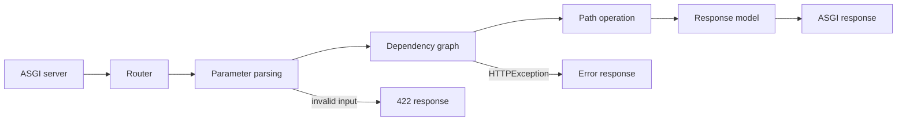

<TLDR>
  <TLDRCell label="what">
    FastAPI 是一个基于 ASGI 的 Python API 框架。它从类型注解中提取请求规则、响应结构和 OpenAPI 描述。
  </TLDRCell>
  <TLDRCell label="when">
    当 HTTP 服务以 JSON 契约、输入验证、依赖组合和异步 I/O 为中心时，可以选择 FastAPI。
  </TLDRCell>
  <TLDRCell label="how">
    用 Pydantic 模型描述请求与响应，用 `Depends` 组合认证和资源，再通过 HTTP 测试验证状态码、响应体和契约。
  </TLDRCell>
</TLDR>

## 是什么，为什么存在

<Term id="fastapi">FastAPI</Term> 是一个构建 HTTP API 的 Python Web 框架。它使用 Starlette 处理 Web 与并发机制，使用 Pydantic 解析和验证数据，并把路由声明转换为 OpenAPI 文档。一个函数签名同时服务于运行时、编辑器和接口文档，减少了三套描述逐渐分叉的机会。

FastAPI 要解决的核心问题不是“怎样返回 JSON”，而是怎样让 API 边界保持明确。路径参数来自 URL，简单标量通常来自查询字符串，Pydantic 模型通常来自请求体，而显式的 `Header`、`Cookie`、`Query` 和 `Body` 元数据可以覆盖默认推断。解析失败时，请求会在进入业务处理函数之前得到结构化的 `422` 响应。

FastAPI 本身是应用框架，不是生产网络服务器。
部署时仍要由兼容 ASGI 的服务器加载应用，并单独配置进程、代理、超时和观测边界。

它适合契约清晰的 JSON 服务、内部微服务和需要等待数据库或外部 API 的 I/O 密集型端点。需要内置管理后台、模板系统和完整 ORM 约定的应用，可能更适合 Django；只有少量固定端点的脚本，也未必需要完整框架。框架选择应由接口边界和运维需求决定，而不是未经上下文限定的性能排名。

Python 类型注解本身不会验证网络输入。FastAPI 在运行时读取这些注解，并调用 Pydantic 完成转换与校验，因此 `item_id: int` 同时是 Python 类型信息和请求解析规则。业务授权、数据库唯一性和并发写入不变量仍需单独实现，不能由类型注解替代。

## 工作原理

FastAPI 应用是一个 <Term id="asgi">ASGI</Term> 应用。ASGI 服务器把请求事件交给应用，路由器根据 HTTP 方法与路径选择路径操作函数，依赖系统先解析所需值，随后才调用处理函数。返回值经过响应序列化后变成 ASGI 响应事件。



参数来源由函数签名与路由模板共同决定。名称出现在路径模板中的参数来自路径；`str`、`int`、`bool` 等简单类型通常来自查询字符串；Pydantic 模型来自 JSON 请求体。`Annotated` 可以把 Python 类型与 FastAPI 元数据放在一起，同时保留编辑器和静态检查器看到的原始类型。

<Term id="dependency-injection">依赖注入（dependency injection）</Term>通过 `Depends` 声明处理函数运行前需要的值。依赖也可以声明子依赖，因此认证、租户选择、数据库会话和共享查询参数可以组成一张有向图。依赖可以抛出 `HTTPException` 提前结束请求，也可以通过一次 `yield` 在请求前获取资源、在请求后清理资源。

默认情况下，同一个依赖可调用对象在一次请求中只执行一次，结果会被需要它的节点复用。这种缓存只存在于当前请求，不是跨请求缓存；需要同一请求内重新求值时，才使用 `Depends(..., use_cache=False)`。测试覆盖也按依赖可调用对象的身份定位，所以覆盖键必须是原始函数本身。

处理函数的返回注解或装饰器上的 `response_model` 会建立<Term id="response-model">响应模型（response model）</Term>。FastAPI 根据它验证、序列化并过滤返回数据；当两者同时存在时，`response_model` 优先。输出过滤是重要的安全边界，但前提是公开模型只声明允许返回的字段。

这些声明还会生成 <Term id="openapi">OpenAPI</Term> 文档。路径、参数、请求体、响应体和依赖引入的安全要求都会进入模式，默认可在 `/openapi.json` 获取。Swagger UI 和 ReDoc 是该模式的视图，不是另一份独立契约。

`async def` 路径操作由事件循环直接等待，适合调用支持 `await` 的客户端。普通 `def` 路径操作和普通同步依赖会在线程池中执行，适合必须使用阻塞库的边界。处理函数内部直接调用的普通辅助函数不会被 FastAPI 自动移入线程池，所以 `async def` 中的一次阻塞调用仍会阻塞事件循环。

## 示例

### 路径参数与查询参数

第一个应用依靠签名推断两个参数的来源。测试客户端在进程内调用 ASGI 应用，不需要监听真实端口。

<Depth level="quick">

```python run title="parameter_sources.py"
from fastapi import FastAPI
from fastapi.testclient import TestClient

app = FastAPI()


@app.get("/items/{item_id}")
def read_item(item_id: int, details: bool = False) -> dict[str, int | bool]:
    return {"item_id": item_id, "details": details}


client = TestClient(app)

valid = client.get("/items/7", params={"details": "true"})
print(valid.status_code, valid.json())

invalid = client.get("/items/not-an-int")
error = invalid.json()["detail"][0]
print(invalid.status_code, error["loc"], error["type"])
```

```text
200 {'item_id': 7, 'details': True}
422 ['path', 'item_id'] int_parsing
```

</Depth>

`item_id` 的名称出现在路由模板中，所以来自路径；带默认值的 `details` 来自查询字符串。FastAPI 把文本 `true` 转为布尔值，把无法转换为整数的路径值报告为 `int_parsing` 错误，错误位置明确指向 `path.item_id`。

### 分离输入模型与输出模型

输入模型接受供应商备注，但公开响应模型没有这个字段。响应过滤由路由声明完成，不依赖处理函数记得手工删除内部字段。

```python run title="request_response_models.py"
from fastapi import FastAPI, status
from fastapi.testclient import TestClient
from pydantic import BaseModel, Field


class ProductIn(BaseModel):
    name: str = Field(min_length=2)
    price_cents: int = Field(gt=0)
    supplier_note: str


class ProductOut(BaseModel):
    name: str
    price_cents: int


app = FastAPI()


@app.post("/products", response_model=ProductOut, status_code=status.HTTP_201_CREATED)
def create_product(product: ProductIn) -> ProductIn:
    return product


client = TestClient(app)
created = client.post(
    "/products",
    json={"name": "Keyboard", "price_cents": 8900, "supplier_note": "internal"},
)
print(created.status_code, created.json())

invalid = client.post(
    "/products",
    json={"name": "Keyboard", "price_cents": 0, "supplier_note": "internal"},
)
error = invalid.json()["detail"][0]
print(invalid.status_code, error["loc"], error["type"])
```

```text
201 {'name': 'Keyboard', 'price_cents': 8900}
422 ['body', 'price_cents'] greater_than
```

第一次请求返回 `201`，而 `supplier_note` 没有出现在响应中。第二次请求在处理函数运行前失败，因为 `price_cents` 没有满足大于零的约束；客户端因此得到可定位到 `body.price_cents` 的错误。

### 认证依赖与测试覆盖

依赖可以集中读取请求头并拒绝请求。测试通过 `app.dependency_overrides` 替换外部边界，而不需要给每个路径操作增加测试分支。

```python run title="dependencies.py"
from typing import Annotated

from fastapi import Depends, FastAPI, Header, HTTPException, status
from fastapi.testclient import TestClient

app = FastAPI()


def current_user(x_api_key: Annotated[str | None, Header()] = None) -> str:
    if x_api_key != "secret-key":
        raise HTTPException(
            status_code=status.HTTP_401_UNAUTHORIZED,
            detail="invalid API key",
        )
    return "ada"


Viewer = Annotated[str, Depends(current_user)]


@app.get("/reports/{name}")
def read_report(name: str, viewer: Viewer) -> dict[str, str]:
    return {"report": name, "viewer": viewer}


client = TestClient(app)
print(client.get("/reports/daily").status_code)
print(client.get("/reports/daily", headers={"X-API-Key": "secret-key"}).json())

app.dependency_overrides[current_user] = lambda: "test-user"
print(client.get("/reports/daily").json())
app.dependency_overrides.clear()
```

```text
401
{'report': 'daily', 'viewer': 'ada'}
{'report': 'daily', 'viewer': 'test-user'}
```

缺少正确请求头时，依赖抛出的 `HTTPException` 阻止处理函数运行。覆盖依赖后，同一端点无需密钥即可测试；最后清空覆盖很关键，否则之后的测试会继续绕过认证。

### `yield` 依赖的复用与清理

带 `yield` 的依赖把资源获取与释放放在同一个函数中。这里同一依赖在一个处理函数里声明两次，但默认请求缓存只打开一次会话。

```python run title="yield_dependency.py"
from typing import Annotated, Iterator

from fastapi import Depends, FastAPI
from fastapi.testclient import TestClient

events: list[str] = []
app = FastAPI()


def open_session() -> Iterator[str]:
    events.append("open")
    try:
        yield "session-1"
    finally:
        events.append("close")


Session = Annotated[str, Depends(open_session)]


@app.get("/session")
def inspect_session(primary: Session, secondary: Session) -> dict[str, bool]:
    events.append("handler")
    return {"same_value": primary is secondary}


response = TestClient(app).get("/session")
print(response.status_code, response.json())
print(events)
```

```text
200 {'same_value': True}
['open', 'handler', 'close']
```

事件顺序表明资源先打开，随后处理请求，最后进入 `finally` 清理。两个参数得到同一个缓存值，因此 `same_value` 为 `True`；下一次 HTTP 请求会建立自己的依赖缓存和资源生命周期。

## 陷阱

> [!PITFALL]
> 把 `value: str | None` 误当成可选请求参数。联合类型允许值为 `None`，却不会自动让客户端可以省略该参数。

**修复方法：** 用默认值表达是否必填，例如 `value: str | None = None`。对路径、查询、请求头和请求体分别测试缺失、显式空值与格式错误，因为它们的传输语义不同。

> [!PITFALL]
> 直接返回数据库对象或输入模型，却没有声明公开响应模型。生成代码常因此把哈希密码、内部备注或租户标识序列化到响应中。

**修复方法：** 为外部响应定义字段允许列表，并用返回注解或 `response_model` 应用它。测试应断言敏感字段不存在，而不只是断言期望字段存在。

> [!PITFALL]
> 在 `async def` 路径操作中调用阻塞数据库驱动、同步 HTTP 客户端或 `time.sleep()`。函数名称是异步的，并不会把内部阻塞操作变成可让出控制权的操作。

**修复方法：** 有异步客户端时使用它并正确 `await`；必须使用阻塞库时，把边界放进普通 `def` 路径操作，或显式交给线程执行。负载测试要观察事件循环停顿和取消路径，不能只检查单个请求能否返回。

> [!PITFALL]
> 把 Pydantic 验证当成授权。`order_id: int` 只能证明输入可解析成整数，不能证明当前主体有权读取这个订单。

**修复方法：** 在依赖中认证主体，并让数据查询同时按资源标识和主体或租户范围过滤。测试至少覆盖他人的有效标识，因为格式正确的越权请求最容易被只测 `422` 的套件漏掉。

> [!PITFALL]
> 在测试中设置 `app.dependency_overrides` 后不恢复。后续测试可能继续使用假用户或假会话，结果取决于测试顺序。

**修复方法：** 在 fixture 的 `finally` 中删除特定覆盖或清空映射，并运行随机顺序测试。覆盖应指向原始依赖可调用对象；覆盖包装函数或另一个等价函数不会命中依赖图中的节点。

## AI 时代

**生成代码在这里常犯的错**

模型经常从旧教程复制 Pydantic v1 写法，例如 `@validator`、`.dict()` 和 `regex=`，同时又生成面向 Pydantic v2 的模型。它们还会给所有处理函数加上 `async def`，但在函数内部调用阻塞 ORM；或者省略 `response_model`，把内部模型直接返回。另一类错误是只生成请求验证，却没有对象级授权、依赖覆盖清理和 `422`、`401`、`403` 路径的测试。

**让 AI 检查**

- 列出每个路径操作参数的来源、必填性和失败状态码，并指出这是由路径模板、默认值还是 FastAPI 元数据决定的。
- 追踪每个 `async def` 内部调用，标出不能 `await` 的 I/O 边界，并说明它在线程池还是事件循环中运行。
- 比较输入模型、领域对象和响应模型的字段，找出任何可能跨越 API 边界的敏感数据。

**审查清单**

- 对有效、缺失、类型错误和边界值请求执行 HTTP 测试，并检查 `loc` 与状态码。
- 对另一个用户或租户拥有的有效资源标识执行授权测试，确认查询范围拒绝越权访问。
- 检查每个依赖覆盖与 `yield` 依赖是否在成功、异常和取消路径上恢复状态或释放资源。

**提示词词汇**

使用准确术语：`path operation`（路径操作）、`request body`（请求体）、`response model`（响应模型）、`dependency graph`（依赖图）、`dependency override`（依赖覆盖）、`request-scoped cache`（请求级缓存）、`blocking I/O`（阻塞 I/O）、`object-level authorization`（对象级授权）和 `OpenAPI schema`（OpenAPI 模式）。要求 AI 给出参数来源表和请求生命周期，比“写一个 FastAPI 接口”更容易暴露边界错误。

<Depth level="deep">

## 依赖图、缓存与清理范围

FastAPI 根据可调用对象及其参数递归构建依赖图。一个公共子依赖被多个上层依赖引用时，默认只在当前请求中求值一次，并把同一结果传给所有使用方。这个行为适合数据库会话和当前用户；对随机数或必须重新读取的状态关闭缓存前，应先确认重复执行不会破坏资源所有权。

带 `yield` 的依赖只能产生一个值。默认的 `scope="request"` 会在响应发送后运行退出代码；`scope="function"` 则在路径操作函数返回后、响应发送前清理。流式响应如果还要读取该资源，就不能过早选择函数范围。

依赖退出代码必须放进 `finally`，异常处理后若不转换为新的 HTTP 错误，通常应重新抛出原异常。吞掉异常会让框架看不到真实失败，也会模糊事务是提交还是回滚。资源依赖的测试应覆盖处理函数抛错，而不只是成功响应。

依赖覆盖按原始可调用对象查找，不按函数名称或签名查找。这使测试可以替换认证、时钟或数据库边界，同时保留路径操作本身。覆盖映射属于应用对象的可变全局测试状态，因此 fixture 必须负责恢复它。

## OpenAPI 是可测试的接口产物

FastAPI 从路径操作和 Pydantic 模型生成 OpenAPI，而不是从注释猜测接口。模式描述可接受的请求和承诺的响应，但不会自动表达数据库约束、跨字段业务规则的全部含义或授权策略。无法从类型系统得出的规则仍需写进领域代码、描述和测试。

`/openapi.json` 可以作为契约测试输入。团队可以断言操作标识、参数必填性、响应状态和安全方案没有意外变化，再用真实 HTTP 测试验证实现行为。只给文档 UI 截图做审查会漏掉机器可见的破坏性变更。

输入模型和输出模型应分别命名，因为二者通常不是同一个契约。创建请求可能包含密码或内部命令字段，公开响应则可能增加服务器生成的标识和时间戳，但必须删除秘密。复用一个“万能模型”会把内部存储结构与外部 API 锁在一起。

版本控制也不能只靠在路径前加 `/v2`。如果必填字段、默认值、枚举成员或错误状态改变，客户端观察到的契约已经变化。审查生成代码时，应比较 OpenAPI 差异，并为兼容性决定留下显式记录。

## 验证边界之外

请求验证负责把不可信字节转换为已知形状，并返回可定位的客户端错误。它不负责证明用户身份、对象所有权、库存未被并发请求消耗或写入满足数据库唯一约束。这些规则分别属于认证与授权、事务和数据库约束。

清晰的路径操作会协调这些边界，而不是承载所有实现细节。依赖提供请求上下文，Pydantic 模型处理传输形状，领域服务执行规则，数据库维护并发下的不变量，响应模型限制公开表示。这样的分工也让 AI 生成的局部代码更容易逐层验证。

## 路由顺序与应用组合

路由不仅是一组互不相关的装饰器。路由器按注册结果匹配方法和路径，因此静态路径与动态路径重叠时，注册顺序会影响选择。例如，`/users/me` 应放在 `/users/{user_id}` 前面，否则文本 `me` 可能先被当成路径参数处理。

`APIRouter` 可以把前缀、标签、依赖和响应声明应用到一组路径操作。应用通过 `include_router()` 组合这些路由，而不是在每个文件中创建互不相连的 `FastAPI` 实例。组合点也是审查版本前缀和全组认证要求的合适位置。

| 路由层级 | 适合声明的内容 |
|---|---|
| `FastAPI` 应用 | 全局中间件、生命周期与顶层依赖 |
| `APIRouter` | 功能前缀、标签与一组共享依赖 |
| 路径操作 | 具体输入、响应、状态码与细粒度依赖 |

路径操作名称需要在生成的 OpenAPI 中保持可区分。客户端生成器和监控系统可能使用 `operationId`，所以复制路由后应检查是否出现重复或意外变化。函数名称只是默认来源之一，公开契约需要显式审查。

不要用中间件替代所有依赖，也不要用依赖替代所有中间件。中间件适合包裹每个请求和响应的横切行为，依赖适合为特定路径操作提供经过验证的值和提前拒绝。需要访问解析后的用户或租户时，依赖通常能表达更准确的范围。

大型应用拆分后，契约仍由最终注册到应用上的路由集合生成。单独测试路由模块可以提供快速反馈，但还要对组合后的应用检查重复路径、遗漏前缀和全局依赖。只有组合测试能看到真实发布的 `/openapi.json`。

## 错误语义与异常边界

错误响应应区分客户端输入、访问控制和服务器缺陷。请求数据无法解析时，FastAPI 默认返回 `422`；应用可以用 `HTTPException` 表达预期的 HTTP 拒绝。未处理异常和响应模型验证失败通常表示服务器没有履行自己的契约，不应伪装成客户端错误。

| 情况 | 典型状态 | 负责边界 | 测试重点 |
|---|---:|---|---|
| 请求形状无效 | `422` | FastAPI 与 Pydantic | `detail.loc` 指向正确来源 |
| 未认证 | `401` | 认证依赖 | 包含适当认证挑战信息 |
| 已认证但无权限 | `403` | 授权策略 | 有效的他人资源仍被拒绝 |
| 资源不存在 | `404` | 受范围限制的查询 | 不泄露其他租户资源是否存在 |
| 领域冲突 | `409` | 领域服务与数据库 | 并发写入仍保持不变量 |
| 服务内部缺陷 | `500` | 异常处理与观测 | 记录关联标识，不泄露堆栈 |

自定义异常处理器可以统一错误信封，但不能丢掉可定位的信息。把所有异常都转换为 `200` 加错误字段，会破坏 HTTP 客户端、缓存和监控对成功与失败的判断。转换异常时，应保留稳定的机器代码，并让人类消息独立演进。

依赖中抛出的 `HTTPException` 会阻止后续依赖和路径操作继续运行，已经进入的 `yield` 依赖仍需清理。清理代码本身也可能失败，因此日志应同时保留原始请求失败与清理失败，而不是只留下最后一个异常。事务依赖必须明确由哪一层决定提交或回滚。

响应验证失败与请求验证失败方向相反。前者说明服务产生了不符合公开模型的数据，修复点在应用代码；把它改写成 `422` 会错误地归责客户端。测试应让此类失败在开发和持续集成中显眼，而不是用宽泛的异常处理器隐藏它。

## 测试 HTTP 边界

直接调用路径操作函数只能测试普通 Python 逻辑。它会绕过路由匹配、参数来源、依赖图、异常转换、响应过滤和序列化，因此不能证明 API 契约成立。至少一层测试必须通过 ASGI 测试客户端发送 HTTP 请求。

一组有价值的端点测试通常覆盖以下维度：

1. 合法请求的状态码、响应头和完整公开响应体。
2. 每个输入来源的缺失值、错误类型、边界值和未知字段策略。
3. 未认证、权限不足、跨租户标识和不存在资源之间的差异。
4. 依赖失败、处理函数失败和响应序列化失败时的资源清理。

断言整个错误对象可能对 Pydantic 的措辞变化过于敏感，但只断言状态码又太宽松。更稳定的做法是检查状态码、错误位置、机器错误类型和应用定义的错误代码，再对确实属于公开契约的消息做精确断言。

如果应用使用 lifespan 初始化连接池或其他共享资源，应让测试客户端以上下文管理器方式运行。这样启动与关闭逻辑都会执行，测试才能发现初始化顺序和清理问题。单纯实例化客户端并不等于验证了应用生命周期。

异步测试只有在测试本身需要等待异步数据库或其他协程时才有必要。无论测试函数是同步还是异步，断言对象仍是 HTTP 可观察行为，而不是处理函数内部实现。不要为了访问内部状态而绕开依赖边界。

最后应把生成的 OpenAPI 纳入变更审查，但避免把含有无关排序变化的巨大快照作为唯一保护。可以先规范化模式，再比较路径、方法、参数、请求模式、响应模式和安全要求。契约差异应与行为测试一起审查，因为模式相同的实现仍可能返回错误数据或执行错误授权。

</Depth>

<Checkpoint id="backend/fastapi" />

## 延伸阅读

- [FastAPI 文档：请求体](https://fastapi.tiangolo.com/tutorial/body/)
- [FastAPI 文档：响应模型](https://fastapi.tiangolo.com/tutorial/response-model/)
- [FastAPI 文档：依赖注入](https://fastapi.tiangolo.com/tutorial/dependencies/)
- [FastAPI 文档：并发与 `async`/`await`](https://fastapi.tiangolo.com/async/)
- [FastAPI 文档：测试](https://fastapi.tiangolo.com/tutorial/testing/)
