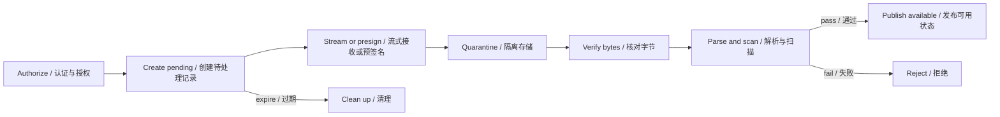

<TLDR>
  <TLDRCell label="what">
    A file upload is not an ordinary write. It is a stateful pipeline that receives untrusted bytes, validates them, stores them in quarantine, and eventually publishes them.
  </TLDRCell>
  <TLDRCell label="trap">
    A filename, `Content-Type`, `Content-Length`, or successful presigned upload comes from the client or transport layer; none alone proves that content is safe, complete, or publishable.
  </TLDRCell>
  <TLDRCell label="fix">
    Bound requests and files at admission, count and hash bytes while streaming, store under a server-generated key in quarantine, and publish metadata atomically only after content checks pass.
  </TLDRCell>
</TLDR>

## What it is and why it exists

A file upload is the process by which a client gives a server some bytes and descriptive metadata. HTTP transports the message, but the application must decide who may upload, what it accepts, how it stores the result, when the result becomes readable, and which intermediate state to clean after failure. You face these decisions anywhere an API accepts avatars, attachments, data imports, or media.

An upload endpoint differs from an ordinary JSON endpoint because its payload can be large and its bytes may enter a parser, transcoder, malware scanner, or browser. An attacker can spoof extensions and media types or exploit paths, compression ratios, parser flaws, and storage quotas. The security boundary therefore cannot end when form parsing succeeds.

A robust upload flow separates “received” from “available.” New bytes first enter an <Term id="upload-quarantine">upload quarantine</Term>; the database record becomes `available` only after identity, size, type, content, and business rules pass. If scanning times out or processing fails, the file stays invisible and the system can retry or clean it instead of treating an unknown result as success.

Uploads commonly use one of two data paths. A smaller form file can pass through the application server, while a large file can use a short-lived capability to go directly to object storage. Both paths must share the same control plane: the server creates an upload intent, binds ownership and constraints, checks the observed object, and decides whether to publish it.

## How it works

### Two meanings of multipart

<Term id="multipart-form-data">`multipart/form-data`</Term> is an HTTP form encoding. The `boundary` parameter in the request's `Content-Type` separates the body into parts. Each part uses `Content-Disposition` to carry a field name, and a file part commonly carries a client filename and `Content-Type`. One request can contain text fields and one or more files.

An object store's multipart upload instead divides one object into independently uploaded parts and assembles them during a completion operation. It supports retries, concurrent transfer, and recovery for large objects; it is not another way to parse `multipart/form-data`. An API design should say whether “part” means a form part or an object part.

### From intent to publication

The control plane first authenticates the caller, checks resource-level authorization and quotas, and creates a `pending` upload record. The record holds a server-generated <Term id="object-key">object key</Term>, expected size, allowed type, optional checksum, expiration, and owner. The original filename is only length-bounded display metadata.

The data plane then receives the bytes. A multipart parser produces a file stream on the application-server path; an object store receives a `PUT` or parts on the direct path. Both must count actual bytes and reject excess data instead of trusting the size declared before the request began.

After receipt, the server reads observed properties from a temporary file or object that it controls. It verifies the key, length, and checksum, identifies the type, performs format-specific decoding or rewriting, and scans according to policy. Only after every check succeeds does it move the record from `pending` to `available`.



A trusted service must own the state transition; a client must not submit `status: "available"` for itself. The completion request needs an ownership check, and a conditional update or transaction must ensure that only the expected `pending` record can be published. A repeated completion should return the stored result or a clear conflict, not create another file record.

### Limits at every layer

The outer proxy or gateway should bound request size and read time. The application parser must also bound file count, field count, field length, and per-file size. Storage adds tenant quotas and lifecycle rules, while processors bound decompressed size, image dimensions, page count, or media duration. Each layer protects a different resource, so one `Content-Length` check cannot replace the others.

`Content-Length` can be absent, and for multipart input it describes the whole message rather than one file. Even when its value is acceptable, the reader must count actual bytes and, on overflow, abort the source, close the destination, and remove the partial file. Archive handling also needs limits on entry count, nesting, and total decompressed output.

### Names, types, and content

A client filename is suitable for display, not for a path or object key. The server should generate a new, unpredictable, non-reused key and keep ownership in a database or protected metadata. On download, it can place a separately encoded display name in `Content-Disposition` without feeding the original name back into path resolution.

The client's `Content-Type` is only useful for cheaply rejecting an obvious mistake. A file signature says more about the bytes than an extension, but a correct prefix still does not prove that the complete structure is valid or harmless. If the product accepts PNG, a maintained PNG decoder should fully parse and, where needed, re-encode it. PDF and archive support require controls specific to those formats.

Detection failure should reject the upload or leave it quarantined. Treating an unavailable scanner as “clean” converts a dependency outage into a security bypass. A product may reject synchronously, retry asynchronously, or send the item for manual review, but its state and user visibility must be explicit.

### Streams and backpressure

Streaming lets an application avoid collecting the complete file in one `Buffer`. A source emits data, transforms count and hash each chunk, and a destination writes to quarantine; `pipeline()` propagates errors and waits for every stage. Memory use still depends on buffers and concurrency at each layer, so “uses streams” does not automatically mean “capacity bounded.”

<Term id="backpressure">Backpressure</Term> pauses reads when writes cannot keep up. Code that listens for `data` and pushes chunks into an unbounded array, or ignores a writable stream's pressure signal, breaks that feedback chain. Concurrent upload count needs a separate bound as well, because small buffers per stream can still exhaust aggregate memory and file descriptors.

### Direct object-store uploads

A <Term id="presigned-url">presigned URL</Term> gives a client time-limited storage permission for a particular method and object key. It saves the application server from relaying the bytes, but it does not delegate authorization, quotas, validation, or publication to the storage service. The application still authenticates the user and generates a new key under a quarantine prefix before signing.

After the client reports success, the application must not trust the submitted size, type, or checksum. A completion endpoint reads the properties observed by storage and, when policy requires, verifies a checksum covered by the signature. A presigned capability can be reused before it expires, and a reused key can overwrite an object, so both the key and the state transition need replay protection.

## Examples

### A first byte-level gate

This pure Node.js example maps a declared type to an expected signature and also checks for empty or oversized input. The result is deliberately named `headerGate`: passing it means only that the prefix matches the admission policy, not that a complete PNG was decoded or scanned.

<Depth level="quick">

```javascript run title="inspect_upload.js"
const PNG_SIGNATURE = Buffer.from([0x89, 0x50, 0x4e, 0x47, 0x0d, 0x0a, 0x1a, 0x0a]);
const allowedSignatures = new Map([['image/png', PNG_SIGNATURE]]);

function inspectUpload({ originalName, claimedType, bytes, maxBytes }) {
  const signature = allowedSignatures.get(claimedType);
  const signatureMatches = signature !== undefined
    && bytes.subarray(0, signature.length).equals(signature);

  return {
    originalName,
    claimedType,
    size: bytes.length,
    headerGate: bytes.length > 0 && bytes.length <= maxBytes && signatureMatches,
  };
}

const validPng = Buffer.concat([PNG_SIGNATURE, Buffer.from('sample')]);
const disguisedScript = Buffer.from('<script>alert(1)</script>');

for (const bytes of [validPng, disguisedScript]) {
  const result = inspectUpload({
    originalName: 'avatar.png',
    claimedType: 'image/png',
    bytes,
    maxBytes: 32,
  });
  console.log(
    `${result.originalName}: type=${result.claimedType}`,
    `size=${result.size} headerGate=${result.headerGate}`,
  );
}
```

```text
avatar.png: type=image/png size=14 headerGate=true
avatar.png: type=image/png size=25 headerGate=false
```

</Depth>

Both samples claim the name `avatar.png`, but the name does not affect the decision. The second sample fails the cheap gate because its bytes do not match the PNG signature. The first is still only a fixture; production code must give it to a real PNG decoder before accepting it.

### Streaming into quarantine

The next example uses `pipeline()` to write two input chunks into a staging file with mode `0600`. A transform counts actual bytes and computes SHA-256, failing above 32 bytes. It renames the file in the same directory only after a successful write and removes a partial file on failure.

```javascript run title="store_stream.js"
import { createHash } from 'node:crypto';
import { createWriteStream } from 'node:fs';
import { mkdir, rename, rm } from 'node:fs/promises';
import { Readable, Transform } from 'node:stream';
import { pipeline } from 'node:stream/promises';
class Meter extends Transform {
  constructor(limit) {
    super();
    this.limit = limit;
    this.bytes = 0;
    this.hash = createHash('sha256');
  }
  _transform(chunk, encoding, callback) {
    this.bytes += chunk.length;
    if (this.bytes > this.limit) return callback(new Error('upload too large'));
    this.hash.update(chunk);
    callback(null, chunk);
  }
}
async function store(source, root, objectId) {
  const staged = `${root}/${objectId}.part`;
  const finalPath = `${root}/${objectId}`;
  const meter = new Meter(32);
  try {
    await pipeline(source, meter, createWriteStream(staged, { flags: 'wx', mode: 0o600 }));
    await rename(staged, finalPath);
    return { finalPath, bytes: meter.bytes, sha256: meter.hash.digest('hex') };
  } catch (error) {
    await rm(staged, { force: true });
    throw error;
  }
}
const root = '/tmp/codewiki-upload-example';
await rm(root, { recursive: true, force: true });
await mkdir(root, { recursive: true });
const source = Readable.from([Buffer.from('order='), Buffer.from('CW-42\n')]);
const result = await store(source, root, 'upload-7f3a');
console.log(`stored=${result.finalPath} bytes=${result.bytes}`);
console.log(`sha256=${result.sha256}`);
await rm(root, { recursive: true, force: true });
```

```text
stored=/tmp/codewiki-upload-example/upload-7f3a bytes=12
sha256=fe2c1abd0da3359bd47aa3d712d29f040a30252a8ce116879b035d47b639de47
```

The fixed directory and object ID exist only to make the output reproducible. A real service generates a new key for each authorized upload and keeps the staging directory out of public reach. This `rename()` commits only a local staged file; parsing, malware scanning, and database publication remain later gates.

### Checking a direct upload

A direct-upload completion endpoint compares the constraints saved with the upload intent against properties observed by storage. This pure function also checks the caller and state. A mismatched object becomes `rejected`, a failed scan stays `quarantined`, and only a complete match becomes `available`.

```javascript run title="finalize_upload.js"
function finalizeUpload(record, observed, actorId) {
  if (record.ownerId !== actorId) throw new Error('forbidden');
  if (record.status !== 'pending') throw new Error('invalid upload state');

  const matches = observed.key === record.key
    && observed.size === record.expectedSize
    && observed.contentType === record.expectedType
    && observed.sha256 === record.expectedSha256;

  if (!matches) return { ...record, status: 'rejected' };
  if (observed.scanStatus !== 'clean') {
    return { ...record, status: 'quarantined' };
  }
  return { ...record, status: 'available' };
}

const pending = {
  id: 'up-42',
  ownerId: 'user-7',
  key: 'quarantine/user-7/up-42',
  expectedSize: 12,
  expectedType: 'image/png',
  expectedSha256: 'abc123',
  status: 'pending',
};
const uploaded = {
  key: 'quarantine/user-7/up-42',
  size: 12,
  contentType: 'image/png',
  sha256: 'abc123',
  scanStatus: 'clean',
};

console.log(finalizeUpload(pending, uploaded, 'user-7').status);
console.log(finalizeUpload(pending, { ...uploaded, size: 13 }, 'user-7').status);
console.log(finalizeUpload(pending, { ...uploaded, scanStatus: 'infected' }, 'user-7').status);
```

```text
available
rejected
quarantined
```

The pure function shows a publication decision, not the whole transaction. A real implementation reads `observed` through a trusted storage API and commits the result with a conditional update. Its scan result must also be bound to the same object version or checksum so the object cannot be replaced after scanning.

## Pitfalls

> [!PITFALL]
> An allowlist based only on the extension or client `Content-Type` treats attacker-controlled metadata as proof of content.

**Fix:** Use the extension and declared type as cheap filters, then inspect the signature and parse the complete content with a maintained format decoder. Re-encode images into new files when appropriate instead of preserving unverified bytes. Parser failure, timeout, or resource exhaustion must leave the upload rejected.

> [!PITFALL]
> Joining the original filename into a local path, object key, or public URL creates path traversal, overwrite, special-name, and encoding hazards.

**Fix:** Generate an object key independently of the original name and map it to ownership and display metadata in the database. If path resolution is unavoidable, use platform normalization and containment checks. Deleting `../` substrings does not cover absolute paths, separator variants, or symbolic links.

> [!PITFALL]
> `await file.arrayBuffer()`, `Buffer.concat(chunks)`, or unbounded concurrency lets a small number of connections exhaust heap, temporary disk, or file descriptors.

**Fix:** Add separate limits at the proxy, parser, streaming counter, tenant quota, and processor while preserving end-to-end backpressure. Test absent `Content-Length`, interrupted reads, slow consumers, and concurrent uploads near the admission limit. Verify that failures release both connections and partial files.

> [!PITFALL]
> A successful byte write or object-store response does not mean the file passed authorization, integrity, content, and malware checks.

**Fix:** Model explicit states such as `pending`, `quarantined`, `available`, and `rejected`, and restrict downloads and downstream work to `available`. Publication checks the object version and conditionally updates the record. Scanner failure must fail closed instead of marking the object clean.

> [!PITFALL]
> Retrying initialization, a part, or completion without a stable session identity and idempotency rules creates duplicate records, overwritten objects, or parts that are never reclaimed.

**Fix:** Bind an upload session to its owner, expiration, part positions, checksums, and allowed transitions. A repeated part must match its expected length and digest, and completion must be idempotent. Lifecycle work removes expired staging files and unfinished object-store multipart uploads.

<Depth level="deep">

## Upload protocol boundaries

### Through the application server

`multipart/form-data` fits when a file travels with form fields or when the application must inspect content synchronously before responding. A parser needs the complete boundary from the request's `Content-Type`; manually setting only `multipart/form-data` leaves the receiver unable to separate parts. When a browser sends `FormData`, let the browser generate that header.

Field values, original filenames, and part headers emitted by the parser remain untrusted. Configure limits not just for file bytes but also for parts, files, fields, and field lengths so many tiny parts cannot exhaust parser resources. The API contract should state whether it rejects or ignores unknown fields.

The application-server path centralizes policy, but every byte crosses a service instance. Load balancing, timeouts, and restarts affect long requests, so a process-local object cannot be the source of truth for progress. Cross-instance recovery needs shared state with an expiration mechanism.

### Direct from the client

Direct upload changes the byte path to client-to-object-store while the application handles intent and publication. Bind a capability to the object key, method, short expiration, and constraints supported by the store; never let the client choose an arbitrary bucket or prefix. The signing principal's own permissions also bound what the capability can do.

Direct upload does not enforce business quotas automatically. A malicious client can request many intents without finishing them or write the same key repeatedly before the capability expires. Account for outstanding intent count and expected bytes, then use unique keys, conditional writes, and expiration cleanup to control those cases.

A completion notification is only a claim. The server reads actual object metadata or consumes an authenticated storage event and binds it to the `pending` record. If scanning and publication are asynchronous, the client should observe an explicit processing state rather than a false success.

## Content validation pipeline

### Layers of evidence

File validation is not a search for one infallible MIME detector. Extension, declared media type, file signature, complete parsing, business constraints, and malware scanning answer different questions. The allowlist comes from product needs: an avatar endpoint need not accept every image format, and an import endpoint should not accept arbitrary columns or record counts merely because the file parses.

A file signature commonly covers only a few leading bytes, while a compound format can carry scripts, macros, or other objects in a container. Give complete parsing its own CPU, memory, nesting, and output limits. Process high-risk formats in a sandbox or apply content disarm and reconstruction to create a new safe representation where policy requires it.

A checksum proves whether the observed bytes match expected bytes; it does not prove that content is benign. It is useful for detecting transfer corruption, binding a scan result to an object version, and checking a multipart assembly. Do not use a fast, non-cryptographic hash for a security decision where an attacker can exploit collisions to change identity.

### Quarantine and publication

Quarantine must be unreadable to the public at both the network and application permission layers. An object-store prefix is not inherently a security boundary: bucket policy, service identities, and download endpoints must all deny `pending` and `quarantined` objects. A processor receives only the minimum permission needed to read quarantined input and write derived output.

Publication should change a metadata state or copy to a separate available prefix rather than make several steps guess whether a file is complete. When database state and object operations cannot share a transaction, use a retryable coordination flow: record the expected object version, perform an idempotent operation, and commit through a conditional update. Reconciliation looks for both objects without published records and available records without objects.

Download is another security boundary. Authorize every read against the file record, set a media type that agrees with validation, and construct `Content-Disposition` carefully. Serving user-controlled HTML, SVG, or other active content inline from the primary site origin can carry upload risk into another user's browser.

## Storage and retrieval policy

### Separating metadata from bytes

A database record is a good home for the upload ID, owner, original display name, object key, size, validated type, digest, status, and timestamps; large file bytes normally live in a filesystem or object store. The API addresses an unpredictable record ID and resolves it to an object key on the server, keeping the storage layout out of the public contract.

An object can exist without a record, and a record does not prove that its object remains readable. When upload, copy, deletion, or lifecycle transitions cross the database-store boundary, record the expected state and object version at every step. Periodic reconciliation finds orphan objects and stale records, but it does not replace conditional updates on the request path.

### Overwrite and deduplication

A new key for every upload prevents same-name overwrites and binds a scan result to one stable byte sequence. To update an avatar, publish the new object reference first and reclaim the unreferenced old object asynchronously. Do not overwrite the currently available object before the replacement passes validation.

Content-addressed deduplication changes the privacy and ownership model. If tenants share one physical object, deletion, retention, encryption keys, and access accounting require reference management. A response difference that reveals “this file already exists” can also disclose someone else's content. Do not automatically turn an upload digest into global object identity without a defined requirement.

### Retention and deletion

Every intermediate state needs a retention period: unused intents, partial files, unfinished parts, quarantined objects, failed derivatives, and final objects may follow different policies. Cleanup work should be paginated, rate-limited, and retryable, with both object deletion and record updates designed to be idempotent.

Revoke public access before asynchronously deleting bytes after a user request. Bytes may still exist in a deletion queue, backup, or legally retained store, so the API must not promise immediate physical erasure unless the system can provide it. Audit records keep the decision and object identifier, not a copy of sensitive file content.

### Safe downloads

A download endpoint performs resource-level authorization against the file record before choosing proxy transfer or a short-lived download capability. The response sets the validated media type, length, and cache policy. A separately encoded display name goes into `Content-Disposition` and never re-enters object-key resolution.

Public files still need abuse handling, rate limits, and a cache-invalidation plan. If content can execute actively, serve it from an isolated origin and prefer `attachment`; whether `inline` is allowed follows validated type and product policy, not the uploader's header.

## Large files and recovery

### Part sessions

A resumable upload needs durable session state, not merely an append-mode file. At minimum, the session binds an owner, target key, total size, part rules, expiration, and current state. Each part request validates its number, range, actual length, and digest. Concurrent writes to one part number need a defined overwrite, reject, or idempotent-accept rule.

Completion proves that every required part exists and assembles them in protocol order. It also verifies the final size and checksum before entering the ordinary content-validation pipeline. A client-provided “uploaded parts” list may express a request, but only server state or storage results can establish completion.

Object-store multipart upload can retain parts until it is explicitly completed or aborted. Schedule aborts and lifecycle rules for failed sessions, and monitor unfinished bytes. A cleanup worker must recheck that a session is still expired so it does not race with a client that has just resumed.

### Observable failure

Upload metrics should distinguish admission rejection, interrupted reads, size overflow, type mismatch, parse failure, scan failure, publication conflict, and expiration cleanup. An HTTP 500 count alone cannot separate malicious input, exhausted capacity, and a dependency outage. Logs correlate stages with an upload ID and a safe digest of the object key; they do not record presigned URLs or file contents.

Capacity monitoring should also cover concurrent uploads, quarantined bytes, the age of the oldest `pending` record, and unfinished-part volume. Alert thresholds come from a verified capacity budget and normal-traffic baseline, not a number copied from an example.

The client needs to distinguish retryable from terminal outcomes. A network interruption or temporary dependency failure can retry within the same session; a forbidden type, wrong owner, or corrupt content requires new input. Whatever response the server returns, failure to send that response must not skip required cleanup or durable state transitions.

</Depth>

<Checkpoint id="backend/file-upload" />

## Further reading

- [RFC 7578: `multipart/form-data`](https://www.rfc-editor.org/rfc/rfc7578.html)
- [OWASP File Upload Cheat Sheet](https://cheatsheetseries.owasp.org/cheatsheets/File_Upload_Cheat_Sheet.html)
- [Node.js 24 stream documentation](https://nodejs.org/docs/latest-v24.x/api/stream.html)
- [Amazon S3: Uploading objects with presigned URLs](https://docs.aws.amazon.com/AmazonS3/latest/userguide/PresignedUrlUploadObject.html)
- [Amazon S3: Multipart upload overview](https://docs.aws.amazon.com/AmazonS3/latest/userguide/mpuoverview.html)
