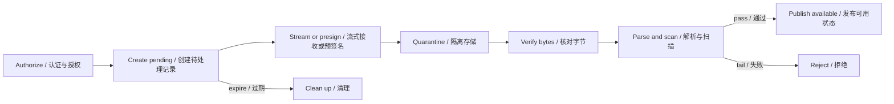

<TLDR>
  <TLDRCell label="what">
    文件上传不是一次普通写入，而是一条接收不可信字节、验证、隔离存储并最终发布的状态管线。
  </TLDRCell>
  <TLDRCell label="trap">
    文件名、`Content-Type`、`Content-Length`和预签名上传的成功响应都来自客户端或传输层，不能单独证明内容安全、完整或可公开访问。
  </TLDRCell>
  <TLDRCell label="fix">
    在入口限制请求与文件大小，边流式写入边计数和校验，使用服务端对象键保存到隔离区，完成内容检查后再原子发布元数据。
  </TLDRCell>
</TLDR>

## 是什么，为什么存在

文件上传（file upload）是客户端把一段字节及其描述信息交给服务端的过程。HTTP只负责传输消息；应用还要决定谁能上传、允许什么内容、怎样保存、何时可读，以及失败后清理哪些中间状态。只要接口接收头像、附件、数据导入文件或媒体资源，就会遇到这些问题。

上传端点与普通JSON端点的差别在于，载荷可能很大，而且字节本身会进入解析器、转码器、病毒扫描器或浏览器。攻击者可以伪造扩展名和媒体类型，也可以利用路径、压缩率、解析器漏洞或存储配额。安全边界因此不能停在表单解析成功这一刻。

一个稳健的上传流程把“接收完成”与“文件可用”分成不同状态。新字节先进入<Term id="upload-quarantine">上传隔离区（upload quarantine）</Term>；只有身份、大小、类型、内容和业务规则都通过后，数据库记录才变为`available`。扫描超时或处理失败时，文件保持不可见，系统可以重试或清理，而不是把未知状态当作成功。

上传通常有两条数据路径。较小的表单文件可以经过应用服务器；大文件可以使用短期授权直接进入对象存储。两条路径必须共享同一套控制面：服务端创建上传意图、绑定所有者与限制、核对实际对象，然后决定是否发布。

## 工作原理

### 两种multipart不同义

<Term id="multipart-form-data">`multipart/form-data`</Term>是HTTP表单编码。请求头中的`boundary`把消息体分成多个part，每个part通过`Content-Disposition`给出字段名，文件part通常还带有客户端文件名和`Content-Type`。同一请求可以同时携带文本字段和一个或多个文件。

对象存储的multipart upload则把一个对象拆成可独立上传的分段，最后通过完成操作组装。它解决重试、并发传输和大对象恢复问题，不是`multipart/form-data`的另一种解析方式。设计接口时要写清楚指的是“表单part”还是“对象part”。

### 从意图到发布

控制面先认证调用者，检查资源级授权和配额，再创建`pending`上传记录。记录包含服务端生成的<Term id="object-key">对象键（object key）</Term>、预期大小、允许类型、可选校验和、过期时间和所有者；原始文件名只作为经过长度限制的显示元数据保存。

数据面随后接收字节。应用服务器路径由multipart解析器产生文件流；直传路径由对象存储接收`PUT`或分段。两者都需要计算实际字节数并拒绝超限输入，不能只相信请求开始前声明的大小。

接收完成后，服务端从自己控制的临时文件或对象读取实际属性。它核对键、长度和校验和，执行类型识别以及该格式所需的解码或重写，并按风险策略扫描。只有这些步骤都成功，才把记录从`pending`改为`available`。



状态转换应该由受信任的服务完成，而不是由客户端提交一个`status: "available"`。对完成请求执行所有者检查，并以条件更新或事务保证只有预期的`pending`记录能发布。重复完成请求应返回已保存的结果或明确冲突，不能再次创建文件记录。

### 分层限制

最外层代理或网关应限制请求体大小和读取时间，应用解析器还要限制文件数量、字段数量、字段长度以及单个文件大小。存储层设置租户配额和生命周期规则，处理器则限制解压后大小、图像尺寸、页数或媒体时长。每一层保护的资源不同，不能用单个`Content-Length`检查替代。

`Content-Length`可能缺失，也可能描述整个multipart消息而不是其中某个文件。即使声明值合规，实际读取仍要累计字节，并在超过限制时中止上游、关闭目标流、删除部分文件。对于压缩包，还要限制条目数、嵌套层级与解压后的总量。

### 名称、类型与内容

客户端文件名适合显示，不适合作为路径或对象键。服务端应生成不可预测且不复用的键，把所有者关系放在数据库或受保护的元数据中。下载时再通过安全的`Content-Disposition`生成显示名称，避免让原始名称参与路径解析。

客户端声明的`Content-Type`只能帮助快速拒绝明显误传。文件签名比扩展名更接近实际字节，但一个正确前缀仍不能证明整个文件结构有效或无害。业务允许PNG时，应让受维护的PNG解码器完整解析，并在需要时重编码；允许PDF或压缩包时，要使用针对该格式的验证与资源限制。

检测失败时应默认拒绝或保持隔离。把扫描服务不可用当作“干净”会把依赖故障变成安全绕过。具体产品可以选择同步拒绝、异步重试或人工审核，但状态和用户可见性必须明确。

### 流与背压

流式处理让应用不必把整个文件放进一个`Buffer`。源流产生数据，计数与哈希转换流处理每个块，目标流写入隔离位置；`pipeline()`负责传播错误并等待各段结束。内存使用仍取决于各级缓冲区和并发数，所以“使用流”不等于自动具备容量控制。

<Term id="backpressure">背压（backpressure）</Term>让写入较慢时暂停读取。若代码监听`data`后把块放进无界数组，或忽略写入流返回的压力信号，就绕开了这条反馈链。并发上传数量也要单独限制，否则每条流的缓冲虽小，总内存和文件描述符仍可能耗尽。

### 直传对象存储

<Term id="presigned-url">预签名URL（presigned URL）</Term>把有限时间内对特定方法和对象键的存储权限交给客户端。它减少应用服务器转发的字节，但没有把授权、配额、验证和发布责任交给存储服务。签发前仍要认证用户并生成只能写入隔离前缀的新键。

客户端报告“上传成功”后，应用不能直接相信它提交的大小、类型或校验和。完成端点应读取对象存储观察到的属性，并在策略要求时验证签名覆盖的校验和。预签名能力可能在过期前被重复使用；键复用还可能覆盖已有对象，因此对象键和状态转换都要防止重放。

## 示例

### 第一层字节检查

下面的纯Node.js示例把声明类型映射到预期签名，并同时执行空文件与大小检查。函数刻意把结果命名为`headerGate`：通过这里只说明文件头与入口策略相符，不表示PNG已被完整解码或扫描。

<Depth level="quick">

```javascript run title="inspect_upload.js"
const PNG_SIGNATURE = Buffer.from([0x89, 0x50, 0x4e, 0x47, 0x0d, 0x0a, 0x1a, 0x0a]);
const allowedSignatures = new Map([['image/png', PNG_SIGNATURE]]);

function inspectUpload({ originalName, claimedType, bytes, maxBytes }) {
  const signature = allowedSignatures.get(claimedType);
  const signatureMatches = signature !== undefined
    && bytes.subarray(0, signature.length).equals(signature);

  return {
    originalName,
    claimedType,
    size: bytes.length,
    headerGate: bytes.length > 0 && bytes.length <= maxBytes && signatureMatches,
  };
}

const validPng = Buffer.concat([PNG_SIGNATURE, Buffer.from('sample')]);
const disguisedScript = Buffer.from('<script>alert(1)</script>');

for (const bytes of [validPng, disguisedScript]) {
  const result = inspectUpload({
    originalName: 'avatar.png',
    claimedType: 'image/png',
    bytes,
    maxBytes: 32,
  });
  console.log(
    `${result.originalName}: type=${result.claimedType}`,
    `size=${result.size} headerGate=${result.headerGate}`,
  );
}
```

```text
avatar.png: type=image/png size=14 headerGate=true
avatar.png: type=image/png size=25 headerGate=false
```

</Depth>

两个样本都声称自己叫`avatar.png`，而名称没有参与判定。第二个样本的字节不匹配PNG签名，因此在廉价入口检查处被拒绝。第一个样本仍然只是测试夹具；生产代码必须把它交给真正的PNG解码器后才能接受。

### 流式写入隔离区

下一个示例用`pipeline()`把两个输入块写入权限为`0600`的暂存文件。转换流同时累计实际大小和SHA-256，超过32字节就报错；写入成功后才在同一目录内改名，失败路径会删除部分文件。

```javascript run title="store_stream.js"
import { createHash } from 'node:crypto';
import { createWriteStream } from 'node:fs';
import { mkdir, rename, rm } from 'node:fs/promises';
import { Readable, Transform } from 'node:stream';
import { pipeline } from 'node:stream/promises';
class Meter extends Transform {
  constructor(limit) {
    super();
    this.limit = limit;
    this.bytes = 0;
    this.hash = createHash('sha256');
  }
  _transform(chunk, encoding, callback) {
    this.bytes += chunk.length;
    if (this.bytes > this.limit) return callback(new Error('upload too large'));
    this.hash.update(chunk);
    callback(null, chunk);
  }
}
async function store(source, root, objectId) {
  const staged = `${root}/${objectId}.part`;
  const finalPath = `${root}/${objectId}`;
  const meter = new Meter(32);
  try {
    await pipeline(source, meter, createWriteStream(staged, { flags: 'wx', mode: 0o600 }));
    await rename(staged, finalPath);
    return { finalPath, bytes: meter.bytes, sha256: meter.hash.digest('hex') };
  } catch (error) {
    await rm(staged, { force: true });
    throw error;
  }
}
const root = '/tmp/codewiki-upload-example';
await rm(root, { recursive: true, force: true });
await mkdir(root, { recursive: true });
const source = Readable.from([Buffer.from('order='), Buffer.from('CW-42\n')]);
const result = await store(source, root, 'upload-7f3a');
console.log(`stored=${result.finalPath} bytes=${result.bytes}`);
console.log(`sha256=${result.sha256}`);
await rm(root, { recursive: true, force: true });
```

```text
stored=/tmp/codewiki-upload-example/upload-7f3a bytes=12
sha256=fe2c1abd0da3359bd47aa3d712d29f040a30252a8ce116879b035d47b639de47
```

示例中的固定目录和对象ID只为产生可复现输出。真实服务应为每次已授权上传生成新键，并把暂存目录放在不可公开访问的位置。`rename()`只提交本地暂存文件；内容解析、恶意软件扫描和数据库发布仍是后续关卡。

### 核对直传结果

直传完成端点需要把创建上传意图时保存的约束，与存储层观察到的对象属性比较。下面的纯函数还检查调用者与状态；不匹配的对象进入`rejected`，扫描未通过的对象保持`quarantined`，只有全部符合才得到`available`。

```javascript run title="finalize_upload.js"
function finalizeUpload(record, observed, actorId) {
  if (record.ownerId !== actorId) throw new Error('forbidden');
  if (record.status !== 'pending') throw new Error('invalid upload state');

  const matches = observed.key === record.key
    && observed.size === record.expectedSize
    && observed.contentType === record.expectedType
    && observed.sha256 === record.expectedSha256;

  if (!matches) return { ...record, status: 'rejected' };
  if (observed.scanStatus !== 'clean') {
    return { ...record, status: 'quarantined' };
  }
  return { ...record, status: 'available' };
}

const pending = {
  id: 'up-42',
  ownerId: 'user-7',
  key: 'quarantine/user-7/up-42',
  expectedSize: 12,
  expectedType: 'image/png',
  expectedSha256: 'abc123',
  status: 'pending',
};
const uploaded = {
  key: 'quarantine/user-7/up-42',
  size: 12,
  contentType: 'image/png',
  sha256: 'abc123',
  scanStatus: 'clean',
};

console.log(finalizeUpload(pending, uploaded, 'user-7').status);
console.log(finalizeUpload(pending, { ...uploaded, size: 13 }, 'user-7').status);
console.log(finalizeUpload(pending, { ...uploaded, scanStatus: 'infected' }, 'user-7').status);
```

```text
available
rejected
quarantined
```

纯函数展示的是发布判定，不是完整事务。真实实现应从可信存储API读取`observed`，再用条件更新提交结果；扫描结论也应绑定同一对象版本或校验和，避免对象在扫描后被替换。

## 陷阱

> [!PITFALL]
> 只按扩展名或客户端`Content-Type`建立允许列表，会把攻击者可编辑的元数据当作内容证明。

**修复方法：** 先把扩展名和声明类型作为廉价筛选，再检查文件签名，并用受维护的格式解析器读取完整内容。对可重编码的图像生成新文件，不复用未经验证的原始字节；解析器失败、超时或超限都保持拒绝状态。

> [!PITFALL]
> 把原始文件名拼接到本地路径、对象键或公开URL中，会带来路径穿越、覆盖、特殊名称和编码歧义。

**修复方法：** 服务端生成与原名无关的新对象键，并通过数据库把它映射到所有者和显示名称。若必须解析路径，使用平台提供的规范化与containment检查；简单删除`../`不能覆盖绝对路径、分隔符变体和符号链接问题。

> [!PITFALL]
> `await file.arrayBuffer()`、`Buffer.concat(chunks)`或无界并发会让攻击者用少量连接占满堆、临时盘或文件描述符。

**修复方法：** 在代理、解析器、流式计数器、租户配额和处理器处分别设限，并保留端到端背压。测试缺失`Content-Length`、读取中断、慢速接收方和多个并发上限附近的上传，确认失败时连接与部分文件都被释放。

> [!PITFALL]
> 字节写入成功或对象存储返回成功，并不表示文件已经通过授权、完整性、内容和恶意软件检查。

**修复方法：** 使用`pending`、`quarantined`、`available`、`rejected`等显式状态，把下载和后续处理限制在`available`。发布操作核对对象版本并条件更新记录；扫描服务故障按失败关闭，不自动把对象标为干净。

> [!PITFALL]
> 重试初始化、上传分段或完成请求时，如果没有稳定的会话身份和幂等规则，就会产生重复记录、覆盖对象或永不清理的分段。

**修复方法：** 为上传会话定义所有者、到期时间、分段位置、校验和与允许的状态转换。相同分段重试要验证长度和摘要，完成操作要幂等；生命周期任务清理过期暂存文件和未完成的对象存储multipart upload。

<Depth level="deep">

## 上传协议边界

### 应用服务器中转

`multipart/form-data`适合文件需要与表单字段一起提交，或者应用必须在响应前同步检查内容的场景。解析器必须先从请求的`Content-Type`取得完整boundary；手工把头写成不含boundary的`multipart/form-data`会让接收端无法分隔part。浏览器使用`FormData`时，应让浏览器生成该请求头。

解析器输出的字段值、原始文件名和part头仍是不可信输入。配置解析器时不仅限制文件字节，还要限制part数、文件数、字段数和字段长度，避免攻击者用大量小part消耗解析器资源。遇到未知字段时是拒绝还是忽略，应由接口契约明确规定。

应用服务器路径能在一个位置实施策略，但所有字节都会经过服务实例。负载均衡、超时和重启会影响长请求，所以不能依赖某个进程内对象记录上传进度。需要跨实例恢复时，状态应放入共享且有到期机制的存储。

### 客户端直传

直传把字节路径改为客户端到对象存储，应用只处理上传意图与发布。签发能力时要固定对象键、方法、较短的有效期以及存储服务支持的约束；不要让客户端选择任意bucket或前缀。权限主体本身能做什么，会限制预签名能力的范围。

直传并不会自动限制业务配额。恶意客户端可能请求许多上传意图却不完成，也可能在能力过期前多次写同一键。记录未完成意图的数量与预计字节，并使用唯一键、条件写入和过期清理控制这些情况。

完成通知只是一次声明。服务端应读取实际对象元数据或接收受验证的存储事件，并把它与`pending`记录绑定。若扫描与发布异步执行，客户端查询到的应是明确的处理中状态，而不是虚假的成功。

## 内容验证管线

### 多层证据

文件验证不是寻找一个绝对可靠的MIME检测函数。扩展名、声明媒体类型、文件签名、完整解析、业务约束和恶意软件扫描分别回答不同问题。允许列表应来自产品需求：头像接口不需要接受所有图像格式，导入接口也不应因为某个文件“能解析”就接受任意列与记录数。

文件签名通常只覆盖开头少量字节，复合格式还可能在一个容器里携带脚本、宏或其他对象。完整解析时要给解析器独立的CPU、内存、深度和输出限制。高风险格式可以放进沙箱处理，或使用内容拆解与重建策略生成新的安全表示。

校验和证明观察到的字节是否与预期字节一致，不证明内容无恶意。它适合检测传输损坏、绑定扫描结果与对象版本，以及核对分段重组结果。不要把快速、非加密哈希用于攻击者可以利用碰撞改变身份的安全决策。

### 隔离与发布

隔离区必须在网络访问和应用权限上都不可公开读取。对象存储前缀不是天然安全边界；bucket policy、服务身份和下载端点都要拒绝`pending`与`quarantined`对象。处理器只获得读取隔离对象和写入派生对象所需的最小权限。

发布最好修改元数据状态或复制到单独的可用前缀，而不是让多个步骤共同猜测文件是否完成。数据库状态与对象操作无法处在同一事务时，要设计可重试的协调流程：记录预期对象版本，执行幂等操作，再以条件更新提交。对账任务检查“对象存在但记录未发布”和“记录可用但对象缺失”两种偏差。

下载也是安全边界。每次读取都要按记录执行授权，设置与验证结果一致的媒体类型，并谨慎生成`Content-Disposition`。用户可控的HTML、SVG或其他活动内容若以内联方式从主站点来源提供，可能把上传风险带到其他用户的浏览器。

## 存储与读取策略

### 元数据与字节分离

数据库记录适合保存上传ID、所有者、原始显示名称、对象键、大小、验证后的类型、摘要、状态和时间戳；大块文件字节通常放在文件系统或对象存储。接口通过不可猜测的记录ID寻址，再在服务端解析到对象键，避免把存储布局变成公开API。

对象存在不代表记录存在，记录存在也不保证对象仍可读。上传、复制、删除或生命周期转换跨越数据库与存储边界时，要为每一步记录期望状态和对象版本。定期对账可以发现孤立对象与失效记录，但不能替代请求路径上的条件更新。

### 覆盖与去重

为每次上传生成新键，可以避免同名文件相互覆盖，也让扫描结论稳定地绑定到一版字节。更新用户头像时，先发布新对象引用，再异步回收不再引用的旧对象；不要在验证完成前覆盖当前可用对象。

基于内容摘要去重会改变隐私与所有权模型。若不同租户共享一个物理对象，删除、保留期限、加密密钥和访问计数都需要引用管理；根据“文件已存在”的响应差异还可能泄露别人的内容是否存在。没有明确需求时，不要把上传摘要自动当作全局对象身份。

### 保留与删除

每个中间状态都需要保留期限：未开始的上传意图、部分文件、未完成分段、隔离对象、失败的派生文件和最终对象可以有不同策略。清理任务应分页、限速并可重试，同时把删除对象与更新记录设计成幂等操作。

用户请求删除后，公开访问应先被撤销。实际字节可能还存在于异步删除队列、备份或依法保留的存储中，因此API不应承诺未经系统能力支持的即时物理擦除。审计记录应保存决策与对象标识，不应复制敏感文件内容。

### 安全下载

下载端点先按文件记录执行资源级授权，再选择代理传输或短期下载能力。响应应设置验证后的媒体类型、长度和缓存策略；显示名称经过单独编码后放入`Content-Disposition`，不能重新参与对象键解析。

公开文件也需要滥用处置、速率限制和缓存失效方案。若内容可能主动执行，使用隔离来源并倾向`attachment`下载；是否允许`inline`应由验证后的类型与产品策略决定，而不是由上传者提交的头决定。

## 大文件与恢复

### 分段会话

可恢复上传需要持久的会话状态，而不只是把请求以追加模式写入文件。会话至少绑定所有者、目标键、总大小、分段规则、到期时间与当前状态。每个分段请求验证编号、范围、实际长度和摘要；并发写入同一编号时，要定义覆盖、拒绝或幂等接受哪一种行为。

完成操作验证需要的分段都存在，并按协议顺序组合。它还要核对最终大小与校验和，然后才能进入普通内容验证管线。客户端提供的“已上传分段列表”只能用于提出请求，服务端状态或存储层结果才是完成判断依据。

对象存储multipart upload在显式完成或中止前可能保留分段。为失败会话安排中止操作和生命周期规则，并监控未完成字节数。清理任务必须验证会话仍已过期，避免与刚刚恢复的客户端竞态。

### 可观察的失败

上传指标应区分入口拒绝、读取中断、大小超限、类型不符、解析失败、扫描失败、发布冲突和过期清理。只记录HTTP 500无法判断是恶意输入、容量不足还是依赖故障。日志使用上传ID和对象键的安全摘要关联步骤，不记录预签名URL或文件内容。

容量监控还应覆盖并发上传数、隔离区字节、最老`pending`记录的年龄和未完成分段量。告警阈值来自已验证的容量预算与正常流量基线，而不是从示例复制一个固定数字。

客户端需要能区分可重试与不可重试结果。网络中断和暂时依赖故障可以在同一会话内重试；类型不允许、所有者不符或内容损坏需要新输入。服务端无论返回哪种结果，都不能因为错误响应发送失败而跳过必要的清理或持久化状态转换。

</Depth>

<Checkpoint id="backend/file-upload" />

## 延伸阅读

- [RFC 7578：`multipart/form-data`](https://www.rfc-editor.org/rfc/rfc7578.html)
- [OWASP文件上传安全清单](https://cheatsheetseries.owasp.org/cheatsheets/File_Upload_Cheat_Sheet.html)
- [Node.js 24 Stream文档](https://nodejs.org/docs/latest-v24.x/api/stream.html)
- [Amazon S3：使用预签名URL上传对象](https://docs.aws.amazon.com/AmazonS3/latest/userguide/PresignedUrlUploadObject.html)
- [Amazon S3：multipart upload概览](https://docs.aws.amazon.com/AmazonS3/latest/userguide/mpuoverview.html)
