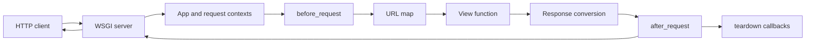

<TLDR>
  <TLDRCell label="what">
    Flask is a lightweight Python web framework that maps WSGI requests to view functions and provides routing, contexts, response conversion, templates, and testing tools.
  </TLDRCell>
  <TLDRCell label="when">
    Use Flask when an HTTP service benefits from a small framework core and the team is prepared to choose validation, persistence, and authentication components explicitly.
  </TLDRCell>
  <TLDRCell label="how">
    Complete configuration and registration in an application factory, group routes with blueprints, validate input at the request boundary, and test full HTTP behavior with the test client.
  </TLDRCell>
</TLDR>

## What it is and why it exists

<Term id="flask">Flask</Term> is a lightweight Python <Term id="wsgi">Web Server Gateway Interface (WSGI)</Term> application framework. It receives a request environment from a WSGI server, matches a route, calls a view function, and converts the return value into an HTTP response. Flask's core also integrates Werkzeug's HTTP utilities, Jinja templates, and Click command-line support.

“Microframework” describes the scope of the core, not the size of an application. Flask includes neither a database abstraction layer nor a form library, and it doesn't impose a fixed domain directory structure. You can use only the components you need, but you must also choose the boundaries for validation, persistence, authentication, background work, and the production server.

Flask suits traditional request-response applications, small to medium HTTP APIs, server-rendered sites, and Python services whose dependencies should be chosen incrementally. It also works well for teaching and prototypes because the test client can exercise the complete routing path without opening a port. Before a prototype reaches production, it still needs input schemas, authorization, persistence, observability, and deployment configuration.

Flask isn't an async-first ASGI framework. It supports `async def` views, but under the WSGI model one request still occupies one process or thread worker. A service dominated by long-lived connections, WebSockets, or extensive asynchronous I/O should first compare the execution models described by `backend/fastapi` and `backend/wsgi-asgi`.

Flask supplies mechanisms; it doesn't define the application's contract. A route converter can only decide whether a path segment converts to the requested type, and `request.get_json()` doesn't validate domain fields. The application and data layer still decide whether a caller may read an order, whether a quantity is valid, and whether a write is atomic.

That explicit choice is both Flask's strength and an engineering responsibility. A team should record dependencies and boundaries in the factory, tests, and deployment configuration instead of relying on import side effects known to one maintainer.

## How it works

A Flask application is an instance of `Flask` and a callable WSGI application. The server translates an HTTP request into a WSGI `environ` dictionary, calls the application, and sends the resulting status, headers, and bytes to the client. The development server is for local development only; production needs a dedicated WSGI server or hosting platform.



While handling a request, Flask creates a request context, pushes the corresponding <Term id="application-context">application context</Term>, and then pushes the <Term id="request-context">request context</Term>. The application context provides `current_app` and `g`; the request context provides `request` and `session`. They look global but are <Term id="context-local">context-local proxies</Term> that resolve to objects for the active context.

The URL map consists of rules, HTTP methods, endpoint names, and view functions. Converters such as `<int:item_id>` match and convert before the view is called. A conversion failure means the route doesn't match and normally produces `404`, not a validation error from the view. Building URLs for endpoint names with `url_for()` keeps mount prefixes and path concatenation out of calling code.

Before a request reaches the view, `before_request` callbacks run in scope and registration order. If one returns a response, Flask skips the remaining request callbacks and the view. After the view returns normally or an error handler converts an exception, `after_request` receives the response; when contexts are popped, `teardown_request` and `teardown_appcontext` clean up even after an unhandled exception.

A view doesn't have to construct a `Response` manually. A string becomes the body, a `dict` or `list` is converted to JSON, a two- or three-part tuple can add a status and headers, and a `Response` instance is used directly. This convenience doesn't freeze a public response schema; an external API should still test both allowed and forbidden fields.

The common return forms map as follows. Status and headers are part of the HTTP contract, so tests shouldn't compare only the body.

| View return | Flask interpretation |
| --- | --- |
| `str` or `bytes` | Construct a `Response` with that body |
| `dict` or `list` | Serialize with the application's JSON provider |
| `(body, status)` | Convert the body and set the status |
| `(body, status, headers)` | Convert the body and merge the headers |
| `Response` | Use the response object directly |

A <Term id="blueprint">blueprint</Term> records operations to apply when it is registered on an application, such as routes, error handlers, and a URL prefix. It isn't an independent application and can't handle requests by itself. Registration applies those operations to a concrete application instance, so the same route group can work with factory-created instances that have different configurations.

An <Term id="application-factory">application factory</Term> is a function that creates, configures, and returns an application instance. It lets tests construct an isolated instance per scenario, and it prevents extensions and blueprints from requiring one global application at import time. Every setting that affects routes, extensions, and hooks should be complete before the application handles requests and consistent in every worker process.

### Configuration and error boundaries

`app.config` is an application-level mapping, not request storage. A factory can establish defaults with `from_mapping()` before test arguments or deployment configuration override them. The loading order must stay deterministic, or the final source of a setting becomes difficult to audit.

`SECRET_KEY` protects signed data such as Flask sessions. Production workers must read the same stable, high-entropy secret. Generating a different random value per process invalidates sessions when requests move between workers. The secret belongs in the deployment system, not in an example value or repository.

Error handlers map exceptions or HTTP errors to responses. A handler must preserve a meaningful status and return a stable, nonsensitive error shape for an API. Sending an exception string or stack trace to the client can disclose implementation and data details.

A blueprint error handler applies only once Flask knows that the blueprint owns the request. A global `404` produced during route matching occurs before Flask can identify such a blueprint, so it needs an application-level handler. This boundary often makes a generated “blueprint-specific 404” ineffective.

Catching every `Exception` and returning `500` can also swallow the status and headers of an `HTTPException`. Handle only exceptions that can be recovered from or mapped intentionally. Unknown errors should reach centralized logging and a generic `500` response while the server retains the original exception for diagnosis.

## Examples

The next four examples progress from one route to input boundaries, application composition, and request lifecycle behavior. Each uses Flask's test client, so it opens no network port while still exercising WSGI request construction, routing, and response conversion.

### Routing and automatic JSON responses

The first example maps a path with an integer converter to a view. Flask creates a JSON response from the returned dictionary. When a segment can't convert to an integer, the view never runs.

<Depth level="quick">

```python run title="route_api.py"
from flask import Flask

app = Flask(__name__)


@app.get("/items/<int:item_id>")
def get_item(item_id):
    return {"id": item_id, "name": "Notebook"}


client = app.test_client()
response = client.get("/items/42")

print(response.status_code)
print(response.get_json())
print(client.get("/items/not-a-number").status_code)
```

```text
200
{'id': 42, 'name': 'Notebook'}
404
```

</Depth>

`@app.get` declares the path and allowed method together, and the endpoint name defaults to the function name `get_item`. The converter only handles the shape of the `item_id` path value; it doesn't know whether item `42` exists. If a real lookup finds nothing, the view should return `404` explicitly instead of presenting an empty object as success.

The test client's response exposes the status, headers, raw bytes, and parsing helpers such as `get_json()`. Checking the JSON and failure path here is closer to the real contract than calling `get_item(42)` directly, because a direct call bypasses routing and response conversion.

### Validating the JSON request boundary

The second example distinguishes media type, top-level JSON shape, and field rules. In Python, `bool` is a subclass of `int`, so checking only `isinstance(quantity, int)` would incorrectly accept JSON `true`.

```python run title="validate_json.py"
from flask import Flask, request

app = Flask(__name__)


@app.post("/orders")
def create_order():
    if not request.is_json:
        return {"error": "expected application/json"}, 415

    payload = request.get_json(silent=True)
    if not isinstance(payload, dict):
        return {"error": "expected a JSON object"}, 400

    quantity = payload.get("quantity")
    if isinstance(quantity, bool) or not isinstance(quantity, int) or quantity < 1:
        return {"error": "quantity must be a positive integer"}, 400

    return {"id": 101, "quantity": quantity}, 201


client = app.test_client()
responses = [
    client.post("/orders", data="quantity=2"),
    client.post("/orders", json={"quantity": True}),
    client.post("/orders", json={"quantity": 2}),
]

for response in responses:
    print(response.status_code, response.get_json())
```

```text
415 {'error': 'expected application/json'}
400 {'error': 'quantity must be a positive integer'}
201 {'id': 101, 'quantity': 2}
```

`415` says the request media type isn't supported, `400` says an acceptable media type carried content that violates this endpoint's input rules, and `201` says a resource was created. `silent=True` only makes a parse failure return `None`; it doesn't turn bad input into valid input. The following top-level object check still rejects it.

A real service will often use a schema library to standardize error locations, type conversion, and nested validation. Whatever library you choose, keep tests at the HTTP boundary because direct schema tests don't cover error status codes, media types, and response shapes.

### Composing a blueprint in a factory

The third example keeps the blueprint independent and reads the active instance's configuration through `current_app` only when the view runs. Two factory calls register the same blueprint but produce applications that don't share configuration.

```python run title="factory_app.py"
from flask import Blueprint, Flask, current_app

catalog = Blueprint("catalog", __name__, url_prefix="/catalog")


@catalog.get("/items")
def list_items():
    return {"items": current_app.config["ITEMS"]}


def create_app(config=None):
    app = Flask(__name__)
    app.config.from_mapping(ITEMS=["pencil"], TESTING=False)
    if config is not None:
        app.config.from_mapping(config)
    app.register_blueprint(catalog)
    return app


shop = create_app({"TESTING": True, "ITEMS": ["notebook"]})
empty_shop = create_app({"TESTING": True, "ITEMS": []})

print(shop.test_client().get("/catalog/items").get_json())
print(empty_shop.test_client().get("/catalog/items").get_json())
```

```text
{'items': ['notebook']}
{'items': []}
```

`catalog` records the route declaration; `register_blueprint()` is what adds `/catalog/items` to a concrete URL map. A blueprint's `url_prefix` can be overridden or combined during registration, while its endpoint is namespaced, such as `catalog.list_items`. Using `url_for("catalog.list_items")` lets callers depend on endpoint identity instead of copying path text.

The factory argument makes test configuration visible. Database extensions are also commonly created as unbound objects at module scope and connected with `init_app(app)` in the factory. This keeps the extension object from leaking application state from one test instance into another.

### Observing the request lifecycle

The fourth example records callback order and uses `g` to carry a request identifier within one request. `after_request` can add a header to an already constructed response, while `teardown_request` releases resources acquired during the request.

```python run title="request_lifecycle.py"
from flask import Flask, g, request

app = Flask(__name__)
events = []


@app.before_request
def start_request():
    g.request_id = request.headers.get("X-Request-ID", "missing")
    events.append("before")


@app.after_request
def add_request_id(response):
    events.append("after")
    response.headers["X-Request-ID"] = g.request_id
    return response


@app.teardown_request
def finish_request(error):
    name = type(error).__name__ if error else "none"
    events.append(f"teardown:{name}")


@app.get("/trace")
def trace():
    events.append("view")
    return {"path": request.path, "request_id": g.request_id}


response = app.test_client().get("/trace", headers={"X-Request-ID": "req-7"})

print(response.status_code, response.get_json())
print(response.headers["X-Request-ID"])
print(events)
```

```text
200 {'path': '/trace', 'request_id': 'req-7'}
req-7
['before', 'view', 'after', 'teardown:none']
```

`g` belongs to the application context. A normal request pushes the corresponding context, so it works as a temporary namespace during that request. It isn't a cross-request cache and shouldn't carry job arguments into another process. Background work should receive ordinary serializable values, such as a copied `request_id`.

The example's `events` list exists only to reveal order; it isn't a production logging design. Concurrent requests would interleave mutations, and separate worker processes wouldn't share it. Production code should use structured logging or tracing and carry the request identifier as a field.

## Pitfalls

> [!PITFALL]
> Calling `app.run(debug=True)` in production enables a development-only server and interactive debugger. The debugger can execute Python code, and its PIN isn't a security boundary.
>
> **Fix:** Load the factory with a supported production WSGI server and disable debug mode explicitly in deployment configuration. Configure trusted hosts, TLS, and forwarded headers correctly behind a proxy; don't trust client-supplied `X-Forwarded-*` headers directly.

> [!PITFALL]
> Treating `request.get_json()` as a dictionary and checking only for field presence misses a wrong media type, malformed JSON, an array at the top level, `null`, booleans masquerading as integers, and unknown fields. Generated code copied from older examples may also expect an incorrect media type to produce `400`, while current Flask uses `415`.
>
> **Fix:** Define the media type, top-level shape, field types, ranges, and unknown-field policy before mapping validation failures to stable error responses. Test an empty body, wrong `Content-Type`, malformed JSON, and type boundaries, not only the successful object.

> [!PITFALL]
> Reading `request`, `session`, `g`, or `current_app` after the request ends, in a background thread, or in a task worker resolves against the wrong context or raises `RuntimeError: Working outside of request context.` Passing the proxy itself to another execution unit doesn't copy its current target.
>
> **Fix:** Copy the scalar or immutable values the job actually needs while the request is active, then pass them explicitly to background code. Use `with app.app_context():` in non-request code only when it genuinely needs application resources; don't use a manual context to hide missing function parameters.

> [!PITFALL]
> Registering routes, blueprints, error handlers, or extensions after the application starts handling requests can leave worker processes with different setups. Flask rejects some late setup operations, but it can't prove that external initialization ran identically in every process.
>
> **Fix:** Complete all application setup in the factory before handing the application to a server. Database migrations and one-time data preparation should be separate deployment steps, not “first request” hooks; `before_first_request` has been removed from current Flask.

> [!PITFALL]
> Seeing `async def` and assuming Flask has become an ASGI service leads to incorrect capacity estimates. Under WSGI, each async view still occupies one worker, incomplete `asyncio` tasks spawned by the view are cancelled when it returns, and synchronous extensions may still block.
>
> **Fix:** Use Flask async views only to await supported asynchronous I/O concurrently within a view, and install `flask[async]`. Send durable background work to a task queue. If long-lived connections or async concurrency dominate, verify an ASGI design against the actual server.

> [!PITFALL]
> Reading `next` from a query parameter and passing it directly to `redirect(next_url)` creates an open redirect. An attacker can construct a login link that sends a user to an external imitation site.
>
> **Fix:** Accept only local relative targets by parsing and validating the scheme, host, and allowed path; fall back to a named internal endpoint on failure. Test scheme-relative URLs, encoded backslashes, repeated encoding, and nondefault ports, not only a normal `/dashboard` value.

## In the AI era

**What generated code gets wrong here**

Models often combine snippets from incompatible Flask versions, generating removed features such as `before_first_request`, `FLASK_ENV`, or old JSON configuration keys. They also treat `request.json` as a validated model, leave `app.run(debug=True)` in a deployment entry point, or keep referencing the `request` proxy in background code. Another recurring mistake is treating `async def` as an automatic WSGI concurrency upgrade and calling `asyncio.create_task()` just before the view returns.

**Ask your AI to check**

- Check every import, configuration key, and lifecycle hook against Flask 3.1.3, and list removed or deprecated forms.
- For every route, list the allowed methods, input sources, validation rules, success status, error statuses, and authorization check.
- Trace every use of `request`, `session`, `g`, and `current_app`, confirming that none crosses a context lifetime or execution unit.

**Review checklist**

- Use the test client to send wrong media types, malformed JSON, invalid path-converter values, and unauthorized requests, then inspect the complete responses.
- Confirm that routes, blueprints, extensions, and error handlers are registered before the factory returns and that test instances don't leak state.
- Check that the production entry point starts neither the development server nor debugger, and verify that proxy, secret, cookie, and request-size settings come from controlled deployment configuration.

**Prompt vocabulary**

Use the exact terms `application factory`, `blueprint registration`, `request context`, `application context`, `context-local proxy`, `view return conversion`, `teardown callback`, and `WSGI worker model`. Ask for a request-lifecycle trace and a failure-response matrix; “generate a Flask API” is too vague to expose boundary errors.

<Depth level="deep">

## Context boundaries and async execution

Request and application contexts answer “which request and application are current”; they aren't a general dependency-injection mechanism. Flask stores the active contexts with Python `contextvars`, and Werkzeug's `LocalProxy` resolves the target on attribute access. Importing `request` therefore doesn't capture one request. The proxy finds a target only when code uses it inside a valid context.

At the start of a normal request, the request context ensures that the corresponding application context exists. Flask pushes the application context first and the request context second, then pops them in reverse order. `teardown_request` runs before the request context is popped, and `teardown_appcontext` runs during application-context cleanup; both must accept a possible exception argument.

A teardown callback can't assume that the view or `before_request` completed. A failure may occur earlier in dispatch, and a manually pushed context also triggers teardown. A resource getter can store an acquired connection on `g`, while the cleanup function uses a default-safe operation such as `g.pop("db", None)` to decide whether anything needs release.

`after_request` and teardown callbacks have different jobs. The former receives and must return a response, making it appropriate for common response headers. The latter can't replace a response that has already been produced, making it appropriate for closing connections or rolling back unfinished transactions. Cleanup itself should avoid raising, or it can obscure the original failure and disrupt resource release.

The test client creates a request environment and manages contexts automatically. When an assertion must read `session` or `g`, use the client as a context manager to defer popping until the `with` block ends. A unit test for a pure domain rule should instead call a function that doesn't depend on Flask proxies, keeping the HTTP adapter thin.

### Response and error dispatch

Flask passes a view return value to `make_response()` to produce a concrete response before running `after_request`. Views, error handlers, and early-returning `before_request` callbacks must therefore produce a value Flask can convert. Returning `None` means the view failed to complete the response contract and causes a framework error.

`abort(404)` raises a Werkzeug HTTP exception that Flask matches against the most specific registered error handler. Registration by exception class can cover subclasses, while registration by status expresses one exact protocol result. In either case, tests should check status, media type, required headers, and body rather than one JSON key.

A custom error handler still runs in a valid request context and can read request details for server-side logs. If it returns a request identifier to the client, use an application-generated value or one from a trusted proxy; an unvalidated request header isn't a security audit identity. Logs should also omit credentials, session cookies, and complete sensitive bodies.

### Route identity and blueprints

Every rule has an endpoint name. A decorator defaults to the view function name, and blueprint registration adds the blueprint name as a prefix. Two views using the same endpoint in one namespace conflict even if their URL paths differ.

The endpoint is a stable code-facing reference; the URL is its deployment-facing representation. Renaming a function or blueprint changes a default endpoint, so shared code can fix the name explicitly with the decorator's `endpoint` argument. Links built with `url_for()` still follow the map when a URL prefix changes.

Rules also distinguish trailing slashes. A rule ending in a slash behaves like a directory and will normally redirect a request missing that slash to the canonical URL. A no-slash rule normally returns `404` when given an extra slash. Whether a client follows redirects changes the observed result, so API tests should choose explicitly.

### Factories, imports, and setup

Module import, application setup, and request handling are three different phases. A blueprint can declare operations during module import because it only records them; the factory creates the concrete application and dependency configuration. Changing the URL map after request handling starts would make this process behave differently from other workers, so Flask treats such setup as an error.

A factory doesn't mean creating an application for every request. A production server typically invokes it when a worker starts and then lets that instance handle many requests. The factory's value is repeatable construction of explicitly configured instances, not moving expensive initialization into the hot request path.

An application context can exist without a request context, such as during a CLI command. `current_app` and `g` are then available, while `request` and `session` are not. If a service function only needs one configuration value, passing that value explicitly is usually clearer; context proxies should remain in framework integration code.

CLI jobs, tests, and requests can each push separate application contexts. Don't treat a value on `g` from one context as a process-global cache, because it isn't the next operation's state after that context is popped. A real shared cache needs explicit concurrency, expiry, and multiprocess semantics.

Copying a context doesn't transfer ownership of resources. Even when a tool can copy a request context into another coroutine or thread, the original request may end the lifetime of its database connection, file, or transaction. Extracting the required data into task arguments is usually safer than extending the whole request environment.

### The async-view boundary

After Flask is installed with its `async` extra, it can await async views, error handlers, and request hooks. Under a traditional WSGI service, Flask runs an event loop for an async view, but one request still occupies one worker. This permits concurrent waits for multiple I/O operations within that request; it doesn't automatically increase the number of requests the server handles at once.

An async path is useful only if reachable calls also support nonblocking waits. A synchronous database driver, HTTP client, or older extension still blocks execution. A view decorator that doesn't adapt through `Flask.ensure_sync()` can also call a coroutine incorrectly. Reviewers should label sync and async boundaries along the call graph instead of looking only at the route declaration.

When the view returns, the event loop Flask started for that request stops, so `asyncio.create_task()` isn't a task queue. Work that needs retries, durable state, or a lifetime beyond one request belongs in an external task system. Deployment through a WSGI-to-ASGI adapter requires new verification of cancellation, context, and concurrency behavior against the actual server, adapter, and extensions.

</Depth>

<Checkpoint id="backend/flask" />

## Further reading

- [Flask Quickstart](https://flask.palletsprojects.com/en/stable/quickstart/)
- [Flask application structure and lifecycle](https://flask.palletsprojects.com/en/stable/lifecycle/)
- [Flask request context](https://flask.palletsprojects.com/en/stable/reqcontext/)
- [Flask application factories](https://flask.palletsprojects.com/en/stable/patterns/appfactories/)
- [Testing Flask applications](https://flask.palletsprojects.com/en/stable/testing/)
- [Using `async` and `await` in Flask](https://flask.palletsprojects.com/en/stable/async-await/)
