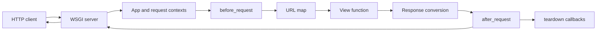

<TLDR>
  <TLDRCell label="what">
    Flask 是轻量级 Python Web 框架，把 WSGI 请求映射到视图函数，并提供路由、上下文、响应转换、模板与测试工具。
  </TLDRCell>
  <TLDRCell label="when">
    当 HTTP 服务需要较小的框架核心，而且团队愿意明确选择验证、持久化与认证组件时，可以使用 Flask。
  </TLDRCell>
  <TLDRCell label="how">
    在应用工厂中完成配置和注册，用蓝图划分路由，在请求边界验证输入，并通过测试客户端检查完整 HTTP 行为。
  </TLDRCell>
</TLDR>

## 是什么，为什么存在

<Term id="flask">Flask</Term> 是一个轻量级的 Python <Term id="wsgi">Web 服务器网关接口（WSGI）</Term>应用框架。它接收 WSGI 服务器传入的请求环境，匹配路由，调用视图函数，再把返回值转换为 HTTP 响应。Flask 核心还集成了 Werkzeug 的 HTTP 工具、Jinja 模板和 Click 命令行支持。

「微框架（microframework）」描述的是核心范围，不是应用规模。Flask 不内置数据库抽象层或表单库，也不要求固定的领域目录结构。你可以只使用所需组件，但也必须自己决定验证、持久化、认证、后台任务和生产服务器的边界。

Flask 适合传统请求—响应应用、小型到中型 HTTP API、服务端渲染站点，以及需要逐步选择依赖的 Python 服务。它也适合教学和原型，因为测试客户端可以在不打开端口的情况下运行完整路由流程。原型进入生产前，仍要补齐输入模式、授权、持久化、可观测性和部署配置。

Flask 不是异步优先的 ASGI 框架。它支持 `async def` 视图，但 WSGI 模型下一个请求仍会占用一个工作进程或线程。主要由长连接、WebSocket 或大量异步 I/O 构成的服务，应先比较 `backend/fastapi` 和 `backend/wsgi-asgi` 所解释的执行模型。

Flask 提供机制，不替应用定义契约。路由转换器只能判断路径片段能否转换成目标类型；`request.get_json()` 也不会验证领域字段。调用者是否有权读取订单、数量是否合理、写入是否原子，仍由应用代码和数据层负责。

这种显式选择既是 Flask 的优势，也是工程责任。团队应把依赖与边界写进工厂、测试和部署配置，而不是依赖只有某位维护者知道的导入副作用。

## 工作原理

一个 Flask 应用是 `Flask` 类的实例，同时也是可由 WSGI 服务器调用的对象。服务器把 HTTP 请求转换为 WSGI `environ` 字典，调用应用，再把应用产生的状态、响应头与字节发送给客户端。开发服务器只服务于本地开发；生产环境需要专用 WSGI 服务器或托管平台。



处理请求时，Flask 会创建请求上下文，先推入对应的<Term id="application-context">应用上下文（application context）</Term>，再推入<Term id="request-context">请求上下文（request context）</Term>。`current_app` 和 `g` 由应用上下文提供，`request` 和 `session` 由请求上下文提供。它们看起来像全局变量，实际是指向当前上下文对象的<Term id="context-local">上下文局部代理（context-local proxy）</Term>。

URL 映射由规则、HTTP 方法、端点名称和视图函数组成。`<int:item_id>` 等转换器在调用视图前完成匹配与转换；转换失败表示路由不匹配，通常得到 `404`，而不是视图中的验证错误。用 `url_for()` 针对端点名称生成 URL，可以避免把挂载前缀和路径拼接散落在代码中。

请求进入视图前，`before_request` 回调按注册范围和顺序运行。如果某个回调返回响应，Flask 会跳过后续请求回调和视图。视图正常返回或异常被错误处理器转换后，`after_request` 接收响应；上下文弹出时，`teardown_request` 与 `teardown_appcontext` 负责清理，即使此前出现未处理异常也会执行。

视图不必手工创建 `Response`。字符串会成为响应体，`dict` 或 `list` 会被 JSON 化，二元组或三元组可以补充状态码和响应头，`Response` 实例则直接使用。这种便利不会替你固定公开响应模式；对外 API 仍应测试允许出现和禁止出现的字段。

常见返回形式及其含义如下。状态码和响应头属于 HTTP 契约的一部分，不应只比较响应体。

| 视图返回值 | Flask 的处理方式 |
| --- | --- |
| `str` 或 `bytes` | 构造带响应体的 `Response` |
| `dict` 或 `list` | 使用应用的 JSON 提供器序列化 |
| `(body, status)` | 转换响应体并设置状态码 |
| `(body, status, headers)` | 转换响应体并合并响应头 |
| `Response` | 直接使用该响应对象 |

<Term id="blueprint">蓝图（blueprint）</Term>记录一组等待注册到应用的操作，例如路由、错误处理器和 URL 前缀。蓝图不是独立应用，也不会自己处理请求。注册时，Flask 把这些操作应用到具体应用实例，因此同一组路由可以配合应用工厂用于不同配置的实例。

<Term id="application-factory">应用工厂（application factory）</Term>是在函数中创建、配置并返回应用实例的模式。它让测试可以按用例创建隔离实例，也避免扩展和蓝图在导入时依赖某个全局应用。所有影响路由、扩展和钩子的设置应在应用开始处理请求前完成，并在每个工作进程中保持一致。

### 配置与错误边界

`app.config` 是应用级映射，而不是请求级存储。默认值可以在工厂中用 `from_mapping()` 建立，再由测试参数或部署配置覆盖。配置加载顺序必须固定，否则同一键的最终来源难以审计。

`SECRET_KEY` 用于保护 Flask 会话等签名数据。生产工作进程必须读取同一个稳定、高熵的秘密；每个进程随机生成不同值会让请求在工作进程间切换时失去有效会话。秘密应来自部署系统，不能写入示例值或版本库。

错误处理器把异常或 HTTP 错误映射为响应。处理器必须保留有意义的状态码，并为 API 返回稳定、非敏感的错误结构。把异常字符串或堆栈直接发送给客户端，会泄漏实现和数据细节。

蓝图错误处理器只处理 Flask 已经知道由该蓝图负责的异常。路由匹配阶段产生的全局 `404` 发生时，Flask 还不知道该由哪个蓝图处理，因此需要应用级处理器。这个边界常让生成代码中的「蓝图专用 404」无法生效。

捕获所有 `Exception` 再统一返回 `500` 还可能吞掉 `HTTPException` 原有的状态码和响应头。应只处理能够恢复或稳定映射的异常，让未知错误由统一日志记录与通用 `500` 响应处理，同时保留原始异常供服务端诊断。

## 示例

下面四个示例从单一路由逐步扩展到输入边界、应用组合和生命周期。它们都使用 Flask 测试客户端，因此执行时不会监听网络端口，但仍会经过 WSGI 请求构造、路由和响应转换。

### 路由与自动 JSON 响应

第一个示例把带整数转换器的路径映射到视图。返回字典时，Flask 创建 JSON 响应；路径片段不能转换为整数时，视图根本不会运行。

<Depth level="quick">

```python run title="route_api.py"
from flask import Flask

app = Flask(__name__)


@app.get("/items/<int:item_id>")
def get_item(item_id):
    return {"id": item_id, "name": "Notebook"}


client = app.test_client()
response = client.get("/items/42")

print(response.status_code)
print(response.get_json())
print(client.get("/items/not-a-number").status_code)
```

```text
200
{'id': 42, 'name': 'Notebook'}
404
```

</Depth>

`@app.get` 同时声明路径和允许的方法，端点名称默认取自函数名 `get_item`。转换器只处理 `item_id` 的路径形状；它并不知道编号 `42` 是否真实存在。实际查询没有结果时，视图应明确返回 `404`，而不是把空对象伪装成成功响应。

测试客户端返回的对象包含状态码、响应头、原始字节和 `get_json()` 等解析助手。这里同时断言 JSON 内容与错误路径，比直接调用 `get_item(42)` 更接近真实契约，因为直接调用会绕过路由和响应转换。

### 验证 JSON 请求边界

第二个示例区分媒体类型、JSON 外层形状和字段规则。`bool` 在 Python 中是 `int` 的子类，所以只检查 `isinstance(quantity, int)` 会误接收 JSON 的 `true`。

```python run title="validate_json.py"
from flask import Flask, request

app = Flask(__name__)


@app.post("/orders")
def create_order():
    if not request.is_json:
        return {"error": "expected application/json"}, 415

    payload = request.get_json(silent=True)
    if not isinstance(payload, dict):
        return {"error": "expected a JSON object"}, 400

    quantity = payload.get("quantity")
    if isinstance(quantity, bool) or not isinstance(quantity, int) or quantity < 1:
        return {"error": "quantity must be a positive integer"}, 400

    return {"id": 101, "quantity": quantity}, 201


client = app.test_client()
responses = [
    client.post("/orders", data="quantity=2"),
    client.post("/orders", json={"quantity": True}),
    client.post("/orders", json={"quantity": 2}),
]

for response in responses:
    print(response.status_code, response.get_json())
```

```text
415 {'error': 'expected application/json'}
400 {'error': 'quantity must be a positive integer'}
201 {'id': 101, 'quantity': 2}
```

`415` 表示请求媒体类型不受支持，`400` 表示媒体类型可接受但内容不满足此端点的输入规则，`201` 表示资源已创建。`silent=True` 只让解析失败返回 `None`，不会把错误输入变成有效输入；下一条外层对象检查仍会拒绝它。

真实服务通常用模式库统一错误位置、类型转换和嵌套验证。无论选择哪种库，都应保留 HTTP 边界测试，因为直接测试模式无法覆盖错误状态码、媒体类型和响应结构。

### 用工厂组合蓝图

第三个示例让蓝图保持独立，只在视图执行时通过 `current_app` 读取当前实例的配置。两个工厂调用注册相同蓝图，却得到互不共享配置的应用。

```python run title="factory_app.py"
from flask import Blueprint, Flask, current_app

catalog = Blueprint("catalog", __name__, url_prefix="/catalog")


@catalog.get("/items")
def list_items():
    return {"items": current_app.config["ITEMS"]}


def create_app(config=None):
    app = Flask(__name__)
    app.config.from_mapping(ITEMS=["pencil"], TESTING=False)
    if config is not None:
        app.config.from_mapping(config)
    app.register_blueprint(catalog)
    return app


shop = create_app({"TESTING": True, "ITEMS": ["notebook"]})
empty_shop = create_app({"TESTING": True, "ITEMS": []})

print(shop.test_client().get("/catalog/items").get_json())
print(empty_shop.test_client().get("/catalog/items").get_json())
```

```text
{'items': ['notebook']}
{'items': []}
```

`catalog` 记录路由声明，`register_blueprint()` 才把 `/catalog/items` 加到具体 URL 映射。蓝图级 `url_prefix` 可在注册时覆盖或组合，但端点名称还会带蓝图名称，例如 `catalog.list_items`。使用 `url_for("catalog.list_items")` 可以让调用方依赖端点身份，而不是复制路径文本。

工厂参数使测试配置显式可见。数据库扩展通常也在模块级创建未绑定对象，再在工厂中调用 `init_app(app)`；这样扩展对象不会把某个测试实例的应用状态泄漏给另一个实例。

### 观察请求生命周期

第四个示例记录回调顺序，并用 `g` 在同一请求内传递请求标识。`after_request` 可以给已构造的响应增加响应头，`teardown_request` 则用于释放请求期间取得的资源。

```python run title="request_lifecycle.py"
from flask import Flask, g, request

app = Flask(__name__)
events = []


@app.before_request
def start_request():
    g.request_id = request.headers.get("X-Request-ID", "missing")
    events.append("before")


@app.after_request
def add_request_id(response):
    events.append("after")
    response.headers["X-Request-ID"] = g.request_id
    return response


@app.teardown_request
def finish_request(error):
    name = type(error).__name__ if error else "none"
    events.append(f"teardown:{name}")


@app.get("/trace")
def trace():
    events.append("view")
    return {"path": request.path, "request_id": g.request_id}


response = app.test_client().get("/trace", headers={"X-Request-ID": "req-7"})

print(response.status_code, response.get_json())
print(response.headers["X-Request-ID"])
print(events)
```

```text
200 {'path': '/trace', 'request_id': 'req-7'}
req-7
['before', 'view', 'after', 'teardown:none']
```

`g` 属于应用上下文；常规请求会为它推入对应上下文，因此这里可把它视为请求期间的临时命名空间。它不是跨请求缓存，也不应承载要交给另一个进程的任务参数。后台工作应接收普通、可序列化的值，例如已经复制出的 `request_id`。

示例中的 `events` 是为了观察顺序而使用的进程内列表，不是生产日志方案。并发请求会交错修改它，多工作进程也不会共享它。生产代码应使用结构化日志或追踪系统，并把请求标识作为字段传递。

## 陷阱

> [!PITFALL]
> 在生产环境调用 `app.run(debug=True)` 会启用仅供开发使用的服务器与交互式调试器。调试器能够执行 Python 代码，不能依赖 PIN 作为安全边界。
>
> **修复方法：** 用受支持的生产 WSGI 服务器加载应用工厂，并从部署配置明确关闭调试模式。还要在代理后正确配置可信主机、TLS 和转发头；不要直接信任客户端伪造的 `X-Forwarded-*` 请求头。

> [!PITFALL]
> 把 `request.get_json()` 的结果直接当成字典，只检查字段是否存在，会漏掉错误媒体类型、畸形 JSON、数组外层、`null`、布尔值冒充整数以及未知字段。由旧示例生成的代码还可能期待错误媒体类型得到 `400`，而当前 Flask 会使用 `415`。
>
> **修复方法：** 先定义媒体类型、外层形状、字段类型、范围和未知字段策略，再让验证失败稳定映射到错误响应。测试空请求体、错误 `Content-Type`、畸形 JSON 和类型边界，而不只测试成功对象。

> [!PITFALL]
> 在请求结束后、后台线程或任务队列中读取 `request`、`session`、`g` 或 `current_app`，会得到错误上下文，或抛出 `RuntimeError: Working outside of request context.`。把代理对象本身传给另一个执行单元也不会复制其当前目标。
>
> **修复方法：** 在请求仍有效时复制任务真正需要的标量或不可变数据，并显式传给后台函数。只有确实需要应用资源的非请求代码才使用 `with app.app_context():`；不要用手工上下文掩盖缺失的函数参数。

> [!PITFALL]
> 在应用开始处理请求后再注册路由、蓝图、错误处理器或扩展，会让不同工作进程拥有不同配置。Flask 会拒绝一部分延迟设置，但它无法证明每个进程都已执行同样的外部初始化。
>
> **修复方法：** 在应用工厂中完成所有应用设置，然后才把应用交给服务器。需要执行一次的数据库迁移和数据准备应成为独立部署步骤，而不是「第一次请求」钩子；`before_first_request` 已从当前 Flask 删除。

> [!PITFALL]
> 看到 `async def` 就假定 Flask 变成 ASGI 服务，会错误估算并发能力。WSGI 下每个异步视图仍占用一个工作单元，视图结束时额外创建但未完成的 `asyncio` 任务会被取消，同步扩展也可能阻塞。
>
> **修复方法：** 只在视图内需要并发等待受支持的异步 I/O 时使用 Flask 异步视图，并安装 `flask[async]`。持久后台任务交给任务队列；主要依赖长连接或异步并发时，应按实际部署服务器验证 ASGI 方案。

> [!PITFALL]
> 从查询参数读取 `next`，再直接调用 `redirect(next_url)`，会把应用变成开放重定向入口。攻击者可以构造登录链接，把用户送往外部仿冒站点。
>
> **修复方法：** 只接受站内相对目标，解析并验证 scheme、host 与允许路径；验证失败时回退到具名站内端点。测试协议相对 URL、编码反斜杠、重复编码和非默认端口，而不只测试普通 `/dashboard`。

<Depth level="deep">

## 上下文边界与异步执行

请求上下文和应用上下文解决的是「当前请求与当前应用是谁」，不是通用依赖注入。Flask 使用 Python `contextvars` 保存当前上下文，Werkzeug `LocalProxy` 在属性访问时解析目标。因此，导入 `request` 不会捕获某个请求；只有在有效上下文内使用它时，代理才能找到目标对象。

普通请求开始时，请求上下文会确保对应应用上下文存在。先推入应用上下文，再推入请求上下文；结束时按相反顺序弹出。`teardown_request` 在请求上下文弹出前运行，`teardown_appcontext` 随应用上下文清理运行，两者都必须接受可能出现的异常参数。

清理回调不能假定视图或 `before_request` 已成功执行。异常可能发生在请求分派的更早阶段，手工推入的上下文也会触发清理。资源获取函数应把成功取得的连接保存在 `g` 上，清理函数则用 `g.pop("db", None)` 等缺省安全操作判断是否真的需要释放。

`after_request` 与清理回调的责任不同。前者接收一个响应并且必须返回响应，适合设置通用响应头；后者没有机会替换已经生成的响应，适合关闭连接或回滚未完成事务。清理逻辑自身也应避免抛错，否则会遮蔽原始失败并破坏资源回收。

测试客户端会自动创建请求环境并管理上下文。需要在断言中读取 `session` 或 `g` 时，可以把客户端作为上下文管理器使用，把上下文弹出延迟到 `with` 块结束。普通单元测试若只验证纯业务规则，应直接调用不依赖 Flask 代理的函数，从而让 HTTP 适配层保持精简。

### 响应与错误分派

Flask 先把视图返回值交给 `make_response()` 形成具体响应，再运行 `after_request`。因此，视图、错误处理器和提前返回的 `before_request` 都应产生 Flask 能转换的合法值。返回 `None` 表示视图没有完成响应契约，会触发框架错误。

`abort(404)` 抛出 Werkzeug 的 HTTP 异常，随后由最具体的已注册错误处理器匹配。按异常类注册可以覆盖其子类，按状态码注册则表达明确协议结果。无论哪种方式，测试都应检查状态、媒体类型、必要响应头和主体，而不是只检查某个 JSON 键。

自定义错误处理器也在有效请求上下文中运行，可以读取请求信息用于服务端日志。但对客户端返回请求标识时，应使用应用生成或可信代理提供的值，不能把未经验证的请求头当成安全审计身份。日志还要避免记录凭据、会话 Cookie 和完整敏感请求体。

### 路由身份与蓝图

每条规则都有端点名称。装饰器默认使用视图函数名，蓝图注册后再加上蓝图名称前缀。两个视图若在同一命名空间使用相同端点，注册会冲突，即使它们的 URL 路径不同。

端点是代码内部稳定引用，URL 是部署时的外部表示。重命名函数或蓝图会改变默认端点，因此公共代码可以通过装饰器的 `endpoint` 参数显式固定名称。修改 URL 前缀后，基于 `url_for()` 的链接仍可跟随映射更新。

规则还区分尾部斜杠。以斜杠结尾的规则类似目录，缺少斜杠的请求通常会重定向到规范 URL；不以斜杠结尾的规则收到多余斜杠时通常得到 `404`。客户端是否跟随重定向会改变可见结果，API 测试应明确选择。

### 工厂、导入与设置阶段

模块导入、应用设置和请求处理是三个不同阶段。蓝图可以在模块导入时声明，因为它只记录操作；具体应用和依赖配置则在工厂调用时建立。请求处理开始后再改变 URL 映射，会造成当前进程与其他工作进程行为不一致，因此 Flask 把这类设置视为错误。

工厂并不意味着每个请求创建一次应用。生产服务器通常在工作进程启动时调用工厂，之后让同一实例处理许多请求。工厂的价值是可重复创建配置明确的实例，而不是把昂贵初始化移动到请求热路径。

应用上下文可以独立于请求上下文存在，例如 CLI 命令执行时。此时 `current_app` 和 `g` 可用，但 `request` 和 `session` 不可用。若一个服务函数只需要配置值，最好显式接收该值；只有框架集成层才应依赖当前应用代理。

命令行任务、测试和请求可以分别推入应用上下文。不要把一次上下文中的 `g` 值当成进程全局缓存，因为上下文弹出后它就不再是下一次操作的状态。真正的共享缓存需要明确的并发、过期和多进程语义。

上下文复制也不等于资源所有权转移。即使工具能够把请求上下文复制给另一个协程或线程，原请求结束后数据库连接、文件和事务的生命周期仍可能已经结束。把所需数据提取为任务参数，通常比延长整个请求环境更安全。

### 异步视图的边界

Flask 安装 `async` 额外依赖后，可以等待异步视图、错误处理器和请求钩子。在传统 WSGI 服务下，Flask 会为异步视图运行事件循环，但一个请求仍占用一个工作单元。它允许一次请求内部并发等待多个 I/O 操作，不会自动提高服务器同时处理的请求数。

异步链路只有在可达调用也支持非阻塞等待时才有意义。同步数据库驱动、HTTP 客户端或旧扩展仍会阻塞执行；视图装饰器如果没有通过 `Flask.ensure_sync()` 适配，也可能错误调用协程。审查时应沿调用图标记同步与异步边界，而不是只查看路由函数的声明。

视图返回后，Flask 为该请求启动的事件循环会停止，因此不能把 `asyncio.create_task()` 当成任务队列。需要重试、持久状态或跨请求生命周期的工作，应提交到独立任务系统。若通过 WSGI 到 ASGI 适配器部署，则必须针对实际服务器、适配器和扩展重新验证取消、上下文与并发行为。

</Depth>

<Checkpoint id="backend/flask" />

## 延伸阅读

- [Flask 快速入门](https://flask.palletsprojects.com/en/stable/quickstart/)
- [Flask 应用结构与生命周期](https://flask.palletsprojects.com/en/stable/lifecycle/)
- [Flask 请求上下文](https://flask.palletsprojects.com/en/stable/reqcontext/)
- [Flask 应用工厂](https://flask.palletsprojects.com/en/stable/patterns/appfactories/)
- [Flask 测试](https://flask.palletsprojects.com/en/stable/testing/)
- [Flask 中的 `async` 与 `await`](https://flask.palletsprojects.com/en/stable/async-await/)
