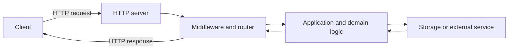

<TLDR>
  <TLDRCell label="what">
    A backend accepts client requests, applies authorization and business rules, reads or writes durable data, and returns results through a stable HTTP contract.
  </TLDRCell>
  <TLDRCell label="trap">
    Matching a route and returning JSON is only a start; unvalidated input, in-process state, and vague failure semantics break under concurrency, retries, or restarts.
  </TLDRCell>
  <TLDRCell label="fix">
    Define the request and response contract first, separate transport, domain, and persistence boundaries, and test success and failure paths over real HTTP.
  </TLDRCell>
</TLDR>

## What it is and why it exists

A backend is code that runs outside the user's device and handles requests and state for an application. For an HTTP service, it receives a method, target URI, headers, and an optional body, then returns a status code, headers, and an optional body after applying its rules. It may run on one server, across several processes, or in a serverless runtime; "backend" names a responsibility, not a machine shape.

Clients shouldn't own every business rule or receive direct database privileges. Pricing, resource authorization, and stock deductions need a controlled boundary that gives every client consistent results. The backend also connects short-lived network requests to longer-lived durable data.

To a client, the backend is first an <Term id="api-contract">API contract</Term>. The contract covers more than JSON fields: method semantics, paths, input limits, authentication, status codes, relevant response headers, and retry behavior all belong to it. Clients depend on these observable results, not on the framework or database behind them.

You meet a backend when a web form is submitted, a mobile app syncs data, a command-line tool checks status, or one service calls another. Every interaction crosses an unreliable network, so timeouts, broken connections, and duplicate requests are routine conditions rather than exotic edge cases.

### What a backend actually owns

A small HTTP backend usually has these responsibilities:

1. Select an operation from the HTTP method and path, and reject combinations it hasn't defined.
2. Parse and validate untrusted input before converting it into data the domain layer understands.
3. Authenticate the caller and authorize the specific resource and operation.
4. Preserve durable invariants across concurrent requests and process restarts.
5. Return stable responses and record enough context to diagnose failures.

Languages, frameworks, and databases are tools for those responsibilities. When you're starting out, completing one testable request path in one language reveals the boundaries better than comparing several stacks at once. The examples here use Node 24's built-in HTTP API and have no framework dependency.

## How it works

An HTTP server parses bytes from a connection into a request object. The application selects a handler from the method and target, then uses <Term id="middleware">middleware</Term> or explicit functions for cross-cutting work such as request identifiers, authentication, rate limiting, and logging. The handler validates input, invokes domain logic and storage, and finally encodes the result as an HTTP response.

The diagram shows a flow of responsibilities, not a required process layout. A small program can keep routing, application logic, and storage adapters in one codebase while maintaining clear inputs and outputs between them.



### The life of one request

You can trace a request in this order:

1. The server reads the request line, headers, and body while applying size and time limits.
2. Request-scoped middleware establishes a request ID, logging context, and verified caller identity.
3. The router selects a handler by method and path, returning an explicit `404` or `405` when none matches.
4. The handler parses the transport format, validates fields, and calls a business operation that doesn't depend on HTTP objects.
5. The storage layer starts a transaction when needed, checks durable constraints, and commits state changes.
6. Response mapping converts the result to a status, headers, and representation before request-scoped cleanup finishes.

Each request should have its own <Term id="request-context">request context</Term>. A request ID, authenticated principal, and deadline belong to that request; they should not live in mutable module variables that another request can overwrite. Database connections may come from a shared pool, but the transaction and borrowed connection must be released when the request or business operation ends.

### The contract comes before the handler

Write the observable contract before the route code. The table shows the minimum decisions for a create-task operation. Other choices can work, but their meaning cannot be left for each client to guess.

| Contract part | Example decision | Why the client needs it |
| --- | --- | --- |
| Method and target | `POST /tasks` | Distinguishes creation from reading the collection |
| Request media type | `application/json` | Determines how to parse the body |
| Input constraint | `title` is a non-empty string of at most 80 characters | Gives invalid requests a stable failure |
| Success response | `201 Created` with `Location` | Says an addressable resource was created |
| Failure response | `400`, `401`, `403`, `409` | Separates bad input, authentication, authorization, and conflict |
| Retry rule | Accept a caller-stable idempotency key | Avoids duplicate creation after an unknown result |

Transport validation proves only that the message has an acceptable shape. A string title doesn't prove the caller may create a task in a project or that the project is still open. Authorization and domain invariants need separate checks, while durable uniqueness should also have a database constraint.

### State and failure boundaries

Server memory is suitable for request-local values and rebuildable caches, not as the only record of business data. Worker processes have separate memory, a restart clears it, and two concurrent writers can observe different old values. Data that must survive a restart belongs in durable storage.

When the network disconnects, a client may not know whether the server committed an operation. This is an unknown outcome: no response does not prove that nothing happened. Safe retries rely on defined method semantics or, for non-idempotent creation, an <Term id="idempotency">idempotency</Term> protocol with atomic deduplication.

Error responses are part of the contract too. A production service shouldn't send internal stacks or database messages to callers; it should return a stable machine-readable category, a suitable explanation, and a request ID. <Term id="problem-details">Problem Details</Term> is one standard error representation, but adopting it still requires you to define the service's error types and fields.

## Examples

The three examples add routing, input validation, and a real HTTP round trip in sequence. Each was run with local Node 24, and the shown output is the actual result.

### Select an operation by method and path

The first example treats a request as ordinary data. The routing function handles only dispatch and response mapping, so you can test its outermost interface decisions before starting a network server.

<Depth level="quick">

```javascript run title="route_request.js"
function routeRequest(request) {
  const key = `${request.method} ${request.path}`;

  if (key === "GET /tasks") {
    return { status: 200, body: { tasks: [] } };
  }
  if (key === "POST /tasks") {
    return {
      status: 201,
      headers: { location: "/tasks/t-101" },
      body: { id: "t-101", title: request.body.title },
    };
  }
  return { status: 404, body: { error: "not_found" } };
}

const requests = [
  { method: "GET", path: "/tasks" },
  { method: "POST", path: "/tasks", body: { title: "Ship docs" } },
  { method: "GET", path: "/missing" },
];

for (const request of requests) {
  console.log(JSON.stringify(routeRequest(request)));
}
```

```text
{"status":200,"body":{"tasks":[]}}
{"status":201,"headers":{"location":"/tasks/t-101"},"body":{"id":"t-101","title":"Ship docs"}}
{"status":404,"body":{"error":"not_found"}}
```

</Depth>

`GET /tasks` and `POST /tasks` are different operations; matching only the path would conflate them. The creation branch uses `201` and `Location` to say a resource was created, while the unknown combination receives `404` instead of a fake success.

This function does not validate `request.body` or actually save a task. It matters that these missing boundaries stay visible: the next example adds validation, while persistence belongs to a real storage adapter rather than an array pretending to be one.

### Turn untrusted input into a valid value

The validation function rejects non-object bodies, checks field types and limits, and returns a normalized value on success. It doesn't depend on HTTP, so a unit test doesn't need to listen on a port.

```javascript run title="validate_task.js"
function validateTask(input) {
  if (input === null || typeof input !== "object" || Array.isArray(input)) {
    return { ok: false, errors: ["body must be an object"] };
  }

  const errors = [];
  if (typeof input.title !== "string" || input.title.trim() === "") {
    errors.push("title must be a non-empty string");
  } else if (input.title.length > 80) {
    errors.push("title must be at most 80 characters");
  }
  if (input.priority !== undefined && !["low", "normal", "high"].includes(input.priority)) {
    errors.push("priority is invalid");
  }

  return errors.length === 0
    ? { ok: true, value: { title: input.title.trim(), priority: input.priority ?? "normal" } }
    : { ok: false, errors };
}

const samples = [
  { title: "  Ship docs  ", priority: "high" },
  { title: "", priority: "urgent" },
  ["Ship docs"],
];

for (const sample of samples) {
  console.log(JSON.stringify(validateTask(sample)));
}
```

```text
{"ok":true,"value":{"title":"Ship docs","priority":"high"}}
{"ok":false,"errors":["title must be a non-empty string","priority is invalid"]}
{"ok":false,"errors":["body must be an object"]}
```

The success result contains values downstream code can trust, while a failure can map to `400 Bad Request`. Coercing with `String(input.title)` looks convenient but turns a missing value into the string `"undefined"`; strict checks preserve the real meaning of the error.

The length rule also needs a unit. JavaScript's `string.length` counts UTF-16 code units, which are neither user-perceived characters nor UTF-8 bytes. The 80 here is an example contract; a real service must give its UI, API, and database the same tested rule.

### Run a real HTTP round trip

The last example asks the operating system for a temporary port and sends requests with Node's `fetch()`. `sendJson()` centralizes the media type and encoding, while the handler puts the same request ID on success and failure responses.

```javascript run title="server_round_trip.js"
const { createServer } = require("node:http");

function sendJson(response, status, body) {
  response.writeHead(status, { "content-type": "application/json; charset=utf-8" });
  response.end(JSON.stringify(body));
}

const server = createServer((request, response) => {
  const requestId = "req-7";
  if (request.method === "GET" && request.url === "/health") {
    sendJson(response, 200, { status: "ok", requestId });
    return;
  }
  sendJson(response, 404, { error: "not_found", requestId });
});

server.listen(0, "127.0.0.1", async () => {
  const address = server.address();
  const baseUrl = `http://127.0.0.1:${address.port}`;

  for (const path of ["/health", "/missing"]) {
    const response = await fetch(`${baseUrl}${path}`);
    console.log(response.status, await response.text());
  }

  server.close();
});
```

```text
200 {"status":"ok","requestId":"req-7"}
404 {"error":"not_found","requestId":"req-7"}
```

Listening on port `0` avoids hard-coding a test port that might already be occupied. The application reads the assigned address from `server.address()` and closes the server afterward; a production process must also stop accepting requests, drain in-flight work, and set a forced-exit deadline.

The health endpoint says only that this process can handle that request. It doesn't prove the database is writable, the queue works, or a particular business capability is ready. Separate liveness from readiness and point the load balancer at the endpoint whose semantics match the deployment.

## Pitfalls

### Treating a request body as domain data

> [!PITFALL]
> Successful JSON parsing proves only valid syntax. Fields may be missing, wrongly typed, too long, or include a caller-controlled `ownerId`; spreading the whole object into a database record also creates a mass-assignment problem.

**Fix:** allowlist fields for the operation, parse types and limits strictly, then supply protected fields from authenticated identity and server state. Database constraints enforce final durable invariants, while application validation returns useful errors early.

### Treating an in-process array as a database

> [!PITFALL]
> An in-memory array is handy in a demonstration, but worker processes don't share it and a restart erases it. Read-then-write checks can also pass simultaneously under concurrency.

**Fix:** state which data may be lost and which must persist. Put uniqueness, foreign keys, and atomic updates in storage that can provide those guarantees, then catch and map constraint conflicts in the application.

### Returning success before commit

> [!PITFALL]
> If the response goes out first, a later database write or event publication can fail after the client has received an irrevocable success. Conversely, a connection can fail after commit, and a blind retry may duplicate the effect.

**Fix:** define the commit point and the retry protocol for unknown outcomes. When a record and event must move together, write the business record and an outbox entry in one transaction, then publish through a separate worker.

### Hiding every result behind one status

> [!PITFALL]
> Always returning `200` with `success: false` in the body prevents generic HTTP clients, caches, and monitoring from interpreting the result. Turning every exception into `500` instead mixes caller errors with service failures.

**Fix:** define a small stable set of status codes and error types for observable outcomes. Reserve `500` for unexpected server failures, record the internal cause, and keep stacks, SQL, and secrets out of the external response.

### Stacking middleware without checking order

> [!PITFALL]
> Middleware order has semantics. Authorization has no trusted principal if it runs before authentication; an error handler that doesn't wrap later handlers yields different error shapes on different paths.

**Fix:** draw the inbound and outbound order and record which context fields each middleware reads and produces. Send unauthenticated, unauthorized, and valid requests to every protected route instead of trusting a global configuration that looks right.

### Giving a health check side effects

> [!PITFALL]
> Orchestrators and load balancers call health endpoints frequently. A probe that creates records, sends messages, or runs expensive queries can change business state or amplify an outage.

**Fix:** keep liveness checks cheap and free of business side effects. Readiness should check only dependencies required to accept traffic, with short deadlines for each probe; put detailed diagnostics behind a protected operations interface.

## In the AI era

**What generated code gets wrong here**

Models often produce handlers that can demonstrate a feature but cannot survive real traffic: they trust `request.json()`, accept `ownerId` from the body, save tasks in a module array, and return `200` for every outcome. They may register authentication middleware after protected routes, omit body-size limits and JSON parse failures, or expose tokens and stacks through logs and responses. The subtler errors sit on failure timelines: a generated `POST` retry creates a second record when the database committed but the response was lost, while a failed event publish after record insertion has no transaction or outbox recovery path.

**Ask your AI to check**

- List the source, type, length limit, authorization rule, and final database constraint for every request field.
- Draw the order of authentication, middleware, routing, transaction commit, response send, and cleanup, then inject a failure at each boundary.
- Simulate two concurrent requests, a process restart, and "commit succeeded but response was lost"; state every visible outcome.

**Review checklist**

- Send valid, malformed, unauthenticated, unauthorized, conflicting, and unexpected-failure requests over real HTTP; verify status, headers, and body.
- Search for mutable module state, unbounded body reads, caller-controlled ownership fields, and internal errors returned directly.
- Under retries and concurrency, verify uniqueness, transaction boundaries, idempotency-key scope, resource cleanup, and log redaction.

**Prompt vocabulary**

Use the exact terms `request lifecycle`, `HTTP method semantics`, `API contract`, `transport validation`, `domain invariant`, `request context`, `transaction boundary`, `idempotency key`, `unknown outcome`, and `graceful shutdown`. Ask for a failure timeline and state-ownership table; "write a production-ready backend" doesn't say which guarantees need evidence.

<Depth level="deep">

## Boundaries behind one endpoint

A handler can quickly become one large function containing parsing, authorization, SQL, third-party calls, and response formatting. Separating boundaries isn't about increasing the file count; it lets each layer accept only the data it can judge. Clear boundaries make a failing test point to a particular contract.

### Transport boundary

The transport layer handles observable HTTP information: methods, path parameters, query parameters, headers, media types, bodies, and status codes. It converts untrusted bytes into a typed command and maps application results back to responses. A business function doesn't need to know how a response object writes to a socket.

Parsing needs limits and failure paths. A service should cap the allowed body size before reading it all, set timeouts for slow inputs, and distinguish unsupported media types, malformed JSON, and field validation failures. Framework defaults may be convenient during development, but they aren't your public contract.

### Domain boundary

The domain layer decides whether an operation is allowed by the business. It receives transport-validated values and a trusted principal, then checks resource ownership, state transitions, and cross-field rules. A syntactically valid task title can still be rejected because the project is archived.

Domain errors should be results the application can identify, not parsed database error text. Internal categories such as `ProjectArchived` or `TaskAlreadyExists` can map consistently to HTTP; changing a storage adapter shouldn't change the external meaning of an error.

### Persistence boundary

The storage layer implements queries, transactions, and durable constraints. It shouldn't receive a complete HTTP request or decide by itself whether a caller has business permission. Interfaces named for domain intent are easier to review than arbitrary SQL strings exposed throughout the application.

| Boundary | Accepted input | Produced result | Must not decide alone |
| --- | --- | --- | --- |
| Transport | HTTP request bytes and metadata | Parsed command or protocol error | Whether a resource may change |
| Domain | Validated command, principal, and current state | Domain result or domain error | HTTP serialization details |
| Persistence | Query conditions and atomic write intent | Data or constraint conflict | Whether caller identity is trusted |

These boundaries don't require three classes. A small service can express them as three ordinary functions as long as the parameters and return values are explicit. Preserve a clear dependency direction first, then extract shared interfaces when repetition appears.

### Request scope and concurrency

Node can interleave several requests in one process. JavaScript callbacks don't execute at the same instant, but an `await` lets another request proceed after shared state was read and before it is written back. A module-level `currentUser` or `currentRequestId` can therefore leak into another request.

Passing request data explicitly as function arguments is easiest to reason about. If many layers need context, you can use the runtime's asynchronous context mechanism, but keep its contents narrow and extract serializable values before background work starts. Request objects, response objects, and open transactions must not outlive the request.

Concurrency correctness often ends at the storage layer. A `SELECT` followed by an application check that a row "does not exist," then an `INSERT`, cannot stop another request inserting the same key between those steps. A unique constraint, conditional update, or suitable isolation level turns the check and write into an enforceable guarantee.

### Commit point and response

The commit point is where an operation moves from "can be rolled back" to "other requests may rely on it." For a single database transaction, it is usually a successful commit; work across systems requires a more explicit protocol. Sending an HTTP response cannot make two systems commit atomically.

If a transaction fails, the handler can return a defined error. If the connection breaks after commit, the server cannot undo the commit and the client cannot see the response. With a caller-stable idempotency key on a create operation, the service stores the key, request fingerprint, and result within the same atomic boundary.

The same key with different request content should be rejected rather than silently replaying an old result. Keys also need principal or tenant scope so one caller cannot collide with another caller's operation. The retention period must cover the client's possible retry window and appear in the public contract.

## From a first service to production

A useful learning path adds verifiable capabilities to one service instead of changing frameworks every week. A reasonable order is:

1. Define method, path, input, and response with pure functions, then test success and failure mappings.
2. Start a local HTTP server and use a real client to verify statuses, headers, and serialization.
3. Add a relational database, replacing in-process business state with migrations, constraints, and transactions.
4. Add authentication and resource-level authorization, testing denial paths for every protected operation.
5. Add structured logs, metrics, timeouts, and graceful shutdown so you can observe failures instead of guessing.
6. Deploy only after contract tests pass, then practice rollback, compatible change, and data recovery.

Each step should retain the tests from the preceding layers. The HTTP contract and domain cases should still hold when you replace a framework; if every test calls framework internals directly, a migration can hide changes in real external behavior.

### Observability is not printing everything

A request ID can connect ingress logs, database errors, and downstream calls, but it doesn't prove caller identity and shouldn't replace trace context. The service should accept or generate identifiers under a stated trust policy and use the same value in responses and logs.

Logs need an event category, duration, outcome, and necessary resource identifiers. Passwords, authorization headers, session cookies, full request bodies, and database connection strings generally don't belong there. Encode user-supplied newlines and control characters too, so they cannot forge log entries.

Metrics answer aggregate questions such as the count of a status class or the distribution of operation duration. Don't use user IDs or request IDs as metric labels; their high cardinality can overwhelm storage and queries. Use logs or traces for per-request detail.

### Different tests answer different questions

Pure-function unit tests suit parsing, domain rules, and result mapping. They run quickly and cover many boundary values, but they won't reveal that the real server omitted a header, decoded a path parameter incorrectly, or ran middleware in the wrong order.

An HTTP integration test sends requests to a listening application and verifies the complete exchange. It should check status, relevant headers, media type, and body instead of calling `response.json()` and inspecting one field. Close the server and connection pool at the end of the test.

Database integration tests should use the same database engine and migrations as production. In-memory substitutes can help unit tests but cannot prove isolation levels, constraints, ordering, or database-specific types. A concurrency test must overlap real transactions rather than call a function twice in sequence.

| Test layer | Best evidence for | Cannot prove alone |
| --- | --- | --- |
| Unit test | Input boundaries and domain branches | HTTP encoding and real transactions |
| HTTP integration | Routing, middleware, and external contract | Production proxy and network policy |
| Database integration | Migrations, constraints, and transaction behavior | Full client compatibility |
| Deployment probe | Startup, readiness, and shutdown paths | Every business invariant |

Run one more failure test before production: inject errors between storage calls, downstream calls, and response sending. Happy-path tests miss leaked connections, partial writes, and duplicate side effects, which tend to surface only during timeouts and retries.

### Choosing the next topic

Once you have a small service with persistence and tests, API design, database design, backend security, and backend testing become useful next topics. They extend the contract, state model, trust boundary, and evidence around the same request path.

Caching, message queues, and microservices should answer an observed need. A cache adds invalidation rules, a queue adds delivery and deduplication semantics, and a service split adds network failure; introducing them before the monolith's boundaries are clear creates more state you cannot explain.

</Depth>

<Checkpoint id="backend/getting-started" />

## Further reading

- [RFC 9110: HTTP Semantics](https://www.rfc-editor.org/rfc/rfc9110.html)
- [Node.js v24 documentation: HTTP](https://nodejs.org/docs/latest-v24.x/api/http.html)
- [MDN: Overview of HTTP](https://developer.mozilla.org/en-US/docs/Web/HTTP/Guides/Overview)
- [OWASP REST Security Cheat Sheet](https://cheatsheetseries.owasp.org/cheatsheets/REST_Security_Cheat_Sheet.html)
