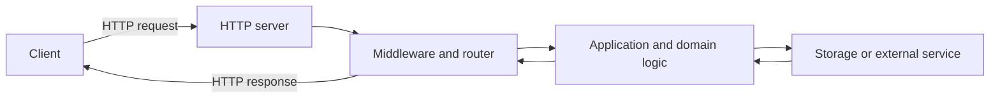

<TLDR>
  <TLDRCell label="what">
    后端接收客户端请求，执行授权与业务规则，读写持久数据，再通过稳定的HTTP契约返回结果。
  </TLDRCell>
  <TLDRCell label="trap">
    能匹配路由并返回JSON只是起点；未经验证的输入、进程内状态和不明确的失败语义，会在并发、重试或重启时出错。
  </TLDRCell>
  <TLDRCell label="fix">
    先定义请求与响应契约，再分开处理传输、领域和持久化边界，并用真实HTTP请求测试成功与失败路径。
  </TLDRCell>
</TLDR>

## 是什么，为什么存在

后端（backend）是运行在用户设备之外、代表应用处理请求和状态的代码。对于HTTP服务，它接收方法、目标URI、请求头和可选消息体，执行规则后返回状态码、响应头和可选消息体。部署位置可能是一台服务器、多个进程或无服务器运行时；“后端”描述职责，不限定机器形态。

客户端不应该直接拥有所有业务状态或数据库权限。价格计算、资源授权和库存扣减等规则需要一个受控边界，所有客户端都通过它得到一致结果。后端还负责把短暂的网络请求连接到寿命更长的持久数据。

对客户端而言，后端首先是一份<Term id="api-contract">API契约（API contract）</Term>。契约不只有JSON字段，还包括方法语义、路径、输入限制、认证要求、状态码、相关响应头以及重试后的行为。客户端依赖的是这些可观察结果，不是服务内部用了哪种框架或数据库。

你会在网页提交表单、移动应用同步数据、命令行工具查询状态或另一个服务调用接口时遇到后端。一次交互通常跨过不可靠网络，因此超时、连接中断和重复请求是正常情况，不是边缘事故。

### 后端真正负责的工作

一个小型HTTP后端通常需要承担这些职责：

1. 根据HTTP方法和路径选择操作，同时拒绝没有定义的组合。
2. 解析并验证不可信输入，再把它转换为领域层理解的数据。
3. 认证调用方，并对具体资源和操作执行授权。
4. 维护持久不变量，让并发请求和进程重启不会破坏数据。
5. 返回稳定响应，并记录足够信息以便诊断失败。

语言、框架和数据库只是实现这些职责的工具。刚开始学习时，先用一种语言完成一条可测试的请求路径，比同时比较多套技术栈更容易看清边界。本文使用Node 24的内置HTTP API，因此示例没有框架依赖。

## 工作原理

HTTP服务器把连接上的字节解析为请求对象。应用根据方法和目标选择处理器，再通过<Term id="middleware">中间件（middleware）</Term>或显式函数完成请求标识、认证、限流和日志等横切工作。处理器验证输入、调用领域逻辑和存储，最后把结果编码成HTTP响应。

下面的图是责任流，不表示每个系统都必须拆成这些进程。小程序可以把路由、应用逻辑和存储适配器放在同一个代码库中，但各层仍应有清楚的输入和输出。



### 一次请求的生命周期

可以按下面的顺序追踪一条请求：

1. 服务器读取请求行、请求头和消息体，并应用大小与时间限制。
2. 请求级中间件建立请求ID、日志上下文和经过验证的调用方身份。
3. 路由器按方法和路径选择一个处理器，找不到时返回明确的`404`或`405`。
4. 处理器解析传输格式，验证字段，再调用不依赖HTTP对象的业务操作。
5. 存储层在需要时开启事务，检查持久约束并提交状态变化。
6. 响应映射把结果转换为状态码、响应头和表示，随后完成请求级清理。

每个请求都应拥有独立的<Term id="request-context">请求上下文（request context）</Term>。请求ID、认证主体和截止时间属于该请求，不应放进会被其他请求覆盖的模块级可变变量。数据库连接可以来自共享连接池，但事务和连接借用必须在请求或业务操作结束时释放。

### 契约先于处理器

在写路由代码前，先写出可观察契约。下面的表格展示一个创建任务操作至少要决定什么；具体选择可以不同，但不能把含义留给客户端猜测。

| 契约部分 | 示例决定 | 为什么客户端需要它 |
| --- | --- | --- |
| 方法与目标 | `POST /tasks` | 区分创建操作与读取集合 |
| 请求媒体类型 | `application/json` | 决定消息体的解析方式 |
| 输入约束 | `title`是长度不超过80的非空字符串 | 让无效请求得到稳定错误 |
| 成功响应 | `201 Created`与`Location` | 表明已创建可寻址资源 |
| 失败响应 | `400`、`401`、`403`、`409` | 区分修正输入、认证和冲突 |
| 重试规则 | 接受调用方稳定提供的幂等键 | 避免结果未知时重复创建 |

传输验证只能证明消息形状可接受。标题是字符串，不代表调用方有权在某个项目中创建任务，也不代表该项目仍然开放。授权和领域不变量需要独立检查，持久唯一性还应由数据库约束兜底。

### 状态与失败边界

服务器内存适合请求期间的临时值和可重建缓存，不适合作为唯一业务记录。多个工作进程拥有不同内存，重启会清空它，两个并发写入还可能观察到不同旧值。需要在重启后存在的数据应进入持久存储。

网络断开时，客户端可能不知道服务端是否已经提交操作。这叫结果未知：没有收到响应不能证明操作没有发生。安全重试依靠明确的方法语义，或对非幂等创建操作使用<Term id="idempotency">幂等性（idempotency）</Term>协议和原子去重。

错误响应也是契约的一部分。生产服务不应把内部堆栈和数据库消息发给调用方；它应返回稳定的机器可读类别、适合用户的说明和请求ID。<Term id="problem-details">问题详情（Problem Details）</Term>是一种标准错误表示选择，但采用它仍需定义本服务的错误类型与字段。

## 示例

三个示例逐步加入路由、输入验证和真实HTTP往返。它们都已用本地Node 24执行，下面的输出来自实际运行结果。

### 用方法与路径选择操作

第一个示例把请求看成普通数据。路由函数只做分派和响应映射，因此可以在启动网络服务器前测试接口最外层的决定。

<Depth level="quick">

```javascript run title="route_request.js"
function routeRequest(request) {
  const key = `${request.method} ${request.path}`;

  if (key === "GET /tasks") {
    return { status: 200, body: { tasks: [] } };
  }
  if (key === "POST /tasks") {
    return {
      status: 201,
      headers: { location: "/tasks/t-101" },
      body: { id: "t-101", title: request.body.title },
    };
  }
  return { status: 404, body: { error: "not_found" } };
}

const requests = [
  { method: "GET", path: "/tasks" },
  { method: "POST", path: "/tasks", body: { title: "Ship docs" } },
  { method: "GET", path: "/missing" },
];

for (const request of requests) {
  console.log(JSON.stringify(routeRequest(request)));
}
```

```text
{"status":200,"body":{"tasks":[]}}
{"status":201,"headers":{"location":"/tasks/t-101"},"body":{"id":"t-101","title":"Ship docs"}}
{"status":404,"body":{"error":"not_found"}}
```

</Depth>

`GET /tasks`与`POST /tasks`是两个不同操作；只匹配路径会把它们混在一起。创建分支用`201`和`Location`表达资源已经创建，未知组合则得到`404`，而不是伪装成成功响应。

这个函数尚未验证`request.body`，也没有真正保存任务。把未完成的边界写得明显很重要：示例下一步补上验证，持久化则留给真实存储适配器，不能用数组冒充。

### 把不可信输入变成有效值

验证函数拒绝非对象消息体，检查字段类型和长度，并在成功时返回规范化值。它不依赖HTTP，因此单元测试不需要监听端口。

```javascript run title="validate_task.js"
function validateTask(input) {
  if (input === null || typeof input !== "object" || Array.isArray(input)) {
    return { ok: false, errors: ["body must be an object"] };
  }

  const errors = [];
  if (typeof input.title !== "string" || input.title.trim() === "") {
    errors.push("title must be a non-empty string");
  } else if (input.title.length > 80) {
    errors.push("title must be at most 80 characters");
  }
  if (input.priority !== undefined && !["low", "normal", "high"].includes(input.priority)) {
    errors.push("priority is invalid");
  }

  return errors.length === 0
    ? { ok: true, value: { title: input.title.trim(), priority: input.priority ?? "normal" } }
    : { ok: false, errors };
}

const samples = [
  { title: "  Ship docs  ", priority: "high" },
  { title: "", priority: "urgent" },
  ["Ship docs"],
];

for (const sample of samples) {
  console.log(JSON.stringify(validateTask(sample)));
}
```

```text
{"ok":true,"value":{"title":"Ship docs","priority":"high"}}
{"ok":false,"errors":["title must be a non-empty string","priority is invalid"]}
{"ok":false,"errors":["body must be an object"]}
```

成功结果包含后续逻辑可以信任的值，失败结果则可以映射为`400 Bad Request`。用`String(input.title)`强制转换看似省事，却会把缺失值变成字符串`"undefined"`；严格检查能保留错误的真实含义。

长度规则还需要说明计量单位。JavaScript的`string.length`计算UTF-16代码单元，不等同于用户看到的字符数，也不等同于UTF-8字节数。这里的80是示例契约；真实服务必须让UI、API和数据库采用一致且经过测试的规则。

### 运行一个真实HTTP往返

最后的示例让操作系统分配临时端口，再用Node的`fetch()`发起请求。`sendJson()`集中设置媒体类型和编码，处理器则保证成功与失败响应都带同一个请求ID。

```javascript run title="server_round_trip.js"
const { createServer } = require("node:http");

function sendJson(response, status, body) {
  response.writeHead(status, { "content-type": "application/json; charset=utf-8" });
  response.end(JSON.stringify(body));
}

const server = createServer((request, response) => {
  const requestId = "req-7";
  if (request.method === "GET" && request.url === "/health") {
    sendJson(response, 200, { status: "ok", requestId });
    return;
  }
  sendJson(response, 404, { error: "not_found", requestId });
});

server.listen(0, "127.0.0.1", async () => {
  const address = server.address();
  const baseUrl = `http://127.0.0.1:${address.port}`;

  for (const path of ["/health", "/missing"]) {
    const response = await fetch(`${baseUrl}${path}`);
    console.log(response.status, await response.text());
  }

  server.close();
});
```

```text
200 {"status":"ok","requestId":"req-7"}
404 {"error":"not_found","requestId":"req-7"}
```

监听端口`0`可避免在测试中硬编码一个可能被占用的端口。应用读取`server.address()`获得实际地址，然后在结束时关闭服务器；生产进程还需要停止接收新请求、等待在途工作并设置强制退出期限。

健康端点只说明这个进程能处理该请求。它不自动证明数据库可写、队列正常或某项业务就绪。把存活检查与就绪检查分开，并让负载均衡器使用符合部署语义的那个端点。

## 陷阱

### 把请求体直接当成领域数据

> [!PITFALL]
> JSON解析成功只说明语法有效。字段可能缺失、类型错误、过长或包含调用方无权设置的`ownerId`；把整个对象展开进数据库记录还会引入批量赋值问题。

**修复：**按操作建立允许字段列表，严格解析类型和边界，再从经过认证的身份与服务端状态补充受保护字段。数据库约束负责最终持久不变量，应用验证负责尽早返回有用错误。

### 把进程内数组当成数据库

> [!PITFALL]
> 内存数组在演示时很方便，但多个工作进程不会共享它，重启后数据也会消失。先读取再写入的检查在并发下还可能同时通过。

**修复：**明确哪些状态允许丢失，哪些必须持久化。把唯一性、外键和原子更新交给支持这些保证的存储，在应用层捕获并映射约束冲突。

### 在提交完成前返回成功

> [!PITFALL]
> 如果响应先发送，后续数据库写入或事件发布失败，客户端已经拿到无法撤回的成功结果。反过来，先提交再因连接断开丢失响应，会让盲目重试产生重复效果。

**修复：**先定义提交点和结果未知时的重试协议。需要同时保存记录并发布事件时，可在一个事务中写入业务记录和outbox，再由独立发布者处理事件。

### 用一个状态码掩盖所有结果

> [!PITFALL]
> 始终返回`200`并在响应体写`success: false`，会破坏通用HTTP客户端、缓存和监控对结果的判断。把所有异常都变成`500`又会把调用方错误与服务故障混在一起。

**修复：**为每类可观察结果定义少量稳定状态码和错误类型。保留`500`给未预期的服务端失败，记录内部原因，但不要把堆栈、SQL或秘密写进外部响应。

### 先堆中间件，后确认顺序

> [!PITFALL]
> 中间件顺序具有语义。授权若在身份认证之前运行，请求就没有可信主体；错误处理若包不到后注册的处理器，异常格式会随路径变化。

**修复：**画出进入与返回顺序，记录每个中间件读取和产生的上下文字段。对每条受保护路由发送无凭据、无权限和有效凭据请求，不能只检查全局配置看起来正确。

### 让健康检查执行有副作用的工作

> [!PITFALL]
> 编排器和负载均衡器会频繁调用健康端点。若端点创建记录、发送消息或运行昂贵查询，一次普通探测就可能修改业务状态或放大故障。

**修复：**存活检查保持便宜且无业务副作用。就绪检查只验证接流量所需的依赖，并为每项探测设置短期限；详细诊断放在受保护的运维接口中。

<Depth level="deep">

## 一个端点背后的边界

一个处理器很容易长成解析、授权、SQL、第三方调用和响应格式混在一起的大函数。按边界拆分不是为了增加文件数量，而是让每一层只接受它能够判断的数据。边界越明确，测试越能定位是哪项契约失败。

### 传输边界

传输层只处理HTTP可观察信息：方法、路径参数、查询参数、请求头、媒体类型、消息体和状态码。它把不可信字节转换为有类型的命令，也把应用结果转换为响应。业务函数不需要知道响应对象如何写入socket。

解析必须有上限和失败路径。服务应在读取完整消息体前限制允许大小，为慢速输入设置超时，并区分不支持的媒体类型、畸形JSON和字段验证失败。框架的默认值可能方便开发，但它不是你的公开契约。

### 领域边界

领域层决定操作在业务上是否允许。它接收经过传输验证的值和可信主体，检查资源所有权、状态转换与跨字段规则。例如，合法字符串形式的任务标题仍可能因为项目已归档而被拒绝。

领域错误应是应用能识别的结果，而不是解析数据库错误文本。`ProjectArchived`、`TaskAlreadyExists`这类内部类别可以稳定映射到HTTP；存储适配器更换后，外部错误含义不应跟着改变。

### 持久化边界

存储层实现查询、事务和持久约束。它不应接收完整HTTP请求，也不应自行决定当前调用方是否有业务权限。接口用领域含义命名，比到处暴露任意SQL字符串更容易审查。

| 边界 | 接受的输入 | 产出的结果 | 不应自行决定 |
| --- | --- | --- | --- |
| 传输 | HTTP请求字节与元数据 | 已解析命令或协议错误 | 资源是否允许改变 |
| 领域 | 已验证命令、主体与当前状态 | 领域结果或领域错误 | HTTP序列化细节 |
| 持久化 | 查询条件与原子写入意图 | 数据或约束冲突 | 调用方身份是否可信 |

这些边界不要求三层都变成类。小型服务可以用三个普通函数表达它们，前提是参数和返回值明确。先保留清楚的依赖方向，等重复出现后再抽象共享接口。

### 请求作用域与并发

Node可以在一个进程中交错处理多个请求。即使JavaScript回调不同时执行，`await`仍会让另一个请求在共享变量被读取后、写回前继续运行。模块级`currentUser`或`currentRequestId`因此会串到别的请求中。

把请求数据作为参数显式传递最容易推理。需要跨多层读取上下文时，可以使用运行时提供的异步上下文机制，但仍要限制内容，并在后台工作开始前提取可序列化值。请求对象、响应对象和打开的事务不应跨越请求生命周期。

并发正确性最终常落在存储层。`SELECT`后在应用中判断“不存在”，再执行`INSERT`，不能阻止另一个请求在两步之间插入同一个键。唯一约束、条件更新或适当隔离级别才可以把检查与写入变成可执行保证。

### 提交点与响应

提交点是操作从“可以回滚”变成“其他请求可以依赖”的位置。对单个数据库事务，它通常是成功提交；对跨系统工作，则需要更明确的协议。发送HTTP响应本身不能让两个系统原子提交。

如果事务失败，处理器可以返回已定义错误；如果提交成功后连接断开，服务端不能把提交撤回，客户端也看不到响应。对创建操作使用调用方稳定提供的幂等键时，服务应把键、请求指纹和结果在同一原子边界保存。

相同键配合不同请求内容应被拒绝，而不是悄悄复用旧结果。键还要有主体或租户作用域，否则一个调用方可能碰撞另一个调用方的操作。保留期限必须覆盖客户端可能重试的窗口，并写入公开契约。

## 从第一个服务走向生产

学习路径应沿着一个服务增加可验证能力，而不是每周更换框架。一个合理顺序如下：

1. 用纯函数定义方法、路径、输入和响应，再测试成功与失败映射。
2. 启动本地HTTP服务器，通过真实客户端验证状态码、响应头和序列化结果。
3. 接入关系数据库，用迁移、约束和事务替换进程内业务状态。
4. 加入认证与资源级授权，并对每个受保护操作测试拒绝路径。
5. 添加结构化日志、指标、超时和优雅关闭，观察故障而不是猜测。
6. 在契约测试通过后部署，再练习回滚、兼容变更和数据恢复。

每一步都应保留上一层的测试。更换框架时，HTTP契约和领域用例应该继续成立；如果所有测试都只能通过框架内部对象调用，迁移会掩盖真正的外部行为变化。

### 可观测性不是打印所有内容

请求ID可以把入口日志、数据库错误和下游调用串在一起，但它不证明调用方身份，也不应替代追踪上下文。服务要接受或生成符合信任策略的标识，并确保响应和日志使用同一个值。

日志记录事件类别、持续时间、结果和必要资源标识即可。密码、授权头、会话cookie、完整请求体和数据库连接串通常不应出现。对用户提供的换行与控制字符还要编码，避免伪造日志条目。

指标回答聚合问题，例如某类状态码的数量和操作耗时分布。不要把用户ID或请求ID当成指标标签，否则高基数会使存储和查询成本失控。需要逐请求细节时，用日志或追踪。

### 用不同测试回答不同问题

纯函数单元测试适合验证解析、领域规则和结果映射。它们运行快，并能覆盖很多边界值，但不会发现实际服务器省略响应头、错误解码路径参数或中间件顺序错误。

HTTP集成测试通过监听中的应用发送请求，验证完整交换。它应检查状态码、相关响应头、媒体类型和消息体，而不只调用`response.json()`后看一个字段。测试结束时还要关闭服务器和连接池。

数据库集成测试应使用与生产相同的数据库引擎和迁移。内存替身可以帮助单元测试，但无法证明隔离级别、约束、排序和数据库特有类型的行为。并发测试需要真正重叠事务，而不是顺序调用两次函数。

| 测试层 | 最适合证明 | 不能单独证明 |
| --- | --- | --- |
| 单元测试 | 输入边界和领域分支 | HTTP编码与真实事务 |
| HTTP集成测试 | 路由、中间件和外部契约 | 生产代理与网络策略 |
| 数据库集成测试 | 迁移、约束和事务行为 | 完整客户端兼容性 |
| 部署探测 | 启动、就绪和关闭路径 | 所有业务不变量 |

生产前还要做一项失败测试：在存储调用、下游调用和响应发送之间注入错误。只测顺利路径会漏掉未释放连接、部分写入和重复副作用，而这些问题往往只在超时或重试时出现。

### 选择下一主题

完成一个带持久化和测试的小型服务后，再深入API设计、数据库设计、后端安全和后端测试会更有效。这些主题分别扩展契约、状态模型、信任边界和验证证据，仍然围绕同一条请求路径。

缓存、消息队列和微服务应该由已观察到的需求驱动。缓存引入失效规则，队列引入投递与去重语义，服务拆分引入网络失败；在单体边界尚未清楚时提前加入它们，只会增加无法解释的状态。

</Depth>

<Checkpoint id="backend/getting-started" />

## 延伸阅读

- [RFC 9110：HTTP语义](https://www.rfc-editor.org/rfc/rfc9110.html)
- [Node.js v24文档：HTTP](https://nodejs.org/docs/latest-v24.x/api/http.html)
- [MDN：HTTP概览](https://developer.mozilla.org/en-US/docs/Web/HTTP/Guides/Overview)
- [OWASP REST安全速查表](https://cheatsheetseries.owasp.org/cheatsheets/REST_Security_Cheat_Sheet.html)
