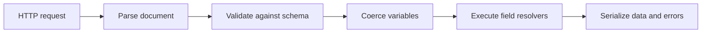

<TLDR>
  <TLDRCell label="what">
    GraphQL is an API query language, type system, and execution model. A client submits an operation and selects fields; the server validates it against a schema and returns data shaped like that selection.
  </TLDRCell>
  <TLDRCell label="trap">
    Flexible field selection isn't authorization, and it doesn't automatically solve N+1 reads, caching, or resource abuse. A false Non-Null promise can also erase a whole response subtree when one field fails.
  </TLDRCell>
  <TLDRCell label="fix">
    Authorize at the business data boundary, create batch loaders per request, and bound operations by list size and field cost. Mark only fields the service can reliably deliver as Non-Null.
  </TLDRCell>
</TLDR>

## What it is and why it exists

GraphQL is a specification for data requests between client and server applications. It defines documents, a type system, validation, and execution semantics, but it doesn't prescribe a database, web framework, or transport. The familiar single `/graphql` HTTP endpoint is a deployment choice, not the definition of GraphQL.

Each service exposes a <Term id="graphql-schema">GraphQL schema</Term>. The schema lists fields that can be read or changed, their arguments, result types, and nullability constraints. A client's <Term id="selection-set">selection set</Term> contains only the fields needed by the current view, so response shapes can vary by operation while remaining inside a server-owned type contract.

This model fits systems where several clients read related data in different combinations. An order list may need only an ID and amount, while a detail view also needs products and delivery status; both can be expressed through one schema without adding a response shape for every screen. GraphQL can't make an expensive data source cheap. It makes the requested work explicit.

GraphQL and REST aren't mutually exclusive feature sets. REST organizes an interface around resources, HTTP methods, and cacheable representations; GraphQL organizes capabilities around types and fields. A system can use GraphQL for aggregate views while retaining ordinary HTTP endpoints for file transfer, webhooks, or simple resources.

A GraphQL document can contain `query`, `mutation`, and `subscription` operations. A `query` reads, a `mutation` expresses a write, and a `subscription` describes an operation that produces later results as events occur. Subscriptions still need an event source and transport; the specification doesn't choose WebSockets or guarantee durable delivery.

GraphQL pays off less through a raw request-count claim than through a contract tools can inspect. The schema enables completion, validation, type generation, and change checks. Its cost is equally concrete: the server must control the work allowed by any valid operation and enforce authorization along every field's data path.

## How it works

When a server receives a GraphQL document, variables, and an optional operation name, it parses the document and validates it against the schema. It then coerces variables according to their declared input types. Only after those steps succeed does the executor collect fields from the root operation type and invoke resolvers. The final response normally contains `data` and may also contain `errors` when execution fails.



Parsing only determines whether the document follows GraphQL syntax. Validation rejects unknown fields, missing required arguments, subselections on leaf fields, and variables with incompatible types. Validation precedes resolver execution, so an invalid operation shouldn't trigger business data access.

### Schemas and selection sets

Object types contain fields. Each field has an output type and may declare named arguments. Scalars and enums are leaf values and can't have subselections; objects, interfaces, and unions require subselections that state which fields to fetch. Input objects belong only in input positions and can't be reused directly as output object types.

`String` is nullable by default, while `String!` promises a value. An exclamation mark outside a list and one inside it constrain different positions, so `[Order!]!` means the list is not null and none of its items are null. The empty list `[]` still satisfies that type. Non-Null doesn't mean "at least one item."

A client can use aliases to change response keys and fragments to reuse selections. The executor collects mergeable fields by response key, and one field may appear through several fragments. Cost analysis therefore can't count document lines alone; it has to expand fragments and account for aliases, list sizes, and the actual resolver work.

### Resolvers and context

A <Term id="resolver">resolver</Term> connects a schema field to application data. Implementations commonly pass it a parent value, field arguments, request context, and execution information. A root resolver usually calls an application service. A child resolver may read a property from its parent, calculate a value, or load a related object.

Request context is a good home for the authenticated principal, request-scoped loaders, trace information, and service interfaces. It must belong to the current operation; mutable user state must not live in a process-global object. Resolvers still need authorization through the business layer or a policy function. Reading `userId` from arguments doesn't prove the caller owns that user.

Sibling fields in an ordinary query may complete concurrently, so execution order shouldn't become a business contract. Top-level mutation fields execute serially in document order, although each one can still start concurrent internal work. Serial execution is not a database transaction, idempotency, or rollback.

### Data and errors

The `data` key of a successful response follows the operation's selection shape, with aliases used as JSON keys. A validation failure normally has no `data`; a field execution failure may return partial `data` alongside `errors`. Each execution error can carry a `path` that locates the failed response field.

When a Non-Null field produces `null` or throws, the error propagates upward until execution reaches a nullable parent. That parent becomes `null`, while data outside it may survive. This <Term id="null-bubbling">null bubbling</Term> makes schema nullability a real failure boundary rather than a documentation hint.

HTTP status codes belong to the GraphQL-over-HTTP layer. Don't infer that every implementation must return one status whenever the body contains `errors`, and don't let a client check only the status while ignoring the body. Proxies, authentication middleware, parse or validation failures, and field execution failures sit at different boundaries.

## Examples

The four examples build from field selection to field authorization, null bubbling, and request-scoped batching. Their output was produced with Node 24.14.0, using GraphQL.js 17.0.2 and DataLoader 2.2.3 installed in a temporary directory.

### Executing a typed query

The schema exposes the complete `Product` type, but the operation selects only `name` and `priceCents`. The response doesn't include `id` merely because the backing object has that property.

<Depth level="quick">

```javascript run title="basic-query.js"
const { buildSchema, graphql } = require("graphql");

const schema = buildSchema(`
  type Product {
    id: ID!
    name: String!
    priceCents: Int!
  }

  type Query {
    product(id: ID!): Product
  }
`);

const products = [
  { id: "p1", name: "Mechanical keyboard", priceCents: 8900 },
];

const source = `
  query ProductCard($id: ID!) {
    product(id: $id) {
      name
      priceCents
    }
  }
`;

async function main() {
  const result = await graphql({
    schema,
    source,
    rootValue: { product: ({ id }) => products.find((p) => p.id === id) },
    variableValues: { id: "p1" },
  });
  console.log(JSON.stringify(result, null, 2));
}

main();
```

```text
{
  "data": {
    "product": {
      "name": "Mechanical keyboard",
      "priceCents": 8900
    }
  }
}
```

<TryToBreak items={['an unknown product ID', 'a missing required variable', 'a field absent from the schema']} />

</Depth>

The variable is sent separately from the document, so user input doesn't have to be interpolated into query text. When no product matches, the nullable `product` type allows `{ "product": null }`. If the business must distinguish "not found" from "not allowed," define an explicit error and authorization policy as well.

This example uses default field resolution: same-named properties on the returned object supply `name` and `priceCents`. A real service will normally delegate its root field to an application service instead of reading an in-process array.

### Using request context in a field resolver

The `ownerEmail` resolver below decides whether to return an address based on the authenticated viewer. The field is nullable because redaction is an allowed result of this contract.

```javascript run title="resolver-context.js"
const { GraphQLID, GraphQLInt, GraphQLNonNull, GraphQLObjectType,
  GraphQLSchema, GraphQLString, graphql } = require("graphql");

const orders = [
  { id: "o1", ownerId: "u1", ownerEmail: "a@example.com", totalCents: 4200 },
  { id: "o2", ownerId: "u2", ownerEmail: "b@example.com", totalCents: 7300 },
];

const Order = new GraphQLObjectType({
  name: "Order",
  fields: {
    id: { type: new GraphQLNonNull(GraphQLID) },
    totalCents: { type: new GraphQLNonNull(GraphQLInt) },
    ownerEmail: {
      type: GraphQLString,
      resolve: (order, _args, context) =>
        context.viewerId === order.ownerId ? order.ownerEmail : null,
    },
  },
});

const Query = new GraphQLObjectType({
  name: "Query",
  fields: {
    order: {
      type: Order,
      args: { id: { type: new GraphQLNonNull(GraphQLID) } },
      resolve: (_source, { id }) => orders.find((order) => order.id === id),
    },
  },
});

graphql({ schema: new GraphQLSchema({ query: Query }),
  source: `{ mine: order(id: "o1") { ownerEmail }
             theirs: order(id: "o2") { ownerEmail } }`,
  contextValue: { viewerId: "u1" } })
  .then((result) => console.log(JSON.stringify(result, null, 2)));
```

```text
{
  "data": {
    "mine": {
      "ownerEmail": "a@example.com"
    },
    "theirs": {
      "ownerEmail": null
    }
  }
}
```

The `mine` and `theirs` aliases execute the same `order` field twice with different arguments. Authorization sits at the `ownerEmail` data boundary, so reaching an `Order` through another query path won't bypass the check later.

Nullable redaction is only one policy. If callers must know that access was denied, the resolver can throw an error with a stable extension code. Whichever policy you choose, keep the schema, client handling, and tests consistent.

### Watching a Non-Null error propagate

`receiptEmail` is declared as `String!`, but the data source returns `null`. The executor can't deliver a `Checkout` that violates the schema, so it sets the nearest nullable parent, `checkout`, to `null` and preserves its sibling `serviceName`.

```javascript run title="null-bubbling.js"
const { buildSchema, graphql } = require("graphql");

const schema = buildSchema(`
  type Checkout {
    id: ID!
    receiptEmail: String!
  }

  type Query {
    serviceName: String!
    checkout: Checkout
  }
`);

const rootValue = {
  serviceName: "Store",
  checkout: { id: "c1", receiptEmail: null },
};

graphql({
  schema,
  source: `{ serviceName checkout { id receiptEmail } }`,
  rootValue,
}).then((result) => console.log(JSON.stringify(result, null, 2)));
```

```text
{
  "errors": [
    {
      "message": "Cannot return null for non-nullable field Checkout.receiptEmail.",
      "locations": [
        {
          "line": 1,
          "column": 29
        }
      ],
      "path": [
        "checkout",
        "receiptEmail"
      ]
    }
  ],
  "data": {
    "serviceName": "Store",
    "checkout": null
  }
}
```

If `checkout` were also `Checkout!`, propagation would continue to the root and could turn all of `data` into `null`. Mechanically copying database `NOT NULL` constraints into the public schema is unsafe. A remote dependency, authorization redaction, or bad historical row can still prevent a resolver from supplying a value.

Clients must handle partial data and error paths together. A test that asserts only a successful HTTP exchange, or only that `data` exists, misses this local failure.

### Batching related reads

The order list resolves three `customer` fields, and two refer to `c1`. A request-scoped <Term id="data-loader">DataLoader</Term> combines keys in one scheduling window and memoizes the duplicate, so its batch function receives only `c1,c2`.

```javascript run title="batched-resolvers.js"
const DataLoader = require("dataloader");
const { buildSchema, graphql } = require("graphql");
const customers = [{ id: "c1", name: "Ada" }, { id: "c2", name: "Lin" }];
const orders = [
  { id: "o1", customerId: "c1" }, { id: "o2", customerId: "c2" },
  { id: "o3", customerId: "c1" },
];
let databaseCalls = 0;

async function findCustomers(ids) {
  databaseCalls += 1;
  console.log(`batch keys: ${ids.join(",")}`);
  const byId = new Map(customers.map((customer) => [customer.id, customer]));
  return ids.map((id) => byId.get(id) ?? null);
}

const schema = buildSchema(`type Customer { id: ID!, name: String! }
  type Order { id: ID!, customer: Customer }
  type Query { orders: [Order!]! }`);

async function main() {
  // Create this loader per request so its memoized values cannot cross users.
  const customerLoader = new DataLoader(findCustomers);
  const rootValue = {
    orders: (_args, context) => orders.map((order) => ({
      ...order,
      customer: () => context.customerLoader.load(order.customerId),
    })),
  };
  const result = await graphql({
    schema,
    source: `{ orders { id customer { name } } }`,
    rootValue,
    contextValue: { customerLoader },
  });
  console.log(JSON.stringify(result.data));
  console.log(`database calls: ${databaseCalls}`);
}

main();
```

```text
batch keys: c1,c2
{"orders":[{"id":"o1","customer":{"name":"Ada"}},{"id":"o2","customer":{"name":"Lin"}},{"id":"o3","customer":{"name":"Ada"}}]}
database calls: 1
```

The output proves that the three relationship fields caused one batch read in this operation. A batch function must return one result for every input key in the same position. If the backend changes ordering, reorder by key as the example does, and use `null` or an `Error` as a placeholder for a missing item.

DataLoader's memoization map isn't a shared application cache. Reusing one instance across requests can expose an object loaded under one user's permissions to another user, and it keeps stale values alive. After mutating an entity already loaded in the same request, clear or replace that key as well.

## Pitfalls

### Treating schema validation as authorization

> [!PITFALL]
> The schema proves only that fields and arguments are type-valid. An attacker can still submit someone else's order ID or reach the same sensitive object through another query path.

**Fix:** authorize the authenticated principal from request context at the service or field boundary that reads business data. Test rejection through every reachable path, and don't trust an owner field supplied by the client.

### Setting only a depth limit

> [!PITFALL]
> A shallow operation can still exhaust resources through many aliases, expensive fields, and huge list arguments. A fixed depth also can't express that two fields have very different costs.

**Fix:** cap document size, field or alias count, pagination, and computed operation cost, then enforce execution timeouts and downstream budgets. For public clients, pair those controls with an allowlist of trusted or persisted documents.

### Awaiting one row at a time in resolvers

> [!PITFALL]
> Once a list field returns N objects, a child resolver that makes one backend call per object creates an N+1 access pattern. With one or two fixture rows, the code looks perfectly healthy.

**Fix:** record downstream call counts for a real operation and send keys for the same resource type through a request-scoped batch loader. Preserve input length and order in the batch function, and bound its batch size.

### Promising Non-Null too early

> [!PITFALL]
> Mapping a non-optional TypeScript property or database `NOT NULL` directly to GraphQL Non-Null ignores authorization redaction, remote failures, and bad historical data. One missing leaf can erase an object or even the root data.

**Fix:** choose nullability based on whether the API can always deliver the value, and test paths where the resolver throws or returns `null`. Before tightening nullability on a published field, measure real data and give clients time to migrate.

### Treating a mutation as a transaction

> [!PITFALL]
> Serial execution of top-level mutation fields defines only their execution order. It doesn't place multiple database writes in a transaction, undo earlier side effects when a later field fails, or make a network retry idempotent.

**Fix:** define the transaction boundary in an application service, add a caller-stable idempotency key for retryable writes, and test a response lost after commit. Don't make clients compose several top-level fields that must be atomic.

### Changing the schema without a removal plan

> [!PITFALL]
> Removing a field, changing its type, or adding a required argument to an existing field breaks deployed operations. Adding an enum value is usually additive, yet it can still break an exhaustive client branch.

**Fix:** add a replacement field and deprecate the old one, observe a migration window, then use operation usage data to choose removal time. Run schema checks against stored operations and generated clients, and define client behavior for unknown enum values.

<Depth level="deep">

## Nullability is a failure boundary

GraphQL types are nullable by default, and `!` turns failure to deliver a value from an ordinary result into an execution error. That choice affects server failure propagation, client types, and cache writes, so it should start from a public delivery guarantee instead of being copied from an internal model.

| Type | List nullable | Items nullable | Valid examples |
| --- | --- | --- | --- |
| `String` | Not applicable | Not applicable | `null`, `"paid"` |
| `String!` | Not applicable | Not applicable | `"paid"` |
| `[String!]` | Yes | No | `null`, `[]`, `["paid"]` |
| `[String!]!` | No | No | `[]`, `["paid"]` |

When a Non-Null list item fails, the whole list position first becomes `null`; if the list itself is Non-Null, propagation continues into its parent. Layers of `!` on nested objects enlarge the failure region. If an important client view relies on partial data, schema designers need to decide which objects may disappear when a dependency fails.

An `errors[].path` records response keys and list indexes from the root to the failed field. Logs should connect that path with an operation name, request ID, and stable error code, without recording unsanitized variables. Client-facing messages belong in the response; internal stacks and database details belong only in controlled logs.

An expected business rejection doesn't have to be an execution error. Insufficient stock can be a typed mutation payload result, while an infrastructure outage is better represented as an error. Either way, the client must be able to distinguish a displayable outcome, a retryable failure, and a programming defect.

## Resolver ownership and batching

Keep resolvers thin: read coerced arguments and request context, call a service that owns business rules, then map the result to the schema. Spreading transaction rules across field resolvers lets another query path bypass them and makes atomicity hard to define.

Default field resolution works well for reading same-named properties from a parent value. Authorization, batching, formatting, or remote calls deserve an explicit field resolver. The syntax tree in `info` can help with diagnosis and planning, but translating arbitrary selections directly into SQL column names couples layers and may bypass data-layer allowlists.

One request may carry several loaders, such as users by ID and order lines by order ID. A loader key has to include every dimension that changes the result. If one resource ID resolves differently by tenant, locale, or permission scope, a bare ID isn't enough. Binding the whole loader instance to a request and tenant is often simpler.

The batch function must return an array with the same length and order as its key array. A database `IN` query usually doesn't guarantee result order and may omit missing rows, so build a keyed map and reorder the result. Rejecting the whole batch for one missing key makes otherwise successful sibling fields fail together.

DataLoader combines `.load()` calls made in one scheduling window. A resolver that awaits each load before issuing the next moves keys into separate windows that could have shared a batch. Start same-level load promises before awaiting them together, which also matches how GraphQL commonly executes sibling fields.

After a mutation changes an entity, a loader in the same request may still hold the old object. The write service should return authoritative new state and clear or prime affected keys. Freshness across requests belongs to the shared cache and storage protocol, not to a request memoization map.

## Controlling operation cost before execution

An operation can be syntactically valid and schema-valid while still being too expensive. Width, repeated aliases, recursive relationships, list multipliers, search fields, and downstream fan-out all matter. Looking only at maximum depth misses a thousand aliases placed side by side.

Cost rules need schema knowledge. A scalar may have a low base cost, a paginated connection multiplies child cost by a bounded `first`, and a search or reporting field gets a higher weight. Reject over-budget work before execution, then combine that gate with execution timeouts, database statement timeouts, and concurrency limits.

Trusted documents restrict production operations to pre-registered documents or hashes, which suits systems where one organization ships the clients. They reduce the attack surface of arbitrary documents but don't replace variable validation, authorization, or runtime resource bounds. A registered operation can still be expensive, so the publication gate must cost it too.

Whether to expose introspection depends on the environment and its users. Disabling it doesn't repair an unauthorized resolver or stop an attacker from replaying known fields. Schema visibility and developer experience are policy choices; authorization and cost controls are the data and resource boundaries.

Query logs should favor the operation name, document hash, computed cost, duration, and error code. Logging full variables can leak tokens, email addresses, or search content. Anonymous operations are hard to observe, so a production convention can require explicit operation names.

## Transport and write semantics

A GraphQL operation document isn't the full HTTP contract. The service still has to define allowed methods, media types, authentication placement, request size, batched-request policy, and cache headers. Gateways and applications should agree on body limits, timeouts, and size after decompression.

By convention a query has no business side effects, though resolver reads may still cause logging, cache population, or metering. A client shouldn't retry a mutation merely because it "looks like a write." Retry safety comes from the business operation's idempotency protocol, not the GraphQL operation keyword.

A mutation can return business errors in a payload or produce a top-level execution error. Payloads fit expected rejections callers must handle structurally; execution errors fit failures that prevent the field from completing normally. A team needs one policy for error codes, nullability boundaries, and HTTP mapping instead of a new shape per resolver.

A subscription produces one or more results after it starts, but authentication isn't only a handshake concern. Permission can be revoked during a long connection, and each event still needs subscriber filtering. The transport also has to define disconnects, resumption, backpressure, and keepalive; a `subscription` field provides none of those automatically.

## Schema evolution and verification

GraphQL schemas often evolve by adding fields, but "versionless" isn't a guarantee. Removing fields, changing types, tightening nullability, or changing argument defaults and semantics can break stored operations. A schema registry or CI gate should compare a candidate schema with operations that are actually in use.

A deprecation marker tells introspection tools about a replacement, but it doesn't migrate callers. The server must observe use of the old field, clients must ship replacement operations, and only then can a removal window begin. When callers can't be identified, preserving a compatibility field may be safer than guessing a date.

Generated types carry schema promises into client code, but generation and deployment happen at different times. A frontend can ship a new operation before its server, or a server can roll back to an older schema. The release process should validate candidate client operations against the schema at the real deployment target, not only the newest file in a repository.

Schema tests should cover valid operations, validation failures, authorization denials, partial errors, maximum pagination, and critical mutation failures. Resolver unit tests can't prove that HTTP parsing, variable coercion, context construction, and error serialization work. Keep a contract-test layer that passes through the real GraphQL executor.

</Depth>

<Checkpoint id="backend/graphql" />

## Further reading

- [GraphQL Specification: September 2025](https://spec.graphql.org/September2025/)
- [GraphQL schemas and types](https://graphql.org/learn/schema/)
- [GraphQL execution](https://graphql.org/learn/execution/)
- [GraphQL response](https://graphql.org/learn/response/)
- [GraphQL security](https://graphql.org/learn/security/)
- [DataLoader reference implementation](https://github.com/graphql/dataloader)
