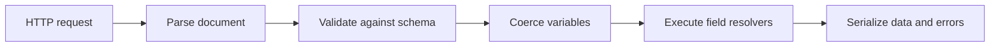

<TLDR>
  <TLDRCell label="what">
    GraphQL是API的查询语言、类型系统和执行模型。客户端提交操作并选择字段，服务端按模式验证后返回与选择结构对应的数据。
  </TLDRCell>
  <TLDRCell label="trap">
    灵活的字段选择不是授权，也不自动解决N+1查询、缓存或资源滥用。错误的非空声明还会让一个字段故障抹掉整段响应。
  </TLDRCell>
  <TLDRCell label="fix">
    把授权放在业务数据边界，为每个请求创建批量加载器，并按列表大小和字段成本限制操作。只有真正稳定的字段才能声明为非空。
  </TLDRCell>
</TLDR>

## 是什么，为什么存在

GraphQL是一种面向客户端与服务端应用的数据请求规范。它定义查询文档、类型系统、验证和执行语义，但不规定数据库、Web框架或传输协议。HTTP上常见的单一`/graphql`端点是一种部署方式，不是GraphQL的定义。

每个服务公开一份<Term id="graphql-schema">GraphQL模式（GraphQL schema）</Term>。模式列出可以读取或修改的字段、参数、返回类型和空值约束。客户端的<Term id="selection-set">选择集（selection set）</Term>只包含当前界面需要的字段，因此响应形状可以随操作变化，同时仍受服务端类型契约约束。

这种模型适合多个客户端以不同组合读取关联数据的系统。例如，订单列表只需要编号和金额，详情页还需要商品与配送状态；两者可通过同一模式表达，不必为每种视图增加专用响应形状。GraphQL不能让昂贵的数据源变便宜，它只是把数据需求表达得更明确。

GraphQL与REST不是一组互斥功能。REST以资源、HTTP方法和可缓存表示组织接口；GraphQL以类型和字段组织能力。一个系统可以让聚合视图使用GraphQL，同时让文件传输、Webhook或简单资源接口继续使用普通HTTP端点。

GraphQL文档可以包含`query`、`mutation`和`subscription`操作。`query`用于读取，`mutation`表达写入，`subscription`描述随事件产生后续结果的操作。订阅需要事件源和传输方案，规范本身不会替你选择WebSocket，也不会保证消息持久化。

它最值得使用的地方通常不是“减少请求次数”，而是让数据能力形成一份可检查的契约。工具可以根据模式提供补全、验证、类型生成和变更检查。代价也很直接：服务端必须控制任意合法操作的成本，并在每个字段的数据访问路径上执行授权。

## 工作原理

服务端收到GraphQL文档、变量和可选操作名后，先解析文档，再按模式验证。变量随后按声明的输入类型进行强制转换；只有这些步骤成功，执行器才从根操作类型开始收集字段并调用解析函数。最终响应通常包含`data`，执行出错时还可包含`errors`。



解析只回答文档是否符合GraphQL语法。验证会拒绝不存在的字段、缺失的必需参数、叶子字段上的子选择，以及类型不兼容的变量。验证发生在resolver运行前，所以无效操作不应触发业务数据读取。

### 模式与选择集

对象类型由字段组成，每个字段都有输出类型，并可声明具名参数。标量和枚举是叶子值，不能继续选择子字段；对象、接口和联合类型必须通过子选择说明需要哪些字段。输入对象只能用于输入位置，不能直接复用输出对象类型。

`String`默认允许`null`，`String!`承诺非空。列表外侧和元素内侧的`!`各自约束不同位置，因此`[Order!]!`表示列表本身非空，且其中每个元素也非空。空列表`[]`仍符合该类型；非空修饰符不表示“至少一个元素”。

客户端可以用别名改变响应键，用片段复用选择。执行器会按响应键收集可合并字段，同一字段也可能经多个片段出现。成本分析不能只数文档中的行，还要展开片段、考虑别名、列表规模和resolver的实际工作。

### Resolver与上下文

<Term id="resolver">解析函数（resolver）</Term>把模式字段连接到应用数据。常见实现向它传入父对象、字段参数、请求上下文和执行信息。顶层resolver通常调用服务层，子字段resolver则从父对象读取属性、计算值，或者加载关联对象。

请求上下文适合保存已认证主体、请求级加载器、跟踪信息和服务接口。它必须属于本次操作，不能把可变的用户状态放进进程全局对象。resolver仍需通过业务层或策略函数做授权；能从参数中读到`userId`不代表调用者拥有该用户。

普通查询的同级字段可以并发完成，执行顺序不应成为业务契约。变更操作的顶层字段按文档顺序串行执行，但每个字段内部仍可启动并发工作。串行执行也不等于数据库事务、幂等或回滚。

### 数据与错误

成功响应的`data`键与操作的选择结构对应，别名成为JSON键。验证失败通常没有`data`；字段执行失败则可能同时返回部分`data`和`errors`。每个执行错误可带有`path`，让客户端定位失败字段。

当非空字段产生`null`或抛错时，错误会向上扩散，直到遇到允许为空的父字段。该父位置变成`null`，其外侧仍可保留已经完成的数据。这种<Term id="null-bubbling">空值传播（null bubbling）</Term>让模式的非空声明成为真实的故障边界，而不只是文档注释。

HTTP状态码属于GraphQL over HTTP层。不要从“响应有`errors`”推导所有实现都必须返回同一个状态码，也不要让客户端只看状态码而忽略响应体。代理、认证中间件、解析验证失败和字段执行失败处在不同边界。

## 示例

下面四个示例依次展示字段选择、字段级授权、空值传播和请求级批量加载。输出来自Node 24.14.0，并在临时目录中使用GraphQL.js 17.0.2与DataLoader 2.2.3实际执行。

### 执行一个类型化查询

模式公开完整的`Product`类型，但操作只选择`name`和`priceCents`。响应不会因为底层对象还有`id`就自动包含该字段。

<Depth level="quick">

```javascript run title="basic-query.js"
const { buildSchema, graphql } = require("graphql");

const schema = buildSchema(`
  type Product {
    id: ID!
    name: String!
    priceCents: Int!
  }

  type Query {
    product(id: ID!): Product
  }
`);

const products = [
  { id: "p1", name: "Mechanical keyboard", priceCents: 8900 },
];

const source = `
  query ProductCard($id: ID!) {
    product(id: $id) {
      name
      priceCents
    }
  }
`;

async function main() {
  const result = await graphql({
    schema,
    source,
    rootValue: { product: ({ id }) => products.find((p) => p.id === id) },
    variableValues: { id: "p1" },
  });
  console.log(JSON.stringify(result, null, 2));
}

main();
```

```text
{
  "data": {
    "product": {
      "name": "Mechanical keyboard",
      "priceCents": 8900
    }
  }
}
```

<TryToBreak items={['不存在的商品ID', '缺少必需变量', '选择模式中不存在的字段']} />

</Depth>

变量与查询文本分开传递，因此无需把用户输入拼进文档。找不到商品时，`product`的类型允许`null`，结果会是`{ "product": null }`。如果业务要求区分“不存在”和“无权查看”，还要明确错误与授权策略。

这个例子使用默认字段解析：返回对象中的同名属性会提供给`name`和`priceCents`。真实服务通常把根字段委托给应用服务，而不是直接访问进程内数组。

### 在字段resolver中使用请求上下文

下面的`ownerEmail` resolver根据已认证查看者决定是否返回邮箱。字段被声明为可空，因为无权查看是契约允许的结果。

```javascript run title="resolver-context.js"
const { GraphQLID, GraphQLInt, GraphQLNonNull, GraphQLObjectType,
  GraphQLSchema, GraphQLString, graphql } = require("graphql");

const orders = [
  { id: "o1", ownerId: "u1", ownerEmail: "a@example.com", totalCents: 4200 },
  { id: "o2", ownerId: "u2", ownerEmail: "b@example.com", totalCents: 7300 },
];

const Order = new GraphQLObjectType({
  name: "Order",
  fields: {
    id: { type: new GraphQLNonNull(GraphQLID) },
    totalCents: { type: new GraphQLNonNull(GraphQLInt) },
    ownerEmail: {
      type: GraphQLString,
      resolve: (order, _args, context) =>
        context.viewerId === order.ownerId ? order.ownerEmail : null,
    },
  },
});

const Query = new GraphQLObjectType({
  name: "Query",
  fields: {
    order: {
      type: Order,
      args: { id: { type: new GraphQLNonNull(GraphQLID) } },
      resolve: (_source, { id }) => orders.find((order) => order.id === id),
    },
  },
});

graphql({ schema: new GraphQLSchema({ query: Query }),
  source: `{ mine: order(id: "o1") { ownerEmail }
             theirs: order(id: "o2") { ownerEmail } }`,
  contextValue: { viewerId: "u1" } })
  .then((result) => console.log(JSON.stringify(result, null, 2)));
```

```text
{
  "data": {
    "mine": {
      "ownerEmail": "a@example.com"
    },
    "theirs": {
      "ownerEmail": null
    }
  }
}
```

别名`mine`和`theirs`让同一个`order`字段以不同参数执行两次。授权发生在`ownerEmail`的数据边界，所以以后从其他查询路径到达`Order`时也不会绕过检查。

可空脱敏只是众多策略中的一种。若调用方必须明确知道访问被拒绝，可以抛出带稳定扩展码的错误；无论选择哪种策略，模式、客户端处理和测试都要一致。

### 观察非空错误如何传播

`receiptEmail`被声明为`String!`，但数据源返回`null`。执行器不能交付一个违反模式的`Checkout`，所以把最近的可空父字段`checkout`设为`null`，同时保留同级的`serviceName`。

```javascript run title="null-bubbling.js"
const { buildSchema, graphql } = require("graphql");

const schema = buildSchema(`
  type Checkout {
    id: ID!
    receiptEmail: String!
  }

  type Query {
    serviceName: String!
    checkout: Checkout
  }
`);

const rootValue = {
  serviceName: "Store",
  checkout: { id: "c1", receiptEmail: null },
};

graphql({
  schema,
  source: `{ serviceName checkout { id receiptEmail } }`,
  rootValue,
}).then((result) => console.log(JSON.stringify(result, null, 2)));
```

```text
{
  "errors": [
    {
      "message": "Cannot return null for non-nullable field Checkout.receiptEmail.",
      "locations": [
        {
          "line": 1,
          "column": 29
        }
      ],
      "path": [
        "checkout",
        "receiptEmail"
      ]
    }
  ],
  "data": {
    "serviceName": "Store",
    "checkout": null
  }
}
```

如果`checkout`也声明为`Checkout!`，传播会继续到根，整个`data`可能变成`null`。因此，把数据库中的`NOT NULL`机械复制到公开模式并不安全；远程依赖、授权脱敏和旧数据都可能让resolver无法提供值。

客户端应同时处理部分数据与错误路径。只断言HTTP请求成功或只判断`data`是否存在，都会漏掉这种局部失败。

### 把关联读取合并成一批

订单列表会解析三个`customer`字段，其中两个都引用`c1`。请求级<Term id="data-loader">DataLoader（data loader）</Term>在同一调度窗口合并键并记忆重复键，因此批量函数只收到`c1,c2`。

```javascript run title="batched-resolvers.js"
const DataLoader = require("dataloader");
const { buildSchema, graphql } = require("graphql");
const customers = [{ id: "c1", name: "Ada" }, { id: "c2", name: "Lin" }];
const orders = [
  { id: "o1", customerId: "c1" }, { id: "o2", customerId: "c2" },
  { id: "o3", customerId: "c1" },
];
let databaseCalls = 0;

async function findCustomers(ids) {
  databaseCalls += 1;
  console.log(`batch keys: ${ids.join(",")}`);
  const byId = new Map(customers.map((customer) => [customer.id, customer]));
  return ids.map((id) => byId.get(id) ?? null);
}

const schema = buildSchema(`type Customer { id: ID!, name: String! }
  type Order { id: ID!, customer: Customer }
  type Query { orders: [Order!]! }`);

async function main() {
  // 每个请求创建加载器，避免记忆值跨用户泄漏。
  const customerLoader = new DataLoader(findCustomers);
  const rootValue = {
    orders: (_args, context) => orders.map((order) => ({
      ...order,
      customer: () => context.customerLoader.load(order.customerId),
    })),
  };
  const result = await graphql({
    schema,
    source: `{ orders { id customer { name } } }`,
    rootValue,
    contextValue: { customerLoader },
  });
  console.log(JSON.stringify(result.data));
  console.log(`database calls: ${databaseCalls}`);
}

main();
```

```text
batch keys: c1,c2
{"orders":[{"id":"o1","customer":{"name":"Ada"}},{"id":"o2","customer":{"name":"Lin"}},{"id":"o3","customer":{"name":"Ada"}}]}
database calls: 1
```

输出证明本次操作的三个关联字段只触发一次批量读取。批量函数必须为每个输入键返回一个同位置结果；后端若改变顺序，必须像示例一样按键重新排列，缺失项也要用`null`或`Error`占位。

DataLoader的记忆表不是共享应用缓存。把同一个实例用于多个请求，可能让一个用户读到按另一个用户权限加载的对象，也会让陈旧值长期存在。变更同一请求中已加载的实体后，还要清除或更新对应键。

## 陷阱

### 把模式验证当成授权

> [!PITFALL]
> 模式只能证明字段和参数在类型上合法。攻击者仍可提交别人的订单ID，或从另一条查询路径访问同一敏感对象。

**修复方法：** 在读取业务数据的服务或字段边界上，使用请求上下文中的已认证主体做对象级授权。为每条可到达路径编写拒绝用例，不要信任客户端传入的所有者字段。

### 只设查询深度上限

> [!PITFALL]
> 浅层操作仍可通过大量别名、昂贵字段和很大的列表参数耗尽资源。固定深度也无法表达不同字段的成本差异。

**修复方法：** 限制文档大小、字段或别名数量、分页上限和计算后的操作成本，并在执行层设置超时与下游预算。公开客户端适合结合受信任文档或持久化文档允许列表。

### 在resolver中逐条等待

> [!PITFALL]
> 列表父字段返回N个对象后，每个子字段各发一次相同类型的后端请求，就会形成N+1访问。测试数据只有一两行时，这类代码看起来完全正常。

**修复方法：** 捕获一次真实操作的下游调用数，把同一资源类型的键交给请求级批量加载器。批量函数要保持输入长度与顺序，并限制单批大小。

### 过早承诺非空

> [!PITFALL]
> 把TypeScript的非可选属性或数据库`NOT NULL`直接映射成GraphQL非空，会忽略授权脱敏、远程故障和历史坏数据。一个叶子字段缺失可能让整个对象甚至根数据消失。

**修复方法：** 按API能否始终交付该值决定空值约束，并测试resolver抛错与返回`null`的路径。收紧已发布字段的空值约束前，先测量真实数据并让客户端完成迁移。

### 把mutation当成事务

> [!PITFALL]
> 顶层mutation字段串行执行，只规定字段执行次序。它不会把多个数据库写入放进事务，也不会在后续字段失败时撤销先前副作用，更不会让网络重试自动幂等。

**修复方法：** 在应用服务中明确事务边界，为可重试写入定义调用方稳定的幂等键，并测试提交后响应丢失的情况。不要把多个依赖原子性的顶层字段留给客户端组合。

### 无计划地修改模式

> [!PITFALL]
> 删除字段、改变字段类型、给现有字段增加必需参数，都会破坏已部署操作。新增枚举值虽然常被视为追加变更，也可能打破客户端的穷举分支。

**修复方法：** 优先增加新字段并弃用旧字段，保留可观测的弃用窗口，再根据操作使用数据决定移除时间。对保存的操作和生成客户端运行模式差异检查，并把枚举的未知值行为写进客户端契约。

<Depth level="deep">

## 空值约束就是故障边界

GraphQL类型默认可空，`!`把无法交付值从普通结果变成执行错误。这个选择同时影响服务端故障传播、客户端类型和缓存写入，因此应从公开交付保证出发，而不是从内部模型复制。

| 类型 | 列表可空 | 元素可空 | 合法示例 |
| --- | --- | --- | --- |
| `String` | 不适用 | 不适用 | `null`、`"paid"` |
| `String!` | 不适用 | 不适用 | `"paid"` |
| `[String!]` | 是 | 否 | `null`、`[]`、`["paid"]` |
| `[String!]!` | 否 | 否 | `[]`、`["paid"]` |

列表中一个非空元素失败时，会先让整个列表位置变成`null`；如果列表本身也非空，错误继续向父级传播。嵌套对象上的多层`!`会放大故障范围。客户端重要界面若依赖部分数据，模式设计者应明确哪些对象可以在依赖失败时缺席。

`errors[].path`记录从响应根到失败字段的键与列表索引。日志应把该路径、操作名、请求ID和稳定错误码联系起来，但不能直接记录未清理的变量。错误消息面向调用方，内部堆栈和数据库详情只应进入受控日志。

业务上预期的失败不一定要通过执行错误表达。库存不足可以是mutation payload中的类型化结果，而基础设施故障更适合成为错误。无论采用哪种方式，客户端都需要区分可展示结果、可重试故障和开发缺陷。

## Resolver所有权与批量加载

resolver应保持较薄：读取已经转换的参数和请求上下文，调用拥有业务规则的服务，再把结果映射到模式。把交易规则散落到多个字段resolver中，会让另一条查询路径绕过规则，也很难定义事务。

默认字段resolver适合读取父对象上的同名属性。需要授权、批量加载、格式转换或访问远程服务时，应显式实现字段resolver。`info`中的语法树可以辅助诊断和规划，但把任意选择直接转换成SQL列名会增加耦合，并可能绕开数据层的允许列表。

一个请求可以有多个加载器，例如按ID加载用户、按订单ID加载明细。加载器的键必须包含会改变结果的维度；同一个资源ID在租户、语言或权限范围下结果不同，就不能只用裸ID作为缓存键。更简单的做法通常是让整个加载器实例绑定请求与租户。

批量函数必须返回与键数组等长、同序的数组。数据库的`IN`查询通常不保证结果顺序，而且可能省略不存在的行，因此需要按键建立映射再重排。把整个批次因一个缺失键而拒绝，会让本可成功的同级字段一起失败。

DataLoader合并的是一个调度窗口中的`.load()`调用。若resolver在发出下一次加载前逐个`await`，本可同批的键会落入不同窗口。先创建同层加载promise，再统一等待，通常更符合GraphQL同级字段的执行方式。

mutation更新实体后，本次请求的加载器可能仍保存旧对象。写入服务应返回权威的新状态，并清除或填充受影响键。跨请求的新鲜度属于共享缓存与数据存储协议，不能交给请求级记忆表解决。

## 执行前控制操作成本

语法正确、模式验证通过的操作仍可能过于昂贵。攻击面来自宽度、重复别名、递归关系、列表乘数、搜索字段和下游扇出。只看最大深度，会漏掉同一层并排的一千个别名。

成本规则需要结合模式知识。普通标量可以有较低基础成本，分页连接把子选择成本乘以受限的`first`，搜索或报表字段则使用更高权重。规则必须在执行前拒绝超预算操作，并与执行超时、数据库语句超时和并发限制配合。

受信任文档把生产操作限制为预先登记的文档或哈希，适合客户端由同一组织发布的系统。它减少任意文档带来的攻击面，但不能代替变量校验、授权和运行时资源限制。登记操作本身仍可能昂贵，发布门禁应对它执行成本检查。

是否开放introspection要按环境和使用者决定。关闭它不能修复越权resolver，也不能阻止攻击者重放已知字段。模式暴露与开发体验是一项策略选择，授权和成本控制才是数据与资源边界。

查询日志应优先记录操作名、文档哈希、计算成本、耗时和错误码。直接记录完整变量容易泄露令牌、邮箱或搜索内容。无名称操作难以观测，生产规范可以要求显式操作名。

## 传输与写入语义

GraphQL操作文档不是完整的HTTP契约。服务仍要定义允许的方法、媒体类型、认证位置、请求大小、批量请求策略和缓存头。网关与应用对最大正文、超时和压缩解码后的大小也应采用一致限制。

query按约定不产生业务副作用，但resolver读取仍可能触发日志、缓存填充或计量。客户端不应根据“看起来像读取”就随意重试mutation；重试安全性来自业务操作的幂等协议，而不是GraphQL操作关键字。

一个mutation可以返回带业务错误的payload，也可以产生顶层执行错误。Payload适合调用方可预期并需要结构化处理的拒绝；执行错误适合无法正常完成字段的异常。团队应统一错误码、空值边界和HTTP映射，避免每个resolver发明一种形状。

订阅建立后会产生一个或多个结果，但认证不能只在握手时考虑。长连接期间权限可能被撤销，事件也必须按订阅者过滤。传输层还需定义断线、恢复、背压和保活；这些都不是`subscription`字段自动提供的能力。

## 模式演进与验证

GraphQL常通过添加字段演进，但“无需版本”不是保证。移除字段、更改类型、收紧空值、改变参数默认值或语义，都可能破坏保存的操作。模式注册表或持续集成应把候选模式与实际使用的操作比较。

弃用标记会通过introspection告诉工具替代方案，却不会迁移调用方。服务端需要观察旧字段使用，客户端要发布替换操作，最后才进入移除窗口。无法识别调用方时，长期保留兼容字段可能比猜测一个日期稳妥。

生成类型会把模式承诺带进客户端代码，但生成时刻与部署时刻可能不同。前端携带新操作而服务端尚未发布，或服务端回滚到旧模式，都能造成漂移。发布流程应验证候选客户端操作与实际目标模式，而不只验证仓库中的最新文件。

模式测试至少覆盖有效操作、验证失败、授权拒绝、部分错误、最大分页和关键mutation故障。对resolver的单元测试无法证明HTTP解析、变量强制转换、上下文创建和错误序列化正确；保留一层穿过真实GraphQL执行器的契约测试。

</Depth>

<Checkpoint id="backend/graphql" />

## 延伸阅读

- [GraphQL规范：2025年9月版](https://spec.graphql.org/September2025/)
- [GraphQL模式与类型](https://graphql.org/learn/schema/)
- [GraphQL执行](https://graphql.org/learn/execution/)
- [GraphQL响应](https://graphql.org/learn/response/)
- [GraphQL安全](https://graphql.org/learn/security/)
- [DataLoader参考实现](https://github.com/graphql/dataloader)
