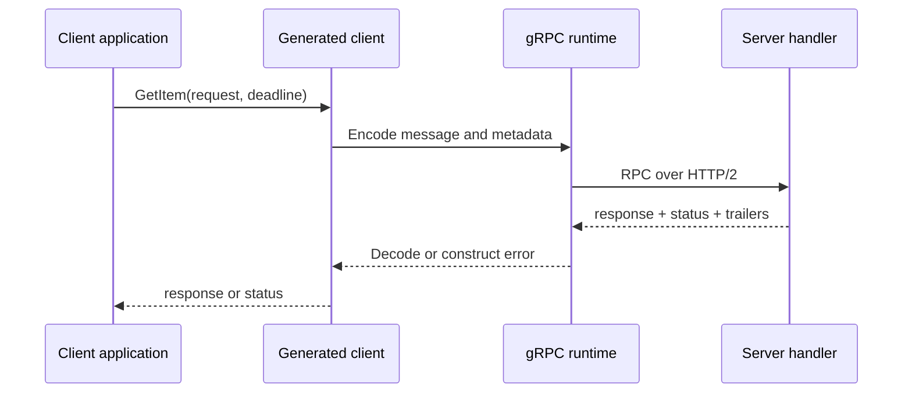

<TLDR>
  <TLDRCell label="what">
    gRPC is a remote procedure call framework: a service declares methods and messages in a machine-readable contract, and tools generate its client and server interfaces.
  </TLDRCell>
  <TLDRCell label="when">
    It fits services owned by one organization, implemented in several languages, and needing strict contracts or streaming. Public APIs for ordinary browsers or clients centered on HTTP resource semantics may be a poor fit.
  </TLDRCell>
  <TLDRCell label="how">
    Stabilize the `.proto` contract before generating code. Give every call a deadline, handle failures by status code, and configure retries only for operations with idempotent semantics.
  </TLDRCell>
</TLDR>

## What it is and why it exists

gRPC is a <Term id="remote-procedure-call">remote procedure call (RPC)</Term> framework. Callers use generated client methods, servers implement generated interfaces, and the runtime handles connections, message encoding, flow control, and call status. A method looks local, but crossing a network still introduces failure, latency, and partial completion.

By default, gRPC uses <Term id="protocol-buffers">Protocol Buffers</Term> to describe both service interfaces and message formats. A `.proto` file gives methods, field types, and field numbers a language-neutral contract. Generators turn it into types for Go, Java, Python, and other languages, catching some client-server drift at compile time and giving tests and compatibility tools the same contract.

It has four method shapes: unary, server streaming, client streaming, and bidirectional streaming. A unary call sends one request and one response; the other three move an ordered sequence in one or both directions. The directions of a bidirectional stream are independent, so the server needn't reply immediately to every message it receives.

You often meet gRPC in internal microservices, long-lived mobile-to-backend connections, and systems that continuously transfer messages. Ordinary browsers can't use every native gRPC feature directly, so they usually need gRPC-Web or a proxy. A REST-style interface is often more natural when external consumers rely on URLs, HTTP methods, caching, and human-readable JSON.

The main reasons to choose gRPC are its contract and call model, not a blanket claim that binary data is always faster. Payload size, message shape, compression, network behavior, implementation language, and runtime all affect results. Without measurements from your traffic, latency or throughput multipliers are speculation.

Generated code doesn't remove distributed-system semantics. The server may have completed a change when a response is lost, and a client deadline doesn't roll back committed work. A sound design still defines idempotency, authorization, resource limits, cancellation, and compatible evolution.

## How it works

Development starts with the service contract. Message fields have stable numbers, and service methods refer to request and response messages. `protoc` plus language plugins generates message types, client stubs, and server interfaces. Application code calls or implements those generated interfaces instead of maintaining a parallel hand-written model.

A unary call crosses these boundaries:



The client starts a call with a method, request, metadata, and <Term id="deadline">deadline</Term>. The runtime resolves the target, obtains a connection, and sends message frames to the server. The handler returns a response or non-`OK` status; the client finally sees either a decoded message or an error carrying a code and description.

### The contract and generated boundary

This contract defines an inventory read, a unary reservation, and a server-streamed watch. Field numbers are wire identities, not display order, and `package` contributes to the generated method's fully qualified name.

```protobuf
syntax = "proto3";

package inventory.v1;

option go_package = "example.com/store/gen/inventory/v1;inventoryv1";

service Inventory {
  rpc GetStock(GetStockRequest) returns (Stock);
  rpc Reserve(ReserveRequest) returns (ReserveResponse);
  rpc WatchStock(WatchStockRequest) returns (stream Stock);
}

message GetStockRequest {
  string sku = 1;
}

message ReserveRequest {
  string sku = 1;
  int32 quantity = 2;
  string request_id = 3;
}

message ReserveResponse {
  string reservation_id = 1;
}

message WatchStockRequest {
  repeated string skus = 1;
}

message Stock {
  string sku = 1;
  int32 available = 2;
}
```

The generated client guarantees only that message types and method signatures line up. It doesn't know that `quantity` must be positive or that the server must deduplicate `request_id` atomically. Bounds, authorization, and retry effects remain application contract rules that implementations and tests must enforce.

Don't treat generated files as an editing surface. Change the `.proto`, regenerate with pinned tool versions, and inspect the resulting diff. Hand edits disappear at the next generation, and clients in other languages won't receive them.

### Four method shapes

The presence of `stream` on the request and response sides determines the four shapes. Messages preserve their order in each direction, but this doesn't create a global order for end-to-end events.

| Shape | Request | Response | Typical boundary |
| --- | --- | --- | --- |
| Unary | One | One | Query or short command |
| Server streaming | One | Many | Progressive results or update subscription |
| Client streaming | Many | One | Chunked upload followed by a summary |
| Bidirectional streaming | Many | Many | A session where both sides advance independently |

A stream isn't an "infinite array." Each side must handle half-close, cancellation, final status, and the peer ending early. The application also needs limits for message size, stream lifetime, and concurrent active streams.

HTTP/2 flow control slows a sender when the receiver falls behind, but it can't choose an application memory budget. If a handler first reads every message into an unbounded queue, it has bypassed runtime <Term id="backpressure">backpressure</Term> at the application boundary. Reading, processing, and buffering policies must be designed together.

### Status, metadata, and call completion

Every RPC ends with a status. Success uses `OK`; an application failure should use the code that tells a caller what to do next. Examples include `INVALID_ARGUMENT` for malformed input, `UNAUTHENTICATED` for missing or invalid credentials, and `PERMISSION_DENIED` for an authenticated caller lacking access. Converting everything to `INTERNAL` discards actionable information.

Metadata carries call-scoped details such as credentials and trace identifiers. It isn't a business-message field or an automatically enforced security mechanism. The server still has to validate credentials, authorize access, and avoid putting secrets or internal exception details into client-visible status descriptions.

Client and server decide the outcome locally, and their conclusions can differ. A server may commit successfully and send a response while the client sees `DEADLINE_EXCEEDED` because its deadline passed. A status code alone therefore can't prove that a mutation did not happen.

## Examples

These three Go examples validate a real call, structured status handling, and deadline conversion. They were executed from `/tmp/codewiki-run/grpc/` with Go 1.27 and gRPC-Go 1.83.2, and each output below came from the corresponding `go run` command.

### A unary call over in-memory transport

The standard health protocol already provides generated code, so this example can focus on the call path. `bufconn` replaces only the network transport; the client, serialization, and server dispatch still run through gRPC-Go.

<Depth level="quick">

```go title="health_check.go"
package main

import (
	"context"
	"fmt"
	"net"
	"time"

	"google.golang.org/grpc"
	"google.golang.org/grpc/credentials/insecure"
	"google.golang.org/grpc/health"
	healthpb "google.golang.org/grpc/health/grpc_health_v1"
	"google.golang.org/grpc/test/bufconn"
)
func main() {
	listener := bufconn.Listen(1024 * 1024)
	server := grpc.NewServer()
	checker := health.NewServer()
	healthpb.RegisterHealthServer(server, checker)
	checker.SetServingStatus("inventory.v1.Inventory", healthpb.HealthCheckResponse_SERVING)
	go func() { _ = server.Serve(listener) }()
	defer server.Stop()
	dialer := func(context.Context, string) (net.Conn, error) {
		return listener.Dial()
	}
	conn, err := grpc.NewClient(
		"passthrough:///inventory",
		grpc.WithContextDialer(dialer),
		grpc.WithTransportCredentials(insecure.NewCredentials()),
	)
	if err != nil { panic(err) }
	defer conn.Close()
	ctx, cancel := context.WithTimeout(context.Background(), time.Second)
	defer cancel()
	response, err := healthpb.NewHealthClient(conn).Check(ctx, &healthpb.HealthCheckRequest{Service: "inventory.v1.Inventory"})
	if err != nil {
		panic(err)
	}
	fmt.Printf("status: %s\n", response.Status)
}
```

```text
status: SERVING
```

<TryToBreak items={['use an unregistered service name', 'cancel the context before calling Check', 'remove the transport credentials option']} />

</Depth>

`grpc.NewClient()` creates a reusable logical channel and performs no network I/O on that line. The first RPC initiates the connection. Production code must not use `insecure.NewCredentials()` across an untrusted network; this example omits TLS only because the connection never leaves the process.

Each call still has its own `context` and deadline. Reuse a channel across calls instead of creating one per request. Per-request credentials and trace details belong in the metadata for each call.

### Reading gRPC status

The server returns a code and stable description with `status.Error`, and the client reads them using `status.FromError`. Branch on the code, not by parsing the English message.

```go title="status_error.go"
package main

import (
	"fmt"

	"google.golang.org/grpc/codes"
	"google.golang.org/grpc/status"
)

func main() {
	err := status.Error(codes.InvalidArgument, "quantity must be positive")
	parsed, ok := status.FromError(err)

	fmt.Printf("recognized: %t\n", ok)
	fmt.Printf("code: %s\n", parsed.Code())
	fmt.Printf("message: %s\n", parsed.Message())
}
```

```text
recognized: true
code: InvalidArgument
message: quantity must be positive
```

`InvalidArgument` means the argument is invalid regardless of current system state. If changing inventory could make the operation succeed later, `FailedPrecondition` or a domain-defined normal response may be more appropriate. The contract should make that choice consistently.

Logs should retain the internal cause and a correlation identifier, while the returned status remains stable and omits database statements, file paths, and tokens. When callers need field-level errors, use an agreed structured error detail and verify that every supported language decodes it the same way.

### Converting a deadline to status

A Go server handler should watch its incoming `context`. This example simulates a downstream lookup with a short deadline, then asks gRPC-Go to convert `context.DeadlineExceeded` to the standard status.

```go title="deadline.go"
package main

import (
	"context"
	"fmt"
	"time"

	"google.golang.org/grpc/status"
)

func lookup(ctx context.Context) error {
	select {
	case <-time.After(100 * time.Millisecond):
		return nil
	case <-ctx.Done():
		return status.FromContextError(ctx.Err()).Err()
	}
}

func main() {
	ctx, cancel := context.WithTimeout(context.Background(), 10*time.Millisecond)
	defer cancel()

	err := lookup(ctx)
	fmt.Println(status.Code(err))
}
```

```text
DeadlineExceeded
```

A real handler must also pass the incoming `ctx` to database and downstream RPC calls. Starting downstream work with `context.Background()` severs deadline and cancellation propagation, leaving work to consume resources after the client has gone.

Cancellation only signals participants to stop; it doesn't reverse an external side effect that has committed. Mutating methods need a transaction boundary. If a caller may retry after an unknown result, they also need a stable caller-supplied idempotency key and an atomic deduplication record.

## Pitfalls

### Treating a remote call as a local function

> [!PITFALL]
> Generated clients make call syntax look local, which tempts code to omit deadlines, cancellation handling, and partial-failure design. A network call can also lose its response after the server completes.

**Fix:** give each call a deadline derived from the request budget, record status and attempt count, and define recovery after an unknown result for every mutation. Don't hide potentially long latency and I/O behind an ordinary helper name.

### Reusing or changing field numbers

> [!PITFALL]
> Giving a removed field number a new meaning lets new code misread old messages. Renaming while keeping the number usually preserves binary identity, but JSON mapping, reflection, and operational tools can still change.

**Fix:** reserve both the old number and name when deleting a field. Compare descriptors before release. When semantics change, add a field and migrate readers and writers in stages.

### Retrying every `UNAVAILABLE`

> [!PITFALL]
> `UNAVAILABLE` means temporarily unavailable; it doesn't prove that the server skipped the request. Automatically retrying a non-idempotent charge or reservation can duplicate the side effect.

**Fix:** configure retries only for methods with explicit <Term id="idempotency">idempotency</Term>, and bound attempts, backoff, and total deadline. A create-style operation should atomically store a caller-provided request identifier with its result.

### Treating metadata as authorization

> [!PITFALL]
> Receiving `authorization` or `tenant-id` metadata doesn't make it trustworthy. A generated interceptor that parses fields without validating signature and audience lets a caller forge an identity or tenant.

**Fix:** validate credentials at the trust boundary and derive the principal and tenant from the verified result. Keep resource-level authorization in the business layer. Production transport uses TLS or mTLS and enforces metadata size limits.

### Reading a stream without bounds

> [!PITFALL]
> Collecting an entire client stream into a slice before processing lets the caller control server memory. A server stream that ignores blocked sends and cancellation can also strand a growing number of goroutines.

**Fix:** validate and process incrementally, with limits for messages, buffers, stream lifetime, and concurrency. Every blocking send, receive, and queue operation should react to cancellation; exercise those limits with a slow consumer.

### Editing generated code directly

> [!PITFALL]
> Business logic added to a generated client or message type may compile today but disappears on regeneration. Generated clients in other languages won't receive it either.

**Fix:** keep the `.proto`, generator versions, and options as the only generation inputs. Put business validation in handlers or a separate domain layer and add client conveniences in wrappers outside generated types.

## In the AI era

**What generated code gets wrong here**

Models copy the deprecated `grpc.Dial` from older tutorials or create a `ClientConn` for every request. They often apply one `UNAVAILABLE` retry rule to every method without checking whether writes are idempotent. Generated handlers use `context.Background()` for downstream work, flatten all errors to `Internal`, and buffer whole streams before processing. When editing `.proto` files, models also reuse removed field numbers or directly change a field to a superficially similar type.

**Ask your AI to check**

- List each RPC's method shape, deadline source, cancellation path, and observable outcome when the server commits but the response is lost.
- Classify every `.proto` diff as an addition, deletion, number change, type change, or semantic change, then explain both old-client/new-server combinations.
- Find every automatic retry, prove that its target method is idempotent, and state the idempotency key's scope, atomic storage location, and retention period.

**Review checklist**

- Generated files reproduce with no worktree diff, and removed field numbers and names are reserved.
- Every RPC has a finite budget, handlers pass `context` downstream, and stream loops react to cancellation and backpressure.
- Failure tests cover status, authentication, and authorization boundaries; retries can't duplicate an external side effect.

**Prompt vocabulary**

Use the exact terms `unary RPC`, `server streaming`, `client streaming`, `bidirectional streaming`, `deadline propagation`, `cancellation`, `status code`, `trailing metadata`, `field number`, `wire compatibility`, and `idempotency key`. Ask for a compatibility matrix and a call lifecycle; "optimize my gRPC" is too vague to expose these boundaries.

<Depth level="deep">

## Contract evolution

The Protocol Buffers wire representation is driven by field numbers and wire types. Names mainly serve source code, JSON mapping, and reflection, so "it compiles" and "it is compatible" are different judgments. Before release, test old clients against new servers, new clients against old servers, and messages that pass through an intermediate reader and writer.

Adding a field is usually safe because old readers can ignore it and new readers get its type's default from old messages. That default still needs safe business semantics. A quota field whose default means "unlimited" can break the behavioral contract even when its wire representation is compatible.

Reserve the number and name of a removed field so they can't be reused. Don't renumber fields into a tidier order or rename one to pretend its semantics changed. Add a field for new semantics, teach readers to understand both forms during migration, stop old writes, and only then remove the old field.

```protobuf
message ReserveRequest {
  string sku = 1;
  int32 quantity = 2;
  string request_id = 3;

  reserved 4;
  reserved "warehouse";

  string warehouse_id = 5;
}
```

Some scalar types are readable under the same wire type but can change negative-number behavior, overflow, or interpretation. Don't alter a field type just because the wire types match. A safer migration adds a new number, dual-writes or converts, and stops the old field after every consumer has upgraded.

An enum's zero value should mean unspecified or unknown. Test how each language represents an unknown numeric enum value received by an old client. A `switch` default must not silently turn a future value into an existing state.

### Compatibility isn't data validation

A `.proto` can express types, repeated fields, one-of choices, and service signatures, but not every business constraint. A string `sku` may require a format, quantity may have a maximum, and the principal may only access one warehouse. Those rules require server validation, authorization, and persistence constraints.

Validation failures need stable status and field-level location without exposing the storage model as the protocol. If renaming a database column forces a `.proto` field change, the transport contract is too tightly coupled to persistence.

## Deadlines, cancellation, and unknown results

A gRPC call doesn't necessarily have a deadline by default; the detail depends on its language and call site. The client should allocate this call's time from its upstream budget instead of restarting the same fixed timeout at every layer. Otherwise a call chain keeps consuming full budgets after the upstream request has already given up.

Generated Go clients accept deadlines and cancellation through `context.Context`. A server handler must pass its `ctx` to database drivers and downstream clients. It may derive a shorter budget to leave time for cleanup or response encoding, but that child can't outlive the parent's remaining time.

Deadline expiry changes call state and tells participants to stop. It doesn't undo a committed database transaction, a message sent to another system, or a third-party charge. The server checks cancellation before an irreversible boundary, then uses transactions, outbox records, or compensation to handle outcomes after that boundary.

When the client sees `DeadlineExceeded`, it can't infer that the operation failed. A query may be retried if budget remains; a command needs an idempotency protocol or a way to query its result. The caller must reuse one stable request identifier, while the server atomically binds its request fingerprint to the stored result so different content can't reuse the key.

## Streams, backpressure, and ownership

Server streaming can produce results incrementally, but it doesn't replace pagination or retention policy. If a consumer may be offline for a long time, a long stream usually needs a resume cursor or event sequence. gRPC doesn't create that application-level sequence automatically.

Client streaming allows validation as messages arrive. When one message is invalid, specify whether the entire call fails, that message is skipped, or the response reports per-message outcomes. Those choices have different retry semantics; leaving the policy to implementations gives clients in different languages incompatible assumptions.

A bidirectional stream has two independent directions. The server can read several messages before replying and the client can send continuously, so a request-response pattern needs correlation identifiers or an explicit state machine. Correlation by message position alone breaks as soon as processing becomes concurrent.

The stream handler owns the receive loop, derived tasks, and buffers. When the call ends, every derived goroutine should stop, queues should close, and failures should collapse into one final status. Exiting the main loop while background senders remain causes leaks and writes to a closed stream.

### Capacity boundaries

Set limits for at least message size, buffered messages per stream, concurrent streams per principal, call duration, and total processing work. The HTTP/2 window controls transport bytes; it doesn't limit decoded object size, database fan-out, or background task count.

Test backpressure by deliberately slowing the consumer and checking that queue depth, goroutine count, and memory stay bounded. Test cancellation while a sender or receiver is blocked and confirm that the whole call tree exits. A fast local loop won't expose these failures.

## Channels, connections, and load balancing

In gRPC-Go, `ClientConn` is a virtual connection to a logical target. It can manage zero or more actual connections and participates in name resolution, reconnection, and load balancing. Calling it "one TCP connection" leads to the wrong lifecycle design. Applications normally reuse a channel for each target and credential configuration.

`grpc.NewClient()` performs no I/O when it creates the channel. Resolution and connection begin with the first RPC, so successful construction doesn't prove the target is reachable. A startup probe that needs service readiness should make a deadline-bounded health call instead of only checking the `NewClient()` error.

The resolver supplies addresses, and the load-balancing policy chooses a subconnection for each call. Retry may create another attempt for the same logical RPC. Logs and metrics must distinguish logical calls from attempts or they will misstate error rates and downstream load.

Don't use aggressive keepalive to cover a faulty idle-connection assumption. Frequent pings burden servers and network devices, and a server may answer with `GOAWAY`. Change defaults only after validating intermediary idle policies and measuring failure recovery.

## Retry boundaries

gRPC can make transparent retries and can apply an explicit Service Config policy. No explicit policy doesn't mean that every `UNAVAILABLE` is replayed automatically. Audit library attempts together with application retry loops so layers don't multiply call count.

Retry safety depends on more than a status code. Read-only methods are usually easier to retry safely; mutations must define the effect of duplicate requests. Even an idempotent method needs one total deadline, bounded attempts, and backoff.

Once the client receives response headers, gRPC considers the retry committed and won't start another attempt under the library policy. The application may still retry the entire business step at a higher layer. A design review should map every retry layer, including proxies, SDKs, business loops, and job queues.

`wait-for-ready` isn't a retry policy. It lets a call wait while a channel is temporarily unavailable, but the call remains bound by its deadline. Enabling it blindly for interactive traffic turns a quick failure into a long queue and may move overload into client memory.

## Security and observability boundaries

TLS protects transport and authenticates the endpoint, while mTLS can also authenticate a client certificate. A certificate identity isn't necessarily an end user or a business permission. Interceptors suit credential validation, call logging, and trace propagation; resource-level authorization still belongs in the handler using a verified principal and target resource.

Bound metadata keys and values by size and format. Never log the full `authorization` value or let a caller overwrite internal tracing and tenant fields. Identity added by a trusted proxy needs separate names and filtering from externally writable metadata.

Observability should distinguish the fully qualified method, final status, latency, request and response message counts, logical calls, and attempts. Don't put high-cardinality values such as user IDs, raw error messages, or request identifiers directly into metric labels. They belong in controlled logs or trace attributes.

A status description is for the caller, not a transport for internal stacks. Log an unknown exception with its correlation identifier and full cause on the server, then return a stable `INTERNAL` description. Map known domain failures to documented codes and pin the semantics with tests.

## Test contracts, not mock shapes

Handler unit tests work well for domain rules and status mapping, but they bypass serialization, generated registration code, and interceptors. Add at least one in-process or real-port integration test that uses a generated client against the registered service and checks metadata, deadlines, and final status.

Compatibility tests retain a previous descriptor or generated client; they don't only run the current client against the current service. Exercise representative messages across old-new pairs, especially unknown fields, new enum values, removed fields, and default-value semantics. CI should also verify generated-file diffs.

Stream tests create a slow consumer, midstream cancellation, half-close, and an early server failure. Alongside message content, assert final status, processed count, and resource release. If every test drains an in-memory stream instantly, backpressure bugs remain invisible.

Inject failures before commit, after commit but before response, after headers, and during stream transfer. Each point can produce a different client status and server-side fact. A table of those combinations constrains retry design better than one generic "network error" case.

</Depth>

<Checkpoint id="backend/grpc" />

## Further reading

- [gRPC core concepts, architecture, and lifecycle](https://grpc.io/docs/what-is-grpc/core-concepts/)
- [Protocol Buffers proto3 language guide](https://protobuf.dev/programming-guides/proto3/)
- [gRPC deadlines guide](https://grpc.io/docs/guides/deadlines/)
- [gRPC status codes](https://grpc.io/docs/guides/status-codes/)
- [gRPC retry guide](https://grpc.io/docs/guides/retry/)
- [gRPC-Go package reference](https://pkg.go.dev/google.golang.org/grpc)
