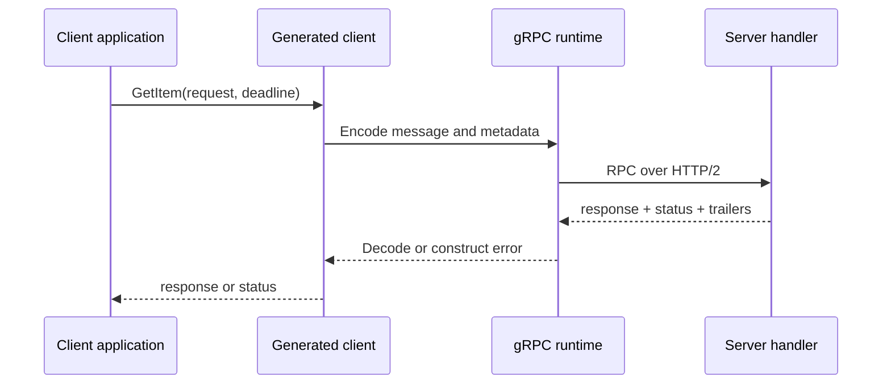

<TLDR>
  <TLDRCell label="what">
    gRPC 是一套远程过程调用框架：服务用机器可读的契约声明方法与消息，再由工具生成客户端和服务端接口。
  </TLDRCell>
  <TLDRCell label="when">
    它适合同一组织内、由多种语言实现且需要严格契约或流式通信的服务；面向普通浏览器或强调 HTTP 资源语义的公开 API 未必适合。
  </TLDRCell>
  <TLDRCell label="how">
    先稳定 `.proto` 契约，再生成代码；每次调用都设置截止时间，按状态码处理失败，并且只为具备幂等语义的操作配置重试。
  </TLDRCell>
</TLDR>

## 是什么，为什么存在

gRPC 是一个<Term id="remote-procedure-call">远程过程调用（remote procedure call，RPC）</Term>框架。调用方使用生成的客户端方法，服务端实现生成的接口；中间的运行库负责连接、消息编解码、流控和调用状态。方法看起来像本地函数，但跨越网络后的失败、延迟和部分完成仍然存在。

gRPC 默认以<Term id="protocol-buffers">Protocol Buffers</Term> 同时描述服务接口与消息格式。`.proto` 文件为方法、字段类型和字段编号提供一份语言无关契约，代码生成器再把它转换成 Go、Java、Python 等语言的类型。这样可以在编译期发现一部分客户端与服务端偏差，也能把同一契约交给测试和兼容性检查工具。

它提供四种方法形态：一元调用、服务端流、客户端流和双向流。一元调用各发送一条请求与响应；另外三种形态在一个或两个方向上传递有序消息序列。双向流的两个方向相互独立，不能假定服务端每收到一条消息就一定立即返回一条消息。

你常在内部微服务、移动端到后端的长连接，以及需要持续传输消息的系统中遇到 gRPC。普通浏览器不能直接使用所有原生 gRPC 能力，通常需要 gRPC-Web 或代理。若外部消费者更依赖 URL、HTTP 方法、缓存和人工可读的 JSON，REST 风格接口往往更自然。

选择 gRPC 的主要理由是契约和调用模型，而不是一句「二进制一定更快」。负载大小、消息形状、压缩、网络、实现语言和运行环境都会改变实际结果。没有针对自己流量的测量，就不应写下延迟或吞吐倍数。

生成代码不会消除分布式系统语义。响应丢失时，服务端可能已经完成修改；客户端截止时间到期也不会回滚已提交的工作。正确设计仍需明确幂等性、授权、资源上限、取消和兼容演进。

## 工作原理

开发从服务契约开始。消息字段带有稳定编号，服务方法引用请求与响应消息；`protoc` 与语言插件据此生成消息类型、客户端桩和服务端接口。业务代码调用或实现这些生成接口，不应手写一份平行模型再期待两边长期同步。

一次一元调用经过以下边界：



调用先由客户端选定方法、请求、metadata 和<Term id="deadline">截止时间（deadline）</Term>。运行库解析目标地址并取得连接，把消息帧发送到服务端。处理器返回响应或非 `OK` 状态，客户端最后看到解码后的消息，或者带状态码与说明的错误。

### 契约与生成边界

下面的契约定义库存读取、一元预留与服务端流式监听。字段编号是线上身份，不是展示顺序；`package` 也参与生成方法的完整名称。

```protobuf
syntax = "proto3";

package inventory.v1;

option go_package = "example.com/store/gen/inventory/v1;inventoryv1";

service Inventory {
  rpc GetStock(GetStockRequest) returns (Stock);
  rpc Reserve(ReserveRequest) returns (ReserveResponse);
  rpc WatchStock(WatchStockRequest) returns (stream Stock);
}

message GetStockRequest {
  string sku = 1;
}

message ReserveRequest {
  string sku = 1;
  int32 quantity = 2;
  string request_id = 3;
}

message ReserveResponse {
  string reservation_id = 1;
}

message WatchStockRequest {
  repeated string skus = 1;
}

message Stock {
  string sku = 1;
  int32 available = 2;
}
```

生成后的客户端只能保证消息类型和方法签名匹配。它不知道 `quantity` 必须为正数，也不知道 `request_id` 是否真的由服务端原子去重。范围、授权和重试效果仍属于应用契约，必须由实现与测试落实。

不要把生成文件当作编辑入口。改动应落在 `.proto` 中，再使用固定版本的生成器重建产物并检查差异。否则下次生成会覆盖手改内容，不同语言的客户端也不会得到同一项修改。

### 四种方法形态

四种形态由请求侧和响应侧是否带 `stream` 决定。流中的消息在各自方向保持顺序，但这不等于端到端事件有全局顺序。

| 形态 | 请求 | 响应 | 典型边界 |
| --- | --- | --- | --- |
| 一元 | 一条 | 一条 | 查询或短命令 |
| 服务端流 | 一条 | 多条 | 逐步读取结果或订阅更新 |
| 客户端流 | 多条 | 一条 | 分块上传后汇总 |
| 双向流 | 多条 | 多条 | 双方独立推进的会话 |

流式调用不是「无限数组」。每一侧都要处理半关闭、取消、最终状态和对端提前终止。应用还要限制单条消息大小、流持续时间及同时活跃的流数量。

HTTP/2 流控会在接收方跟不上时限制发送，但它不能替应用决定内存预算。若处理器先把所有消息读入无界队列，运行库的<Term id="backpressure">背压（backpressure）</Term>已经在应用边界被绕开。读取、处理与缓冲策略必须一起设计。

### 状态、metadata 与调用结束

每次 RPC 都以状态结束。成功使用 `OK`；应用失败应选择能表达调用方下一步动作的代码，例如无效输入用 `INVALID_ARGUMENT`，缺少认证凭据用 `UNAUTHENTICATED`，已认证但无权访问用 `PERMISSION_DENIED`。把所有故障都转换成 `INTERNAL` 会丢掉可操作信息。

metadata 携带认证令牌、追踪标识等调用级附加信息。它不是业务消息字段，也不是自动生效的安全机制。服务端仍要验证凭据、完成授权，并避免把秘密或内部异常写入可返回给客户端的状态说明。

客户端与服务端分别判断调用结果，两边结论可能不同。服务端成功提交并发送响应后，客户端仍可能因为截止时间已到而看到 `DEADLINE_EXCEEDED`。因此，错误码不能单独证明一次修改没有发生。

## 示例

下面三个 Go 示例依次验证真实调用、结构化状态和截止时间转换。它们使用 Go 1.27 与 gRPC-Go 1.83.2 在 `/tmp/codewiki-run/grpc/` 中实际执行，输出来自对应的 `go run` 命令。

### 在内存传输上完成一元调用

健康检查协议已经提供生成代码，因此示例可以把重点放在调用路径上。`bufconn` 只替换网络传输，客户端、序列化和服务端分派仍经过 gRPC-Go。

<Depth level="quick">

```go title="health_check.go"
package main

import (
	"context"
	"fmt"
	"net"
	"time"

	"google.golang.org/grpc"
	"google.golang.org/grpc/credentials/insecure"
	"google.golang.org/grpc/health"
	healthpb "google.golang.org/grpc/health/grpc_health_v1"
	"google.golang.org/grpc/test/bufconn"
)
func main() {
	listener := bufconn.Listen(1024 * 1024)
	server := grpc.NewServer()
	checker := health.NewServer()
	healthpb.RegisterHealthServer(server, checker)
	checker.SetServingStatus("inventory.v1.Inventory", healthpb.HealthCheckResponse_SERVING)
	go func() { _ = server.Serve(listener) }()
	defer server.Stop()
	dialer := func(context.Context, string) (net.Conn, error) {
		return listener.Dial()
	}
	conn, err := grpc.NewClient(
		"passthrough:///inventory",
		grpc.WithContextDialer(dialer),
		grpc.WithTransportCredentials(insecure.NewCredentials()),
	)
	if err != nil { panic(err) }
	defer conn.Close()
	ctx, cancel := context.WithTimeout(context.Background(), time.Second)
	defer cancel()
	response, err := healthpb.NewHealthClient(conn).Check(ctx, &healthpb.HealthCheckRequest{Service: "inventory.v1.Inventory"})
	if err != nil {
		panic(err)
	}
	fmt.Printf("status: %s\n", response.Status)
}
```

```text
status: SERVING
```

<TryToBreak items={['把服务名改成未注册的名称', '在发起 Check 前取消 context', '移除传输凭据配置']} />

</Depth>

`grpc.NewClient()` 创建的是可复用的逻辑通道，不会在这一行立刻发出网络 I/O。首次 RPC 触发连接。真实部署不能使用 `insecure.NewCredentials()` 穿越不可信网络；这里的连接完全位于进程内，才刻意省略 TLS。

每次调用仍有独立的 `context` 与截止时间。通道适合在多个调用间复用，而不是为每个请求新建；请求级 token 和追踪信息则放在每次调用的 metadata 中。

### 读取 gRPC 状态

服务端用 `status.Error` 返回代码和稳定说明，客户端用 `status.FromError` 读取。业务分支应依赖代码，不要解析英文消息。

```go title="status_error.go"
package main

import (
	"fmt"

	"google.golang.org/grpc/codes"
	"google.golang.org/grpc/status"
)

func main() {
	err := status.Error(codes.InvalidArgument, "quantity must be positive")
	parsed, ok := status.FromError(err)

	fmt.Printf("recognized: %t\n", ok)
	fmt.Printf("code: %s\n", parsed.Code())
	fmt.Printf("message: %s\n", parsed.Message())
}
```

```text
recognized: true
code: InvalidArgument
message: quantity must be positive
```

`InvalidArgument` 表示参数不依赖系统当前状态就已经无效。若库存数量以后变化可能让操作成功，更合适的代码可能是 `FailedPrecondition` 或领域定义的正常响应；具体选择要由契约统一规定。

日志应保存内部原因与关联标识，返回状态则保持稳定且不泄露数据库语句、文件路径或 token。若调用方需要逐字段错误，可使用约定好的结构化错误详情，但所有受支持语言都必须按同一约定解码。

### 把截止时间转换成状态

Go 服务端处理器应监听传入 `context`。下面用短截止时间模拟下游查询，随后通过 gRPC-Go 把 `context.DeadlineExceeded` 转成标准状态。

```go title="deadline.go"
package main

import (
	"context"
	"fmt"
	"time"

	"google.golang.org/grpc/status"
)

func lookup(ctx context.Context) error {
	select {
	case <-time.After(100 * time.Millisecond):
		return nil
	case <-ctx.Done():
		return status.FromContextError(ctx.Err()).Err()
	}
}

func main() {
	ctx, cancel := context.WithTimeout(context.Background(), 10*time.Millisecond)
	defer cancel()

	err := lookup(ctx)
	fmt.Println(status.Code(err))
}
```

```text
DeadlineExceeded
```

真正的处理器还要把传入 `ctx` 继续传给数据库与下游 RPC。用 `context.Background()` 启动下游调用会切断截止时间和取消信号，使客户端离开后工作仍继续占用资源。

取消只能发出停止工作的信号，不能撤销已经提交的外部副作用。修改型方法需要事务边界；结果未知后可能重试时，还需要由调用方稳定提供的幂等键和原子去重记录。

## 陷阱

### 把远程调用当成本地函数

> [!PITFALL]
> 生成客户端让调用语法很像本地方法，容易让代码省略截止时间、取消处理和部分失败设计。网络调用还可能在服务端完成后丢失响应。

**修复方法：** 为每个调用设定来自请求预算的截止时间，记录状态码与尝试次数，并为修改型操作写清结果未知时的恢复协议。不要用普通函数名隐藏潜在的长延迟与 I/O。

### 复用或更改字段编号

> [!PITFALL]
> 删除字段后把编号交给新含义，会让旧消息被新代码误解。只改字段名而保留编号通常不改变二进制身份，但 JSON 映射、反射和人工操作仍可能受影响。

**修复方法：** 删除字段时同时 `reserved` 原编号和原名称。用兼容性检查比较发布前后的描述符；需要不同语义时增加新字段，并分阶段迁移读写方。

### 对所有 `UNAVAILABLE` 自动重试

> [!PITFALL]
> `UNAVAILABLE` 表示暂时不可用，不代表服务端一定没有处理请求。对非幂等扣款或预留自动重试，可能产生重复副作用。

**修复方法：** 只为具有明确<Term id="idempotency">幂等性（idempotency）</Term>的方法配置重试，并限制次数、退避和总截止时间。创建型操作应把调用方提供的请求标识与结果原子保存。

### 把 metadata 当作授权

> [!PITFALL]
> 收到 `authorization` 或 `tenant-id` metadata 不说明它可信。生成的拦截器若只解析字段、不验证签名与受众，调用方就能伪造身份或租户。

**修复方法：** 在受信边界验证凭据，再从验证结果派生主体和租户；资源级授权仍在业务层执行。生产传输使用 TLS 或 mTLS，并限制 metadata 大小。

### 无界读取流

> [!PITFALL]
> 把整个客户端流收集进切片后再处理，会让调用方控制服务端内存。服务端流若忽略发送阻塞与取消，也会留下越来越多的 goroutine。

**修复方法：** 边读边验证和处理，设置消息、缓冲区、流时长与并发上限。每个阻塞的发送、接收和队列操作都应响应取消，并通过慢消费者测试验证上限。

### 直接编辑生成代码

> [!PITFALL]
> 在生成的客户端或消息类型里加入业务逻辑，短期能编译，下次生成却会丢失；其他语言的产物也不会同步。

**修复方法：** 让 `.proto`、生成器版本和选项成为唯一生成输入。业务验证放在处理器或独立领域层，客户端便利接口放在生成类型之外的包装层。

## AI 时代

**生成代码在这里常犯的错**

模型会根据旧教程生成已弃用的 `grpc.Dial`，或者为每个请求创建一个 `ClientConn`；它还常给所有方法套同一条 `UNAVAILABLE` 重试规则，却不检查写操作是否幂等。生成的处理器经常用 `context.Background()` 调下游、把所有错误改成 `Internal`，并在流循环中先缓存全部消息。修改 `.proto` 时，模型也可能重用删除字段的编号，或者把现有字段类型直接改成看似接近的新类型。

**让 AI 检查**

- 列出每个 RPC 的调用形态、截止时间来源、取消传播路径，以及服务端提交后响应丢失时的可观察结果。
- 对每项 `.proto` 差异按新增、删除、编号变化、类型变化和语义变化分类，并说明旧客户端与新服务端双向组合的结果。
- 找出所有自动重试，证明目标方法具备幂等语义，并给出幂等键的作用域、原子存储位置与保留期。

**审查清单**

- 生成文件可重建且工作区无差异；删除的字段编号与名称已保留。
- 每次 RPC 都有有限预算，服务端把 `context` 传给下游，流循环会响应取消和背压。
- 状态码、认证与授权边界经过失败测试；重试不会重复提交外部副作用。

**提示词词汇**

使用准确术语：`unary RPC`（一元 RPC）、`server streaming`（服务端流）、`client streaming`（客户端流）、`bidirectional streaming`（双向流）、`deadline propagation`（截止时间传播）、`cancellation`（取消）、`status code`（状态码）、`trailing metadata`（尾随 metadata）、`field number`（字段编号）、`wire compatibility`（线格式兼容）、`idempotency key`（幂等键）。要求模型输出兼容矩阵和调用生命周期；「帮我优化 gRPC」无法暴露这些边界。

<Depth level="deep">

## 契约演进

Protocol Buffers 的线上表示由字段编号与 wire type 驱动。名称主要服务于源码、JSON 映射和反射，因此「编译通过」与「兼容」不是同一个判断。发布变更前，要测试旧客户端对新服务端、新客户端对旧服务端，以及消息经过中间服务读写后的结果。

新增字段通常可以被旧读取方忽略，新读取方从旧消息中得到该类型的默认值。不过，默认值必须在业务上有安全含义。新增一个默认值会被解释成「无限制」的配额字段，即使线格式兼容，也可能破坏行为契约。

删除字段时保留编号和名称，防止以后误用。不要把字段编号改成更顺眼的顺序，也不要通过改名假装改变语义。需要新语义时新增字段，让读取方在迁移期同时理解旧字段与新字段，然后停止旧写入，最后再删除旧字段。

```protobuf
message ReserveRequest {
  string sku = 1;
  int32 quantity = 2;
  string request_id = 3;

  reserved 4;
  reserved "warehouse";

  string warehouse_id = 5;
}
```

某些标量类型在线格式上可以互读，却可能改变负数、溢出或解释方式。不要仅凭 wire type 相同就直接改字段类型。更稳妥的迁移是增加新编号，双写或转换，观察所有消费者升级后再停止旧字段。

枚举的零值应表达未指定或未知状态。旧客户端收到未知枚举数值时，各语言的表示与业务分支必须经过测试。`switch` 的默认分支不应把未来值悄悄当成某个现有状态。

### 兼容性不是数据校验

`.proto` 能表达类型、重复字段、联合选择与服务签名，却不能完整表达所有业务约束。字符串 `sku` 可能要求特定格式，数量可能有上限，调用主体还可能只允许访问某个仓库。这些规则需要服务端校验、授权与持久层约束。

验证失败要返回稳定状态与可定位字段的信息，但不要把存储模型直接暴露成协议。若数据库列名变化就迫使 `.proto` 字段变化，说明传输契约与内部持久化边界耦合过紧。

## 截止时间、取消与结果未知

gRPC 调用默认未必有截止时间，具体取决于语言和调用代码。客户端应从上游预算分配本次调用时间，而不是给每一层重新设置同样的固定超时。否则一条调用链可能在上游已经放弃后仍逐层消耗完整预算。

Go 的生成客户端通过 `context.Context` 接收截止时间与取消。服务端处理器获得的 `ctx` 要继续传给数据库驱动和下游客户端。派生更短预算可以为清理或响应编码留出余量，但派生预算不能超过父级剩余时间。

截止时间到期只改变调用状态并通知参与方停止。已经提交的数据库事务、发送到外部系统的消息或第三方扣款不会自动撤销。服务端需要在不可逆边界前检查取消，同时用事务、outbox 或补偿流程处理边界后的结果。

客户端看到 `DeadlineExceeded` 时，不能据此断言操作失败。对查询可以在预算允许时重试；对命令则需要幂等协议或查询操作结果的方式。请求标识必须由调用方稳定复用，服务端还要原子绑定请求指纹与保存结果，防止同一个键被用于不同内容。

## 流、背压与资源所有权

服务端流适合逐步产生结果，但它不替代分页或保留策略。若消费者可能离线很久，单个长流往往需要恢复游标或事件序号，否则断线后无法知道从哪里继续。事件序号属于应用协议，不由 gRPC 自动生成。

客户端流允许边接收边验证。发现一条消息无效时，要明确整次调用失败、跳过该条，还是返回逐条结果；三种行为对重试完全不同。把错误策略留给实现猜测，会让不同语言的客户端形成不兼容假设。

双向流有两个独立方向。服务端可以先读取多条再回复，客户端也可以连续发送，因此「一问一答」必须由消息中的关联标识或明确状态机保证。只依赖消息位置做关联，在并发处理后很容易错配。

流处理器拥有接收循环、派生任务和缓冲区的生命周期。调用结束时，所有派生 goroutine 都应停止，队列应关闭，错误应汇总成唯一最终状态。只退出主循环却留下后台发送者，会造成泄漏和对已关闭流的写入。

### 容量边界

至少为以下资源设上限：单条消息大小、每个流的缓冲消息数、每个主体的并发流数、单次调用时长和总处理工作量。HTTP/2 窗口只管传输字节，不能限制解码后对象大小、数据库扇出或后台任务数量。

测试背压时，让消费者故意变慢，并记录队列深度、goroutine 数量与内存是否稳定。测试取消时，让发送方或接收方停在阻塞点，再确认整个调用树退出。只用快速本地循环无法覆盖这些故障。

## 通道、连接与负载均衡

gRPC-Go 的 `ClientConn` 是到逻辑目标的虚拟连接，内部可以管理零个或多个实际连接，并参与名称解析、重连和负载均衡。把它叫作「一个 TCP 连接」会导致错误的生命周期设计。应用通常按目标与凭据配置复用通道。

`grpc.NewClient()` 创建通道时不立即执行 I/O。第一次 RPC 会触发解析与连接，所以构造成功不代表目标可达。启动探针若要确认服务状态，应执行有截止时间的健康检查，而不是只断言 `NewClient()` 没有返回错误。

名称解析器给出地址，负载均衡策略为每次调用选择子连接。重试又可能为同一次逻辑 RPC 创建新尝试。日志和指标应区分逻辑调用与尝试，否则错误率和下游负载会被误读。

不要用高频 keepalive 掩盖错误的空闲连接假设。参数过激会给服务端和网络设备制造额外负担，服务端也可能发送 `GOAWAY`。只有经过网络设备空闲策略和实测故障恢复验证后，才调整默认值。

## 重试边界

gRPC 可以执行透明重试，也可以根据 Service Config 执行显式策略。没有显式策略时，并不意味着任何 `UNAVAILABLE` 都会被自动重放。应用必须把库级尝试与自己写的重试循环放在一起审计，避免层层放大调用次数。

适合重试的代码不只由状态码决定。只读方法通常更容易安全重试；修改方法必须定义重复请求的效果。即使方法具有幂等性，所有尝试也要共享一个总截止时间，并限制最大次数和退避。

客户端一旦收到响应 headers，gRPC 的重试状态就进入已提交阶段，不再按库策略开始新尝试。但应用仍可能在更高层重试整个业务步骤。设计评审要画出所有重试层，包括代理、SDK、业务循环和任务队列。

`wait-for-ready` 不是重试策略。它让调用在通道暂时不可用时等待恢复，但仍受截止时间控制。对交互请求盲目启用会把快速失败变成长时间排队，也可能把过载从网络层转移到客户端内存。

## 安全与可观测性边界

TLS 保护传输并认证端点，mTLS 还可认证客户端证书，但证书身份不一定等于最终用户或业务权限。拦截器适合统一验证凭据、记录调用和传播追踪上下文；资源级授权仍需要处理器使用已经验证的主体与目标资源判断。

metadata 的键和值都应受大小与格式限制。不要记录完整 `authorization` 值，也不要让调用方覆盖内部追踪或租户字段。可信代理添加的身份信息需要与外部可写 metadata 分开命名和过滤。

可观测数据至少区分完整方法名、最终状态、延迟、请求与响应消息计数、逻辑调用及尝试。不要把高基数字段直接做成指标标签，例如用户 ID、原始错误消息或请求标识；它们适合受控日志或 trace 属性。

状态说明面向调用方，不是内部堆栈的传输通道。未知异常在服务端记录关联标识和完整原因，对外返回稳定的 `INTERNAL` 说明。已知领域失败则映射到文档化代码，并用测试固定语义。

## 测试契约而不是 Mock 形状

处理器单元测试适合验证业务规则与状态映射，但它绕过序列化、生成注册代码和拦截器。至少还要有一次进程内或真实端口集成测试，使用生成客户端调用注册后的服务，并验证 metadata、截止时间与最终状态。

兼容测试要保留上一版描述符或生成客户端，不能只让当前客户端调用当前服务。以旧新组合运行代表性消息，特别覆盖未知字段、枚举新值、删除字段和默认值语义。生成文件差异也应在 CI 中检查。

流测试必须制造慢消费者、中途取消、半关闭和服务端提前失败。断言消息内容之外，还要断言最终状态、已处理数量和资源是否释放。若测试总是在内存中瞬间读完，背压错误不会出现。

故障注入要放在提交前、提交后但响应前、收到 headers 后及流传输中间。每个位置都可能产生不同的客户端状态和服务端事实。把这些组合写成表格，比只测一个「网络错误」更能约束重试设计。

</Depth>

<Checkpoint id="backend/grpc" />

## 延伸阅读

- [gRPC 核心概念、架构与生命周期](https://grpc.io/docs/what-is-grpc/core-concepts/)
- [Protocol Buffers proto3 语言指南](https://protobuf.dev/programming-guides/proto3/)
- [gRPC 截止时间指南](https://grpc.io/docs/guides/deadlines/)
- [gRPC 状态码](https://grpc.io/docs/guides/status-codes/)
- [gRPC 重试指南](https://grpc.io/docs/guides/retry/)
- [gRPC-Go 包参考](https://pkg.go.dev/google.golang.org/grpc)
