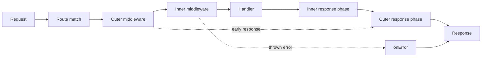

<TLDR>
  <TLDRCell label="what">
    Hono is a TypeScript HTTP framework designed around Web-standard `Request`, `Response`, and `fetch` semantics, with one routing core that adapts to several JavaScript runtimes.
  </TLDRCell>
  <TLDRCell label="when">
    Choose Hono when an API needs lightweight routing, middleware composition, runtime input validation, or shared route types between a server and TypeScript client.
  </TLDRCell>
  <TLDRCell label="how">
    Declare routes and input boundaries first, then mount middleware in execution order; test real HTTP behavior with `app.request()` and keep deployment adapters outside the application core.
  </TLDRCell>
</TLDR>

## What it is and why it exists

Hono is a TypeScript web framework. It builds routing, request access, response construction, and
middleware on Web-standard APIs; handlers receive a context and ultimately return a `Response`.
The same application core can work with entry points or adapters for Cloudflare Workers, Node.js,
Deno, Bun, and other runtimes.

Its main problem isn't “how to listen on a port,” but how to describe an application through a
consistent HTTP programming model. Traditional Node.js frameworks often couple handlers to
server-specific request objects. Hono instead presents the routing core with `Request` and
`Response`, while the deployment layer connects runtime events to that core.

The <Term id="hono-context">Hono Context</Term> received by a handler is conventionally named `c`.
`c.req` offers convenient access to path parameters, query parameters, headers, and validated data,
while `c.req.raw` retains the original `Request`. Methods such as `c.json()`, `c.text()`, and
`c.body()` construct responses.

Hono <Term id="middleware">middleware</Term> consists of functions that run around later processing
steps. Middleware can inspect a request before `await next()` and modify headers or record the result
afterward. Route and middleware registration order is program behavior, not merely source layout.

Hono fits HTTP APIs, edge functions, small services, and monorepo applications that share TypeScript
route types. If the business code depends heavily on Node.js-only libraries, or the team needs an
opinionated dependency-injection container, task queue, and ORM, evaluate the runtime and ecosystem
instead of inferring whole-application portability from the framework's Web-standard core.

An <Term id="edge-runtime">edge runtime</Term> commonly constrains process lifetime, file-system access,
sockets, or Node.js built-ins. Hono reduces runtime differences at the HTTP layer, but database
drivers, environment values, background work, and durable state still depend on the platform.

Hono also provides <Term id="hono-rpc">Hono RPC</Term>, which lets an `hc` client infer paths,
parameters, and response types from the server application type. This RPC is a typed HTTP client
pattern: it neither bypasses HTTP nor turns TypeScript's static checks into runtime validation for
requests arriving in production.

This topic stays with Hono's HTTP core. JSX, streaming rendering, WebSocket support, OpenAPI,
Cloudflare D1, and R2 each introduce separate deployment or product constraints. Putting them all in
one starter application would hide the routing boundary you first need to understand.

## How it works

After `new Hono()`, the application registers routes and middleware in call order. When a request
arrives, the router selects a matching chain by HTTP method and path, creates a context, and executes
the functions in that chain. A handler's value must form a `Response`; a branch that returns no
response fails at runtime.

A typical request follows the flow below. The returning arrows matter because response logging,
timing, and header changes usually sit after `await next()`.



Middleware passes control to the next item in the chain with `await next()`. Control returns in the
opposite direction when that item completes. If middleware returns a response without calling
`next()`, later validation, authorization, or handlers do not run; authentication rejection and
cache hits commonly use this short circuit.

Routes can read `c.req.param()`, `c.req.query()`, `c.req.header()`, and a request body. These values
come from untrusted HTTP input. Even when TypeScript labels the result as a `string`, that only
describes its static representation after framework access; format, range, allowed values, and field
relationships still require runtime validation.

The built-in `validator()` middleware passes one input target to a validation function. On success,
the handler reads the cleaned result through `c.req.valid(target)`. When the validation function
returns a `Response`, the request ends before business handling. Third-party validators can offer
richer schemas, but the trust boundary remains the same.

`app.onError()` handles errors thrown from the chain, while `app.notFound()` handles requests that
match no route. Expected business outcomes should usually return an explicit status and stable error
shape. The exception handler belongs to exceptional paths and must not expose internal error messages
verbatim to clients.

`app.request()` accepts a path or `Request`, so tests can execute routing, middleware, and response
construction without opening a port. It is well suited to assertions on status, headers, and body.
Platform bindings can be passed as an environment argument in tests, but real adapters, permissions,
and external services still need higher-level integration tests.

Hono RPC types come from the final type of a chained route declaration. `type AppType = typeof route`
preserves registered paths, and `hc<AppType>()` produces the client shape. If a client and server use
incompatible types or versions, successful compilation doesn't prove the deployed service implements
the same contract.

## Examples

The four examples add route input, middleware, runtime validation, and a typed client in sequence.
They were compiled with TypeScript 6.0.3 and run using `npx tsx` on Hono 4.13.5 and Node 24.14.0.

### Path and query parameters

The first application registers one GET route. A request made through `app.request()` passes through
the real router; the handler reads a path parameter and an optional query parameter, then returns a
JSON response.

<Depth level="quick">

```typescript run title="basic-routing.ts"
import { Hono } from 'hono'

const app = new Hono()

app.get('/orders/:id', (c) => {
  const includeLines = c.req.query('include') === 'lines'
  return c.json({
    id: c.req.param('id'),
    includeLines,
  })
})

async function main() {
  for (const path of ['/orders/o-7', '/orders/o-8?include=lines']) {
    const response = await app.request(path)
    console.log(response.status, await response.text())
  }
}

main()
```

```text
200 {"id":"o-7","includeLines":false}
200 {"id":"o-8","includeLines":true}
```

<TryToBreak items={['a path with no order id', 'repeated include parameters', 'a percent-encoded id']} />

</Depth>

`c.req.param('id')` returns the path segment selected by the route, while the query parameter is not
part of path matching. Here the sole allowed value, `lines`, maps to a Boolean, so every other string
produces `false`. If the public contract must reject unknown query values, validate explicitly and
return `400` instead of silently treating all of them alike.

### Middleware order and short circuits

The second application first registers outer middleware for `/api/*`, then narrower authentication
middleware. An unauthorized request stops early, while an authorized request reaches the handler;
both paths return through the outer middleware and receive a request-ID response header.

```typescript run title="middleware-order.ts"
import { Hono } from 'hono'

const app = new Hono()
const events: string[] = []

app.use('/api/*', async (c, next) => {
  events.push('request:start')
  await next()
  c.header('x-request-id', 'req-7')
  events.push('request:end')
})

app.use('/api/private/*', async (c, next) => {
  events.push('auth:check')
  if (c.req.header('authorization') !== 'Bearer demo') {
    return c.json({ error: 'Unauthorized' }, 401)
  }
  await next()
})

app.get('/api/private/profile', (c) => {
  events.push('handler')
  return c.json({ user: 'Ada' })
})

async function call(headers?: Record<string, string>) {
  events.length = 0
  const response = await app.request('/api/private/profile', { headers })
  console.log(response.status, response.headers.get('x-request-id'))
  console.log(events.join(' > '))
}

async function main() {
  await call()
  await call({ authorization: 'Bearer demo' })
}

main()
```

```text
401 req-7
request:start > auth:check > request:end
200 req-7
request:start > auth:check > handler > request:end
```

The output shows onion-style unwinding rather than a simple top-to-bottom list. There is no `handler`
event after authentication failure because returning `401` terminates the rest of the chain. Real
authentication must also verify the credential, principal, and authorization scope; the fixed token
here exists only to demonstrate control flow.

### Validating JSON at runtime

The third application uses the built-in `validator()` to check a JSON body. After the validator
returns a cleaned order, the handler reads it from `c.req.valid('json')`; an invalid quantity receives
`400` before the business handler runs.

```typescript run title="validate-order.ts"
import { Hono } from 'hono'
import { validator } from 'hono/validator'

type OrderInput = { sku: string; quantity: number }

const app = new Hono()

app.post('/orders', validator('json', (value, c) => {
  const input = value as Partial<OrderInput>
  if (typeof input.sku !== 'string' || input.sku.trim() === '' ||
      !Number.isInteger(input.quantity) || input.quantity! < 1) {
    return c.json({ error: 'Invalid order' }, 400)
  }
  return { sku: input.sku.trim(), quantity: input.quantity! }
}), (c) => {
  const order = c.req.valid('json')
  return c.json({ id: 'ord-7', ...order }, 201)
})

async function main() {
  for (const body of [
    { sku: 'tea-1', quantity: 2 },
    { sku: 'tea-1', quantity: 0 },
  ]) {
    const response = await app.request('/orders', {
      method: 'POST',
      headers: { 'content-type': 'application/json' },
      body: JSON.stringify(body),
    })
    console.log(response.status, await response.text())
  }
}

main()
```

```text
201 {"id":"ord-7","sku":"tea-1","quantity":2}
400 {"error":"Invalid order"}
```

`as Partial<OrderInput>` only helps the validation function implement its checks; it doesn't validate
network data. The actual boundary consists of the following type and integer-range checks. JSON
validation also depends on the correct `Content-Type`, so test an incorrect client media type and
return a consistent response under the application's HTTP contract.

### Creating a client from the route type

The final example gives a chained route type to `hc`. To keep the example self-contained, a custom
`fetch` sends the client's request directly into the application. A production client usually uses
global `fetch` to contact a deployed base URL.

```typescript run title="typed-client.ts"
import { Hono } from 'hono'
import { hc } from 'hono/client'

const route = new Hono().get('/users/:id', (c) => {
  return c.json({
    id: c.req.param('id'),
    name: 'Ada',
  })
})

type AppType = typeof route

const client = hc<AppType>('http://local', {
  fetch: (input: RequestInfo | URL, init?: RequestInit) =>
    route.fetch(new Request(input, init)),
})

async function main() {
  const response = await client.users[':id'].$get({
    param: { id: 'u-7' },
  })

  console.log(response.status, await response.text())
}

main()
```

```text
200 {"id":"u-7","name":"Ada"}
```

The client can check the path-parameter name and infer the response from the server return value. It
doesn't verify the deployed version or replace runtime tests for timeouts, authentication, error
branches, and bodies. Publish server types from a controlled package; don't make a browser client
import an implementation module that contains server secrets or side-effectful startup code.

## Pitfalls

### Treating TypeScript types as input validation

> [!PITFALL]
> `await c.req.json<OrderInput>()` and type assertions only change the compiler's view. An attacker can still send missing fields, wrong types, out-of-range numbers, or extra fields, while generated code may pass them directly to the database.

**Fix:** Perform runtime validation at the route boundary, use the cleaned result from `c.req.valid()`,
and separately test incorrect media types, malformed JSON, missing fields, boundary values, and the
unknown-field policy.

### Registering middleware after protected routes

> [!PITFALL]
> Hono registration order has semantics. Authentication or validation middleware registered too late may never cover earlier routes, while a missing `await next()` unexpectedly cuts off the entire later chain.

**Fix:** Put cross-route policies before every route they affect, and send unauthorized requests to
each protected route in tests. For middleware that calls `next()`, check both entry and response
phases; for a short-circuit branch, explicitly return a `Response`.

### Assuming Web standards imply full portability

> [!PITFALL]
> A route using only `Request` and `Response` doesn't mean database drivers, file systems, cryptography, environment values, or background work have the same API and lifecycle on every runtime.

**Fix:** Put platform bindings behind an explicit `Bindings` type and adapter layer. Audit dependencies
for each target runtime and run a deployment-environment smoke test. Don't quietly depend on
`process.env` or the Node.js file system in a Cloudflare application.

### Treating process memory as durable state

> [!PITFALL]
> A module-level `Map` is useful in a deterministic example, but it cannot store orders, rate-limit counters, or session facts. Instances have separate copies, restarts lose the contents, and read-then-write updates can race.

**Fix:** Store business facts in an external system with the required transactions and consistency.
Caches must tolerate loss and define invalidation. Rate limits and idempotency keys need a backend that
coordinates atomically across the real deployment topology.

### Treating Hono RPC as proof of the live contract

> [!PITFALL]
> `hc<AppType>` checks only the application type available when the client compiles. An old service, a stale client declaration, a non-TypeScript caller, or a wrong runtime response body can all drift without the type system detecting it.

**Fix:** Pin compatible Hono versions, publish traceable server type artifacts, and keep contract tests
against the real HTTP boundary. Public APIs also need an independent versioning and compatibility
policy.

<Depth level="deep">

## Route registration and composition boundaries

A Hono route has at least an HTTP method, a path pattern, and a handler. Static paths, named
parameters, and wildcards can be combined, and several methods can be registered for the same path.
`app.on()` applies one handler to a set of methods or paths; `app.all()` matches every method at that
path.

Route order affects matching. A broad parameter or wildcard route registered first can handle a
request before a later, more specific route. When adding a route, test its overlap with neighboring
static, parameter, and wildcard patterns instead of testing the new path alone.

`app.route('/api', child)` mounts a child application. A child keeps domain routes and local
middleware in one module, but its final paths combine the mount prefix with child paths. Verify the
final URLs with `app.request()` to catch repeated prefixes, missing leading slashes, and overly broad
wildcards.

Hono RPC requires TypeScript to see the precise type after route composition. Take `typeof` from the
final chained result, or assign the complete chain directly to the exported variable. If code starts
with a broad application variable and discards the more specific return type from every chained call,
runtime routes can exist while client types omit them.

A large application shouldn't pull its entire server implementation into a browser build. Publish
the application type as a type-only dependency and have clients use `import type`. This reduces the
risk of starting server initialization accidentally, but secrets still must not occur in any exported
type literal or client configuration.

### Methods and not-found responses

An unmatched route reaches `app.notFound()`, while a thrown handler error reaches `app.onError()`;
these are different paths. Mapping every failure to `404` hides program defects, while mapping every
unmatched route to `500` misleads monitoring and clients.

The HTTP method is part of the contract. A path with a GET route doesn't make POST valid, and the
exact unmatched behavior must be tested for the target version. A shared error document can be
returned from both not-found and exception handlers, but preserve distinct statuses and stable error
codes.

## Context, variables, and runtime bindings

A context belongs to one request. `c.req` is Hono's request interface around the original `Request`,
and `c.req.raw` supplies the standard object to libraries that require it. A handler should return a
response built with a context helper or a standard `Response`.

`c.set()` and `c.get()` pass derived values, such as an authenticated principal or request ID,
between middleware and handlers for that request. Giving `new Hono<{ Variables: Variables }>()` a
variables type lets TypeScript check keys and values. It doesn't prove the responsible middleware
runs before every route that reads a variable.

`Bindings` describes injected runtime environment values such as a Cloudflare KV namespace,
database, or secret. The binding type is only a compile-time contract; deployment configuration can
still omit it or point it at the wrong resource. Startup checks, deployment previews, and target-
platform tests must provide that evidence.

Do not save `c` in a module global for later use. It carries request, response, and environment state,
so its lifetime belongs to the current request chain. Background work must extract the smallest
serializable data and use the waiting, queue, or task API supported by the runtime.

### Response statuses and headers

`c.json()` and `c.text()` set the corresponding media type and accept an explicit status. Business
code should keep status and payload meaning together at each return, such as `201` for successful
creation and the contract's chosen `400` or other status for invalid input.

`c.header()` can set response headers before or after response construction, but middleware must
wait for the later chain before modifying its final response. If later code returns a response that
can't be modified in the same way, or streaming has begun, the capability depends on the runtime and
response type. Validate streaming designs separately instead of inferring them from ordinary JSON.

<Term id="cors">Cross-Origin Resource Sharing (CORS)</Term> is a browser-enforced HTTP permission
protocol, not server authentication. When configuring `cors()`, enumerate allowed origins, methods,
and request headers, and verify that failure responses also carry the expected CORS headers. A casual
combination of arbitrary origins and credentials neither replaces authorization nor protects data.

## Validation boundaries and the error model

Request validation answers whether transport data has the required shape and format. Authorization
answers whether the current principal may perform an action. Database constraints answer whether an
invariant still holds after concurrent writes. The three cooperate; a passing Hono validator doesn't
remove tenant scoping, uniqueness constraints, or transactions.

The validation target must match how clients send data. JSON, forms, queries, paths, headers, and
cookies have different extraction rules, with `Content-Type` especially important. Generated code
often tests a validation function directly without building a real request, missing media-type,
encoding, and parsing failures.

Normalization belongs to the validation result. The example trims `sku`, and the handler reads only
that cleaned value. If the handler later calls `c.req.json()` again and uses the raw body, it bypasses
the validation boundary. Give one input a clear canonical representation and owner.

Error responses are part of the <Term id="api-contract">API contract</Term>. Choose stable statuses,
error codes, and public messages for expected failures; don't return stacks, SQL, or platform errors
verbatim. Logs can record the internal cause but must avoid tokens, cookies, personal data, and full
sensitive request bodies.

`onError` should preserve observability for unknown failures. Returning a safe, uniform `500` after
catching an exception is reasonable, but the error still needs structured logging or monitoring and
a request ID. If the error handler itself can fail, retain a minimal fallback path.

## Guarantees and limits of a typed client

`hc` generates a path tree from an application type. Parameters, queries, JSON input, and handler
return types can participate in <Term id="type-inference">type inference</Term>, so callers catch a
misspelled path parameter or incorrect field at compile time. The exact information available depends
on the route declaration and the types provided by its validators.

Static types don't travel with an HTTP request. A deployed server doesn't know whether the caller
used `hc`; Java, Python, and handwritten `fetch` clients don't consume TypeScript types either.
Runtime validation and public protocol documentation therefore remain necessary.

When sharing types across repositories, version the type artifact and define a compatibility policy.
The client compile-time dependency, target service deployment, and gateway route can all have
different versions. Continuous integration should exercise supported-client and candidate-server
combinations, asserting statuses, media types, relevant headers, and bodies over real HTTP.

Response branches still require caller checks. `response.ok` covers only statuses from `200` through
`299`; it doesn't explain a particular error's business meaning. Narrow on status or stable error code,
and handle network errors, timeouts, and bodies that cannot be parsed. A typed success body doesn't
replace a failure model.

Hono RPC and OpenAPI solve different problems. The former conveniently shares an application type
directly between TypeScript codebases, while the latter can publish a checkable HTTP description
across languages. A public interface may use both, but it must identify the published contract and
the mechanism that detects drift.

## Testing and deployment adapters

`app.request()` executes the real Hono request path while avoiding ports, random free-port selection,
and test-server cleanup. Observe public behavior through the returned `Response`; directly calling a
handler bypasses route matching, middleware, parsing, and error mapping.

A useful test matrix covers method and path, authentication and authorization, input boundaries,
business not-found and conflict cases, and unknown exceptions. Each case should assert important
headers and the body, not only the status. Security tests should also prove that sensitive extra
fields are absent.

An in-process test cannot prove the deployment adapter works. Node.js usually needs a server adapter,
Cloudflare Workers receive requests and bindings from the platform, and other runtimes have their own
entry points. Keep one minimal startup test and post-deployment smoke request for every target.

Keep the adapter thin: assemble bindings, logging, and platform lifecycle behavior, then hand the
request to the same application core. If business code reads platform globals everywhere, claimed
multi-runtime support quickly turns into conditional branches. An explicit interface also lets tests
provide controlled substitutes.

Don't infer application latency or cold-start behavior from framework marketing. Route count,
middleware, validators, dependencies, external I/O, adapters, and deployment regions all affect the
result. Base performance decisions on reproducible measurements with the target runtime and
representative traffic.

</Depth>

<Checkpoint id="backend/hono" />

## Further reading

- [Hono documentation](https://hono.dev/docs/)
- [Hono routing](https://hono.dev/docs/api/routing)
- [Hono middleware guide](https://hono.dev/docs/guides/middleware)
- [Hono validation guide](https://hono.dev/docs/guides/validation)
- [Hono RPC guide](https://hono.dev/docs/guides/rpc)
- [Hono testing guide](https://hono.dev/docs/guides/testing)
