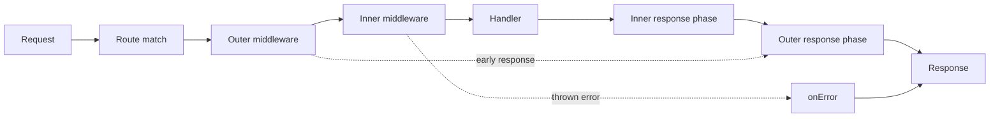

<TLDR>
  <TLDRCell label="what">
    Hono 是围绕 Web 标准 `Request`、`Response` 和 `fetch` 语义设计的 TypeScript HTTP 框架，用同一套路由核心适配多种 JavaScript 运行时。
  </TLDRCell>
  <TLDRCell label="when">
    当 API 需要轻量路由、中间件组合、运行时输入验证，或者服务端与 TypeScript 客户端共享路由类型时，可以选择 Hono。
  </TLDRCell>
  <TLDRCell label="how">
    先声明路由与输入边界，再按执行顺序挂载中间件；通过 `app.request()` 测试真实 HTTP 行为，并把部署适配器留在应用核心之外。
  </TLDRCell>
</TLDR>

## 是什么，为什么存在

Hono 是一个 TypeScript Web 框架。它把路由、请求读取、响应构造和中间件建立在
Web 标准 API 上，处理器接收上下文并最终返回 `Response`。同一应用核心可以配合
Cloudflare Workers、Node.js、Deno、Bun 等运行时的入口或适配器。

它解决的主要问题不是“怎样监听一个端口”，而是怎样用一致的 HTTP 编程模型描述应用。
传统 Node.js 框架常把处理器绑在特定服务器对象和请求对象上；Hono 则让路由核心面对
`Request` 与 `Response`，部署层负责把运行时事件接到这个核心。

处理器收到的<Term id="hono-context">Hono 上下文（Hono Context）</Term>通常命名为 `c`。
`c.req` 提供路径参数、查询参数、请求头和已验证数据等便捷接口，`c.req.raw` 保留原始
`Request`。`c.json()`、`c.text()` 和 `c.body()` 等方法用于构造响应。

Hono 的<Term id="middleware">中间件（middleware）</Term>是一组围绕后续处理步骤执行的函数。
中间件可以在 `await next()` 前检查请求，也可以在其后修改响应头或记录结果。
路由与中间件的注册顺序属于程序行为，不是单纯的代码排版。

Hono 适合 HTTP API、边缘函数、小型服务和需要共享 TypeScript 路由类型的同仓库应用。
如果业务依赖大量 Node.js 专用库，或者团队需要完整的依赖注入、任务队列和 ORM 约定，
选择时仍要评估运行时能力与生态，而不能仅凭框架核心采用 Web 标准就推断整个应用可移植。

<Term id="edge-runtime">边缘运行时（edge runtime）</Term>通常限制进程生命周期、文件系统、
套接字或 Node.js 内置模块。Hono 能减少 HTTP 层的运行时差异，但数据库驱动、环境变量、
后台任务和持久状态仍由具体平台决定。

Hono 还提供<Term id="hono-rpc">Hono RPC</Term>，让 `hc` 客户端从服务端应用类型推导路径、
参数和响应类型。这里的 RPC 是类型化 HTTP 客户端模式，不会绕过 HTTP，也不会把
TypeScript 的静态检查变成线上请求的运行时验证。

本主题只讲 Hono 的 HTTP 核心。JSX、流式渲染、WebSocket、OpenAPI、Cloudflare D1 与 R2
都有独立的部署或产品约束，把它们塞进一个入门应用会掩盖真正需要掌握的路由边界。

## 工作原理

创建 `new Hono()` 后，应用会按调用顺序登记路由和中间件。请求进入时，路由器根据
HTTP 方法与路径选择匹配链，再创建上下文并执行链中的函数。处理器返回的值必须能形成
一个 `Response`；没有返回响应的分支会在运行时失败。

一次典型请求可以画成下面的执行流。箭头返回部分很重要，因为响应阶段的日志、计时和
响应头设置通常位于 `await next()` 之后。



中间件通过 `await next()` 把控制权交给链中下一项。下一项完成后，控制权按相反方向返回。
中间件若直接返回响应而不调用 `next()`，后面的验证、授权或处理器不会执行；这正是认证拒绝
和缓存命中的常用短路方式。

路由可以读取 `c.req.param()`、`c.req.query()`、`c.req.header()` 和请求体。
这些值来自不可信 HTTP 输入，即使 TypeScript 把变量标成 `string`，也只说明框架读取后的
静态表示。格式、范围、允许值与字段组合仍要在运行时验证。

内置 `validator()` 中间件把某个输入目标交给验证函数。验证成功时，处理器通过
`c.req.valid(target)` 读取清洗后的值；验证函数返回 `Response` 时，请求会在进入业务处理器前
结束。第三方验证器可以提供更丰富的模式，但信任边界相同。

`app.onError()` 处理链中抛出的错误，`app.notFound()` 处理没有路由匹配的请求。预期的业务分支
通常应直接返回明确状态与稳定错误结构；异常处理器适合真正的异常路径，并且不应把内部错误
消息原样暴露给客户端。

`app.request()` 接受路径或 `Request`，让测试直接经过路由、中间件与响应构造而无需监听端口。
它适合验证状态码、响应头和正文。平台绑定可以作为环境参数传入测试，但真实适配器、平台权限
和外部服务仍需要更高层的集成测试。

Hono RPC 的类型来自链式路由声明的最终类型。`type AppType = typeof route` 保留已登记的路径，
`hc<AppType>()` 再生成客户端形状。服务端与客户端使用不兼容的类型或版本时，编译通过并不能
证明部署中的服务正实现同一份契约。

## 示例

下面四个示例逐步加入路由输入、中间件、运行时验证和类型化客户端。它们在
Hono 4.13.5、Node 24.14.0 和 TypeScript 6.0.3 下编译，并由 `npx tsx` 实际执行。

### 路径参数与查询参数

第一个应用登记一条 GET 路由。`app.request()` 构造的请求走过真实路由器，处理器分别读取
路径参数与可选查询参数，再返回 JSON 响应。

<Depth level="quick">

```typescript run title="basic-routing.ts"
import { Hono } from 'hono'

const app = new Hono()

app.get('/orders/:id', (c) => {
  const includeLines = c.req.query('include') === 'lines'
  return c.json({
    id: c.req.param('id'),
    includeLines,
  })
})

async function main() {
  for (const path of ['/orders/o-7', '/orders/o-8?include=lines']) {
    const response = await app.request(path)
    console.log(response.status, await response.text())
  }
}

main()
```

```text
200 {"id":"o-7","includeLines":false}
200 {"id":"o-8","includeLines":true}
```

<TryToBreak items={['缺少订单 id 的路径', '重复的 include 查询参数', '含百分号编码字符的 id']} />

</Depth>

`c.req.param('id')` 返回已经匹配的路径片段，查询参数则不属于路径匹配本身。
这里把唯一允许值 `lines` 映射为布尔量，所以其他字符串得到 `false`。若公开契约需要拒绝
未知查询值，应显式验证并返回 `400`，不能静默把所有输入当成同一个值。

### 中间件顺序与短路

第二个应用先登记覆盖 `/api/*` 的外层中间件，再登记更窄的认证中间件。未授权请求被短路，
授权请求才到达处理器；两条路径都会返回外层中间件并设置请求标识响应头。

```typescript run title="middleware-order.ts"
import { Hono } from 'hono'

const app = new Hono()
const events: string[] = []

app.use('/api/*', async (c, next) => {
  events.push('request:start')
  await next()
  c.header('x-request-id', 'req-7')
  events.push('request:end')
})

app.use('/api/private/*', async (c, next) => {
  events.push('auth:check')
  if (c.req.header('authorization') !== 'Bearer demo') {
    return c.json({ error: 'Unauthorized' }, 401)
  }
  await next()
})

app.get('/api/private/profile', (c) => {
  events.push('handler')
  return c.json({ user: 'Ada' })
})

async function call(headers?: Record<string, string>) {
  events.length = 0
  const response = await app.request('/api/private/profile', { headers })
  console.log(response.status, response.headers.get('x-request-id'))
  console.log(events.join(' > '))
}

async function main() {
  await call()
  await call({ authorization: 'Bearer demo' })
}

main()
```

```text
401 req-7
request:start > auth:check > request:end
200 req-7
request:start > auth:check > handler > request:end
```

输出展示了洋葱式回程，而不是简单的从上到下列表。认证失败时没有 `handler` 事件，说明
返回 `401` 已经终止后续链。真实认证还必须验证凭据、主体与授权范围，示例中的固定令牌只用于
展示控制流。

### 在运行时验证 JSON

第三个应用使用内置 `validator()` 检查 JSON 请求体。验证器返回清洗后的订单后，处理器从
`c.req.valid('json')` 读取它；无效数量则在业务处理器之前得到 `400`。

```typescript run title="validate-order.ts"
import { Hono } from 'hono'
import { validator } from 'hono/validator'

type OrderInput = { sku: string; quantity: number }

const app = new Hono()

app.post('/orders', validator('json', (value, c) => {
  const input = value as Partial<OrderInput>
  if (typeof input.sku !== 'string' || input.sku.trim() === '' ||
      !Number.isInteger(input.quantity) || input.quantity! < 1) {
    return c.json({ error: 'Invalid order' }, 400)
  }
  return { sku: input.sku.trim(), quantity: input.quantity! }
}), (c) => {
  const order = c.req.valid('json')
  return c.json({ id: 'ord-7', ...order }, 201)
})

async function main() {
  for (const body of [
    { sku: 'tea-1', quantity: 2 },
    { sku: 'tea-1', quantity: 0 },
  ]) {
    const response = await app.request('/orders', {
      method: 'POST',
      headers: { 'content-type': 'application/json' },
      body: JSON.stringify(body),
    })
    console.log(response.status, await response.text())
  }
}

main()
```

```text
201 {"id":"ord-7","sku":"tea-1","quantity":2}
400 {"error":"Invalid order"}
```

`as Partial<OrderInput>` 只帮助验证函数实现检查，不会验证网络数据。真正的边界是后续的
类型判断与整数范围判断。JSON 验证还依赖正确的 `Content-Type`；客户端媒体类型错误时，
应用应按自己的 HTTP 契约测试并返回一致响应。

### 从路由类型创建客户端

最后一个示例把链式路由的类型交给 `hc`。为了让示例保持自包含，自定义 `fetch` 把客户端
产生的请求直接送入应用；生产客户端通常使用全局 `fetch` 访问已部署地址。

```typescript run title="typed-client.ts"
import { Hono } from 'hono'
import { hc } from 'hono/client'

const route = new Hono().get('/users/:id', (c) => {
  return c.json({
    id: c.req.param('id'),
    name: 'Ada',
  })
})

type AppType = typeof route

const client = hc<AppType>('http://local', {
  fetch: (input: RequestInfo | URL, init?: RequestInit) =>
    route.fetch(new Request(input, init)),
})

async function main() {
  const response = await client.users[':id'].$get({
    param: { id: 'u-7' },
  })

  console.log(response.status, await response.text())
}

main()
```

```text
200 {"id":"u-7","name":"Ada"}
```

客户端能检查路径参数名称，并根据服务端返回值推导响应。它不会验证实际部署版本，也不会
替代超时、认证、错误分支和响应正文的运行时测试。服务端类型应从受控包发布，不能让浏览器
客户端导入包含服务器密钥或带副作用入口的实现模块。

## 陷阱

### 把 TypeScript 类型当成输入验证

> [!PITFALL]
> `await c.req.json<OrderInput>()` 或类型断言只改变编译器看到的类型。攻击者仍可发送缺字段、错误类型、越界数字或额外字段，生成代码却可能直接把它们交给数据库。

**修复方法：** 在路由边界执行运行时验证，使用 `c.req.valid()` 中的清洗结果，并分别测试
错误媒体类型、畸形 JSON、缺字段、边界值与未知字段策略。

### 把中间件写在受保护路由之后

> [!PITFALL]
> Hono 的注册顺序有语义。认证或验证中间件若登记得太晚，前面的路由可能从未经过它；漏掉 `await next()` 又会意外截断整个后续链。

**修复方法：** 把跨路由策略放在受影响路由之前，并用未授权请求逐条测试保护范围。
对于调用 `next()` 的中间件，检查进入阶段与返回阶段都执行；对于短路分支，明确返回 `Response`。

### 假设 Web 标准等于完整可移植性

> [!PITFALL]
> 路由只用 `Request` 与 `Response`，不代表数据库驱动、文件系统、加密、环境变量或后台任务在每个运行时都具有相同 API 和生命周期。

**修复方法：** 把平台绑定放进明确的 `Bindings` 类型和适配层。针对每个目标运行时检查依赖，
并在部署环境执行冒烟测试；不要在 Cloudflare 示例中偷偷依赖 `process.env` 或 Node.js 文件系统。

### 把进程内状态当成持久状态

> [!PITFALL]
> 模块级 `Map` 适合固定示例，却不能保存订单、限流计数或会话事实。多实例会各有一份副本，实例重启会丢失内容，并发的读取后写入也可能竞争。

**修复方法：** 把业务事实放到支持所需事务与一致性的外部存储。缓存必须允许丢失并有失效策略；
限流与幂等键需要能够在实际部署拓扑中原子协调的后端。

### 把 Hono RPC 当成线上契约证明

> [!PITFALL]
> `hc<AppType>` 只检查客户端编译时拿到的应用类型。旧服务仍在运行、客户端携带旧声明、非 TypeScript 调用方或运行时返回错误正文时，类型系统都不会自动发现漂移。

**修复方法：** 固定兼容的 Hono 版本，发布可追踪的服务端类型制品，并保留针对真实 HTTP
边界的契约测试。公开 API 还需要独立的版本与兼容策略。

<Depth level="deep">

## 路由登记与组合边界

Hono 路由至少由 HTTP 方法、路径模式与处理器组成。静态路径、命名参数和通配符可以组合，
同一路径也可以登记多个方法。`app.on()` 适合为一组方法或路径使用同一处理器，
`app.all()` 则匹配该路径上的全部方法。

路由顺序会影响匹配结果。更宽的参数路由或通配路由如果先登记，可能先于后面的特定路由
处理请求。新增路由时应测试与相邻静态、参数和通配模式的重叠，而不是只测试新路径自身。

`app.route('/api', child)` 可以挂载子应用。子应用让领域路由和局部中间件保持在一个模块中，
但最终路径由挂载前缀与子路径共同决定。重复前缀、遗漏前导斜杠和过宽通配符都应通过
`app.request()` 的最终 URL 验证。

Hono RPC 依赖 TypeScript 看见路由组合后的精确类型。为了保留类型，应对最终链式结果取
`typeof`，或者让导出的变量直接接收完整链。先创建宽泛应用变量、再忽略每次链式调用的返回类型，
可能让运行时路由存在而客户端类型缺失。

大型应用不应把服务端实现整体塞进浏览器构建。把应用类型作为仅类型依赖发布，并确保客户端
使用 `import type`。这能减少意外运行服务端初始化代码的风险，但密钥仍不应出现在任何可导出的
类型字面量或客户端配置中。

### 方法与未找到响应

路由未匹配时进入 `app.notFound()`，处理器抛出的错误则进入 `app.onError()`；两者不是同一条路径。
把所有错误都映射成 `404` 会隐藏程序故障，把所有未匹配路径映射成 `500` 又会误导监控和客户端。

HTTP 方法也是契约的一部分。一个存在 GET 路由的路径不代表 POST 自动有效，客户端看到的具体
未匹配行为应通过目标版本测试。需要统一错误文档时，在 not-found 与异常处理器中返回相同外形，
同时保留不同状态和稳定错误码。

## 上下文、变量与运行时绑定

上下文只属于一次请求。`c.req` 是围绕原始 `Request` 的 Hono 请求接口，`c.req.raw` 则用于
需要标准对象的库。处理器创建响应时，应返回上下文辅助方法生成的响应或一个标准 `Response`。

`c.set()` 与 `c.get()` 可以在同一请求的中间件和处理器之间传递派生值，例如已经认证的主体
或请求标识。给 `new Hono<{ Variables: Variables }>()` 提供变量类型后，TypeScript 可以检查
键与值；它不会保证负责设置变量的中间件一定在每条读取路由之前运行。

`Bindings` 描述运行时注入的环境，例如 Cloudflare 的 KV、数据库或密钥。绑定类型只是编译期
契约，部署配置仍可能缺失或指向错误资源。启动检查、部署预览和目标平台测试必须补上这部分证据。

不要把 `c` 保存到模块全局变量供以后使用。它携带请求、响应和环境状态，生命周期应限制在
当前请求链中。后台工作需要提取最小且可序列化的数据，并使用运行时支持的等待、队列或任务 API。

### 响应状态与响应头

`c.json()` 和 `c.text()` 会设置相应的媒体类型，并允许显式状态码。业务代码应在返回点让状态
与负载含义一致，例如创建成功返回 `201`，输入不合法返回契约规定的 `400` 或其他状态。

`c.header()` 可以在响应生成前后设置响应头，但中间件必须等待后续链返回后才能修改最终响应。
若后续代码直接返回某些不可修改的响应或已经开始流式发送，响应阶段能力会受运行时与响应类型限制；
流式设计需要单独验证，不能从普通 JSON 示例推断。

<Term id="cors">跨源资源共享（Cross-Origin Resource Sharing，CORS）</Term>是浏览器执行的
HTTP 许可协议，不是服务端认证。配置 `cors()` 时应列出允许的源、方法与请求头，并测试失败响应
也带有预期 CORS 头；把任意源与凭据随意组合既不能替代授权，也可能造成数据暴露。

## 验证边界与错误模型

请求验证回答“传输数据是否符合结构与格式”，授权回答“当前主体能否执行操作”，数据库约束
回答“并发写入后不变量是否仍成立”。三者应协作，不能因为 Hono 验证器已经通过就跳过
租户范围检查、唯一约束或事务。

验证目标必须与客户端发送方式一致。JSON、表单、查询、路径、请求头和 Cookie 有不同读取规则，
尤其要测试 `Content-Type`。生成代码经常只测试直接调用验证函数，而没有构造真实请求，因而错过
媒体类型、编码和解析错误。

清洗属于验证结果的一部分。示例对 `sku` 执行 `trim()`，处理器只读取清洗值；如果处理器后来
又调用 `c.req.json()` 并使用原始正文，验证边界就被绕过。一个输入应有明确的规范化表示和所有者。

错误响应是<Term id="api-contract">API 契约（API contract）</Term>的一部分。为预期失败选择稳定的
状态、错误码和公开消息，不要把堆栈、SQL 或平台异常原样返回。日志可以记录内部原因，但必须避免
令牌、Cookie、个人数据和完整敏感请求体。

`onError` 应保留未知故障的可观察性。捕获异常后统一返回安全 `500` 很合理，但仍需把错误交给
结构化日志或监控，并关联请求标识。若错误处理器自身可能失败，还要有最小的兜底路径。

## 类型化客户端的保证范围

`hc` 根据应用类型生成路径树。参数、查询、JSON 输入和处理器返回类型能够参与
<Term id="type-inference">类型推断（type inference）</Term>，让调用方在编译期发现拼错路径参数
或传入错误字段。具体可推导内容取决于路由声明与验证器提供的类型。

静态类型不会随 HTTP 请求发送。部署后的服务端不知道调用方是否通过 `hc` 构造请求，Java、Python
或手写 `fetch` 客户端也不读取 TypeScript 类型。因此，运行时验证和公开协议文档仍然必要。

跨仓库共享类型时，要给类型制品建立版本和兼容政策。客户端编译时依赖版本、目标服务部署版本
以及网关路由版本可能不同。持续集成应至少验证支持的客户端与候选服务组合，并对真实 HTTP
交换断言状态、媒体类型、相关响应头和正文。

响应分支需要调用方检查。`response.ok` 只覆盖 `200` 到 `299`，不会解释某个错误状态的业务含义；
客户端应按状态或稳定错误码收窄，并处理网络错误、超时与不可解析正文。类型化成功响应不能代替
失败模型。

Hono RPC 与 OpenAPI 解决的问题不同。前者便于 TypeScript 代码直接共享应用类型，后者适合跨语言
发布可检查的 HTTP 描述。公开接口可以同时使用两者，但必须指定哪一份是发布契约以及怎样检测漂移。

## 测试与部署适配层

`app.request()` 的价值在于它执行真实 Hono 请求路径，同时避免端口、随机空闲端口和测试服务器清理。
测试应从 `Response` 观察公开行为，不要只直接调用处理器，因为直接调用会绕过路由匹配、中间件、
解析和错误映射。

一个有效测试矩阵至少覆盖方法与路径、认证与授权、输入边界、业务未找到、冲突和未知异常。
每个用例应断言重要响应头与正文，而不只断言状态码。安全测试还要确认响应没有多余敏感字段。

进程内测试不能证明部署适配器正确。Node.js 通常需要专用服务器适配器，Cloudflare Workers 使用
平台传入的请求与绑定，其他运行时也有各自入口。为每个目标保留一个最小启动测试和部署后冒烟请求。

适配层应尽量薄：组装绑定、日志和平台生命周期，再把请求交给同一应用核心。若业务代码到处读取
平台全局变量，所谓多运行时支持会迅速退化成条件分支。明确接口也让测试可以传入受控替身。

不要根据框架宣传页推断自己的延迟或冷启动表现。路由数量、中间件、验证器、依赖、外部 I/O、
适配器和部署区域都会改变结果。性能决定必须使用目标运行时、代表性流量和可复现测试得到的数据。

</Depth>

<Checkpoint id="backend/hono" />

## 延伸阅读

- [Hono 文档](https://hono.dev/docs/)
- [Hono 路由](https://hono.dev/docs/api/routing)
- [Hono 中间件指南](https://hono.dev/docs/guides/middleware)
- [Hono 验证指南](https://hono.dev/docs/guides/validation)
- [Hono RPC 指南](https://hono.dev/docs/guides/rpc)
- [Hono 测试指南](https://hono.dev/docs/guides/testing)
