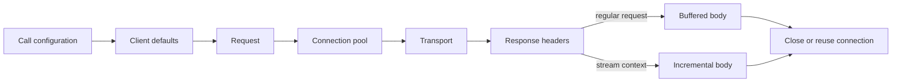

<TLDR>
  <TLDRCell label="what">
    HTTPX is a Python HTTP client with synchronous and asynchronous APIs. It separates request construction, connection reuse, timeouts, response decoding, and transport implementations into configurable boundaries.
  </TLDRCell>
  <TLDRCell label="when">
    Use HTTPX when you want a Requests-like interface together with async I/O, HTTP/2, phase-specific timeouts, or in-process test transports.
  </TLDRCell>
  <TLDRCell label="how">
    Reuse one `Client` or `AsyncClient` for its owner's lifetime, bound every timeout phase, check status codes, and guarantee that streaming responses close.
  </TLDRCell>
</TLDR>

## What it is and why it exists

HTTPX is a Python HTTP client library. It provides similar synchronous `Client` and asynchronous `AsyncClient` interfaces and supports HTTP/1.1; after installing the relevant optional dependency and enabling `http2=True`, it can also negotiate HTTP/2. One-shot top-level functions work for interactive probes, while sustained service access calls for a client instance.

An HTTP client does more than hand a URL to the network. It combines a base URL, query parameters, headers, and cookies; chooses a connection; performs TLS; sends the request body; reads the response body; and reports failures from distinct phases. HTTPX puts these responsibilities in request, response, client, and transport objects so applications can configure and test the boundaries explicitly.

The most important resource boundary is client lifetime. A client owns a <Term id="connection-pool">connection pool</Term>, which can reuse connections to the same origin instead of creating a new TCP and TLS session for every request. Reuse also means a client should not be recreated in a hot loop; an application, job, or service object should hold and close it at the appropriate lifetime.

The sync and async interfaces solve an execution-model problem, not a style problem. Use `Client` in ordinary synchronous functions. Use `AsyncClient` when an event loop is already running and the call chain can remain awaitable; calling a synchronous client inside `async def` still blocks the event loop.

HTTPX fits JSON API calls, service-to-service HTTP, file endpoints, and in-process tests through WSGI, ASGI, or mock transports. It does not choose authentication policy, response schemas, retry safety, or an overall deadline for the application. Those remain part of the caller's contract.

## How it works

`Client.build_request()` combines client defaults with call-specific arguments into a `Request`. The request then goes to a <Term id="transport">transport</Term>, which performs actual I/O or in-process dispatch and returns a `Response`. Convenient methods such as `.get()` and `.post()` read the response body before returning by default; `.stream()` gives the caller control of when to read it.



Client configuration and call configuration do not all use one override rule. Headers, query parameters, and cookies merge, so a client authentication header can coexist with a per-call tracing header; other scalar settings are normally overridden by their call-level values. Inspect `response.request` to see what was sent, or inspect the `Request` passed to a mock handler in tests.

A response object does not automatically turn `404` or `500` into an exception. Only `response.raise_for_status()` raises `HTTPStatusError` for a non-success status, preserving both the request and response. DNS, connection, TLS, read/write, and timeout failures follow the `RequestError` branch and usually have no HTTP response.

### Client and connection lifetime

Context managers express ownership in control flow. Leaving `with httpx.Client(...)` closes the client; leaving `async with httpx.AsyncClient(...)` awaits asynchronous closure. While a streaming response is still being read, its underlying connection cannot return to the pool for another request.

A client's `base_url`, authentication, headers, cookies, timeouts, and connection limits form a shared policy. Injecting that client into service-calling code is easier to test than creating and reconfiguring it in every function. Keep clients with incompatible authentication, cookie, or proxy boundaries separate, and never send through a client after it has closed.

`Limits` controls all active connections separately from idle keep-alive connections. When the connection limit is exhausted, another request waits for a pool slot; waiting past the pool timeout raises `PoolTimeout`. Concurrency, connection limits, and upstream capacity must therefore be designed together, because adding coroutines alone does not create throughput.

### Four timeout phases

HTTPX's default timeout describes network inactivity, not an overall wall-clock <Term id="deadline">deadline</Term>. `Timeout` divides waiting into `connect`, `read`, `write`, and `pool` phases. A response can keep delivering small chunks without ever reaching the read timeout while still exceeding the caller's total allowed duration.

| Phase | Wait it bounds | Typical exception |
| --- | --- | --- |
| `connect` | Opening the socket and completing connection work | `ConnectTimeout` |
| `read` | Receiving the next chunk of response data | `ReadTimeout` |
| `write` | Sending the next chunk of request data | `WriteTimeout` |
| `pool` | Acquiring an available connection from the pool | `PoolTimeout` |

Passing a float configures the timeout phases; it does not create an end-to-end countdown. An async application that needs a total budget can wrap HTTPX calls in `asyncio.timeout()` and keep phase timeouts within the remaining budget. Retries must share the same total budget, or each attempt receives a fresh full wait.

### Sync, async, and cancellation

`AsyncClient` yields the event loop while its async transport waits for the network. Multiple tasks may share one client, but sharing does not mean unlimited concurrency: connection limits still exert <Term id="backpressure">backpressure</Term>. Structured-concurrency tools can make a scope wait for all child tasks and cancel peers when one task fails.

Cancellation is a local control signal, not a remote transaction rollback. By the time the client stops waiting, the server may have received the request or even committed a mutation. Reads are often straightforward to retry; a side-effecting request needs a verifiable <Term id="idempotency">idempotency</Term> protocol before an unknown outcome can be retried safely.

## Examples

All four examples use `MockTransport`, so their output does not depend on a public test service or network timing. They build from request composition through error boundaries and async concurrency to streaming cleanup.

The example URLs use the reserved `.test` domain, and the mock transport sends no network traffic to them. Every output comes from a local run of its corresponding file.

### Combining client defaults with one request

The client stores a base URL, common header, and timeout, while the call supplies only a resource path and its query parameter. The mock handler sees the final `Request`, so the output proves the actual merge result.

<Depth level="quick">

```python run title="client_basics.py"
import httpx


def app(request: httpx.Request) -> httpx.Response:
    return httpx.Response(
        200,
        json={
            "path": request.url.path,
            "expand": request.url.params.get("expand"),
            "request_id": request.headers["x-request-id"],
        },
    )


transport = httpx.MockTransport(app)
with httpx.Client(
    base_url="https://inventory.test/v1/",
    headers={"X-Request-ID": "req-1042"},
    timeout=5.0,
    transport=transport,
) as client:
    response = client.get("orders/7", params={"expand": "items"})
    response.raise_for_status()
    print(response.request.url)
    print(response.json())
```

```text
https://inventory.test/v1/orders/7?expand=items
{'path': '/v1/orders/7', 'expand': 'items', 'request_id': 'req-1042'}
```

<TryToBreak items={['change the path to `/orders/7` and observe the base path', 'override `X-Request-ID` on the individual request', 'return `503` from the handler but temporarily remove `raise_for_status()`']} />

</Depth>

The base URL ends in `/` and the resource path does not start with `/`, so the result retains `/v1/`. This is URI-reference resolution, not simple string concatenation. A team should test base URLs with path prefixes so generated code does not accidentally jump back to the site root.

The client header and per-call query parameter both appear in the final request. `response.request.url` is more reliable than reconstructing it mentally and is useful for recording sanitized target information in failure logs.

### Separating HTTP status from transport failure

The first request receives a complete `404` response, while the second fails during reading. They require separate exception branches because only the first has a response body and server status to inspect.

```python run title="error_boundaries.py"
import httpx


def app(request: httpx.Request) -> httpx.Response:
    if request.url.path == "/slow":
        raise httpx.ReadTimeout("upstream stopped sending", request=request)
    return httpx.Response(404, json={"error": "order not found"})


with httpx.Client(transport=httpx.MockTransport(app)) as client:
    for path in ("/missing", "/slow"):
        try:
            response = client.get(f"https://orders.test{path}")
            response.raise_for_status()
        except httpx.HTTPStatusError as exc:
            print("status", exc.response.status_code, exc.response.json()["error"])
        except httpx.RequestError as exc:
            print("transport", type(exc).__name__, exc.request.url.path)
```

```text
status 404 order not found
transport ReadTimeout /slow
```

When catching `HTTPStatusError`, code can branch on the status and a trusted error schema. When catching `RequestError`, it must not assume that `exc.response` exists. Logs should retain at least the exception type, method, sanitized URL, and attempt number.

Catching the broad `HTTPError` can suit top-level recording, but it easily erases distinctions needed by a retry policy. Business logic usually needs to separate an explicit server rejection, a connection that never opened, and an unknown outcome after sending.

### Reading concurrently with one async client

Three tasks share one `AsyncClient`, and the handler uses different delays to simulate responses. Completion order follows response timing, while the result list is read in task-creation order.

```python run title="concurrent_orders.py"
import asyncio

import httpx


events: list[str] = []


async def app(request: httpx.Request) -> httpx.Response:
    order_id = int(request.url.path.rsplit("/", 1)[1])
    events.append(f"start-{order_id}")
    await asyncio.sleep({1: 0.03, 2: 0.01, 3: 0.02}[order_id])
    events.append(f"done-{order_id}")
    return httpx.Response(200, json={"id": order_id})


async def fetch(client: httpx.AsyncClient, order_id: int) -> int:
    response = await client.get(f"/orders/{order_id}")
    response.raise_for_status()
    return response.json()["id"]


async def main() -> None:
    async with httpx.AsyncClient(
        base_url="https://orders.test",
        transport=httpx.MockTransport(app),
    ) as client:
        async with asyncio.TaskGroup() as group:
            tasks = [group.create_task(fetch(client, order_id)) for order_id in (1, 2, 3)]

    print("events:", " ".join(events))
    print("results:", [task.result() for task in tasks])


asyncio.run(main())
```

```text
events: start-1 start-2 start-3 done-2 done-3 done-1
results: [1, 2, 3]
```

`TaskGroup` waits for its tasks before leaving the scope. `fetch()` checks the status inside each task, so a non-success response fails that task and cancels peers still running; the caller receives an exception group rather than a result list mixed with exception objects.

Real programs must also bound the amount of input. Even if the pool makes excess requests wait, creating hundreds of thousands of tasks still consumes memory and moves queuing from an explicit work queue into the event loop.

### Streaming and releasing a response

The custom byte stream records whether it was closed. `client.stream()` obtains the response headers first and lets the caller consume the body incrementally; after the inner context exits, both the response and transport stream are closed.

```python run title="stream_report.py"
import httpx


class ReportStream(httpx.SyncByteStream):
    def __init__(self) -> None:
        self.closed = False

    def __iter__(self):
        yield b"alpha\n"
        yield b"beta\n"

    def close(self) -> None:
        self.closed = True


body = ReportStream()


def app(request: httpx.Request) -> httpx.Response:
    return httpx.Response(200, stream=body)


with httpx.Client(transport=httpx.MockTransport(app)) as client:
    with client.stream("GET", "https://reports.test/latest") as response:
        response.raise_for_status()
        rows = [chunk.decode().strip() for chunk in response.iter_raw()]
        print(rows)

    print("closed:", response.is_closed, body.closed)
```

```text
['alpha', 'beta']
closed: True True
```

`iter_raw()` returns chunks before content decoding. Ordinary downloads normally use `iter_bytes()`, while line-based text protocols can use `iter_lines()`. Network chunks are not business-record boundaries, so do not assume each chunk is exactly one line or JSON object.

Even if only the first few chunks are needed, the context must still exit. When using `client.send(request, stream=True)` manually, no stream context provides the safety net; every return, exception, and cancellation path must call `response.close()` or asynchronous `response.aclose()`.

## Pitfalls

### Creating clients in a loop or request handler

> [!PITFALL]
> Creating a new `Client` or `AsyncClient` for every call shortens the connection pool's life to one request. Generated code particularly often puts `AsyncClient()` inside a coroutine that handles one record, then creates many clients concurrently without reusing connections.

**Fix:** identify the owner, create the client once for that owner's lifetime, and pass it through a parameter or application state. Use a context manager or framework startup and shutdown hooks so process exit and test cleanup close it.

### Treating five seconds as a total deadline

> [!PITFALL]
> HTTPX's default five-second rule concerns network inactivity; it does not guarantee that a full download or several retries finish within five seconds. A server that keeps returning slow chunks can continually refresh the read timeout.

**Fix:** configure connection, read, write, and pool timeouts, then establish one caller-owned deadline across all attempts. Tests should cover slow chunks, pool saturation, and a pause after response headers.

### Forgetting to check non-success status

> [!PITFALL]
> `client.get()` still returns a `Response` when it receives `500`. If generated code immediately calls `.json()` and reads the success schema, the protocol error becomes a `KeyError`, a wrong default, or bad cached data.

**Fix:** validate the allowed status and media type before parsing the corresponding response schema. `raise_for_status()` works when every non-success status should fail; if `404` or `409` is a domain branch, handle it explicitly and keep exhaustive tests.

### Leaking a streaming response

> [!PITFALL]
> An early return, parse exception, or task cancellation can bypass a handwritten close call and keep the connection occupied. The failure often appears only after concurrency rises and the pool is exhausted, as a `PoolTimeout`.

**Fix:** prefer the synchronous or asynchronous `.stream()` context. If manual streaming is required, bind cleanup to `finally`, an async context manager, or the framework's background cleanup facility, and test cancellation after partial consumption.

### Retrying writes unconditionally

> [!PITFALL]
> A `ReadTimeout` only says that the client did not receive the next data chunk in time; it does not prove the server skipped the request. Blindly retrying `POST` can create duplicate orders, charges, or messages.

**Fix:** classify operations by HTTP semantics and business effects, then retry only those proved safe. Side effects need a caller-stable idempotency key, atomic server deduplication, a request fingerprint, and a stored result, while every attempt shares bounded backoff and one overall deadline.

### Equating concurrency with throughput

> [!PITFALL]
> More coroutines do not remove connection limits, upstream rate limits, or server capacity. Unbounded fan-out only adds queues, memory, and cancellation cost and may trigger `429` responses.

**Fix:** bound pending work, active tasks, and connections together, and respect `Retry-After` according to the upstream contract. Measure queue time and errors under a real load; without data, do not claim HTTP/2 or a larger pool is necessarily faster.

<Depth level="deep">

## Transport boundaries, pool capacity, and retry budgets

### The transport is a replaceable I/O boundary

A transport accepts a constructed `Request` and returns a `Response`. The default HTTP transport accesses the network, `WSGITransport` and `ASGITransport` can invoke an application directly, and `MockTransport` passes the request to a handler. Replacing the transport does not change the client's request merging, cookies, or status-checking interface, making it a narrow boundary for protocol tests.

Mock tests work for asserting methods, URLs, headers, and bodies and for simulating deterministic statuses or `RequestError` instances. They cannot prove DNS, TLS, proxies, real flow control, or server deployment configuration. Keep at least one integration layer against the deployed boundary while making most failure branches fast and deterministic in process.

A custom transport that implements `handle_request()` must return a response with a synchronous byte stream; the asynchronous counterpart uses `handle_async_request()` and an async byte stream. Unless a mock handler cannot express the requirement, do not duplicate low-level transport behavior merely for a test.

### Pool waiting is a failure phase

The pool manages reusable connections by origin, but the whole client shares its capacity policy. `max_connections` limits active connections, `max_keepalive_connections` limits idle connections retained for reuse, and `keepalive_expiry` limits how long idle connections remain. Suitable values depend on the concurrency model, upstream limits, and intermediaries; they cannot be inferred from sample constants.

When all connections are occupied, new requests wait for a pool slot under the `pool` timeout. An unclosed streaming response keeps occupying its slot, so the cause of `PoolTimeout` may be an ownership leak or slow downstream consumer rather than a pool that is too small. Diagnose active tasks, pool waits, response-consumption duration, and cancellation paths together.

HTTP/2 allows one connection to carry concurrent streams, but it does not remove application capacity limits or guarantee that a server accepts unlimited streams. Negotiation, proxy behavior, and workload all affect the result. Compare HTTP/1.1 and HTTP/2 throughput and latency only with reproducible measurements in the target environment.

### Retry decisions start with outcome uncertainty

`HTTPTransport(retries=n)` handles only some connection-phase failures, such as connection errors and connection timeouts. It is not a general retry facility for statuses, read failures, and backoff. Retrying `503`, `429`, or a read failure requires an explicit application policy or a configured retry library.

An exception class alone cannot decide a retry. Before a connection opens, the request normally has not reached the server; after a write or read failure, whether the server performed the side effect may be unknown. Even when GET is usually safe, consider whether the body is replayable, authentication remains valid, and enough deadline remains.

The idempotency key for a side effect must stay the same across every attempt. The server must atomically record the key, a normalized request fingerprint, and the final result; it must reject the same key with different request content and define record retention. Adding a fixed header on the client alone does not create idempotency.

| Decision | Question that must be answered |
| --- | --- |
| Send again | Is the operation safe or protected by a server idempotency protocol? |
| Wait how long | How do backoff, `Retry-After`, and the remaining deadline combine? |
| How many attempts | Do the application, HTTP transport, proxy, and queue multiply retries? |
| How to observe | Are attempt number, final result, and a sanitized idempotency-key identifier recorded? |

### A response body is a resource

A non-streaming request reads its body before returning, so its connection can normally close or return to the pool. A streaming request delegates body consumption to the caller, transferring responsibility for returning the connection as well. Code that returns after inspecting only the headers is most likely to miss that ownership transfer.

Chunk boundaries come from the transport and do not promise to align with UTF-8 characters, text lines, or JSON objects. `iter_bytes()` yields content-decoded bytes, `iter_text()` performs incremental text decoding, `iter_lines()` splits lines, and `iter_raw()` preserves bytes before content decoding. Choose the iterator from the consumer protocol, not from one observed chunk size.

Backpressure requires consumption speed to feed back into read speed. Collecting every chunk into a list before handing it downstream does not provide a streaming memory bound. A true streaming pipeline validates incrementally, caps cumulative size, writes to a controlled target, and cancels and closes the upstream response when the downstream stops.

</Depth>

<Checkpoint id="backend/httpx" />

## Further reading

- [HTTPX QuickStart](https://www.python-httpx.org/)
- [HTTPX Clients](https://www.python-httpx.org/advanced/clients/)
- [HTTPX Timeouts](https://www.python-httpx.org/advanced/timeouts/)
- [HTTPX Async Support](https://www.python-httpx.org/async/)
- [HTTPX Exceptions](https://www.python-httpx.org/exceptions/)
- [HTTPX Transports](https://www.python-httpx.org/advanced/transports/)
