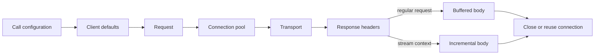

<TLDR>
  <TLDRCell label="what">
    HTTPX 是同时提供同步与异步 API 的 Python HTTP 客户端。它把请求构造、连接复用、超时、响应解码与传输实现分成可配置的边界。
  </TLDRCell>
  <TLDRCell label="when">
    需要类似 Requests 的接口，同时又要异步 I/O、HTTP/2、细分超时或进程内测试传输时，适合使用 HTTPX。
  </TLDRCell>
  <TLDRCell label="how">
    在所有者的生命周期内复用一个 `Client` 或 `AsyncClient`，为每个超时阶段设定边界，检查状态码，并确保流式响应一定关闭。
  </TLDRCell>
</TLDR>

## 是什么，为什么存在

HTTPX 是一个 Python HTTP 客户端库。它提供相近的同步 `Client` 与异步 `AsyncClient` 接口，并支持 HTTP/1.1；安装相应可选依赖并启用 `http2=True` 后，也可以协商 HTTP/2。一次性顶层函数适合交互式探查，持续访问服务时则应使用客户端实例。

HTTP 客户端不只是把 URL 交给网络。它还要组合基础 URL、查询参数、请求头与 Cookie，选择连接，执行 TLS，发送请求体，读取响应体，并把不同阶段的失败报告给调用方。HTTPX 把这些职责放进请求、响应、客户端与传输对象，让应用可以明确配置和测试边界。

最重要的资源边界是客户端生命周期。一个客户端拥有一个 <Term id="connection-pool">连接池（connection pool）</Term>，可以为同一源站复用连接，避免每次请求都重新建立 TCP 与 TLS 会话。复用也意味着客户端不应在热循环中反复创建，而应由应用、任务或服务对象在适当的生命周期内持有并关闭。

同步与异步接口解决的是执行模型问题，而不是 API 风格问题。普通同步函数使用 `Client`；已经运行在事件循环中，并且调用链可以持续 `await` 时，使用 `AsyncClient`。在 `async def` 中调用同步客户端仍会阻塞事件循环，仅把函数声明改为异步不会改变底层 I/O。

HTTPX 适合调用 JSON API、服务间 HTTP 接口、文件端点，以及通过 WSGI、ASGI 或 Mock 传输进行进程内测试。它不会替应用决定认证策略、响应模式、重试安全性或总时限；这些仍属于调用方的契约。

## 工作原理

`Client.build_request()` 把客户端级默认值与调用级参数合成为 `Request`。请求随后交给 <Term id="transport">传输（transport）</Term>，传输负责实际 I/O 或进程内分派，并返回 `Response`。普通 `.get()`、`.post()` 等便捷方法默认先读完响应体；`.stream()` 则把读取时机交给调用方。



客户端配置与调用配置并非都采用同一种覆盖规则。请求头、查询参数和 Cookie 会合并，因此客户端认证头可以与单次请求的追踪头共存；其余单值配置通常由调用级值覆盖。要检查最终发送内容，可以查看 `response.request`，测试时则可直接检查传给 Mock 处理器的 `Request`。

响应对象不会自动把 `404` 或 `500` 变成异常。只有调用 `response.raise_for_status()` 才会根据非成功状态抛出 `HTTPStatusError`，其中同时保留请求与响应。DNS、连接、TLS、读写和超时问题走 `RequestError` 分支，通常没有可用的 HTTP 响应。

### 客户端与连接的生命周期

上下文管理器把所有权写进控制流。退出 `with httpx.Client(...)` 会关闭客户端；退出 `async with httpx.AsyncClient(...)` 会等待异步关闭。只要流式响应仍在读取，底层连接就不能回到池中供其他请求复用。

一个客户端的 `base_url`、认证、请求头、Cookie、超时和连接限制形成共享策略。把客户端注入调用服务的代码，比在每个函数中重新创建并重复配置更容易测试。认证、Cookie 或代理边界不兼容的客户端应保持分离，客户端关闭后也不能继续发送请求。

`Limits` 分别限制所有活动连接和保活连接。连接数耗尽时，请求先等待池中名额；等待超过池超时会抛出 `PoolTimeout`。因此并发任务数、连接上限和上游容量需要一起设计，仅增加协程数量不会增加可用吞吐。

### 四种超时

HTTPX 默认超时描述的是网络不活动，而不是整个操作从开始到结束的墙钟 <Term id="deadline">截止时间（deadline）</Term>。`Timeout` 把等待拆成 `connect`、`read`、`write` 和 `pool` 四个阶段。一个响应可以持续收到小块数据而从不触发读超时，却仍然超过调用方允许的总时长。

| 阶段 | 约束的等待 | 常见异常 |
| --- | --- | --- |
| `connect` | 建立套接字与完成连接所需操作 | `ConnectTimeout` |
| `read` | 收到下一块响应数据 | `ReadTimeout` |
| `write` | 发出下一块请求数据 | `WriteTimeout` |
| `pool` | 从连接池取得可用连接 | `PoolTimeout` |

传入一个浮点数会配置各阶段的超时，并不会创建全程倒计时。异步应用若需要总预算，可以在 HTTPX 调用外层使用 `asyncio.timeout()`，并把 HTTPX 的阶段超时设得不超过剩余预算。重试也必须共享同一总预算，否则每次尝试都会重新获得完整等待时间。

### 同步、异步与取消

`AsyncClient` 通过异步传输在等待网络时让出事件循环。它允许多个任务共享同一客户端，但共享不代表无限并发；连接池限制仍会施加 <Term id="backpressure">背压（backpressure）</Term>。结构化并发工具可以让一个作用域等待所有子任务，并在某个任务失败时取消同组任务。

取消是本地控制信号，不是远端事务回滚。客户端停止等待时，服务端可能已经收到请求，甚至已经提交修改。读取操作往往容易重试；具有副作用的请求必须先具备可验证的 <Term id="idempotency">幂等性（idempotency）</Term> 协议，才能把未知结果变成安全重试。

## 示例

以下四个示例都使用 `MockTransport`，因此执行结果不依赖公共测试服务或网络时序。它们依次展示请求合成、错误边界、异步并发和流式清理。

示例 URL 使用保留的 `.test` 域名，Mock 传输不会为它们发送网络数据。每个输出都来自对应文件的本地执行。

### 合成客户端默认值与单次请求

客户端保存基础 URL、公共请求头和超时，调用只提供资源路径与本次查询参数。Mock 处理器观察的是最终 `Request`，所以输出证明了真实的合并结果。

<Depth level="quick">

```python run title="client_basics.py"
import httpx


def app(request: httpx.Request) -> httpx.Response:
    return httpx.Response(
        200,
        json={
            "path": request.url.path,
            "expand": request.url.params.get("expand"),
            "request_id": request.headers["x-request-id"],
        },
    )


transport = httpx.MockTransport(app)
with httpx.Client(
    base_url="https://inventory.test/v1/",
    headers={"X-Request-ID": "req-1042"},
    timeout=5.0,
    transport=transport,
) as client:
    response = client.get("orders/7", params={"expand": "items"})
    response.raise_for_status()
    print(response.request.url)
    print(response.json())
```

```text
https://inventory.test/v1/orders/7?expand=items
{'path': '/v1/orders/7', 'expand': 'items', 'request_id': 'req-1042'}
```

<TryToBreak items={['把路径改为 `/orders/7`，观察基础路径如何变化', '在单次请求中覆盖 `X-Request-ID`', '让处理器返回 `503`，但暂时删除 `raise_for_status()`']} />

</Depth>

基础 URL 以 `/` 结尾，而资源路径不以 `/` 开头，因此结果保留 `/v1/`。这是 URI 引用解析语义，不是简单字符串拼接。团队应为带路径前缀的基础 URL 添加测试，避免生成代码无意跳回站点根路径。

客户端级请求头与调用级查询参数同时出现在最终请求中。`response.request.url` 比手工推断更可靠，也适合在失败日志中记录经过脱敏的目标信息。

### 区分 HTTP 状态与传输故障

第一个请求收到了完整的 `404` 响应，第二个请求则在读取期间失败。两者需要不同的异常分支，因为只有前者能够读取响应体与服务端状态。

```python run title="error_boundaries.py"
import httpx


def app(request: httpx.Request) -> httpx.Response:
    if request.url.path == "/slow":
        raise httpx.ReadTimeout("upstream stopped sending", request=request)
    return httpx.Response(404, json={"error": "order not found"})


with httpx.Client(transport=httpx.MockTransport(app)) as client:
    for path in ("/missing", "/slow"):
        try:
            response = client.get(f"https://orders.test{path}")
            response.raise_for_status()
        except httpx.HTTPStatusError as exc:
            print("status", exc.response.status_code, exc.response.json()["error"])
        except httpx.RequestError as exc:
            print("transport", type(exc).__name__, exc.request.url.path)
```

```text
status 404 order not found
transport ReadTimeout /slow
```

捕获 `HTTPStatusError` 时，可以按状态码与受信任的错误模式处理响应。捕获 `RequestError` 时，不应假定 `exc.response` 存在；日志至少要保留异常类型、HTTP 方法、经过脱敏的 URL 与尝试次数。

宽泛捕获 `HTTPError` 适合在最外层统一记录，但容易抹平重试策略需要的差异。业务层通常需要区分服务器明确拒绝、连接未建立，以及发送后结果未知这几种状态。

### 用一个异步客户端并发读取

三个任务共享一个 `AsyncClient`，处理器用不同延迟模拟响应。完成顺序由响应时机决定，结果列表则按创建任务的顺序读取。

```python run title="concurrent_orders.py"
import asyncio

import httpx


events: list[str] = []


async def app(request: httpx.Request) -> httpx.Response:
    order_id = int(request.url.path.rsplit("/", 1)[1])
    events.append(f"start-{order_id}")
    await asyncio.sleep({1: 0.03, 2: 0.01, 3: 0.02}[order_id])
    events.append(f"done-{order_id}")
    return httpx.Response(200, json={"id": order_id})


async def fetch(client: httpx.AsyncClient, order_id: int) -> int:
    response = await client.get(f"/orders/{order_id}")
    response.raise_for_status()
    return response.json()["id"]


async def main() -> None:
    async with httpx.AsyncClient(
        base_url="https://orders.test",
        transport=httpx.MockTransport(app),
    ) as client:
        async with asyncio.TaskGroup() as group:
            tasks = [group.create_task(fetch(client, order_id)) for order_id in (1, 2, 3)]

    print("events:", " ".join(events))
    print("results:", [task.result() for task in tasks])


asyncio.run(main())
```

```text
events: start-1 start-2 start-3 done-2 done-3 done-1
results: [1, 2, 3]
```

`TaskGroup` 离开作用域前会等待组内任务。`fetch()` 在任务内部检查状态码，因此某个非成功响应会使任务失败并取消仍在运行的同组任务；调用方会收到异常组，而不是一个混入异常对象的结果列表。

真实程序还要限制输入数量。即使连接池会让多余请求等待，一次创建数十万个任务仍会占用内存，并把排队位置从明确的工作队列转移到事件循环内部。

### 流式读取并释放响应

自定义字节流记录自己是否被关闭。`client.stream()` 只先取得响应头，调用方逐块消费正文；退出内层上下文后，响应与传输流都处于关闭状态。

```python run title="stream_report.py"
import httpx


class ReportStream(httpx.SyncByteStream):
    def __init__(self) -> None:
        self.closed = False

    def __iter__(self):
        yield b"alpha\n"
        yield b"beta\n"

    def close(self) -> None:
        self.closed = True


body = ReportStream()


def app(request: httpx.Request) -> httpx.Response:
    return httpx.Response(200, stream=body)


with httpx.Client(transport=httpx.MockTransport(app)) as client:
    with client.stream("GET", "https://reports.test/latest") as response:
        response.raise_for_status()
        rows = [chunk.decode().strip() for chunk in response.iter_raw()]
        print(rows)

    print("closed:", response.is_closed, body.closed)
```

```text
['alpha', 'beta']
closed: True True
```

`iter_raw()` 返回尚未经过内容解码的字节块；常规下载通常使用 `iter_bytes()`，文本行协议可以使用 `iter_lines()`。网络分块不对应业务记录边界，所以不要假设每个块正好是一行或一个 JSON 对象。

若只需要前几块，也必须退出上下文。手工使用 `client.send(request, stream=True)` 时，上下文管理器不再替你兜底，所有返回、异常与取消路径都要调用 `response.close()` 或异步的 `response.aclose()`。

## 陷阱

### 在循环或请求处理器中创建客户端

> [!PITFALL]
> 每次调用都新建 `Client` 或 `AsyncClient`，会把连接池缩短为一次请求的寿命。生成代码尤其常把 `AsyncClient()` 放进处理单条记录的协程，然后并发创建许多互不复用连接的客户端。

**修复：**先确定所有者，再在该所有者的生命周期内创建一次客户端，并通过参数或应用状态传入。使用上下文管理器或框架的启动与关闭钩子，确保进程结束和测试清理时关闭客户端。

### 把五秒超时当成总时限

> [!PITFALL]
> HTTPX 的默认五秒规则针对网络不活动，不保证整个下载或多次重试在五秒内结束。持续缓慢返回数据的服务器可以不断刷新读超时。

**修复：**分别配置连接、读取、写入和连接池超时，再由调用方建立覆盖所有尝试的总截止时间。测试应包含缓慢分块、连接池饱和和在响应头之后停顿的情况。

### 忘记检查非成功状态

> [!PITFALL]
> `client.get()` 收到 `500` 时仍会正常返回 `Response`。如果生成代码立即调用 `.json()` 并按成功模式读取字段，真正的协议错误会变成 `KeyError`、错误默认值或错误缓存内容。

**修复：**先验证允许的状态与媒体类型，再解析对应响应模式。`raise_for_status()` 适合统一拒绝非成功状态；若 `404` 或 `409` 是领域分支，则显式处理并保留穷尽测试。

### 未关闭流式响应

> [!PITFALL]
> 提前返回、解析异常或任务取消可能绕过手写的关闭语句，让连接一直被占用。故障通常只在并发增加、连接池耗尽后表现为 `PoolTimeout`。

**修复：**优先使用 `.stream()` 的同步或异步上下文。必须采用手工流模式时，把关闭动作绑定到 `finally`、异步上下文管理器或框架的后台清理机制，并测试消费一部分后取消的路径。

### 无条件重试写请求

> [!PITFALL]
> `ReadTimeout` 只说明客户端没有及时读到下一块数据，不证明服务器没有执行请求。对 `POST` 盲目重试可能创建重复订单、扣款或消息。

**修复：**先按 HTTP 方法和业务效果分类，再只重试已证明安全的操作。副作用请求需要调用方稳定生成的幂等键、服务端原子去重、请求指纹与已保存结果，并且所有尝试共享有界退避和总截止时间。

### 把并发数等同于吞吐量

> [!PITFALL]
> 创建更多协程不能消除连接上限、上游速率限制或服务端容量。无界扇出只会增加排队、内存和取消成本，还可能触发 `429`。

**修复：**同时限制待处理工作、活动任务与连接数，并根据上游契约处理 `Retry-After`。用实际负载测量排队时间和错误率；没有数据时不要声称 HTTP/2 或更大连接池必然更快。

## AI 时代

**生成代码在这里容易出错的地方**

模型经常在每个 FastAPI 请求或每次循环迭代中创建 `AsyncClient`，使连接池无法复用；也会把 `timeout=5.0` 描述为完整五秒截止时间。另一类错误是先 `.json()` 后检查状态，或在 `stream=True` 的早退与取消路径忘记 `aclose()`。生成的重试包装器还常对所有方法重试，并叠加 SDK、代理与任务队列的重试次数，却没有幂等键和共享预算。

**要求 AI 检查**

- 列出每个 `Client` 与 `AsyncClient` 的创建者、共享范围、关闭路径，以及是否在热循环中创建。
- 沿连接池、连接、写入、读取和整体截止时间画出超时预算，并计算嵌套重试的最大尝试次数。
- 对每个流式调用和每个副作用请求，逐条追踪成功、状态错误、传输错误与取消路径。

**审查清单**

- 确认异步调用链没有同步 HTTP 客户端，并且并发数与连接限制都有明确上界。
- 确认解析正文前处理状态码与媒体类型，异常日志不会泄露令牌、Cookie 或敏感查询参数。
- 确认流始终关闭；只有具备幂等语义、退避、尝试上限和总截止时间的操作才会重试。

**提示词汇**

使用精确术语 `client lifetime`（客户端生命周期）、`connection pooling`（连接池复用）、`transport error`（传输错误）、`phase timeout`（分阶段超时）、`overall deadline`（整体截止时间）、`streaming response cleanup`（流式响应清理）、`bounded concurrency`（有界并发）和 `idempotency key`（幂等键）。要求模型提交资源所有权表、失败状态矩阵和重试预算，而不要只说「添加错误处理」。

<Depth level="deep">

## 传输边界、池容量与重试预算

### 传输是可替换的 I/O 边界

传输接收已经构造好的 `Request`，返回 `Response`。默认 HTTP 传输访问网络，`WSGITransport` 与 `ASGITransport` 可以直接调用应用，`MockTransport` 则把请求交给处理函数。替换传输不会改变客户端的请求合并、Cookie 或状态检查接口，因此它是测试协议行为的窄边界。

Mock 测试适合断言方法、URL、请求头、请求体，以及模拟确定的状态或 `RequestError`。它不能证明 DNS、TLS、代理、真实流控或服务器部署配置正确。至少保留一层针对真实部署边界的集成检查，同时让大多数故障分支在进程内保持快速与确定。

自定义传输若覆盖 `handle_request()`，同步版本必须返回带同步字节流的响应；异步版本对应 `handle_async_request()` 与异步字节流。除非 Mock 处理器不足以表达需求，否则不要仅为测试复制底层传输实现。

### 池等待也是失败阶段

连接池会按源站管理可复用连接，但容量策略由客户端整体共享。`max_connections` 限制同时活动的连接，`max_keepalive_connections` 限制保留供复用的空闲连接，`keepalive_expiry` 限制空闲连接的保留时间。合适的值取决于并发模型、上游限制和中间代理，不能从示例常量推导。

当所有连接都被占用时，新请求等待池名额，并受 `pool` 超时约束。一个未关闭的流式响应会持续占用名额，因此 `PoolTimeout` 的根因可能不是池太小，而是所有权泄漏或下游消费过慢。排查时应同时记录活动任务、池等待、响应消费时长和取消路径。

HTTP/2 允许一条连接承载多个并发流，但不会取消应用级容量限制，也不保证服务器接受无限流。协议协商、代理行为与工作负载都会影响结果。只有在目标环境进行可复现实测后，才能比较 HTTP/1.1 与 HTTP/2 的吞吐和延迟。

### 重试从结果不确定性开始

`HTTPTransport(retries=n)` 只处理连接阶段的部分失败，例如连接错误与连接超时；它不是覆盖状态码、读取故障和退避策略的通用重试器。若要按 `503`、`429` 或读取失败重试，应用需要明确的策略或经过配置的重试库。

重试判断不能只看异常类。连接尚未建立时，请求通常未到达服务端；写入或读取阶段失败时，服务端是否执行副作用可能未知。即便 GET 通常安全，也要考虑请求体是否可重放、认证是否仍有效，以及剩余截止时间是否足够。

副作用操作的幂等键必须在所有尝试之间保持相同。服务端要原子记录该键、规范化请求的指纹和最终结果，并拒绝同一键搭配不同请求内容；记录还需要明确保留期限。只在客户端加一个固定请求头并不能产生幂等性。

| 决策 | 必须回答的问题 |
| --- | --- |
| 是否再次发送 | 操作是否安全或有服务端幂等协议 |
| 等待多久 | 退避、`Retry-After` 与剩余截止时间如何组合 |
| 最多几次 | 应用、HTTP 传输、代理和队列是否叠加重试 |
| 如何观察 | 是否记录尝试编号、最终结果与幂等键的脱敏标识 |

### 响应正文是一种资源

非流式请求会在返回前读完正文，因此连接通常已经可关闭或复用。流式请求把正文消费交给调用方，连接的归还也随之成为调用方职责。处理器只读响应头便返回时，最容易遗漏这条所有权转移。

分块边界来自传输，并不承诺对应 UTF-8 字符、文本行或 JSON 对象边界。`iter_bytes()` 负责内容解码后的字节，`iter_text()` 负责增量文本解码，`iter_lines()` 负责行切分，`iter_raw()` 则保留未经内容解码的字节。选择迭代器应由消费协议决定，而不是由一次观察到的块大小决定。

背压要求消费速度能反馈到读取速度。把所有块先收集进列表，再交给下游，并没有获得流式处理的内存边界。真正的流式管道应逐块验证、限制累计大小、写入受控目标，并在下游停止时取消和关闭上游响应。

</Depth>

<Checkpoint id="backend/httpx" />

## 延伸阅读

- [HTTPX QuickStart](https://www.python-httpx.org/)
- [HTTPX Clients](https://www.python-httpx.org/advanced/clients/)
- [HTTPX Timeouts](https://www.python-httpx.org/advanced/timeouts/)
- [HTTPX Async Support](https://www.python-httpx.org/async/)
- [HTTPX Exceptions](https://www.python-httpx.org/exceptions/)
- [HTTPX Transports](https://www.python-httpx.org/advanced/transports/)
