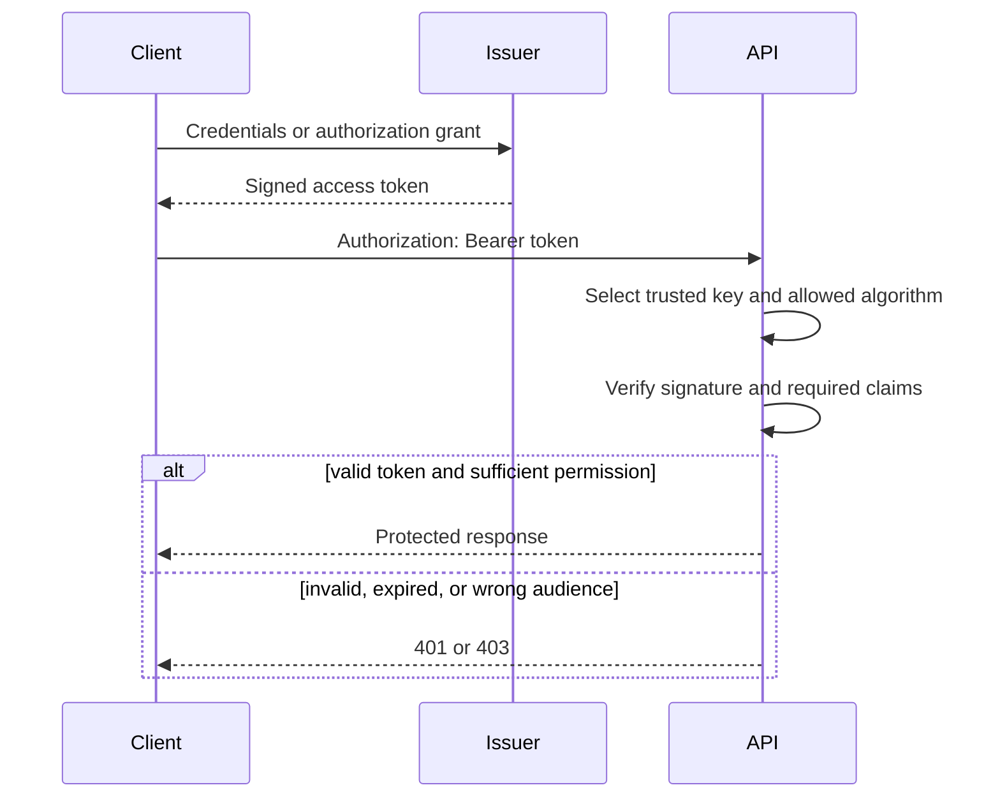

<TLDR>
  <TLDRCell label="what">
    A <Term id="json-web-token">JSON Web Token (JWT)</Term> is a compact claim container; identity systems commonly sign one and use it as an access token.
  </TLDRCell>
  <TLDRCell label="trap">
    Decoding the payload or verifying the signature alone does not authenticate anyone; the verifier must also constrain the algorithm, key source, issuer, audience, time, and token purpose.
  </TLDRCell>
  <TLDRCell label="fix">
    Use a maintained JOSE library with a fixed validation policy, short-lived access tokens, and refresh tokens that support revocation and replay detection.
  </TLDRCell>
</TLDR>

## What it is and why it exists

A <Term id="json-web-token">JSON Web Token (JWT)</Term> is a compact, URL-safe format for claims represented as a JSON object. A <Term id="claim">claim</Term> is a name and value asserted about a subject: for example, `sub` identifies the subject and `iss` identifies the issuer. A JWT can be carried in a JSON Web Signature (JWS) or JSON Web Encryption (JWE) structure; authentication systems commonly use a signed JWS compact serialization.

JWT is only a token format. It is not a login protocol and does not authenticate a user by itself. A login endpoint must still validate credentials or an external identity before issuing a token. A resource server applies its own validation policy and only then establishes a request identity. OAuth 2.0, OpenID Connect, or an application's protocol defines how the token is obtained, stored, and used.

A common signed JWT has three Base64url segments separated by periods: a JOSE header, payload, and signature. The header describes the cryptographic operation, the payload carries claims, and the signature protects the first two segments against modification. Base64url is an encoding rather than encryption, so anyone holding the token can usually read its header and payload.

JWTs fit systems where the issuer and verifier are separate. A verifying service can hold a public key without receiving the private key, and it need not query a central session for every request. This property is often called “stateless,” but it is not free. Key distribution, logout, permission changes, and refresh tokens usually reintroduce state.

## How it works

A secure request has two distinct phases. During issuance, the issuer writes the confirmed identity, target API, and short validity period into claims, then signs them with a protected key. During validation, the resource server trusts nothing asserted by the token until both cryptographic verification and application policy succeed.



Validation order matters. First, constrain the token's size and structure, then parse the header. Select a key only from local configuration or metadata owned by a trusted issuer. Next, verify the signature, parse the payload, and check every required claim's type and value. Any failure must reject the request instead of continuing with a partly trusted identity.

Write an independent policy for every kind of token. At minimum, fix the allowed algorithm, trusted `iss`, this API's `aud`, required `sub`, and the time rules for `exp` and `nbf`. If one issuer produces ID tokens, access tokens, and other JWTs, use different `typ` values, audiences, claim combinations, or keys so the policies are mutually exclusive.

The registered claims below have common meanings. RFC 7519 does not require every JWT to contain them; the protocol using JWT must define which ones are required.

| Claim | Meaning | Validation action |
| --- | --- | --- |
| `iss` | Issuer | Compare exactly with a trusted issuer and bind the key to that issuer |
| `sub` | Subject | Check its type and interpret the identity within the issuer's namespace |
| `aud` | Intended recipient | Require the current API in the string or array of strings |
| `exp` | Expiration time | Require the current time to be earlier than this NumericDate |
| `nbf` | Not-before time | Reject a current time earlier than this NumericDate |
| `iat` | Issued-at time | Use for policy or audit where needed; it is not an expiration check |
| `jti` | Token identifier | Use for replay tracking or a denylist if needed; uniqueness is not automatic |

Authentication and authorization must also stay separate. A valid signature only says that an entity holding the relevant key protected these bytes and that they were not modified. Whether the user still exists, a role remains current, or this request may access this resource is an application authorization decision.

## Examples

### Decoding is not verification

The first program constructs and reads a three-segment token. Its third segment is deliberately not a valid signature. Decoding still succeeds, which is exactly why reading a payload does not establish trust.

<Depth level="quick">

```javascript run title="inspect-token.js"
const encode = (value) =>
  Buffer.from(JSON.stringify(value)).toString('base64url');

const header = { alg: 'HS256', typ: 'at+jwt' };
const payload = {
  iss: 'https://issuer.example',
  sub: 'user-42',
  aud: 'inventory-api',
  role: 'editor'
};
const fakeSignature = Buffer.from('not-a-signature').toString('base64url');
const token = `${encode(header)}.${encode(payload)}.${fakeSignature}`;

const [headerPart, payloadPart] = token.split('.');
const decodedHeader = JSON.parse(Buffer.from(headerPart, 'base64url'));
const decodedPayload = JSON.parse(Buffer.from(payloadPart, 'base64url'));

console.log(`segments: ${token.split('.').length}`);
console.log(`algorithm: ${decodedHeader.alg}`);
console.log(`subject: ${decodedPayload.sub}`);
console.log(`role: ${decodedPayload.role}`);
console.log('signature checked: no');
```

```text
segments: 3
algorithm: HS256
subject: user-42
role: editor
signature checked: no
```

</Depth>

`Buffer.from(segment, 'base64url')` merely reverses Base64url encoding. An attacker can create the same JSON and can change `role` to `admin`. Code may establish an identity from the payload only after verifying the full signature with a trusted key and checking contextual claims.

Decoding is useful in logs, error tools, and browser debuggers, but label the result as untrusted. Diagnostic tools must not present “parseable” as “valid,” and they should never write a complete bearer token to logs.

### Issuing and verifying an HS256 token

This example uses Node.js's built-in `crypto` module to expose the signing input and validation policy. It fixes the time and test key so output is repeatable. At a production boundary, use a maintained JOSE library and load keys from a key-management system.

```javascript run title="verify-token.js"
import { createHmac, timingSafeEqual } from 'node:crypto';

const secret = Buffer.from('8f'.repeat(32), 'hex');
const now = 1_800_000_000;
const encode = (value) => Buffer.from(JSON.stringify(value)).toString('base64url');
const mac = (input) => createHmac('sha256', secret).update(input).digest('base64url');

function issue(claims) {
  const header = encode({ alg: 'HS256', typ: 'at+jwt' });
  const payload = encode(claims);
  return `${header}.${payload}.${mac(`${header}.${payload}`)}`;
}

function verify(token, policy) {
  const parts = token.split('.');
  if (parts.length !== 3) throw new Error('malformed token');
  const [headerPart, payloadPart, signaturePart] = parts;
  const header = JSON.parse(Buffer.from(headerPart, 'base64url'));
  if (header.alg !== 'HS256' || header.typ !== 'at+jwt') throw new Error('wrong header');
  const actual = Buffer.from(signaturePart, 'base64url');
  const expected = Buffer.from(mac(`${headerPart}.${payloadPart}`), 'base64url');
  if (actual.length !== expected.length || !timingSafeEqual(actual, expected))
    throw new Error('bad signature');
  const claims = JSON.parse(Buffer.from(payloadPart, 'base64url'));
  const audiences = Array.isArray(claims.aud) ? claims.aud : [claims.aud];
  if (claims.iss !== policy.issuer || !audiences.includes(policy.audience))
    throw new Error('wrong issuer or audience');
  if (!Number.isFinite(claims.exp) || policy.now >= claims.exp) throw new Error('expired');
  if (Number.isFinite(claims.nbf) && policy.now < claims.nbf) throw new Error('not active');
  return claims;
}

const token = issue({ iss: 'https://issuer.example', sub: 'user-42',
  aud: 'inventory-api', iat: now, nbf: now, exp: now + 300 });
const claims = verify(token, {
  issuer: 'https://issuer.example', audience: 'inventory-api', now
});
console.log(`segments: ${token.split('.').length}`);
console.log(`subject: ${claims.sub}`);
console.log(`valid for seconds: ${claims.exp - now}`);
```

```text
segments: 3
subject: user-42
valid for seconds: 300
```

HMAC uses the same secret for signing and verification, so every verifier can also issue tokens. It suits components inside one trust boundary. When several resource servers should verify but not issue, an asymmetric algorithm lets the issuer retain the private key while verifiers receive only the public key.

The token must not choose the algorithm. A verifier can read `alg` to confirm that it equals the policy's allowed value, but it must not enable an algorithm because the token asks for it. Bind every key to one intended use and algorithm so key material for one method cannot be reused under another.

The example omits duplicate JSON-key detection, input-size limits, complete JOSE parsing, key rotation, and a clock-skew policy. These boundary cases are why production code belongs in a mature library. The library implements primitives, but the caller still must supply the issuer, audience, algorithm, and required claims explicitly.

### Pinning claim policy with failure cases

Cryptographic libraries usually let callers select which claims to verify, but the application still has to define an exact policy. This function receives claims that have already passed signature verification and tests the right context, a wrong audience, and an expired token. Keeping these rejection cases in tests prevents a refactor from silently dropping a validation option.

```javascript run title="claim-policy.js"
function enforcePolicy(claims, policy) {
  if (typeof claims.sub !== 'string' || claims.sub.length === 0)
    throw new Error('missing subject');
  const audiences = Array.isArray(claims.aud) ? claims.aud : [claims.aud];
  if (claims.iss !== policy.issuer) throw new Error('wrong issuer');
  if (!audiences.includes(policy.audience)) throw new Error('wrong audience');
  if (!Number.isFinite(claims.exp) || policy.now >= claims.exp)
    throw new Error('expired');
  return claims.sub;
}

const policy = {
  issuer: 'https://issuer.example',
  audience: 'inventory-api',
  now: 1_800_000_000
};
const base = {
  iss: policy.issuer, sub: 'user-42', aud: policy.audience, exp: policy.now + 60
};
const cases = [
  ['accepted', base],
  ['other API', { ...base, aud: 'billing-api' }],
  ['old token', { ...base, exp: policy.now }]
];

for (const [name, claims] of cases) {
  try {
    console.log(`${name}: ${enforcePolicy(claims, policy)}`);
  } catch (error) {
    console.log(`${name}: ${error.message}`);
  }
}
```

```text
accepted: user-42
other API: wrong audience
old token: expired
```

Passing `policy.now` as an input instead of reading the system clock deep inside the function makes boundary tests repeatable. A production verifier can inject a clock or use its library's clock option, but a fixed test time must never reach the real request path.

This step is still not authorization. After `sub` passes policy, it identifies an authenticated subject. The endpoint must make a separate allow-or-deny decision from the current resource, operation, and server-side permission data. Operations sensitive to permission changes should not depend only on a long-lived `role` claim.

### Rotating revocable refresh tokens

An <Term id="access-token">access token</Term> should target only its resource server and have a short lifetime. A <Term id="refresh-token">refresh token</Term> goes only to the authorization server to obtain a new access token. It need not be a JWT; an unpredictable opaque value is often easier to revoke.

This in-memory store shows the core state of a rotation family. The strings are fixed test fixtures. Real refresh tokens must come from a cryptographically secure random source, only a digest should be stored in the database, and consuming the old token plus writing the new one must happen in one atomic transaction.

```javascript run title="rotate-refresh-token.js"
import { createHash } from 'node:crypto';
const digest = (token) => createHash('sha256').update(token).digest('hex');

class RefreshTokenStore {
  #records = new Map();

  issue(family, token) {
    this.#records.set(digest(token), { family, active: true });
  }

  rotate(oldToken, newToken) {
    const record = this.#records.get(digest(oldToken));
    if (!record || !record.active) {
      if (record) this.revokeFamily(record.family);
      throw new Error('refresh token reuse detected');
    }
    record.active = false;
    this.issue(record.family, newToken);
  }

  revokeFamily(family) {
    for (const record of this.#records.values()) {
      if (record.family === family) record.active = false;
    }
  }
  isActive(token) {
    return this.#records.get(digest(token))?.active === true;
  }
}

const store = new RefreshTokenStore();
store.issue('grant-7', 'fixture-token-a');
store.rotate('fixture-token-a', 'fixture-token-b');
console.log(`rotated: ${store.isActive('fixture-token-b')}`);
try {
  store.rotate('fixture-token-a', 'attacker-token');
} catch (error) {
  console.log(`replay: ${error.message}`);
}
console.log(`family active: ${store.isActive('fixture-token-b')}`);
```

```text
rotated: true
replay: refresh token reuse detected
family active: false
```

Once rotation succeeds, seeing the old value again means one side holding the old or new value may be compromised. The server cannot tell which caller is the attacker from replay alone, so it revokes the whole family and requires a new authorization. Keep the old digest and family relationship until the replay-detection window closes; deleting the old record immediately loses the evidence.

Concurrent refresh needs defined semantics. If two legitimate requests consume one refresh token at once, a naive read-delete-write flow can issue two successors or misclassify the second request as an attack. A conditional database update, row lock, or single-writer transaction must permit only one successful consumption, while the client should coalesce concurrent refresh attempts.

A refresh token extends session capability. Bind it to its client and granted scope, keep it confidential in storage and transit, and support expiration and revocation. For public OAuth clients, RFC 9700 requires sender-constrained refresh tokens or rotation that detects replay.

## Pitfalls

> [!PITFALL]
> Code decodes the payload first and puts its `sub` or `role` into the request context. Decoding proves no origin, and an attacker can rewrite every claim.

**Fix:** make one validation entry point enforce structural limits, signature verification, and claim policy. Only its return type may enter authorization code. Give diagnostic decoders an `untrusted` name and prevent their result from flowing into an identity context.

> [!PITFALL]
> Code treats `alg`, `kid`, `jku`, or `x5u` as trusted configuration. Generated implementations often select an algorithm from `alg`, concatenate `kid` into a file path or query, or fetch the key URL supplied by the token.

**Fix:** take the algorithm allowlist from server configuration and resolve `kid` only inside a finite key set bound to a trusted issuer. An unknown value fails closed. Never follow an arbitrary `jku` or `x5u`; if remote JWKS is required, use only a preconfigured HTTPS endpoint with bounded caching and refresh behavior.

> [!PITFALL]
> Code verifies only the signature and `exp`. A valid JWT issued for another API, tenant, or token kind can then be accepted by this endpoint.

**Fix:** validate `iss` exactly, require the current service in `aud`, and give access tokens an explicit `typ` or mutually exclusive claim rules. In a multitenant system, derive the tenant from a trusted issuer-to-tenant mapping instead of trusting an arbitrary `tenant_id` claim.

> [!PITFALL]
> A bearer token appears in a URL, ordinary application log, or analytics event. Reverse proxies, browser history, monitoring, and error tracking can copy data from those locations.

**Fix:** send tokens over TLS in an `Authorization: Bearer` header or in a secure cookie backed by a complete CSRF design. Log only an irreversible fingerprint or a non-secret correlation value such as `jti`, and scrub fields at the gateway, application, and tracing layers.

> [!PITFALL]
> A design assumes HttpOnly cookies eliminate XSS, or that local storage automatically eliminates CSRF. HttpOnly stops scripts from reading a cookie, but an active malicious script can still send requests. Automatically attached cookies create a CSRF boundary.

**Fix:** pair storage with the threat model. Cookies need `Secure`, `HttpOnly`, a suitable `SameSite`, an explicit `Path`, and CSRF defenses. Script-readable storage means accepting that XSS can steal the token. Wherever it lives, deploy content security policy, output encoding, and short token lifetimes.

> [!PITFALL]
> Logout only deletes the client's copy. A copied access token remains valid to the server until it expires or matches a server-side revocation rule.

**Fix:** keep access tokens short-lived and choose a denylist, user session version, introspection, or sender constraint according to risk. Revoke the refresh token and its family on logout. Password changes, account suspension, and similar security events should trigger the same policy.

<Depth level="deep">

## Cryptographic validation and policy validation

Cryptographic validation answers whether these bytes were protected by the corresponding key and remain unchanged. Policy validation answers whether this service should accept these claims for this purpose at this time. The first answer can be true while the second is false. A wrong audience, wrong issuer, wrong token kind, or disabled user demonstrates the gap.

Apply cheap input boundaries first, including the HTTP header size, compact-serialization segment count, and allowed characters. Then parse only enough of the JOSE header to select a candidate from a trusted key set. The header is still untrusted, so that selection may narrow a preconfigured set but must never expand the trust source.

After the signature succeeds, the parser must still reject JSON and claim types that violate the protocol profile. `aud` may be one string or an array of strings. `exp`, `nbf`, and `iat` use NumericDate values: seconds since the Unix epoch. If clock skew is allowed, define it in validation policy and keep it as small as practical instead of letting every call site choose.

The application must also stop cross-JWT confusion. If one issuer creates similar JWTs for several protocols, a valid signature alone cannot prove that the input is an access token. Different `typ` values, audiences, required claims, or keys can make the rules mutually exclusive. Prefer an explicit token type in new designs.

## Key selection and rotation

HMAC algorithms such as HS256 share one secret. Give the secret sufficient entropy and distribute it through a key-management system. Passwords, repository constants, and default environment values weaken the signature. Any service that can verify HMAC can also issue HMAC tokens, so the sharing boundary is the issuance trust boundary.

Asymmetric schemes such as RS256, PS256, or ES256 separate the signing private key from verification public keys. Choose an algorithm from protocol configuration, platform support, and cryptographic policy, never from an unverified token. Asymmetry is not automatically safer: private-key protection, parameter validation, library versions, and random-number quality still determine system security.

During rotation, the issuer signs with the new key while publishing the old public key for the longest remaining acceptance period of old tokens. A `kid` locates a key only within that issuer's approved key set; it is not a globally trusted name. A verifier caching JWKS must handle expected rotation without triggering an unbounded remote refresh for every unknown `kid`, which would give attackers a network and computation lever.

Before removing an old verification key, ensure every token depending on it has expired or been revoked. Emergency compromise handling may remove it early, causing valid requests with old tokens to fail. Put that availability cost in the runbook instead of keeping only one “current key” environment variable.

## Revocation restores necessary state

A self-contained access token avoids a central lookup on the normal request path, but it copies authorization state into the token. Old role claims do not update when a user's role changes, and old signatures do not disappear when a key leaks. Lifetime limits the stale window; it does not provide immediate revocation.

A denylist records a revoked `jti` or token fingerprint, usually only until the token expires. A session-version design writes a server-side version into the token and reads the current version on every validation, allowing one change to revoke several tokens for a user. Introspection asks the authorization server whether a token remains active, providing fresher control while restoring a network dependency and runtime state.

Choose based on the required revocation delay, request volume, failure behavior, and account risk, not the slogan that JWT must be stateless. A high-risk operation can require reauthentication or fetch current permissions instead of relying entirely on an older role claim. The design should state how long an old token may remain accepted after account suspension, privilege reduction, device loss, or key compromise.

Browser sessions often combine a short-lived access token with a longer-lived refresh token. This only reduces the natural validity window after access-token leakage. The server-side refresh-token record, rotation, replay detection, and revocation provide actual session control. The refresh endpoint is therefore a high-value identity boundary that needs rate limits, audit records, and transactional consistency.

## The boundary of an authenticated result

Return a narrow application type from validation rather than a raw payload dictionary. For example, expose only a normalized `subject`, `issuer`, `audiences`, and token identifier, plus validation metadata needed for audit. Downstream code is then less likely to treat an unrecognized private claim as permission.

Identity middleware normally uses `401 Unauthorized` when no acceptable authentication credential is present and `403 Forbidden` when the identity is established but lacks permission. The response should not expose signature comparisons or key-existence details. Internal logs may retain a classified failure reason, but never the full token.

If a gateway validates the JWT and forwards identity to a backend in ordinary headers, the backend must accept those headers only when a trusted gateway overwrites or authenticates them, and clients must not bypass the gateway. Otherwise, an attacker can send the same header names directly and skip JWT validation. Record and test this trust transition as explicitly as the token itself.

</Depth>

<Checkpoint id="backend/jwt-authentication" />

## Further reading

- [RFC 7519: JSON Web Token](https://www.rfc-editor.org/rfc/rfc7519.html)
- [RFC 8725: JWT Best Current Practices](https://www.rfc-editor.org/rfc/rfc8725.html)
- [RFC 6750: OAuth 2.0 Bearer Token Usage](https://www.rfc-editor.org/rfc/rfc6750.html)
- [RFC 9700: Best Current Practice for OAuth 2.0 Security](https://www.rfc-editor.org/rfc/rfc9700.html)
- [Node.js 24 `crypto` documentation](https://nodejs.org/docs/latest-v24.x/api/crypto.html)
