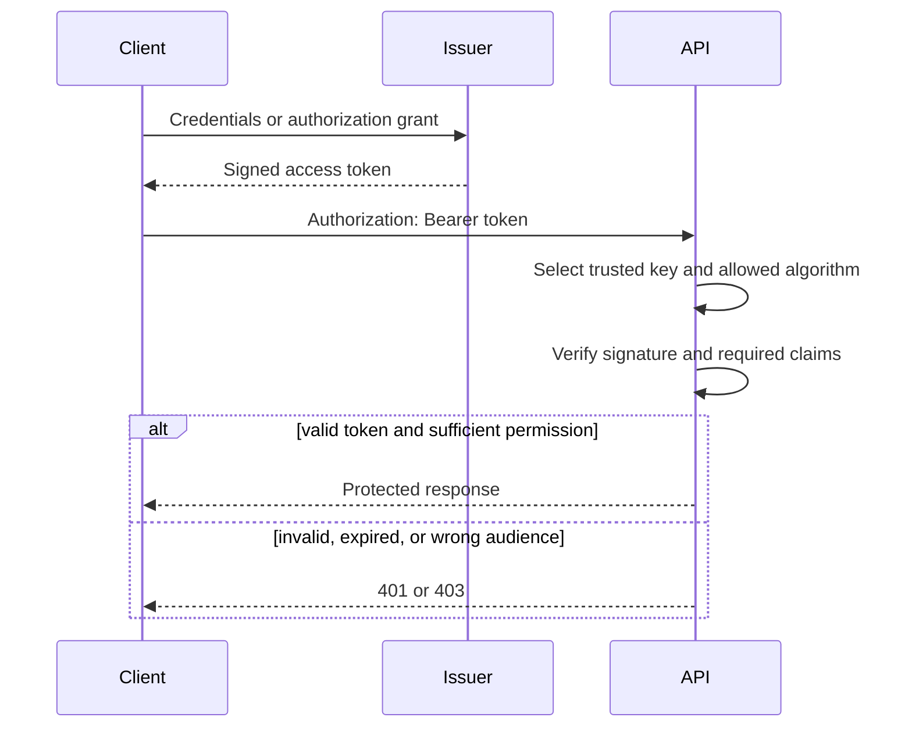

<TLDR>
  <TLDRCell label="what">
    <Term id="json-web-token">JWT（JSON Web Token）</Term>是一种紧凑的声明容器；身份系统通常把它签名后用作访问令牌。
  </TLDRCell>
  <TLDRCell label="trap">
    能解码payload或验过签名，不等于认证成功；验证端还必须约束算法、密钥来源、签发者、受众、时间和令牌用途。
  </TLDRCell>
  <TLDRCell label="fix">
    使用成熟的JOSE库和固定的验证策略，让短期访问令牌配合可撤销、可检测重放的刷新令牌。
  </TLDRCell>
</TLDR>

## 是什么，为什么存在

<Term id="json-web-token">JSON Web Token（JWT）</Term>是一个以JSON对象表示声明的紧凑、URL安全格式。<Term id="claim">声明（claim）</Term>是关于主体的一项名称和值，例如`sub`表示主体，`iss`表示签发者。JWT可以装在JSON Web Signature（JWS）或JSON Web Encryption（JWE）结构中；身份认证常见的是经过签名的JWS紧凑序列化。

JWT只是令牌格式，不是登录协议，也不会自动完成身份认证。登录端仍要验证凭据或外部身份，签发令牌；资源服务器则依据自己的策略验证令牌，再建立请求身份。OAuth 2.0、OpenID Connect或应用自己的协议决定令牌如何取得、放在哪里以及能做什么。

常见的签名JWT有三个用点号分隔的Base64url段：JOSE header、payload和signature。header描述密码学操作，payload携带声明，signature保护前两段的完整性。Base64url是编码，不是加密，所以拿到令牌的人通常能读出header和payload。

JWT适合签发者和验证者分离的系统：验证服务可持有公钥，不必拿到私钥，也不必为每次请求查询中心会话。这个性质常被称为“无状态”，但它不是免费收益。密钥发布、注销、权限变化和刷新令牌通常仍需要状态。

## 工作原理

一次安全的请求包含两个不同阶段。签发阶段把已确认的身份、目标API和短有效期写成声明，再使用受保护的密钥签名。验证阶段不能相信令牌自述的任何内容，直到密码学验证和应用策略全部通过。



验证顺序很重要。实现先限制令牌大小和结构，再解析header；它只能从本地配置或受信任签发者的元数据中选择密钥。随后验证签名，解析payload，并检查所需声明的类型和值。任何一步失败都应统一拒绝，不应带着部分可信的身份继续执行。

应用要为每一种令牌写出独立策略。至少要固定允许的算法、可信`iss`、本API的`aud`、必需的`sub`，以及`exp`和`nbf`的时间规则。若同一签发者产生ID token、访问令牌和其他JWT，还要用不同的`typ`、`aud`、声明组合或密钥，使各策略互斥。

常见注册声明的含义如下。RFC 7519没有要求每个JWT都包含这些声明；具体协议必须决定哪些字段必需。

| 声明 | 含义 | 验证动作 |
| --- | --- | --- |
| `iss` | 签发者 | 与可信签发者精确比较，并把密钥绑定到该签发者 |
| `sub` | 主体 | 检查类型，并在签发者范围内解释其身份 |
| `aud` | 预期接收者 | 字符串或字符串数组中必须包含当前API |
| `exp` | 过期时间 | 当前时间必须早于该NumericDate |
| `nbf` | 生效时间 | 当前时间不得早于该NumericDate |
| `iat` | 签发时间 | 可用于策略和审计，但它本身不是过期检查 |
| `jti` | 令牌标识 | 可用于重放检测或拒绝列表，但不会自动带来唯一性 |

认证和授权也必须分开。有效签名只说明持有对应密钥的一方签发了这些字节，并且字节未被改动。用户是否仍存在、角色是否仍有效、请求能否访问当前资源，属于应用的授权决策。

## 示例

### 读取令牌不等于验证令牌

下面的第一段代码构造并读取一个三段令牌。第三段故意不是有效签名；解码仍然成功，这正说明读取payload不能证明令牌可信。

<Depth level="quick">

```javascript run title="inspect-token.js"
const encode = (value) =>
  Buffer.from(JSON.stringify(value)).toString('base64url');

const header = { alg: 'HS256', typ: 'at+jwt' };
const payload = {
  iss: 'https://issuer.example',
  sub: 'user-42',
  aud: 'inventory-api',
  role: 'editor'
};
const fakeSignature = Buffer.from('not-a-signature').toString('base64url');
const token = `${encode(header)}.${encode(payload)}.${fakeSignature}`;

const [headerPart, payloadPart] = token.split('.');
const decodedHeader = JSON.parse(Buffer.from(headerPart, 'base64url'));
const decodedPayload = JSON.parse(Buffer.from(payloadPart, 'base64url'));

console.log(`segments: ${token.split('.').length}`);
console.log(`algorithm: ${decodedHeader.alg}`);
console.log(`subject: ${decodedPayload.sub}`);
console.log(`role: ${decodedPayload.role}`);
console.log('signature checked: no');
```

```text
segments: 3
algorithm: HS256
subject: user-42
role: editor
signature checked: no
```

</Depth>

`Buffer.from(segment, 'base64url')`只撤销Base64url编码。攻击者可以自行构造同样的JSON，甚至把`role`改成`admin`。只有用受信任密钥验证完整签名，并检查上下文声明后，程序才能使用payload建立身份。

在日志、错误报告或浏览器调试器里解码令牌很方便，但要把结果标为“不可信”。诊断工具不应把“格式可解析”显示成“有效”，更不能把完整bearer token写入日志。

### 签发并验证一个HS256令牌

下例用Node.js内置`crypto`展示签名输入与验证策略。它固定时间和测试密钥以产生可重复输出，只用于解释机制；生产边界应使用经过维护的JOSE库，并从密钥管理系统加载密钥。

```javascript run title="verify-token.js"
import { createHmac, timingSafeEqual } from 'node:crypto';

const secret = Buffer.from('8f'.repeat(32), 'hex');
const now = 1_800_000_000;
const encode = (value) => Buffer.from(JSON.stringify(value)).toString('base64url');
const mac = (input) => createHmac('sha256', secret).update(input).digest('base64url');

function issue(claims) {
  const header = encode({ alg: 'HS256', typ: 'at+jwt' });
  const payload = encode(claims);
  return `${header}.${payload}.${mac(`${header}.${payload}`)}`;
}

function verify(token, policy) {
  const parts = token.split('.');
  if (parts.length !== 3) throw new Error('malformed token');
  const [headerPart, payloadPart, signaturePart] = parts;
  const header = JSON.parse(Buffer.from(headerPart, 'base64url'));
  if (header.alg !== 'HS256' || header.typ !== 'at+jwt') throw new Error('wrong header');
  const actual = Buffer.from(signaturePart, 'base64url');
  const expected = Buffer.from(mac(`${headerPart}.${payloadPart}`), 'base64url');
  if (actual.length !== expected.length || !timingSafeEqual(actual, expected))
    throw new Error('bad signature');
  const claims = JSON.parse(Buffer.from(payloadPart, 'base64url'));
  const audiences = Array.isArray(claims.aud) ? claims.aud : [claims.aud];
  if (claims.iss !== policy.issuer || !audiences.includes(policy.audience))
    throw new Error('wrong issuer or audience');
  if (!Number.isFinite(claims.exp) || policy.now >= claims.exp) throw new Error('expired');
  if (Number.isFinite(claims.nbf) && policy.now < claims.nbf) throw new Error('not active');
  return claims;
}

const token = issue({ iss: 'https://issuer.example', sub: 'user-42',
  aud: 'inventory-api', iat: now, nbf: now, exp: now + 300 });
const claims = verify(token, {
  issuer: 'https://issuer.example', audience: 'inventory-api', now
});
console.log(`segments: ${token.split('.').length}`);
console.log(`subject: ${claims.sub}`);
console.log(`valid for seconds: ${claims.exp - now}`);
```

```text
segments: 3
subject: user-42
valid for seconds: 300
```

HMAC使用同一个秘密完成签名和验证，因此每个验证者也都有签发能力。它适合信任边界一致的组件。若多个资源服务器只应验证、不应签发，可以使用非对称算法：签发者保管私钥，验证者只取得公钥。

算法不能由令牌自由决定。验证器可以读取`alg`来确认它等于策略允许值，却不能因为令牌写了某种算法就启用该算法。每把密钥也应固定用途和算法，避免把一种算法的密钥材料误用于另一种算法。

示例没有实现JSON重复键检测、输入大小限制、完整JOSE解析、密钥轮换或时钟偏差策略。这些边界条件正是生产代码应该交给成熟库的原因。库只负责实现原语，调用方仍要显式传入issuer、audience、算法和必需声明。

### 用失败用例固定声明策略

密码学库通常允许调用方选择要验证的声明，但应用仍要定义精确策略。下面的函数接收已经通过签名验证的claims，并分别测试正确上下文、错误受众和过期令牌。把这些拒绝用例放进测试，可以防止重构时意外删掉一个验证选项。

```javascript run title="claim-policy.js"
function enforcePolicy(claims, policy) {
  if (typeof claims.sub !== 'string' || claims.sub.length === 0)
    throw new Error('missing subject');
  const audiences = Array.isArray(claims.aud) ? claims.aud : [claims.aud];
  if (claims.iss !== policy.issuer) throw new Error('wrong issuer');
  if (!audiences.includes(policy.audience)) throw new Error('wrong audience');
  if (!Number.isFinite(claims.exp) || policy.now >= claims.exp)
    throw new Error('expired');
  return claims.sub;
}

const policy = {
  issuer: 'https://issuer.example',
  audience: 'inventory-api',
  now: 1_800_000_000
};
const base = {
  iss: policy.issuer, sub: 'user-42', aud: policy.audience, exp: policy.now + 60
};
const cases = [
  ['accepted', base],
  ['other API', { ...base, aud: 'billing-api' }],
  ['old token', { ...base, exp: policy.now }]
];

for (const [name, claims] of cases) {
  try {
    console.log(`${name}: ${enforcePolicy(claims, policy)}`);
  } catch (error) {
    console.log(`${name}: ${error.message}`);
  }
}
```

```text
accepted: user-42
other API: wrong audience
old token: expired
```

这里把`policy.now`作为输入，而不是在函数深处调用系统时钟，因此边界测试可重复。生产验证器可以注入时钟或使用库的时钟选项，但不能把固定测试时间带进真实请求路径。

这一步仍不是授权。`sub`通过策略后只形成一个已认证主体；端点还要根据当前资源、操作和服务端权限数据作出允许或拒绝决定。对权限变化敏感的操作不应只依赖长期存在的`role` claim。

### 轮换可撤销的刷新令牌

<Term id="access-token">访问令牌（access token）</Term>应只发给目标资源服务器，并保持较短生命周期。<Term id="refresh-token">刷新令牌（refresh token）</Term>只发送给授权服务器，用来取得新的访问令牌；它不必是JWT，使用不可预测的opaque value往往更容易撤销。

下面的内存存储展示轮换族的核心状态。示例字符串是固定测试夹具；真实刷新令牌必须由密码学安全随机源产生，只把摘要存入数据库，并在一次原子事务中完成消费旧令牌和写入新令牌。

```javascript run title="rotate-refresh-token.js"
import { createHash } from 'node:crypto';
const digest = (token) => createHash('sha256').update(token).digest('hex');

class RefreshTokenStore {
  #records = new Map();

  issue(family, token) {
    this.#records.set(digest(token), { family, active: true });
  }

  rotate(oldToken, newToken) {
    const record = this.#records.get(digest(oldToken));
    if (!record || !record.active) {
      if (record) this.revokeFamily(record.family);
      throw new Error('refresh token reuse detected');
    }
    record.active = false;
    this.issue(record.family, newToken);
  }

  revokeFamily(family) {
    for (const record of this.#records.values()) {
      if (record.family === family) record.active = false;
    }
  }
  isActive(token) {
    return this.#records.get(digest(token))?.active === true;
  }
}

const store = new RefreshTokenStore();
store.issue('grant-7', 'fixture-token-a');
store.rotate('fixture-token-a', 'fixture-token-b');
console.log(`rotated: ${store.isActive('fixture-token-b')}`);
try {
  store.rotate('fixture-token-a', 'attacker-token');
} catch (error) {
  console.log(`replay: ${error.message}`);
}
console.log(`family active: ${store.isActive('fixture-token-b')}`);
```

```text
rotated: true
replay: refresh token reuse detected
family active: false
```

轮换后，旧值再次出现意味着旧值或新值所在一方可能遭到泄露。服务器无法仅凭重放判断攻击者是谁，因此撤销整个令牌族，并要求重新授权。数据表要保留旧摘要和族关系，直到重放检测窗口结束；立即删除旧记录会失去检测依据。

并发刷新需要明确语义。若两个合法请求同时消费同一个刷新令牌，朴素的“先查再写”会签发两组后继令牌，或把第二个请求误判为攻击。数据库条件更新、行锁或单写者事务必须保证旧令牌只成功消费一次，客户端也应合并并发刷新。

刷新令牌延长了会话能力，因此必须绑定客户端和授权范围，在传输与存储时保密，并支持到期和注销。对于公共OAuth客户端，RFC 9700要求使用发送者约束或刷新令牌轮换来检测重放。

## 陷阱

> [!PITFALL]
> 先`decode` payload，再把其中的`sub`或`role`放进请求上下文。解码不验证来源，攻击者可任意改写声明。

**修复方法：** 让一个验证入口完成结构限制、签名和声明策略，只有该入口返回的类型才能进入授权逻辑。诊断性解码函数要使用带有`untrusted`的名称，并禁止其结果流入身份上下文。

> [!PITFALL]
> 把`alg`、`kid`、`jku`或`x5u`当成可信配置。生成代码常按`alg`动态选择算法，把`kid`拼进文件名或查询，或者直接抓取令牌给出的密钥URL。

**修复方法：** 算法允许列表来自服务端配置，`kid`只能在与可信issuer绑定的有限密钥集合中查找，未知值立即失败。不要跟随任意`jku`或`x5u`；确需远程JWKS时，只访问预配置的HTTPS地址，并实施缓存和刷新限制。

> [!PITFALL]
> 只验证签名和`exp`。为另一个API、租户或令牌类型签发的有效JWT可能因此被当前端点接受。

**修复方法：** 精确验证`iss`，要求`aud`包含当前服务，并为访问令牌设置明确的`typ`或互斥声明规则。多租户系统还要从可信issuer与tenant映射确定租户，不能只相信任意`tenant_id`声明。

> [!PITFALL]
> 把bearer token放进URL、普通应用日志或分析事件。反向代理、浏览器历史、监控和错误跟踪可能复制这些位置的内容。

**修复方法：** 通过TLS，在`Authorization: Bearer` header或经过完整CSRF设计的安全cookie中传输。日志只记录不可逆指纹或`jti`等非秘密关联值，并在网关、应用和追踪系统各层做字段清洗。

> [!PITFALL]
> 认为HttpOnly cookie消除了XSS，或认为local storage自动消除了CSRF。HttpOnly阻止脚本读取cookie，但活动中的恶意脚本仍可发请求；自动附带的cookie又带来CSRF边界。

**修复方法：** 存储方式要配合威胁模型。Cookie使用`Secure`、`HttpOnly`、合适的`SameSite`、明确的`Path`和CSRF防护；脚本可读存储要接受令牌可被XSS窃取的事实。无论放在哪里，都要部署内容安全策略、输出编码和短期令牌。

> [!PITFALL]
> 把注销实现成只删除客户端副本。已复制的访问令牌在服务器看来仍然有效，直到过期或命中服务端撤销规则。

**修复方法：** 让访问令牌保持短期，并根据风险选择拒绝列表、用户会话版本、内省或发送者约束。注销时撤销刷新令牌及其令牌族；密码修改、账号停用等安全事件也要触发相同策略。

<Depth level="deep">

## 密码学验证与策略验证

密码学验证回答“这些字节是否由对应密钥保护，而且未被修改”。策略验证回答“当前服务是否应在此时、为此用途接受这些声明”。前一个答案为真，后一个仍可能为假；错误受众、错误签发者、错误token类型和已停用用户都是例子。

验证器应先应用廉价的输入边界，例如HTTP header大小、紧凑序列化段数和允许的字符。随后解析最少量的JOSE header，以便在可信密钥集合中选择候选项。header本身仍不可信，所以选择结果只能缩小预配置集合，不能扩展信任来源。

签名成功后，解析器仍要拒绝不符合所用协议配置的JSON和声明类型。`aud`既可以是单个字符串，也可以是字符串数组；`exp`、`nbf`和`iat`使用NumericDate，也就是从Unix epoch起算的秒数。若允许时钟偏差，应由验证策略明确设定并保持尽可能小，不能让每个调用点随意选择。

应用还要防止跨JWT混淆。若同一个issuer为多个协议签发结构相近的JWT，仅靠有效签名无法证明当前拿到的是access token。不同`typ`、不同`aud`、不同必需声明或不同密钥都可以形成互斥规则；新设计应优先给令牌显式类型。

## 密钥选择与轮换

HS256等HMAC算法共享一个秘密。秘密必须具有足够熵，并通过密钥管理系统分发；把密码、仓库常量或默认环境变量当密钥都会削弱签名。任何能验证HMAC的服务也能签发HMAC，因此共享范围就是签发信任范围。

RS256、PS256或ES256等非对称方案把签发私钥与验证公钥分开。算法选择取决于协议配置、平台支持和密码学策略，不应根据未经验证的token临时决定。非对称并不自动更安全：私钥保护、参数验证、库版本和随机数质量仍然决定系统安全。

轮换期间，签发者用新key签发，同时在旧token最长可接受期内发布旧公钥。`kid`只负责在该issuer已批准的key set中定位密钥，不是全局可信名称。验证器缓存JWKS时要处理正常轮换，但不能让每个未知`kid`都触发无上限远程刷新，否则攻击者可制造网络和计算压力。

移除旧验证密钥前，要确认所有依赖它的token都已过期或被撤销。紧急泄露处理可能要求提前移除，此时仍持有旧token的合法请求也会失败。轮换方案必须把这种可用性代价写进运行手册，而不是只保留一个“current key”环境变量。

## 撤销带回必要状态

自包含访问令牌减少了正常请求的中心查询，但也把授权状态复制进了token。用户角色变化后，旧角色声明不会自动更新；密钥泄露后，旧签名也不会自动失效。有效期限制了陈旧窗口，却不能提供即时撤销。

拒绝列表按`jti`或token指纹记录撤销项，通常只需保留到token过期。会话版本把服务端版本写入token，每次验证查询当前版本，能一次撤销某用户的多个token。内省让资源服务器询问授权服务器令牌是否有效，提供更及时的控制，但恢复了网络依赖和运行时状态。

选择取决于撤销延迟目标、请求量、故障模式和账号风险，而不是“JWT必须无状态”的口号。高风险操作还可以重新认证，或查询最新权限，而不是完全依赖较早签发的角色声明。设计文档应明确在账号停用、权限下降、设备丢失和密钥泄露时，最晚多久停止接受旧token。

浏览器会话常把短期access token与长期refresh token组合起来。这样只缩短了access token泄露后的自然有效窗口；真正的会话控制来自refresh token的服务端记录、轮换、重放检测和撤销。刷新端点因此是身份系统的高价值边界，需要限速、审计和事务一致性。

## 认证结果的边界

验证结果应是窄而明确的应用类型，而不是原始payload字典。例如，它可以只暴露规范化后的`subject`、`issuer`、`audiences`和令牌标识，并保留审计需要的验证元数据。下游代码因此不容易把未经识别的私有claim当作权限。

身份中间件通常用`401 Unauthorized`表示没有可接受的认证凭据，用`403 Forbidden`表示身份已确认但权限不足。错误响应不应泄露签名比较、密钥存在性等细节；内部日志可以记录分类后的失败原因，但不能记录完整token。

如果网关验证JWT后把身份通过普通header传给后端，后端必须只接受由可信网关覆盖或签名的header，并阻止客户端绕过网关。否则攻击者可以直接发送同名header，绕开所有JWT验证。这一信任跳转需要像token本身一样明确记录和测试。

</Depth>

<Checkpoint id="backend/jwt-authentication" />

## 延伸阅读

- [RFC 7519：JSON Web Token](https://www.rfc-editor.org/rfc/rfc7519.html)
- [RFC 8725：JWT当前最佳实践](https://www.rfc-editor.org/rfc/rfc8725.html)
- [RFC 6750：OAuth 2.0 Bearer Token用法](https://www.rfc-editor.org/rfc/rfc6750.html)
- [RFC 9700：OAuth 2.0安全最佳实践](https://www.rfc-editor.org/rfc/rfc9700.html)
- [Node.js 24 `crypto`文档](https://nodejs.org/docs/latest-v24.x/api/crypto.html)
