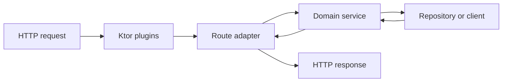

<TLDR>
  <TLDRCell label="what">
    Kotlin backend services commonly run on the JVM and use static types, null safety, and coroutines to organize HTTP boundaries and business logic. Ktor provides Kotlin-native routing and plugins, while Spring Boot offers a broader Java enterprise ecosystem.
  </TLDRCell>
  <TLDRCell label="trap">
    `suspend` doesn't turn blocking calls into non-blocking ones, and `@Serializable` doesn't validate business input. Starting coroutines outside the request lifetime also detaches cancellation, errors, and shutdown from an owner.
  </TLDRCell>
  <TLDRCell label="fix">
    Parse and validate input at the route boundary, keep business rules in ordinary service objects, bind child lifetimes with structured concurrency, and isolate unavoidable blocking calls on an appropriate dispatcher.
  </TLDRCell>
</TLDR>

## What it is and why it exists

Kotlin backend development means implementing long-running server programs in Kotlin, most often for the JVM. A service accepts HTTP or RPC requests, invokes domain logic and persistence components, then maps the result to a protocol response. Kotlin calls Java libraries directly, so a team can retain JVM drivers, monitoring tools, and frameworks while using nullable types, sealed types, and coroutines in new code.

The language doesn't design service boundaries for you. A reliable Kotlin service still separates untrusted transport data, validated domain input, persistence models, and public responses. Squeezing all of those shapes into one `data class` may save typing, but it couples database fields, internal state, and the HTTP contract.

Ktor is a Kotlin-native asynchronous server framework. Route handlers are suspending functions, and plugins handle cross-cutting behavior such as content negotiation, authentication, and status mapping. Spring Boot also officially supports Kotlin and fits systems that already depend on Spring Data, Security, or other Spring components; choose from ecosystem and operational constraints, not context-free startup comparisons.

A <Term id="coroutine">coroutine</Term> lets waiting work suspend without holding its calling thread. Its main value is expressing concurrency relationships and lifetimes, not making every operation faster. Blocking database, file, and legacy Java SDK calls still need to be identified and isolated.

These concerns appear in new HTTP APIs, Kotlin modules inside Java services, aggregation endpoints that call several downstreams, and background consumers. This page focuses on boundaries and concurrency rules shared by frameworks and uses Ktor for the HTTP adapter; database selection, authentication, and Spring Boot configuration belong to their related topics.

## How it works

### A request crosses four boundaries

A request enters through the server engine and moves through plugins, a route adapter, a service, and external resources. Each layer should pass inward only what the next layer needs. If a database entity or Ktor's `ApplicationCall` reaches domain code, the boundary has leaked.



The route adapter reads path and query parameters, headers, and the request body, then performs syntactic validation and normalization. The service receives meaningful types, applies business rules outside authorization, and calls repositories or downstream clients through interfaces. The route finally maps success or failure to stable status codes and response shapes.

### Types prove compile-time constraints only

`call.receive<CreateOrderRequest>()` can decode JSON into a Kotlin type, but network data still needs runtime checks. A missing field may fail during decoding, while a blank string satisfies `String` and a valid integer may still exceed a business limit. Serialization, structural validation, and domain validation are separate jobs.

A sealed result at the boundary can force callers to handle every known branch. The success branch carries normalized data; the failure branch carries stable error codes and field problems. Don't send parser exceptions or database messages directly to clients: they are unstable and may expose implementation details.

| Boundary | Receives | Produces | Must not leak |
| --- | --- | --- | --- |
| HTTP adapter | Strings, JSON, headers | Validated command or protocol error | `ApplicationCall` |
| Service | Domain command, actor identity | Domain result | HTTP status code |
| Repository | Domain query or write intent | Persistence result | ORM entity and connection |
| Response mapping | Domain result | Status, headers, DTO | Raw exception |

### Dependencies enter from outside

A service object declares repositories and clients in its constructor, the smallest useful form of <Term id="dependency-injection">dependency injection</Term>. Business tests can provide an in-memory implementation or fake, while production startup code provides the database implementation. Koin, a Spring container, and manual wiring are deployment choices.

Interfaces should describe capabilities the business needs, not mechanically copy database CRUD. `createOnce(requestId, create)` expresses an <Term id="idempotency">idempotency</Term> requirement that `insert(order)` does not. A real implementation must also store the request fingerprint, result, and write in one durable atomic operation.

### Child work belongs to its parent scope

<Term id="structured-concurrency">Structured concurrency</Term> binds child coroutine lifetimes to a lexical scope. `coroutineScope` waits for all its children; when an ordinary child fails, the scope cancels its siblings and propagates the failure to its caller. Request cancellation can follow the same parent-child relationship into work that is still suspended.

Use `async` only for work that can actually overlap and whose result is needed. Starting `async`, immediately awaiting it, and only then starting a second operation still runs sequentially. Concurrent reads must also be independent rather than quietly relying on ordering inside one transaction.

<Term id="cancellation">Cancellation</Term> is cooperative. Cancellable suspending functions such as `delay` observe it promptly, but a long CPU loop must check explicitly, and a blocking JDBC or SDK call may not stop at once. Deadlines, driver timeouts, and resource cleanup need separate configuration.

### `suspend` and threads answer different questions

A `suspend fun` may suspend; it doesn't promise not to block a thread. Calling a blocking driver inside it still occupies the current thread. `withContext(Dispatchers.IO)` can isolate that thread use, but it can't add cancellation to the underlying protocol or replace connection pools and timeouts.

Ktor route handlers already run in framework-managed coroutines and usually need no extra `launch`. Reach for `async` only when independent work should overlap. Durable work that must continue after the response belongs in a reliable queue or an application-owned scope, not in a coroutine quietly detached from the request.

### Plugins compose the HTTP pipeline

Ktor plugins put <Term id="content-negotiation">content negotiation</Term>, authentication, logging, and error handling into the request pipeline. After `ContentNegotiation` is installed with a JSON converter, the framework decodes and encodes according to `Content-Type` and `Accept`. That plugin handles protocol conversion, not field ranges, resource authorization, or transaction integrity.

Registration order and plugin scope affect behavior. If authentication or error handling covers only part of the route tree, a new endpoint may bypass it. Tests should send real `testApplication` requests through success and failure paths instead of calling only the service function behind a route.

## Examples

### Parse untrusted input at the boundary

The first program turns raw fields into a sealed result. It normalizes `sku` and retains all detected problems, so the route doesn't need `!!` to pretend its input is trustworthy.

<Depth level="quick">

```kotlin title="request_boundary.kt"
sealed interface ParsedOrder {
    data class Valid(val sku: String, val quantity: Int) : ParsedOrder
    data class Invalid(val errors: List<String>) : ParsedOrder
}

fun parseOrder(fields: Map<String, String?>): ParsedOrder {
    val sku = fields["sku"]?.trim().orEmpty()
    val quantity = fields["quantity"]?.toIntOrNull()
    val errors = buildList {
        if (sku.isEmpty()) add("sku is required")
        if (quantity == null || quantity !in 1..100) {
            add("quantity must be an integer from 1 to 100")
        }
    }

    return if (errors.isEmpty()) {
        ParsedOrder.Valid(sku, checkNotNull(quantity))
    } else {
        ParsedOrder.Invalid(errors)
    }
}

fun main() {
    val requests = listOf(
        mapOf("sku" to " KB-42 ", "quantity" to "2"),
        mapOf("sku" to "", "quantity" to "many"),
    )

    for (request in requests) {
        when (val parsed = parseOrder(request)) {
            is ParsedOrder.Valid -> println("accepted ${parsed.sku} x${parsed.quantity}")
            is ParsedOrder.Invalid -> println("rejected: ${parsed.errors.joinToString("; ")}")
        }
    }
}
```

```text
accepted KB-42 x2
rejected: sku is required; quantity must be an integer from 1 to 100
```

<TryToBreak items={['a missing quantity field', 'a quantity of 0', 'a whitespace-only sku']} />

</Depth>

`checkNotNull(quantity)` connects the validation result to a non-null type. It doesn't ignore risk: the preceding condition proves that only a non-null, in-range value reaches the success branch. If an API must distinguish malformed syntax from a business rejection, split the failure type further.

### Inject a storage contract into the service

The second program makes "create once per request" part of the repository contract. Two calls with the same `requestId` receive the same order, while a different request gets a new number.

```kotlin title="order_service.kt"
import java.util.concurrent.ConcurrentHashMap
import java.util.concurrent.atomic.AtomicLong

data class Order(val id: Long, val requestId: String, val sku: String, val quantity: Int)

interface OrderRepository {
    fun createOnce(requestId: String, create: (Long) -> Order): Order
}

class MemoryOrderRepository : OrderRepository {
    private val nextId = AtomicLong(1000)
    private val orders = ConcurrentHashMap<String, Order>()

    override fun createOnce(requestId: String, create: (Long) -> Order): Order =
        orders.computeIfAbsent(requestId) { create(nextId.incrementAndGet()) }
}

class OrderService(private val repository: OrderRepository) {
    fun place(requestId: String, sku: String, quantity: Int): Order {
        require(requestId.isNotBlank()) { "requestId is required" }
        require(quantity in 1..100) { "quantity is out of range" }
        return repository.createOnce(requestId) { id ->
            Order(id, requestId, sku, quantity)
        }
    }
}

fun main() {
    val service = OrderService(MemoryOrderRepository())
    val first = service.place("req-7", "KB-42", 2)
    val retry = service.place("req-7", "KB-42", 2)
    val next = service.place("req-8", "MS-10", 1)

    println("first=${first.id}, retry=${retry.id}, same=${first == retry}")
    println("next=${next.id}")
}
```

```text
first=1001, retry=1001, same=true
next=1002
```

The memory implementation demonstrates the interface and supports single-process tests; it isn't production idempotency storage. A multi-instance service needs a database uniqueness constraint or equivalent atomic mechanism and must reject different request content under the same key. The interface puts that responsibility at the repository boundary and avoids a route-level check-then-write race.

### Run independent reads under one parent

The third program starts two independent reads together. `coroutineScope` waits for both before returning and propagates the relevant state when either child fails or its parent request is cancelled.

```kotlin title="dashboard.main.kts"
@file:DependsOn("org.jetbrains.kotlinx:kotlinx-coroutines-core-jvm:1.11.0")

import kotlinx.coroutines.async
import kotlinx.coroutines.coroutineScope
import kotlinx.coroutines.delay
import kotlinx.coroutines.runBlocking

data class Dashboard(val customer: String, val openOrders: Int)

suspend fun loadCustomer(id: String): String {
    delay(40)
    return "customer-$id"
}

suspend fun countOpenOrders(id: String): Int {
    delay(20)
    return if (id == "7") 3 else 0
}

suspend fun loadDashboard(id: String): Dashboard = coroutineScope {
    val customer = async { loadCustomer(id) }
    val orderCount = async { countOpenOrders(id) }
    Dashboard(customer.await(), orderCount.await())
}

val dashboard = runBlocking { loadDashboard("7") }
println("${dashboard.customer}: ${dashboard.openOrders} open orders")
```

```text
customer-7: 3 open orders
```

`runBlocking` only supplies an entry point for this command-line script; don't use it in a Ktor route. Real client functions also need deadlines and must pass cancellation to their underlying calls. If both reads share a database connection that doesn't support concurrent use, keep them sequential or change the transaction design.

### Exercise a Ktor route through its test host

The final script starts a Ktor test application and sends two real requests through its client. It converts the path parameter at the HTTP boundary and returns a stable error code instead of echoing a parsing exception.

```kotlin title="application.main.kts"
@file:DependsOn("io.ktor:ktor-server-core-jvm:3.5.1")
@file:DependsOn("io.ktor:ktor-server-test-host-jvm:3.5.1")

import io.ktor.client.request.get
import io.ktor.client.statement.bodyAsText
import io.ktor.http.ContentType
import io.ktor.http.HttpStatusCode
import io.ktor.server.application.Application
import io.ktor.server.response.respondText
import io.ktor.server.routing.get
import io.ktor.server.routing.routing
import io.ktor.server.testing.testApplication

fun Application.orderModule() {
    routing {
        get("/orders/{id}") {
            val id = call.parameters["id"]?.toLongOrNull()
            if (id == null) {
                call.respondText(
                    "{\"error\":\"invalid_order_id\"}",
                    ContentType.Application.Json,
                    HttpStatusCode.BadRequest,
                )
            } else {
                call.respondText(
                    "{\"id\":$id,\"status\":\"READY\"}",
                    ContentType.Application.Json,
                )
            }
        }
    }
}

testApplication {
    application { orderModule() }
    for (path in listOf("/orders/42", "/orders/nope")) {
        val response = client.get(path)
        println("GET $path -> ${response.status.value} ${response.bodyAsText()}")
    }
}
```

```text
GET /orders/42 -> 200 {"id":42,"status":"READY"}
GET /orders/nope -> 400 {"error":"invalid_order_id"}
```

The example writes JSON by hand so the script doesn't require the compile-time serialization plugin. Production services normally install `ContentNegotiation` and use dedicated response DTOs. Even then, tests should assert the status, `Content-Type`, body, and other branches such as a missing resource.

## Pitfalls

### Using `!!` on request data

> [!PITFALL]
> Path parameters, headers, and decoded fields come from untrusted clients. Using `!!` to silence a compiler error turns missing input into a `NullPointerException` with no defined protocol response.

**Fix:** use `toLongOrNull()`, explicit null checks, and runtime validators at the route boundary, then map each failure to a stable `4xx` response. Data entering the service should already meet structural constraints.

### Launching `GlobalScope` from a route

> [!PITFALL]
> Work created by `GlobalScope.launch` no longer belongs to the request or application lifetime. It may continue after disconnect, shutdown, or parent failure, yet disappear when the process exits.

**Fix:** keep work required for the response in the current scope. Put durable post-response tasks on a persistent queue; for process-lifetime maintenance, use an application-owned scope that shutdown cancels and joins.

### Hiding a blocking call in a `suspend` function

> [!PITFALL]
> Adding `suspend` doesn't change the blocking behavior of JDBC, file APIs, or an old SDK. Calling them directly on a constrained request executor holds resources needed by other requests.

**Fix:** establish whether each dependency is suspending, asynchronous, or blocking. Put unavoidable blocking work on controlled `Dispatchers.IO` or a dedicated dispatcher, and configure the pool, deadline, and driver timeout.

### Catching and swallowing cancellation

> [!PITFALL]
> A broad `catch (e: Exception)` that turns `CancellationException` into an ordinary `500` or fallback can let a cancelled request continue into side effects. A later suspension may throw cancellation again, making the path harder to reason about.

**Fix:** normally let cancellation propagate. If broad catching is necessary, rethrow `CancellationException` first, then map and record expected domain failures separately from unexpected faults.

### Sending one `data class` through every layer

> [!PITFALL]
> Sharing one type among requests, database entities, and responses can expose internal fields and turn a database migration into an API change. `copy()` is shallow too, so it doesn't isolate nested mutable state.

**Fix:** keep explicit boundaries among transport DTOs, domain commands, and persistence records. Mapping code may look repetitive, but it is where field allowlists, defaults, version conversion, and secret filtering belong.

### Treating a process-local map as idempotent storage

> [!PITFALL]
> An in-memory map coordinates only requests in one process. Restarts lose entries, instances don't share them, and a check-then-write sequence can still let concurrent retries create two results.

**Fix:** use a unique constraint or equivalent persistence mechanism to atomically store the idempotency key, normalized request fingerprint, and result. Define key scope and retention, and reject the same key with different content.

## In the AI era

**What generated code gets wrong here**

Models often generate `GlobalScope.launch` in a Ktor route to send a notification, so the response succeeds while the task can vanish during a restart. They also treat `call.receive<T>()` or `@Serializable` as business validation, add `!!` after nullable path parameters, or place blocking JDBC inside a `suspend` function and call it non-blocking. Another common miss is `async { a() }.await()` followed by `async { b() }.await()`: it looks concurrent but waits in sequence.

**Ask your AI to check**

- List every untrusted value accepted by each route, its runtime validation and domain conversion, and every possible HTTP response.
- For every `launch`, `async`, and constructed `CoroutineScope`, identify its parent `Job`, owner, cancellation path, and shutdown behavior.
- Identify every blocking library call and state its dispatcher, timeout, pool, and actual behavior after request cancellation.

**Review checklist**

- Exercise the endpoint over real HTTP with malformed JSON, missing fields, boundary values, and an unauthorized identity.
- Check that cancellation and exceptions reach sibling children and that post-response effects use a durable mechanism.
- Confirm that response DTOs contain no database-only fields, secrets, stack traces, or raw exception messages.

**Prompt vocabulary**

Use exact terms: `request boundary`, `structured concurrency`, `parent Job`, `cooperative cancellation`, `blocking boundary`, `runtime validation`, `idempotency key`, and `transactional outbox`. Ask the model to draw ownership and failure-propagation paths; "make it asynchronous" doesn't specify thread or lifetime constraints.

<Depth level="deep">

## Cancellation, failure, and commit boundaries

Cancelling a request coroutine means computation that is still cooperating should stop. It doesn't undo a committed database transaction, a sent message, or a request already accepted by a third party. A timeout observed by the client is therefore not proof that the server skipped a write.

Mutation operations need an unknown-outcome protocol. The caller provides a stable idempotency key, and the server atomically stores a request fingerprint and result with the domain write; a retry with the same content receives the stored result, while different content under that key is rejected. A `Mutex` or map inside the application can't preserve this contract across restarts and instances.

When one child fails, an ordinary `coroutineScope` cancels its siblings. That default fits an aggregate request that must succeed as a whole. If child results may fail independently, `supervisorScope` can help, but you must then observe every failure and define a partial response; supervision isn't a switch for ignoring exceptions.

Broad exception mapping belongs at the protocol boundary and must retain cancellation semantics. Expected domain failures can use sealed results, while unexpected faults are logged with an internal correlation ID and returned as a stable public error. Echoing `cause.message` breaks the contract and can reveal SQL, paths, or dependency details.

### Effects after the response

Sending mail, publishing an event, or refreshing a search index creates a failure window when it uses a different system from the primary write. Committing an order and then launching event publication from the route doesn't close that window. The process can exit between the two steps, and a retry can duplicate the order.

A transactional outbox stores the domain change and a pending publication record in one database transaction. A separate publisher later reads the record, sends the message, and records progress in a recoverable way. Consumers still need idempotent handling by message identity because an unknown acknowledgement can make the publisher send again.

## Blocking boundaries and capacity

Coroutine waiting and thread waiting aren't the same. A suspending client can release its thread while waiting for the network; a blocking client holds the thread until its call returns. `Dispatchers.IO` offers isolation and controlled elasticity, but downstream capacity still comes from connection pools, concurrency limits, and timeouts.

Don't apply a universal connection-pool formula without measurements. A small pool queues callers, while a large one can overload the database; the useful value depends on database limits, query latency, request concurrency, and instance count. Observe pool wait time, active connections, downstream latency, and timeouts, then tune in a load-test environment.

CPU-bound work belongs on `Dispatchers.Default`; blocking I/O belongs on `Dispatchers.IO` or a dedicated executor. Dispatcher switches also have a cost, so switch at a coarse dependency-adapter boundary instead of wrapping every tiny function in `withContext`.

### Deadlines must travel downward

A timeout at the entry point isn't enough. Database statements, HTTP clients, and message brokers should receive deadlines no longer than the remaining request budget. Otherwise the parent may be cancelled while a blocking operation keeps a connection or thread until its own default timeout ends.

To test cancellation, make one dependency explicitly block or suspend, cancel the parent scope, and assert that sibling work stops without committing an effect. Merely asserting that a route returns `504` doesn't prove its internal work ended.

## The shape of a Ktor adapter

A small Ktor module installs plugins by capability, then registers routes that only adapt. `ContentNegotiation` handles media types and serialization, `StatusPages` supplies a uniform fallback for unexpected faults, and an authentication plugin establishes a trusted identity. Routes usually map field errors and business conflicts explicitly so each endpoint's protocol branches remain visible.

Production responses should use dedicated serializable DTOs with explicit policies for unknown fields, defaults, and date formats. Public JSON is a versioned contract; it shouldn't change accidentally with a Kotlin property rename or persistence-model change. Negotiation failures, a wrong `Content-Type`, and an unacceptable `Accept` value belong in HTTP tests too.

`testApplication` runs a module in isolation and provides a real client. It is a good fit for routes, plugins, serialization, and status mapping, while ordinary service unit tests cover business branches. Database constraints, transactions, and queries need integration tests against real database behavior.

### Ktor and Spring Boot

Ktor has a smaller Kotlin-native API surface and fits teams that want to assemble routes and plugins explicitly. Spring Boot offers autoconfiguration and the large Spring ecosystem, which suits systems with existing Spring operational knowledge or a need for particular Spring modules. Both can support layered, testable Kotlin services, and neither repairs a poor boundary design automatically.

Don't introduce two HTTP frameworks into one service merely to demonstrate Kotlin. Choose one adapter from dependencies, team experience, startup model, and deployment platform, then keep domain services framework-independent. A later framework migration is then concentrated in startup, plugin, and route code.

</Depth>

<Checkpoint id="backend/kotlin-backend" />

## Further reading

- [Kotlin for server-side development](https://kotlinlang.org/docs/server-overview.html)
- [Kotlin current version and FAQ](https://kotlinlang.org/docs/faq.html)
- [Ktor release history](https://ktor.io/docs/releases.html)
- [Create RESTful APIs with Ktor](https://ktor.io/docs/server-create-restful-apis.html)
- [Ktor content negotiation and serialization](https://ktor.io/docs/server-serialization.html)
- [`CoroutineScope` in kotlinx.coroutines](https://kotlinlang.org/api/kotlinx.coroutines/kotlinx-coroutines-core/kotlinx.coroutines/-coroutine-scope/)
