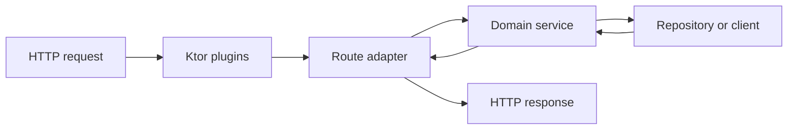

<TLDR>
  <TLDRCell label="what">
    Kotlin 后端服务通常运行在 JVM 上，用静态类型、空安全与协程组织 HTTP 边界和业务逻辑。Ktor 提供 Kotlin 原生的路由与插件模型，Spring Boot 则提供更广的 Java 企业生态。
  </TLDRCell>
  <TLDRCell label="trap">
    `suspend` 不会自动把阻塞调用变成非阻塞调用，`@Serializable` 也不会替你验证业务输入。脱离请求生命周期启动协程，还会让取消、错误和关闭过程失去归属。
  </TLDRCell>
  <TLDRCell label="fix">
    在路由边界解析并验证输入，把业务规则放进普通服务对象，用结构化并发绑定子任务生命周期，并在专用调度器上隔离不可避免的阻塞调用。
  </TLDRCell>
</TLDR>

## 是什么，为什么存在

Kotlin 后端开发是用 Kotlin 实现长期运行的服务端程序，常见目标是 JVM。服务接收 HTTP 或 RPC 请求，调用领域逻辑和持久化组件，再把结果映射为协议响应。Kotlin 可以直接调用 Java 库，因此团队能继续使用 JVM 驱动、监控工具和框架，同时在新代码中使用可空类型、密封类型与协程。

语言不会替你设计服务边界。一个可靠的 Kotlin 服务仍要区分不可信的传输数据、经过校验的领域输入、持久化模型和对外响应。把这些形状都压进一个 `data class` 虽然省事，却会把数据库字段、内部状态与 HTTP 契约绑在一起。

Ktor 是 Kotlin 原生的异步服务框架。路由处理器是挂起函数，插件负责内容协商、认证、状态映射等横切行为。Spring Boot 也正式支持 Kotlin，适合已经依赖 Spring Data、Security 或其他 Spring 组件的系统；框架选择应由现有生态和运维约束决定，而不是没有环境说明的启动速度比较。

协程（coroutine）让等待中的工作挂起，而不必占住调用线程。其价值主要是表达并发关系和生命周期，而不是让每项工作自动变快。对数据库、文件或旧 Java SDK 的阻塞调用，仍要识别并隔离。

你会在新 HTTP API、Java 服务的 Kotlin 模块、多个下游调用的聚合端点以及后台消费者中遇到这些问题。本页聚焦框架之间共享的边界与并发规则，并用 Ktor 展示 HTTP 适配层；数据库选型、认证和 Spring Boot 配置由相关主题展开。

## 工作原理

### 请求穿过四个边界

一个请求先由服务器引擎接收，再依次经过插件、路由适配层、服务层和外部资源。每层只应把下一层需要的信息向内传递。数据库实体或框架的 `ApplicationCall` 若一路进入领域代码，边界就已经泄漏。



路由适配层读取路径、查询参数、请求头与请求体，然后完成语法校验和规范化。服务层接收已经有意义的类型，执行授权之外的业务规则，并通过接口调用仓库或下游客户端。最后，路由把成功或失败映射为固定的状态码与响应形状。

### 类型只证明编译期约束

`call.receive<CreateOrderRequest>()` 可以把 JSON 解码成 Kotlin 类型，但网络数据仍需要运行时检查。缺失字段可能在解码时失败，空字符串却能满足 `String`，合法整数也可能超出业务允许的范围。序列化、结构校验和领域校验是三项不同工作。

在边界层返回密封结果，可以迫使调用方处理所有已知分支。成功分支携带规范化数据，失败分支携带稳定的错误码和字段问题。不要把解析器的原始异常或数据库消息直接交给客户端，因为它们既不稳定，也可能暴露内部细节。

| 边界 | 接收 | 产出 | 不应泄漏 |
| --- | --- | --- | --- |
| HTTP 适配层 | 字符串、JSON、请求头 | 已校验命令或协议错误 | `ApplicationCall` |
| 服务层 | 领域命令、调用者身份 | 领域结果 | HTTP 状态码 |
| 仓库层 | 领域查询或写入意图 | 持久化结果 | ORM 实体与连接 |
| 响应映射 | 领域结果 | 状态码、响应头、DTO | 原始异常 |

### 依赖从外部传入

服务对象通过构造函数声明仓库和客户端，这就是依赖注入（dependency injection）的最小形式。业务测试可以传入内存实现或假实现，生产启动代码则传入数据库实现。是否使用 Koin、Spring 容器或手工装配，是部署层的选择。

接口应围绕业务所需能力设计，而不是机械复制数据库 CRUD。`createOnce(requestId, create)` 比 `insert(order)` 多表达了幂等性（idempotency）要求。真实实现还必须把请求指纹、结果和写入放进同一个持久化原子操作中。

### 子任务属于父作用域

结构化并发（structured concurrency）把子协程的生命周期绑定到词法作用域。`coroutineScope` 会等待所有子任务结束；普通子任务失败时，作用域会取消同级任务并向调用方传播故障。请求取消也能沿这条父子关系传入仍在挂起的工作。

`async` 只适合确实可以并行、最终还需要结果的工作。先 `async` 再立刻 `await`，随后才启动第二项工作，执行效果仍是串行。并发读取还必须彼此独立，不能暗中依赖同一事务中的执行顺序。

取消（cancellation）是协作式的。`delay` 等可取消挂起函数会及时观察取消，但长时间 CPU 循环需要主动检查，而阻塞 JDBC 或 SDK 调用不一定立刻停止。截止时间、驱动超时和资源关闭仍需单独配置。

### `suspend` 与线程不是同一个问题

`suspend fun` 表示函数可以挂起，它不承诺函数不会阻塞线程。直接在其中调用阻塞驱动仍会占住当前线程。把这类调用放进 `withContext(Dispatchers.IO)` 可以隔离线程使用，但不会让底层协议获得取消能力，也不会替代连接池和超时。

Ktor 的路由处理器本身已在框架管理的协程中运行，通常不需要再 `launch` 一层。只有两项独立工作需要重叠时才使用 `async`。必须在响应之后继续的持久任务应进入可靠队列或由应用生命周期拥有的作用域，而不是偷偷脱离请求。

### 插件组成 HTTP 管线

Ktor 插件把内容协商（content negotiation）、认证、日志和错误处理放进请求管线。安装 `ContentNegotiation` 并注册 JSON 转换器后，框架会根据 `Content-Type` 与 `Accept` 进行解码和编码。插件解决协议转换，不解决字段范围、资源级授权或事务完整性。

路由登记顺序和插件作用域会影响行为。认证或错误处理若只安装在部分路由上，新增端点可能绕过它。测试应通过真实的 `testApplication` 请求覆盖成功和失败路径，而不是只直接调用路由内部的服务函数。

## 示例

### 在边界解析不可信输入

第一个程序把原始字段转换为密封结果。它同时规范化 `sku`，并保留所有已发现的问题，因此路由不需要用 `!!` 假装输入可信。

<Depth level="quick">

```kotlin title="request_boundary.kt"
sealed interface ParsedOrder {
    data class Valid(val sku: String, val quantity: Int) : ParsedOrder
    data class Invalid(val errors: List<String>) : ParsedOrder
}

fun parseOrder(fields: Map<String, String?>): ParsedOrder {
    val sku = fields["sku"]?.trim().orEmpty()
    val quantity = fields["quantity"]?.toIntOrNull()
    val errors = buildList {
        if (sku.isEmpty()) add("sku is required")
        if (quantity == null || quantity !in 1..100) {
            add("quantity must be an integer from 1 to 100")
        }
    }

    return if (errors.isEmpty()) {
        ParsedOrder.Valid(sku, checkNotNull(quantity))
    } else {
        ParsedOrder.Invalid(errors)
    }
}

fun main() {
    val requests = listOf(
        mapOf("sku" to " KB-42 ", "quantity" to "2"),
        mapOf("sku" to "", "quantity" to "many"),
    )

    for (request in requests) {
        when (val parsed = parseOrder(request)) {
            is ParsedOrder.Valid -> println("accepted ${parsed.sku} x${parsed.quantity}")
            is ParsedOrder.Invalid -> println("rejected: ${parsed.errors.joinToString("; ")}")
        }
    }
}
```

```text
accepted KB-42 x2
rejected: sku is required; quantity must be an integer from 1 to 100
```

<TryToBreak items={['缺少 quantity 字段', 'quantity 为 0', 'sku 只有空白字符']} />

</Depth>

这段代码用 `checkNotNull(quantity)` 连接校验结果与非空类型。它没有忽略风险；前面的条件已经证明只有非空且在范围内的值才能进入成功分支。若请求需要区分语法错误和业务拒绝，可以继续拆分失败类型。

### 把存储契约注入服务

第二个程序让仓库拥有「同一请求只创建一次」的契约。两次使用相同 `requestId` 时，服务得到同一个订单；不同请求则获得新编号。

```kotlin title="order_service.kt"
import java.util.concurrent.ConcurrentHashMap
import java.util.concurrent.atomic.AtomicLong

data class Order(val id: Long, val requestId: String, val sku: String, val quantity: Int)

interface OrderRepository {
    fun createOnce(requestId: String, create: (Long) -> Order): Order
}

class MemoryOrderRepository : OrderRepository {
    private val nextId = AtomicLong(1000)
    private val orders = ConcurrentHashMap<String, Order>()

    override fun createOnce(requestId: String, create: (Long) -> Order): Order =
        orders.computeIfAbsent(requestId) { create(nextId.incrementAndGet()) }
}

class OrderService(private val repository: OrderRepository) {
    fun place(requestId: String, sku: String, quantity: Int): Order {
        require(requestId.isNotBlank()) { "requestId is required" }
        require(quantity in 1..100) { "quantity is out of range" }
        return repository.createOnce(requestId) { id ->
            Order(id, requestId, sku, quantity)
        }
    }
}

fun main() {
    val service = OrderService(MemoryOrderRepository())
    val first = service.place("req-7", "KB-42", 2)
    val retry = service.place("req-7", "KB-42", 2)
    val next = service.place("req-8", "MS-10", 1)

    println("first=${first.id}, retry=${retry.id}, same=${first == retry}")
    println("next=${next.id}")
}
```

```text
first=1001, retry=1001, same=true
next=1002
```

内存实现适合展示接口和单进程测试，不是生产幂等存储。多实例服务需要数据库唯一约束或等价的原子机制，还要拒绝用同一键提交不同请求内容。接口把该责任放在仓库边界，避免路由先查再写所留下的竞态窗口。

### 并行读取并保留父子关系

第三个程序同时启动两个独立读取。`coroutineScope` 在返回前等待二者，并在任一子任务失败或父请求取消时传播相应状态。

```kotlin title="dashboard.main.kts"
@file:DependsOn("org.jetbrains.kotlinx:kotlinx-coroutines-core-jvm:1.11.0")

import kotlinx.coroutines.async
import kotlinx.coroutines.coroutineScope
import kotlinx.coroutines.delay
import kotlinx.coroutines.runBlocking

data class Dashboard(val customer: String, val openOrders: Int)

suspend fun loadCustomer(id: String): String {
    delay(40)
    return "customer-$id"
}

suspend fun countOpenOrders(id: String): Int {
    delay(20)
    return if (id == "7") 3 else 0
}

suspend fun loadDashboard(id: String): Dashboard = coroutineScope {
    val customer = async { loadCustomer(id) }
    val orderCount = async { countOpenOrders(id) }
    Dashboard(customer.await(), orderCount.await())
}

val dashboard = runBlocking { loadDashboard("7") }
println("${dashboard.customer}: ${dashboard.openOrders} open orders")
```

```text
customer-7: 3 open orders
```

`runBlocking` 只为命令行脚本提供入口，Ktor 路由中不应使用它。真正的客户端函数还要设置截止时间，并让取消到达底层调用。若两个读取共享一条不支持并发使用的数据库连接，就应保持串行或改变事务设计。

### 通过测试主机执行 Ktor 路由

最后一个脚本启动 Ktor 测试应用，并通过框架客户端发出两个真实请求。路径参数在 HTTP 边界转换，失败响应使用稳定错误码，不回显解析异常。

```kotlin title="application.main.kts"
@file:DependsOn("io.ktor:ktor-server-core-jvm:3.5.1")
@file:DependsOn("io.ktor:ktor-server-test-host-jvm:3.5.1")

import io.ktor.client.request.get
import io.ktor.client.statement.bodyAsText
import io.ktor.http.ContentType
import io.ktor.http.HttpStatusCode
import io.ktor.server.application.Application
import io.ktor.server.response.respondText
import io.ktor.server.routing.get
import io.ktor.server.routing.routing
import io.ktor.server.testing.testApplication

fun Application.orderModule() {
    routing {
        get("/orders/{id}") {
            val id = call.parameters["id"]?.toLongOrNull()
            if (id == null) {
                call.respondText(
                    "{\"error\":\"invalid_order_id\"}",
                    ContentType.Application.Json,
                    HttpStatusCode.BadRequest,
                )
            } else {
                call.respondText(
                    "{\"id\":$id,\"status\":\"READY\"}",
                    ContentType.Application.Json,
                )
            }
        }
    }
}

testApplication {
    application { orderModule() }
    for (path in listOf("/orders/42", "/orders/nope")) {
        val response = client.get(path)
        println("GET $path -> ${response.status.value} ${response.bodyAsText()}")
    }
}
```

```text
GET /orders/42 -> 200 {"id":42,"status":"READY"}
GET /orders/nope -> 400 {"error":"invalid_order_id"}
```

这里手写 JSON 是为了让脚本不依赖编译期序列化插件。生产服务通常安装 `ContentNegotiation` 并使用专用响应 DTO。即便如此，测试仍要断言状态码、`Content-Type`、响应体以及未找到资源等其他分支。

## 陷阱

### 在请求数据上使用 `!!`

> [!PITFALL]
> 路径参数、请求头与反序列化字段来自不可信客户端。用 `!!` 消除编译错误，只会把缺失输入变成没有协议说明的 `NullPointerException`。

**修复：**在路由边界使用 `toLongOrNull()`、显式空值检查和运行时校验器，把每种失败映射为稳定的 `4xx` 响应。进入服务层的数据应已经满足结构约束。

### 从路由启动 `GlobalScope`

> [!PITFALL]
> `GlobalScope.launch` 创建的工作不再属于请求或应用生命周期。客户端断开、服务关闭和父任务失败时，它仍可能继续；进程退出时，它也可能丢失。

**修复：**请求结果需要的工作留在当前作用域。必须可靠完成的响应后任务写入持久队列；仅限进程生命周期的维护任务则使用应用拥有、关闭时会取消并等待的作用域。

### 把阻塞调用藏进 `suspend` 函数

> [!PITFALL]
> 给函数加上 `suspend` 不会改变 JDBC、文件 API 或旧 SDK 的阻塞性质。在受限的请求线程上直接调用它们，会拖住其他请求。

**修复：**确认每个依赖究竟是挂起、异步还是阻塞 API。不可避免的阻塞调用放到受控的 `Dispatchers.IO` 或专用调度器，并配置连接池、截止时间和驱动级超时。

### 捕获并吞掉取消

> [!PITFALL]
> 宽泛的 `catch (e: Exception)` 若把 `CancellationException` 转成普通 `500` 或默认值，会让已经取消的请求继续执行副作用。随后进行的挂起调用还可能再次抛出取消，使行为更难推断。

**修复：**通常让取消直接传播。确实需要宽泛捕获时，先重新抛出 `CancellationException`，再把预期的领域故障与意外故障分别映射和记录。

### 用一个 `data class` 穿过所有层

> [!PITFALL]
> 把请求、数据库实体和响应共用一个类型，会意外公开内部字段，也让数据库迁移变成 API 变更。`copy()` 还是浅复制，不能自动隔离嵌套可变状态。

**修复：**为传输 DTO、领域命令和持久化记录保留明确边界。映射代码看似重复，却是实施字段白名单、默认值、版本转换与敏感信息过滤的位置。

### 把进程内 Map 当成幂等存储

> [!PITFALL]
> 内存 Map 只能协调一个进程中的请求。重启会丢失记录，多实例不会共享状态，而且「先查后写」仍可能让并发重试创建两个结果。

**修复：**在持久化层用唯一约束或等价机制原子保存幂等键、规范化请求指纹与结果。定义键的作用域和有效期，并拒绝相同键对应不同内容。

<Depth level="deep">

## 取消、故障与提交边界

请求协程被取消，只表示仍在协作的计算应停止。它不会撤销已经提交的数据库事务、已经发送的消息或第三方已经接受的调用。客户端看到超时，也不能据此推断服务端没有完成写入。

修改操作因此需要处理「结果未知」。调用方提供稳定幂等键，服务端把请求指纹和结果与领域写入原子保存；重试相同内容时返回已保存结果，相同键配合不同内容时拒绝。只在应用内用 `Mutex` 或 Map 去重，无法跨重启和多实例维持此契约。

一个子协程失败时，普通 `coroutineScope` 会取消其同级任务。这个默认值适合必须整体成功的聚合请求。若子结果允许独立失败，可以用 `supervisorScope`，但随后必须逐项观察故障并定义部分响应；监督作用域不是忽略异常的开关。

宽泛异常映射应放在协议边界，并保留取消语义。领域中的预期失败可以用密封结果表示，意外故障则记录内部关联 ID 并返回稳定的公共错误。把 `cause.message` 原样返回既破坏契约，也可能暴露 SQL、路径或依赖信息。

### 响应后的副作用

发送邮件、发布事件或刷新搜索索引若与主要写入分属两个系统，就存在一个成功、另一个失败的窗口。在路由中先提交订单再 `launch` 发布事件，不能关闭这个窗口。进程可能在两步之间退出，重试又可能重复提交订单。

事务 outbox 把领域写入和待发布记录放在同一数据库事务中。独立发布器随后读取记录、投递消息并以可恢复方式标记进度。消费者仍应按消息标识实现幂等处理，因为发布器在确认结果未知时可能重复发送。

## 阻塞边界与容量

协程等待不等于线程等待。真正的挂起客户端在等待网络时可以释放线程，阻塞客户端则占住线程直到调用返回。`Dispatchers.IO` 提供隔离和受控弹性，但下游容量仍由连接池、并发限制和超时决定。

不要在没有测量的情况下给连接池写一个通用公式。池过小会排队，过大可能压垮数据库；合理值取决于数据库限制、查询时延、请求并发和实例数量。应观察池等待时间、活动连接、下游延迟与超时，再在压测环境中调整。

CPU 密集任务属于 `Dispatchers.Default`，阻塞 I/O 属于 `Dispatchers.IO` 或专用执行器。频繁切换调度器也有成本，因此应在依赖适配器的较粗边界切换，而不是给每个小函数套一层 `withContext`。

### 截止时间必须向下传递

只有入口设置超时还不够。数据库语句、HTTP 客户端和消息代理应获得不超过剩余请求预算的截止时间。否则父协程虽然已取消，底层阻塞操作仍会占用连接或线程，直到自己的默认超时结束。

测试取消时，应让一个依赖明确阻塞或挂起，再取消父作用域，断言同级工作停止且不会提交副作用。仅断言路由返回 `504`，不能证明内部工作已经结束。

## Ktor 适配层的形状

小型 Ktor 模块可以按能力安装插件，再登记只负责适配的路由。`ContentNegotiation` 处理媒体类型与序列化，`StatusPages` 处理意外故障的统一兜底，认证插件建立可信主体。字段级错误和业务冲突通常仍由路由显式映射，这样每个端点的协议分支保持可见。

生产响应应使用专用、可序列化的 DTO，并明确配置未知字段、默认值和日期格式策略。对外 JSON 是版本化契约，不应随 Kotlin 属性重命名或持久化模型改变而偶然变化。内容协商失败、错误的 `Content-Type` 和不可接受的 `Accept` 也属于 HTTP 测试范围。

`testApplication` 在隔离环境中运行模块并提供真实客户端。它适合验证路由、插件、序列化和状态映射；服务层仍应用普通单元测试覆盖业务分支。数据库约束、事务和查询则需要针对真实数据库行为的集成测试。

### Ktor 与 Spring Boot

Ktor 提供较小的 Kotlin 原生 API 面，适合希望显式组装路由和插件的团队。Spring Boot 提供自动配置和庞大的 Spring 生态，适合已有 Spring 运维经验或需要特定 Spring 模块的系统。两者都能写出分层、可测试的 Kotlin 服务，也都不能自动修复错误的边界设计。

不要在一个服务中为了展示 Kotlin 而同时引入两个 HTTP 框架。先根据依赖、团队经验、启动模型和部署平台选择一个适配层，再让领域服务保持框架无关。这样迁移框架时，变化集中在启动、插件和路由代码。

</Depth>

<Checkpoint id="backend/kotlin-backend" />

## 延伸阅读

- [Kotlin 服务端开发概览](https://kotlinlang.org/docs/server-overview.html)
- [Kotlin 当前版本与常见问题](https://kotlinlang.org/docs/faq.html)
- [Ktor 版本记录](https://ktor.io/docs/releases.html)
- [使用 Ktor 创建 REST API](https://ktor.io/docs/server-create-restful-apis.html)
- [Ktor 内容协商与序列化](https://ktor.io/docs/server-serialization.html)
- [kotlinx.coroutines 的 `CoroutineScope`](https://kotlinlang.org/api/kotlinx.coroutines/kotlinx-coroutines-core/kotlinx.coroutines/-coroutine-scope/)
