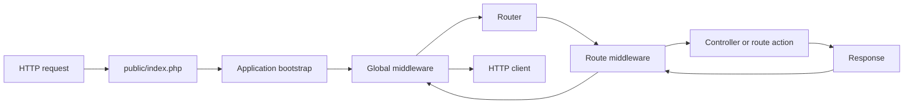

<TLDR>
  <TLDRCell label="what">
    Laravel is a full-stack PHP web framework that puts routing, middleware, dependency resolution, validation, database access, and response generation into one application lifecycle.
  </TLDRCell>
  <TLDRCell label="when">
    Laravel fits services that need conventional HTTP entry points, database models, background work, and automated tests, when the team accepts framework conventions.
  </TLDRCell>
  <TLDRCell label="how">
    Parse requests at the entry point, let the container supply dependencies, enforce input and authorization boundaries, then let domain services and Eloquent work inside explicit transactions.
  </TLDRCell>
</TLDR>

## What it is and why it exists

Laravel is a web application framework that runs on PHP. It is more than a router: it places HTTP handling, configuration, logging, caching, queues, templates, databases, and testing behind one bootstrap and extension model. You normally receive requests through `public/index.php`, declare entry points under `routes/`, put application code under `app/`, and use Artisan commands for development and operations.

The framework removes repeated integration work. Without shared conventions, every application must decide how to construct objects, turn exceptions into responses, run middleware, and manage database connections. Laravel supplies defaults while allowing an application to replace behavior through service providers, container bindings, middleware, and events.

Laravel's <Term id="service-container">service container</Term> stores bindings and constructs objects. <Term id="dependency-injection">Dependency injection</Term> lets controllers, route actions, commands, and jobs declare the objects they need instead of scattering `new` calls or global state through business code. Concrete classes usually support zero-configuration resolution, while interfaces need a binding to an implementation.

Eloquent is Laravel's object-relational mapping layer. A model usually corresponds to a table and combines query construction, relationships, casting, and persistence operations. It suits application code organized around records, but a model does not decide authorization, transaction boundaries, or public response fields for you.

You meet Laravel in server-rendered sites, JSON APIs, background jobs, and applications that combine these workloads. A complete application lifecycle may exceed the needs of a tiny stateless handler. Once a system uses Laravel, however, its container, request object, and testing tools are usually more consistent than a second infrastructure layer.

## How it works

An HTTP request first reaches the front controller, then Laravel creates the application and hands the request to the HTTP kernel. The kernel runs bootstrappers, loads service providers, and sends the request through global and route middleware. The router matches the method and URI, resolves parameters and dependencies, invokes the action, and lets the response unwind through middleware.



This path is why registration location and order have semantics. Resolving a singleton too early can capture incomplete configuration, authorization before authentication cannot see the user, and a static route placed after a broad dynamic route may never match. Laravel's convenient APIs do not remove these timing relationships.

### Bootstrap, providers, and the container

In Laravel 13, `bootstrap/app.php` configures routing, middleware, and exception handling, while `bootstrap/providers.php` lists application service providers. Each provider runs `register()` first; only after every provider has registered does Laravel enter `boot()`. Container bindings belong in `register()`, while startup behavior that depends on other registered services belongs in `boot()`.

The container uses reflection to resolve constructor parameters for concrete classes. If `CheckoutController` needs a concrete `QuoteService`, and that service's dependencies are also resolvable, no explicit binding is normally needed. If the constructor needs a `TaxRate` interface, the application must select an implementation and lifetime with `bind()`, `singleton()`, `scoped()`, or another binding form.

| Binding | Shared instance scope | Typical use |
| --- | --- | --- |
| `bind()` | A new instance per resolution | Stateless, cheap-to-create services |
| `singleton()` | Shared across the application process | Shared services with no request state |
| `scoped()` | One request or job lifecycle | State that must reset in long-running processes |
| `instance()` | Uses the supplied object | Infrastructure already constructed at bootstrap |

A binding lifetime is an ownership decision, not a performance decoration. Traditional PHP-FPM often discards in-process state after a request, but Octane and queue workers serve multiple requests or jobs. Storing the current user, tenant, or request in a singleton lets later work observe stale state.

A facade offers static-looking syntax, but most facades forward calls to objects in the container. That is convenient for short framework-boundary calls, yet it can hide dependencies. Prefer constructor injection in domain services whose ownership should be explicit or whose implementations need to be replaced in unit tests.

### Routes, middleware, and parameters

A route maps an HTTP method and URI pattern to a closure or controller action. Named routes decouple URL generation from the physical path, while route groups collect common prefixes, names, and middleware. A parameter constraint can turn the wrong shape into a `404` before the controller, but a shape match does not prove that a resource exists or that the caller may access it.

<Term id="middleware">Middleware</Term> wraps downstream handling for cross-cutting behavior such as authentication, rate limiting, sessions, CSRF protection, or response headers. Requests flow inward in declared order and responses flow outward in reverse order. Middleware suits protocol policy; it should not become a warehouse for business rules that are difficult to reuse and test.

<Term id="route-model-binding">Route model binding</Term> can resolve an `{order}` parameter to an `Order` model and automatically return `404` when no record exists. Scoped bindings can constrain parent-child relationships for nested resources, but model binding still is not authorization. A policy or gate must decide whether the current user may act on the resolved object.

The container invokes controller methods and route closures, so their signatures can declare the request, service dependencies, and route parameters together. Parameter names, types, and route placeholders must agree. Generated code often mixes `{order}` in the path with `$orderId` in the action, leading to incorrect resolution or bypassed model binding.

### Validation, domain rules, and persistence

`$request->validate()` fits short rule sets; a Form Request can encapsulate `authorize()`, `rules()`, and input preparation for a more involved entry point. On validation failure, a traditional web request normally receives a redirect with session errors, while a request expecting JSON receives a `422` response. Tests must cross the HTTP boundary because a direct controller call does not reproduce those branches.

Structural validation only says whether input can be parsed and whether fields satisfy local constraints. Domain invariants such as sufficient stock, valid state transitions, or tenant ownership still belong in application services and database constraints. Authorization also remains separate: “the ID exists” and “this user may act on the ID” are different conditions.

Eloquent <Term id="mass-assignment">mass assignment</Term> accepts an array in `create()`, `fill()`, or `update()`. A model uses `$fillable` or `$guarded` to choose which keys may be written that way, but direct property assignment bypasses this protection. Build write arrays from validated fields instead of handing `$request->all()` to a model.

Relationship properties may query lazily, so one property access in a view or resource transformer can silently issue SQL. <Term id="eager-loading">Eager loading</Term> with `with()` or `load()` fetches known relationships in batches. Verify the fix against the real access path and query count, not merely by seeing `with()` somewhere in the code.

## Examples

These three examples share an order domain and progress through container resolution, HTTP validation, and an Eloquent write boundary. They ran in a fresh Laravel 13.10.1 application skeleton with Laravel framework package 13.30.1 and PHP 8.3.33 CLI.

### Replace an implementation through the container

The first script binds a tax-rate interface to a fixed implementation, then lets the container resolve `QuoteService` automatically. Run it from a Laravel project root so it can load Composer and the application bootstrap file.

<Depth level="quick">

```php title="container_quote.php"
<?php
declare(strict_types=1);

require __DIR__.'/vendor/autoload.php';
$app = require __DIR__.'/bootstrap/app.php';

interface TaxRate
{
    public function percentFor(string $country): int;
}

final class FixedTaxRate implements TaxRate
{
    public function percentFor(string $country): int
    {
        return $country === 'FR' ? 20 : 0;
    }
}

final class QuoteService
{
    public function __construct(private TaxRate $taxRate) {}

    public function total(int $subtotalCents, string $country): int
    {
        return $subtotalCents + intdiv($subtotalCents * $this->taxRate->percentFor($country), 100);
    }
}

$app->bind(TaxRate::class, FixedTaxRate::class);
$first = $app->make(QuoteService::class);
$second = $app->make(QuoteService::class);

echo $first->total(2000, 'FR'), "\n";
echo $first === $second ? "same\n" : "different\n";
```

```text
2400
different
```

</Depth>

The interface needs a binding, while the container constructs concrete `QuoteService` from its constructor. `bind()` is transient and `QuoteService` itself is not registered as shared, so the two `make()` calls return distinct objects.

Before changing `QuoteService` to a singleton, establish that it and its full dependency graph hold no request state. Tests should override the same abstract interface in the container instead of adding branches to the service that exist only for tests.

### Observe real validation responses

The second script boots the HTTP kernel, registers a route, and submits two requests to the same pipeline as the production entry point. `Accept: application/json` makes validation failure consistently produce a JSON `422` instead of a browser redirect.

```php title="http_validation.php"
<?php
declare(strict_types=1);

require __DIR__.'/vendor/autoload.php';

use Illuminate\Http\Request;
use Illuminate\Contracts\Http\Kernel;
use Illuminate\Support\Facades\Route;

$app = require __DIR__.'/bootstrap/app.php';
$kernel = $app->make(Kernel::class);
$kernel->bootstrap();

Route::post('/orders', function (Request $request) {
    $data = $request->validate([
        'sku' => ['required', 'string', 'max:20'],
        'quantity' => ['required', 'integer', 'min:1'],
    ]);

    return response()->json([
        'accepted' => $data['sku'],
        'quantity' => $data['quantity'],
    ], 201);
});

$payloads = [
    ['sku' => 'BK-104', 'quantity' => 2],
    ['sku' => 'BK-104', 'quantity' => 0],
];

foreach ($payloads as $payload) {
    $request = Request::create('/orders', 'POST', $payload, server: [
        'HTTP_ACCEPT' => 'application/json',
    ]);
    $response = $kernel->handle($request);
    echo $response->getStatusCode().' '.$response->getContent()."\n";
    $kernel->terminate($request, $response);
}
```

```text
201 {"accepted":"BK-104","quantity":2}
422 {"message":"The quantity field must be at least 1.","errors":{"quantity":["The quantity field must be at least 1."]}}
```

<TryToBreak items={['a missing sku field', 'quantity set to the string two', 'a client requesting text/html']} />

The first request passes the rules and returns `201`; the second is turned into a `422` by a validation exception before the route closure completes. The error body came from the actual Laravel 13 English language resources, so the original English message is preserved here.

This proves only that the transport boundary works. A real order endpoint also needs authentication, object-level authorization, stock rules, an idempotency policy, and a transaction. A validator accepting two fields does not make the request a trusted command.

### Reject unknown Eloquent write fields

The third script performs real Eloquent model filling and casting without connecting to a database. With silent-discard protection enabled for development, an input field outside the mass-assignment allowlist raises an exception.

```php title="eloquent_boundary.php"
<?php
declare(strict_types=1);

require __DIR__.'/vendor/autoload.php';

use Illuminate\Database\Eloquent\MassAssignmentException;
use Illuminate\Database\Eloquent\Model;

final class OrderData extends Model
{
    public $timestamps = false;
    protected $fillable = ['reference', 'quantity'];

    protected function casts(): array
    {
        return ['quantity' => 'integer'];
    }
}

Model::preventSilentlyDiscardingAttributes();

try {
    new OrderData(['reference' => 'A-17', 'quantity' => '2', 'status' => 'paid']);
} catch (MassAssignmentException $error) {
    echo $error::class."\n";
}

$order = new OrderData(['reference' => 'A-17', 'quantity' => '2']);
echo json_encode($order->toArray(), JSON_THROW_ON_ERROR)."\n";
```

```text
Illuminate\Database\Eloquent\MassAssignmentException
{"reference":"A-17","quantity":2}
```

`status` is absent from `$fillable`, so the first construction is rejected. The second passes only allowed fields, and the model cast changes `quantity` from a string to an integer. This protection exposes field drift but does not replace request validation, authorization, or database constraints.

Production code normally calls `validated()` or `safe()->only()` on a Form Request, then explicitly assembles the fields the model needs. A public response should likewise use an API Resource or explicit mapping so that adding a model column does not expand the external contract.

## Pitfalls

### Treating validation as authorization

> [!PITFALL]
> A route parameter resolving to a model and request fields passing rules do not mean the current user may read or modify the object. Generated code often stops at `findOrFail()`, letting any authenticated user try IDs from another tenant.

**Fix:** constrain the query by tenant or owner and enforce object authorization with a policy, gate, or Form Request `authorize()` method. A feature test should use at least two users and prove that the second receives `403`, or `404` when hiding existence is intentional.

### Passing the whole request to Eloquent

> [!PITFALL]
> `$model->update($request->all())` turns every transport key into a candidate write. Even if today's `$fillable` list happens to be safe, a later fillable field can expose a privilege, price, or state transition.

**Fix:** select allowed fields from the `validated()` result and derive server-owned fields from authenticated context and domain rules. Add negative tests for sensitive fields and enable silent-discard protection locally to expose misspellings and field drift.

### Storing request state in a singleton

> [!PITFALL]
> Caching the current user, request, or tenant in a `singleton()` may appear harmless under a short PHP-FPM lifecycle. Once Octane or a queue worker reuses the application, that state can leak across requests or jobs.

**Fix:** keep shared services free of request state, use `scoped()` for values shared only within one work cycle, or pass context explicitly to the method. Test two tenants consecutively in the same process and prove the state resets.

### Triggering N+1 in a view or resource

> [!PITFALL]
> A controller may execute only one `Order::paginate()`, while `$order->customer->name` inside a template loop issues another query for every order. Resource serialization, logging, and debug output can trigger relationship access too.

**Fix:** eager-load relationships for the actual read path, constrain columns and page size, and record query counts in tests. Do not preload every relation blindly; an unbounded collection trades a query problem for a memory problem.

### Reading `env()` after configuration is cached

> [!PITFALL]
> Generated code often calls `env('PAYMENT_KEY')` in a controller or service. After `config:cache`, Laravel no longer loads the `.env` file, so application code may receive `null` or a different value from the external system environment.

**Fix:** read `env()` only in `config/*.php`, then access values through `config()` or an injected configuration object. A deployment test should boot with configuration caching enabled and fail clearly when required configuration is missing.

<Depth level="deep">

## Binding lifetimes and long-running processes

### Resolution is not service location

Constructor injection puts dependencies in the class's public construction contract. A reviewer can see what the object needs, and a test can construct replacement implementations. Calling `app(SomeService::class)` everywhere instead turns the container into a service locator whose dependency appears only when execution reaches that line.

Not every facade or helper must disappear. Routes, framework adapters, and one-off entry-point code are already coupled to Laravel. Domain rules that accept ordinary values and narrow interfaces are easier to reuse across CLI, queue, and HTTP execution. Using the framework at the boundary while keeping dependencies explicit behind it is more useful than banning facades.

Contextual binding can resolve the same interface to different implementations for different consumers. It fits a genuine policy difference, such as a batch process using an offline exchange-rate source and an HTTP quote using an online source. If many classes need exceptional bindings, the interface is probably too broad or the module boundary is unclear.

### The request-scope boundary

`scoped()` shares an instance during one Laravel application lifecycle and flushes it when an Octane worker starts a new request or a queue worker starts a new job. It fits an object that may be shared within a unit of work but never across units. Scope does not make the object thread-safe or clean up external resources automatically.

Static properties, global arrays, and third-party singletons are outside container scope. Even if the binding refreshes per request, an internal static cache may still leak tenant data. A long-running-process review must follow shared state through the object graph instead of checking one provider declaration.

Termination callbacks and the outward half of middleware also belong to the request lifecycle. Streaming responses, client disconnects, and exceptions can change their timing, so locks, transactions, and file handles that must be released promptly should not rely on process exit. Their owner needs `finally` or an explicit close protocol.

## Route and data boundaries

### Model binding, scoped binding, and policies

Implicit model binding resolves a model from its parameter name and type. A custom key can use `{post:slug}` or the model's `getRouteKeyName()`, and soft-deleted records are excluded by default. Changing the lookup key affects the URL contract and indexing needs, not just controller syntax.

Without scoping, both models in `/users/{user}/posts/{post}` can exist while having no parent-child relationship. Scoped binding can resolve the child through the parent's relationship and reject an invalid pairing, but policies still decide the caller's permissions on each object. Data relationships and access rights need separate models.

Route caching requires registrations that can be serialized and loaded consistently. Running `route:list` before deployment exposes order, names, middleware, and parameter mistakes, while `route:cache` exposes incompatible registration patterns. One successful URL is not evidence that the route table is correct.

### Write boundaries and transactions

Form Request `validated()` returns data that passed declared rules; it cannot guarantee business facts that those rules never stated. An application service should reread records that need locking, check state transitions, and write orders, lines, and audit events inside a transaction. Database unique, foreign-key, and check constraints form the final boundary shared by every writer.

A transaction covers database work on the same connection. Sending mail, calling a payment gateway, or dispatching immediately executed work does not roll back with it. Work that must begin after commit can use the appropriate after-commit mechanism. Cross-system consistency needs idempotent consumers, an outbox, or compensation, not an imaginary distributed transaction.

Eloquent `save()`, `create()`, and relationship writes may each issue SQL. Putting the calls inside one closure does not start a transaction; code must use the database transaction API explicitly. Exceptions must continue outward or become an unambiguous failure result, or an outer boundary can mistake the operation for success.

### Query shape and serialization

`with()` arranges relationship loading with the main query, while `load()` adds relationships to models already retrieved. Both must match the access path. Loading only `lines` still produces a nested N+1 when a resource reads `lines.product`. Enabling lazy-loading prevention in development exposes omissions earlier.

Eager loading does not prove that a query is optimal. Large result sets still need pagination, aggregates should usually be computed by the database, and an existence check does not need a complete collection. Measure with a fixed data shape, query log, and response budget instead of treating “N+1 became two queries” as a universal performance claim.

An API Resource can control fields, relationships, and conditional output, but it executes every PHP access it contains. Reading an unloaded relationship inside a resource can still query; returning a model directly can also change the contract when `$visible`, `$hidden`, or columns change. Assert the complete response shape and explicitly assert that sensitive fields are absent.

## Testing a complete request slice

Laravel HTTP tests can submit in-process requests to the application and cover routing, middleware, validation, controllers, and response transformation. They are closer to the public contract than direct controller calls and make exact status, JSON, and database assertions easier than browser-only tests. Unit tests still fit framework-independent domain objects; the two test types have different jobs.

A write path should cover success, validation failure, unauthenticated access, forbidden access, and a missing resource. Multi-tenant systems also need real records from two tenants so a convenient fixture does not accidentally share one owner. Database assertions should prove both that the intended record exists and that the unauthorized record did not change.

A query regression test must execute the serialization or template code used in production. Retrieving the model returned by a controller without reading its relationships misses N+1 work during rendering. Fix page size and fixture relationship counts before recording query totals so the threshold remains comparable.

Replace external services at an injected interface or with the framework's fake, and prevent stray real requests by default. Assert both the requests that were issued and the extra calls that did not occur. A database rollback cannot recall an operation already sent to an external system, so failure-path tests need to represent that boundary.

Database reset helpers isolate records, not process-global state. A test that changes a facade fake, model strictness flag, clock, locale, or container instance must restore it after the assertion. Otherwise a later test may pass or fail only because of execution order.

Test data should express ownership and state explicitly. Factories that silently attach every order to the same default user make authorization defects harder to see, while randomized values can make a failure difficult to reproduce. Named factory states and fixed boundary values keep the scenario readable.

Framework helpers reduce setup, but assertions still need to describe the public contract. Prefer exact status and selected JSON structure over a broad successful-response assertion, and pair positive fields with absence checks for secrets and internal columns.

Finally, run the same cache and process modes as deployment. Configuration caching, route caching, queue retries, and Octane state reuse expose defects that an ordinary one-request test process cannot. Publishable evidence is execution on the target Laravel and PHP versions, not a generator's memory of the API.

</Depth>

<Checkpoint id="backend/php-laravel" />

## Further reading

- [Laravel 13 request lifecycle](https://laravel.com/docs/13.x/lifecycle)
- [Laravel 13 service container](https://laravel.com/docs/13.x/container)
- [Laravel 13 routing](https://laravel.com/docs/13.x/routing)
- [Laravel 13 validation](https://laravel.com/docs/13.x/validation)
- [Laravel 13 Eloquent ORM](https://laravel.com/docs/13.x/eloquent)
- [Laravel 13 HTTP tests](https://laravel.com/docs/13.x/http-tests)
