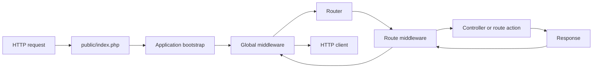

<TLDR>
  <TLDRCell label="what">
    Laravel 是全栈 PHP Web 框架，把路由、中间件、依赖解析、验证、数据库访问和响应生成组织在同一套应用生命周期中。
  </TLDRCell>
  <TLDRCell label="when">
    当服务需要约定明确的 HTTP 入口、数据库模型、后台任务和自动化测试，并且团队接受框架约定时，Laravel 很合适。
  </TLDRCell>
  <TLDRCell label="how">
    让入口层解析请求，把依赖交给容器，把输入与授权挡在边界，再让领域服务和 Eloquent 在明确事务中完成工作。
  </TLDRCell>
</TLDR>

## 是什么，为什么存在

Laravel 是运行在 PHP 上的 Web 应用框架。它不只是一个路由库，而是把 HTTP 处理、配置、日志、缓存、队列、模板、数据库与测试能力放进统一的启动和扩展模型。你通常从 `public/index.php` 接收请求，在 `routes/` 声明入口，在 `app/` 放应用代码，并通过 Artisan 命令执行开发和运维任务。

框架解决的是重复的集成工作。没有统一约定时，每个应用都要自行决定怎样创建对象、怎样把异常变成响应、怎样执行中间件，以及怎样管理数据库连接。Laravel 提供默认结构，同时允许应用通过服务提供者、容器绑定、中间件和事件替换具体行为。

Laravel 的 <Term id="service-container">服务容器（service container）</Term>负责保存绑定并创建对象。<Term id="dependency-injection">依赖注入（dependency injection）</Term>让控制器、路由处理器、命令和任务声明自己需要的对象，而不是在业务代码中到处调用 `new` 或读取全局状态。具体类通常可以零配置解析，接口则需要绑定到实现。

Eloquent 是 Laravel 的对象关系映射层。每个模型通常对应一张表，并同时提供查询构建、关系、类型转换与持久化操作。它适合围绕记录工作的应用代码，但模型并不会替你决定授权、事务边界或公开响应字段。

你会在需要服务端渲染页面、JSON API、后台任务或这些能力组合时遇到 Laravel。若只需要一个极小的无状态处理器，完整应用生命周期可能超过需求；若系统已经采用 Laravel，它的容器、请求对象和测试工具通常比另建一套基础设施更一致。

## 工作原理

一个 HTTP 请求先进入前端控制器，再由 Laravel 创建应用并交给 HTTP 内核。内核运行启动器、加载服务提供者，并把请求送入由全局和路由中间件组成的管道。路由器匹配方法与 URI，解析参数和依赖，调用处理器，再让响应沿中间件反向返回。



这条路径解释了为什么注册位置和顺序具有语义。过早解析单例可能取得尚未完成的配置，在认证中间件之前做授权拿不到用户，放在宽泛动态路由之后的静态路由可能永远匹配不到。Laravel 的便利 API 没有取消这些时序关系。

### 启动、提供者与容器

Laravel 13 的 `bootstrap/app.php` 配置路由、中间件和异常处理，`bootstrap/providers.php` 列出应用服务提供者。每个提供者先执行 `register()`，所有提供者注册完成后才进入 `boot()`。容器绑定属于 `register()`；依赖其他已注册服务的启动行为属于 `boot()`。

容器用反射解析具体类的构造参数。若 `CheckoutController` 依赖具体的 `QuoteService`，而后者的依赖也可解析，通常不需要显式绑定。若构造器依赖 `TaxRate` 接口，应用必须用 `bind()`、`singleton()`、`scoped()` 或其他绑定形式说明实现和生命周期。

| 绑定形式 | 同一实例的范围 | 典型用途 |
| --- | --- | --- |
| `bind()` | 每次解析创建 | 无状态、创建成本低的服务 |
| `singleton()` | 应用进程内共享 | 真正无请求状态的共享服务 |
| `scoped()` | 一个请求或任务生命周期 | 需要在长驻进程中按周期重置的状态 |
| `instance()` | 使用给定对象 | 启动时已经构造好的基础设施对象 |

绑定生命周期是所有权决定，不是性能装饰。传统 PHP-FPM 往往在请求结束后丢弃进程内状态，但 Octane 和队列工作进程会处理多个请求或任务。把当前用户、租户或请求对象留在单例中，会让下一次工作看到旧状态。

Facade 提供看似静态的调用语法，但大多数 Facade 会把调用转发给容器中的对象。它便于框架边界处的简短调用，却也可能隐藏依赖。需要单元替换或明确所有权的领域服务，优先使用构造器注入。

### 路由、中间件与参数

路由把 HTTP 方法与 URI 模式映射到闭包或控制器动作。命名路由把 URL 生成与实际路径解耦，路由组集中共享前缀、名称和中间件。约束参数格式可以让错误形状在进入控制器前得到 `404`，但格式匹配不等于资源存在或调用方有权访问。

<Term id="middleware">中间件（middleware）</Term>包裹后续处理器，用于认证、限流、会话、CSRF 防护或响应头等横切行为。请求按声明顺序向内流动，响应按相反顺序向外流动。中间件适合协议级政策，不应成为难以复用和测试的业务规则仓库。

<Term id="route-model-binding">路由模型绑定（route model binding）</Term>可以把 `{order}` 参数解析成 `Order` 模型，找不到时自动返回 `404`。嵌套资源可以使用作用域绑定限制父子关系，但模型绑定本身仍不是授权检查。策略或 Gate 必须判断当前用户能否对已经解析的对象执行操作。

控制器动作和路由闭包由容器调用，因此可以在签名中同时声明请求对象、服务依赖和路由参数。参数名、类型及路由占位符必须一致；生成代码常把路径中的 `{order}` 与动作中的 `$orderId` 混用，导致错误解析或绕开模型绑定。

### 验证、领域规则与持久化

`$request->validate()` 适合短规则；复杂入口可以用 Form Request 封装 `authorize()`、`rules()` 和输入预处理。验证失败时，传统 Web 请求通常得到重定向和错误会话，期望 JSON 的请求得到 `422` 响应。测试必须走真实 HTTP 边界，因为直接调用控制器不会复现这些分支。

结构验证只回答输入能否解析，以及字段是否满足局部约束。库存是否充足、状态能否转换、账户是否属于租户等领域不变量仍要由应用服务和数据库约束维护。授权也必须独立检查；「ID 存在」和「当前用户可操作该 ID」不是同一个条件。

Eloquent 的 <Term id="mass-assignment">批量赋值（mass assignment）</Term>允许把数组交给 `create()`、`fill()` 或 `update()`。模型通过 `$fillable` 或 `$guarded` 决定哪些键可被批量写入，但直接给属性赋值不受这套保护。安全边界应从已验证字段构造写入数组，而不是把 `$request->all()` 交给模型。

关系属性默认可以惰性查询，这使视图或资源转换器中的一次属性访问悄悄发出 SQL。使用 <Term id="eager-loading">预加载（eager loading）</Term>的 `with()` 或 `load()` 可以批量取得已知需要的关系。是否修复成功要看真实访问路径和查询数量，而不只是代码里出现了 `with()`。

## 示例

三个示例使用同一个订单背景，依次展示容器解析、HTTP 验证和 Eloquent 写入边界。它们在一个全新的 Laravel 13.10.1 应用骨架中运行，实际安装的框架包是 Laravel 13.30.1，CLI 为 PHP 8.3.33。

### 用容器替换实现

第一个脚本把税率接口绑定到固定实现，再让容器自动解析 `QuoteService`。脚本从 Laravel 项目根目录运行，因此可以加载 Composer 和应用启动文件。

<Depth level="quick">

```php title="container_quote.php"
<?php
declare(strict_types=1);

require __DIR__.'/vendor/autoload.php';
$app = require __DIR__.'/bootstrap/app.php';

interface TaxRate
{
    public function percentFor(string $country): int;
}

final class FixedTaxRate implements TaxRate
{
    public function percentFor(string $country): int
    {
        return $country === 'FR' ? 20 : 0;
    }
}

final class QuoteService
{
    public function __construct(private TaxRate $taxRate) {}

    public function total(int $subtotalCents, string $country): int
    {
        return $subtotalCents + intdiv($subtotalCents * $this->taxRate->percentFor($country), 100);
    }
}

$app->bind(TaxRate::class, FixedTaxRate::class);
$first = $app->make(QuoteService::class);
$second = $app->make(QuoteService::class);

echo $first->total(2000, 'FR'), "\n";
echo $first === $second ? "same\n" : "different\n";
```

```text
2400
different
```

</Depth>

接口需要绑定，具体的 `QuoteService` 则由容器根据构造器自动创建。`bind()` 是瞬态绑定，而且 `QuoteService` 自身也没有注册为共享实例，所以两次 `make()` 返回不同对象。

若把 `QuoteService` 改成单例，先确认它及其整个依赖图都不保存请求状态。测试替换接口实现时，应通过容器覆盖同一个抽象类型，而不是在服务内部加入只为测试存在的条件分支。

### 观察真实的验证响应

第二个脚本启动 HTTP 内核，注册一条路由，再把两个请求交给与生产入口相同的处理链。`Accept: application/json` 让验证失败稳定表现为 JSON `422`，而不是浏览器重定向。

```php title="http_validation.php"
<?php
declare(strict_types=1);

require __DIR__.'/vendor/autoload.php';

use Illuminate\Http\Request;
use Illuminate\Contracts\Http\Kernel;
use Illuminate\Support\Facades\Route;

$app = require __DIR__.'/bootstrap/app.php';
$kernel = $app->make(Kernel::class);
$kernel->bootstrap();

Route::post('/orders', function (Request $request) {
    $data = $request->validate([
        'sku' => ['required', 'string', 'max:20'],
        'quantity' => ['required', 'integer', 'min:1'],
    ]);

    return response()->json([
        'accepted' => $data['sku'],
        'quantity' => $data['quantity'],
    ], 201);
});

$payloads = [
    ['sku' => 'BK-104', 'quantity' => 2],
    ['sku' => 'BK-104', 'quantity' => 0],
];

foreach ($payloads as $payload) {
    $request = Request::create('/orders', 'POST', $payload, server: [
        'HTTP_ACCEPT' => 'application/json',
    ]);
    $response = $kernel->handle($request);
    echo $response->getStatusCode().' '.$response->getContent()."\n";
    $kernel->terminate($request, $response);
}
```

```text
201 {"accepted":"BK-104","quantity":2}
422 {"message":"The quantity field must be at least 1.","errors":{"quantity":["The quantity field must be at least 1."]}}
```

<TryToBreak items={['缺少 sku 字段', 'quantity 是字符串 two', '客户端要求 text/html']} />

第一个请求通过规则并返回 `201`；第二个请求在路由闭包完成前被验证异常转换成 `422`。错误正文由实际 Laravel 13 英文语言资源生成，因此这里保留原始英文消息。

这段代码只证明传输边界工作正常。真正的下单入口还需要认证、对象级授权、库存规则、幂等政策和事务；不能因为验证器接受两个字段，就把请求当成可信命令。

### 让 Eloquent 拒绝未知写入字段

第三个脚本不连接数据库，而是执行真实 Eloquent 模型的填充与类型转换。开发环境开启静默丢弃防护后，批量输入中的非白名单字段会抛出异常。

```php title="eloquent_boundary.php"
<?php
declare(strict_types=1);

require __DIR__.'/vendor/autoload.php';

use Illuminate\Database\Eloquent\MassAssignmentException;
use Illuminate\Database\Eloquent\Model;

final class OrderData extends Model
{
    public $timestamps = false;
    protected $fillable = ['reference', 'quantity'];

    protected function casts(): array
    {
        return ['quantity' => 'integer'];
    }
}

Model::preventSilentlyDiscardingAttributes();

try {
    new OrderData(['reference' => 'A-17', 'quantity' => '2', 'status' => 'paid']);
} catch (MassAssignmentException $error) {
    echo $error::class."\n";
}

$order = new OrderData(['reference' => 'A-17', 'quantity' => '2']);
echo json_encode($order->toArray(), JSON_THROW_ON_ERROR)."\n";
```

```text
Illuminate\Database\Eloquent\MassAssignmentException
{"reference":"A-17","quantity":2}
```

`status` 不在 `$fillable` 中，所以第一次构造被拒绝。第二次只传允许字段，`quantity` 又通过模型转换从字符串变为整数。防护能暴露字段漂移，但不能替代请求验证、授权或数据库约束。

生产代码通常在 Form Request 上调用 `validated()` 或 `safe()->only()`，再显式组装模型所需字段。公开响应也应使用 API Resource 或明确字段映射，避免 `toArray()` 随模型新增列而扩大外部契约。

## 陷阱

### 把验证当作授权

> [!PITFALL]
> 路由参数能转换成模型、请求字段也通过规则，并不表示当前用户可以读取或修改该对象。生成代码常只调用 `findOrFail()`，于是任何已认证用户都能尝试其他租户的 ID。

**修复方法：** 在查询中限定租户或所有者，并通过 Policy、Gate 或 Form Request 的 `authorize()` 执行对象级授权。功能测试至少使用两个用户，证明第二个用户得到 `403` 或不泄露存在性的 `404`。

### 把整个请求交给 Eloquent

> [!PITFALL]
> `$model->update($request->all())` 把传输对象的所有键变成候选写入。即使当前 `$fillable` 恰好安全，之后新增可填充字段也可能让权限、价格或状态进入攻击面。

**修复方法：** 只从 `validated()` 结果选择允许字段，服务端字段由认证上下文和领域规则计算。为敏感字段写负向测试，并在本地环境开启静默丢弃防护以发现拼写错误和字段漂移。

### 用单例保存请求状态

> [!PITFALL]
> 把当前用户、请求或租户缓存进 `singleton()`，在 PHP-FPM 的短生命周期中可能暂时看不出问题；Octane 或队列工作进程复用应用后，状态会跨请求或任务泄漏。

**修复方法：** 让共享服务保持无请求状态，需要周期内复用时使用 `scoped()`，或者在方法调用时显式传入上下文。用同一进程连续处理两个租户的测试验证状态已经重置。

### 在模板或资源中触发 N+1

> [!PITFALL]
> 控制器只执行一次 `Order::paginate()`，但模板循环中的 `$order->customer->name` 可能为每个订单再查询一次。序列化器、日志和调试输出同样会触发关系访问。

**修复方法：** 根据真实读取路径预加载关系，限制列和分页大小，并在测试中记录查询数量。不要盲目预加载所有关系；无界集合会把查询问题换成内存问题。

### 在配置缓存后直接读取 `env()`

> [!PITFALL]
> 生成代码常在控制器或服务中调用 `env('PAYMENT_KEY')`。执行 `config:cache` 后，Laravel 不再加载 `.env` 文件，应用代码中的读取可能得到 `null` 或外部系统环境中的另一个值。

**修复方法：** 只在 `config/*.php` 中读取 `env()`，业务代码通过 `config()` 或注入的配置对象取得值。部署测试应在启用配置缓存后启动应用，并验证必需配置缺失时会明确失败。

## AI 时代

**生成代码在这里常犯的错**

模型会把 Laravel 10 或更早版本的 `app/Http/Kernel.php`、`RouteServiceProvider` 注册方式混进 Laravel 13 的精简骨架；也会生成 `$request->all()` 配合宽松 `$fillable`，把路由模型绑定误当成授权，或在资源循环中访问未预加载关系。另一类真实故障是把请求对象注入单例，代码在普通功能测试中通过，却在 Octane 或常驻队列工作进程中泄漏前一次请求状态。

**让 AI 检查**

- 根据 `composer.lock` 和实际目录结构，列出所有来自旧版 Laravel 教程的文件路径、注册点和 API。
- 从路由开始跟踪每个输入字段，标出验证、授权、领域规则、批量赋值和数据库约束分别发生的位置。
- 列出每个容器绑定的生命周期，并说明它在 Octane 请求或队列任务结束时是否重置。

**审查清单**

- 用未认证用户、其他租户用户、畸形 JSON 和额外敏感字段请求每个写入端点。
- 在真实资源序列化路径上断言状态码、公开字段、数据库变更和查询数量。
- 运行目标版本的路由列表、配置缓存和长驻进程测试，确认没有旧骨架假设或跨请求状态。

**提示词词汇**

使用准确术语：`request lifecycle`（请求生命周期）、`service container binding`（服务容器绑定）、`zero-configuration resolution`（零配置解析）、`scoped binding`（作用域绑定）、`route model binding`（路由模型绑定）、`Form Request`（表单请求）、`mass assignment`（批量赋值）、`eager loading`（预加载）和 `object-level authorization`（对象级授权）。要求模型给出输入到 SQL 的数据流和绑定生命周期表，比“写一个 Laravel CRUD”更容易暴露边界错误。

<Depth level="deep">

## 绑定生命周期与长驻进程

### 解析不是服务定位

构造器注入把依赖放在类的公开创建契约中。代码审查可以直接看到对象需要什么，测试也可以构造替代实现。到处调用 `app(SomeService::class)` 则把容器变成服务定位器，依赖只有运行到那一行才出现。

并非所有 Facade 或辅助函数都必须移除。路由、框架适配器和一次性的入口代码本来就与 Laravel 耦合；领域规则若只接收普通值和窄接口，更容易在 CLI、队列和 HTTP 之间复用。边界内使用框架，边界后保持依赖明确，是比禁止 Facade 更有用的判断标准。

上下文绑定可以让同一接口在不同消费者中解析到不同实现。它适合确有不同政策的场景，例如批处理使用离线汇率源，HTTP 报价使用在线源。若大量类都需要例外绑定，通常说明接口职责过宽或模块边界没有表达清楚。

### 请求作用域的边界

`scoped()` 在一次 Laravel 应用生命周期中共享实例，并在 Octane 新请求或队列工作进程处理新任务时刷新。它适合工作单元内共享而不能跨工作单元保存的对象。作用域不会自动让对象线程安全，也不会替你清理对象持有的外部资源。

静态属性、全局数组和第三方库单例不受容器作用域控制。即使绑定本身按请求刷新，内部静态缓存仍可能泄漏租户数据。长驻进程审查必须沿对象图继续跟踪共享状态，而不能只检查服务提供者中的一行绑定。

终止回调和中间件的响应后逻辑也属于请求生命周期。流式响应、客户端断开和异常路径可能改变执行时机，因此必须及时释放的锁、事务和文件句柄不应只依赖进程结束。所有者应使用 `finally` 或明确的关闭协议。

## 路由与数据边界

### 模型绑定、作用域绑定与策略

隐式模型绑定根据参数名和类型解析模型。自定义键可以使用 `{post:slug}` 或模型的 `getRouteKeyName()`，软删除记录默认不会被解析。改变查找键会影响 URL 契约和索引需求，不只是控制器写法。

嵌套路由 `/users/{user}/posts/{post}` 若没有作用域限制，两个模型可能分别存在却没有父子关系。作用域绑定可以让子模型通过父模型关系解析，减少错误组合，但当前调用方对父对象和子对象的操作权限仍由策略决定。数据关系与访问许可需要分别建模。

路由缓存要求注册的路由可以稳定序列化和加载。部署前运行 `route:list` 能发现顺序、名称、中间件和参数问题，`route:cache` 则能暴露不兼容的注册方式。不要根据一条成功的 URL 推断整个路由表正确。

### 写入边界与事务

Form Request 的 `validated()` 返回通过规则的数据，但规则未声明的业务事实不会凭空得到保证。应用服务应在事务内重新读取需要锁定的记录，检查状态转换，并写入订单、明细与审计事件。数据库的唯一约束、外键和检查约束是所有写入者共同经过的最后边界。

事务只覆盖同一个数据库连接上的数据库工作。发送邮件、调用支付网关或分发立即执行的任务不会随数据库回滚。需要提交后执行的工作可以使用相应的 after-commit 机制；需要跨系统一致性时，应设计幂等消费者、发件箱或补偿流程，而不是扩大一个不存在的分布式事务。

Eloquent 的 `save()`、`create()` 和关系写入各自都可能发出 SQL。把它们放进一个闭包并不会自动开启事务，必须显式使用数据库事务 API。异常还要继续向外传播或转换成失败结果，否则事务外层可能误判为成功。

### 查询形状与序列化

`with()` 在执行主查询时安排关系预加载，`load()` 为已经取得的模型补充关系。两者都需要与访问路径对应；嵌套资源读取 `lines.product` 时只加载 `lines` 仍会产生下一层 N+1。开启禁止惰性加载的开发策略可以更早暴露漏项。

预加载不等于查询已经最优。大结果集仍需分页，聚合值应尽量由数据库计算，只需要存在性时不必加载完整集合。性能结论应来自固定数据形状下的查询日志和响应预算，不能只用“从 N+1 变成两条查询”概括所有关系。

API Resource 可以控制字段、关系和条件输出，但它会执行其中访问的 PHP 代码。资源里访问未加载关系仍可能查询数据库，直接返回模型也可能随着 `$visible`、`$hidden` 或新列变化而改变契约。对响应做完整结构断言，并明确断言敏感字段不存在。

## 测试完整请求切片

Laravel 的 HTTP 测试可以在进程内向应用发送请求，覆盖路由、中间件、验证、控制器和响应转换。它比直接调用控制器更接近公开契约，也比只启动浏览器更容易精确断言状态、JSON 和数据库。单元测试仍适合不依赖框架的领域对象，两类测试承担不同职责。

一条写入路径至少要覆盖成功、验证失败、未认证、无权访问和资源不存在。多租户系统还要使用两个租户的真实记录，避免固定夹具恰好共享所有者。数据库断言要同时证明预期记录存在和越权记录没有变化。

查询回归测试必须执行生产会走的序列化或模板代码。只取得控制器返回的模型而不读取关系，会漏掉渲染阶段的 N+1。固定页大小和夹具关系数后记录查询数量，才能让阈值具有可比较意义。

外部服务应通过注入接口或 Laravel 提供的 fake 在边界替换，并默认阻止意外真实请求。测试同时断言发出的请求内容和未发生的额外调用。事务回滚无法撤销已经发送到外部系统的操作，这一点也要在失败路径测试中体现。

数据库重置辅助工具只隔离数据记录，不会重置进程全局状态。测试若修改 Facade fake、模型严格模式标志、时钟、语言环境或容器实例，就必须在断言后恢复。否则后续测试可能只因执行顺序不同而通过或失败。

测试数据应明确表达所有权和状态。工厂若把每个订单都悄悄关联到同一个默认用户，会掩盖授权缺陷；随机值则可能让失败难以复现。具名工厂状态和固定边界值能让场景保持清楚。

框架辅助工具减少了准备代码，但断言仍要描述公开契约。应断言精确状态和选定 JSON 结构，不要只检查宽泛的成功响应；检查正向字段时，还要同时确认秘密和内部列不存在。

最后运行与部署相同的缓存和进程模式。配置缓存、路由缓存、队列重试和 Octane 状态复用会暴露普通测试进程看不到的问题。可发布的证据是目标 Laravel 与 PHP 版本上的执行结果，而不是生成器对 API 的记忆。

</Depth>

<Checkpoint id="backend/php-laravel" />

## 延伸阅读

- [Laravel 13 请求生命周期](https://laravel.com/docs/13.x/lifecycle)
- [Laravel 13 服务容器](https://laravel.com/docs/13.x/container)
- [Laravel 13 路由](https://laravel.com/docs/13.x/routing)
- [Laravel 13 验证](https://laravel.com/docs/13.x/validation)
- [Laravel 13 Eloquent ORM](https://laravel.com/docs/13.x/eloquent)
- [Laravel 13 HTTP 测试](https://laravel.com/docs/13.x/http-tests)
