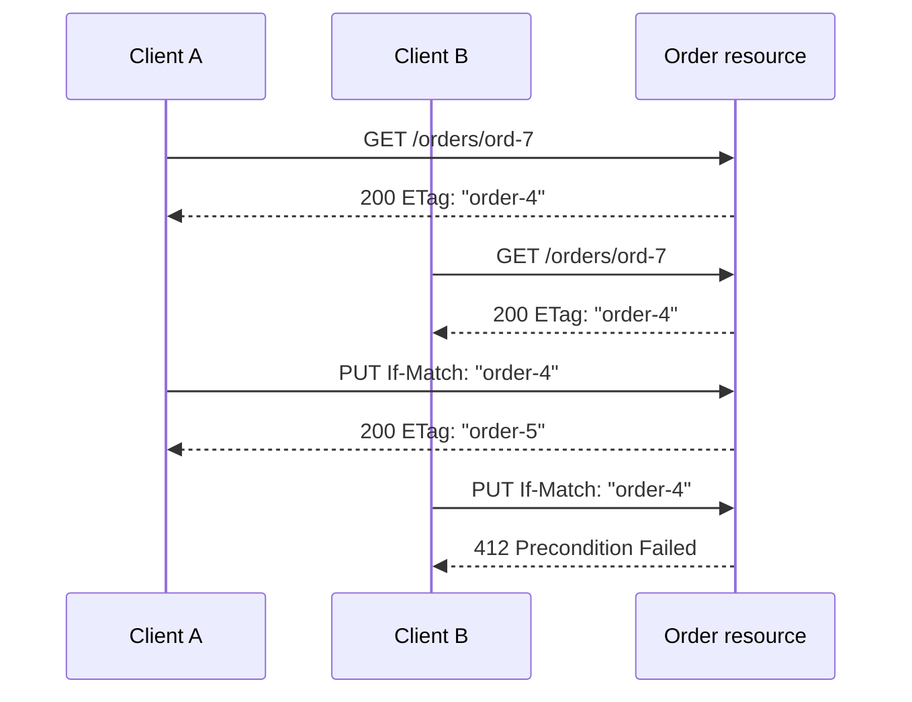

<TLDR>
  <TLDRCell label="what">
    A RESTful API models domain capabilities as resources, identifies them with URIs, and exchanges their representations through standard HTTP methods.
  </TLDRCell>
  <TLDRCell label="trap">
    Noun-based paths and JSON don't create REST semantics by themselves; unsafe `GET` handlers, ambiguous retries, and unconditional updates still break clients.
  </TLDRCell>
  <TLDRCell label="fix">
    Define resources, method semantics, and failures first, then add conditional requests, stable pagination, and idempotency keys and verify them at the real HTTP boundary.
  </TLDRCell>
</TLDR>

## What it is and why it exists

REST (Representational State Transfer) is an architectural style for networked applications, not a JSON format, a route-naming convention, or a framework. A RESTful API models addressable domain objects or capabilities as <Term id="resource">resources</Term>, and clients and servers exchange resource <Term id="representation">representations</Term> through a uniform interface. An order is a resource, and an order collection is another resource; JSON is only one possible representation of either.

This design addresses long-lived collaboration between clients and servers. HTTP already defines shared semantics for methods, status codes, caching, content negotiation, and conditional requests. When an API reuses them, clients, intermediaries, and monitoring tools don't need to guess a new protocol for every endpoint. A sound resource model also separates the public contract from database tables, controller names, and internal workflows.

You'll meet RESTful APIs in browser applications, mobile clients, partner integrations, and service-to-service HTTP interfaces. They fit systems centered on resource retrieval and state transitions that benefit from HTTP infrastructure. When a domain is dominated by low-latency remote calls, bidirectional streams, or strictly typed commands, gRPC or another RPC form can be more direct; choosing REST doesn't require every system to use it.

Strict REST also requires the uniform interface to drive state transitions through hypermedia. In practice, people often call a JSON API RESTful when it uses resource URIs, HTTP methods, and status codes even though clients know every route in advance. During review, state which constraints the team adopted instead of letting one label stand in for a testable contract.

## How it works

REST puts clients, servers, and intermediaries into one interaction model. A client sends a self-descriptive request, and the server returns a resource representation or result status; one request doesn't rely on a server retaining session context from an earlier request. Credentials, the target, preconditions, and other context needed to process the request travel with it, but the server still stores resources, authorization policy, and business data.

### The six architectural constraints

The REST constraints work together to define system behavior rather than forming a route-style checklist:

1. Client and server responsibilities are separated so each can evolve while the public interface stays stable.
2. Requests are stateless, and each request carries the context the server needs to understand it.
3. Responses declare their cacheability so clients and intermediary caches can safely reuse representations.
4. A uniform interface constrains interactions through resource identification, representations, self-descriptive messages, and hypermedia.
5. A layered system permits proxies, gateways, and caches between the client and origin without requiring the client to know each layer.
6. Code on demand optionally lets a server transfer executable code that extends a client; an ordinary JSON API need not use it.

Stateless doesn't mean "the server has no state," nor does it prohibit login. It means each request can be interpreted independently, perhaps by carrying a session token, instead of relying on one instance to remember hidden steps from earlier requests. A load balancer can then send a later request to another instance, although the token still needs authentication, authorization, and expiry checks.

### Resources, URIs, and methods

A URI identifies a resource, while the HTTP method expresses the operation on it. Collections and members commonly form relationships such as `/orders` and `/orders/{orderId}`. Query parameters filter, sort, paginate, or select a representation rather than conceal a second method system. Whether paths use singular or plural nouns is a team convention; consistency matters more than declaring either spelling a law of REST.

Not every verb-like path is wrong. A command such as cancelling an order can be modeled as a subordinate resource with its own audit record and lifecycle, for example `POST /orders/ord-7/cancellations`. Start by finding client-visible, identifiable state instead of exposing a controller function as `/cancelOrderNow`.

| Method | Safe | Idempotent by specification | Common use |
| --- | --- | --- | --- |
| `GET` | Yes | Yes | Retrieve a resource representation |
| `HEAD` | Yes | Yes | Retrieve the metadata corresponding to `GET` without transferring its body |
| `POST` | No | No | Ask the target to process a representation according to its own semantics, often adding a member to a collection |
| `PUT` | No | Yes | Create or completely replace the target resource state with the request representation |
| `PATCH` | No | Not guaranteed | Partially modify a resource according to a patch media type |
| `DELETE` | No | Yes | Remove the target resource's current mapping or state |

A safe method means the client didn't request a state change; incidental logging or accounting can still happen. <Term id="idempotency">Idempotency</Term> means repeated identical requests have the same intended server effect as one, not that every response is identical. A first `DELETE` returning `204` and a second returning `404` can therefore remain idempotent.

### Status codes and representation metadata

A status code describes the outcome of the HTTP operation, while the body provides machine-readable detail. `200` fits a successful response carrying a representation. `201` says a resource was created and commonly pairs with `Location`; `202` only says work was accepted, so it needs a way to inspect task state; `204` cannot carry a body. Client and server failures must not all be wrapped in `200`, because caches, retries, and monitoring would receive the wrong signal.

| Status | Contract meaning |
| --- | --- |
| `400 Bad Request` | The server cannot or will not process the request, for example because of syntax or framing errors |
| `401 Unauthorized` | The request lacks valid authentication credentials, usually with `WWW-Authenticate` in the response |
| `403 Forbidden` | The server understands the request but refuses authorization |
| `404 Not Found` | The target wasn't found, or the server chooses to conceal its existence |
| `405 Method Not Allowed` | The target doesn't support the method; the response must include `Allow` |
| `409 Conflict` | The request conflicts with current resource state in a way the client might resolve by changing the request |
| `412 Precondition Failed` | An HTTP precondition such as `If-Match` evaluated to false on the server |
| `422 Unprocessable Content` | The content syntax is correct, but its instructions can't be processed semantically |
| `429 Too Many Requests` | The client sent too many requests; `Retry-After` can suggest when to try again |

`Content-Type` identifies the media type of the current message body, while `Accept` states which response media types the client accepts. Cacheable responses also need correct `Cache-Control`, `ETag`, `Last-Modified`, and any required `Vary` fields. These headers are part of the contract, not decoration to add casually after deployment.

### Conditional update flow

When two clients read the same resource, an unconditional write can cause a lost update. An entity tag lets a client send the version of the representation it read as a write precondition. The server compares that version and changes the resource within one atomic write.



The comparison and update must share an atomic boundary. If the application reads a version and then saves with a separate unconditional statement, two requests can still pass the check together. A database version column, compare-and-swap operation, or single conditional update carries the HTTP precondition into persistence.

## Examples

These three examples use dependency-free JavaScript on Node 24 to model an HTTP boundary. They build from resource routing to conditional updates and retryable creation. A real service also needs input parsing, authentication, resource-level authorization, and persistence transactions in its adapters.

### Defining resource operations

The first handler separates a collection URI from a member URI and lets the method select the operation. Creation returns `201` and `Location`; an unsupported method returns `405` and `Allow`.

<Depth level="quick">

```javascript run title="order_resource.js"
const orders = new Map([
  ["ord-7", { id: "ord-7", status: "pending" }],
]);

function handle(request) {
  const [collection, id] = request.path.split("/").filter(Boolean);
  if (collection !== "orders") {
    return { status: 404, body: { title: "Not Found" } };
  }

  if (request.method === "GET" && id) {
    const order = orders.get(id);
    return order
      ? { status: 200, body: order }
      : { status: 404, body: { title: "Not Found" } };
  }

  if (request.method === "POST" && !id) {
    const order = { id: "ord-8", status: "pending", ...request.body };
    orders.set(order.id, order);
    return { status: 201, headers: { Location: `/orders/${order.id}` }, body: order };
  }

  return { status: 405, headers: { Allow: "GET, POST" }, body: null };
}

const found = handle({ method: "GET", path: "/orders/ord-7" });
const created = handle({ method: "POST", path: "/orders", body: { sku: "BK-42", quantity: 2 } });
const rejected = handle({ method: "DELETE", path: "/orders" });

console.log(`${found.status} ${JSON.stringify(found.body)}`);
console.log(`${created.status} ${created.headers.Location} ${JSON.stringify(created.body)}`);
console.log(`${rejected.status} ${rejected.headers.Allow}`);
```

```text
200 {"id":"ord-7","status":"pending"}
201 /orders/ord-8 {"id":"ord-8","status":"pending","sku":"BK-42","quantity":2}
405 GET, POST
```

<TryToBreak items={['reading a missing order', 'sending POST to a member URI', 'requesting an unknown collection']} />

</Depth>

This in-memory handler illustrates observable HTTP decisions; it isn't a production server. A real implementation must validate `sku` and `quantity`, check creation rights against the authenticated actor, and avoid treating a database record as the response representation. `Allow` should also come from actual resource capabilities instead of being scattered across branches.

### Preventing lost updates with `If-Match`

Both reads carry the same <Term id="entity-tag">entity tag</Term>. The first replacement advances the resource version. When the second client submits the stale tag, it receives `412` instead of overwriting committed state.

```javascript run title="conditional_update.js"
let order = { id: "ord-7", status: "pending", version: 4 };

function currentTag() {
  return `"order-${order.version}"`;
}

function readOrder() {
  return { status: 200, headers: { ETag: currentTag() }, body: { ...order } };
}

function replaceOrder(ifMatch, replacement) {
  if (ifMatch !== currentTag()) {
    return { status: 412, headers: { ETag: currentTag() }, body: { ...order } };
  }

  order = {
    id: order.id,
    status: replacement.status,
    version: order.version + 1,
  };
  return { status: 200, headers: { ETag: currentTag() }, body: { ...order } };
}

const clientA = readOrder();
const clientB = readOrder();
const firstWrite = replaceOrder(clientA.headers.ETag, { status: "shipped" });
const staleWrite = replaceOrder(clientB.headers.ETag, { status: "cancelled" });

console.log(`read ${clientA.headers.ETag}`);
console.log(`first write ${firstWrite.status} ${firstWrite.headers.ETag} ${firstWrite.body.status}`);
console.log(`stale write ${staleWrite.status} ${staleWrite.headers.ETag} ${staleWrite.body.status}`);
```

```text
read "order-4"
first write 200 "order-5" shipped
stale write 412 "order-5" shipped
```

The tag is an opaque validator; a client must not parse the internal `order-4` format. The example derives a strong tag from a version. In production, the service must ensure one strong tag denotes the same selected representation byte for byte and must compare the condition and update inside one transaction. A conflict response can also return the current tag or representation so the client can reread and decide whether to merge.

### Making creation safe to retry

HTTP doesn't define `POST` as idempotent, but an application can recognize one business attempt with an <Term id="idempotency-key">idempotency key</Term>. The server must also retain a request fingerprint. Reusing the same key with different input should fail instead of silently returning the first operation's result.

```javascript run title="idempotent_create.js"
const attempts = new Map();
let sequence = 40;

function createPayment(tenantId, key, input) {
  const scopedKey = `${tenantId}:${key}`;
  const fingerprint = JSON.stringify(input);
  const previous = attempts.get(scopedKey);

  if (previous) {
    if (previous.fingerprint !== fingerprint) {
      return { status: 409, replayed: false, error: "idempotency key reused with different input" };
    }
    return { ...previous.response, replayed: true };
  }

  const payment = {
    id: `pay-${++sequence}`,
    amount: input.amount,
    currency: input.currency,
  };
  const response = { status: 201, payment };
  attempts.set(scopedKey, { fingerprint, response });
  return { ...response, replayed: false };
}

const first = createPayment("tenant-a", "attempt-9", { amount: 2500, currency: "EUR" });
const retry = createPayment("tenant-a", "attempt-9", { amount: 2500, currency: "EUR" });
const conflict = createPayment("tenant-a", "attempt-9", { amount: 9900, currency: "EUR" });

console.log(`${first.status} ${first.replayed} ${first.payment.id}`);
console.log(`${retry.status} ${retry.replayed} ${retry.payment.id}`);
console.log(`${conflict.status} ${conflict.replayed} ${conflict.error}`);
```

```text
201 false pay-41
201 true pay-41
409 false idempotency key reused with different input
```

The in-memory `Map` only explains the algorithm; a process restart or multi-instance deployment defeats it. A production implementation scopes the key to the caller or tenant and atomically stores the key, a canonical request fingerprint, operation state, and final response. It must define concurrent "in progress" behavior and retention. A business write that succeeds before the idempotency record fails can still duplicate effects, so both need one transaction or an equivalent consistency mechanism.

## Pitfalls

### Treating path style as the whole design

> [!PITFALL]
> A plural noun in `/users` doesn't make the interface correct. If `GET /users/7` disables the account or every failure returns `200`, intermediaries and clients still act on false semantics.

**Fix:** record the method, target resource, preconditions, success and failure statuses, headers, representation schemas, authorization, and retry behavior for each operation. Path style is only one small part of that contract.

### Misreading `PUT`, `PATCH`, and idempotency

> [!PITFALL]
> Generated code often implements `PUT` as an arbitrary field merge and then claims every `PATCH` is inherently idempotent. Patch idempotency depends on the media type and operation: "set the value to 5" and "increment the value" behave differently when repeated.

**Fix:** define the complete representation accepted by `PUT` and the meaning of omitted fields, then declare the patch media types supported by `PATCH`. Test final resource effects under repetition instead of comparing only the two response bodies.

### Overwriting concurrent writes unconditionally

> [!PITFALL]
> "Read, compare in the application, then save" still lets two writers pass the check when those steps aren't atomic. Whichever save arrives last silently erases the earlier update.

**Fix:** expose a precondition with `ETag` and `If-Match`, then make persistence compare the version in the same conditional update or transaction. Return `412` on failure so the client makes an explicit decision from the new representation.

### Spreading database objects into responses

> [!PITFALL]
> Models often generate `return { ...row }`, exposing internal notes, costs, soft-delete flags, or another tenant's identifiers. Adding a database column can then change the public response without an API review.

**Fix:** define allow-listed request and response fields separately, construct representations explicitly, and perform object-level authorization after loading the target. Contract tests should assert that sensitive fields are absent, not only that expected fields exist.

### Implementing idempotency keys in process memory

> [!PITFALL]
> A single-process `Map` can't recognize retries across restarts or replicas. Looking up only the key string without binding the caller and request fingerprint can also reveal an old response to another user or reuse one result for different input.

**Fix:** persist the idempotency record atomically with the business effect, scope it to the authenticated actor, compare a canonical request fingerprint, and store policies for in-progress, success, and failure states. Define retention and what happens when an expired key reappears.

### Letting pagination order drift

> [!PITFALL]
> A cursor containing only `createdAt` isn't a stable boundary because several records can share a timestamp. Inserts and deletes between pages can make a client see duplicates or miss entries.

**Fix:** define a total order with a unique tie-breaker such as `(createdAt, id)`, and encode every ordering value into an opaque cursor. State whether filters are bound into the cursor and whether a paginated read uses a live view or a consistent snapshot.

## In the AI era

**What generated code gets wrong here**

Models mechanically derive `/getOrder`, `/updateOrderStatus`, and all-`POST` routes from function names, or label a partial field merge as a complete `PUT`. More dangerous failures include making `GET` charge or delete, spreading ORM records into JSON, storing unscoped idempotency keys in an in-memory `Map`, and reading an `ETag` before issuing an unconditional database update. Generated cursors also often contain only a non-unique timestamp, which passes tests built from tiny fixtures while duplicating or skipping production rows.

**Ask your AI to check**

- Produce a table of method, resource, safety, idempotency, success status, failure statuses, and retry consequence for every route, then flag contradictions in the implementation.
- Trace each response field to its persistence source and show where resource-level authorization happens; list every place an object is spread directly.
- Simulate three timelines: a retry after timeout, two clients updating with the same stale `ETag`, and equal sort values crossing a pagination boundary.

**Review checklist**

- Audit safe methods for side effects, and repeat idempotent methods to verify final effects rather than equal responses.
- Test conditional updates and idempotent creation at the real transaction boundary, including concurrency, crashes, and multiple instances.
- Contract-test the complete HTTP response, including status, headers, media type, error shape, and absence of sensitive fields.

**Prompt vocabulary**

Use the exact terms `resource`, `representation`, `uniform interface`, `safe method`, `idempotency`, `conditional request`, `strong ETag`, `lost update`, `Problem Details`, and `stable total order`. Ask the model to name resource ownership, atomic boundaries, and the observable HTTP contract; "make it RESTful" isn't precise enough to constrain the result.

<Depth level="deep">

## The boundary of the uniform interface

REST's uniform interface has four parts: resource identification by URI, manipulation through representations, self-descriptive messages, and hypermedia as the engine of application state. The first three let general HTTP components understand messages. The last requires the server to provide currently available links or operations in representations, allowing a client to follow protocol state transitions instead of hard-coding every next step.

Hypermedia doesn't require one fixed JSON shape. Link relations, target URIs, permitted methods, and submission formats need stable semantics, whether the API adopts a standard media type or documents its own. Merely adding a `_links` field without defining the relation semantics, while no client reads it, doesn't create discoverable state transitions.

Many internal APIs intentionally stop at resource URIs and HTTP methods, with clients learning routes from OpenAPI documents and generated SDKs. That can be a reasonable tradeoff, but "an HTTP API adopting part of the REST constraints" is a more precise description. Naming the tradeoff helps a team decide whether clients and servers can add workflows independently.

### A representation isn't a database record

One resource can have JSON, CSV, or other representations, and fields can vary with the authenticated actor, language, and media type. A representation is therefore not the resource itself, much less an automatic serialization of one database row. Cache keys must distinguish request headers that change the selected representation, normally by emitting the corresponding `Vary` fields.

A write representation also need not contain fields the server owns. IDs, audit timestamps, calculated totals, and permission-derived states are commonly server-controlled; the request schema must say whether it rejects or ignores them. Reusing one permissive schema for reads and writes readily creates mass-assignment vulnerabilities.

## Conditional requests and cache validators

A server can send an `ETag` in a `GET` or `HEAD` response. The client can later send `If-None-Match`; when the current representation still matches, the server uses `304 Not Modified` to avoid transferring a response body. Whether a response may be stored or reused also depends on RFC 9111 rules such as `Cache-Control`; the presence of an `ETag` alone proves neither.

A strong entity tag says two representations are byte-for-byte identical. A weak tag starts with `W/` and signals semantic equivalence only. `If-Match` uses strong comparison and fits lost-update prevention. Don't disguise a seconds-resolution modification time that can miss multiple changes in one second as a reliable strong tag. Tag contents remain opaque to clients.

When a client already knows the target URI for a new resource, it can send `If-None-Match: *` to request creation only when no current representation exists. Updates can require `If-Match`; the API contract must state its policy for missing preconditions. `409` describes a general conflict with resource state, while `412` specifically says the supplied HTTP precondition evaluated to false, so don't interchange them casually.

## Partial-update contracts

`PATCH` defines a method, while the request media type defines the patch's meaning. A server should document and validate the formats it supports and can advertise them with `Accept-Patch`. A generic JSON object is not an unambiguous patch: the format contract must answer whether `null` deletes a field, assigns null, or is invalid.

Patch operations aren't guaranteed to be idempotent. Setting a field or removing a collection member by identifier can be designed to repeat safely. Appending, incrementing, or inserting at a position produces different state under repetition. If a client might retry a non-idempotent patch after an unknown result, add an operation identifier, a precondition, or another deduplication mechanism.

The server must validate the final resource state, not only each patch field in isolation. Separately valid `startAt` and `endAt` values can still violate ordering after merge. Authorization must also inspect the target state so a caller can't use a partial update to change an owner or role field it isn't allowed to write.

## Errors are public representations

<Term id="problem-details">Problem Details</Term> supplies the `application/problem+json` error format for HTTP APIs. Its core fields include `type` as the problem-type identifier, human-facing `title` and `detail`, `status` for this occurrence, and `instance` identifying the particular occurrence. An API can add stable extension fields such as field-validation errors or a traceable request identifier.

`type` should be a stable identifier a client can branch on, not a changing error message. `detail` is for people, might be localized, and isn't a machine protocol. The response still needs the real HTTP status; repeating `status` inside JSON doesn't repair an incorrect outer `200`.

Error representations must not leak stacks, SQL, secrets, internal hostnames, or another tenant's data. For object-level authorization, a server sometimes uses `404` to conceal whether the resource exists, but the policy should remain consistent across similar endpoints. A request identifier can connect the client response to internal diagnostics without exposing the internal exception.

## Stable pagination and filtering

Offset pagination is easy to implement and permits jumping to an approximate page, but boundaries move as the data set changes, and deep offsets can make storage scan discarded rows. Cursor pagination hands a continuation position to the client and better fits sequential reads over changing collections. It doesn't create consistency automatically; correctness still depends on ordering and isolation policy.

A cursor needs a deterministic total order. If results use `createdAt DESC`, add a unique field to form `createdAt DESC, id DESC`, and use the same compound boundary for the next-page query. A cursor should be opaque and integrity-protected, and it should bind the sort, filters, and required tenant context so a client can't tamper with query scope.

The response must define a next-page link or cursor, a page-size limit, and the representation of no next page. If an exact total is expensive or only approximate, don't present it as an exact guarantee. Changing the default order, omitting a tie-breaker, or changing filters while paging are contract changes rather than mere query implementation details.

## From OpenAPI to a runtime contract

<Term id="openapi">OpenAPI</Term> can describe paths, methods, parameters, request bodies, responses, media types, and security schemes, giving review and generation tools one shared input. It should list important failure branches and behavior-bearing headers such as `Location`, `ETag`, `Allow`, and `Retry-After`, not only the successful JSON schema.

A schema file can't prove that an implementation follows its contract. Resource-level authorization, transaction atomicity, retry effects, caching configuration, and pagination consistency need runtime tests. Send real HTTP requests through the same routing, middleware, and serialization layers as production; direct controller calls miss proxy headers, media types, and error-conversion failures.

Consumer contract tests can record known client dependencies, while provider tests ensure the implementation conforms to the published public contract. Both should cover compatibility direction: narrowing server input can break old clients, and expanding a server response can break strict readers that reject unknown fields. An API version should denote a public compatibility boundary that can't reasonably be preserved, not every deployment or database migration.

</Depth>

<Checkpoint id="backend/restful-api-design" />

## Further reading

- [RFC 9110: HTTP Semantics](https://www.rfc-editor.org/rfc/rfc9110.html)
- [RFC 9111: HTTP Caching](https://www.rfc-editor.org/rfc/rfc9111.html)
- [RFC 5789: PATCH Method for HTTP](https://www.rfc-editor.org/rfc/rfc5789.html)
- [RFC 9457: Problem Details for HTTP APIs](https://www.rfc-editor.org/rfc/rfc9457.html)
- [OpenAPI Specification](https://spec.openapis.org/oas/latest.html)
- [REST architectural style: dissertation chapter](https://ics.uci.edu/~fielding/pubs/dissertation/rest_arch_style.htm)
