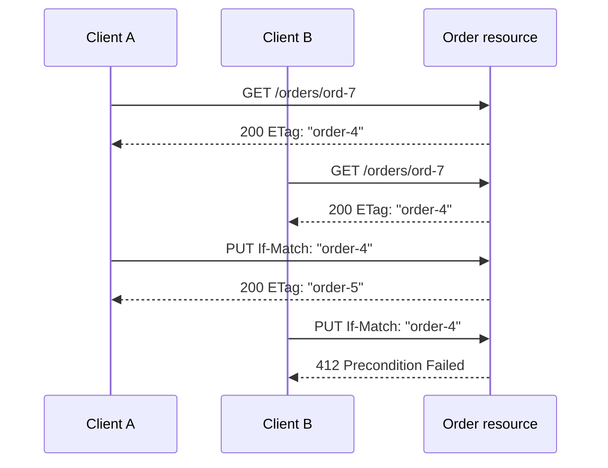

<TLDR>
  <TLDRCell label="what">
    RESTful API把领域能力建模为资源，用URI标识资源，并通过标准HTTP方法交换资源的表示。
  </TLDRCell>
  <TLDRCell label="trap">
    名词路径和JSON并不能自动带来REST语义；不安全的`GET`、含糊的重试行为和无条件更新仍会破坏客户端。
  </TLDRCell>
  <TLDRCell label="fix">
    先写清资源、方法语义和失败契约，再加入条件请求、稳定分页与幂等键，并在实际HTTP边界验证它们。
  </TLDRCell>
</TLDR>

## 是什么，为什么存在

REST（Representational State Transfer，表述性状态转移）是一种网络应用架构风格，不是JSON格式、路由命名规范或特定框架。RESTful API将可寻址的领域对象或能力建模为<Term id="resource">资源（resource）</Term>，客户端与服务端通过统一接口交换资源的<Term id="representation">表示（representation）</Term>。一个订单是资源，订单列表也是资源；JSON只是它们可能采用的一种表示。

这种设计解决的是客户端与服务端之间的长期协作问题。HTTP已经定义了方法、状态码、缓存、内容协商和条件请求的通用语义；API若复用这些语义，客户端、代理和监控工具就不必为每个端点重新猜测协议。好的资源模型还把公开契约与数据库表、控制器名称和内部工作流分开。

你会在浏览器应用、移动客户端、合作伙伴集成和服务间HTTP接口中遇到RESTful API。它适合以资源读取和状态转换为主、需要利用HTTP基础设施的系统。若领域主要是低延迟远程调用、双向流或严格类型化命令，gRPC或其他RPC形式可能更直接；选择REST不意味着所有系统都必须采用它。

严格的REST还要求统一接口包含超媒体驱动的状态转换。工程实践常把“使用资源URI、HTTP方法和状态码的JSON API”也称为RESTful，即使客户端仍预先知道全部路由。评审时应说明团队采用了哪些约束，不要让一个标签代替可测试的契约。

## 工作原理

REST把客户端、服务端和中间组件放进同一个交互模型。客户端发送一条自描述请求，服务端返回资源表示或结果状态；请求之间不依赖服务端保存的会话上下文。认证凭据、目标资源、前置条件和处理请求所需的其他上下文必须随请求传递，但服务端当然仍会保存资源、授权策略和业务数据。

### 六项架构约束

REST的约束共同决定系统行为，而不是一份路由风格清单：

1. 客户端与服务端分离，各自可以在公开接口不变时独立演进。
2. 请求无状态，每条请求都携带服务端理解它所需的上下文。
3. 响应明确是否可缓存，使客户端和中间缓存能够安全复用表示。
4. 统一接口通过资源标识、表示、自描述消息和超媒体约束交互方式。
5. 分层系统允许代理、网关和缓存位于客户端与源服务之间，而客户端无需了解每一层。
6. 按需代码允许服务端可选地传输可执行代码来扩展客户端，这不是普通JSON API的必备能力。

无状态不等于“服务端没有状态”，也不禁止登录。它要求每次请求都能独立解释，例如携带会话令牌，而不是依赖某台实例记住此前请求的隐含步骤。这样负载均衡器才能把后续请求交给另一台实例，但令牌本身仍要经过认证、授权和过期检查。

### 资源、URI与方法

URI标识资源，HTTP方法表达对该资源的操作。集合和成员通常形成`/orders`与`/orders/{orderId}`这样的关系；查询参数用于筛选、排序、分页或选择表示，而不是隐藏另一套方法系统。路径采用复数还是单数属于团队约定，一致性比把某种拼写宣称为REST定律更重要。

并非所有动词路径都错误。诸如取消订单这类有独立审计记录和生命周期的动作，可以建模为从属资源，例如`POST /orders/ord-7/cancellations`。关键是先找出客户端可观察、可标识的状态，而不是把控制器函数名直接暴露为`/cancelOrderNow`。

| 方法 | 安全 | 规范上幂等 | 常见用途 |
| --- | --- | --- | --- |
| `GET` | 是 | 是 | 获取资源表示 |
| `HEAD` | 是 | 是 | 获取与`GET`对应的元数据而不传输响应体 |
| `POST` | 否 | 否 | 让目标资源按自身语义处理表示，常用于向集合提交新成员 |
| `PUT` | 否 | 是 | 用请求表示创建或完整替换目标资源的状态 |
| `PATCH` | 否 | 不保证 | 按补丁媒体类型对资源执行部分修改 |
| `DELETE` | 否 | 是 | 删除目标资源的当前映射或状态 |

安全方法的语义是客户端没有请求改变服务端状态；日志、计费统计等附带记录仍可能发生。<Term id="idempotency">幂等性（idempotency）</Term>表示重复相同请求的预期服务端效果与一次请求相同，不表示每次响应完全一样。因此，第一次`DELETE`返回`204`、第二次返回`404`，仍不违背方法的幂等语义。

### 状态码与表示元数据

状态码描述这次HTTP操作的结果，响应体补充机器可读细节。`200`适合带表示的成功响应，`201`表示创建了资源，并通常配合`Location`指向新资源；`202`只表示工作已接受，因而还需要可查询的任务状态；`204`不能带响应体。客户端错误与服务端错误不能都包装成`200`，否则缓存、重试和监控会得到错误信号。

| 状态码 | 契约含义 |
| --- | --- |
| `400 Bad Request` | 服务端无法或不愿处理请求，例如语法或请求成帧错误 |
| `401 Unauthorized` | 请求缺少有效认证凭据，响应通常带`WWW-Authenticate` |
| `403 Forbidden` | 服务端理解请求但拒绝授权 |
| `404 Not Found` | 找不到目标资源，或服务端选择隐藏其存在性 |
| `405 Method Not Allowed` | 目标资源不支持该方法，响应必须带`Allow` |
| `409 Conflict` | 请求与资源当前状态冲突，客户端可能通过修改请求解决 |
| `412 Precondition Failed` | `If-Match`等前置条件在服务端为假 |
| `422 Unprocessable Content` | 内容语法正确，但指令在语义上无法处理 |
| `429 Too Many Requests` | 客户端发送请求过多，可用`Retry-After`提示等待时间 |

`Content-Type`说明当前消息体的媒体类型，`Accept`表达客户端可接受的响应媒体类型。缓存相关响应还要正确发送`Cache-Control`、`ETag`、`Last-Modified`和必要的`Vary`。这些响应头属于契约，不是部署以后随手添加的装饰。

### 条件更新流程

两个客户端先后读取同一资源时，无条件写入会产生丢失更新。实体标签（entity tag）让客户端把读到的表示版本作为写入前置条件，服务端则在同一次原子写入中比较版本并修改资源。



比较与更新必须共享一个原子边界。若应用先读取版本，再用另一条无条件语句保存，两个请求仍可能同时通过检查。数据库版本列、比较后交换操作或带版本条件的单条更新，才把HTTP前置条件落实到持久层。

## 示例

下面三个示例使用Node 24的纯JavaScript模拟HTTP边界。它们依次建立资源路由、条件更新和可重试创建；真实服务还必须在适配器中加入输入解析、认证、资源级授权与持久化事务。

### 建立资源操作

第一个处理器把集合URI与成员URI分开，并让方法决定操作。创建成功返回`201`和`Location`，不受支持的方法返回`405`和`Allow`。

<Depth level="quick">

```javascript run title="order_resource.js"
const orders = new Map([
  ["ord-7", { id: "ord-7", status: "pending" }],
]);

function handle(request) {
  const [collection, id] = request.path.split("/").filter(Boolean);
  if (collection !== "orders") {
    return { status: 404, body: { title: "Not Found" } };
  }

  if (request.method === "GET" && id) {
    const order = orders.get(id);
    return order
      ? { status: 200, body: order }
      : { status: 404, body: { title: "Not Found" } };
  }

  if (request.method === "POST" && !id) {
    const order = { id: "ord-8", status: "pending", ...request.body };
    orders.set(order.id, order);
    return { status: 201, headers: { Location: `/orders/${order.id}` }, body: order };
  }

  return { status: 405, headers: { Allow: "GET, POST" }, body: null };
}

const found = handle({ method: "GET", path: "/orders/ord-7" });
const created = handle({ method: "POST", path: "/orders", body: { sku: "BK-42", quantity: 2 } });
const rejected = handle({ method: "DELETE", path: "/orders" });

console.log(`${found.status} ${JSON.stringify(found.body)}`);
console.log(`${created.status} ${created.headers.Location} ${JSON.stringify(created.body)}`);
console.log(`${rejected.status} ${rejected.headers.Allow}`);
```

```text
200 {"id":"ord-7","status":"pending"}
201 /orders/ord-8 {"id":"ord-8","status":"pending","sku":"BK-42","quantity":2}
405 GET, POST
```

<TryToBreak items={['读取不存在的订单', '向成员URI发送POST', '向未知集合发送请求']} />

</Depth>

这个内存处理器只演示可观察的HTTP决策，不是生产服务器。真实实现要验证`sku`与`quantity`，根据已认证主体检查创建权限，并避免把数据库记录直接当响应表示。`Allow`还应根据实际资源能力生成，而不是散落在多个分支中。

### 用`If-Match`防止丢失更新

两个读取结果都带同一个<Term id="entity-tag">实体标签（entity tag）</Term>。第一次替换推进资源版本，第二个客户端再提交旧标签时得到`412`，而不是覆盖已提交状态。

```javascript run title="conditional_update.js"
let order = { id: "ord-7", status: "pending", version: 4 };

function currentTag() {
  return `"order-${order.version}"`;
}

function readOrder() {
  return { status: 200, headers: { ETag: currentTag() }, body: { ...order } };
}

function replaceOrder(ifMatch, replacement) {
  if (ifMatch !== currentTag()) {
    return { status: 412, headers: { ETag: currentTag() }, body: { ...order } };
  }

  order = {
    id: order.id,
    status: replacement.status,
    version: order.version + 1,
  };
  return { status: 200, headers: { ETag: currentTag() }, body: { ...order } };
}

const clientA = readOrder();
const clientB = readOrder();
const firstWrite = replaceOrder(clientA.headers.ETag, { status: "shipped" });
const staleWrite = replaceOrder(clientB.headers.ETag, { status: "cancelled" });

console.log(`read ${clientA.headers.ETag}`);
console.log(`first write ${firstWrite.status} ${firstWrite.headers.ETag} ${firstWrite.body.status}`);
console.log(`stale write ${staleWrite.status} ${staleWrite.headers.ETag} ${staleWrite.body.status}`);
```

```text
read "order-4"
first write 200 "order-5" shipped
stale write 412 "order-5" shipped
```

标签是不透明验证器，客户端不应解析`order-4`的内部格式。示例使用版本号生成强标签；生产服务必须保证同一个强标签对应逐字节相同的选定表示，并把条件比较与更新放入同一事务。冲突响应还可以返回当前标签或当前表示，帮助客户端重新读取并决定是否合并。

### 让创建请求可以安全重试

`POST`在HTTP规范中不保证幂等，但应用可以通过<Term id="idempotency-key">幂等键（idempotency key）</Term>识别同一次业务尝试。服务端还要保存请求指纹；同一个键若配上不同输入，应被拒绝，而不是静默返回第一次操作的结果。

```javascript run title="idempotent_create.js"
const attempts = new Map();
let sequence = 40;

function createPayment(tenantId, key, input) {
  const scopedKey = `${tenantId}:${key}`;
  const fingerprint = JSON.stringify(input);
  const previous = attempts.get(scopedKey);

  if (previous) {
    if (previous.fingerprint !== fingerprint) {
      return { status: 409, replayed: false, error: "idempotency key reused with different input" };
    }
    return { ...previous.response, replayed: true };
  }

  const payment = {
    id: `pay-${++sequence}`,
    amount: input.amount,
    currency: input.currency,
  };
  const response = { status: 201, payment };
  attempts.set(scopedKey, { fingerprint, response });
  return { ...response, replayed: false };
}

const first = createPayment("tenant-a", "attempt-9", { amount: 2500, currency: "EUR" });
const retry = createPayment("tenant-a", "attempt-9", { amount: 2500, currency: "EUR" });
const conflict = createPayment("tenant-a", "attempt-9", { amount: 9900, currency: "EUR" });

console.log(`${first.status} ${first.replayed} ${first.payment.id}`);
console.log(`${retry.status} ${retry.replayed} ${retry.payment.id}`);
console.log(`${conflict.status} ${conflict.replayed} ${conflict.error}`);
```

```text
201 false pay-41
201 true pay-41
409 false idempotency key reused with different input
```

内存`Map`只适合说明算法，进程重启或多实例部署都会使它失效。生产实现要按调用方或租户限定键的作用域，在持久存储中原子写入键、规范化请求指纹、操作状态和最终响应，并定义并发中的“正在处理”状态及保留期限。业务写入成功但幂等记录失败，仍可能产生重复副作用，因此两者必须共享事务或等价的一致性机制。

## 陷阱

### 把路径命名当作完整设计

> [!PITFALL]
> `/users`使用复数名词，并不代表接口已经正确。若`GET /users/7`会停用账号，或者每个失败都返回`200`，中间件和客户端仍会依据错误语义运行。

**修复方法：** 为每项操作记录方法、目标资源、前置条件、成功和失败状态、响应头、表示模式、授权以及重试行为。路径风格只是这份契约的一小部分。

### 误解`PUT`、`PATCH`与幂等性

> [!PITFALL]
> 生成代码常把`PUT`实现成任意字段合并，又断言所有`PATCH`天然幂等。补丁是否幂等取决于媒体类型和操作，例如“把值设为5”与“给值加1”的重复效果不同。

**修复方法：** 明确`PUT`接受的完整表示和缺失字段语义，并为`PATCH`声明支持的补丁媒体类型。用重复请求测试最终资源效果，不要只比较两次响应体。

### 无条件覆盖并发写入

> [!PITFALL]
> “先读、在应用中比较、再保存”若不是一个原子操作，仍会让两个写入者都通过检查。最后到达的保存会静默抹掉前一次更新。

**修复方法：** 用`ETag`与`If-Match`暴露前置条件，并让持久层在同一条条件更新或事务中比较版本。条件失败时返回`412`，让客户端基于新表示作出明确决定。

### 直接展开数据库对象

> [!PITFALL]
> 直接使用`return { ...row }`可能把内部备注、成本、软删除标志或其他租户的标识一起暴露。数据库新增列还会在没有API评审时改变公开响应。

**修复方法：** 为请求和响应分别定义允许字段，显式构造表示，并在读取目标资源后执行对象级授权。用契约测试断言敏感字段不存在，而不只断言期望字段存在。

### 用进程内缓存实现幂等键

> [!PITFALL]
> 单进程`Map`无法跨重启与副本识别重试。只按键字符串查找、却不绑定调用方和请求指纹，还可能让另一个用户取得旧响应，或让不同输入复用同一结果。

**修复方法：** 把幂等记录与业务效果原子持久化，按认证主体限定键，比较规范化请求指纹，并保存处理中、成功和失败策略。明确保留时间以及过期键重新出现时的行为。

### 让分页顺序漂移

> [!PITFALL]
> 只有`createdAt`的游标不是稳定边界，因为多条记录可以拥有同一时间戳。页面之间发生插入或删除时，客户端可能看到重复项或漏项。

**修复方法：** 定义包含唯一决胜字段的全序，例如`(createdAt, id)`，并把全部排序值编码进不透明游标。说明筛选条件是否绑定到游标，以及分页读取采用实时视图还是一致性快照。

<Depth level="deep">

## 统一接口的边界

REST的统一接口包含四个部分：用URI标识资源、通过表示操作资源、自描述消息，以及超媒体作为应用状态引擎。前三项让消息能由通用HTTP组件理解；最后一项要求服务端在表示中提供当前可用的链接或操作，使客户端沿协议状态转换，而不是把所有下一步写死在代码中。

超媒体并不要求一种固定JSON形状。链接关系、目标URI、允许的方法和提交格式都需要稳定契约，可以采用标准媒体类型，也可以设计并记录自己的媒体类型。只有`_links`字段却没有定义关系语义、客户端也从不读取它，并没有带来可发现的状态转换。

许多内部API有意停在资源URI与HTTP方法层面，客户端从OpenAPI文档和生成SDK获得路由知识。这可以是合理取舍，但更准确的描述是采用了部分REST约束的HTTP API。清楚命名取舍有助于团队判断客户端与服务端能否独立增加新流程。

### 表示不是数据库记录

同一资源可以有JSON、CSV或其他表示，也可以根据认证主体、语言和媒体类型选择字段。表示因此不是资源本身，更不是数据库某一行的自动序列化结果。缓存键必须区分会改变所选表示的请求头，通常通过相应的`Vary`字段表达。

写入表示也不必包含服务端拥有的字段。`id`、审计时间、计算总额和权限派生状态通常由服务端控制；请求模式应拒绝或忽略它们的规则必须明确。读取与写入共用一个宽松模式，很容易形成批量赋值漏洞。

## 条件请求与缓存验证器

服务端可以在`GET`或`HEAD`响应中发送`ETag`。客户端随后发送`If-None-Match`；当前表示仍匹配时，服务端用`304 Not Modified`避免传输响应体。缓存是否可以保存或复用响应还受RFC 9111的`Cache-Control`等规则约束，不能仅凭出现了`ETag`就推断。

强实体标签表示两个表示逐字节相同，弱标签带`W/`前缀，只表示语义等价。`If-Match`使用强比较，适合防止丢失更新；不能把只反映更新时间秒数、却可能漏掉同秒多次变化的值伪装成可靠强标签。标签内容对客户端始终不透明。

创建新资源时，客户端若已经知道目标URI，可以用`If-None-Match: *`表示只在当前没有该资源时执行。更新时可要求`If-Match`，缺少前置条件的策略则由API契约明确规定。`409`表示与资源状态的一般冲突，`412`专门说明请求给出的HTTP前置条件求值为假，两者不要随意互换。

## 部分更新契约

`PATCH`只定义方法，具体补丁含义由请求的媒体类型决定。服务器应记录并验证所支持的格式，还可通过`Accept-Patch`告知客户端。通用JSON对象本身不是无歧义的补丁：`null`是删除字段、把字段设为空，还是非法值，必须由格式契约回答。

补丁操作不保证幂等。设置字段、按标识删除集合成员通常可以设计成幂等；追加一项、递增计数或按当前位置插入，重复执行会得到不同状态。若客户端可能在结果未知后重试非幂等补丁，应加入操作标识、前置条件或其他去重机制。

服务端要在修改前验证最终资源状态，而不只是逐字段验证补丁。例如分别合法的`startAt`与`endAt`，合并后仍可能违反先后顺序。授权也要针对转换后的目标状态检查，避免调用方通过部分更新改变本不允许写入的所有者或角色字段。

## 错误也是公开表示

<Term id="problem-details">问题详情（Problem Details）</Term>为HTTP API提供`application/problem+json`错误格式。核心字段包括作为问题类型标识的`type`、面向人的`title`与`detail`、对应此次问题的`status`，以及标识具体发生实例的`instance`。API可以增加稳定扩展字段，例如字段级验证错误或可追踪请求标识。

`type`应是客户端可以据此编写分支的稳定标识，而不是每次变化的错误消息。`detail`面向人类，可能本地化，不适合作为机器协议。响应仍要使用真实HTTP状态码；在JSON中重复一个`status`并不能修复外层错误的`200`。

错误表示不能泄露堆栈、SQL、密钥、内部主机名或其他租户数据。对于资源级授权，服务端有时会用`404`隐藏资源是否存在，但这种策略应在同类端点保持一致。日志可通过请求标识关联内部诊断，客户端不需要看到内部异常。

## 稳定分页与筛选

偏移分页容易实现，也方便跳到近似页码，但数据集变化时页边界会移动，深偏移还可能让存储层做无用扫描。游标分页把继续位置交给客户端，更适合顺序读取变化中的集合；它并不会自动保证一致性，正确性仍取决于排序与隔离策略。

游标需要基于确定的全序。若按`createdAt DESC`排序，应加入唯一字段形成`createdAt DESC, id DESC`，下一页查询使用相同方向的复合边界。游标应是不透明且经过完整性保护的编码，并绑定排序、筛选和必要的租户上下文，避免客户端篡改查询范围。

响应要明确下一页链接或游标、页大小上限，以及没有下一页时的表示。总数如果计算代价高或只近似，就不要伪装成精确保证。改变默认排序、遗漏决胜字段或在翻页过程中切换筛选条件，都是契约变化而不只是查询实现细节。

## 从OpenAPI到运行时契约

<Term id="openapi">OpenAPI</Term>可以描述路径、方法、参数、请求体、响应、媒体类型和安全方案，是评审与生成工具的共同输入。它应列出每个重要失败分支以及`Location`、`ETag`、`Allow`、`Retry-After`等有行为意义的响应头，而不只是成功JSON模式。

模式文件不能单独证明实现遵守契约。资源级授权、事务原子性、重试效果、缓存配置和分页一致性需要运行时测试。测试应通过与生产相同的路由、中间件和序列化层发送真实HTTP请求，直接调用控制器会漏掉代理头、媒体类型和错误转换问题。

消费者契约测试可以记录已知客户端依赖，提供者测试则保证实现符合发布的公共契约。两者都应覆盖兼容方向：服务端收紧请求输入可能破坏旧客户端，服务端扩展响应也可能破坏拒绝未知字段的严格读取器。API版本应对应无法合理保持的公开兼容边界，而不是每次部署或数据库迁移。

</Depth>

<Checkpoint id="backend/restful-api-design" />

## 延伸阅读

- [RFC 9110：HTTP语义](https://www.rfc-editor.org/rfc/rfc9110.html)
- [RFC 9111：HTTP缓存](https://www.rfc-editor.org/rfc/rfc9111.html)
- [RFC 5789：HTTP PATCH方法](https://www.rfc-editor.org/rfc/rfc5789.html)
- [RFC 9457：HTTP API问题详情](https://www.rfc-editor.org/rfc/rfc9457.html)
- [OpenAPI规范](https://spec.openapis.org/oas/latest.html)
- [REST架构风格：博士论文原文](https://ics.uci.edu/~fielding/pubs/dissertation/rest_arch_style.htm)
