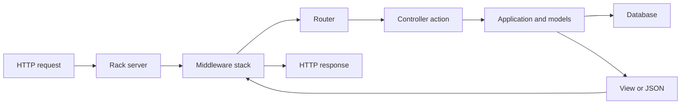

<TLDR>
  <TLDRCell label="what">
    Rails is a full-stack Ruby web framework that connects routing, controllers, databases, views, background jobs, and tests through one set of conventions.
  </TLDRCell>
  <TLDRCell label="when">
    Rails fits database-backed HTTP applications when the team is willing to share directory, naming, and lifecycle conventions.
  </TLDRCell>
  <TLDRCell label="how">
    Let routes choose entry points, parse and authorize input at the controller boundary, then give transactions, domain rules, and queries to objects with clear jobs.
  </TLDRCell>
</TLDR>

## What it is and why it exists

Ruby on Rails, usually called Rails, is a full-stack web application framework written in Ruby. Its application model covers HTTP requests, HTML and JSON responses, database access, mail, jobs, caching, and testing. A Rails application typically declares entry points in `config/routes.rb`, keeps controllers, models, and views under `app/`, and uses `bin/rails` to run the framework version locked by the project.

Rails uses conventions to remove repeated integration decisions. Without a shared scheme, every project has to decide where classes live, how table names map, how dependencies load, and how exceptions become responses. <Term id="convention-over-configuration">Convention over configuration</Term> means following the default names gives you framework behavior; you configure the cases that depart from those defaults.

Rails is often described as an MVC framework, but a real request passes through more than models, views, and controllers. A route selects a controller action, <Term id="middleware">middleware</Term> applies session, logging, or security policy around that action, and the controller calls models or other application objects. A JSON API may render no ERB view, yet it still uses the same routing, parameter, response, and test facilities.

Active Record is Rails' database layer. A model class usually maps to a plural table with the corresponding name and supplies queries, associations, validation, and persistence. It removes CRUD boilerplate, but it does not decide tenant permissions, transaction boundaries, public JSON fields, or consistency across systems.

Rails fits products with substantial conventional HTTP and database work, whether they serve pages, JSON APIs, or both. A full application lifecycle may be too much for a service with only a few stateless endpoints, or for a team that must assemble each infrastructure layer itself. Base the choice on application boundaries, team conventions, and operations, not a generic development-speed ranking.

## How it works

A request enters through a Rack-compatible server and passes through the Rails middleware stack. The router matches an HTTP method and path, a controller action reads parameters and calls application logic, and that work produces a response. The response unwinds through middleware in reverse order, so middleware placement and order change behavior.



### Conventions, loading, and environments

Rails connects many parts by name: `Order` uses the `orders` table by default, `OrdersController` lives in `app/controllers/orders_controller.rb`, and resource routing maps common HTTP verbs to seven REST actions. A convention is an executable contract, not a style suggestion. When file names, constants, or inflections disagree, autoloading and association inference can fail.

Zeitwerk loads application code from file paths. Development can reload code while production usually eager-loads it, so a constant reference that works only in one environment or load order is brittle. Put custom startup work at an explicit initialization boundary; do not depend on another file having happened to load first.

Inside an application, use `bin/rails` instead of a bare `rails` from the system path. The binstub uses the version selected by `Gemfile.lock`. Configuration also varies by environment, but credentials and deployment differences belong in credentials or environment-backed configuration, not controller conditionals.

### Routes, controllers, and parameters

`resources :orders` generates routes for listing, showing, creating, updating, and deleting orders, along with path helpers. A route constraint can reject a malformed path, but "the record exists" and "the current user may access it" are separate later decisions. Static routes and broad dynamic routes are order-sensitive too, so inspect the real result with `bin/rails routes` before release.

A controller is an HTTP adapter. It reads path values, query strings, request bodies, headers, and authenticated context, then passes plain values to application logic. <Term id="strong-parameters">Strong parameters</Term> require an explicit field allowlist before mass assignment, limiting which transport data can enter a model.

Strong parameters are not a complete security boundary. `params.require(:order).permit(:status)` allows the code to read `status`; it does not prove that the transition is legal or that the order belongs to the current account. Authentication, object-level authorization, domain validation, and database constraints remain separate responsibilities.

Controllers should return deliberate status codes and stable response shapes. Returning `record.attributes` directly lets a new database column silently expand a public API and can expose internal notes or tenant identifiers. An explicit field mapping or a reviewed serialization layer keeps the database model separate from the external contract.

### Active Record and the persistence boundary

<Term id="active-record">Active Record</Term> maps tables to model classes, rows to objects, and queries to relations that can be composed further. `where`, `order`, and `limit` usually build a query until results are needed. Association access in a template or serializer can also issue SQL, so one visible controller query does not rule out N+1 work.

Model validation gives users readable errors, but it is not the final integrity boundary. Scripts, bulk updates, concurrent requests, and other writers can bypass model validation. Nullability, uniqueness, foreign keys, and expressible checks also belong in database constraints; the application still turns constraint failures into appropriate responses.

<Term id="mass-assignment">Mass assignment</Term> writes several model fields from one parameter map. Strong parameters restrict fields at a controller boundary, but values owned by the server should still come from authenticated context and domain rules. Never pass `params.to_unsafe_h`, `permit!`, or the full request object to `create()` or `update()`.

Related writes need an explicit transaction. A transaction covers database work on the same connection; it cannot undo mail, an HTTP payment request, or a job that has already run. Schedule external effects after commit and use idempotent consumers, an outbox, or compensation where the workflow requires it.

## Examples

These three examples share an order domain and move through route dispatch, Active Record validation, and an account-scoped update endpoint. They ran in a fresh Rails 8.1.3.1 application with Ruby 4.0.6 and SQLite; each command was `bin/rails runner path/to/file.rb`.

### Send a request through the real router

The first script defines a quote controller and route, then sends requests with a Rails integration session. The second request omits a required parameter, so the controller maps the parsing failure to `422`.

<Depth level="quick">

```ruby title="quote_request.rb"
class QuotesController < ActionController::API
  def show
    subtotal_cents = Integer(params.require(:subtotal_cents))
    total_cents = subtotal_cents + subtotal_cents / 5
    render json: { subtotal_cents:, total_cents: }
  rescue ActionController::ParameterMissing, ArgumentError
    render json: { error: "subtotal_cents must be an integer" },
           status: :unprocessable_entity
  end
end

Rails.application.routes.draw do
  get "/quote", to: "quotes#show"
end

session = ActionDispatch::Integration::Session.new(Rails.application)
session.host! "localhost"

[{ subtotal_cents: "2000" }, {}].each do |query|
  session.get "/quote", params: query, headers: { "ACCEPT" => "application/json" }
  puts "#{session.response.status} #{session.response.body}"
end
```

```text
200 {"subtotal_cents":2000,"total_cents":2400}
422 {"error":"subtotal_cents must be an integer"}
```

<TryToBreak items={['subtotal_cents set to a negative number', 'subtotal_cents set to 19.5', 'the same query parameter supplied twice']} />

</Depth>

This test crosses the router and controller instead of calling `show` directly. Parameter extraction, exception mapping, and JSON rendering are all inside the exercised path. The example still lacks a domain rule that rejects negative money, which is exactly the next boundary test it needs.

`params.require` checks whether the field is present; it does not validate the number's business meaning. For a production endpoint, define the amount range, integer limit, and error contract first, then decide whether each rule belongs in a parameter object, domain object, or database constraint.

### Combine model validation with a query

The second script creates an orders table in SQLite, defines validations and a scope, then compares valid and invalid records. Disabling migration logging only keeps the example output stable; it does not change the SQL behavior.

```ruby title="order_model.rb"
ActiveRecord::Migration.verbose = false
ActiveRecord::Schema.define do
  create_table :orders, force: true do |table|
    table.string :reference, null: false
    table.integer :quantity, null: false
    table.string :status, null: false
  end
end

class Order < ApplicationRecord
  validates :reference, presence: true
  validates :quantity, numericality: { only_integer: true, greater_than: 0 }
  validates :status, inclusion: { in: %w[pending shipped] }

  scope :pending, -> { where(status: "pending") }
end

Order.create!(reference: "A-17", quantity: 2, status: "pending")
Order.create!(reference: "B-04", quantity: 3, status: "shipped")

invalid = Order.new(reference: "C-09", quantity: 0, status: "pending")
puts "valid=#{invalid.valid?}"
puts invalid.errors.full_messages.join(", ")
puts "pending_units=#{Order.pending.sum(:quantity)}"
```

```text
valid=false
Quantity must be greater than 0
pending_units=2
```

`Order.pending` remains a composable relation; `sum` asks the database to calculate the total. The invalid object is not written, and the error comes from Rails' real English locale data. Model validation improves feedback, while the table's `null: false` protects against null writes that bypass the model.

If the database must reject zero quantities, add a check constraint too. Depending on `validates` alone leaves bulk SQL, other services, and races unprotected. Application validation and database constraints work at different layers; this is not an either-or choice.

### Scope ownership and narrow the write fields

The final script creates an order table with account ownership. The controller looks up an order by account and ID together, allows only `status` to change, and selects the response fields explicitly.

```ruby title="scoped_update.rb"
ActiveRecord::Migration.verbose = false
ActiveRecord::Schema.define do
  create_table :orders, force: true do |table|
    table.integer :account_id, null: false
    table.string :status, null: false
  end
end

class Order < ApplicationRecord
end

class OrdersController < ActionController::API
  rescue_from ActiveRecord::RecordNotFound do
    render json: { error: "not found" }, status: :not_found
  end

  def update
    account_id = request.headers.fetch("X-Account-Id")
    order = Order.find_by!(id: params[:id], account_id:)
    order.update!(params.require(:order).permit(:status))
    render json: order.slice(:id, :status, :account_id)
  end
end

Rails.application.routes.draw do
  patch "/orders/:id", to: "orders#update"
end

order = Order.create!(account_id: 7, status: "pending")
session = ActionDispatch::Integration::Session.new(Rails.application)
session.host! "localhost"

session.patch "/orders/#{order.id}", params: { order: { status: "shipped", account_id: 99 } },
              headers: { "X-Account-Id" => "7", "ACCEPT" => "application/json" }
puts "#{session.response.status} #{session.response.body}"
puts "stored account=#{order.reload.account_id} status=#{order.status}"

session.patch "/orders/#{order.id}", params: { order: { status: "pending" } },
              headers: { "X-Account-Id" => "8", "ACCEPT" => "application/json" }
puts "#{session.response.status} #{session.response.body}"
```

```text
200 {"id":1,"status":"shipped","account_id":7}
stored account=7 status=shipped
404 {"error":"not found"}
```

The request tries to replace `account_id` with `99`, but strong parameters do not allow that field, so the database keeps `7`. A second account asking for the same order ID gets `404`. That policy hides the existence of cross-tenant resources; looking up the record first and returning `403` is another choice, but the contract must be consistent.

The request header stands in for authentication and is not production-ready. A real application takes `account_id` from an authenticated principal that the caller cannot forge, then applies the same scoped lookup or an authorization policy. It also needs allowed status transitions, not just an allowed field name.

## Pitfalls

### Treating parameter validation as object authorization

> [!PITFALL]
> Neither `params.require(...).permit(...)` nor `Order.find(params[:id])` proves that an order belongs to the current user. Generated code often finishes the field allowlist and then updates any supplied ID, creating a broken object-level authorization flaw.

**Fix:** query through the current account or tenant association, or authorize the resolved record with a policy. Create records for at least two accounts in tests and prove that the second account cannot read or change the first account's record.

### Letting a complete parameter map enter a model

> [!PITFALL]
> `permit!`, `params.to_unsafe_h`, or a hand-written list of every model column turns client fields directly into candidate writes. A later `role`, `price_cents`, or `account_id` column can become exposed without any controller change.

**Fix:** assemble the smallest write map from permitted input, and derive ownership, price, and state on the server. Send sensitive extra fields in negative tests and assert that server-owned database values do not change.

### Hiding external effects in callbacks

> [!PITFALL]
> Sending mail or calling a payment service from `after_save` makes an ordinary `save!` trigger external work implicitly. If the transaction later rolls back, a job retries, or a bulk import repeats the save, the external system may receive duplicate or invalid requests.

**Fix:** put the workflow in a named application service, hand off external work after database commit, and give consumers idempotency keys. Keep model callbacks for behavior local to the model with no cross-system meaning, and test rollback and retry paths.

### Triggering N+1 during rendering

> [!PITFALL]
> `Order.limit(20)` appears to be one query, but reading `order.customer.name` for each row in a view or serializer can issue 20 more. Logging, debug output, and JSON resources can trigger lazy association loading too.

**Fix:** preload the associations used by the real rendering path and record the query count with a fixed page size. Do not load the entire object graph blindly; an unbounded preload replaces a query problem with memory and transfer problems.

### Putting application models in data migrations

> [!PITFALL]
> Calling the current `Order` model from a migration makes old migration code depend on future validations, callbacks, default scopes, and column names. Replaying the migration into an empty database years later can execute entirely different behavior.

**Fix:** use the migration API for schema changes; for backfills, use controlled SQL, a narrow class inside the migration, or a separately deployed task. Test lock time and duration on large tables and plan a compatibility window for staged releases.

### Testing only direct controller calls

> [!PITFALL]
> A unit test that calls `controller.update` bypasses routing, parameter encoding, middleware, authentication, exception mapping, and response serialization. An action that passes that test can still return the wrong status or expose fields on its real HTTP path.

**Fix:** cover the full HTTP slice with request or integration tests and keep fast unit tests for domain objects. Assert exact status codes, response shapes, database changes, and the absence of sensitive fields.

<Depth level="deep">

## Choosing conventions and boundaries

### Responsibilities beyond MVC

Rails' MVC directories identify broad homes for HTTP and persistence, but they do not automatically place complex business work. A controller that parses protocol details, calculates prices, changes several tables, and sends notifications soon becomes a transaction script that is hard to reuse. Putting everything in a model instead binds domain rules and external effects to persistence callbacks.

A sturdier boundary keeps HTTP concerns in the controller, lets an application service coordinate one use case, and leaves local invariants with models or domain objects. This does not call for a "service object" around every action. An extra object earns its place when logic crosses models, needs an explicit transaction, or must be reused from HTTP and job entry points.

A Rails concern is a code-reuse mechanism, not an automatic domain boundary. Packing unrelated callbacks and scopes into several models makes behavior harder to locate. Before sharing code, confirm that the concept and lifecycle are truly the same; a few repeated explicit lines can be clearer.

### Autoloading is a naming contract

Zeitwerk expects file paths to match constant names. For example, `app/services/billing/reconcile_order.rb` should define `Billing::ReconcileOrder`. Disagreement over acronyms, inflections, or namespaces can be hidden by an accidental development load order and surface only under eager loading or the full test suite.

`bin/rails zeitwerk:check` verifies that an application can eager-load under those conventions. It does not prove business behavior, but it catches moved files, renamed constants, and namespace mistakes in continuous integration. When generated code adds a file, check the class name, path, and reference sites together.

Initializers run during application startup and must not read a request's user or tenant. Saving a request object in a class variable, global object, or process-wide singleton may look fine in one-request development tests and then cross-contaminate a threaded server or job process. Pass request context explicitly through parameters or request-scoped objects.

## Data consistency and transactions

### Validation, constraints, and races

A model uniqueness validation usually queries first and writes second. Two concurrent transactions can both pass that query, so real uniqueness still needs a database unique index. After a constraint conflict, the application should return a conflict or an idempotent success according to its API contract, rather than expose the database exception directly.

When `save` returns `false`, its caller must handle failure; `save!` and `update!` raise instead. Generated code often ignores the boolean and continues to render `200` or write an audit record. Pick a consistent style at each boundary and map its failure path explicitly.

An Active Record transaction rolls back when an exception leaves its block. Catching an exception without re-raising it can commit partial changes; waiting for a remote service inside the transaction can hold locks for too long. Define the atomic database unit first, then move irreversible work to a reliable post-commit handoff.

`after_commit` avoids launching an effect for a rolled-back transaction, but it is not itself a durable message queue. The process can fail after commit and before enqueueing. When delivery must eventually happen, write an outbox row with the business data in one transaction and let a separate publisher deliver it.

### Associations and query shape

Active Record relations stay composable until a loading point executes SQL. `includes` may choose a loading strategy based on later conditions, `preload` explicitly uses separate queries, and `eager_load` uses a left outer join. Choose from the access shape and actual plan instead of memorizing one method as "the N+1 fix."

Nested reads need nested preloads. Loading `orders: :customer` does not cover a resource that later runs `order.lines.each { |line| line.product.name }`. A query test must execute the final view or serializer; otherwise the extra SQL has not happened yet.

Preloading also has a cost. Loading an unbounded set of orders, line items, and products can allocate a large object graph, while wide joins repeat parent rows. Combine pagination, column projection, database aggregates, and batching according to the response contract, then measure query count and allocations with a fixed data shape.

## Deployable database changes

A <Term id="migration">migration</Term> keeps database shape changes under version control, but a successful migration is not necessarily safe online. Adding a non-null column, rewriting a large table, creating an index, or removing an old column can hold locks or conflict with old application processes that are still running. The rollout plan has to account for the database engine, table size, and rolling-deploy window.

A backward-compatible expand-and-contract rollout normally adds the new shape first, deploys code that can coexist with old and new shapes, backfills and verifies data, then removes the old shape. The sequence takes more releases but lets old and new processes run together during a rolling deploy. Test the exact lock behavior against the target database and representative data volume.

Migration rollback is reliable only for genuinely reversible changes. Adding a deleted column back cannot recover its data, and `db:rollback` cannot recall events already consumed by another system. Prepare backups, restoration steps, a forward-fix plan, and observability before rollout instead of assuming every change has a one-command reversal.

## Testing a complete request slice

Rails request tests cover routing, middleware, parameter parsing, controllers, responses, and the database. They are closer to the public contract than direct controller calls and do not need an external listening port. System tests cover browser behavior, while domain unit tests handle rules that do not depend on Rails; none of these makes the others redundant.

A write endpoint should cover success, validation failure, unauthenticated access, forbidden access, a missing resource, and a duplicate request. Multi-tenant tests need two real owners with explicit record associations. If every fixture belongs to one default account, object-level authorization bugs are easy to hide.

Response assertions should check both the fields that belong and the secrets or internal columns that must be absent. Database assertions should prove that the target record changed and that another tenant's records and failure paths did not. If an endpoint schedules jobs or calls an external service, assert call counts and arguments alongside database state after failure.

A query regression test has to execute the production rendering path. Once page size and relationship counts are fixed, the total query count becomes comparable. Testing only that `Order.includes(:customer)` returns the right objects cannot prove that serialization avoids another unloaded association.

Finally, run critical checks in the deployment mode. Eager loading, class caching, concurrent servers, background jobs, and the database adapter can expose failures absent from development. The goal is to verify how a real request crosses boundaries, not merely that one controller method returns a Ruby object.

## Background jobs and process lifetime

### Jobs carry handoff data

Active Job gives enqueueing and execution a common interface, but job arguments still cross a serialization boundary. Passing a model normally stores a reference that can locate the record again; it does not freeze all attributes at enqueue time. By execution, the record may have changed or disappeared. Decide whether the job needs current state or an enqueue-time snapshot, then pass a record ID, version, or immutable data accordingly.

A job may retry after a timeout, process exit, or queue policy, so its execution method cannot assume it runs once. Payments, mail, and state transitions need business idempotency keys, while database writes must reject duplicate transitions. A queue's job ID alone often cannot cover a caller enqueueing the same business action twice.

Enqueueing inside a transaction also has timing semantics. A worker that receives the job before commit may not find the new record, while a rolled-back transaction should leave no job at all. Whether you enqueue after commit or use an outbox, test successful commit, rollback, and publisher retry.

| Work | Appropriate owner | Failure path to verify |
| --- | --- | --- |
| Produce the current HTTP response | Request lifecycle | Client disconnect and exception mapping |
| Retriable background operation | Durable queue | Duplicate execution and deleted record |
| Periodic maintenance | Scheduler and job queue | Overlapping execution and missed schedule |
| Event that must follow database commit | Transactional outbox | Publisher crash and duplicate delivery |

### State in long-running processes

Web server threads and job workers handle many separate work units. A current user, tenant, time zone, or request stored in a class variable, global cache, or singleton does not reset itself; later work can read stale state. Match state ownership to the request or job boundary, and restore temporary process-wide settings in `ensure`.

The database connection pool is also a process resource. Size it with web threads, job concurrency, and the database connection limit together; a pool larger than the thread count does not automatically improve throughput. When timeouts appear, measure active threads, wait time, and total connections per process before raising a number mechanically.

Graceful shutdown has to stop accepting new work, wait for in-flight work within a deadline, and release connections. Whether unfinished jobs return to the queue depends on the adapter and acknowledgement timing; the framework name alone does not answer it. In a deployment drill, terminate a worker during a job and verify the result, retry count, and duplicate effects.

</Depth>

<Checkpoint id="backend/ruby-rails" />

## Further reading

- [Rails 8.1 Getting Started](https://guides.rubyonrails.org/v8.1/getting_started.html)
- [Rails 8.1 Action Controller Overview](https://guides.rubyonrails.org/v8.1/action_controller_overview.html)
- [Rails 8.1 Routing](https://guides.rubyonrails.org/v8.1/routing.html)
- [Rails 8.1 Active Record Basics](https://guides.rubyonrails.org/v8.1/active_record_basics.html)
- [Rails 8.1 Testing](https://guides.rubyonrails.org/v8.1/testing.html)
- [Rails 8.1 Security](https://guides.rubyonrails.org/v8.1/security.html)
