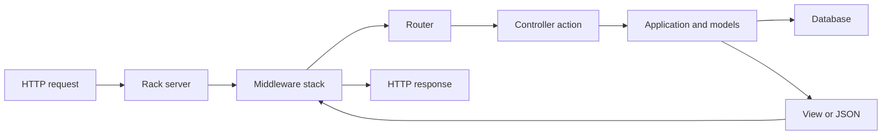

<TLDR>
  <TLDRCell label="what">
    Rails是Ruby的全栈Web框架，用一套约定连接路由、控制器、数据库、视图、后台任务与测试。
  </TLDRCell>
  <TLDRCell label="when">
    当产品需要数据库驱动的HTTP接口，而且团队愿意遵循共同目录、命名和生命周期约定时，Rails很合适。
  </TLDRCell>
  <TLDRCell label="how">
    让路由确定入口，在控制器边界解析和授权输入，再把事务、领域规则与查询交给职责明确的对象。
  </TLDRCell>
</TLDR>

## 是什么，为什么存在

Ruby on Rails通常简称Rails，是用Ruby编写的全栈Web应用框架。它用同一个应用模型涵盖HTTP请求、HTML与JSON响应、数据库访问、邮件、任务、缓存和测试。一个Rails应用通常从`config/routes.rb`声明入口，把控制器、模型和视图放在`app/`中，并通过`bin/rails`使用项目锁定的框架版本。

Rails用约定消除重复的集成决策。没有共同约定时，每个项目都要重新决定类放在哪里、表名如何映射、依赖怎样加载、异常怎样变成响应。<Term id="convention-over-configuration">约定优于配置（convention over configuration）</Term>表示遵循默认命名就能得到框架行为，偏离默认值时再显式配置。

Rails常被称为MVC框架，但真实请求路径不只有模型、视图与控制器。路由先选择控制器动作，<Term id="middleware">中间件（middleware）</Term>在动作前后处理会话、日志或安全策略，控制器再调用模型或其他应用对象。JSON API可以不渲染ERB视图，但仍使用同一套路由、参数、响应与测试设施。

Active Record是Rails的数据库层。模型类通常映射到同名复数表，并提供查询、关联、校验与持久化接口。它减少CRUD样板代码，但不会替你决定租户权限、事务范围、公共JSON字段或跨系统一致性。

Rails适合具有大量常规HTTP与数据库工作、需要服务器渲染页面或JSON API的产品。若服务只有几个无状态端点，或者团队必须自行组合每层基础设施，全栈生命周期可能显得过重。选择依据应是应用边界、团队约定和运维方式，不是笼统的“开发速度”排名。

## 工作原理

请求先进入Rack兼容服务器，再经过Rails中间件栈。路由器按HTTP方法与路径寻找匹配项，控制器动作读取参数并调用应用逻辑，最后生成响应。响应沿中间件栈反向返回，所以中间件的注册位置和顺序会改变行为。



### 约定、加载与环境

Rails根据名称连接许多部件：`Order`默认使用`orders`表，`OrdersController`位于`app/controllers/orders_controller.rb`，资源路由把常见HTTP动词映射到七个REST动作。约定是可执行契约，不是风格建议；文件名、常量名或复数形式不一致时，自动加载和关联推断就可能失败。

应用代码由Zeitwerk自动加载器按文件路径装载。开发环境可以重载代码，生产环境通常提前加载，因此只在某种环境或加载顺序下工作的常量引用很危险。自定义初始化代码应放在明确的初始化边界，不能依赖另一个文件“碰巧先被加载”。

在应用目录中使用`bin/rails`，而不是系统路径上的裸`rails`命令。binstub会使用`Gemfile.lock`选定的版本。配置也按环境分层，但密钥与部署差异应来自凭据或环境，而不应散落在控制器的条件分支里。

### 路由、控制器与参数

`resources :orders`会生成索引、详情、创建、更新与删除等路由，并生成对应的路径助手。路由约束能拒绝形状错误的路径，但“记录存在”和“当前用户有权访问”是后续的独立判断。静态路由与宽泛动态路由的顺序也有语义，发布前应检查`bin/rails routes`的真实结果。

控制器是HTTP适配层。它读取路径、查询、请求体、请求头和认证上下文，再把普通值交给应用逻辑。<Term id="strong-parameters">强参数（strong parameters）</Term>要求批量写入前显式允许字段，从而限制传输数据进入模型的范围。

强参数不是完整安全边界。`params.require(:order).permit(:status)`只说明允许读取`status`，没有证明状态转换合法，也没有证明订单属于当前账户。认证、对象级授权、领域校验和数据库约束仍要分别存在。

控制器应返回明确的状态码和稳定的响应结构。直接返回`record.attributes`会让新增数据库列意外进入公共API，也可能泄露内部备注或租户标识。显式映射字段或使用经过审查的序列化层，才能把数据库模型与外部契约分开。

### Active Record与持久化边界

<Term id="active-record">Active Record</Term>把表映射为模型类，把行映射为对象，并把查询表示为可继续组合的关系。`where`、`order`和`limit`在真正需要结果前通常只构造查询。模板或序列化器中的关联访问也可能触发SQL，因此控制器看起来只有一条查询并不能排除N+1。

模型校验提供适合用户阅读的错误，但它不是数据库完整性的最终边界。脚本、批量更新、并发请求或其他写入者可能绕过模型校验。非空、唯一性、外键和可表达的检查条件应同时由数据库约束保护，应用仍负责把约束冲突转换为合适响应。

<Term id="mass-assignment">批量赋值（mass assignment）</Term>会把一个参数映射中的多个字段写入模型。强参数限制控制器允许的字段，但服务端拥有的字段仍应由认证上下文和领域规则计算。不要把`params.to_unsafe_h`、`permit!`或完整请求对象交给`create()`与`update()`。

多条相关写入需要显式事务。事务只能覆盖同一数据库连接上的数据库操作，已经发送的邮件、HTTP支付请求或立即执行的任务不会随回滚撤销。外部副作用通常要在提交后调度，并结合幂等消费者、outbox或补偿逻辑。

## 示例

下面三个示例使用同一个订单领域，依次经过路由分派、Active Record校验与限定账户的更新接口。它们在新建的Rails 8.1.3.1应用中通过Ruby 4.0.6和SQLite实际运行，命令均为`bin/rails runner path/to/file.rb`。

### 经过真实路由处理请求

第一个脚本定义报价控制器和路由，再使用Rails集成会话发送请求。第二次请求缺少必填参数，因此控制器把解析错误映射为`422`。

<Depth level="quick">

```ruby title="quote_request.rb"
class QuotesController < ActionController::API
  def show
    subtotal_cents = Integer(params.require(:subtotal_cents))
    total_cents = subtotal_cents + subtotal_cents / 5
    render json: { subtotal_cents:, total_cents: }
  rescue ActionController::ParameterMissing, ArgumentError
    render json: { error: "subtotal_cents must be an integer" },
           status: :unprocessable_entity
  end
end

Rails.application.routes.draw do
  get "/quote", to: "quotes#show"
end

session = ActionDispatch::Integration::Session.new(Rails.application)
session.host! "localhost"

[{ subtotal_cents: "2000" }, {}].each do |query|
  session.get "/quote", params: query, headers: { "ACCEPT" => "application/json" }
  puts "#{session.response.status} #{session.response.body}"
end
```

```text
200 {"subtotal_cents":2000,"total_cents":2400}
422 {"error":"subtotal_cents must be an integer"}
```

<TryToBreak items={['把subtotal_cents设为负数', '把subtotal_cents设为19.5', '重复提供同名查询参数']} />

</Depth>

这个测试经过路由和控制器，而不是直接调用`show`。因此参数解析、异常映射和JSON渲染都在被验证的路径内。示例仍缺少“金额必须非负”的领域规则，负数输入正是应该补上的边界测试。

`params.require`检查字段是否存在，但它不会根据业务含义验证数值。对正式接口，应先定义金额范围、整数上限与错误契约，再决定这些规则位于参数对象、领域对象还是数据库约束中。

### 让模型校验与查询协作

第二个脚本在SQLite中创建订单表，定义校验和作用域，再比较有效与无效记录。关闭迁移日志只为让示例输出稳定，不改变SQL行为。

```ruby title="order_model.rb"
ActiveRecord::Migration.verbose = false
ActiveRecord::Schema.define do
  create_table :orders, force: true do |table|
    table.string :reference, null: false
    table.integer :quantity, null: false
    table.string :status, null: false
  end
end

class Order < ApplicationRecord
  validates :reference, presence: true
  validates :quantity, numericality: { only_integer: true, greater_than: 0 }
  validates :status, inclusion: { in: %w[pending shipped] }

  scope :pending, -> { where(status: "pending") }
end

Order.create!(reference: "A-17", quantity: 2, status: "pending")
Order.create!(reference: "B-04", quantity: 3, status: "shipped")

invalid = Order.new(reference: "C-09", quantity: 0, status: "pending")
puts "valid=#{invalid.valid?}"
puts invalid.errors.full_messages.join(", ")
puts "pending_units=#{Order.pending.sum(:quantity)}"
```

```text
valid=false
Quantity must be greater than 0
pending_units=2
```

`Order.pending`仍是可组合的关系，`sum`才让数据库计算总数。无效对象没有写入数据库，错误来自实际Rails英文语言资源。模型校验改善了反馈，但表中的`null: false`才会约束绕过模型的空值写入。

若数据库必须拒绝零数量，还应增加检查约束。仅依赖`validates`会给批量SQL、其他服务或竞态留下入口。应用校验和数据库约束负责不同层次，不应二选一。

### 限定账户并收窄写入字段

最后一个脚本建立包含账户所有权的订单表。控制器通过账户与ID一起查找订单，只允许更新`status`，并显式选择响应字段。

```ruby title="scoped_update.rb"
ActiveRecord::Migration.verbose = false
ActiveRecord::Schema.define do
  create_table :orders, force: true do |table|
    table.integer :account_id, null: false
    table.string :status, null: false
  end
end

class Order < ApplicationRecord
end

class OrdersController < ActionController::API
  rescue_from ActiveRecord::RecordNotFound do
    render json: { error: "not found" }, status: :not_found
  end

  def update
    account_id = request.headers.fetch("X-Account-Id")
    order = Order.find_by!(id: params[:id], account_id:)
    order.update!(params.require(:order).permit(:status))
    render json: order.slice(:id, :status, :account_id)
  end
end

Rails.application.routes.draw do
  patch "/orders/:id", to: "orders#update"
end

order = Order.create!(account_id: 7, status: "pending")
session = ActionDispatch::Integration::Session.new(Rails.application)
session.host! "localhost"

session.patch "/orders/#{order.id}", params: { order: { status: "shipped", account_id: 99 } },
              headers: { "X-Account-Id" => "7", "ACCEPT" => "application/json" }
puts "#{session.response.status} #{session.response.body}"
puts "stored account=#{order.reload.account_id} status=#{order.status}"

session.patch "/orders/#{order.id}", params: { order: { status: "pending" } },
              headers: { "X-Account-Id" => "8", "ACCEPT" => "application/json" }
puts "#{session.response.status} #{session.response.body}"
```

```text
200 {"id":1,"status":"shipped","account_id":7}
stored account=7 status=shipped
404 {"error":"not found"}
```

请求试图把`account_id`改为`99`，但强参数没有允许该字段，所以数据库仍保存`7`。第二个账户用相同订单ID查询时得到`404`。这是一种隐藏跨租户资源存在性的策略；也可以先查找再返回`403`，但契约必须一致。

示例用请求头简化认证，不能直接用于生产。真实应用应从经过认证、不可由调用方伪造的主体取得`account_id`，再执行同样的限定查询或授权策略。还要为`status`增加允许的状态转换，而不只是允许字段名。

## 陷阱

### 把参数校验当成对象授权

> [!PITFALL]
> `params.require(...).permit(...)`和`Order.find(params[:id])`都不能证明订单属于当前用户。生成代码经常完成字段白名单后就直接更新任意ID，形成对象级授权缺陷。

**修复方法：** 从当前账户或租户关联开始查询，或者对解析后的记录执行策略授权。测试至少创建两个账户，并证明第二个账户无法读取或修改第一个账户的记录。

### 允许完整参数映射进入模型

> [!PITFALL]
> `permit!`、`params.to_unsafe_h`或手工列出所有模型列，会把客户端字段直接变成候选写入。后来新增的`role`、`price_cents`或`account_id`可能在没有修改控制器时暴露出来。

**修复方法：** 从允许后的输入中组装最小写入映射，并由服务端推导所有权、价格与状态。对敏感额外字段写负向测试，同时断言数据库中的服务端字段没有变化。

### 在回调中隐藏外部副作用

> [!PITFALL]
> `after_save`中发送邮件或调用支付服务，会让普通`save!`隐式触发外部操作。事务稍后回滚、任务重试或批量导入时，外部系统可能已经收到重复或无效请求。

**修复方法：** 把工作流放进名称明确的应用服务，在数据库提交后调度外部工作，并给消费者设计幂等键。模型回调保留给紧邻模型且无跨系统语义的行为，也要测试回滚与重试路径。

### 在渲染阶段触发N+1

> [!PITFALL]
> `Order.limit(20)`看起来只有一条查询，但视图或序列化器中逐条读取`order.customer.name`会再执行20条关联查询。日志、调试输出与JSON资源同样可能触发惰性加载。

**修复方法：** 对真实渲染路径预加载确实使用的关联，固定页大小后记录查询数。不要盲目加载整个对象图；无界预加载只是把查询问题换成内存与传输问题。

### 让应用模型进入数据迁移

> [!PITFALL]
> 迁移文件中调用当前`Order`模型，会让旧迁移依赖未来的校验、回调、默认作用域和列名。几年后从空数据库重放时，迁移可能执行完全不同的代码。

**修复方法：** 结构迁移只使用迁移API；必须回填时使用受控SQL、迁移内的窄类或独立部署任务。大型表先验证锁和运行时间，并为分阶段发布安排兼容窗口。

### 只直接调用控制器方法

> [!PITFALL]
> `controller.update`的单元测试绕过路由、参数编码、中间件、认证、异常映射和响应序列化。一个直接调用通过的动作，仍可能在真实HTTP路径返回错误状态或暴露字段。

**修复方法：** 用请求或集成测试覆盖完整HTTP切片，并对领域对象保留快速单元测试。断言精确状态码、响应结构、数据库变化与敏感字段缺失。

<Depth level="deep">

## 约定与边界的取舍

### MVC之外的职责

Rails的MVC目录能说明HTTP与持久化的大致位置，却不能自动给复杂业务找到归属。控制器若同时解析协议、计算价格、修改多张表并发送通知，很快会变成难以复用的事务脚本。模型若承担所有工作，又会把持久化回调、领域规则和外部副作用绑在一起。

更稳妥的边界是让控制器只处理HTTP，让应用服务协调一个用例，让模型或领域对象维护局部不变量。这里不需要为每个动作建立“服务对象”；只有当逻辑跨多个模型、需要明确事务或从HTTP与任务两个入口复用时，额外对象才真正减少耦合。

Rails concern是代码复用机制，不是自动正确的领域边界。把无关回调和作用域塞入多个模型，会让行为来源更难追踪。共享代码前先确认概念与生命周期确实相同，否则重复几行显式代码可能更清楚。

### 自动加载是一份命名契约

Zeitwerk期望文件路径与常量名称对应。例如`app/services/billing/reconcile_order.rb`应定义`Billing::ReconcileOrder`。缩写词、单复数和命名空间不一致时，开发环境的偶然加载可能掩盖问题，提前加载或测试全套运行才暴露错误。

`bin/rails zeitwerk:check`可以验证项目是否能按约定提前加载。它不能证明业务代码正确，但适合在持续集成中捕获文件移动、常量重命名和命名空间错误。生成代码新建文件后，应同时检查类名、路径与引用点。

初始化器在应用启动时运行，不应读取某次请求的用户或租户。把请求对象保存到类变量、全局对象或进程级单例，在单请求开发测试中可能正常，在多线程服务器与后台工作进程中却会交叉污染。请求上下文应通过参数或请求范围对象显式传递。

## 数据一致性与事务

### 校验、约束与竞态

模型唯一性校验通常先查询，再尝试写入。两个并发事务都可能通过查询，所以真正的唯一性仍需要数据库唯一索引。应用捕获唯一约束冲突后，应根据API契约返回冲突或幂等成功，而不是把底层异常原样暴露给客户端。

`save`返回`false`时，调用方必须处理失败；`save!`与`update!`则抛出异常。生成代码常忽略布尔返回值，随后仍渲染`200`或写审计记录。团队应按边界选择一致风格，并对失败路径作明确映射。

Active Record事务在异常离开块时回滚。捕获异常却不重新抛出，可能让事务提交部分修改；反过来，在事务内等待远端服务会延长锁持有时间。先写清数据库原子单元，再把不可回滚的工作放到提交后的可靠交接点。

`after_commit`能避免在回滚事务上启动副作用，但它本身不是消息队列持久性保证。进程可能在提交后、入队前崩溃。必须保证事件最终送达时，应把outbox记录与业务数据写进同一事务，再由独立发布者投递。

### 关联与查询形状

Active Record关系会一直组合到加载点，之后才执行SQL。`includes`可以根据后续条件选择预加载策略，`preload`明确使用独立查询，`eager_load`使用左外连接。选择依据是访问形状与实际计划，不能只记一个“修复N+1”的方法名。

嵌套访问需要嵌套预加载。加载`orders: :customer`并不能覆盖资源中随后读取的`order.lines.each { |line| line.product.name }`。查询测试必须执行最终视图或序列化器，否则真正的额外SQL还没有发生。

预加载也有成本。一次加载无界订单、行项目和商品可能分配大量对象，宽连接还会重复父行。分页、字段投影、数据库聚合与批处理应根据响应契约组合使用，并用固定数据形状记录查询数与分配量。

## 可部署的数据库变更

<Term id="migration">迁移（migration）</Term>把数据库结构变化保存在版本控制中，但迁移成功不代表它适合在线运行。增加非空列、重写大表、创建索引或删除旧列，可能持锁或与仍在运行的旧代码不兼容。部署计划需要同时考虑数据库引擎、表规模和滚动发布窗口。

向后兼容的展开与收缩流程通常先添加新结构，再发布能同时读写新旧结构的代码，完成回填与验证后才删除旧结构。这个流程会多几个版本，却允许新旧进程在滚动部署期间共存。具体锁行为必须在目标数据库与代表性数据量上验证。

迁移回滚只在确实可逆时可靠。删除列后，反向添加列不能恢复原数据；外部系统已经消费的事件也不会因`db:rollback`撤销。发布前应准备备份、恢复步骤、前向修复方案和观测指标，而不是假设每次变化都能一键回退。

## 测试完整请求切片

Rails请求测试可以覆盖路由、中间件、参数解析、控制器、响应与数据库。它们比直接控制器调用更接近公共契约，而且不需要启动外部端口。系统测试再覆盖浏览器行为，领域单元测试负责不依赖框架的规则，三者没有互相替代关系。

写接口至少要覆盖成功、校验失败、未认证、无权限、资源不存在和重复请求。多租户测试必须创建两个真实所有者，并明确关联测试数据；若所有fixture都属于同一默认账户，对象级授权漏洞很容易被隐藏。

响应断言既要检查应出现的字段，也要检查秘密与内部列确实缺失。数据库断言要确认目标记录发生预期变化，同时确认其他租户记录与失败路径没有变化。若接口会调度任务或调用外部服务，还要断言调用次数、参数和失败后的数据库状态。

查询回归测试必须执行生产使用的渲染路径。固定页大小与关联数量后，查询总数才有可比性。只测`Order.includes(:customer)`返回了正确对象，无法证明序列化过程中没有访问另一条未加载关联。

最后，在与部署相同的模式下运行关键检查。提前加载、缓存类、并发服务器、后台任务与数据库适配器都会暴露开发环境没有的错误。目标是验证一条真实请求如何穿过边界，而不是证明某个控制器方法单独能返回Ruby对象。

## 后台任务与进程生命周期

### 任务只保存交接信息

Active Job为入队和执行提供统一接口，但任务参数仍要穿过序列化边界。传递完整模型通常会保存一个可重新定位记录的标识，而不是冻结入队时的全部属性；执行时记录可能已经修改或删除。任务必须明确需要“最新状态”还是入队时快照，并据此传递记录ID、版本号或不可变数据。

任务可能因超时、进程退出或队列策略而重试，所以执行函数不能假设只运行一次。付款、邮件和状态转换需要业务幂等键，数据库写入还应防止重复状态转换。仅依赖队列提供的任务ID，往往无法覆盖调用方重复入队同一业务动作的情况。

事务内入队也有时间顺序。工作进程若在事务提交前取得任务，可能找不到刚创建的记录；事务若回滚，任务又不应该存在。使用提交后入队或outbox时，要测试提交成功、回滚和发布者重试三条路径。

| 工作内容 | 合适的所有者 | 必须验证的失败路径 |
| --- | --- | --- |
| 生成当前HTTP响应 | 请求生命周期 | 客户端断开与异常映射 |
| 可重试的后台操作 | 持久队列 | 重复执行与记录已删除 |
| 周期维护任务 | 调度器与任务队列 | 重叠执行与错过调度 |
| 必须随数据库提交的事件 | 事务内outbox | 发布者崩溃与重复投递 |

### 常驻进程中的状态

Web服务器线程和任务工作进程会处理许多独立工作单元。类变量、全局缓存或单例中保存的当前用户、租户、时区与请求对象不会自动重置，下一次请求可能读到旧状态。状态所有权应与请求或任务边界一致，并在`ensure`中恢复临时的进程级设置。

数据库连接池也属于进程资源。池大小要同时考虑Web线程、任务并发与数据库连接上限；把池设得比线程数大并不自动提高吞吐。超时错误出现时，应先量出活跃线程、等待时间与每个进程的总连接，而不是机械增大配置。

优雅关闭需要停止接收新工作、等待有期限的在途工作，并释放连接。未完成任务是否重回队列取决于适配器和确认时机，不能凭框架名称推断。部署演练应在任务执行中终止一个工作进程，再验证任务结果、重试次数和重复副作用。

</Depth>

<Checkpoint id="backend/ruby-rails" />

## 延伸阅读

- [Rails 8.1入门指南](https://guides.rubyonrails.org/v8.1/getting_started.html)
- [Rails 8.1 Action Controller概览](https://guides.rubyonrails.org/v8.1/action_controller_overview.html)
- [Rails 8.1路由指南](https://guides.rubyonrails.org/v8.1/routing.html)
- [Rails 8.1 Active Record基础](https://guides.rubyonrails.org/v8.1/active_record_basics.html)
- [Rails 8.1测试指南](https://guides.rubyonrails.org/v8.1/testing.html)
- [Rails 8.1安全指南](https://guides.rubyonrails.org/v8.1/security.html)
