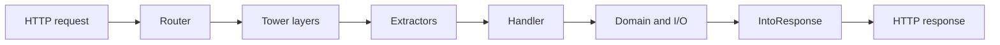

<TLDR>
  <TLDRCell label="what">
    A Rust backend carries ownership and type checking to the HTTP boundary, commonly using Tokio for asynchronous I/O and Axum to compose routes, extractors, and middleware.
  </TLDRCell>
  <TLDRCell label="when">
    Rust fits when a service needs explicit control of memory, concurrency, and failure boundaries, and the team accepts stricter compile-time modeling.
  </TLDRCell>
  <TLDRCell label="how">
    Keep handlers thin, convert request data into domain input, give shared state an owner, and define explicit contracts for blocking work, timeouts, backpressure, and shutdown.
  </TLDRCell>
</TLDR>

## What it is and why it exists

Rust backend development means implementing a long-running network service in Rust; it isn't the name of one framework. A typical program accepts connections, routes HTTP requests to handlers, calls a database or another service, and returns a response with a status and body. Axum supplies the HTTP layer, Tokio supplies the asynchronous execution foundation, and the application still defines its domain model.

Rust's <Term id="ownership">ownership</Term> and <Term id="borrowing">borrowing</Term> rules expose many resource-lifetime errors at compile time. A service manages memory without garbage-collector pauses and can use types to distinguish validated input, domain failures, and public responses. Compilation still cannot prove that authorization is correct, queries are bounded, or an operation is safe to retry.

You encounter Rust services when tail latency, resource use, long-term stability, or safe concurrency justifies added engineering cost. Rust also suits infrastructure components and APIs that need to share types or memory layouts with existing Rust libraries. If the work is routine CRUD and the team has little Rust experience, a mature existing stack may ship sooner.

This page selects Axum instead of duplicating the same implementation across frameworks. Its handlers are ordinary async functions and it reuses Tower's service and middleware model, which makes request boundaries, state, and errors independently testable. Databases, authentication, and deployment belong to their own topics; here they appear only where they must preserve the HTTP boundary.

The verified combination is Rust 1.98, Axum 0.8.9, Tokio 1.53.1, and Tower 0.5. Versions matter: a dynamic route in Axum 0.8 is written `/{order_id}`; don't copy `/:order_id` from older material as current syntax.

## How it works

Tokio is an <Term id="async-runtime">async runtime</Term>. A Rust `async fn` produces a lazy `Future`; its work advances only while a runtime keeps polling it. When the task waits for a socket or timer, it gives the execution thread back to the runtime instead of reserving one operating-system thread per request.

Axum's `Router` implements Tower's `Service` abstraction. The router selects a handler by HTTP method and path, then <Term id="request-extractor">request extractors</Term> construct typed parameters from the path, query, headers, extensions, state, or body. The handler returns a value implementing `IntoResponse`, which Axum turns into an HTTP response.

Ownership still applies across that asynchronous path. Path and JSON values extracted for a handler are normally owned by the current request, while shared services commonly sit behind `Arc` and expose cheap cloned handles through `State`. The compiler rejects dangling references, but it can't decide whether state belongs to one request, one tenant, or the whole process.

### The path of one request

A request travels through the application in this order:

1. A listener accepts a connection, and the HTTP implementation parses headers and body frames.
2. `Router` matches a route by method and path.
3. Outer <Term id="tower-layer">Tower layers</Term> run cross-cutting work such as timeouts, tracing, or authentication.
4. Extractors read request parts in parameter order; a failure can produce a rejection response immediately.
5. The handler calls domain services and I/O adapters.
6. A return value or typed error becomes a status, headers, and body through `IntoResponse`.
7. Middleware completes the return path, and the HTTP implementation sends the response.



Extractors aren't decorative field annotations. An extractor implementing `FromRequestParts` reads only request parts, so several can compose; the one `FromRequest` extractor that consumes the body must be the handler's last argument. Putting `Json<T>` before an argument that still needs request parts normally produces a handler trait error rather than a runtime reorder.

Converting a path or query string to an integer can fail, and JSON can be malformed or violate the Serde model. The handler doesn't run in those cases. A public API should decide whether to preserve framework rejection bodies or map them into its own consistent error contract.

### State, errors, and middleware

Application state must meet the router's requirements for sharing it across concurrent tasks, commonly as a cloneable structure holding connection-pool clients. `Arc` supplies only shared ownership; whether inner data needs a `Mutex`, `RwLock`, channel, or single-task owner depends on how it changes. Don't put the entire service behind one lock merely because the compiler accepts `Arc<Mutex<_>>`.

Domain failures should map to stable, deliberately chosen HTTP statuses. An absent resource, invalid input, version conflict, and internal dependency failure are different errors. Mapping all of them to `500` destroys the client contract, while returning internal error text verbatim can disclose implementation details.

Middleware belongs around behavior shared by many routes, such as request IDs, tracing, body limits, and the authentication entry point. Resource-level authorization still needs to know which object is being accessed, so it normally lives in a tenant-scoped query or domain service. Middleware nesting changes which responses are observed and which work a timeout covers; pin that behavior with request-level tests.

## Examples

The three examples share this manifest and live in `src/bin/typed_get.rs`, `src/bin/create_order.rs`, and `src/bin/blocking_timeout.rs`. Every output below was produced locally with `cargo +1.98.0 run --quiet --bin <name>`.

```toml title="Cargo.toml"
[package]
name = "codewiki-rust-backend"
version = "0.1.0"
edition = "2024"

[dependencies]
axum = "=0.8.9"
serde = { version = "1", features = ["derive"] }
tokio = { version = "=1.53.1", features = ["macros", "rt-multi-thread", "sync", "time"] }
tower = { version = "0.5", features = ["util"] }
```

### Testing a typed GET route

The first program doesn't bind a port; it hands a request directly to the `Router`. This still executes real routing, extraction, and response conversion while keeping the output deterministic and the test independent of port availability.

<Depth level="quick">

```rust title="src/bin/typed_get.rs"
use axum::{
    body::{Body, to_bytes},
    extract::Path,
    http::Request,
    routing::get,
    Json, Router,
};
use serde::Serialize;
use tower::ServiceExt;

#[derive(Serialize)]
struct Order {
    id: u64,
    status: &'static str,
}

async fn get_order(Path(order_id): Path<u64>) -> Json<Order> {
    Json(Order {
        id: order_id,
        status: "ready",
    })
}

#[tokio::main]
async fn main() {
    let app = Router::new().route("/orders/{order_id}", get(get_order));
    let request = Request::builder()
        .uri("/orders/42")
        .body(Body::empty())
        .unwrap();
    let response = app.oneshot(request).await.unwrap();
    let status = response.status();
    let body = to_bytes(response.into_body(), 1024).await.unwrap();

    println!("{}", status);
    println!("{}", String::from_utf8(body.to_vec()).unwrap());
}
```

```text
200 OK
{"id":42,"status":"ready"}
```

<TryToBreak items={['request /orders/0', 'request /orders/not-a-number', 'POST to /orders/42']} />

</Depth>

`Path<u64>` declares both the data source and conversion target. If the segment isn't a valid `u64`, the extractor rejects the request before calling `get_order`, so the handler receives only a value that has passed this structural conversion.

The example caps response collection at 1,024 bytes so the test helper doesn't collect an unbounded body. Real clients and servers also need size limits, but derive those limits from the message contract instead of copying the example's number.

### Validating JSON and injecting state

The second program adds `State` and `Json`. Its `AtomicU64` is only a minimal example of cloneable state: it generates identifiers within one process, not a database ID strategy that works across restarts or replicas.

```rust title="src/bin/create_order.rs"
use axum::{body::{Body, to_bytes}, extract::State, http::{Request, StatusCode}, routing::post, Json, Router};
use serde::{Deserialize, Serialize};
use std::sync::{atomic::{AtomicU64, Ordering}, Arc};
use tower::ServiceExt;

type NextId = Arc<AtomicU64>;

#[derive(Deserialize)]
struct NewOrder { sku: String, quantity: u32 }

#[derive(Serialize)]
struct Order { id: u64, sku: String, quantity: u32 }

async fn create_order(State(next_id): State<NextId>, Json(input): Json<NewOrder>)
    -> Result<(StatusCode, Json<Order>), (StatusCode, &'static str)>
{
    if input.quantity == 0 {
        return Err((StatusCode::UNPROCESSABLE_ENTITY, "quantity must be positive"));
    }
    let order = Order {
        id: next_id.fetch_add(1, Ordering::Relaxed),
        sku: input.sku,
        quantity: input.quantity,
    };
    Ok((StatusCode::CREATED, Json(order)))
}

#[tokio::main]
async fn main() {
    let app = Router::new().route("/orders", post(create_order))
        .with_state(Arc::new(AtomicU64::new(1)));
    for payload in [r#"{"sku":"KB-87","quantity":0}"#, r#"{"sku":"KB-87","quantity":2}"#] {
        let request = Request::post("/orders").header("content-type", "application/json")
            .body(Body::from(payload)).unwrap();
        let response = app.clone().oneshot(request).await.unwrap();
        let status = response.status();
        let body = to_bytes(response.into_body(), 1024).await.unwrap();
        println!("{} {}", status, String::from_utf8(body.to_vec()).unwrap());
    }
}
```

```text
422 Unprocessable Entity quantity must be positive
201 Created {"id":1,"sku":"KB-87","quantity":2}
```

`Json<NewOrder>` handles JSON syntax and field types, after which the handler enforces the `quantity > 0` domain boundary. Production code should also constrain the SKU format and upper quantity bound, then map validation failures into one error shape. The `u32` type rules out only negative numbers.

The success branch explicitly returns `201 Created`, and the error branch returns `422 Unprocessable Entity`. That's more accurate than returning a JSON object from every branch with the default status because clients use the status first to classify an HTTP result.

### Seeing what a blocking timeout means

The third program exposes an easily misunderstood boundary. Timing out while awaiting the `JoinHandle` from `spawn_blocking` means only that the waiter exceeded its deadline; a blocking closure that has started doesn't stop.

```rust title="src/bin/blocking_timeout.rs"
use std::{
    sync::{
        Arc,
        atomic::{AtomicBool, Ordering},
    },
    time::Duration,
};
use tokio::{task, time::{sleep, timeout}};

#[tokio::main]
async fn main() {
    let finished = Arc::new(AtomicBool::new(false));
    let worker_flag = Arc::clone(&finished);

    let blocking_job = task::spawn_blocking(move || {
        std::thread::sleep(Duration::from_millis(100));
        worker_flag.store(true, Ordering::SeqCst);
    });

    if timeout(Duration::from_millis(5), blocking_job).await.is_err() {
        println!("deadline exceeded");
    }
    sleep(Duration::from_millis(150)).await;
    println!("blocking job finished: {}", finished.load(Ordering::SeqCst));
}
```

```text
deadline exceeded
blocking job finished: true
```

Real blocking work needs a cooperative stop mechanism, such as periodically checking a cancellation flag, or an external process that supplies a terminable boundary. If the work changes an external system, define an unknown-outcome state after timeout. The caller returning a timeout doesn't prove that the side effect never happened.

`spawn_blocking` fits short, bounded blocking calls that can't become asynchronous. CPU work in volume needs a separate concurrency limit, and persistent loops belong on dedicated threads or processes. Tokio's blocking pool isn't a capacity plan for an unbounded task queue.

## Pitfalls

### Blocking directly inside an async handler

> [!PITFALL]
> `std::thread::sleep`, synchronous file I/O, synchronous database drivers, and long CPU loops occupy a runtime worker. Other tasks on that worker can't advance until the call returns or yields.

**Fix:** prefer an asynchronous API. Send a short, bounded legacy call to `spawn_blocking`, but also limit concurrency, give the caller a deadline, and document that dropping its handle can't stop a closure after it starts.

### Holding the wrong lock across `.await`

> [!PITFALL]
> Generated code often acquires a `std::sync::MutexGuard` and then calls an async function. The guard may make the handler's Future fail the `Send` requirement, and holding it while waiting can block every request that needs the same state.

**Fix:** narrow the lock scope and copy the necessary data before `.await`, then briefly reacquire the lock to commit a result after I/O. Use Tokio's async lock across a wait only when the design truly requires it, and review lock order, contention, and cancellation.

### Treating type safety as validation and authorization

> [!PITFALL]
> `Json<CreateOrder>` proves that a body deserializes into a struct. It doesn't prove that the quantity is sensible, the caller may create an order for the target tenant, or the response omits internal fields. Successful Serde decoding isn't domain validation or object-level authorization.

**Fix:** separate the transport model, validated domain input, and public response model. Let authentication establish a principal, enforce authorization through a principal- or tenant-scoped query, and test boundary values, a second tenant, and extra fields.

### Treating a timeout as rollback

> [!PITFALL]
> `timeout` reports a deadline by stopping its wait and dropping the inner Future. A remote database, sent request, detached task, or running `spawn_blocking` closure may continue and finish a side effect.

**Fix:** design idempotency keys, transactions, or queryable operation status for writes, and represent an unknown outcome explicitly. Keep a handle and coordinate cancellation when local async work must stop. Merely dropping a `JoinHandle` detaches its task.

### Letting queues, bodies, and fan-out grow without bounds

> [!PITFALL]
> Calling `tokio::spawn` for every input, collecting a request body without a limit, or using an unbounded channel converts a traffic burst into memory growth and downstream overload. Rust's memory safety doesn't add <Term id="backpressure">backpressure</Term> to an under-capacity system.

**Fix:** limit body size and concurrency at entry, feed capacity back to producers with bounded channels or semaphores, and choose explicit overflow behavior. Load tests should include slow downstream systems and cancellation, not only normal throughput.

### Copying an obsolete Axum API

> [!PITFALL]
> Old tutorials and generated code may still write `.route("/orders/:id", ...)` or implement a custom extractor with a stale `FromRequestParts` signature. Version drift often appears as a long trait error, tempting people to add unrelated `Clone` bounds or lifetime annotations.

**Fix:** check `Cargo.lock` and the matching versioned docs before changing types, then reduce the error to a minimal handler. Axum 0.8 uses `/{id}` route syntax. Axum's `debug_handler` can improve diagnostics for a complex handler, but you still need to understand the missing trait bound.

## In the AI era

**What generated code gets wrong here**

Models commonly mix Axum 0.7 and 0.8 route syntax, put body-consuming `Json<T>` in the wrong argument position, or return a `200` JSON object for every error. They also call synchronous ORMs inside `async fn`, carry a `MutexGuard` across `.await`, spawn an unbounded task per record, and assume a timed-out write was cancelled. Authentication samples are especially prone to checking only that `Authorization` starts with `Bearer ` without validating the signature, issuer, audience, and resource owner.

**Ask your AI to check**

- Read the lockfile, list the actual Rust, Axum, Tokio, and Tower versions, and map every example API to its matching versioned documentation.
- Draw every lock guard, borrow, and piece of shared state still alive across each `.await`, and identify calls that can block a runtime worker.
- For every timeout, retry, and `tokio::spawn`, state the task owner, cancellation action, whether a side effect may already be committed, and who waits for completion.

**Review checklist**

- Send malformed paths, a wrong media type, invalid JSON, boundary quantities, and a second tenant through the real `Router`; assert statuses and public response fields.
- Search for synchronous I/O, unbounded channels, unbounded body collection, and `spawn` inside loops; write down the capacity limit for each.
- Trace shutdown from the signal through the listener, request tasks, background tasks, and blocking work; confirm a deadline and reporting for unfinished work.

**Prompt vocabulary**

Use exact terms: `async runtime`（异步运行时）, `request extractor`（请求提取器）, `FromRequestParts`（请求部件提取）, `Tower layer`（Tower 层）, `shared state`（共享状态）, `blocking boundary`（阻塞边界）, `cancellation safety`（取消安全）, `backpressure`（背压）, and `graceful shutdown`（优雅关闭）. Ask for a request-lifecycle diagram and task-ownership table instead of vaguely asking to “make the code more async.”

<Depth level="deep">

## Runtime boundaries and service lifetime

### Cooperative scheduling

Tokio tasks are cooperatively scheduled by the runtime. A task normally yields a worker thread when it reaches an `.await` that isn't ready. A long computation with no wait point can occupy that worker continuously; `async` syntax doesn't make synchronous work preemptible.

A request Future can also do too much work in one poll, such as parsing a huge in-memory structure, compressing a large buffer, or running an expensive regular expression. When diagnosing runtime stalls, inspect the work in each poll rather than merely counting `.await` expressions.

Adding worker threads only postpones starvation; it doesn't fix unbounded CPU work. Before moving computation off the core runtime, decide its parallelism, queue bound, value after timeout, and whether a separate process should contain crashes or memory spikes.

### Blocking boundaries

`spawn_blocking` runs a closure on threads dedicated to blocking work and returns an awaitable handle. It keeps the closure from directly occupying an async worker, but it doesn't give the underlying API asynchronous cancellation semantics. Once the closure begins, `abort` can't reliably stop it.

The blocking pool can permit more threads than the useful parallelism for CPU-heavy work. If every request submits an expensive computation, tasks queue and then contend for CPU and memory. Limit them with a separate semaphore, fixed compute pool, or external worker service.

When calling a blocking database library, account for its connection pool too. Acquiring thread permits and connection permits in different orders can produce long waits. Put both capacities in one design and bound the time spent waiting for either permit.

### Cancellation isn't transaction rollback

<Term id="cancellation">Cancellation</Term> commonly occurs when a Future is dropped. Local values are destroyed according to Rust's rules, but work already handed to another task, the kernel, or a remote system isn't necessarily withdrawn. Cancellation safety describes whether interrupting and later retrying an async operation loses or duplicates observable state.

A cancelled read can often be started again, although it must still release response bodies and connection permits. A write whose response can disappear after commit needs an idempotency protocol or a follow-up query; blindly retrying it may create duplicate orders.

Before repeatedly constructing a Future inside a `select!` loop, check the branch's cancellation-safety documentation. Some reads can be safely recreated; some compound operations lose progress after consuming part of their input. Giving a single task ownership of a multi-step state transition is often clearer than letting requests share half-finished state.

### Backpressure and capacity budgets

A bounded system caps each scarce resource and defines its wait and rejection behavior. HTTP connections, request bodies, handler concurrency, database connections, outbound concurrency, background queues, and response buffers are distinct capacities; one global semaphore can't represent all of them.

| Boundary | Typical limit | Decision at capacity |
| --- | --- | --- |
| HTTP entry | Body size, active requests | Reject, queue, or degrade |
| Database | Pool size, acquire timeout | Fail fast or wait within the remaining budget |
| External API | Concurrency permits, rate budget | Backpressure, back off, or open a circuit |
| Background work | Bounded channel, worker count | Block the producer, drop, or persist |

Limits must compose into the request's overall budget. If entry waits for 30 seconds while the database pool, retry loop, and outbound call each get another 30 seconds, cancellation no longer represents how long the user agreed to wait.

There is no universal answer when a queue is full. Audit records may require durable storage before acknowledgment, cache refreshes can be coalesced, and telemetry may be dropped under a declared policy. Put the choice in the interface and distinguish waiting, rejection, dropping, and success in metrics.

### Graceful shutdown

Graceful shutdown has three phases: detect the signal, tell tasks to stop accepting new work, then wait for existing work or a deadline. Stopping the listener alone doesn't manage background tasks created with `tokio::spawn`.

A cancellation token or watch channel can broadcast intent, while a `TaskTracker`, `JoinSet`, or explicit handles track completion. A task also needs to select on shutdown while it waits on a queue, timer, or I/O operation; otherwise it may never observe the notice.

When the shutdown deadline expires, record the kinds of unfinished tasks and their business impact. Started `spawn_blocking` work can extend runtime shutdown. If the process must exit on time, put that blocking boundary behind a terminable process or a library that supports cancellation itself.

### State ownership and `Send`

A multithreaded Tokio runtime may move tasks between threads, so a Future run with `tokio::spawn` normally must be `Send + 'static`. Here, `'static` means the task doesn't borrow stack data that will disappear first; it doesn't mean every object lives until process exit.

`Arc<T>` gives `T` multiple owners, while cross-thread sharing also imposes the relevant `Send` and `Sync` requirements. The compiler proves operations are safe under Rust's memory model. It doesn't prove that one request can't read another tenant's cache entry.

Prefer immutable shared configuration and let each request own its input and short-lived state. Mutable domain state is usually better owned by a database transaction, a single task, or a narrowly scoped synchronization structure than by one giant object available from every handler.

### Error boundaries and observability

Internal error types can preserve a source chain and diagnostic context, while public error responses should remain stable, bounded, and secret-free. Returning a database error's `to_string()` can disclose table names, constraint names, or query details.

Logs should carry a correlatable request ID, a selected error category, and safe business identifiers, not tokens or complete request bodies. Status counts alone don't locate a failure. Distinguish extraction failures, authorization denials, capacity rejection, dependency timeouts, and internal defects.

The tracing layer's position determines whether it sees early rejections and timeout responses. After adding or reordering a layer, send a success, extraction failure, handler error, and timeout. Confirm that logs and metrics record each once and agree with the final client status.

### Boundary tests without a port

Calling a `Router` as a `Service` quickly covers real routes and extractors without a network port. These tests suit statuses, response headers, body limits, layer order, and error shapes, and they reliably expose stale route syntax or an incorrect parameter type.

An in-process test doesn't cover TCP, TLS, proxy headers, slow bodies, or real disconnects. Keep a smaller set of end-to-end tests for those boundaries, with the test server binding an operating-system-assigned port instead of assuming a fixed port is free.

When testing cancellation, don't assert only that the caller received a timeout promptly. Observe whether cancelled work releases permits, continues writes, has an owner to reap background tasks, and lets the shutdown path complete while it exists.

</Depth>

<Checkpoint id="backend/rust-backend" />

## Further reading

- [Rust 1.98 ownership chapter](https://doc.rust-lang.org/1.98.0/book/ch04-00-understanding-ownership.html)
- [Axum 0.8.9 documentation](https://docs.rs/axum/0.8.9/axum/)
- [Axum request extractors](https://docs.rs/axum/0.8.9/axum/extract/index.html)
- [Tokio 1.53.1 documentation](https://docs.rs/tokio/1.53.1/tokio/)
- [Tokio `spawn_blocking`](https://docs.rs/tokio/1.53.1/tokio/task/fn.spawn_blocking.html)
- [Tokio graceful shutdown guide](https://tokio.rs/tokio/topics/shutdown)
