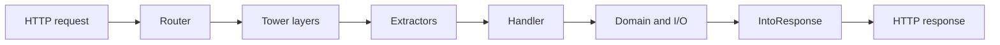

<TLDR>
  <TLDRCell label="what">
    Rust 后端服务把所有权与类型检查延伸到 HTTP 边界，并常用 Tokio 执行异步 I/O、用 Axum 组合路由、提取器与中间件。
  </TLDRCell>
  <TLDRCell label="when">
    当服务需要明确控制内存、并发和故障边界，而且团队愿意承担更严格的编译期建模成本时，Rust 很合适。
  </TLDRCell>
  <TLDRCell label="how">
    让处理器保持短小，把请求数据转换为领域输入，对共享状态设定所有者，并为阻塞工作、超时、背压与关闭流程写出明确契约。
  </TLDRCell>
</TLDR>

## 是什么，为什么存在

Rust 后端开发是用 Rust 实现长期运行的网络服务，而不是某一个框架的别名。典型程序监听连接，把 HTTP 请求路由到处理器，访问数据库或其他服务，再返回带状态码和正文的响应。Axum 提供 HTTP 层，Tokio 提供异步执行基础，业务模型仍由应用自己定义。

Rust 的<Term id="ownership">所有权（ownership）</Term>和<Term id="borrowing">借用（borrowing）</Term>规则让许多资源生命周期错误在编译期暴露。服务可以在没有垃圾回收停顿的情况下管理内存，也能用类型区分已验证输入、领域错误和公开响应。不过，编译通过不代表授权正确、查询有界或操作可安全重试。

当尾延迟、资源占用、长期稳定性或安全并发值得额外工程成本时，你会遇到 Rust 服务。它也适合基础设施组件，以及需要与现有 Rust 库共享类型和内存布局的 API。若工作主要是常规 CRUD，团队又缺少 Rust 经验，成熟度更高的现有技术栈可能交付得更快。

本页选择 Axum 而不重复展示多个框架。它的处理器直接使用普通异步函数，并复用 Tower 的服务与中间件模型，因此请求边界、状态和错误都容易单独测试。数据库、认证和部署分别由相关专题负责，这里只说明它们接入 HTTP 层时必须保留的边界。

文中的版本组合是 Rust 1.98、Axum 0.8.9、Tokio 1.53.1 和 Tower 0.5。版本号很重要：Axum 0.8 的动态路由写作 `/{order_id}`，旧资料中的 `/:order_id` 不能当作当前语法复制。

## 工作原理

Tokio 是一个<Term id="async-runtime">异步运行时（async runtime）</Term>。Rust 的 `async fn` 产生惰性的 `Future`；只有运行时持续轮询它，内部工作才会推进。等待套接字或计时器时，任务把执行线程还给运行时，而不是为每个请求占住一个操作系统线程。

Axum 的 `Router` 实现 Tower `Service` 抽象。路由先按 HTTP 方法与路径选择处理器，然后<Term id="request-extractor">请求提取器（request extractor）</Term>从路径、查询、请求头、扩展、状态或正文构造带类型的参数。处理器返回实现 `IntoResponse` 的值，Axum 再把它转换为 HTTP 响应。

所有权仍然贯穿这条异步路径。处理器取得的路径值和 JSON 值通常由当前请求拥有，共享服务则常放在 `Arc` 中并通过 `State` 克隆轻量句柄。编译器会拒绝悬垂引用，却不会替你决定状态应该属于一次请求、一个租户还是整个进程。

### 一次请求的路径

请求按下面的顺序穿过应用：

1. 监听器接受连接，HTTP 实现解析请求头和正文帧。
2. `Router` 按方法和路径匹配路由。
3. 外层<Term id="tower-layer">Tower 层（Tower layer）</Term>执行超时、追踪或认证等横切逻辑。
4. 提取器按参数声明读取请求部件；失败时可直接生成拒绝响应。
5. 处理器调用领域服务和 I/O 适配器。
6. 返回值或带类型的错误经 `IntoResponse` 转为状态码、响应头和正文。
7. 中间件完成返回路径，HTTP 实现发送响应。



提取器不是字段注解的装饰语法。实现 `FromRequestParts` 的提取器只读取请求部件，可以组合多个；消费正文的 `FromRequest` 提取器必须是处理器的最后一个参数。把 `Json<T>` 放在仍需读取请求部件的参数之前，通常会得到处理器 trait 错误，而不是运行时自动调整顺序。

路径和查询字符串到整数的转换可能失败，JSON 也可能格式错误或不符合 Serde 模型。此时处理器根本不会执行。公开 API 应决定是保留框架默认拒绝格式，还是在边界统一映射为自己的错误契约。

### 状态、错误与中间件

应用状态必须满足路由在并发任务间共享它的要求，常见形态是包含连接池客户端的可克隆结构。`Arc` 只提供共享所有权；内部数据是否需要 `Mutex`、`RwLock`、通道或单一任务所有者，取决于更新方式。不要因为编译器接受 `Arc<Mutex<_>>` 就把整个服务状态塞进一把锁。

业务错误应映射为稳定且有意选择的 HTTP 状态。资源不存在、输入无效、版本冲突和内部依赖失败不是同一种错误；将它们全部变成 `500` 会破坏客户端契约，将内部错误文本原样返回又可能泄漏实现细节。

中间件适合处理多个路由共享的横切行为，例如请求 ID、追踪、正文上限和认证入口。资源级授权仍需要知道正在访问哪个对象，通常应放在带租户范围的查询或领域服务中。中间件的嵌套顺序会改变哪些响应被记录、哪些错误受超时约束，必须用请求级测试固定下来。

## 示例

三个示例共用下面的清单，并分别保存为 `src/bin/typed_get.rs`、`src/bin/create_order.rs` 与 `src/bin/blocking_timeout.rs`。所有输出均由本地 `cargo +1.98.0 run --quiet --bin <name>` 实际生成。

```toml title="Cargo.toml"
[package]
name = "codewiki-rust-backend"
version = "0.1.0"
edition = "2024"

[dependencies]
axum = "=0.8.9"
serde = { version = "1", features = ["derive"] }
tokio = { version = "=1.53.1", features = ["macros", "rt-multi-thread", "sync", "time"] }
tower = { version = "0.5", features = ["util"] }
```

### 测试带类型的 GET 路由

第一个程序不绑定端口，而是把请求直接交给 `Router`。这样仍会执行真实的路由、提取与响应转换，同时输出保持确定，测试也不依赖可用端口。

<Depth level="quick">

```rust title="src/bin/typed_get.rs"
use axum::{
    body::{Body, to_bytes},
    extract::Path,
    http::Request,
    routing::get,
    Json, Router,
};
use serde::Serialize;
use tower::ServiceExt;

#[derive(Serialize)]
struct Order {
    id: u64,
    status: &'static str,
}

async fn get_order(Path(order_id): Path<u64>) -> Json<Order> {
    Json(Order {
        id: order_id,
        status: "ready",
    })
}

#[tokio::main]
async fn main() {
    let app = Router::new().route("/orders/{order_id}", get(get_order));
    let request = Request::builder()
        .uri("/orders/42")
        .body(Body::empty())
        .unwrap();
    let response = app.oneshot(request).await.unwrap();
    let status = response.status();
    let body = to_bytes(response.into_body(), 1024).await.unwrap();

    println!("{}", status);
    println!("{}", String::from_utf8(body.to_vec()).unwrap());
}
```

```text
200 OK
{"id":42,"status":"ready"}
```

<TryToBreak items={['请求 /orders/0', '请求 /orders/not-a-number', '用 POST 请求 /orders/42']} />

</Depth>

`Path<u64>` 同时声明数据来源和转换目标。若片段不是合法的 `u64`，提取器在调用 `get_order` 前拒绝请求；处理器因此只接收已经完成这一步结构转换的值。

示例限制响应读取为 1024 字节，避免测试工具无界收集正文。真实客户端与服务端同样需要大小限制，但上限必须来自自己的消息契约，而不是复制示例数字。

### 验证 JSON 并注入状态

第二个程序加入 `State` 与 `Json`。`AtomicU64` 只是可克隆状态中的最小示例；它生成进程内编号，不是跨重启或多副本可用的数据库 ID 策略。

```rust title="src/bin/create_order.rs"
use axum::{body::{Body, to_bytes}, extract::State, http::{Request, StatusCode}, routing::post, Json, Router};
use serde::{Deserialize, Serialize};
use std::sync::{atomic::{AtomicU64, Ordering}, Arc};
use tower::ServiceExt;

type NextId = Arc<AtomicU64>;

#[derive(Deserialize)]
struct NewOrder { sku: String, quantity: u32 }

#[derive(Serialize)]
struct Order { id: u64, sku: String, quantity: u32 }

async fn create_order(State(next_id): State<NextId>, Json(input): Json<NewOrder>)
    -> Result<(StatusCode, Json<Order>), (StatusCode, &'static str)>
{
    if input.quantity == 0 {
        return Err((StatusCode::UNPROCESSABLE_ENTITY, "quantity must be positive"));
    }
    let order = Order {
        id: next_id.fetch_add(1, Ordering::Relaxed),
        sku: input.sku,
        quantity: input.quantity,
    };
    Ok((StatusCode::CREATED, Json(order)))
}

#[tokio::main]
async fn main() {
    let app = Router::new().route("/orders", post(create_order))
        .with_state(Arc::new(AtomicU64::new(1)));
    for payload in [r#"{"sku":"KB-87","quantity":0}"#, r#"{"sku":"KB-87","quantity":2}"#] {
        let request = Request::post("/orders").header("content-type", "application/json")
            .body(Body::from(payload)).unwrap();
        let response = app.clone().oneshot(request).await.unwrap();
        let status = response.status();
        let body = to_bytes(response.into_body(), 1024).await.unwrap();
        println!("{} {}", status, String::from_utf8(body.to_vec()).unwrap());
    }
}
```

```text
422 Unprocessable Entity quantity must be positive
201 Created {"id":1,"sku":"KB-87","quantity":2}
```

`Json<NewOrder>` 负责 JSON 语法和字段类型，处理器再执行 `quantity > 0` 这条业务边界。生产代码还应限制 SKU 格式和数量上限，并把验证失败转换为统一错误结构；类型为 `u32` 只排除了负数。

成功分支显式返回 `201 Created`，错误分支显式返回 `422 Unprocessable Entity`。这比所有分支都返回一个 JSON 对象更准确，因为客户端首先依赖状态码判断 HTTP 结果类别。

### 看清阻塞任务的超时

第三个程序展示一个容易被误解的边界。对 `spawn_blocking` 的 `JoinHandle` 等待超时，只表示等待者超过截止时间；已经开始的阻塞闭包不会因此停止。

```rust title="src/bin/blocking_timeout.rs"
use std::{
    sync::{
        Arc,
        atomic::{AtomicBool, Ordering},
    },
    time::Duration,
};
use tokio::{task, time::{sleep, timeout}};

#[tokio::main]
async fn main() {
    let finished = Arc::new(AtomicBool::new(false));
    let worker_flag = Arc::clone(&finished);

    let blocking_job = task::spawn_blocking(move || {
        std::thread::sleep(Duration::from_millis(100));
        worker_flag.store(true, Ordering::SeqCst);
    });

    if timeout(Duration::from_millis(5), blocking_job).await.is_err() {
        println!("deadline exceeded");
    }
    sleep(Duration::from_millis(150)).await;
    println!("blocking job finished: {}", finished.load(Ordering::SeqCst));
}
```

```text
deadline exceeded
blocking job finished: true
```

真实阻塞工作应支持协作式停止，例如定期检查取消标志，或由外部进程提供可终止边界。若工作会修改外部系统，还要定义超时后的结果未知状态；不能因为调用方已返回超时，就假设副作用没有发生。

`spawn_blocking` 适合短而有界、无法异步化的阻塞调用。大量 CPU 工作需要单独限制并行度，持续循环则更适合专用线程或进程；Tokio 的阻塞线程池不是无界任务队列的容量规划方案。

## 陷阱

### 在异步处理器中直接阻塞

> [!PITFALL]
> `std::thread::sleep`、同步文件 I/O、同步数据库驱动和长时间 CPU 循环会占住运行时工作线程。同一线程上的其他任务只有等它返回或让出执行权后才能推进。

**修复方法：** 优先使用异步 API。短而有界的遗留阻塞调用可交给 `spawn_blocking`，同时限制并发、设置上层截止时间，并明确阻塞闭包开始后无法靠丢弃句柄停止。

### 跨越 `.await` 持有不合适的锁

> [!PITFALL]
> 生成代码常先取得 `std::sync::MutexGuard`，再调用异步函数。这样既可能让处理器产生的 Future 不满足 `Send`，也可能在等待期间阻塞所有需要同一状态的请求。

**修复方法：** 在 `.await` 前缩小锁作用域并复制所需数据，完成 I/O 后再短暂加锁提交结果。确实需要跨等待持锁时才使用 Tokio 的异步锁，并检查锁顺序、争用与取消路径。

### 把类型安全当成输入与授权安全

> [!PITFALL]
> `Json<CreateOrder>` 能证明正文可反序列化成结构体，却不能证明数量合理、调用者能为目标租户创建订单，或响应没有泄漏内部字段。Serde 的成功不是业务验证或资源级授权。

**修复方法：** 分开定义传输模型、已验证领域输入和公开响应模型。让认证建立主体，让带主体或租户范围的查询执行授权，并对边界值、第二个租户和额外字段写测试。

### 把超时当成回滚

> [!PITFALL]
> `timeout` 通过停止等待并丢弃内部 Future 来报告截止时间。远端数据库、已发送请求、分离任务和已经运行的 `spawn_blocking` 闭包可能继续并完成副作用。

**修复方法：** 为写操作设计幂等键、事务或可查询操作状态，并把结果未知当作显式状态。需要停止本地异步任务时保存句柄并协调取消；不要只丢弃 `JoinHandle`，因为丢弃会让任务分离运行。

### 让队列、正文与扇出无界增长

> [!PITFALL]
> 为每个输入直接 `tokio::spawn`、无上限收集请求正文，或使用无界通道，会把突发流量变成内存增长和下游过载。Rust 的内存安全不会给容量不足的系统自动添加<Term id="backpressure">背压（backpressure）</Term>。

**修复方法：** 在入口限制正文和并发，用有界通道或信号量把容量反馈给生产者，并为溢出选择明确行为。负载测试应覆盖慢下游和取消，而不只测正常吞吐。

### 复制过期的 Axum 接口

> [!PITFALL]
> 旧教程和生成代码仍可能写 `.route("/orders/:id", ...)`，或使用与当前 `FromRequestParts` 签名不匹配的自定义提取器。版本漂移常表现为很长的 trait 错误，容易诱使人加入无关的 `Clone` 或生命周期标注。

**修复方法：** 先确认 `Cargo.lock` 和当前版本文档，再把错误缩减为最小处理器。Axum 0.8 使用 `/{id}` 路径语法；为复杂处理器启用 Axum 的 `debug_handler` 可得到更直接的诊断，但最终仍要理解缺失的 trait 约束。

<Depth level="deep">

## 运行时边界与服务生命周期

### 协作式调度

Tokio 任务由运行时协作调度。任务执行到尚未就绪的 `.await` 时通常会让出线程；一段没有等待点的长计算则可以持续占用线程。`async` 语法本身不会把同步工作切成可抢占的小片。

一个请求 Future 也可能在一次轮询中做太多工作，例如解析巨大内存结构、压缩大块数据或运行复杂正则。定位运行时停顿时，应查看每次轮询做了什么，而不只是数代码里有多少个 `.await`。

增加工作线程只能推迟饥饿，不能修复无界 CPU 工作。把计算移出核心运行时前，先决定并行度、排队上限、超时后是否仍有价值，以及进程是否需要隔离崩溃或内存峰值。

### 阻塞边界

`spawn_blocking` 在专门用于阻塞工作的线程上运行闭包，并返回可等待的句柄。它避免闭包直接占用异步工作线程，但不会让底层 API 获得异步取消语义。闭包开始后，`abort` 也不能可靠停止它。

阻塞线程池允许的线程数通常高于适合 CPU 密集工作的并行数。若每个请求都提交昂贵计算，任务会先堆积，再争抢 CPU 和内存。使用单独的信号量、固定计算池或外部工作服务限制资源。

调用阻塞数据库库时，还要同时考虑其连接池。线程许可和连接许可若以不同顺序取得，可能形成长时间等待；把两种容量写进同一个设计，并设置取得许可的截止时间。

### 取消不是事务回滚

<Term id="cancellation">取消（cancellation）</Term>通常发生在 Future 被丢弃时。局部变量会按 Rust 规则析构，但已经交给其他任务、内核或远端系统的工作不一定撤回。取消安全描述的是中断并稍后重试某个异步操作时，程序是否会丢失或重复可观察状态。

读操作被取消后通常可以重新发起，但仍要释放响应正文和连接许可。写操作若可能在提交后丢失响应，就需要幂等协议或后续查询；简单重试可能产生重复订单。

在 `select!` 循环中反复创建 Future 前，应查明分支的取消安全说明。某些读取操作可安全重建，某些组合操作会在消耗一部分输入后丢失进度。把多步状态转换放进一个拥有状态的任务，常比让多个请求共同操作半完成状态更清楚。

### 背压与容量预算

有界系统为每一类稀缺资源设置上限，并规定等待和拒绝行为。HTTP 连接数、请求正文、处理器并发、数据库连接、外呼并发、后台队列和响应缓冲是不同容量，不能只靠一把全局信号量代表。

| 边界 | 常见限制 | 满载时的决定 |
| --- | --- | --- |
| HTTP 入口 | 正文大小、并发请求 | 拒绝、排队或降级 |
| 数据库 | 池大小、取得超时 | 快速失败或使用剩余预算等待 |
| 外部 API | 并发许可、速率预算 | 背压、退避或熔断 |
| 后台任务 | 有界通道、工作者数量 | 阻塞生产者、丢弃或持久化 |

限制必须组合成一次请求的总预算。若入口允许等待 30 秒，而数据库池、重试器和外呼各自又拥有 30 秒，取消信号就无法表达用户真正愿意等待的时间。

队列满时没有通用答案。审计日志可能需要持久化后再确认，缓存刷新可以合并，遥测数据可能按策略丢弃。关键是把选择写进接口，并通过指标区分等待、拒绝、丢弃和成功。

### 优雅关闭

优雅关闭需要三个阶段：发现关闭信号，通知任务停止接收新工作，然后等待已有工作完成或到达截止时间。只让监听器停止接受连接，并不会自动管理用 `tokio::spawn` 创建的后台任务。

可用取消令牌或观察通道向任务广播意图，再用 `TaskTracker`、`JoinSet` 或显式句柄跟踪完成。任务还要在等待队列、定时器或 I/O 时选择关闭分支，否则它可能永远看不到通知。

关闭截止时间到达后，应记录仍未结束的任务种类和业务影响。已经开始的 `spawn_blocking` 工作可能延长运行时关闭；若进程必须按时退出，阻塞边界需要由可终止进程或本身支持取消的库承担。

### 状态所有权与 `Send`

多线程 Tokio 运行时可以在线程间移动任务，因此由 `tokio::spawn` 运行的 Future 通常必须是 `Send + 'static`。`'static` 在这里表示任务不能借用会先消失的栈数据，不表示对象一定存活到进程结束。

`Arc<T>` 让多个所有者共享 `T`，但在线程间共享还要求相应的 `Send` 和 `Sync` 条件。编译器证明底层操作在 Rust 内存模型中安全，却不证明一次请求不会看到另一租户的缓存项。

优先让不可变配置共享，让每个请求拥有自己的输入和短期状态。需要修改的业务状态通常应由数据库事务、单一任务或边界清晰的同步结构拥有，而不是暴露一个可从任何处理器取得的巨大可变对象。

### 错误边界与可观测性

内部错误类型可以保留错误链和诊断上下文，公开错误响应则应稳定、有限且不包含机密。把数据库错误的 `to_string()` 直接放进响应，可能泄漏表名、约束名或查询信息。

日志应记录可关联的请求 ID、选定的错误类别和安全的业务标识，不应复制令牌或完整请求正文。状态码计数不足以定位问题；还要区分提取失败、授权拒绝、容量拒绝、依赖超时和内部缺陷。

追踪层的位置决定它能否看到早期拒绝与超时响应。添加或重排 Layer 后，用成功、提取失败、处理器错误和超时各发一次请求，确认日志与指标只记录一次，并且最终状态与客户端一致。

### 不打开端口的边界测试

把 `Router` 当作 `Service` 调用，可以快速覆盖真实路由和提取器，不需要网络端口。这类测试很适合状态码、响应头、正文上限、Layer 顺序和错误结构，也能稳定复现旧路径语法或错误参数类型。

进程内测试不会覆盖 TCP、TLS、代理头、慢速正文和真实断连。对这些边界仍需少量端到端测试，并让测试服务器绑定系统分配的端口，而不是假定固定端口空闲。

测试取消时，不要只断言调用方及时收到超时。还要观察被取消工作是否释放许可、是否继续写入、后台任务由谁回收，以及关闭流程能否在它存在时完成。

</Depth>

<Checkpoint id="backend/rust-backend" />

## 延伸阅读

- [Rust 1.98 所有权章节](https://doc.rust-lang.org/1.98.0/book/ch04-00-understanding-ownership.html)
- [Axum 0.8.9 文档](https://docs.rs/axum/0.8.9/axum/)
- [Axum 请求提取模块](https://docs.rs/axum/0.8.9/axum/extract/index.html)
- [Tokio 1.53.1 文档](https://docs.rs/tokio/1.53.1/tokio/)
- [Tokio `spawn_blocking` 文档](https://docs.rs/tokio/1.53.1/tokio/task/fn.spawn_blocking.html)
- [Tokio 优雅关闭指南](https://tokio.rs/tokio/topics/shutdown)
