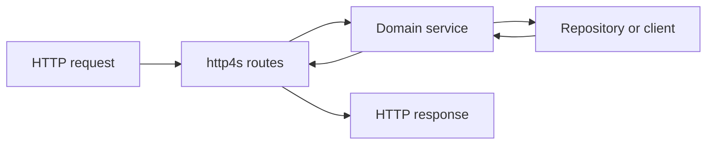

<TLDR>
  <TLDRCell label="what">
    Scala backend services commonly run on the JVM, use static types to express domain constraints, and use effect types to control asynchronous I/O. Cats Effect manages effects and lifetimes, while http4s represents HTTP requests and responses as composable typed values.
  </TLDRCell>
  <TLDRCell label="trap">
    Compiling doesn't mean a request passed runtime validation, and wrapping blocking JDBC in ordinary `IO` doesn't make it nonblocking. An ownerless `Future`, fiber, or resource loses predictable cancellation, error, and shutdown behavior.
  </TLDRCell>
  <TLDRCell label="fix">
    Parse untrusted input at the HTTP boundary, keep domain failures exhaustive, and pass dependencies in from the outside. Run effects at one entry point, manage lifetimes with `Resource`, and bound parallel and blocking work.
  </TLDRCell>
</TLDR>

## What it is and why it exists

Scala backend development means writing long-running service programs in Scala, usually for the Java Virtual Machine (JVM). A service accepts HTTP or RPC requests, invokes domain logic and persistence components, then maps results to protocol responses. Scala calls Java libraries directly, so adopting it doesn't require replacing existing drivers, monitoring tools, or JVM infrastructure.

Scala's type system is useful for representing service states and boundaries. Case classes carry immutable data, enums represent finite alternatives, and <Term id="pattern-matching">pattern matching</Term> makes callers handle those alternatives. Types prevent some invalid programs from compiling, but they can't prove that strings, JSON, or identities received from a network are trustworthy.

A reliable service distinguishes transport data, validated domain commands, persistence records, and public responses. Sending one `case class` through every layer saves a few mapping lines but couples database fields, internal state, and the HTTP contract. An input model cannot double as proof of authorization either.

Functional Scala projects often use Cats Effect to describe side effects and concurrency and http4s for the HTTP adapter. Play, Akka HTTP, ZIO HTTP, and other frameworks can also build services. This page chooses one stack for runnable examples and leaves context-free speed rankings out of the selection process.

These rules apply to new HTTP APIs, aggregation endpoints that call several downstreams, message consumers, and Scala modules inside Java services. This page focuses on the language-runtime boundary: typed errors, dependency boundaries, effect execution, resource ownership, and bounded concurrency. Database design, authentication, and rate limiting have their own topics.

## How it works

### A request crosses four boundaries

A request enters through the server, moves through an HTTP adapter, domain service, and external resources, then returns as a response. Each layer should pass inward only what the next layer needs. If domain code receives `Request[IO]`, or a route returns a database record directly, the boundary has leaked.



The HTTP adapter reads path and query parameters, headers, and the request body, then performs syntactic validation and normalization. The domain service receives meaningful types, checks state transitions, and calls repositories or downstream clients through interfaces. The adapter maps success and failure to stable status codes, headers, and bodies.

| Boundary | Receives | Produces | Must not leak |
| --- | --- | --- | --- |
| HTTP adapter | Strings, JSON, headers | Domain command or protocol error | `Request[IO]` |
| Domain service | Command, trusted principal | Domain result | HTTP status code |
| Repository or client | Query, write intent | Persistence or downstream result | Connection and driver exception |
| Response mapping | Domain result | Status, headers, DTO | Raw exception and internal field |

### Types keep failure on the call path

A Scala 3 `enum` can represent a success value and several failure reasons. When pattern matching over a closed enum, the compiler can check whether every case is handled. Compared with throwing arbitrary exceptions, `Either[OrderError, Order]` keeps expected business failures in the method signature and call path.

Network input still needs runtime validation. A `String` can be blank, an `Int` can exceed a business limit, and a structurally valid order can belong to another tenant. Decoding, field validation, domain invariants, and authorization are separate jobs, even if several failures eventually produce a `4xx` response.

An <Term id="opaque-type">opaque type</Term> can stop raw values from being constructed outside a validated boundary. For example, `OrderId` may be represented by `Long` inside its module while exposing only a safe parser. It improves the compile-time API; it doesn't validate data that a database or JSON framework creates by bypassing the parser.

### Dependencies enter from outside

A domain service receives repositories and clients through constructor parameters. A small <Term id="trait">trait</Term> describing the required capability is the smallest useful form of <Term id="dependency-injection">dependency injection</Term>. Tests can pass an in-memory implementation, while production startup code passes a database implementation; adopting a container is a separate choice.

Interfaces should express business contracts instead of copying database CRUD. `createOnce(requestId)(create)` states an <Term id="idempotency">idempotency</Term> requirement that `insert(order)` doesn't. A production implementation must also atomically store the idempotency key, request fingerprint, domain write, and result; an in-memory implementation only demonstrates the call shape.

### An effect is a description, not a background task

Cats Effect's `IO[A]` describes a computation that may perform side effects and produce an `A`. Constructing an `IO` doesn't immediately run it; an application normally gives the complete program to the runtime at its `IOApp` entry point. Errors, cancellation, and cleanup then remain in one composable return value.

The Scala standard library's `Future` behaves differently: once given an `ExecutionContext`, it normally starts eagerly and has no uniform structured cancellation protocol. Replacing `Future` with `IO` is not a mechanical rename. Evaluation timing, error types, thread shifts, and cancellation semantics all need another review.

Effects may run in parallel only when they are independent, and the concurrency must have a limit. `parMapN` works for a fixed number of independent operations; applying `parTraverse` to an arbitrary collection can open too many connections at once. Real capacity boundaries also include database pools, downstream quotas, memory, and the timeout budget.

### Resources have owners

A <Term id="resource">resource</Term> is more than a file handle: connection pools, HTTP clients, servers, and dedicated executors all have lifetimes. Cats Effect's `Resource[F, A]` combines acquisition and release in one value, and `use` runs finalizers after success, failure, or cancellation. Composed resources release in reverse acquisition order.

The `Resource` scope is the ownership boundary. Returning `A` out of `use`, or calling `allocated` and dropping the release action, breaks the guarantee. A server resource commonly spans the process, a transaction connection spans one unit of work, and a request body stream should not outlive its request.

### http4s adapts the protocol

http4s represents HTTP with `Request[F]`, `Response[F]`, and `HttpRoutes[F]`. A route matches a request by method and URI and produces an optional response in effect `F`; `orNotFound` fills in a `404` for unmatched requests. Tests can run this shape directly without opening a socket.

Entity decoders convert among byte streams, media types, and target Scala types. They don't enforce business field ranges, object-level authorization, or transaction consistency. Response encoding likewise needs dedicated DTOs and a field allowlist instead of convenient serialization of a database object.

## Examples

### Parse untrusted input at the boundary

The first program converts raw fields into a closed enum. It normalizes `sku` and accumulates detected problems, so the downstream service doesn't need exceptions for ordinary input errors.

<Depth level="quick">

```scala title="request_boundary.scala"
//> using scala "3.9.0"

enum ParsedOrder:
  case Valid(sku: String, quantity: Int)
  case Invalid(errors: List[String])

def parseOrder(fields: Map[String, String]): ParsedOrder =
  val sku = fields.get("sku").map(_.trim).getOrElse("")
  val quantity = fields.get("quantity").flatMap(_.toIntOption)
  val errors = List(
    Option.when(sku.isEmpty)("sku is required"),
    Option.when(!quantity.exists(1 to 100 contains _))(
      "quantity must be an integer from 1 to 100"
    )
  ).flatten

  if errors.isEmpty then ParsedOrder.Valid(sku, quantity.get)
  else ParsedOrder.Invalid(errors)

@main def requestBoundary(): Unit =
  val requests = List(
    Map("sku" -> " KB-42 ", "quantity" -> "2"),
    Map("sku" -> "", "quantity" -> "many")
  )

  requests.foreach(request =>
    parseOrder(request) match
      case ParsedOrder.Valid(sku, quantity) =>
        println(s"accepted $sku x$quantity")
      case ParsedOrder.Invalid(errors) =>
        println(s"rejected: ${errors.mkString("; ")}")
  )
```

```text
accepted KB-42 x2
rejected: sku is required; quantity must be an integer from 1 to 100
```

<TryToBreak items={['a missing quantity field', 'a quantity of 0', 'a whitespace-only sku']} />

</Depth>

`quantity.get` runs only in the branch where the error list is empty; the preceding check proves that the value exists and is in range. Split the failure type further if the protocol must distinguish malformed syntax from a business rejection. This parser does not check stock or tenant authorization because that information is not part of its transport fields.

### Inject the idempotent storage contract

The second program makes the repository responsible for creating only once per request. Two calls with the same `requestId` get the same order, while a different request gets a new number.

```scala title="order_service.scala"
//> using scala "3.9.0"

import java.util.concurrent.ConcurrentHashMap
import java.util.concurrent.atomic.AtomicLong

case class Order(id: Long, requestId: String, sku: String, quantity: Int)

trait OrderRepository:
  def createOnce(requestId: String)(create: Long => Order): Order

final class MemoryOrderRepository extends OrderRepository:
  private val nextId = AtomicLong(1000)
  private val orders = ConcurrentHashMap[String, Order]()

  def createOnce(requestId: String)(create: Long => Order): Order =
    orders.computeIfAbsent(requestId, _ => create(nextId.incrementAndGet()))

final class OrderService(repository: OrderRepository):
  def place(requestId: String, sku: String, quantity: Int): Order =
    require(requestId.nonEmpty, "requestId is required")
    require(1 to 100 contains quantity, "quantity is out of range")
    repository.createOnce(requestId)(id => Order(id, requestId, sku, quantity))

@main def runOrderService(): Unit =
  val service = OrderService(MemoryOrderRepository())
  val first = service.place("req-7", "KB-42", 2)
  val retry = service.place("req-7", "KB-42", 2)
  val next = service.place("req-8", "MS-10", 1)

  println(s"first=${first.id}, retry=${retry.id}, same=${first == retry}")
  println(s"next=${next.id}")
```

```text
first=1001, retry=1001, same=true
next=1002
```

The memory repository is useful for a single-process test, not as production idempotency storage. A restart clears it, instances don't share it, and this example does not reject different order content under the same key. A real implementation needs a database uniqueness constraint or equivalent atomic mechanism and must store a normalized request fingerprint.

### Run independent reads in parallel

The third program starts two independent reads together with Cats Effect. `parMapN` waits for both results; an ordinary failure cancels a sibling effect still running and returns the error to the caller.

```scala title="dashboard.scala"
//> using scala "3.9.0"
//> using dep "org.typelevel::cats-effect:3.7.1"

import cats.effect.{IO, IOApp}
import cats.syntax.all.*
import scala.concurrent.duration.*

case class Dashboard(customer: String, openOrders: Int)

def loadCustomer(id: String): IO[String] =
  IO.sleep(40.millis) *> IO.pure(s"customer-$id")

def countOpenOrders(id: String): IO[Int] =
  IO.sleep(20.millis) *> IO.pure(if id == "7" then 3 else 0)

def loadDashboard(id: String): IO[Dashboard] =
  (loadCustomer(id), countOpenOrders(id)).parMapN(Dashboard.apply)

object DashboardApp extends IOApp.Simple:
  def run: IO[Unit] =
    loadDashboard("7").flatMap(dashboard =>
      IO.println(s"${dashboard.customer}: ${dashboard.openOrders} open orders")
    )
```

```text
customer-7: 3 open orders
```

The example's `IO.sleep` observes cancellation without occupying a waiting thread. Real clients also need deadlines and must carry cancellation to the underlying protocol. If both reads share one transaction connection that cannot be used concurrently, keep them sequential or redesign the transaction boundary.

### Execute an http4s route in process

The final program opens no port and passes two real `Request[IO]` values directly to the route. It converts the path parameter at the HTTP boundary and uses a stable error code instead of echoing a parsing exception.

```scala title="order_routes.scala"
//> using scala "3.9.0"
//> using dep "org.http4s::http4s-dsl:0.23.36"

import cats.effect.{IO, IOApp}
import cats.syntax.all.*
import org.http4s.*
import org.http4s.dsl.io.*
import org.http4s.headers.`Content-Type`

def json(status: Status, body: String): Response[IO] =
  Response[IO](status)
    .withEntity(body)
    .withContentType(`Content-Type`(MediaType.application.json))

val routes: HttpRoutes[IO] = HttpRoutes.of[IO]:
  case GET -> Root / "orders" / rawId =>
    rawId.toLongOption match
      case Some(id) => IO.pure(json(Status.Ok, s"{\"id\":$id,\"status\":\"READY\"}"))
      case None => IO.pure(json(Status.BadRequest, "{\"error\":\"invalid_order_id\"}"))

def request(path: String): IO[Unit] =
  val input = Request[IO](Method.GET, Uri.unsafeFromString(path))
  routes.orNotFound.run(input).flatMap(response =>
    response.as[String].flatMap(body =>
      IO.println(s"GET $path -> ${response.status.code} $body")
    )
  )

object OrderRoutesApp extends IOApp.Simple:
  def run: IO[Unit] =
    List("/orders/42", "/orders/nope").traverse_(request)
```

```text
GET /orders/42 -> 200 {"id":42,"status":"READY"}
GET /orders/nope -> 400 {"error":"invalid_order_id"}
```

This example writes JSON by hand only to stay short and avoid another dependency. A production service should use dedicated response DTOs and a configured JSON codec. Tests should still assert the status, `Content-Type`, full body, and branches such as missing resources, disallowed methods, and unacceptable media types.

## Pitfalls

### Treating static types as input validation

> [!PITFALL]
> JSON decoding into `CreateOrder` proves only that fields could construct that Scala type. Blank strings, out-of-range quantities, unauthorized resources, and unwanted extra fields may still cross the boundary.

**Fix:** perform structural validation and normalization in the adapter, then enforce domain invariants and authorization in the service. Use separate types for raw DTOs and validated commands, and test failure responses through real HTTP requests.

### Running effects inside business code

> [!PITFALL]
> Scattered calls to `unsafeRunSync()` create hidden execution boundaries. Errors and cancellation no longer compose, tests may block, and shutdown cannot tell which work is still running.

**Fix:** return `IO` from functions and run the program at one `IOApp` or framework-owned entry point. Use effect-aware test tools instead of synchronous execution that hides a poorly shaped API.

### Wrapping blocking work in ordinary `IO`

> [!PITFALL]
> `IO(jdbcCall())` delays the JDBC call but doesn't change the fact that it blocks a thread. Under concurrency, such calls occupy compute threads and prevent unrelated fibers from progressing.

**Fix:** isolate unavoidable blocking work with `IO.blocking` in the dependency adapter, and also configure the connection pool, statement timeout, and overall deadline. A thread shift does not make the underlying driver cancellable.

### Traversing an unbounded collection in parallel

> [!PITFALL]
> Calling `parTraverse` on an arbitrary request list may start thousands of operations at once. Fibers are lightweight, but they still compete for connections, sockets, memory, and downstream quotas.

**Fix:** set a concurrency limit from measured capacity and give upstream producers <Term id="backpressure">backpressure</Term> or an explicit rejection. Observe queue time, active connections, and timeouts, then tune with load tests instead of copying a universal number.

### Letting a resource escape its scope

> [!PITFALL]
> Returning a client, connection, or stream from `Resource.use` means its finalizer has already run. Calling `allocated` and dropping the release action causes the opposite problem: the resource never closes.

**Fix:** complete all access inside the lexical `use` scope. Compose one process-wide resource graph at application startup, keep request and transaction resources shorter, and test release after both failure and cancellation.

### Sending one model through every layer

> [!PITFALL]
> Reusing a database `case class` as both request and response can expose internal fields and turn persistence migrations into API changes. Returning database exceptions verbatim may also leak SQL and infrastructure details.

**Fix:** define transport DTOs, domain commands, persistence records, and response DTOs separately. Mapping code is where field allowlists, defaults, version conversion, and stable error codes belong; it is not pointless boilerplate.

## In the AI era

**What generated code gets wrong here**

Models often treat `Future` and `IO` as interchangeable async containers, starting a `Future` inside a function that returns `IO` so work begins before the effect is run. They also generate blocking JDBC as `IO(repository.find(id))`, apply unbounded `parTraverse` to request collections, or call `unsafeRunSync()` in a route. Another concrete failure is `resource.allocated.map(_._1)`: tests pass, but the discarded release action slowly exhausts a connection pool after reloads.

**Ask your AI to check**

- List each route's raw inputs, runtime validation, domain conversion, authorization checks, and every HTTP response.
- For every `Future`, `IO.start`, `parTraverse`, and `Resource`, identify the owner, start time, concurrency limit, cancellation path, and shutdown behavior.
- Identify every blocking API and state its `IO.blocking` boundary, connection pool, driver timeout, and overall deadline.

**Review checklist**

- Send malformed input, boundary values, and another tenant's identity through a real `HttpApp` or test server instead of calling only domain methods.
- Confirm that effects run only at their owning entry point and keep errors, cancellation, and resource release in the return type.
- Verify that response DTOs contain no database fields, secrets, stack traces, or raw exception messages.

**Prompt vocabulary**

Use the exact terms `effect boundary`, `referential transparency`, `eager Future`, `fiber cancellation`, `blocking boundary`, `resource safety`, `bounded parallelism`, and `idempotency key`. Ask for an effect-evaluation timeline and resource-ownership graph; "make it async" says nothing about execution or lifetime semantics.

<Depth level="deep">

## Effects, cancellation, and commit boundaries

`IO` separates describing a computation from running it, so a caller can compose retry, timeout, parallelism, and cleanup before execution. That reasoning breaks when a constructor quietly starts a `Future` or thread. During review, trace from the line where each side effect actually begins instead of trusting the outer return type.

<Term id="cancellation">Cancellation</Term> means a computation still cooperating should stop; it does not undo a committed database transaction, sent message, or request accepted by a third party. A client-side timeout does not prove the server performed no write. State-changing endpoints must include an unknown-outcome state in their protocol design.

A caller can keep one stable idempotency key across retries, while the server atomically stores the key, request fingerprint, domain write, and response. The same content under that key receives the stored result; different content is rejected. A process-local `ConcurrentHashMap` cannot preserve that contract across restarts or instances.

A fixed-size `parMapN` cancels a still-running sibling when one branch fails. That suits an aggregate read that must succeed as a unit, but it does not roll back external side effects. If partial success is allowed, capture expected failures per item and define the partial response instead of broadly recovering every error to an empty value.

### Side effects after the response

When an order write and event publication use two systems, either order leaves a window where one succeeds and the other fails. Starting a fiber from the route doesn't close that window. The process may exit after commit but before publication, and a retry may repeat the write.

A transactional outbox stores the domain write and pending-publication record in one database transaction. A separate publisher reads records, delivers them, and records progress recoverably. Publication outcomes can also be unknown, so consumers still need idempotent handling keyed by message identity.

## Blocking boundaries and capacity

A waiting fiber and a waiting thread are different. `IO.sleep` and compatible asynchronous clients can release compute threads while they wait; JDBC and many older Java SDKs occupy a thread until the call returns. `IO.blocking` moves the latter to a dedicated blocking pool, but it does not increase database capacity.

There is no universal formula for a connection pool or concurrency limit without measurements. A useful value depends on database limits, query latency, request concurrency, instance count, and downstream budgets. Observe pool wait time, active connections, queue length, latency, and timeouts, then tune under production-like load.

Deadlines need to propagate downward. If a JDBC statement or HTTP client keeps a longer default timeout after the entry-point timeout fires, it continues holding a thread or connection. A cancellation test should make one dependency wait, cancel the parent effect, and assert that siblings stop, resources release, and no late commit occurs.

<Term id="backpressure">Backpressure</Term> makes production respect consumer capacity. For a finite collection, use a parallel traversal with a bound; for a continuous flow, streaming libraries such as FS2 can carry demand through the pipeline. If the protocol cannot slow a producer, the system needs a bounded buffer and explicit overload response rather than an unbounded queue.

## The shape of an http4s adapter

A small http4s module can compose middleware first and register `HttpRoutes` that only adapt the protocol. Authentication middleware establishes a trusted principal, entity decoders handle media types and bodies, and routes map field errors and domain conflicts explicitly. An outer handler records unexpected faults under a correlation ID and returns a stable public error.

Request and response bodies are streams, so reading all of one into memory is not a free default. Uploads, proxies, and large responses need size limits, timeouts, and streaming; error bodies should be bounded too. Content-negotiation failures, incorrect `Content-Type`, and unacceptable `Accept` values belong in the HTTP contract tests.

Running an `HttpApp` in process tests routes, statuses, headers, and bodies deterministically without a port. Ordinary unit tests still cover domain branches, while database constraints and transactions need integration tests against a real database. Keep a smaller real-network suite for proxies, TLS, binding, and shutdown.

http4s server builders return `Resource`, so the listening socket, executors, and dependencies can live in one application resource graph. Startup acquires them in dependency order; shutdown releases them in reverse. Don't hide server startup in object initialization or a test import path, where tests open ports unexpectedly and shutdown hooks are hard to verify.

</Depth>

<Checkpoint id="backend/scala-backend" />

## Further reading

- [Scala current releases and downloads](https://www.scala-lang.org/download/)
- [Scala 3 domain modeling tools](https://docs.scala-lang.org/scala3/book/domain-modeling-tools.html)
- [Cats Effect getting started](https://typelevel.org/cats-effect/docs/getting-started)
- [Cats Effect `Resource`](https://typelevel.org/cats-effect/docs/std/resource)
- [Defining an http4s service](https://http4s.org/v0.23/docs/service.html)
- [Testing http4s](https://http4s.org/v0.23/docs/testing.html)
