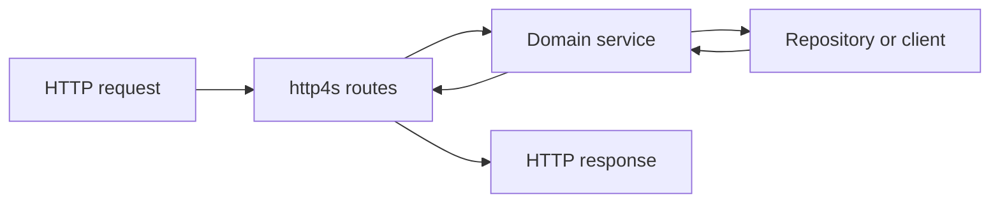

<TLDR>
  <TLDRCell label="what">
    Scala后端服务通常运行在JVM上，用静态类型表达领域约束，并用效果类型控制异步I/O。Cats Effect管理效果与生命周期，http4s把HTTP请求和响应表示为可组合的带类型值。
  </TLDRCell>
  <TLDRCell label="trap">
    编译通过不表示请求已经过运行时校验；把阻塞JDBC包进普通`IO`也不会使它变成非阻塞。失去所有者的`Future`、纤程和资源会让取消、错误及关闭行为失控。
  </TLDRCell>
  <TLDRCell label="fix">
    在HTTP边界解析不可信输入，让领域错误保持穷尽可见，并把依赖从外部传入。只在一个入口运行效果，用`Resource`管理生命周期，并限制并行度与阻塞工作。
  </TLDRCell>
</TLDR>

## 是什么，为什么存在

Scala后端开发是用Scala编写长期运行的服务程序，通常部署在Java虚拟机（JVM）上。服务接收HTTP或RPC请求，调用领域逻辑和持久化组件，再把结果映射成协议响应。Scala可以直接调用Java库，因此现有驱动、监控工具和JVM基础设施不必随语言一起更换。

Scala的类型系统适合表达服务中的状态和边界。样例类（case class）承载不可变数据，枚举（enum）表示有限分支，<Term id="pattern-matching">模式匹配（pattern matching）</Term>迫使调用方处理这些分支。类型能阻止一部分非法程序编译，却不能证明来自网络的字符串、JSON与身份可信。

可靠的服务会区分传输数据、已校验的领域命令、持久化记录和公开响应。让一个`case class`穿过所有层虽然少写几行映射，却会把数据库字段、内部状态与HTTP契约绑在一起。输入模型尤其不能兼任授权结果。

函数式Scala项目常用Cats Effect描述副作用和并发，用http4s实现HTTP适配层。Play、Akka HTTP、ZIO HTTP和其他框架也能构建服务；这里选择一套可运行示例，不用没有测量依据的速度排名替你做技术选型。

这些规则会出现在新建HTTP API、聚合多个下游的端点、消息消费者，以及Java服务中的Scala模块里。本页聚焦语言和运行时交界处：带类型错误、依赖边界、效果执行、资源所有权与有限并发。数据库设计、认证和限流由相关主题展开。

## 工作原理

### 一个请求穿过四层边界

请求从服务器进入，经过HTTP适配层、领域服务和外部资源，最后沿相反方向形成响应。每层只把下一层需要的信息传进去。如果领域代码接收`Request[IO]`，或者路由直接返回数据库记录，边界已经泄漏。



HTTP适配层读取路径、查询参数、请求头与正文，并完成语法校验和规范化。领域服务接收有业务含义的类型，检查状态转换，再通过接口调用仓库或下游客户端。适配层把成功与失败映射为稳定的状态码、响应头和响应体。

| 边界 | 接收 | 产出 | 不应泄漏 |
| --- | --- | --- | --- |
| HTTP适配层 | 字符串、JSON、请求头 | 领域命令或协议错误 | `Request[IO]` |
| 领域服务 | 命令、可信主体 | 领域结果 | HTTP状态码 |
| 仓库或客户端 | 查询、写入意图 | 持久化或下游结果 | 连接与驱动异常 |
| 响应映射 | 领域结果 | 状态码、响应头、DTO | 原始异常与内部字段 |

### 类型把失败留在调用路径上

Scala 3的`enum`可以同时表示成功值和不同失败原因。模式匹配处理封闭的枚举时，编译器能检查分支是否穷尽。与抛出任意异常相比，`Either[OrderError, Order]`会把预期业务失败保留在方法签名和调用路径上。

网络输入仍需运行时校验。`String`可以是空白，`Int`可以超出业务范围，结构正确的订单也可能属于另一租户。解码、字段校验、领域不变量与授权是不同工作，不应因为最终都返回`4xx`就混为一层。

<Term id="opaque-type">不透明类型（opaque type）</Term>适合阻止原始值在已校验边界之外被随意构造。例如，`OrderId`可以在模块内部表示为`Long`，对外只暴露安全的解析器。它改善编译期API，不会自动校验数据库或JSON框架绕过解析器产生的数据。

### 依赖从外部进入

领域服务通过构造参数接收仓库和客户端。用一个小型 <Term id="trait">特征（trait）</Term> 描述所需能力，就是<Term id="dependency-injection">依赖注入（dependency injection）</Term>的最小形式。测试可以传入内存实现，生产启动代码则传入数据库实现；是否采用容器是另一个决定。

接口应表达业务契约，而不是照抄数据库CRUD。`createOnce(requestId)(create)`明确要求<Term id="idempotency">幂等性（idempotency）</Term>，`insert(order)`则没有。生产实现还要原子保存幂等键、请求指纹、领域写入和结果，内存实现只能说明调用形状。

### 效果是描述，不是后台任务

Cats Effect的`IO[A]`描述一项可能执行副作用并产生`A`的计算。构造`IO`不会立即运行它；应用通常在`IOApp`入口把完整程序交给运行时。这样错误、取消与清理仍留在一个可组合的返回值里。

Scala标准库的`Future`行为不同：给定`ExecutionContext`后，它通常立即开始执行，而且没有统一的结构化取消协议。把`Future`换成`IO`不是机械改名；评估时机、错误类型、线程切换和取消语义都必须重新检查。

可并行的效果必须彼此独立，而且并发数量要有上限。`parMapN`适合固定数量的独立操作；对任意长度集合直接`parTraverse`可能同时打开过多连接。真正的容量边界还包括数据库连接池、下游限额、内存和超时预算。

### 资源有明确所有者

资源（resource）不只是文件句柄，也包括连接池、HTTP客户端、服务器和专用执行器。Cats Effect的`Resource[F, A]`把获取与释放组成一个值，`use`保证在成功、失败或取消后运行终结器。组合的资源按与获取相反的顺序释放。

`Resource`的作用域就是所有权边界。把`A`从`use`中泄漏出去，或者调用`allocated`后丢掉释放动作，会破坏保证。服务器资源通常覆盖整个进程，事务连接只覆盖一个工作单元，请求正文流则不应比请求活得更久。

### http4s适配协议

http4s用`Request[F]`、`Response[F]`和`HttpRoutes[F]`表示HTTP。路由根据方法和URI匹配请求，在效果`F`中产生可选响应；`orNotFound`再为未匹配请求补上`404`。这种形状允许测试直接运行路由，不必打开套接字。

实体解码器解决字节流、媒体类型和目标Scala类型之间的转换。它不负责业务字段范围、对象级授权或事务一致性。响应编码同样需要专用DTO和字段白名单，不能把数据库对象方便地整体序列化。

## 示例

### 在边界解析不可信输入

第一个程序把原始字段转换成封闭枚举。它规范化`sku`并累积已发现的问题，因此后续服务不用靠异常处理普通输入错误。

<Depth level="quick">

```scala title="request_boundary.scala"
//> using scala "3.9.0"

enum ParsedOrder:
  case Valid(sku: String, quantity: Int)
  case Invalid(errors: List[String])

def parseOrder(fields: Map[String, String]): ParsedOrder =
  val sku = fields.get("sku").map(_.trim).getOrElse("")
  val quantity = fields.get("quantity").flatMap(_.toIntOption)
  val errors = List(
    Option.when(sku.isEmpty)("sku is required"),
    Option.when(!quantity.exists(1 to 100 contains _))(
      "quantity must be an integer from 1 to 100"
    )
  ).flatten

  if errors.isEmpty then ParsedOrder.Valid(sku, quantity.get)
  else ParsedOrder.Invalid(errors)

@main def requestBoundary(): Unit =
  val requests = List(
    Map("sku" -> " KB-42 ", "quantity" -> "2"),
    Map("sku" -> "", "quantity" -> "many")
  )

  requests.foreach(request =>
    parseOrder(request) match
      case ParsedOrder.Valid(sku, quantity) =>
        println(s"accepted $sku x$quantity")
      case ParsedOrder.Invalid(errors) =>
        println(s"rejected: ${errors.mkString("; ")}")
  )
```

```text
accepted KB-42 x2
rejected: sku is required; quantity must be an integer from 1 to 100
```

<TryToBreak items={['缺少quantity字段', 'quantity为0', 'sku只有空白字符']} />

</Depth>

`quantity.get`只在错误列表为空的分支执行，前面的检查已经证明值存在且在范围内。若协议需要分别报告语法错误和业务拒绝，应继续拆分失败类型。解析函数还没有做库存或租户授权，因为那些信息不属于传输字段。

### 把幂等存储契约注入服务

第二个程序让仓库负责“同一请求只创建一次”。相同`requestId`的两次调用得到同一个订单，不同请求则得到新编号。

```scala title="order_service.scala"
//> using scala "3.9.0"

import java.util.concurrent.ConcurrentHashMap
import java.util.concurrent.atomic.AtomicLong

case class Order(id: Long, requestId: String, sku: String, quantity: Int)

trait OrderRepository:
  def createOnce(requestId: String)(create: Long => Order): Order

final class MemoryOrderRepository extends OrderRepository:
  private val nextId = AtomicLong(1000)
  private val orders = ConcurrentHashMap[String, Order]()

  def createOnce(requestId: String)(create: Long => Order): Order =
    orders.computeIfAbsent(requestId, _ => create(nextId.incrementAndGet()))

final class OrderService(repository: OrderRepository):
  def place(requestId: String, sku: String, quantity: Int): Order =
    require(requestId.nonEmpty, "requestId is required")
    require(1 to 100 contains quantity, "quantity is out of range")
    repository.createOnce(requestId)(id => Order(id, requestId, sku, quantity))

@main def runOrderService(): Unit =
  val service = OrderService(MemoryOrderRepository())
  val first = service.place("req-7", "KB-42", 2)
  val retry = service.place("req-7", "KB-42", 2)
  val next = service.place("req-8", "MS-10", 1)

  println(s"first=${first.id}, retry=${retry.id}, same=${first == retry}")
  println(s"next=${next.id}")
```

```text
first=1001, retry=1001, same=true
next=1002
```

内存仓库适合单进程测试，不是生产幂等存储。重启会清空它，多实例之间也不共享数据，而且这段示例没有拒绝同一键配合不同订单内容。真实实现需要数据库唯一约束或等价原子机制，并保存规范化请求指纹。

### 并行执行独立读取

第三个程序用Cats Effect同时启动两个独立读取。`parMapN`等待两个结果；普通失败会取消仍在运行的同级效果，并把错误交还给调用方。

```scala title="dashboard.scala"
//> using scala "3.9.0"
//> using dep "org.typelevel::cats-effect:3.7.1"

import cats.effect.{IO, IOApp}
import cats.syntax.all.*
import scala.concurrent.duration.*

case class Dashboard(customer: String, openOrders: Int)

def loadCustomer(id: String): IO[String] =
  IO.sleep(40.millis) *> IO.pure(s"customer-$id")

def countOpenOrders(id: String): IO[Int] =
  IO.sleep(20.millis) *> IO.pure(if id == "7" then 3 else 0)

def loadDashboard(id: String): IO[Dashboard] =
  (loadCustomer(id), countOpenOrders(id)).parMapN(Dashboard.apply)

object DashboardApp extends IOApp.Simple:
  def run: IO[Unit] =
    loadDashboard("7").flatMap(dashboard =>
      IO.println(s"${dashboard.customer}: ${dashboard.openOrders} open orders")
    )
```

```text
customer-7: 3 open orders
```

示例中的`IO.sleep`可以响应取消，不占住等待线程。真实客户端还需要截止时间，并确认取消能到达底层协议。若两次读取共享一条不支持并发访问的事务连接，就应保持串行，或者重新设计事务边界。

### 在进程内执行http4s路由

最后一个程序不打开端口，直接把两个真实`Request[IO]`交给路由。路径参数在HTTP边界转换，错误响应使用稳定代码而不是回显解析异常。

```scala title="order_routes.scala"
//> using scala "3.9.0"
//> using dep "org.http4s::http4s-dsl:0.23.36"

import cats.effect.{IO, IOApp}
import cats.syntax.all.*
import org.http4s.*
import org.http4s.dsl.io.*
import org.http4s.headers.`Content-Type`

def json(status: Status, body: String): Response[IO] =
  Response[IO](status)
    .withEntity(body)
    .withContentType(`Content-Type`(MediaType.application.json))

val routes: HttpRoutes[IO] = HttpRoutes.of[IO]:
  case GET -> Root / "orders" / rawId =>
    rawId.toLongOption match
      case Some(id) => IO.pure(json(Status.Ok, s"{\"id\":$id,\"status\":\"READY\"}"))
      case None => IO.pure(json(Status.BadRequest, "{\"error\":\"invalid_order_id\"}"))

def request(path: String): IO[Unit] =
  val input = Request[IO](Method.GET, Uri.unsafeFromString(path))
  routes.orNotFound.run(input).flatMap(response =>
    response.as[String].flatMap(body =>
      IO.println(s"GET $path -> ${response.status.code} $body")
    )
  )

object OrderRoutesApp extends IOApp.Simple:
  def run: IO[Unit] =
    List("/orders/42", "/orders/nope").traverse_(request)
```

```text
GET /orders/42 -> 200 {"id":42,"status":"READY"}
GET /orders/nope -> 400 {"error":"invalid_order_id"}
```

这里手写JSON，只为让示例保持短小并减少依赖。生产服务应使用专用响应DTO和经过配置的JSON编解码器。测试仍要断言状态码、`Content-Type`、完整响应体，以及资源不存在、方法不允许和不可接受媒体类型等分支。

## 陷阱

### 把静态类型当成输入校验

> [!PITFALL]
> JSON能解码为`CreateOrder`，只说明字段可以构造成该Scala类型。空字符串、越界数量、未经授权的资源与多余字段仍可能穿过边界。

**修复：**在适配层做结构校验与规范化，在服务层检查领域不变量和授权。用不同类型表示原始DTO与已校验命令，并通过真实HTTP请求测试失败响应。

### 在业务代码中运行效果

> [!PITFALL]
> 到处调用`unsafeRunSync()`会建立多个隐藏执行边界。错误和取消无法组合，测试可能阻塞，服务关闭也不知道哪些工作仍在运行。

**修复：**让函数返回`IO`，并在`IOApp`或框架拥有的单一入口运行程序。测试使用效果测试工具，不要用同步执行掩盖错误的API形状。

### 把阻塞调用包装成普通`IO`

> [!PITFALL]
> `IO(jdbcCall())`推迟了JDBC调用，却没有改变它会阻塞线程的事实。高并发下，这类调用会占住计算线程，妨碍其他纤程取得进展。

**修复：**在依赖适配器中用`IO.blocking`隔离无法避免的阻塞工作，并同时配置连接池、语句超时与总截止时间。线程切换不会让底层驱动自动支持取消。

### 对无界集合使用并行遍历

> [!PITFALL]
> 对任意请求列表调用`parTraverse`可能一次创建数千项工作。纤程很轻，也仍会竞争连接、套接字、内存和下游配额。

**修复：**根据真实容量设置并发上限，并让上游获得<Term id="backpressure">背压（backpressure）</Term>或明确拒绝。观察排队时间、活动连接与超时，再用负载测试调整，而不是复制通用数字。

### 让资源逃出作用域

> [!PITFALL]
> 从`Resource.use`返回客户端、连接或流后，终结器已经运行。直接使用`allocated`却丢掉释放动作，则会造成相反问题：资源永远不关闭。

**修复：**在`use`的词法作用域内完成所有访问。由应用组合一个覆盖整个进程的资源图，让请求或事务资源保持更短生命周期，并在测试中验证失败与取消后的释放。

### 用一个模型穿过所有层

> [!PITFALL]
> 复用数据库`case class`作为请求和响应，会让内部字段意外公开，也会让持久化迁移变成API变更。数据库异常原样返回还可能泄漏SQL与基础设施细节。

**修复：**分别定义传输DTO、领域命令、持久化记录与响应DTO。映射代码是实施字段白名单、默认值、版本转换和稳定错误代码的位置，不是无意义样板。

<Depth level="deep">

## 效果、取消与提交边界

`IO`把计算描述与计算执行分开，所以调用方可以在运行前组合重试、超时、并行和清理。只要某个构造器内部偷偷启动`Future`或线程，这种推理就会失效。审查时要从副作用真正开始的那一行追踪，而不是只看最外层返回类型。

<Term id="cancellation">取消（cancellation）</Term>表示仍在协作的计算应停止，不会撤销已经提交的数据库事务、已发送消息或第三方已经接受的请求。客户端看到超时，也不能据此推断服务端没有写入。会修改状态的端点必须把“结果未知”纳入协议设计。

调用方可在重试间保持一个稳定幂等键，服务端则把该键、请求指纹、领域写入和响应原子保存。同一键配合相同内容返回已保存结果，配合不同内容则拒绝。进程内`ConcurrentHashMap`无法跨重启和多实例维持这个契约。

固定数量的`parMapN`在一个分支失败时会取消仍在运行的同级分支。这适合必须整体成功的聚合读取，但不等于撤销外部副作用。若允许部分成功，就要逐项捕获预期失败并定义部分响应，而不是用宽泛恢复把所有异常变成空值。

### 响应后的副作用

订单写入与事件发布分属两个系统时，任何先后顺序都存在一个成功、另一个失败的窗口。从路由启动纤程不能关闭窗口；进程可能在提交后、发布前退出，重试又可能重复写入。

事务outbox把领域写入和待发布记录放进同一数据库事务。独立发布器随后读取记录、投递并以可恢复方式记录进度。发布结果也可能未知，因此消费者仍应按消息标识实现幂等处理。

## 阻塞边界与容量

纤程等待与线程等待不是一回事。`IO.sleep`和兼容的异步客户端等待时可以释放计算线程，JDBC与许多旧Java SDK则会占住线程直到调用返回。`IO.blocking`把后者移到专用阻塞池，但不会提高数据库本身的容量。

不要在没有测量的情况下给连接池或并发限制写通用公式。合理值取决于数据库上限、查询时延、请求并发、实例数量和下游预算。观察池等待时间、活动连接、队列长度、延迟与超时，再在接近生产的负载下调整。

截止时间应向下传递。入口超时结束后，若JDBC语句或HTTP客户端仍按更长默认超时运行，它们会继续占用线程和连接。测试取消时，应让依赖明确等待，再断言父效果返回、同级工作停止、资源释放且没有晚到的提交。

<Term id="backpressure">背压（backpressure）</Term>要求生产速度服从消费能力。对于有限集合，可以使用带上限的并行遍历；对于持续数据流，FS2等流库能让需求信号沿管线传播。若协议无法减慢生产者，系统需要有界缓冲和明确的过载响应，而不是无界队列。

## http4s适配层的形状

小型http4s模块可以先组合中间件，再登记只负责适配的`HttpRoutes`。认证中间件建立可信主体，实体解码器处理媒体类型和正文，路由显式映射字段错误与领域冲突。意外故障在外层统一记录关联ID，并返回稳定公共错误。

请求与响应正文是流，完整读入内存不是无成本默认值。上传、代理和大响应需要大小限制、超时与流式处理；错误正文也应有界。内容协商失败、错误的`Content-Type`和不可接受的`Accept`都属于HTTP契约测试范围。

进程内运行`HttpApp`可以稳定验证路由、状态、响应头和正文，不需要端口。服务层仍用普通单元测试覆盖领域分支，数据库约束与事务则需要真实数据库集成测试。另保留少量真实网络测试，覆盖代理、TLS、绑定地址和关闭过程。

http4s的服务器构建器返回`Resource`，所以监听套接字、执行器和依赖可以进入同一个应用资源图。启动按依赖顺序获取，关闭按反向顺序释放。不要把服务器启动藏进对象初始化或测试导入路径，否则测试会意外打开端口，关闭钩子也难以验证。

</Depth>

<Checkpoint id="backend/scala-backend" />

## 延伸阅读

- [Scala当前版本与下载](https://www.scala-lang.org/download/)
- [Scala 3领域建模工具](https://docs.scala-lang.org/scala3/book/domain-modeling-tools.html)
- [Cats Effect入门](https://typelevel.org/cats-effect/docs/getting-started)
- [Cats Effect `Resource`](https://typelevel.org/cats-effect/docs/std/resource)
- [http4s服务定义](https://http4s.org/v0.23/docs/service.html)
- [http4s测试](https://http4s.org/v0.23/docs/testing.html)
