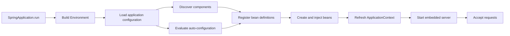

<TLDR>
  <TLDRCell label="what">
    Spring Boot creates stand-alone Spring applications by combining the Spring container with
    conditional configuration, curated dependencies, an embedded server, and operational support.
  </TLDRCell>
  <TLDRCell label="when">
    Use it when a Java service benefits from Spring's dependency injection and ecosystem and the team
    wants explicit application code without manually assembling every framework integration.
  </TLDRCell>
  <TLDRCell label="how">
    Start with only the required starters, put the application class above the packages it should scan,
    bind and validate configuration, then test the context and the real HTTP boundary.
  </TLDRCell>
</TLDR>

## What it is and why it exists

Spring Boot is an application framework built on the Spring Framework. Spring supplies the container,
dependency injection, web stack, transactions, and other programming models; Boot decides how to
assemble common combinations from the libraries and settings present in an application. The result is
still a Spring application, not a separate replacement for Spring.

The problem it solves is integration setup. A servlet API, JSON mapper, validation provider, server,
logging system, and metrics registry each have their own lifecycle and configuration. Boot supplies
conditional defaults for known combinations, while leaving application code free to replace specific
parts. This is more precise than saying that Boot “requires no configuration.”

<Term id="auto-configuration">Auto-configuration</Term> contributes configuration when its conditions
match. A servlet web application appears when the required web classes are on the classpath; a default
component can back away when the application defines its own <Term id="spring-bean">Spring bean</Term>.
The conditions make defaults contextual rather than universal.

A <Term id="starter-dependency">starter dependency</Term> is a curated dependency descriptor for one
capability, such as Spring MVC or Actuator. It keeps a compatible group of libraries together and lets
Boot manage their versions. A starter is not a module switch: classpath contents make configurations
eligible, while conditions and properties decide what is actually created.

Boot applications run through an <Term id="application-context">application context</Term>, the Spring
container that owns bean definitions and instances. <Term id="dependency-injection">Dependency
injection</Term> connects those instances, normally through constructors. Controllers, services,
configuration objects, and infrastructure adapters therefore share one explicit object graph.

Boot also turns configuration into deployment input. <Term id="externalized-configuration">Externalized
configuration</Term> can come from packaged files, profile-specific files, environment variables,
system properties, command-line arguments, and other property sources. The application artifact can
stay unchanged while ports, endpoints, credentials, and feature choices vary by environment.

You meet Spring Boot in HTTP services, batch jobs, message consumers, command-line applications, and
larger modular systems. It is a good fit when Spring integrations reduce more work than the container
and startup model add. A tiny function or service that needs no Spring features may have a simpler
runtime and test boundary without it.

Spring Security, Spring Data, messaging, containers, and orchestration are separate concerns built on
top of this core. Adding every starter to an initial project hides which dependency caused which
behavior. Learn the context, conditions, configuration, web boundary, and test boundary first; add an
integration only when a requirement names it.

## How it works

`SpringApplication.run()` builds an environment, chooses an application-context type, loads bean
definitions, refreshes the context, and starts the selected runtime. In a servlet application, the
refresh creates the web infrastructure and embedded server. Startup either produces one coherent
context or fails; a half-bound configuration object should not survive into request handling.

`@SpringBootApplication` is a convenience annotation combining `@SpringBootConfiguration`,
`@EnableAutoConfiguration`, and `@ComponentScan`. The first identifies the primary configuration, the
second imports Boot's auto-configuration candidates, and the third discovers application components.
Those three jobs are related but have different failure modes.

The package of the application class is the default search root. Placing it in
`com.example.catalog` includes subpackages such as `com.example.catalog.web` and
`com.example.catalog.service`. Putting it in a feature subpackage can silently omit siblings; putting
it in the unnamed default package can make scanning unreasonably broad.

Auto-configuration candidates declare conditions over classes, beans, properties, resources, and
application type. Boot evaluates those conditions while building the context. Matching configuration
registers bean definitions; a failed condition explains why a configuration did not apply rather than
representing an application error.



### Defaults that back away

Boot's defaults are non-invasive at the bean boundary. For example, an auto-configuration guarded by
`@ConditionalOnMissingBean` contributes its default only if the relevant bean is absent. Defining an
application bean can therefore replace one part without disabling unrelated web, JSON, or metrics
configuration.

Back-off is type- and condition-specific. Adding a bean that looks conceptually similar does not prove
that it satisfies the exact condition, and defining two beans of an injectable type may create an
ambiguity instead of an override. Read the condition report and the configuration's documented
extension points before adding exclusions.

Run with `--debug` when startup behavior is surprising. Boot logs a conditions evaluation report that
separates positive and negative matches. With Actuator deliberately exposed and secured, the
`conditions` endpoint can provide related runtime evidence; it should not be made public merely for
convenience.

### Bean ownership and injection

A bean definition tells the context how to obtain an object and what lifecycle rules apply. The
default scope is one instance per application context, often called singleton scope. It does not mean
one instance across every context, test, or JVM, and it provides no automatic thread safety for mutable
state.

Constructor injection makes required dependencies visible and lets the container reject an incomplete
graph during startup. A single constructor needs no `@Autowired`. Field injection hides requirements
until reflection fills them, makes ordinary construction awkward, and encourages tests that bypass the
same lifecycle production uses.

Component stereotypes such as `@RestController`, `@Service`, and `@Configuration` make classes
eligible for specific roles. A `@Bean` method is useful when construction needs code or the type comes
from a third-party library. Neither mechanism should turn the context into a service locator fetched
from business methods.

### Configuration binding and precedence

Boot considers property sources in a defined order, with later sources able to override earlier ones.
Command-line arguments outrank operating-system environment variables, and those outrank packaged
configuration data. An override is useful only if operators and tests know which source won, so record
the effective non-secret configuration needed to diagnose a deployment.

`@ConfigurationProperties` binds a related property namespace to a structured object. Relaxed binding
maps `catalog.page-size` to an environment variable such as `CATALOG_PAGE_SIZE`, while validation
annotations can reject missing or out-of-range values at startup. This is safer for a group of settings
than scattering string keys and conversions across `@Value` fields.

Profiles select sets of configuration and beans; they do not create a security boundary. A secret
committed to `application-prod.properties` remains a committed secret. Supply sensitive values through
the deployment's secret mechanism, make required values fail closed, and avoid plausible development
defaults for production credentials.

### The HTTP path

With the Spring MVC starter present, Boot configures the dispatcher servlet, message converters,
validation integration, error handling infrastructure, and an embedded servlet container. A request
reaches the server, passes filters, is mapped to a controller method, invokes application services, and
has its return value converted into an HTTP response. Each step is a contract boundary, not hidden
magic.

Returning a Java record can produce JSON because a compatible JSON mapper and message converter are on
the classpath. That does not define authorization, transactionality, status semantics, or a stable
public schema. The controller must still validate transport input, call a service with explicit domain
rules, and return the statuses and fields promised by the API contract.

## Examples

These three examples form one small catalog project generated by Spring Initializr with Maven, Java,
Spring Boot 4.1.1, Spring Web MVC, Validation, and Actuator. They were compiled and executed with the
generated Maven wrapper and local OpenJDK 21.0.12; the source uses APIs and language features valid for
the target Java 25 LTS. The displayed output is from those runs.

### Starting a JSON endpoint

The application class supplies the configuration root and executable entry point. The adjacent
controller is discovered by component scanning, and Boot configures the server and JSON conversion
because the Spring MVC starter is present.

<Depth level="quick">

```java title="CatalogApplication.java"
package com.codewiki.catalog;

import org.springframework.boot.SpringApplication;
import org.springframework.boot.autoconfigure.SpringBootApplication;
import org.springframework.web.bind.annotation.GetMapping;
import org.springframework.web.bind.annotation.PathVariable;
import org.springframework.web.bind.annotation.RestController;

@SpringBootApplication
public class CatalogApplication {
    public static void main(String[] args) {
        SpringApplication.run(CatalogApplication.class, args);
    }
}

@RestController
class ProductController {
    @GetMapping("/products/{sku}")
    Product find(@PathVariable String sku) {
        return new Product(sku, "Mechanical keyboard", 12900);
    }
}

record Product(String sku, String name, int priceInCents) {}
```

```text
HTTP/1.1 200
Content-Type: application/json

{"sku":"KB-1","name":"Mechanical keyboard","priceInCents":12900}
```

<TryToBreak items={['Request a SKU containing an encoded slash', 'Remove the Spring MVC starter', 'Move the controller outside the scan root']} />

</Depth>

The response proves routing and conversion for one happy path. It does not prove that the SKU exists,
that the caller may see it, or that `priceInCents` is the intended public representation. Those rules
belong in a service and the API contract rather than in assumptions attached to auto-configuration.

The server started on the default port because no override was supplied. A real deployment should set
the port and proxy behavior explicitly where they differ, then test through the deployed ingress. An
embedded server removes the external WAR deployment step; it does not remove the network boundary.

### Binding validated settings

The next file registers a typed configuration object and prints its effective values after the context
starts. `@Validated` applies Jakarta Validation constraints during binding, so invalid configuration
stops startup before the runner or an HTTP handler can use it.

```java title="CatalogConfiguration.java"
package com.codewiki.catalog;

import jakarta.validation.constraints.Max;
import jakarta.validation.constraints.Min;
import jakarta.validation.constraints.NotBlank;
import org.springframework.boot.ApplicationRunner;
import org.springframework.boot.context.properties.ConfigurationProperties;
import org.springframework.boot.context.properties.EnableConfigurationProperties;
import org.springframework.context.annotation.Bean;
import org.springframework.context.annotation.Configuration;
import org.springframework.validation.annotation.Validated;

@ConfigurationProperties("catalog")
@Validated
record CatalogSettings(
        @NotBlank String currency,
        @Min(1) @Max(100) int pageSize) {}

@Configuration(proxyBeanMethods = false)
@EnableConfigurationProperties(CatalogSettings.class)
class CatalogConfiguration {
    @Bean
    ApplicationRunner showSettings(CatalogSettings settings) {
        return args -> System.out.printf(
                "catalog currency=%s pageSize=%d%n",
                settings.currency(), settings.pageSize());
    }
}
```

```text
catalog currency=EUR pageSize=24
```

The run set `CATALOG_CURRENCY=EUR` and `CATALOG_PAGE_SIZE=24`, then selected a non-web application so it
could exit after the runner. The environment variable names demonstrate relaxed binding. Packaged
defaults of `catalog.currency=USD` and `catalog.page-size=20` were overridden by the environment.

Printing selected non-secret settings can make precedence diagnosable. Never dump the entire
environment or configuration-property endpoint into logs: it may contain passwords, tokens, internal
hosts, and personal data. Treat redaction and endpoint access as part of the operational contract.

### Testing the configured web boundary

This test starts the Boot context without a listening server and attaches `MockMvc` to the configured
Spring MVC stack. It asserts status, compatible media type, and one field before printing the response.
The Boot 4 import path for `AutoConfigureMockMvc` is intentionally shown.

```java title="CatalogApplicationTests.java"
package com.codewiki.catalog;

import org.junit.jupiter.api.Test;
import org.springframework.beans.factory.annotation.Autowired;
import org.springframework.boot.test.context.SpringBootTest;
import org.springframework.boot.webmvc.test.autoconfigure.AutoConfigureMockMvc;
import org.springframework.test.web.servlet.MockMvc;

import static org.springframework.test.web.servlet.request.MockMvcRequestBuilders.get;
import static org.springframework.test.web.servlet.result.MockMvcResultMatchers.content;
import static org.springframework.test.web.servlet.result.MockMvcResultMatchers.jsonPath;
import static org.springframework.test.web.servlet.result.MockMvcResultMatchers.status;

@SpringBootTest
@AutoConfigureMockMvc
class CatalogApplicationTests {
    @Autowired
    MockMvc mvc;

    @Test
    void returnsAProduct() throws Exception {
        var response = mvc.perform(get("/products/KB-1"))
                .andExpect(status().isOk())
                .andExpect(content().contentTypeCompatibleWith("application/json"))
                .andExpect(jsonPath("$.sku").value("KB-1"))
                .andReturn().getResponse();

        System.out.println(response.getStatus() + " " + response.getContentAsString());
    }
}
```

```text
200 {"sku":"KB-1","name":"Mechanical keyboard","priceInCents":12900}
```

`MockMvc` covers controller mapping, configured filters, argument resolution, and message conversion
without a socket. It does not prove servlet-container behavior, TLS, proxy headers, or the packaged
artifact. Add a random-port test or a deployed smoke test when those layers are part of the risk.

The full context makes this a useful wiring test but loads more than a focused web slice. Use a slice
when its omitted collaborators are replaced deliberately and another test proves complete startup.
Choose the smallest test that answers the question without pretending omitted layers were exercised.

## Pitfalls

### Scanning the wrong package tree

> [!PITFALL]
> A generated application class placed below controllers or services can start successfully while those components remain undiscovered. Moving the class to the unnamed package has the opposite problem and can scan dependencies unexpectedly.

**Fix:** put the application class in a named root package above application components, or declare
scan packages explicitly when the module layout requires it. Keep a context test that resolves a
representative controller and service, and treat scan-boundary changes as behavioral changes.

### Treating starters as harmless conveniences

> [!PITFALL]
> Adding several starters “for later” changes the classpath and can activate servers, security filters, data sources, health contributors, or test infrastructure before the application needs them.

**Fix:** add one capability for one requirement and inspect the dependency graph. After each starter,
check the condition report, startup logs, exposed ports, and endpoints. Remove direct versions for
artifacts managed by the selected Boot release unless a documented compatibility need justifies them.

### Fighting auto-configuration blindly

> [!PITFALL]
> Copying an auto-configured bean into application code or excluding an entire configuration to solve one mismatch can create duplicate candidates or remove unrelated defaults.

**Fix:** identify the exact condition and documented replacement type first. Define the narrow
application bean or property that triggers back-off, then rerun the context and condition report.
Reserve exclusions for cases where the whole auto-configuration is intentionally inapplicable.

### Accepting malformed configuration

> [!PITFALL]
> Scattered `@Value` fields with string defaults can turn a missing timeout, malformed URL, or zero pool size into a late request failure instead of a clear startup failure.

**Fix:** group related settings under `@ConfigurationProperties`, use domain types such as `Duration`,
apply validation constraints, and test valid, missing, and boundary values. Do not give secrets or
dangerous production settings plausible fallbacks merely to make local startup green.

### Exposing Actuator as an afterthought

> [!PITFALL]
> Setting `management.endpoints.web.exposure.include=*` can expose environment, bean, mapping, log, or diagnostic data beyond the operators who need it.

**Fix:** expose only named endpoints, separate exposure from access control, and enforce the boundary
with Spring Security, a management network, or both. Verify anonymous and operator access through the
real proxy. Keep health details minimal unless the caller is authorized to see dependencies.

### Confusing one test style with complete evidence

> [!PITFALL]
> Calling a controller method directly misses binding, validation, filters, converters, and error mapping; a mocked MVC test still misses the server, proxy, and deployed artifact.

**Fix:** map risks to layers. Keep plain unit tests for business logic, a focused slice for transport
behavior, a full context test for wiring, and a small random-port or deployed suite for the real network
edge. Assert failures and stored side effects, not only a successful status.

## In the AI era

**What generated code gets wrong here**

Models often combine Spring Boot generations in one project: Boot 3 test-package imports appear beside
Boot 4 starter names, or an old tutorial dependency receives a current version. They also add
`@SpringBootApplication` to library modules, duplicate an auto-configured bean without checking its
conditions, use field injection, bind secrets with development defaults, expose every Actuator endpoint,
and call controller methods directly while claiming the HTTP contract is tested.

**Ask your AI to check**

- Resolve every Spring artifact and import against Spring Boot 4.1.1, then list anything copied from a different major version.
- Produce the condition report explanation for each custom infrastructure bean and state which default backs away.
- Trace one request through filters, binding, validation, controller, service, error mapping, and response conversion, naming which test exercises each boundary.

**Review checklist**

- Start the packaged application with the production-shaped configuration and fail it once for every required missing value.
- Probe every management and application endpoint as anonymous, ordinary, and operator identities through the real proxy.
- Run a context test plus malformed-input, authorization, failure, and retry cases; inspect stored effects after each case.

**Prompt vocabulary**

Use the terms `application context`, `bean definition`, `constructor injection`, `component scan root`,
`auto-configuration condition`, `back-off`, `starter dependency`, `property-source precedence`,
`relaxed binding`, `configuration-properties validation`, `test slice`, and `management endpoint exposure`.
Name the Boot version and desired test boundary; “make this Spring app production-ready” leaves both
compatibility and evidence undefined.

<Depth level="deep">

## Condition evaluation and back-off

Auto-configuration is ordinary configuration selected through imports and guarded by conditions. Boot
records its candidates in library metadata rather than discovering arbitrary configuration classes by
scanning every dependency. This keeps the candidate set deliberate, although each candidate can still
contain several conditional bean definitions.

Conditions answer questions such as whether a class exists, whether a property has a value, whether the
application is servlet-based, and whether a bean is missing. Their evaluation depends on what has
already been registered. Application configuration is intended to replace defaults, while relying on
incidental ordering between two application beans is fragile.

The condition report is evidence, not a configuration API. A positive match explains why a candidate
applied; a negative match explains why it did not. Read the full outcome because one auto-configuration
can match at class level while an individual bean method backs away.

For a reusable library, custom Boot integration normally uses `@AutoConfiguration`, narrow
`@ConditionalOnClass` checks, property binding, and `@ConditionalOnMissingBean` at replacement points.
It is registered in that library's auto-configuration imports metadata. Application-local wiring
normally stays as `@Configuration` or explicit beans and does not need to impersonate a starter.

Avoid making one auto-configuration depend on a component scan of user packages. Library defaults
should activate from explicit conditions and stable types, then allow applications to replace them.
This keeps startup explainable and prevents a dependency from unexpectedly adopting application
components outside its contract.

When two beans implement one interface, injection by type becomes ambiguous unless one candidate is
qualified or primary, or the consumer asks for a collection. `@ConditionalOnMissingBean` can prevent a
default from joining that set, but only for the types and search strategy declared by the condition.
Inspect the actual bean names and types instead of assuming a same-named method replaced it.

## Configuration and lifecycle boundaries

Property binding happens during context creation. Conversion can turn text into integers, enums,
durations, data sizes, addresses, and structured collections before application beans use them.
Validation then turns an invalid deployment contract into a startup error with the property path near
the cause.

Precedence is useful for layered deployment, but too many sources make provenance hard to see. Keep
packaged defaults safe and non-secret, use environment-specific configuration for deployment choices,
and reserve command-line overrides for deliberate operations. Document how to inspect the effective
value without revealing the secret itself.

Profiles are additive selectors and several can be active together. If two active profiles define the
same property or bean, ordinary precedence and bean-resolution rules still apply. A profile name such
as `prod` neither validates the environment nor prevents a developer from activating it locally.

Singleton beans are created for a context and often shared by concurrent requests. Store immutable
configuration and thread-safe collaborators there, not current-user or request state. Request-scoped
objects can model per-request state, but injecting them into a singleton requires a scope-aware proxy or
another provider boundary that should remain visible in design and tests.

Startup work belongs in lifecycle hooks only when the application cannot serve correctly without it.
Remote calls during bean construction slow every context test and can make deployments depend on a
temporary service outage. Prefer local validation at startup and explicit readiness for dependencies
that may recover after the process begins.

Shutdown is also a lifecycle boundary. The context can invoke destruction callbacks and stop the
embedded server, but it cannot infer how long in-flight work may take or whether a consumed message can
be replayed. Configure graceful shutdown and orchestration timeouts from the actual workload, then test
termination under traffic.

## Testing the configured application

Different Boot tests create different contexts, and context caching reuses a compatible context across
tests. Changing properties, mock definitions, profiles, or imported configuration can create another
cache key. A suite with many almost-identical contexts can therefore be slow even when every individual
test appears small.

| Test boundary | What it proves | What remains outside |
| --- | --- | --- |
| Plain JUnit test | Java logic and collaborator contract | Spring wiring and framework behavior |
| MVC slice | Controller mapping, binding, validation, conversion | Most services and infrastructure |
| `@SpringBootTest` with `MockMvc` | Full context plus mocked servlet request path | Listening server, TLS, proxy, packaging |
| Random-port test | Embedded server and real HTTP client path | External ingress and production platform |
| Deployed smoke test | Selected behavior through the release environment | Exhaustive domain and failure behavior |

`@SpringBootTest` does not start a server by default. Its mock web environment can be paired with
`@AutoConfigureMockMvc`; `RANDOM_PORT` starts a real server on an available port. Select the latter only
when socket and server behavior matter, because it increases cost without improving a pure service
logic assertion.

A slice intentionally filters configuration. Replacing every missing collaborator with a mock may
make the slice compile while concealing that production cannot construct the graph. Keep at least one
test that starts the same primary configuration and profiles as the deployable application.

Context success is necessary but weak. It does not prove that an endpoint enforces object ownership,
that a transaction rolls back, or that retries do not duplicate work. Pair wiring evidence with
scenario assertions at the layer where each side effect and failure becomes observable.

## Operations without accidental disclosure

Actuator contributes endpoints only when its dependency and auto-configuration apply. Endpoint access
and technology exposure are separate decisions: an endpoint can exist without being exposed over HTTP,
and an exposed endpoint still needs an access policy. In Spring Boot 4.1.1, only health is exposed over
HTTP and JMX by default.

Health means the application can report a status, not that every dependency should appear in anonymous
output. By default, `DOWN` and `OUT_OF_SERVICE` map to HTTP 503 while `UP` and unmapped statuses map to
200. Clients should use the documented group and status rather than parse component text.

Liveness should answer whether restarting this process can help. Including a shared database in
liveness can restart every replica during a database outage and amplify the incident. Readiness may
include dependencies required to serve, but its policy must match whether load should be removed and
how quickly the dependency can recover.

The `conditions`, `configprops`, `env`, `beans`, `mappings`, and logging endpoints are powerful
diagnostic surfaces. Redaction reduces risk but does not replace authorization and network controls.
Audit changes through writable endpoints and test that a public route cannot reach the management
surface through proxy rewriting.

Metrics need stable names, bounded tag cardinality, and ownership. Putting user IDs, raw paths, order
IDs, or exception messages into tags can create unbounded series and leak data. Auto-configured metrics
provide a starting point; service-level indicators still require explicit definitions tied to user
outcomes.

</Depth>

<Checkpoint id="backend/spring-boot" />

## Further reading

- [Spring Boot system requirements](https://docs.spring.io/spring-boot/system-requirements.html)
- [Spring Boot auto-configuration](https://docs.spring.io/spring-boot/reference/using/auto-configuration.html)
- [Spring Boot externalized configuration](https://docs.spring.io/spring-boot/reference/features/external-config.html)
- [Spring Boot servlet web applications](https://docs.spring.io/spring-boot/reference/web/servlet.html)
- [Spring Boot testing](https://docs.spring.io/spring-boot/reference/testing/index.html)
- [Spring Boot Actuator endpoints](https://docs.spring.io/spring-boot/reference/actuator/endpoints.html)
