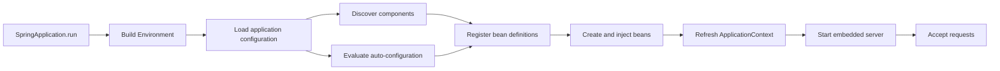

<TLDR>
  <TLDRCell label="what">
    Spring Boot 把 Spring 容器与条件化配置、经过编排的依赖、内嵌服务器和运维支持组合起来，
    从而创建可独立运行的 Spring 应用。
  </TLDRCell>
  <TLDRCell label="when">
    Java 服务需要 Spring 的依赖注入与生态，并且团队希望明确编写应用代码，而不想手工组装
    每一种框架集成时，可以使用 Spring Boot。
  </TLDRCell>
  <TLDRCell label="how">
    只引入必需的 Starter，把应用类放在所有待扫描包的上层，绑定并校验配置，然后测试
    应用上下文与真实 HTTP 边界。
  </TLDRCell>
</TLDR>

## 是什么，为什么存在

Spring Boot 是构建在 Spring Framework 之上的应用框架。Spring 提供容器、依赖注入、Web 栈、
事务和其他编程模型；Boot 则根据应用中的库与设置，决定如何组装常见组合。最终得到的仍是
Spring 应用，而不是取代 Spring 的另一套框架。

它解决的是集成配置问题。Servlet API、JSON 映射器、校验提供者、服务器、日志系统和指标注册表
各有自己的生命周期与配置。Boot 为已知组合提供条件化默认配置，同时允许应用替换其中的具体部分。
这比“Boot 不需要配置”的说法更准确。

<Term id="auto-configuration">自动配置（auto-configuration）</Term>会在条件满足时提供配置。
类路径中存在所需 Web 类时，Servlet Web 应用配置才会生效；应用定义自己的
<Term id="spring-bean">Spring Bean（Spring bean）</Term>后，默认组件可以退让。这些条件让默认值
取决于上下文，而不是无条件生效。

<Term id="starter-dependency">Starter 依赖（starter dependency）</Term>是针对一种能力编排的依赖
描述，例如 Spring MVC 或 Actuator。它把一组兼容的库放在一起，并让 Boot 管理其版本。Starter
不是模块开关：类路径内容只让配置具备生效资格，最终创建什么仍由条件和属性决定。

Boot 应用运行在<Term id="application-context">应用上下文（application context）</Term>中，
也就是拥有 Bean 定义和实例的 Spring 容器。<Term id="dependency-injection">依赖注入
（dependency injection）</Term>通常通过构造器连接这些实例。控制器、服务、配置对象与基础设施
适配器由此形成一张明确的对象图。

Boot 还把配置变成部署输入。<Term id="externalized-configuration">外部化配置
（externalized configuration）</Term>可以来自打包配置文件、特定 Profile 文件、环境变量、
系统属性、命令行参数和其他属性源。应用制品保持不变，端口、端点、凭据和功能选择仍可随环境变化。

HTTP 服务、批处理任务、消息消费者、命令行应用和较大的模块化系统都可以使用 Spring Boot。
当 Spring 集成减少的工作多于容器与启动模型带来的成本时，它很合适。对于不需要 Spring 能力的
小函数或小服务，不使用它可能得到更简单的运行时和测试边界。

Spring Security、Spring Data、消息系统、容器和编排是建立在这个核心之上的独立关注点。
在初始项目中加入所有 Starter，会掩盖哪项依赖导致了哪种行为。应先掌握上下文、条件、配置、
Web 边界和测试边界；只有明确需求出现时，再增加对应集成。

## 工作原理

`SpringApplication.run()` 会构建环境、选择应用上下文类型、加载 Bean 定义、刷新上下文，
并启动选定的运行时。在 Servlet 应用中，刷新过程会创建 Web 基础设施与内嵌服务器。启动过程
要么得到一个一致的上下文，要么失败；绑定不完整的配置对象不应进入请求处理阶段。

`@SpringBootApplication` 是一个组合注解，包含 `@SpringBootConfiguration`、
`@EnableAutoConfiguration` 和 `@ComponentScan`。第一个标识主配置，第二个导入 Boot 的
自动配置候选项，第三个发现应用组件。这三项工作彼此相关，但各有不同的故障模式。

应用类所在的包是默认扫描根。把它放在 `com.example.catalog`，会包含
`com.example.catalog.web` 和 `com.example.catalog.service` 等子包。若把它放进某个功能子包，
可能静默遗漏同级组件；若放进无名默认包，则可能导致扫描范围过宽。

自动配置候选项会声明针对类、Bean、属性、资源和应用类型的条件。Boot 在构建上下文时评估
这些条件。条件匹配的配置会注册 Bean 定义；条件不匹配只说明配置为何没有生效，并不代表
应用发生错误。



### 会退让的默认配置

Boot 的默认配置在 Bean 边界上是非侵入式的。例如，由 `@ConditionalOnMissingBean` 保护的
自动配置只会在相关 Bean 不存在时提供默认实现。因此，应用可以通过定义一个 Bean 替换局部实现，
而不必关闭无关的 Web、JSON 或指标配置。

退让行为取决于具体类型与条件。添加一个概念上相似的 Bean，并不能证明它满足准确条件；若某个
可注入类型出现两个 Bean，也可能产生歧义，而不是完成覆盖。增加排除项之前，应先阅读条件报告
和该配置记录的扩展点。

启动行为异常时，可以加 `--debug` 运行。Boot 会记录条件评估报告，区分匹配与不匹配的配置。
若 Actuator 已被谨慎公开并保护，`conditions` 端点可以提供相关运行时证据；不能只为方便诊断
就把它公开。

### Bean 所有权与注入

Bean 定义告诉上下文如何取得对象，以及对象遵循什么生命周期规则。默认作用域是每个应用上下文
一个实例，通常称为单例作用域。这不表示每个上下文、测试或 JVM 只存在一个实例，也不会自动
让可变状态具备线程安全性。

构造器注入会公开必需依赖，并让容器在启动时拒绝不完整的对象图。只有一个构造器时，不需要
`@Autowired`。字段注入会隐藏依赖，直到反射为字段赋值；它既不利于普通构造，也容易诱导测试
绕过生产环境使用的生命周期。

`@RestController`、`@Service` 和 `@Configuration` 等组件构造型注解，为类标明特定角色。
构造过程需要代码，或类型来自第三方库时，可以使用 `@Bean` 方法。这两种机制都不应把上下文
变成由业务方法主动查询的服务定位器。

### 配置绑定与优先级

Boot 按确定顺序处理属性源，靠后的来源可以覆盖靠前的来源。命令行参数优先于操作系统环境变量，
环境变量又优先于打包的配置数据。只有运维人员与测试都知道最终采用哪个来源时，覆盖才真正有用；
因此应记录诊断部署所需的有效非敏感配置。

`@ConfigurationProperties` 会把同一属性命名空间绑定到结构化对象。宽松绑定（relaxed binding）
可以把 `catalog.page-size` 映射到 `CATALOG_PAGE_SIZE` 等环境变量，校验注解则能在启动时拒绝缺失
或越界值。对于一组设置，这比把字符串键和转换逻辑分散到多个 `@Value` 字段中更安全。

Profile 用于选择一组配置和 Bean，不会建立安全边界。提交到 `application-prod.properties` 的
秘密仍然是已经提交的秘密。敏感值应由部署环境的秘密机制提供，必需值应以失败关闭方式处理，
生产凭据也不应带有看似合理的开发默认值。

### HTTP 路径

类路径中存在 Spring MVC Starter 时，Boot 会配置分发 Servlet、消息转换器、校验集成、错误处理
基础设施和内嵌 Servlet 容器。请求到达服务器后，依次经过过滤器、控制器方法映射、应用服务调用，
最后把返回值转换成 HTTP 响应。每一步都是契约边界，而不是无法解释的魔法。

若类路径中存在兼容的 JSON 映射器和消息转换器，返回 Java record 可以生成 JSON。这并不定义
授权、事务性、状态码语义或稳定的公开模式。控制器仍要校验传输输入，调用包含明确领域规则的服务，
并返回 API 契约承诺的状态码和字段。

## 示例

以下三个示例构成一个小型商品目录项目。项目由 Spring Initializr 生成，选择 Maven、Java、
Spring Boot 4.1.1、Spring Web MVC、Validation 和 Actuator。代码使用生成的 Maven Wrapper 与
本地 OpenJDK 21.0.12 编译并执行；其中的 API 和语言特性在目标 Java 25 LTS 中仍有效。下方输出
均来自这些实际运行。

### 启动 JSON 端点

应用类同时提供配置根与可执行入口。相邻控制器由组件扫描发现；由于类路径中存在 Spring MVC
Starter，Boot 会配置服务器和 JSON 转换。

<Depth level="quick">

```java title="CatalogApplication.java"
package com.codewiki.catalog;

import org.springframework.boot.SpringApplication;
import org.springframework.boot.autoconfigure.SpringBootApplication;
import org.springframework.web.bind.annotation.GetMapping;
import org.springframework.web.bind.annotation.PathVariable;
import org.springframework.web.bind.annotation.RestController;

@SpringBootApplication
public class CatalogApplication {
    public static void main(String[] args) {
        SpringApplication.run(CatalogApplication.class, args);
    }
}

@RestController
class ProductController {
    @GetMapping("/products/{sku}")
    Product find(@PathVariable String sku) {
        return new Product(sku, "Mechanical keyboard", 12900);
    }
}

record Product(String sku, String name, int priceInCents) {}
```

```text
HTTP/1.1 200
Content-Type: application/json

{"sku":"KB-1","name":"Mechanical keyboard","priceInCents":12900}
```

<TryToBreak items={['请求包含编码斜线的 SKU', '移除 Spring MVC Starter', '把控制器移到扫描根之外']} />

</Depth>

该响应只证明一个正常路径的路由与转换。它不能证明 SKU 确实存在、调用方可以查看该商品，
也不能证明 `priceInCents` 是预期的公开表示。这些规则应放在服务和 API 契约中，而不是作为
自动配置附带的假设。

没有提供覆盖值，因此服务器在默认端口启动。真实部署若使用其他端口和代理行为，就应显式配置，
并通过已部署的入口测试。内嵌服务器省去了外部 WAR 部署步骤，却没有消除网络边界。

### 绑定经过校验的设置

下一个文件会注册带类型的配置对象，并在上下文启动后打印有效值。`@Validated` 会在绑定时应用
Jakarta Validation 约束，因此非法配置会在运行器或 HTTP 处理器使用之前让启动失败。

```java title="CatalogConfiguration.java"
package com.codewiki.catalog;

import jakarta.validation.constraints.Max;
import jakarta.validation.constraints.Min;
import jakarta.validation.constraints.NotBlank;
import org.springframework.boot.ApplicationRunner;
import org.springframework.boot.context.properties.ConfigurationProperties;
import org.springframework.boot.context.properties.EnableConfigurationProperties;
import org.springframework.context.annotation.Bean;
import org.springframework.context.annotation.Configuration;
import org.springframework.validation.annotation.Validated;

@ConfigurationProperties("catalog")
@Validated
record CatalogSettings(
        @NotBlank String currency,
        @Min(1) @Max(100) int pageSize) {}

@Configuration(proxyBeanMethods = false)
@EnableConfigurationProperties(CatalogSettings.class)
class CatalogConfiguration {
    @Bean
    ApplicationRunner showSettings(CatalogSettings settings) {
        return args -> System.out.printf(
                "catalog currency=%s pageSize=%d%n",
                settings.currency(), settings.pageSize());
    }
}
```

```text
catalog currency=EUR pageSize=24
```

这次运行设置了 `CATALOG_CURRENCY=EUR` 和 `CATALOG_PAGE_SIZE=24`，随后选择非 Web 应用，
使程序能在运行器完成后退出。环境变量名展示了宽松绑定。打包默认值
`catalog.currency=USD` 和 `catalog.page-size=20` 已被环境覆盖。

记录少量选定的非敏感设置，可以帮助诊断属性优先级。不要把整个环境或配置属性端点写进日志：
其中可能包含密码、令牌、内部主机名和个人数据。脱敏和端点访问权限都属于运维契约的一部分。

### 测试已配置的 Web 边界

这个测试会启动 Boot 上下文，但不会监听端口，而是把 `MockMvc` 连接到已配置的 Spring MVC 栈。
它先断言状态码、兼容媒体类型和一个字段，再打印响应。示例特意展示 Boot 4 中
`AutoConfigureMockMvc` 的导入路径。

```java title="CatalogApplicationTests.java"
package com.codewiki.catalog;

import org.junit.jupiter.api.Test;
import org.springframework.beans.factory.annotation.Autowired;
import org.springframework.boot.test.context.SpringBootTest;
import org.springframework.boot.webmvc.test.autoconfigure.AutoConfigureMockMvc;
import org.springframework.test.web.servlet.MockMvc;

import static org.springframework.test.web.servlet.request.MockMvcRequestBuilders.get;
import static org.springframework.test.web.servlet.result.MockMvcResultMatchers.content;
import static org.springframework.test.web.servlet.result.MockMvcResultMatchers.jsonPath;
import static org.springframework.test.web.servlet.result.MockMvcResultMatchers.status;

@SpringBootTest
@AutoConfigureMockMvc
class CatalogApplicationTests {
    @Autowired
    MockMvc mvc;

    @Test
    void returnsAProduct() throws Exception {
        var response = mvc.perform(get("/products/KB-1"))
                .andExpect(status().isOk())
                .andExpect(content().contentTypeCompatibleWith("application/json"))
                .andExpect(jsonPath("$.sku").value("KB-1"))
                .andReturn().getResponse();

        System.out.println(response.getStatus() + " " + response.getContentAsString());
    }
}
```

```text
200 {"sku":"KB-1","name":"Mechanical keyboard","priceInCents":12900}
```

`MockMvc` 会覆盖控制器映射、已配置过滤器、参数解析和消息转换，但不经过套接字。它不能证明
Servlet 容器行为、TLS、代理请求头或打包制品正确。若这些层属于风险范围，应增加随机端口测试
或已部署环境的冒烟测试。

完整上下文让这个测试可以检查装配，但加载内容多于聚焦的 Web 切片。只有明确替换切片省略的
协作者，并由其他测试证明完整启动时，才应使用切片。应选择足以回答问题的最小测试，同时不能
声称省略的层已经经过验证。

## 陷阱

### 扫描了错误的包树

> [!PITFALL]
> 生成的应用类若放在控制器或服务的下层，应用可以成功启动，但这些组件不会被发现。把应用类移到无名包则会产生相反问题，可能意外扫描依赖。

**修复方法：** 把应用类放在具名根包中，并置于所有应用组件之上；模块布局确有需要时，再显式
声明扫描包。保留一个能解析代表性控制器与服务的上下文测试，并把扫描边界变化视为行为变化。

### 把 Starter 当作无害便利项

> [!PITFALL]
> “以后可能会用”就加入多个 Starter，会改变类路径，并可能在应用真正需要之前启用服务器、安全过滤器、数据源、健康贡献项或测试基础设施。

**修复方法：** 每项需求只增加一项能力，并检查依赖图。加入每个 Starter 后，都要检查条件报告、
启动日志、公开端口与端点。对于所选 Boot 版本已管理的制品，不要自行指定版本；只有文档记录的
兼容性需求才能成为例外。

### 盲目对抗自动配置

> [!PITFALL]
> 把自动配置的 Bean 复制到应用代码中，或为了一个不匹配就排除整项配置，可能产生重复候选项，也可能连带删除无关默认值。

**修复方法：** 先找出准确条件和文档记录的替换类型。定义能触发退让的窄小应用 Bean 或属性，
然后重新检查上下文与条件报告。只有整项自动配置确实不适用时，才使用排除项。

### 接受非法配置

> [!PITFALL]
> 分散的 `@Value` 字段配上字符串默认值，会让缺失超时、格式错误的 URL 或为零的连接池大小变成较晚发生的请求错误，而不是清晰的启动错误。

**修复方法：** 用 `@ConfigurationProperties` 对相关设置分组，采用 `Duration` 等领域类型，
添加校验约束，并测试有效值、缺失值和边界值。不能只为让本地启动通过，就给秘密或危险生产设置
提供看似合理的后备值。

### 随意公开 Actuator

> [!PITFALL]
> 设置 `management.endpoints.web.exposure.include=*` 可能把环境、Bean、映射、日志或诊断数据暴露给并不需要它们的人。

**修复方法：** 只公开具名端点，把公开范围与访问控制分开，并通过 Spring Security、管理网络或
两者共同保护边界。通过真实代理验证匿名用户和运维人员的访问。除非调用方有权查看依赖信息，
否则健康响应只应提供最少细节。

### 把一种测试当成完整证据

> [!PITFALL]
> 直接调用控制器方法会遗漏绑定、校验、过滤器、转换器和错误映射；模拟 MVC 测试仍会遗漏服务器、代理和已部署制品。

**修复方法：** 把风险映射到各层。普通单元测试检查业务逻辑，聚焦切片检查传输行为，完整上下文
测试检查装配，再用少量随机端口或已部署测试检查真实网络边缘。既要断言失败，也要检查存储后的
副作用，不能只看成功状态码。

## AI 时代

**生成代码在这里常犯的错**

模型经常在同一项目中混用不同代 Spring Boot：Boot 3 的测试包导入与 Boot 4 的 Starter 名称
同时出现，或者旧教程依赖被强行配上当前版本。它还会在库模块上添加 `@SpringBootApplication`，
不检查条件就复制自动配置 Bean，使用字段注入，为秘密提供开发默认值，公开全部 Actuator 端点，
以及直接调用控制器方法却声称已经测试 HTTP 契约。

**让 AI 检查**

- 按 Spring Boot 4.1.1 解析每个 Spring 制品与导入，并列出从其他主版本复制的内容。
- 为每个自定义基础设施 Bean 给出条件报告中的解释，并说明哪个默认 Bean 会退让。
- 跟踪一个请求经过过滤器、绑定、校验、控制器、服务、错误映射和响应转换的过程，说明每个边界由哪项测试覆盖。

**审查清单**

- 使用接近生产环境的配置启动打包应用，并针对每个缺失的必需值验证一次失败。
- 让匿名用户、普通用户和运维人员通过真实代理探测所有管理端点与应用端点。
- 运行上下文测试以及非法输入、授权、失败和重试用例；每次都检查存储后的效果。

**提示词词汇**

使用准确术语：`application context`（应用上下文）、`bean definition`（Bean 定义）、
`constructor injection`（构造器注入）、`component scan root`（组件扫描根）、
`auto-configuration condition`（自动配置条件）、`back-off`（退让）、`starter dependency`
（Starter 依赖）、`property-source precedence`（属性源优先级）、`relaxed binding`（宽松绑定）、
`configuration-properties validation`（配置属性校验）、`test slice`（测试切片）和
`management endpoint exposure`（管理端点公开范围）。提示中应写明 Boot 版本与预期测试边界；
“让这个 Spring 应用达到生产标准”没有定义兼容性与所需证据。

<Depth level="deep">

## 条件评估与退让

自动配置是由导入选择、再由条件保护的普通配置。Boot 会在库元数据中记录候选项，而不是扫描
每项依赖中的任意配置类。这让候选集合保持明确，不过每个候选项仍可包含多个有条件的 Bean 定义。

条件可以判断类是否存在、属性是否具有某个值、应用是否为 Servlet 类型，以及 Bean 是否缺失。
条件评估结果取决于当时已经注册的内容。应用配置本来就可以替换默认值，但依赖两个应用 Bean
之间偶然的处理顺序仍然很脆弱。

条件报告是证据，不是配置 API。匹配项解释候选配置为何生效，不匹配项解释它为何没有生效。
必须阅读完整结果，因为一项自动配置可以在类级别匹配，而其中某个 Bean 方法仍然发生退让。

对于可复用的库，自定义 Boot 集成通常使用 `@AutoConfiguration`、窄小的
`@ConditionalOnClass` 检查、属性绑定，并在替换点使用 `@ConditionalOnMissingBean`。它会注册到
该库的自动配置导入元数据中。应用内部装配通常保留为 `@Configuration` 或显式 Bean，
不需要把自己伪装成 Starter。

不要让一项自动配置依赖对用户包执行组件扫描。库默认配置应由明确条件与稳定类型启用，再允许
应用替换它们。这样启动过程更容易解释，也能避免一项依赖意外接管契约之外的应用组件。

若两个 Bean 实现同一接口，按类型注入就会产生歧义，除非有一个候选项被限定或标为主 Bean，
或者消费者明确请求集合。`@ConditionalOnMissingBean` 可以阻止默认 Bean 加入该集合，但只对条件
声明的类型与搜索策略有效。应检查实际 Bean 名称与类型，不能假设同名方法已经完成替换。

## 配置与生命周期边界

属性绑定发生在上下文创建期间。转换过程可以先把文本变成整数、枚举、时长、数据大小、地址和
结构化集合，再交给应用 Bean 使用。校验随后把非法部署契约变成启动错误，并在原因附近指出
对应属性路径。

优先级有利于分层部署，但来源过多会让配置出处难以追踪。打包默认值应当安全且不含秘密，
环境配置用于部署选择，命令行覆盖只用于有意的运维操作。还要记录如何检查有效值，同时不泄露
秘密本身。

Profile 是可以叠加的选择器，多个 Profile 可以同时激活。若两个活动 Profile 定义同一属性
或 Bean，仍按普通优先级与 Bean 解析规则处理。名为 `prod` 的 Profile 既不会验证当前环境，
也无法阻止开发者在本地激活它。

单例 Bean 属于某个上下文，并且通常由并发请求共享。它适合保存不可变配置和线程安全协作者，
不应保存当前用户或请求状态。请求作用域对象可以表达每次请求的状态，但把它注入单例需要
作用域感知代理或其他提供者边界；设计与测试都应让这条边界可见。

只有应用缺少某项工作就无法正确服务时，才应把它放进启动生命周期钩子。Bean 构造期间的远程调用
会拖慢每次上下文测试，也会让部署受临时服务故障影响。启动阶段应优先执行本地校验；对于进程
启动后可能恢复的依赖，则应提供明确就绪状态。

关闭同样是生命周期边界。上下文可以调用销毁回调并停止内嵌服务器，却无法推断在途工作需要多久，
也不知道已消费消息能否重放。优雅关闭与编排超时应根据实际负载设置，并在流量存在时测试终止过程。

## 测试已配置的应用

不同 Boot 测试会创建不同上下文，而上下文缓存会在测试间复用兼容的上下文。修改属性、Mock 定义、
Profile 或导入配置，都可能形成新的缓存键。因此，即使每项测试单独看来都很小，大量近似上下文
仍会拖慢测试套件。

| 测试边界 | 可以证明 | 未覆盖范围 |
| --- | --- | --- |
| 普通 JUnit 测试 | Java 逻辑与协作者契约 | Spring 装配与框架行为 |
| MVC 切片 | 控制器映射、绑定、校验与转换 | 大部分服务与基础设施 |
| 带 `MockMvc` 的 `@SpringBootTest` | 完整上下文与模拟 Servlet 请求路径 | 监听服务器、TLS、代理与打包过程 |
| 随机端口测试 | 内嵌服务器与真实 HTTP 客户端路径 | 外部入口与生产平台 |
| 已部署冒烟测试 | 通过发布环境验证的选定行为 | 完整领域行为与故障行为 |

`@SpringBootTest` 默认不会启动服务器。它的模拟 Web 环境可以配合 `@AutoConfigureMockMvc`；
`RANDOM_PORT` 则会在可用端口启动真实服务器。只有套接字与服务器行为属于测试目标时，才选择后者；
对于纯服务逻辑断言，它只会增加成本，并不会提高证据质量。

测试切片会有意过滤配置。若为每个缺失协作者都提供 Mock，切片可以通过编译，却可能掩盖生产环境
无法构造对象图的问题。至少保留一项测试，使用与可部署应用相同的主配置和 Profile 完成启动。

上下文成功是必要但很弱的证据。它不能证明端点执行对象所有权检查、事务能够回滚，或重试不会
重复产生效果。装配证据还要配合场景断言，并在每项副作用和故障真正可观察的层进行验证。

## 避免意外泄露的运维接口

只有 Actuator 依赖存在且自动配置生效时，才会提供相关端点。端点访问权限与技术公开渠道是
两个不同决定：端点可以存在但不通过 HTTP 公开，公开端点仍然需要访问策略。在 Spring Boot 4.1.1
中，默认只有健康端点通过 HTTP 与 JMX 公开。

健康状态只表示应用可以报告某种状态，不表示每项依赖都应出现在匿名响应中。默认情况下，`DOWN`
和 `OUT_OF_SERVICE` 映射为 HTTP 503，`UP` 与未映射状态则映射为 200。客户端应使用文档规定的
健康组与状态，而不是解析组件说明文字。

存活探针应回答“重启这个进程是否有帮助”。把共享数据库放进存活状态，可能在数据库故障时
重启所有副本，从而放大事故。就绪状态可以包含服务所必需的依赖，但具体策略必须符合是否应移出
流量以及依赖恢复速度。

`conditions`、`configprops`、`env`、`beans`、`mappings` 和日志端点都是强大的诊断界面。
脱敏可以降低风险，却不能替代授权与网络控制。对于可写端点，应审计变更；同时要验证公开路由
不能通过代理重写抵达管理界面。

指标需要稳定名称、有限标签基数和明确所有者。把用户 ID、原始路径、订单 ID 或异常消息放进标签，
会产生无限增长的时间序列，也可能泄露数据。自动配置指标只是起点；服务级指标仍要根据用户结果
明确定义。

</Depth>

<Checkpoint id="backend/spring-boot" />

## 延伸阅读

- [Spring Boot 系统要求](https://docs.spring.io/spring-boot/system-requirements.html)
- [Spring Boot 自动配置](https://docs.spring.io/spring-boot/reference/using/auto-configuration.html)
- [Spring Boot 外部化配置](https://docs.spring.io/spring-boot/reference/features/external-config.html)
- [Spring Boot Servlet Web 应用](https://docs.spring.io/spring-boot/reference/web/servlet.html)
- [Spring Boot 测试](https://docs.spring.io/spring-boot/reference/testing/index.html)
- [Spring Boot Actuator 端点](https://docs.spring.io/spring-boot/reference/actuator/endpoints.html)
