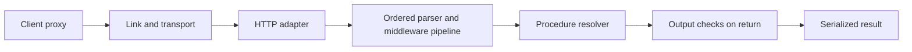

<TLDR>
  <TLDRCell label="what">
    tRPC builds a typed call interface from a TypeScript server router. The client learns procedure paths, inputs, and outputs through inference, without a separate API schema or generated client.
  </TLDRCell>
  <TLDRCell label="when">
    Use it when one team controls a TypeScript client and server and can share the router's type at build time. Prefer a language-neutral contract when independent or non-TypeScript consumers need the API.
  </TLDRCell>
  <TLDRCell label="how">
    Validate every input at runtime, derive identity in request context, authorize the selected object, and expose only deliberate outputs. Treat batching, serialization, and deployments as runtime contracts that TypeScript cannot prove.
  </TLDRCell>
</TLDR>

## What it is and why it exists

tRPC is a TypeScript implementation of a <Term id="remote-procedure-call">remote procedure call (RPC)</Term> interface. On the server, you compose named procedures into a router and export only the router's TypeScript type. A tRPC client uses that type to offer call-shaped completion and static checks for procedure paths, inputs, and results.

The central benefit is one source of truth for a private TypeScript API. When a procedure changes from accepting `{ id: string }` to `{ id: string; revision: number }`, consumers compiled against the same router type receive a type error. There is no second OpenAPI document or generated SDK to synchronize.

That promise is narrower than it first appears. TypeScript types disappear before a request crosses the network, so tRPC still needs runtime input parsing. The transport can fail, old deployed clients can call new servers, and a correctly typed caller can still be unauthorized to read a particular row.

tRPC fits monorepos, full-stack TypeScript applications, and internal services whose client and server release together. It is less suitable as the only contract for mobile apps, partner integrations, webhooks, or services in several languages. Those consumers usually need a language-neutral, independently versioned description.

The library doesn't dictate a database or application architecture. A procedure should normally adapt transport input to an application service, rather than contain every query and business rule. Keeping the service layer independent also lets HTTP handlers, jobs, tests, and server-side calls reuse the same behavior.

This article was verified with Node 24.14.0, TypeScript 6.0.3, `@trpc/server` 11.18.0, and Zod 4.5.4. The examples use server-side callers so each file stays self-contained; the same router can be exposed by an HTTP adapter.

## How it works

A tRPC server starts with `initTRPC`, optionally parameterized by a context type. It produces builders for routers, procedures, and middleware. A <Term id="trpc-router">tRPC router</Term> is a named tree, while a <Term id="trpc-procedure">tRPC procedure</Term> is one callable leaf in that tree.

Each procedure builds an ordered pipeline that includes parser middleware and user middleware. An input parser produces the validated value, middleware can reject the call or pass a narrowed context onward, and the query, mutation, or subscription resolver performs the operation. An output parser checks the result as the pipeline returns; a thrown `TRPCError` carries a stable tRPC error code.



The client proxy doesn't download or inspect the server router at runtime. Its generic `AppRouter` type exists only during compilation, while property access such as `client.order.byId.query()` constructs an operation path and sends data through a configured link. The server adapter resolves that path against the real router.

### Routers and procedures

Routers group related capabilities and provide namespaces such as `order.byId` and `order.rename`. Nested routers are organization, not an authorization boundary. The root router's `typeof` result is normally exported as `AppRouter` with a type-only import on the client, so server implementation code doesn't enter the client bundle.

A query represents a read, and a mutation represents a write or other side effect. These labels guide client integrations and caching behavior; they don't make a resolver read-only or transactional. Your application service and database must enforce those semantics.

Procedure inputs can use Zod or another supported Standard Schema validator. The parser determines both the runtime value passed to the resolver and the inferred input type. Transforms and defaults therefore belong to the procedure contract, not merely to editor hints.

### Context and middleware

A <Term id="trpc-context">tRPC context</Term> is application state supplied to a call, commonly the authenticated principal, database access, request metadata, and tracing facilities. An HTTP adapter usually creates it from the incoming request. Batched operations in one HTTP request share that request context, so mutable per-operation state needs deliberate isolation.

Middleware wraps the rest of the procedure pipeline. Authentication middleware can reject an absent principal and pass a context in which that principal is non-null. Authorization normally needs more: after loading the requested resource, code must prove that the principal may perform this action on that resource.

Build reusable base procedures such as `publicProcedure` and `protectedProcedure`, then extend them for tenant or role rules. Avoid a global flag that a resolver must remember to inspect. A protected name is only useful when every sensitive route actually derives from the protected builder.

### Static and runtime contracts

<Term id="type-inference">Type inference</Term> connects a current client build to a router declaration. Runtime parsers defend the actual process from malformed, stale, or adversarial inputs. Both matter, and neither replaces authentication, authorization, database constraints, or business invariants.

An output parser checks the resolver result before it leaves the procedure pipeline. This catches drift at an internal data boundary and can create an allowlisted response shape. It should complement explicit result mapping, because accidentally returning a database object before parsing still makes intent hard to review.

Errors also cross a boundary. Use stable codes such as `BAD_REQUEST`, `UNAUTHORIZED`, `FORBIDDEN`, and `NOT_FOUND` for client decisions, while logging internal causes on the server. Don't expose stack traces, SQL messages, or secrets merely because a TypeScript error type mentions them.

### Calls and transport

An HTTP client sends operations through links such as `httpBatchLink`; an adapter receives them and creates context. A server-side caller invokes the same router inside the process and requires you to supply context directly. Both paths execute procedure parsing and middleware, but only the HTTP path exercises headers, serialization, request limits, proxies, and network failures.

Batching can put several operations in one HTTP exchange. It reduces transport overhead in suitable workloads, but each procedure remains a distinct operation. A batch is not a database transaction, doesn't share one authorization decision, and may contain partial successes and failures.

Plain JSON doesn't preserve `Date`, `Map`, `Set`, or custom class identity. You can define JSON-shaped procedure boundaries, transform strings in validators, or configure a data transformer consistently on client and server. Whichever choice you make becomes part of deployment compatibility.

## Examples

The four examples progress from a router and input parser to authorization, output validation, and a JSON-shaped time value. Their displayed output comes from the local toolchain and exact versions stated above.

### Calling a validated router

The first router has one query. `createCaller()` lets the example run without an HTTP server, while Zod still rejects an empty ID through the normal procedure pipeline.

<Depth level="quick">

```typescript run title="basic-router.ts"
import { initTRPC, TRPCError } from "@trpc/server";
import { z } from "zod";

const t = initTRPC.create();
const products = [
  { id: "p1", name: "Mechanical keyboard", stock: 4 },
  { id: "p2", name: "USB-C dock", stock: 0 },
];

const appRouter = t.router({
  productById: t.procedure
    .input(z.object({ id: z.string().min(1) }))
    .query(({ input }) => {
      const product = products.find((item) => item.id === input.id);
      if (!product) throw new TRPCError({ code: "NOT_FOUND" });
      return product;
    }),
});

async function main() {
  const caller = appRouter.createCaller({});
  console.log(JSON.stringify(await caller.productById({ id: "p1" })));
  try {
    await caller.productById({ id: "" });
  } catch (error) {
    if (error instanceof TRPCError) {
      console.log(error.code);
    }
  }
}

main();

export type AppRouter = typeof appRouter;
```

```text
{"id":"p1","name":"Mechanical keyboard","stock":4}
BAD_REQUEST
```

<TryToBreak items={['an unknown non-empty ID', 'a number instead of an ID string', 'a product whose stock is zero']} />

</Depth>

The invalid call compiles only because its value is still a string; the runtime parser enforces the minimum length. Passing a numeric literal would fail TypeScript in a checked caller, yet a real endpoint must still reject that value because network clients can ignore or lack the type.

The exported `AppRouter` is the contract clients import as a type. It contains inferred procedure structure, not the `products` array at runtime. An HTTP deployment must separately mount `appRouter` in an adapter.

### Narrowing context and authorizing an object

The middleware proves that a viewer exists, so downstream code sees a non-null `ctx.viewer`. The resolver then performs object-level authorization; authentication alone doesn't prove ownership of `o1`.

```typescript run title="protected-procedure.ts"
import { initTRPC, TRPCError } from "@trpc/server";
import { z } from "zod";

type Context = { viewer: { id: string } | null };
const t = initTRPC.context<Context>().create();
const orders = [{ id: "o1", ownerId: "u1", label: "Desk lamp" }];

const protectedProcedure = t.procedure.use(({ ctx, next }) => {
  if (!ctx.viewer) throw new TRPCError({ code: "UNAUTHORIZED" });
  return next({ ctx: { viewer: ctx.viewer } });
});

const appRouter = t.router({
  renameOrder: protectedProcedure
    .input(z.object({ orderId: z.string(), label: z.string().min(1) }))
    .mutation(({ ctx, input }) => {
      const order = orders.find((item) => item.id === input.orderId);
      if (!order || order.ownerId !== ctx.viewer.id) {
        throw new TRPCError({ code: "FORBIDDEN" });
      }
      order.label = input.label;
      return { id: order.id, label: order.label };
    }),
});

async function main() {
  const alice = appRouter.createCaller({ viewer: { id: "u1" } });
  console.log(JSON.stringify(
    await alice.renameOrder({ orderId: "o1", label: "Reading lamp" }),
  ));
  const bob = appRouter.createCaller({ viewer: { id: "u2" } });
  try {
    await bob.renameOrder({ orderId: "o1", label: "Mine" });
  } catch (error) {
    if (error instanceof TRPCError) console.log(error.code);
  }
}

main();
```

```text
{"id":"o1","label":"Reading lamp"}
FORBIDDEN
```

The caller can't choose `ownerId`; identity comes from trusted context. In a database-backed implementation, prefer a tenant- or owner-scoped lookup or conditional update so the authorization predicate remains attached to the data operation.

Returning `FORBIDDEN` for both a missing order and a foreign order avoids revealing which IDs exist. A service may choose `NOT_FOUND` instead, but that disclosure policy should be deliberate and consistent.

### Constraining the output

The Zod output object acts as an allowlist here: its default object behavior removes the extra `passwordHash`. The second resolver simulates untyped external data with a missing field and fails before returning a result.

```typescript run title="output-validation.ts"
import { initTRPC, TRPCError } from "@trpc/server";
import { z } from "zod";

const t = initTRPC.create();
const publicUser = z.object({
  id: z.string(),
  displayName: z.string(),
});

const appRouter = t.router({
  user: t.procedure.output(publicUser).query(() => ({
    id: "u1",
    displayName: "Ari",
    passwordHash: "do-not-return",
  })),
  brokenUser: t.procedure
    .output(publicUser)
    .query(() => JSON.parse('{"id":"u2"}')),
});

async function main() {
  const caller = appRouter.createCaller({});
  console.log(JSON.stringify(await caller.user()));
  try {
    await caller.brokenUser();
  } catch (error) {
    if (error instanceof TRPCError) {
      console.log(`${error.code}: ${error.message}`);
    }
  }
}

main();
```

```text
{"id":"u1","displayName":"Ari"}
INTERNAL_SERVER_ERROR: Output validation failed
```

Output validation is especially useful where results come from untyped SDKs, raw SQL, or gradual migrations. Map sensitive records to public result objects as well, then keep the parser as a second check against drift.

The external client should receive a stable internal-error shape, not the validator's complete diagnostics. Detailed causes belong in server logs associated with a request or trace identifier.

### Transforming a wire representation

This mutation accepts an ISO 8601 string, validates it, and transforms it into a `Date` for the resolver. The wire representation stays explicit even though application code receives a richer value.

```typescript run title="wire-input.ts"
import { initTRPC } from "@trpc/server";
import { z } from "zod";

const t = initTRPC.create();
const scheduleInput = z.object({
  name: z.string().min(1),
  startsAt: z.iso.datetime().transform((value) => new Date(value)),
});

const appRouter = t.router({
  schedule: t.procedure
    .input(scheduleInput)
    .mutation(({ input }) => ({
      name: input.name,
      year: input.startsAt.getUTCFullYear(),
    })),
});

async function main() {
  const caller = appRouter.createCaller({});
  const result = await caller.schedule({
    name: "launch",
    startsAt: "2026-10-03T09:30:00.000Z",
  });
  console.log(JSON.stringify(result));
}

main();
```

```text
{"name":"launch","year":2026}
```

The validator's input type is a string, while its parsed output contains a `Date`. This distinction is useful when transport data and resolver data differ. If a configured transformer carries dates instead, verify both ends use the same transformer during rolling deployment.

Time-zone meaning remains a business decision. Requiring an offset or `Z` avoids interpreting a local wall time differently on two servers, but scheduling rules may also need a named time zone and daylight-saving policy.

## Pitfalls

> [!PITFALL]
> **Treating inferred types as runtime validation.** A generated procedure accepts `input as CreateOrderInput` or omits `.input()`, assuming the client type makes malformed requests impossible. Casts and network callers bypass that assumption.
>
> Fix it by attaching a runtime schema at every untrusted boundary. Test wrong primitive types, extra or missing fields, size limits, and validator transforms through the deployed adapter, not only through a typed caller.

> [!PITFALL]
> **Checking authentication but not object authorization.** A `protectedProcedure` proves somebody signed in; it doesn't prove that `input.accountId`, `orderId`, or `tenantId` belongs to that principal.
>
> Derive tenant identity from context and bind it to the query or update predicate. Keep server-owned fields such as role, price, owner, and approval state out of caller-controlled spread objects.

> [!PITFALL]
> **Importing server values into a client bundle.** A generated client imports `appRouter` rather than `type AppRouter`, which can pull database modules, secrets, or Node-only code toward the browser build.
>
> Export the router type from a server-safe boundary and use `import type` in the client. Inspect the production bundle and keep runtime client configuration separate from server initialization.

> [!PITFALL]
> **Assuming batching gives transaction semantics.** Two mutations sent by `httpBatchLink` can succeed or fail independently, and a retry may replay work whose earlier result was lost.
>
> Put operations that must commit together behind one application transaction. For retryable writes, define idempotency at the business boundary and test duplicate delivery and partial failure.

> [!PITFALL]
> **Deploying a breaking router change as if types were live negotiation.** Already-built clients retain their old assumptions even after the shared source type changes. Renaming a procedure or narrowing its input can break them at runtime.
>
> Make additive changes first, observe old-client traffic, and remove compatibility only after the supported deployment window. Use contract tests that run old serialized requests against the new server.

<Depth level="deep">

## The type graph is not a wire schema

`AppRouter` preserves procedure paths and the input and output types produced by the builder chain. TypeScript can follow that graph across package boundaries and give a client precise completion. After compilation, however, the server doesn't send that type graph to the caller, and an unrelated language cannot discover the contract from it.

This is why tRPC can avoid code generation for a shared TypeScript codebase but isn't automatically a public API description. Documentation, examples, changelogs, error semantics, and compatibility policy still require deliberate publication. If independent consumers need machine-readable discovery, a schema-first protocol may be the stronger boundary.

Input validators are closer to a wire schema, but they don't by themselves describe transport headers, authentication, rate limits, retry safety, or all error results. A Zod transform can also make the accepted input type differ from the resolver's parsed value. Review both sides of that transform when changing a procedure.

Output inference follows the resolver's successful return type. Without an output parser, an accidental extra property can become part of the inferred client contract and can be serialized. Explicit data-transfer objects or output validators prevent database record shape from silently defining the API.

Structural typing creates another review trap. Two IDs represented as `string` are assignable even if one names a user and the other an order. Branded identifiers or schemas with semantic names improve static review, but the server still has to verify existence and ownership.

### Shared packages and build boundaries

A shared contract package should export types and intentionally shared schemas without running server initialization as an import side effect. Keep database clients, environment reads, and secret-bearing configuration in server-only modules. Verify that package export maps and bundler conditions don't expose those modules through a convenient barrel file.

Type-only circular imports can still make a project hard to build and refactor. A small router aggregation module and one-directional dependency flow keep feature routers independent. Application services shouldn't import the transport router that calls them.

Static type checks are evidence about source revisions, not deployed topology. Record which client and server versions a test exercised. A green monorepo build doesn't prove that yesterday's browser bundle works with today's server.

## Runtime execution and failure boundaries

`createCaller()` is useful for trusted in-process callers and focused examples. It executes router procedures without HTTP, but the caller supplies context itself. Never construct that context from unverified function arguments and then mistake it for adapter-authenticated state.

Avoid calling a procedure from another procedure through a caller as ordinary code reuse. That repeats the transport-facing pipeline and can obscure transaction ownership, logging, and error meaning. Extract shared business behavior into a service function, then let both procedures call that function with explicit authorization and transaction context.

An HTTP adapter adds failure modes that direct calls cannot reproduce. Request bodies can be truncated, headers can be missing, proxies can time out, and the response can disappear after a mutation commits. Integration tests need the real adapter whenever these outcomes affect retries or user-visible errors.

### Context lifetime and batching

Context should normally be created per incoming request. If a batch shares one context, immutable identity and request-scoped services are appropriate; mutable scratch data can couple otherwise independent procedures. Process-global context is worse because credentials, loaders, or transaction handles may leak between users.

Batch size and request size need explicit bounds. A single HTTP request can still contain many expensive operations, and concurrency inside resolvers can amplify database pressure. Measure the workload before claiming batching is faster, then cap the work the server accepts.

Partial failure needs a client policy. If one query in a batch fails validation, unrelated operations may still return results; if the transport fails, the client may not know which mutations committed. Design writes for idempotent replay where required, rather than retrying every batch indiscriminately.

### Serialization and errors

<Term id="serialization">Serialization</Term> defines which values survive the transport and how. Plain JSON has a deliberately small data model. A transformer can preserve additional types, but it must be configured symmetrically and its encoded form becomes a compatibility and security surface.

Keep error codes stable and error messages non-contractual unless you explicitly version them. Map known domain failures to deliberate codes, log unexpected causes with correlation metadata, and return a bounded public shape. A frontend should branch on a stable code, not English message text.

Finally, test the boundary in both directions. Send raw malformed requests that no TypeScript client would construct, and return malformed data from a fake dependency to exercise the output parser. Those tests cover the exact gap that end-to-end type inference cannot close.

</Depth>

<Checkpoint id="backend/trpc" />

## Further reading

- [tRPC documentation](https://trpc.io/docs)
- [tRPC routers](https://trpc.io/docs/server/routers)
- [tRPC procedures](https://trpc.io/docs/server/procedures)
- [tRPC context](https://trpc.io/docs/server/context)
- [tRPC middleware](https://trpc.io/docs/server/middlewares)
- [tRPC server-side calls](https://trpc.io/docs/server/server-side-calls)
