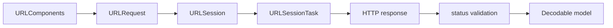

<TLDR>
  <TLDRCell label="what">
    `URLSession` 是 Apple 平台的网络传输协调器；它用会话配置管理一组数据、上传、下载或 WebSocket 任务。
  </TLDRCell>
  <TLDRCell label="when">
    应用需要调用 HTTP API、传输文件，或让系统在后台继续上传和下载时使用它。
  </TLDRCell>
  <TLDRCell label="how">
    先用 `URLComponents` 和 `URLRequest` 明确请求契约，再复用配置好的会话，并分别处理传输错误、HTTP 状态和解码错误。
  </TLDRCell>
</TLDR>

## 是什么，为什么存在

<Term id="url-session">`URLSession`</Term> 是 Foundation 中协调网络传输的对象。一个会话按同一套配置创建多个任务，负责连接、Cookie、凭证、缓存和协议协商等系统工作。应用代码仍负责定义请求、解释响应，并决定失败后该做什么。

最常见的数据任务把完整响应体放进内存，适合 JSON API 等短请求。上传任务明确提供待发送的数据或文件，下载任务把响应体写到临时文件，WebSocket 任务则交换消息。任务类型影响数据交付方式；它不会改变服务端的 HTTP 契约。

`URLSession.shared` 适合没有特殊策略的简单请求。需要独立 Cookie、缓存、超时、网络成本限制或委托回调时，应先创建 `URLSessionConfiguration`，再从它创建可复用的会话。后台传输还需要带稳定标识符的 `.background` 配置和委托。

URLSession 解决的是 Apple 平台上的传输问题，不是完整的 API 客户端架构。它不会把 404 自动变成 Swift 错误，也不会替你验证 JSON 中的业务字段、刷新访问令牌或判断一次写请求能否重试。这些规则必须位于看得见、可测试的边界中。

你通常会在仓库或服务对象中注入一个会话，然后由小型请求构造器生成 <Term id="url-request">`URLRequest`</Term>。这种边界允许生产代码使用真实会话，测试使用受控的 `URLProtocol`，而不必把网络细节散落在视图和业务模型里。

## 工作原理

一次普通的异步请求经过以下路径：



`URLComponents` 负责把路径与查询项编码成 URL。`URLRequest` 在 URL 之上增加方法、请求头、正文、缓存策略和每次请求的超时。字符串拼接无法可靠处理保留字符，也容易把令牌放进 URL，因此不应承担这项工作。

会话配置定义一组任务共享的策略。`.default` 使用持久缓存、共享 Cookie 存储和凭证存储；`.ephemeral` 不把这些数据持久写盘；`.background` 把上传或下载交给系统进程。短数据请求不能因为应用可能进入后台，就自动改用后台会话。

`URLSession` 在初始化时复制配置。创建会话后再修改原来的配置对象，或修改 `session.configuration` 返回的副本，都不会改变该会话。策略需要变化时，应创建新配置和新会话，并明确旧会话何时失效。

调用 `data(for:)` 会创建并启动数据任务，然后挂起当前 Swift 任务，直到完整响应体到达或传输失败。返回值是 `(Data, URLResponse)`；成功返回只说明 URL 加载完成。把响应转换成 `HTTPURLResponse` 并检查状态码，是客户端自己的责任。

边界代码至少区分三类结果：

| 层次 | 示例 | 处理方式 |
| --- | --- | --- |
| 传输 | DNS 失败、断网、取消 | 保留 `URLError` 或包装其原因 |
| HTTP | 401、404、429、500 | 检查状态、响应头和安全截断后的正文 |
| 表示 | 缺字段、类型不符、坏 JSON | 保留 `DecodingError` 与 `codingPath` |

这种区分让调用方知道失败发生在哪一层。把所有错误压成 `nil` 或一个「请求失败」字符串，会丢掉是否应重新认证、是否可重试以及哪个字段不匹配的信息。错误类型不必暴露全部底层细节，但应保留原始原因供日志和测试诊断。

Swift 并发任务的取消会与 URLSession 的异步方法协作。不过，<Term id="cancellation">取消</Term> 是停止等待和工作的请求，不是服务端回滚协议。若请求已经越过远端提交点，调用方收到取消或超时时，写入结果仍可能未知。

会话可以没有委托，也可以使用会话级或任务级委托。委托用于认证挑战、重定向、增量数据、传输进度和后台事件等生命周期钩子。使用委托的会话会强引用其委托，直到会话显式失效或进程退出，所以所有权和失效路径必须成对设计。

缓存先服从 HTTP 响应头和请求的 <Term id="cache-policy">缓存策略</Term>。`URLCache` 能按请求保存可缓存响应；手工保存 ETag 却没有连同响应体、`Vary` 维度和过期规则一起管理，通常会造出第二套不完整的 HTTP 缓存。

## 示例

下面四个例子依次建立请求、执行可测试的数据任务、配置会话，并把重试资格写成独立策略。它们都需要 Swift 与 Apple Foundation；当前工作区没有 Swift 工具链，因此每个代码块都明确标为未执行，输出块也不声称任何运行结果。

### 构造不会破坏查询值的请求

请求构造器把路径、查询和请求头分别表达。搜索词中的空格由 `URLComponents` 编码，访问令牌留在 `Authorization` 请求头中。

<Depth level="quick">

```swift title="make_request.swift"
// # not executed here: Swift 6.3.3 toolchain is unavailable.
import Foundation

let baseURL = URL(string: "https://api.example.com")!
var components = URLComponents(
    url: baseURL.appendingPathComponent("v1/search"),
    resolvingAgainstBaseURL: false
)!
components.queryItems = [
    URLQueryItem(name: "q", value: "red bike"),
    URLQueryItem(name: "limit", value: "20"),
]

guard let url = components.url else {
    fatalError("invalid search URL")
}

var request = URLRequest(url: url)
request.httpMethod = "GET"
request.timeoutInterval = 15
request.setValue("application/json", forHTTPHeaderField: "Accept")
request.setValue("Bearer demo-token", forHTTPHeaderField: "Authorization")

print(request.httpMethod ?? "missing method")
print(request.url?.absoluteString ?? "missing URL")
print(request.value(forHTTPHeaderField: "Accept") ?? "missing Accept")
```

```text
# not executed here: Swift 6.3.3 toolchain is unavailable.
```

</Depth>

固定的示例 URL 让两个强制解包可由代码本身证明；接收用户或配置输入的生产代码应返回清晰错误。路径片段与查询值仍要分别建模。把 `?token=...` 拼进字符串不仅会遇到编码错误，还会让秘密进入历史记录和代理日志。

### 在没有真实网络的情况下验证响应

`StubProtocol` 拦截请求并返回固定 HTTP 响应。客户端仍走真实的 `URLSession.data(for:)` 路径，因此测试能覆盖请求、状态检查和解码，而不会依赖外部服务。

```swift title="fetch_user.swift"
// # not executed here: Swift 6.3.3 toolchain is unavailable.
import Foundation

final class StubProtocol: URLProtocol {
    override class func canInit(with request: URLRequest) -> Bool { true }
    override class func canonicalRequest(for request: URLRequest) -> URLRequest { request }

    override func startLoading() {
        let response = HTTPURLResponse(
            url: request.url!, statusCode: 200,
            httpVersion: "HTTP/1.1", headerFields: ["Content-Type": "application/json"]
        )!
        let data = Data(#"{"id":7,"name":"Mina"}"#.utf8)
        client?.urlProtocol(self, didReceive: response, cacheStoragePolicy: .notAllowed)
        client?.urlProtocol(self, didLoad: data)
        client?.urlProtocolDidFinishLoading(self)
    }

    override func stopLoading() {}
}

struct User: Decodable { let id: Int; let name: String }
enum ClientError: Error { case nonHTTP; case status(Int) }

let configuration = URLSessionConfiguration.ephemeral
configuration.protocolClasses = [StubProtocol.self]
let session = URLSession(configuration: configuration)
let request = URLRequest(url: URL(string: "https://api.example.test/users/7")!)
let (data, response) = try await session.data(for: request)

guard let http = response as? HTTPURLResponse else { throw ClientError.nonHTTP }
guard (200...299).contains(http.statusCode) else {
    throw ClientError.status(http.statusCode)
}

let user = try JSONDecoder().decode(User.self, from: data)
print("\(user.id): \(user.name)")
```

```text
# not executed here: Swift 6.3.3 toolchain is unavailable.
```

<TryToBreak items={['让存根返回 404 和 JSON 错误正文', '删除 name 字段', '让任务在响应前被取消']} />

这里的强制解包只处理测试拥有的固定 URL 和 HTTP 响应构造器。生产客户端应把状态错误携带的正文限制在很小且经过脱敏的范围内，不能把服务器返回的 HTML、令牌或个人数据直接写进日志。解码应在状态验证之后进行，否则 404 错误对象可能伪装成模型格式错误。

### 固化会话策略

配置必须在会话初始化前完成。这个例子用临时会话隔离持久 Cookie、缓存和凭证，并明确请求与整个资源的两种超时。

```swift title="configure_session.swift"
// # not executed here: Swift 6.3.3 toolchain is unavailable.
import Foundation

let configuration = URLSessionConfiguration.ephemeral
configuration.timeoutIntervalForRequest = 12
configuration.timeoutIntervalForResource = 45
configuration.waitsForConnectivity = true
configuration.allowsExpensiveNetworkAccess = false
configuration.httpAdditionalHeaders = [
    "Accept": "application/json",
    "User-Agent": "CatalogApp/1.0",
]

let session = URLSession(configuration: configuration)
configuration.timeoutIntervalForRequest = 99

print(session.configuration.timeoutIntervalForRequest)
print(session.configuration.timeoutIntervalForResource)
print(session.configuration.allowsExpensiveNetworkAccess)
session.invalidateAndCancel()
```

```text
# not executed here: Swift 6.3.3 toolchain is unavailable.
```

`timeoutIntervalForRequest` 限制等待额外数据的间隔，`timeoutIntervalForResource` 限制整个资源加载可用的总时间；它们不是同一个截止时间。`waitsForConnectivity` 允许任务等待合适网络，但不会修复连接建立后的中断。产品还应根据业务决定是否允许昂贵网络或低数据模式，而不是照抄一组全局值。

### 只重试明确允许的读取

重试资格属于 API 契约，不属于所有错误的默认动作。这个保守策略只考虑 GET 和 HEAD、有限次数以及一小组临时状态；实际等待时间仍需处理 `Retry-After`，并加入有上限的抖动。

```swift title="retry_policy.swift"
// # not executed here: Swift 6.3.3 toolchain is unavailable.
import Foundation

struct RetryPolicy {
    let maximumAttempts = 3
    let transientStatuses: Set<Int> = [408, 429, 500, 502, 503, 504]

    func permits(_ request: URLRequest, status: Int, attempt: Int) -> Bool {
        guard attempt < maximumAttempts else { return false }
        guard transientStatuses.contains(status) else { return false }
        return request.httpMethod == "GET" || request.httpMethod == "HEAD"
    }

    func fallbackDelay(after attempt: Int) -> TimeInterval {
        min(pow(2, Double(attempt - 1)), 8)
    }
}

let policy = RetryPolicy()
var get = URLRequest(url: URL(string: "https://api.example.com/items")!)
get.httpMethod = "GET"
var post = get
post.httpMethod = "POST"

print(policy.permits(get, status: 503, attempt: 1))
print(policy.permits(post, status: 503, attempt: 1))
print(policy.permits(get, status: 404, attempt: 1))
print(policy.fallbackDelay(after: 3))
```

```text
# not executed here: Swift 6.3.3 toolchain is unavailable.
```

这个策略故意不把「方法是幂等的」当成充分条件。安全重放还要求请求体可重建、凭证仍有效，并且剩余截止时间足够。POST 只有在服务端提供稳定幂等键和原子去重等应用协议时，才可能安全自动重试。

## 陷阱

### 把传输完成当成 HTTP 成功

> [!PITFALL]
> `try await session.data(for:)` 没有抛错，只代表 URL 加载系统交付了响应。404 和 500 仍可正常返回 `Data`，而且错误正文可能碰巧能解码成宽松模型。

**修复：** 先确认是 `HTTPURLResponse`，再按端点契约接受具体成功状态，最后解码正文。错误响应应保留状态和相关请求标识，并对正文做大小限制与脱敏。

### 用字符串和强制解包构造动态 URL

> [!PITFALL]
> `URL(string: base + "?q=" + input)!` 把路径、查询和编码混在一起。斜杠、空格、`&`、Unicode 或无效配置都可能改变目标，令牌还可能泄漏到 URL 日志。

**修复：** 用 `URL.appendingPathComponent` 和 `URLComponents.queryItems` 分层构造地址，让失败成为显式错误。认证信息放在合适的请求头中，并在发送前验证允许的 scheme 和 host。

### 为每次调用创建一个会话

> [!PITFALL]
> 一个请求一个 `URLSession` 会拆散 Cookie、缓存、连接复用、指标和委托生命周期。若会话持有委托而从不失效，短命包装器也可能留下长命引用。

**修复：** 按一组真正不同的策略复用会话，例如交互请求、临时认证和后台传输各一个。拥有自定义委托的组件必须选择 `finishTasksAndInvalidate()` 或 `invalidateAndCancel()`，并测试关闭路径。

### 无条件重试写请求

> [!PITFALL]
> 固定循环重试所有 `URLError`、429 和 5xx，可能重复创建订单或付款。取消和超时只说明客户端没有拿到确定结果，不能证明服务端没有提交。

**修复：** 按方法、端点和错误阶段列出重试矩阵。读取使用有限退避并尊重 `Retry-After`；写入需要 <Term id="idempotency">幂等性</Term> 协议、稳定键和服务端原子去重，否则把结果标为未知并查询状态。

### 用 `try?` 和原始正文隐藏边界错误

> [!PITFALL]
> `try?` 把缺字段、错误类型和损坏 JSON 都变成 `nil`；为补偿诊断不足而打印完整请求头和正文，又会泄漏令牌与个人数据。

**修复：** 保留 `URLError`、状态错误和 `DecodingError` 的类别与原因。日志只记录请求 ID、端点模板、状态、耗时和经过脱敏的错误摘要，测试则断言具体失败层次。

### 把前台异步调用当成后台传输

> [!PITFALL]
> 在一个 `Task` 中调用 `URLSession.shared.download`，不会让传输在应用被系统终止后自动继续。相反，把短 JSON 请求塞进后台会话也不合适，因为后台会话不支持数据任务。

**修复：** 长时间文件传输使用带固定标识符的后台配置、上传或下载任务及持久委托状态。普通 API 请求使用默认或临时会话，并把应用生命周期中断设计成可恢复的产品行为。

## AI 时代

**生成代码在这里常犯的错**

模型常生成 `let (data, _)` 并直接解码，完全丢掉 HTTP 状态和响应头。它还会把路径、查询和令牌插值进一个强制解包的字符串，为每次重试创建新会话，或对 POST 统一执行三次指数退避。认证代码尤其容易出现「刷新风暴」：多个 401 各自刷新令牌，随后把第一个请求的响应错误地交给所有等待者。另一类常见补丁是用 `try?` 吞掉真实错误，再打印完整正文来「方便调试」。

**让 AI 检查**

- 列出每个调用点对传输错误、非 HTTP 响应、每个允许状态和解码失败的处理路径。
- 给出会话所有权表，说明配置何时复制、委托由谁持有、何时失效，以及取消如何传播。
- 为每次自动重试说明方法、端点幂等契约、最大次数、总截止时间、`Retry-After` 和重复写入防护。

**审查清单**

- 用受控 `URLProtocol` 分别测试成功、404、429、坏 JSON、连接错误和取消，不访问真实服务。
- 搜索 URL 字符串插值、强制解包、`try?`、每次调用创建会话，以及包含认证头或原始正文的日志。
- 追踪并发 401、视图消失和应用后台化时的任务所有权，确认没有刷新风暴、悬空工作或错误响应串线。

**提示词汇**

使用准确术语 `URLSessionConfiguration`（会话配置）、`URLRequest`（请求对象）、`transport error`（传输错误）、`HTTP status validation`（HTTP 状态验证）、`task cancellation`（任务取消）、`idempotency key`（幂等键）、`Retry-After`、`URLProtocol test double`（`URLProtocol` 测试替身）和 `delegate invalidation`（委托失效）。要求生成状态矩阵、所有权表与失败时间线，比「写一个健壮的网络层」更容易暴露错误假设。

<Depth level="deep">

## 请求边界与类型设计

网络边界最好分成三个小部件：请求构造器、传输器和解码器。请求构造器只接受经过类型化的路径参数与查询值；传输器返回数据和已验证响应；解码器把表示转换为传输模型。业务验证随后把传输模型转换成领域对象。

不要让一个泛型 `request<T>()` 以相同方式处理所有端点。204 没有正文，下载返回临时文件，流式接口不应先缓冲全部字节，错误响应也可能使用另一套模型。共享代码可以统一机械步骤，但每个端点仍需声明成功状态、正文要求和认证范围。

请求正文应与 `Content-Type` 一致。用 `JSONEncoder` 生成 JSON，而不是手工插值字符串；上传文件时，根据协议选择数据、文件或流，并确认重放能力。设置 `Accept` 表达可接收的响应媒体类型，不能用它代替 `Content-Type`。

泛型解码只证明数据满足 `Decodable` 规则。服务端给出的 URL、金额、权限字段和分页游标仍是不受信任的输入。范围、长度、允许 host 以及跨字段不变量应在显式验证阶段检查。

认证刷新需要单一协调者。并发请求遇到 401 时，只应有一个刷新操作，其余请求等待新的凭证后各自重放原请求。等待者不能共享某一个业务响应；刷新失败还必须一致地结束所有等待并清理旧令牌。

## 错误、取消与重试时间线

传输错误发生在没有可用 HTTP 响应时，HTTP 错误发生在服务器已经给出状态时，表示错误发生在客户端解释正文时。把三个阶段画成时间线，可以判断一次请求是否可能已经到达服务端。对写操作来说，连接在发送后断开通常意味着结果未知。

Swift 任务取消应沿调用树传播。持有搜索、图片或页面请求的 UI 层在新请求替换旧请求时可以取消旧任务，但底层不应把 `CancellationError` 变成普通空结果。调用方需要能区分「没有数据」和「这次工作不再需要」。

取消 URLSession 任务不会撤销远端副作用，关闭界面也不会回滚付款。需要可靠写入时，客户端生成稳定幂等键，服务端把键、请求指纹和业务结果原子保存。重试发送同一个键和同一个请求，而不是每轮生成新键。

重试预算应同时限制次数与总时间。每次等待都消耗调用方截止时间，认证刷新和连接等待也包括在内。没有总预算的三层重试会相乘：URLSession 包装器、仓库和 UI 各重试三次，最终可能产生二十七次请求。

429 或 503 可能携带 `Retry-After`。客户端应按协议解析允许的日期或秒数，在本地剩余预算内采用该建议；缺失时才使用自己的有界退避。随机抖动用于避免大量客户端同时重试，不能把无限等待变成合理策略。

## 缓存、重定向与信任边界

HTTP 缓存键不只是 URL 字符串。方法、请求头、响应的 `Vary`、验证器和过期规则都会影响复用。让 `URLCache` 与服务端缓存头协作，通常比只把 ETag 存进字典更可靠。

`.reloadIgnoringLocalCacheData` 会绕开本地缓存读取，但不等于「任何中间层都不缓存」。同样，`.returnCacheDataElseLoad` 允许返回陈旧数据的具体含义必须符合产品需求。缓存策略是正确性选择，不只是性能开关。

临时会话不把缓存、Cookie 和凭证持久写盘，但这不等于匿名或无状态。请求仍会携带代码显式设置的认证头，内存状态在会话存活期间也存在。敏感流程需要同时检查日志、遥测、截图和上层模型的生命周期。

URLSession 默认处理 HTTP 重定向，委托可以检查新请求或拒绝跳转。安全敏感客户端应在每一跳重新验证 scheme、host、认证头和方法变化，不能只验证初始 URL。跨 host 重定向尤其不应盲目转发秘密。

App Transport Security 默认推动 HTTPS，但宽泛例外会削弱这层保护。证书挑战处理器若对所有挑战返回「信任」，等于关闭服务器身份验证。需要自定义信任策略时，应限定 host，使用系统信任评估，并准备证书轮换方案。

## 后台传输与委托生命周期

后台会话适合长时间、可由文件表示的上传和下载。配置标识符在应用内应稳定且唯一，系统用它在应用恢复后重新连接事件。每次启动随机生成标识符，会让恢复路径找不到原会话。

后台传输由系统进程执行，应用状态必须能在进程重启后重建。内存中的完成闭包、数组和进度观察者都不够；任务描述、目标文件、业务 ID 和状态迁移需要持久保存。收到临时下载 URL 后还要及时把文件移动到应用拥有的位置。

委托回调可能位于指定的操作队列，而 UI 更新需要进入 `MainActor`。不要因为异步调用点位于主 actor，就假设所有委托回调也在主线程。反过来，JSON 解码和文件处理也不应无条件堆到主 actor 上。

自定义会话强引用委托。若委托也强持有会话，这个关系会持续到 `finishTasksAndInvalidate()` 或 `invalidateAndCancel()` 打破会话对委托的引用。选择前者表示允许现有任务完成，后者表示取消它们；关闭语义应由所有者明确决定。

进度总量可能未知。`countOfBytesExpectedToReceive` 或下载委托提供的预期字节数可能为负值，直接相除会得到没有意义的比例。界面应在总量未知时显示不确定进度，已知且大于零时才计算百分比。

## 测试与可观测性

用依赖注入把 `URLSession` 或更小的传输协议交给客户端。`URLProtocol` 测试替身可以捕获请求并同步返回受控响应，适合验证方法、查询、请求头、正文、状态与解码。它不替代少量真实集成测试，但能让单元测试快速且确定。

测试矩阵至少包含端点的每个成功状态、无正文响应、结构化错误、非 JSON 错误、损坏 JSON、连接错误、取消和重定向。重试测试还要使用虚拟时钟或注入的 sleeper，不能真的等待指数秒数。并发认证测试应同时释放多个 401，断言只刷新一次且每个请求拿到自己的响应。

指标应区分 DNS、连接、TLS、首字节、下载、状态与解码阶段。`URLSessionTaskMetrics` 能提供传输层时间和连接复用等数据，但业务日志仍需关联请求 ID 与端点模板。原始 URL 可能含查询秘密，因此标签不能直接使用完整地址。

日志只记录诊断需要的最少字段。认证头、Cookie、请求正文和响应正文默认都应视为敏感；即使是错误响应，也可能包含电子邮件、内部栈或会话信息。需要样本时应先限制大小、按字段脱敏，并配置保留期限。

测试取消时要制造真正的悬挂请求，再取消拥有它的 Swift 任务，并断言错误类别和清理动作。立即返回的存根无法证明取消传播。后台会话则需要设备级测试应用生命周期，因为纯单元测试不能模拟系统守护进程交付事件。

</Depth>

<Checkpoint id="backend/urlsession" />

## 延伸阅读

- [Apple Developer Documentation：URLSession](https://developer.apple.com/documentation/foundation/urlsession)
- [Apple Developer Documentation：URLSessionConfiguration](https://developer.apple.com/documentation/foundation/urlsessionconfiguration)
- [WWDC21：Use async/await with URLSession](https://developer.apple.com/videos/play/wwdc2021/10095/)
- [Apple Developer Documentation：Accessing cached data](https://developer.apple.com/documentation/foundation/accessing-cached-data)
- [Apple Developer Documentation：Downloading files in the background](https://developer.apple.com/documentation/foundation/downloading-files-in-the-background)
- [Swift.org：使用 Swiftly 安装 Swift](https://www.swift.org/install/macos/swiftly/)
