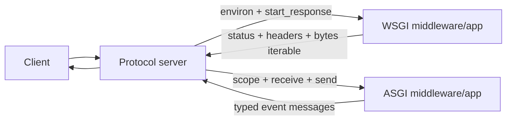

<TLDR>
  <TLDRCell label="what">
    <Term id="wsgi">WSGI</Term> is a synchronous HTTP call contract; <Term id="asgi">ASGI</Term> calls an async application per connection and exchanges data through events.
  </TLDRCell>
  <TLDRCell label="trap">
    Writing an entry point with `async def` does not make a synchronous database driver or file operation nonblocking, and ASGI cannot give a WSGI application WebSocket support.
  </TLDRCell>
  <TLDRCell label="fix">
    Choose the interface from the application signature, required protocols, and dependencies, then verify body chunks, response order, disconnects, lifespan, and sync/async boundaries.
  </TLDRCell>
</TLDR>

## What it is and why it exists

WSGI (Web Server Gateway Interface) and ASGI (Asynchronous Server Gateway Interface) specify how a Python web server calls an application. They are neither servers nor frameworks; they are boundary contracts that both sides can implement. The server handles HTTP parsing, sockets, and process management, while the framework handles routing and application work behind that boundary.

WSGI targets synchronous HTTP. For each request, the server calls `application(environ, start_response)`. The application calls `start_response()` with the status and headers, then returns an iterable that yields `bytes`. PEP 3333 exists to let servers and frameworks be chosen independently, not to give application developers another high-level web API.

ASGI expands the boundary to `async application(scope, receive, send)`. The `scope` describes one connection, `receive()` supplies inbound events, and `send()` submits outbound events. Each subprotocol defines its own scope and messages, so the same application shape can carry HTTP, WebSocket, and lifespan traffic.

The difference is not "old and slow" versus "new and fast." WSGI suits synchronous frameworks and short HTTP requests; ASGI suits WebSockets, long polling, streamed requests, and workloads with many concurrent waits. ASGI does not accelerate CPU work, and wrapping a synchronous dependency in `async def` does not stop it from blocking.

You usually meet these names in deployment entry points, framework adapters, middleware, and exception traces. First identify the callable the application exposes. Then check that the server, reverse proxy, and client path support the protocol you need instead of relying on a product name.

| Dimension | WSGI | ASGI |
| --- | --- | --- |
| Application shape | `application(environ, start_response)` | `async application(scope, receive, send)` |
| Inbound data | `environ` and `wsgi.input` | `scope` and `receive()` events |
| Outbound data | `start_response()` and `Iterable[bytes]` | `send()` events |
| Connection model | One call per HTTP request | One call per protocol-defined connection |
| Typical capability | Synchronous HTTP | HTTP, WebSocket, lifespan |

## How it works

Raw HTTP bytes do not enter a business function directly. The server converts a request into a WSGI environment or ASGI messages, and the application returns data in the corresponding protocol. Middleware is a server to the inner application and an application to the outer server, so it must preserve both sides of the contract.



### One WSGI call

`environ` is a built-in `dict` containing CGI-style fields and WSGI fields such as `wsgi.input`. Metadata, the response status, and response headers use spec-constrained `str` values; request and response bodies use bytes. An application may read only the fields it needs, but it cannot assume that every optional field is present.

`start_response(status, headers)` sets the response status and headers. The iterable returned by the application then yields zero or more byte chunks. The server must call `close()` on the result when that method exists, whether the request ends normally, iteration raises, or the client disconnects early. The application cannot assume the iterator will be fully consumed.

WSGI does not require a server to use processes, threads, or any particular scheduler. A synchronous callable occupies the worker that executes it; whether the server handles other requests during that wait depends on its worker model. The interface contract and concurrency deployment are separate decisions.

### ASGI scopes and events

An ASGI server calls the application once per connection. An HTTP scope represents one request, even when an underlying HTTP/2 connection multiplexes several streams; a WebSocket scope lasts until the socket closes. The HTTP request body is not stored in the scope. It arrives through one or more `http.request` events.

Every event is a `dict` with a top-level `type` field. The application must follow the subprotocol sequence: for example, send `http.response.start` once, then one or more `http.response.body` events. The final body event sets `more_body` to `False` or omits it. WebSocket and lifespan have different event sets.

Both `receive()` and `send()` are awaitable callables. Awaiting `receive()` yields execution until a new event exists. Awaiting `send()` gives the server a chance to place data in its send buffer and apply <Term id="backpressure">backpressure</Term>. It does not mean that the remote client has received the data.

### Ownership at the boundary

A WSGI application pulls from `wsgi.input`, and the server pulls from the response iterator. An ASGI application awaits inbound events and actively sends outbound events. That directional difference determines how middleware buffers, streams, and cleans up resources. Mechanically joining the two signatures does not produce a correct adapter.

| Stage | WSGI responsibility | ASGI responsibility |
| --- | --- | --- |
| Request metadata | Server builds `environ` | Server builds `scope` |
| Request body | Application reads a file-like object | Application repeatedly awaits `http.request` |
| Response start | Application calls `start_response()` | Application sends `http.response.start` |
| Response stream | Server iterates chunks | Application repeatedly awaits `send()` |
| Early termination | Server closes the response iterator | Application handles cancellation, disconnect, or `send()` failure |

### Capability needs end-to-end support

The ASGI HTTP subprotocol can represent HTTP/1.0, HTTP/1.1, and HTTP/2, but the server and upstream path decide what is actually enabled in a deployment. WebSockets also need the server and reverse proxy to handle the handshake and connection upgrade. An ASGI entry point proves only the application boundary, not every capability of the production path.

A WSGI application can run behind an ASGI server through an adapter. The specification requires the synchronous WSGI callable to run in a thread pool. This preserves HTTP compatibility but does not add WebSockets or native asynchronous streaming. The adapter must also translate strings, bytes, request bodies, and thread-sensitive resources correctly.

## Examples

These four programs drive the callables directly without opening a port or importing a third-party framework. They cover a WSGI round trip, chunked ASGI messages, lifespan, and isolation of synchronous I/O. Every output shown here came from running the file with local `python3`.

### A minimal WSGI round trip

This small driver supplies the environment fields that the application reads and captures `start_response()`. Calling `close()` in `finally` models the server's cleanup duty even when processing ends early.

<Depth level="quick">

```python run title="wsgi_roundtrip.py"
from io import BytesIO
from urllib.parse import parse_qs

def application(environ, start_response):
    query = parse_qs(environ.get("QUERY_STRING", ""))
    name = query.get("name", ["world"])[0]
    body = f"Hello, {name}!".encode()
    headers = [
        ("Content-Type", "text/plain; charset=utf-8"),
        ("Content-Length", str(len(body))),
    ]
    start_response("200 OK", headers)
    return [body]

environ = {
    "REQUEST_METHOD": "GET",
    "PATH_INFO": "/hello",
    "QUERY_STRING": "name=Ada",
    "CONTENT_LENGTH": "0",
    "wsgi.input": BytesIO(b""),
}
captured = {}

def start_response(status, headers):
    captured.update(status=status, headers=headers)
    return lambda data: None

result = application(environ, start_response)
try:
    body = b"".join(result)
finally:
    if hasattr(result, "close"):
        result.close()

print(captured["status"])
print(dict(captured["headers"])["Content-Type"])
print(body.decode())
```

```text
200 OK
text/plain; charset=utf-8
Hello, Ada!
```

<TryToBreak items={['remove QUERY_STRING', 'set name to an empty string', 'make the response iterator raise on its second chunk']} />

</Depth>

A real server adds all PEP 3333 environment fields and writes the returned bytes to the network. This driver checks only the application's interaction with the interface. It does not test HTTP parsing, proxy headers, or socket behavior. A framework test client has the same kind of in-process boundary.

### Handling a chunked ASGI request

An ASGI request body may arrive across several `http.request` events. The application reads until `more_body` is false, then creates one logical response from two body events.

```python run title="asgi_roundtrip.py"
import asyncio

async def application(scope, receive, send):
    assert scope["type"] == "http"
    body = bytearray()
    while True:
        message = await receive()
        if message["type"] == "http.disconnect":
            return
        body.extend(message.get("body", b""))
        if not message.get("more_body", False):
            break

    await send({"type": "http.response.start", "status": 201,
                "headers": [(b"content-type", b"text/plain")]})
    await send({"type": "http.response.body", "body": b"received=",
                "more_body": True})
    await send({"type": "http.response.body",
                "body": str(len(body)).encode(), "more_body": False})

incoming = iter([
    {"type": "http.request", "body": b"abc", "more_body": True},
    {"type": "http.request", "body": b"def", "more_body": False},
])
sent = []

async def receive():
    return next(incoming)

async def send(message):
    sent.append(message)

scope = {"type": "http", "method": "POST", "path": "/upload"}
asyncio.run(application(scope, receive, send))

for message in sent:
    if message["type"] == "http.response.start":
        print("start", message["status"], message["headers"])
    else:
        print("body", repr(message["body"]), message["more_body"])
```

```text
start 201 [(b'content-type', b'text/plain')]
body b'received=' True
body b'6' False
```

The two input chunks total six bytes, and `more_body` joins the two output chunks into one response. Production code must not append to the request buffer without a bound. Check the accumulated size as the buffer grows, then stop reading and terminate the request according to the framework or server contract when the limit is exceeded.

This test does not simulate a `send()` failure or task cancellation. Long polling and streamed responses need separate coverage for "disconnect arrives from the next `receive()`" and "`send()` raises `OSError` first," because concurrent execution does not guarantee their order.

### Driving lifespan

Lifespan initializes and closes resources in the event loop that handles requests. The example writes shared state to `scope["state"]` and explicitly acknowledges startup and shutdown.

```python run title="asgi_lifespan.py"
import asyncio


async def application(scope, receive, send):
    assert scope["type"] == "lifespan"
    state = scope["state"]

    while True:
        message = await receive()
        if message["type"] == "lifespan.startup":
            state["catalog"] = "ready"
            await send({"type": "lifespan.startup.complete"})
        elif message["type"] == "lifespan.shutdown":
            state["catalog"] = "closed"
            await send({"type": "lifespan.shutdown.complete"})
            return


incoming = iter([
    {"type": "lifespan.startup"},
    {"type": "lifespan.shutdown"},
])
sent = []


async def receive():
    return next(incoming)


async def send(message):
    sent.append(message)


scope = {"type": "lifespan", "state": {}}
asyncio.run(application(scope, receive, send))

for message in sent:
    print(message["type"])
print(scope["state"]["catalog"])
```

```text
lifespan.startup.complete
lifespan.shutdown.complete
closed
```

A server that supports lifespan state shallow-copies this namespace into later request scopes. Real state is usually a connection pool or client object rather than a string. A multiprocess server runs lifespan in each process's event loop, so initialization must allow every worker to own its resources.

### Isolating synchronous I/O

When an existing synchronous client cannot yet be replaced, `asyncio.to_thread()` can move blocking I/O off the event loop thread. This example checks the call and result without presenting a timing difference as a benchmark.

```python run title="thread_boundary.py"
import asyncio
import time


def read_legacy_record(record_id):
    time.sleep(0.01)
    return {"id": record_id, "state": "paid"}


async def heartbeat():
    await asyncio.sleep(0)
    return "loop stayed runnable"


async def main():
    record, pulse = await asyncio.gather(
        asyncio.to_thread(read_legacy_record, 7),
        heartbeat(),
    )
    print(pulse)
    print(record)


asyncio.run(main())
```

```text
loop stayed runnable
{'id': 7, 'state': 'paid'}
```

`to_thread()` is intended mainly for I/O functions that would otherwise block the event loop. It is not a switch that makes arbitrary CPU work faster, and it does not automatically make the underlying call respond to coroutine cancellation. Thread-pool capacity, connection-pool capacity, timeouts, and shutdown behavior still have to agree.

## Pitfalls

### Treating `async def` as a nonblocking guarantee

> [!PITFALL]
> Generated ASGI handlers often call a synchronous ORM, `time.sleep()`, a file API, or a blocking HTTP client directly from a coroutine. During that call, the event loop thread cannot run other work on the same loop.

**Fix:** prefer a truly async library. When a blocking I/O function must remain temporarily, isolate it through the framework's sync boundary or `asyncio.to_thread()`, and test timeout, cancellation, and thread-pool exhaustion. Put CPU-heavy work in a process or job system suited to it.

### Assuming the request body is already complete

> [!PITFALL]
> WSGI's `wsgi.input` is a stream that middleware does not automatically replay for the inner application. An ASGI body may also span several `http.request` events. Ignoring stream ownership or calling `receive()` only once leaves later code with empty or truncated data.

**Fix:** in WSGI, read through a framework API or according to a validated `CONTENT_LENGTH`. In ASGI, loop over `more_body` while accumulating and enforcing a size limit. Do not buffer an unknown-sized request in memory merely because it simplifies the handler.

### Converting headers to a dictionary

> [!PITFALL]
> ASGI uses a list of byte pairs and preserves repeated response headers. Middleware that runs `dict(headers)` overwrites same-named fields such as multiple `set-cookie` entries. Mixing WSGI `str` headers with ASGI `bytes` headers also violates the interface.

**Fix:** keep headers as an ordered sequence of pairs and append, replace, or remove individual fields according to the protocol. Add boundary tests for repeated headers, non-ASCII paths, and empty bodies instead of testing only ordinary JSON responses.

### Breaking response order and cleanup

> [!PITFALL]
> WSGI middleware may yield nonempty bytes before `start_response()` or forget to forward the response iterator's `close()`. ASGI middleware may send `http.response.start` twice, omit the final `more_body: False`, or swallow a disconnect failure.

**Fix:** test valid event sequences as a state machine and release request-owned resources in `finally`. Cover normal completion, application failure, client disconnect, and server cancellation separately; one path is not evidence for the others.

### Treating an adapter as a capability upgrade

> [!PITFALL]
> A WSGI-to-ASGI adapter can mount a synchronous HTTP application behind an ASGI server, but it cannot add WebSockets, async request streaming, or nonblocking dependencies. A reverse adapter cannot compress a long-lived connection into one synchronous WSGI HTTP call without losing semantics.

**Fix:** state which subprotocols, streaming behavior, thread affinity, context propagation, and cancellation semantics must survive. Use an adapter only within that intersection, then verify proxies, timeouts, and disconnects through a real server.

### Sharing resources at the wrong lifetime

> [!PITFALL]
> Creating an asynchronous connection pool during module import can fork the resource into several workers or use it outside the event loop that created it. Creating a client for every request has the opposite problem: it discards connection reuse and multiplies setup work.

**Fix:** create and close ASGI resources per event loop in lifespan, then access them through request scope state or the framework's equivalent. Check single-process, multiworker, reload, and failed-startup paths explicitly. WSGI resources must follow the chosen process and thread model's lifecycle hooks.

## In the AI era

**What generated code gets wrong here**

Models produce WSGI signatures such as `async def application(environ, start_response)` or return `Response(...)` directly from a raw ASGI callable, mixing framework APIs with the underlying protocol. They also read only the first `http.request`, collapse a header list into a dictionary, ignore `lifespan` and `websocket` scopes, or modify a message in middleware without forwarding it through `await send(message)`. Less visible failures include a synchronous database call left inside a coroutine and background tasks that have no retained reference or shutdown cancellation.

**Ask your AI to check**

- List every scope type supported by each entry point and middleware, then give the valid inbound and outbound event sequence for each type.
- Trace every I/O call reachable from `async def`; mark which calls are genuinely awaitable, which run in a thread pool, and which still block the event loop.
- Generate tests for request chunks, repeated response headers, client disconnect, cancellation, startup failure, and per-worker cleanup; do not substitute direct business-function calls for protocol tests.

**Review checklist**

- Verify callable signatures, the `str`/`bytes` boundary, the request-body termination condition, and that a response starts exactly once.
- Pass unhandled scopes through unchanged, and confirm that middleware keeps every body chunk, repeated header, and final `more_body` value.
- Observe blocking calls, disconnect cleanup, lifespan counts, and adapter thread behavior in a real server process.

**Prompt vocabulary**

Use the exact terms `WSGI environ`, `start_response callable`, `response iterable`, `ASGI connection scope`, `receive event`, `send event`, `more_body`, `lifespan protocol`, `backpressure`, and `sync-to-async adapter`. Ask for an event sequence and resource-ownership map rather than a generic request to "make it async."

<Depth level="deep">

## Streaming, disconnects, and backpressure

The server pulls a WSGI response stream. PEP 3333 requires it to finish transmitting one nonempty byte chunk before asking the iterator for the next, which lets the application bound its own buffering with sensible chunks. A network server may still buffer data internally, so one `yield` does not mean the remote peer immediately sees one chunk.

The response iterator may not reach its end. The server calls its `close()` when the client closes, a later chunk raises, or the server stops the request. A generator's `finally` can release resources owned by the iteration, though files and database transactions are still clearer when explicit context management describes their ownership.

An ASGI application pushes a response stream. A completed `await send()` means the protocol server handled the message and flushed its body into the send buffer, not that the client read it. Set `more_body` to `True` only when another body event will follow. The final body event completes the response; later sends are ignored or fail.

ASGI disconnect notification is racy. A long response may get an `OSError` from `send()` first or see `http.disconnect` from the next `receive()` first. Cleanup must tolerate either order and remain safe if invoked more than once.

The request side also needs backpressure and a bound. After each `receive()`, check accumulated bytes, content type, and remaining quota before parsing. Joining an unknown request into one `bytes` value and checking size only at the end defeats the memory protection the limit was meant to provide.

| Risk | WSGI observation | ASGI observation |
| --- | --- | --- |
| Truncated request | `wsgi.input` read length | `more_body` loop |
| Unbounded memory | Unqualified `read()` | Accumulating every request event |
| Response never ends | Iterator not exhausted or closed | Every body has `more_body: True` |
| Client disconnect | Iteration stops and `close()` runs | `http.disconnect` or `send()` failure |
| Lost headers | Tuple list rewritten incorrectly | Repeated byte headers collapsed into a dict |

## Compatibility layers and lifespan

ASGI's HTTP design preserves a mapping to WSGI, but the interfaces are not equivalent. An adapter converts ASGI request events into file-like input, translates a synchronous iterable response into async send events, and runs the WSGI application in a thread pool. The boundary covers only the HTTP features both sides can express.

Thread pools introduce capacity and cancellation concerns. Enough slow synchronous calls will occupy every thread, leaving new requests waiting even though they arrived through an event loop. Cancelling the coroutine that awaits an adapter does not guarantee the underlying thread function stops immediately, so timeouts, idempotency, and resource cleanup need cooperation from the called system.

Context needs verification across the boundary too. Python 3.14's `asyncio.to_thread()` propagates the current `contextvars.Context`, but third-party frameworks may impose stricter rules for thread-sensitive resources. Do not use a bare `to_thread()` call to bypass the database or transaction adapter supplied by a framework.

Lifespan establishes event-loop-local resource ownership. The specification calls for one lifespan cycle per event loop that handles requests; a multiprocess deployment therefore initializes several connection pools. Capacity planning must compare "pool size per worker times worker count" with the database or downstream service's total connection limit.

When lifespan state is supported, the server shallow-copies the state namespace into request scopes. It copies the dictionary structure, not the pool object, so requests retain a reference to the same resource. Middleware should use collision-resistant keys and handle servers or test drivers that omit `state` deliberately.

A failed startup must not look complete. If resource initialization fails, the application should send `lifespan.startup.failed` with a useful message; the server then logs it and exits. Catching the error and sending `.complete` instead allows requests into a partially initialized application.

Choose the interface by writing down the capability you cannot lose. WSGI is the more direct boundary for synchronous HTTP backed by synchronous dependencies. Use ASGI for WebSockets, long-lived connections, or native async streams. An existing WSGI application can be adapted before it is migrated, but proof of migration comes from blocking-boundary and protocol tests, not from renaming the entry-point file.

</Depth>

<Checkpoint id="backend/wsgi-asgi" />

## Further reading

- [PEP 3333: Python Web Server Gateway Interface v1.0.1](https://peps.python.org/pep-3333/)
- [ASGI 3.0: Main specification](https://asgi.readthedocs.io/en/stable/specs/main.html)
- [ASGI 3.0: HTTP and WebSocket message format](https://asgi.readthedocs.io/en/stable/specs/www.html)
- [ASGI 3.0: Lifespan protocol](https://asgi.readthedocs.io/en/stable/specs/lifespan.html)
- [Python 3.14 `asyncio`: Running blocking functions in threads](https://docs.python.org/3.14/library/asyncio-task.html#running-in-threads)
