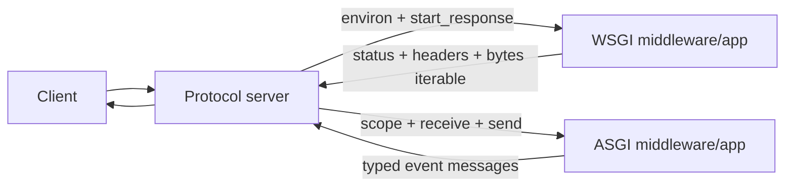

<TLDR>
  <TLDRCell label="what">
    <Term id="wsgi">WSGI</Term> 是同步 HTTP 调用契约；<Term id="asgi">ASGI</Term> 是按连接调用异步应用、通过事件收发数据的协议族。
  </TLDRCell>
  <TLDRCell label="trap">
    把入口写成 `async def` 不会让同步数据库驱动或文件 I/O 自动变成非阻塞操作，ASGI 也不会让 WSGI 应用获得 WebSocket 能力。
  </TLDRCell>
  <TLDRCell label="fix">
    先按应用签名、所需协议和依赖库选择接口，再逐项验证请求体分片、响应顺序、断开连接、生命周期和同步／异步边界。
  </TLDRCell>
</TLDR>

## 是什么，为什么存在

WSGI（Web Server Gateway Interface）与 ASGI（Asynchronous Server Gateway Interface）规定 Python Web 服务器怎样调用应用。它们不是服务器，也不是框架；它们是双方都能实现的边界契约。服务器负责 HTTP 解析、套接字和进程管理，框架则在这条边界内完成路由与业务处理。

WSGI 面向同步 HTTP。服务器为每个请求调用 `application(environ, start_response)`，应用调用 `start_response()` 提交状态与响应头，再返回一个产生 `bytes` 的可迭代对象。PEP 3333 的目标是让服务器与框架可以独立选择，而不是给业务开发者提供新的高级 Web API。

ASGI 把边界扩展为 `async application(scope, receive, send)`。`scope` 描述一条连接，`receive()` 提供入站事件，`send()` 提交出站事件。不同子协议定义各自的 scope 与消息，因此同一种应用接口可以承载 HTTP、WebSocket 和 lifespan。

两者的差异不等于「旧而慢」和「新而快」。WSGI 很适合同步框架与短 HTTP 请求；ASGI 适合需要 WebSocket、长轮询、流式请求或大量并发等待的应用。CPU 工作不会因为 ASGI 自动提速，同步依赖也不会因为被 `async def` 包裹就停止阻塞。

你通常在部署入口、框架适配器、中间件和故障堆栈里遇到这两个名称。选择时先看应用暴露哪种 callable，再看服务器、反向代理和客户端链路是否支持需要的协议，不要只看产品名称。

| 维度 | WSGI | ASGI |
| --- | --- | --- |
| 应用签名 | `application(environ, start_response)` | `async application(scope, receive, send)` |
| 入站数据 | `environ` 与 `wsgi.input` | `scope` 与 `receive()` 事件 |
| 出站数据 | `start_response()` 与 `Iterable[bytes]` | `send()` 事件 |
| 连接模型 | 一次调用对应一个 HTTP 请求 | 一次调用对应协议定义的一条连接 |
| 典型能力 | 同步 HTTP | HTTP、WebSocket、lifespan |

## 工作原理

网络上的 HTTP 字节不会直接进入业务函数。服务器先把请求转换成 WSGI 环境或 ASGI 消息，应用再返回协议规定的数据。中间件同时扮演内侧应用的服务器和外侧服务器的应用，因此它必须保持两边的契约。



### WSGI 的一次调用

`environ` 是内置 `dict`，包含 CGI 风格字段和 `wsgi.input` 等 WSGI 字段。元数据与响应状态、响应头使用受规范约束的 `str`；请求体和响应体使用字节。应用可以只读取所需字段，但不能假定所有可选字段都存在。

`start_response(status, headers)` 设置响应状态和头部，应用返回的可迭代对象随后产生零个或多个字节块。服务器在请求正常结束、迭代报错或客户端提前断开时，都必须调用结果对象的 `close()`（若存在）。应用也不能假定迭代器一定会被完全消费。

WSGI 本身没有规定服务器要使用进程、线程还是其他调度方式。同步 callable 会占用执行它的 worker，等待期间能否处理其他请求取决于服务器与 worker 模型。接口契约和并发部署是两个不同问题。

### ASGI 的 scope 与事件

ASGI 服务器按连接调用应用一次。对 HTTP 而言，这条 scope 对应一个请求，即使底层 HTTP/2 连接复用多个流；对 WebSocket 而言，它持续到套接字关闭。请求体不在 HTTP scope 中，而是通过一个或多个 `http.request` 事件到达。

每个事件都是带有顶层 `type` 字段的 `dict`。应用必须遵守子协议的顺序，例如先发送一次 `http.response.start`，再发送一个或多个 `http.response.body`；最后一个 body 事件把 `more_body` 设为 `False` 或省略它。WebSocket 与 lifespan 使用不同的事件集合。

`receive()` 和 `send()` 都是可等待 callable。等待 `receive()` 让出执行权，直到有新事件；等待 `send()` 让服务器有机会把数据送入发送缓冲区并施加<Term id="backpressure">背压（backpressure）</Term>。它不表示远端客户端已经收到数据。

### 边界上的所有权

WSGI 应用拉取 `wsgi.input` 并由服务器拉取响应迭代器；ASGI 应用等待入站事件并主动发送出站事件。这个方向差异决定了中间件怎样缓存、流式转发和清理资源。把两种签名机械拼接起来不会构成正确适配器。

| 阶段 | WSGI 责任 | ASGI 责任 |
| --- | --- | --- |
| 请求元数据 | 服务器构造 `environ` | 服务器构造 `scope` |
| 请求体 | 应用从文件式对象读取 | 应用重复等待 `http.request` |
| 响应开始 | 应用调用 `start_response()` | 应用发送 `http.response.start` |
| 响应流 | 服务器逐块迭代 | 应用逐次等待 `send()` |
| 提前结束 | 服务器关闭响应迭代器 | 应用处理取消、断开或 `send()` 异常 |

### 能力需要整条链路支持

ASGI HTTP 子协议可以表示 HTTP/1.0、HTTP/1.1 与 HTTP/2，但部署是否真正启用某个版本由服务器和上游链路决定。WebSocket 也需要服务器与反向代理正确处理握手和连接升级。看到 ASGI 入口只能证明应用边界，不能证明生产路径已经具备所有协议能力。

WSGI 应用可以通过适配器运行在 ASGI 服务器后面。规范要求同步 WSGI callable 在线程池中执行，这保留了 HTTP 兼容性，却不会给应用添加 WebSocket 或原生异步流处理。适配层还要负责字符串、字节、请求体和线程敏感资源的转换。

## 示例

下面四个程序直接驱动 callable，不打开端口，也不依赖第三方框架。它们依次展示 WSGI 往返、ASGI 分片消息、lifespan 和同步 I/O 隔离；输出来自本地 `python3` 实际运行。

### 最小 WSGI 往返

这个小型驱动器提供应用实际读取的环境字段，并捕获 `start_response()`。`finally` 中的 `close()` 模拟服务器即使提前结束也要履行的清理责任。

<Depth level="quick">

```python run title="wsgi_roundtrip.py"
from io import BytesIO
from urllib.parse import parse_qs

def application(environ, start_response):
    query = parse_qs(environ.get("QUERY_STRING", ""))
    name = query.get("name", ["world"])[0]
    body = f"Hello, {name}!".encode()
    headers = [
        ("Content-Type", "text/plain; charset=utf-8"),
        ("Content-Length", str(len(body))),
    ]
    start_response("200 OK", headers)
    return [body]

environ = {
    "REQUEST_METHOD": "GET",
    "PATH_INFO": "/hello",
    "QUERY_STRING": "name=Ada",
    "CONTENT_LENGTH": "0",
    "wsgi.input": BytesIO(b""),
}
captured = {}

def start_response(status, headers):
    captured.update(status=status, headers=headers)
    return lambda data: None

result = application(environ, start_response)
try:
    body = b"".join(result)
finally:
    if hasattr(result, "close"):
        result.close()

print(captured["status"])
print(dict(captured["headers"])["Content-Type"])
print(body.decode())
```

```text
200 OK
text/plain; charset=utf-8
Hello, Ada!
```

<TryToBreak items={['删除 QUERY_STRING', '把 name 设为空字符串', '让响应迭代器在第二块抛出异常']} />

</Depth>

真实服务器会补齐 PEP 3333 要求的环境字段，并把返回字节写入网络。这个驱动器只验证应用与接口的交互，不验证 HTTP 解析、代理头或套接字行为。框架测试客户端与这种进程内驱动器有同样的边界限制。

### 处理 ASGI 请求分片

ASGI 请求体可以跨多个 `http.request` 事件到达。应用持续读取到 `more_body` 为假，再用两个 body 事件生成一个逻辑响应。

```python run title="asgi_roundtrip.py"
import asyncio

async def application(scope, receive, send):
    assert scope["type"] == "http"
    body = bytearray()
    while True:
        message = await receive()
        if message["type"] == "http.disconnect":
            return
        body.extend(message.get("body", b""))
        if not message.get("more_body", False):
            break

    await send({"type": "http.response.start", "status": 201,
                "headers": [(b"content-type", b"text/plain")]})
    await send({"type": "http.response.body", "body": b"received=",
                "more_body": True})
    await send({"type": "http.response.body",
                "body": str(len(body)).encode(), "more_body": False})

incoming = iter([
    {"type": "http.request", "body": b"abc", "more_body": True},
    {"type": "http.request", "body": b"def", "more_body": False},
])
sent = []

async def receive():
    return next(incoming)

async def send(message):
    sent.append(message)

scope = {"type": "http", "method": "POST", "path": "/upload"}
asyncio.run(application(scope, receive, send))

for message in sent:
    if message["type"] == "http.response.start":
        print("start", message["status"], message["headers"])
    else:
        print("body", repr(message["body"]), message["more_body"])
```

```text
start 201 [(b'content-type', b'text/plain')]
body b'received=' True
body b'6' False
```

两个输入片段合计六个字节，两个输出片段通过 `more_body` 组成一个响应。生产代码不能无限累加请求体；应在每次扩展缓冲区前后检查累计大小，超过限制就停止读取并按框架或服务器约定结束请求。

这个测试还没有模拟 `send()` 异常或任务取消。长轮询与流式响应需要分别测试「断开发生在下一次 `receive()`」和「`send()` 先抛出 `OSError`」两条路径，因为并发下两者顺序不固定。

### 驱动 lifespan

lifespan 在处理请求的事件循环中完成资源初始化与关闭。示例把共享状态写入 `scope["state"]`，并明确确认 startup 与 shutdown。

```python run title="asgi_lifespan.py"
import asyncio


async def application(scope, receive, send):
    assert scope["type"] == "lifespan"
    state = scope["state"]

    while True:
        message = await receive()
        if message["type"] == "lifespan.startup":
            state["catalog"] = "ready"
            await send({"type": "lifespan.startup.complete"})
        elif message["type"] == "lifespan.shutdown":
            state["catalog"] = "closed"
            await send({"type": "lifespan.shutdown.complete"})
            return


incoming = iter([
    {"type": "lifespan.startup"},
    {"type": "lifespan.shutdown"},
])
sent = []


async def receive():
    return next(incoming)


async def send(message):
    sent.append(message)


scope = {"type": "lifespan", "state": {}}
asyncio.run(application(scope, receive, send))

for message in sent:
    print(message["type"])
print(scope["state"]["catalog"])
```

```text
lifespan.startup.complete
lifespan.shutdown.complete
closed
```

支持 lifespan state 的服务器会把这个命名空间浅复制给后续请求 scope。实际资源通常是连接池或客户端对象，而不是字符串。多进程服务器会在每个进程的事件循环中执行 lifespan，所以初始化代码必须允许每个 worker 拥有自己的资源。

### 隔离同步 I/O

已有同步客户端暂时无法替换时，可用 `asyncio.to_thread()` 把阻塞 I/O 移出事件循环线程。下面只验证调用与返回值，不用时间差冒充性能基准。

```python run title="thread_boundary.py"
import asyncio
import time


def read_legacy_record(record_id):
    time.sleep(0.01)
    return {"id": record_id, "state": "paid"}


async def heartbeat():
    await asyncio.sleep(0)
    return "loop stayed runnable"


async def main():
    record, pulse = await asyncio.gather(
        asyncio.to_thread(read_legacy_record, 7),
        heartbeat(),
    )
    print(pulse)
    print(record)


asyncio.run(main())
```

```text
loop stayed runnable
{'id': 7, 'state': 'paid'}
```

`to_thread()` 主要用于否则会阻塞事件循环的 I/O 函数。它不是把任意 CPU 工作变快的开关，也不会自动让底层调用响应协程取消。线程池容量、连接池容量、超时和关闭行为仍需一起设计。

## 陷阱

### 把 `async def` 当成非阻塞保证

> [!PITFALL]
> 生成的 ASGI 路由常在协程里直接调用同步 ORM、`time.sleep()`、文件 API 或阻塞式 HTTP 客户端。调用期间事件循环线程不能处理同一循环上的其他任务。

**修复方法：** 优先使用真正的异步库；暂时保留 I/O 型同步函数时，通过框架提供的同步边界或 `asyncio.to_thread()` 隔离，并测试超时、取消与线程池耗尽。CPU 密集工作应使用适合它的进程或任务系统。

### 假定请求体已经完整

> [!PITFALL]
> WSGI 的 `wsgi.input` 是流，中间件读取后不会自动为内层应用回放；ASGI 请求体还可能分成多个 `http.request`。忽略流的所有权或只调用一次 `receive()`，会让后续代码看到空数据或截断数据。

**修复方法：** WSGI 按已验证的 `CONTENT_LENGTH` 或框架 API 读取；ASGI 循环处理 `more_body`，同时累计并强制大小上限。不要为了方便而把未知大小的请求完整读入内存。

### 把响应头转换成字典

> [!PITFALL]
> ASGI 使用字节二元组列表并保留重复响应头。中间件若执行 `dict(headers)`，多个 `set-cookie` 等同名字段会被覆盖；把 WSGI 的 `str` 头与 ASGI 的 `bytes` 头混用也会违反接口。

**修复方法：** 把头部当作有序的二元组序列，按协议要求追加、替换或删除单个字段。为重复头、非 ASCII 路径以及空响应体增加边界测试，不要只测普通 JSON 响应。

### 破坏响应顺序与清理

> [!PITFALL]
> WSGI 中间件可能在 `start_response()` 前产出非空字节，或忘记转发响应迭代器的 `close()`。ASGI 中间件则可能发送两次 `http.response.start`，遗漏最后的 `more_body: False`，或吞掉断开异常。

**修复方法：** 用状态机测试合法事件序列，并在 `finally` 中释放由请求拥有的资源。分别覆盖正常完成、应用异常、客户端断开和服务器取消，不要把其中一种路径当作其余路径的证明。

### 把适配器当成能力升级

> [!PITFALL]
> WSGI-to-ASGI 适配器可以让同步 HTTP 应用挂到 ASGI 服务器，却不能给它增加 WebSocket、异步请求流或非阻塞依赖。反向适配也无法把一条长连接压成 WSGI 的单次同步 HTTP 调用而不损失语义。

**修复方法：** 写清需要保留的子协议、流式行为、线程亲和性、上下文传播和取消语义。只在这个交集内使用适配器，并用真实服务器路径验证代理、超时与断开连接。

### 在错误的生命周期共享资源

> [!PITFALL]
> 在模块导入时创建异步连接池，可能让资源被 fork 到多个 worker，或在创建它的事件循环之外使用。相反，每个请求新建客户端又会丢失连接复用，并放大建立连接的成本。

**修复方法：** 在 ASGI lifespan 中按事件循环创建并关闭资源，通过 request scope state 或框架等价机制访问。明确检查单进程、多 worker、重载和启动失败路径；WSGI 资源则应遵守所选进程与线程模型的生命周期钩子。

<Depth level="deep">

## 流式传输、断开与背压

WSGI 的响应流是服务器拉取的。PEP 3333 要求服务器完成一个非空字节块的传输后再向迭代器请求下一块，因此应用可以通过合理分块限制自身缓冲。不过网络服务器仍可能有自己的缓冲，`yield` 一次不等于远端立即看到一块数据。

响应迭代器可能没有走到结尾。客户端关闭连接、应用在后续块报错或服务器停止请求时，服务器会调用其 `close()`。生成器中的 `finally` 可以释放与迭代生命周期绑定的资源，但数据库事务或文件仍应尽量用明确的上下文管理表达所有权。

ASGI 的响应流由应用主动发送。`await send()` 返回意味着协议服务器已处理该消息并把正文刷新到发送缓冲区，不保证客户端已经读取。应用只有在还有正文时才把 `more_body` 设为 `True`；最后一个正文事件结束响应，之后继续发送会被忽略或报错。

ASGI 的断开通知存在竞态。长响应可能先从 `send()` 得到 `OSError`，也可能在下一次 `receive()` 看到 `http.disconnect`。清理逻辑必须允许任一路径先发生，并且能够重复调用而不破坏状态。

请求侧也需要背压与上限。应用每次等待 `receive()` 后，应在解析前检查累计字节数、内容类型和剩余配额。先把整个未知请求拼进 `bytes`，最后才检查大小，会让限制失去保护内存的作用。

| 风险 | WSGI 观察点 | ASGI 观察点 |
| --- | --- | --- |
| 截断请求 | `wsgi.input` 读取长度 | `more_body` 循环 |
| 无界内存 | 全量 `read()` | 累加所有 request 事件 |
| 响应未结束 | 迭代器未完成且未关闭 | 始终发送 `more_body: True` |
| 客户端断开 | 迭代停止与 `close()` | `http.disconnect` 或 `send()` 异常 |
| 头部丢失 | 错误重写 tuple 列表 | 把重复字节头折叠为 dict |

## 兼容层与生命周期

ASGI 的 HTTP 设计保留了到 WSGI 的映射，但两种接口并不等价。适配器要把 ASGI 请求事件转换成文件式输入，把同步可迭代响应转换成异步发送事件，并在线程池运行 WSGI 应用。这个边界只覆盖 HTTP 可表达的交集。

线程池带来容量与取消问题。大量慢同步调用会占满线程，使新请求即使处在事件循环中也只能等待。取消等待适配器的协程不保证底层线程函数立刻停止，因此超时、幂等性和资源回收必须由被调用系统共同支持。

跨边界的上下文也要验证。Python 3.14 的 `asyncio.to_thread()` 会传播当前 `contextvars.Context`，但第三方框架的线程敏感资源可能还有更严格的要求。不要用裸 `to_thread()` 绕过框架明确提供的数据库或事务适配器。

lifespan 解决的是事件循环内资源所有权。规范要求每个处理请求的事件循环执行一次 lifespan；多进程部署因此会初始化多份连接池。容量规划要用「每 worker 的池大小 × worker 数」检查数据库或下游服务的总连接上限。

支持 lifespan state 时，服务器把 state 命名空间浅复制到请求 scope。复制的是字典结构，不是池对象本身，因此请求看到的是同一个资源引用。中间件添加键时应使用不会冲突的名称，并对不提供 `state` 的服务器或测试驱动器作出明确处理。

启动失败不能伪装成启动完成。若资源无法初始化，应用应发送 `lifespan.startup.failed` 及可诊断消息；服务器随后记录并退出。捕获异常后仍发送 `.complete` 会让请求落到半初始化的应用上。

选择接口时，先写不可丢失的能力。只有同步 HTTP 且依赖均为同步时，WSGI 的边界更直接；需要 WebSocket、长连接或原生异步流时，使用 ASGI。已有 WSGI 应用可以先适配再迁移，但迁移完成的证据是阻塞边界和协议测试，而不是入口文件改名。

</Depth>

<Checkpoint id="backend/wsgi-asgi" />

## 延伸阅读

- [PEP 3333：Python Web Server Gateway Interface v1.0.1](https://peps.python.org/pep-3333/)
- [ASGI 3.0：主规范](https://asgi.readthedocs.io/en/stable/specs/main.html)
- [ASGI 3.0：HTTP 与 WebSocket 消息格式](https://asgi.readthedocs.io/en/stable/specs/www.html)
- [ASGI 3.0：lifespan 协议](https://asgi.readthedocs.io/en/stable/specs/lifespan.html)
- [Python 3.14 `asyncio`：在线程中运行阻塞函数](https://docs.python.org/3.14/library/asyncio-task.html#running-in-threads)
