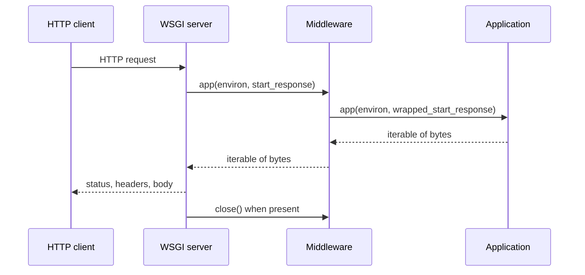

<TLDR>
  <TLDRCell label="what">
    <Term id="wsgi">WSGI, the Web Server Gateway Interface</Term>, is the protocol between synchronous Python web servers and applications: the server calls the application, which returns a response made of byte chunks.
  </TLDRCell>
  <TLDRCell label="trap">
    WSGI is a synchronous calling protocol, not a single-threaded server model. Common contract bugs return `str`, read `wsgi.input` without a bound, or lose `close()` and `exc_info` in middleware.
  </TLDRCell>
  <TLDRCell label="fix">
    Treat `environ`, `start_response()`, and the response iterable as one lifecycle, then test the boundary with `wsgiref.validate` and the real server.
  </TLDRCell>
</TLDR>

## What it is and why it exists

WSGI is the Python Web Server Gateway Interface defined by PEP 3333. It specifies how a web server represents an HTTP request as Python data, calls an application, and receives a status, response headers, and body. Frameworks and servers can depend on that shared protocol, so a Flask or Django application doesn't need a custom adapter for every WSGI server.

WSGI solves in-process interface compatibility; it isn't a complete HTTP server specification. The server owns sockets, HTTP parsing, connection management, and client disconnects, while the application owns routing, domain logic, and response content. Reverse proxies, TLS, worker counts, and deployment topology also sit outside the WSGI contract.

You encounter WSGI in framework application objects, server startup targets, and middleware. A server typically imports an object named like `module:application` and calls it for each request. Middleware accepts the server's call and then acts as a server to the next application, so components compose through the same interface.

WSGI describes a synchronous call: an ordinary callable must complete one request in its current execution context. It neither requires the server to use only one thread or process nor guarantees that global state is safe. A server can execute several independent WSGI calls concurrently with processes, threads, or another implementation strategy.

Long-lived connections, WebSockets, and native asynchronous send and receive operations aren't WSGI's target. Compare ASGI when you need those capabilities, but mechanically changing a mature synchronous application to `async def` doesn't automatically increase capacity. Choose from protocol requirements, dependencies, and measured waiting time rather than a framework label.

## How it works

One request revolves around three objects: the server supplies `environ` and `start_response`, and the application returns an <Term id="iterable">iterable</Term>. `environ` describes the request and server capabilities, `start_response()` submits the status and headers, and the iterable supplies the body in chunks. Together they make the protocol; checking only the function signature isn't enough.



The returns in the diagram don't imply that the application has produced the whole body. It can return a list or a generator that runs later and yields chunks. The server obtains the body as it iterates and calls `close()` when the result provides that method.

### The application callable

A minimal application has the shape `application(environ, start_response)`. It computes the status and headers, calls `start_response()` before making the first body chunk available, and returns an iterable. Every item yielded by the iterable must be `bytes`, apart from an empty response that yields no items.

In `start_response(status, response_headers, exc_info=None)`, `status` is a string such as `"200 OK"`. The headers are a list of string `(name, value)` pairs. The third argument is only for an application trying to replace unsent headers while handling an exception; an ordinary success path shouldn't pass it.

`start_response()` returns the legacy `write()` callable for compatibility with an early push style. New code should return a body iterable instead of relying on `write()`. Mixing both body paths makes ordering, streaming, and error handling harder to reason about.

### Requests in `environ`

<Term id="wsgi-environ">WSGI environ</Term> is an ordinary dictionary whose keys and values follow protocol rules. CGI-style keys describe the HTTP request, `wsgi.*` keys describe the protocol and server capabilities, and servers or middleware may add collision-resistant extension keys. An application shouldn't assume that every HTTP request header has a corresponding key.

| Key | Meaning | Application-side concern |
| --- | --- | --- |
| `REQUEST_METHOD` | HTTP method | Don't change case and then guess at semantics |
| `SCRIPT_NAME` | Application mount path | Preserve it when building the application's own URLs |
| `PATH_INFO` | Path after the mount point | It isn't the original URL bytes |
| `QUERY_STRING` | Query string without `?` | It may be empty and stays separate from the path |
| `CONTENT_TYPE` | Request body media type | Don't look for `HTTP_CONTENT_TYPE` |
| `CONTENT_LENGTH` | Declared body length | It may be absent or empty; validate before parsing |
| `wsgi.input` | Binary input stream | Read a controlled length, not an unbounded `read()` |
| `wsgi.errors` | Text error stream | Use it for diagnostics, not as the HTTP body |
| `wsgi.multithread` | Whether same-process threaded calls may occur | A true value forbids assuming threads never interleave |
| `wsgi.multiprocess` | Whether multiprocess calls may occur | A true value means process memory isn't globally consistent |

Except for `CONTENT_TYPE` and `CONTENT_LENGTH`, request headers normally become uppercase, replace hyphens with underscores, and gain an `HTTP_` prefix. For example, `X-Request-ID` maps to `HTTP_X_REQUEST_ID`. This is the server's normalized view, not proof of trust: a public client can forge a header unless a trusted proxy explicitly strips and replaces it.

The application reads a request body from `wsgi.input`; it doesn't receive an already parsed object in `environ`. It should validate `CONTENT_LENGTH` and its own size limit before reading the permitted bytes. Media type handling, character decoding, and structural parsing such as JSON belong to the application or framework.

### Status, headers, and body

The status and response headers must reach `start_response()` before the first body chunk can be sent by the server. An application can't generate hop-by-hop response headers such as `Connection` or `Transfer-Encoding`, because the server manages the current HTTP connection. It may set `Content-Length` when the byte count is known exactly, never by guessing from a character count.

The body's byte boundary matters. The application encodes text as `bytes` with a selected encoding, then calculates `Content-Length` from those bytes. Returning a Python `str` violates the protocol even when it contains only ASCII, and a validator or server should reject it.

The server must handle chunks in iterable order and complete each chunk's transmission before requesting the next one. WSGI doesn't promise that each `yield` becomes one network packet or that a proxy immediately passes it to the client. An application can produce data incrementally, but end-to-end buffering still needs verification in the real deployment path.

### The middleware chain

<Term id="middleware">Middleware</Term> wraps another WSGI application while presenting the same protocol to its caller. It can change `environ`, wrap `start_response()` to observe status or headers, or wrap the returned iterable. Authentication, tracing, exception mapping, and security headers often live at this layer.

Transparent middleware must preserve protocol details it doesn't change. If it consumes a downstream iterable, it must preserve body order and ensure the downstream `close()` is called; if it wraps `start_response()`, it must accept and forward `exc_info`. Collecting the entire response in memory just to log a status code silently breaks streaming.

Middleware order changes behavior. Exception middleware outside authentication can translate failures from the authentication layer; placed inside, it never sees them. Test ordering as part of the architecture rather than checking every middleware unit only in isolation.

### Concurrency is declared by the server

`wsgi.multithread`, `wsgi.multiprocess`, and `wsgi.run_once` are booleans that describe the execution environment, not configuration commands from the application to the server. An application can use them to judge whether an optimization is safe, but correctness is usually more robust when it doesn't depend on one worker model. Database pools, caches, and locks need scopes that match the actual process and thread boundaries.

A synchronous protocol means one call can't yield control to an ASGI-style event loop while it waits. The server can still let other threads or processes serve other requests. It is therefore wrong to derive "WSGI handles only one request at a time" from "WSGI is synchronous."

## Examples

The three examples use only the Python standard library. Their output comes from running each file with the local `python3`; the protocol they use was checked against the Python 3.14 documentation and PEP 3333.

### A minimal application with protocol validation

The first application reads a method, path, and query string and returns an already encoded body list. A small invoker builds a base environment with `setup_testing_defaults()` and lets `wsgiref.validate.validator()` check WSGI assertions on both sides.

<Depth level="quick">

```python run title="minimal_wsgi.py"
from wsgiref.util import setup_testing_defaults
from wsgiref.validate import validator


def application(environ, start_response):
    query = environ.get("QUERY_STRING", "")
    suffix = f"?{query}" if query else ""
    body = f"{environ['REQUEST_METHOD']} {environ['PATH_INFO']}{suffix}".encode()
    headers = [
        ("Content-Type", "text/plain; charset=utf-8"),
        ("Content-Length", str(len(body))),
    ]
    start_response("200 OK", headers)
    return [body]


def invoke(path, query):
    environ = {}
    setup_testing_defaults(environ)
    environ.update(PATH_INFO=path, QUERY_STRING=query)
    captured = {}

    def start_response(status, headers, exc_info=None):
        captured.update(status=status, headers=headers)
        return lambda data: None

    result = validator(application)(environ, start_response)
    try:
        body = b"".join(result)
    finally:
        if hasattr(result, "close"):
            result.close()
    return captured["status"], captured["headers"], body


status, headers, body = invoke("/orders", "limit=2")
print(status)
print(f"{headers[0][0]}: {headers[0][1]}")
print(f"{headers[1][0]}: {headers[1][1]}")
print(body.decode())
```

```text
200 OK
Content-Type: text/plain; charset=utf-8
Content-Length: 19
GET /orders?limit=2
```

</Depth>

The invoker also fulfills server-side duties: it records status and headers, consumes the body, and calls `close()` when available. `validator()` belongs in development and tests. It is middleware that checks protocol assertions, not a production security boundary or a proof that the domain logic is correct.

This example returns the whole body at once, so it can set an exact `Content-Length`. `len(body)` counts bytes. Calling `len()` on the Unicode string first would give a different result when it contains non-ASCII characters.

### Reading a bounded JSON body

The second application separates the transport boundary from the parsing boundary. It converts `CONTENT_LENGTH` to an integer and applies a 64-byte limit, reads exactly that permitted length from `wsgi.input`, and only then parses JSON.

```python run title="json_body.py"
from io import BytesIO
import json

MAX_BODY = 64

def respond(start_response, status, payload):
    body = json.dumps(payload, separators=(",", ":")).encode()
    start_response(status, [("Content-Type", "application/json"),
                            ("Content-Length", str(len(body)))])
    return [body]


def application(environ, start_response):
    raw_length = environ.get("CONTENT_LENGTH", "")
    try:
        length = int(raw_length or "0")
    except ValueError:
        return respond(start_response, "400 Bad Request", {"error": "bad length"})
    if length < 0 or length > MAX_BODY:
        return respond(start_response, "413 Content Too Large", {"error": "too large"})
    try:
        document = json.loads(environ["wsgi.input"].read(length))
    except (UnicodeDecodeError, json.JSONDecodeError):
        return respond(start_response, "400 Bad Request", {"error": "bad json"})
    return respond(start_response, "200 OK", {"received": document})

def invoke(payload):
    environ = {"CONTENT_LENGTH": str(len(payload)), "wsgi.input": BytesIO(payload)}
    captured = []

    def start_response(status, headers, exc_info=None):
        captured.append(status)
        return lambda data: None

    body = b"".join(application(environ, start_response))
    return captured[0], body.decode()


print(*invoke(b'{"order_id":7}'), sep="\n")
print(*invoke(b"x" * 65), sep="\n")
```

```text
200 OK
{"received":{"order_id":7}}
413 Content Too Large
{"error":"too large"}
```

<TryToBreak items={['a missing or empty CONTENT_LENGTH', 'a declared length shorter than the body', 'invalid UTF-8 or JSON', 'a body of exactly 64 bytes']} />

The 64-byte number is an explicit test boundary for this runnable example, not a production recommendation. A real service should derive its limit from the endpoint, media type, and infrastructure constraints, then test server behavior when the declared length and actual transfer disagree.

This small application doesn't enforce a media type or distinguish an empty body from a JSON parsing error. Frameworks normally provide fuller request objects and error mapping, but the same byte count, input stream, and resource limit remain underneath.

### Middleware that preserves streaming

The third example wraps `start_response()` to log the method, path, and final status, then adds a security response header. The middleware returns the downstream generator directly instead of collecting the body into a list.

```python run title="streaming_middleware.py"
class SecurityHeaderMiddleware:
    def __init__(self, app):
        self.app = app

    def __call__(self, environ, start_response):
        method = environ["REQUEST_METHOD"]
        path = environ["PATH_INFO"]

        def add_header(status, headers, exc_info=None):
            print(f"{method} {path} -> {status.split()[0]}")
            updated = [*headers, ("X-Content-Type-Options", "nosniff")]
            return start_response(status, updated, exc_info)

        return self.app(environ, add_header)


def application(environ, start_response):
    start_response("200 OK", [("Content-Type", "text/plain")])
    yield b"part-1"
    yield b"|part-2"


captured = {}


def start_response(status, headers, exc_info=None):
    captured.update(status=status, headers=headers)
    return lambda data: None


wrapped = SecurityHeaderMiddleware(application)
result = wrapped({"REQUEST_METHOD": "GET", "PATH_INFO": "/report"}, start_response)
try:
    body = b"".join(result)
finally:
    result.close()

print(captured["headers"][-1])
print(body.decode())
```

```text
GET /report -> 200
('X-Content-Type-Options', 'nosniff')
part-1|part-2
```

Because `application()` is a generator function, its body doesn't run until the server begins iteration, so the log also appears then. The middleware doesn't consume the result itself, leaving iteration and closure owned by the outer server.

If middleware needs to change the body, it must return its own wrapping iterable and close the downstream result from that wrapper's `close()`. A generator's `finally` can clean up resources that generator has acquired; it doesn't replace explicit forwarding of the downstream lifecycle.

## Pitfalls

### Mistaking synchronous for single-threaded

> [!PITFALL]
> "WSGI can handle only one request at a time" confuses the application call model with the server concurrency model. Several processes or threads may call one application object at once, so process globals may be modified concurrently or exist as separate copies in different processes.

**Fix:** inspect the real server configuration and `wsgi.multithread` and `wsgi.multiprocess`, then design state for those boundaries. Put cross-request data in external storage with an explicit consistency contract, and document the per-process scope of in-memory caches and connection pools.

### Returning text instead of bytes

> [!PITFALL]
> Generated code often returns `["ok"]` or makes a generator `yield` a string. Python's ability to iterate those objects doesn't make them valid WSGI; response body items must be `bytes`.

**Fix:** choose a character encoding and call `.encode()` explicitly. Declare that encoding in `Content-Type`, calculate `Content-Length` from the encoded bytes, and use `wsgiref.validate` in tests to catch type violations.

### Reading the input stream without a bound

> [!PITFALL]
> Calling `read()` without an argument on `wsgi.input` may wait for the client to finish sending or load an attacker-controlled body entirely into memory. Trusting `CONTENT_LENGTH` without an application limit also leaves resource use uncontrolled.

**Fix:** validate missing, empty, negative, and nonnumeric lengths before applying an endpoint-specific byte limit. For a streaming upload, read bounded chunks, set compatible limits in the server or proxy, and handle an early client disconnect.

### Breaking the lifecycle in middleware

> [!PITFALL]
> Middleware that logs or modifies a response may call `list(result)`, buffering the whole response, and forget to call the downstream result's `close()`. Another common bug defines a wrapper with only two parameters, so an exception path that passes `exc_info` fails.

**Fix:** return the downstream iterable directly when the body is unchanged. When changing it, implement a wrapper that forwards order, exceptions, and `close()`. Preserve and pass through the third `start_response` argument, then test a generator response and an exception during iteration.

### Trusting normalized request headers

> [!PITFALL]
> `HTTP_X_USER`, `HTTP_X_FORWARDED_FOR`, and similar keys are only WSGI representations of request headers. Treating them as an authenticated identity or true source address crosses a trust boundary when a public client can supply them directly.

**Fix:** trust only headers that a known proxy strips and rewrites, and constrain the trusted proxy path. Derive identity from a verified authentication mechanism. For auditing, log both the direct peer and the client address produced by the explicit proxy policy.

### Replacing an error response after sending begins

> [!PITFALL]
> An application that fails after part of the body has been sent can't reliably change the status to `500 Internal Server Error`. An error handler that calls `start_response()` again without `exc_info` also violates the repeated-call rule.

**Fix:** finish failure-prone validation and authorization before committing response headers. After an exception, use `exc_info` so the server can enforce its already-sent decision, and accept that a committed response can only be terminated and cleaned up rather than replaced with a complete new response.

## In the AI era

**What generated code gets wrong here**

Models mix ASGI's `async def app(scope, receive, send)` with WSGI's two-argument interface, or generate an `async def` WSGI application that returns a coroutine. They also put JSON strings directly in response lists, read `wsgi.input` without a bound, derive `Content-Length` from characters, and keep per-request status in instance fields. Generated middleware is especially prone to buffering a generator, dropping `close()`, or losing the `exc_info` argument to `start_response()`.

**Ask your AI to check**

- List the server's and application's responsibilities at the `environ`, `start_response()`, body iteration, and `close()` stages.
- For every read from `wsgi.input`, state the length source, byte limit, early-EOF behavior, and client-disconnect behavior.
- Trace whether middleware preserves byte-chunk order, `exc_info`, `close()`, and streaming, and identify all mutable state shared across requests.

**Review checklist**

- Run success, empty-body, error, and generator responses through `wsgiref.validate`, confirming every body item is `bytes`.
- Inspect ownership of globals, instance fields, caches, and connections under multithreaded and multiprocess server settings.
- Exercise slow and oversized requests for body limits, then fail during iteration to verify cleanup after response commitment.

**Prompt vocabulary**

Use the exact terms `WSGI application callable`, `environ mapping`, `start_response callable`, `response iterable`, `bytes chunks`, `exc_info propagation`, `iterable close propagation`, and `hop-by-hop headers`. Ask for a protocol responsibility table and response-lifecycle trace; "write a Python web handler" doesn't constrain the interface.

<Depth level="deep">

## WSGI contract boundaries

### The iterable timeline

Calling the application and consuming its result are separate phases. An ordinary function can call `start_response()` before returning a list, while a generator function normally doesn't execute its body until its first iteration. The server must therefore allow status and headers to arrive after the application returns, but it must receive them before handling the first body chunk.

The server can't assume that an iterable has a length or consume the whole result early to calculate `Content-Length`. The specification allows it to infer a length only when the result has exactly one item and the server can determine that reliably; if the application set the header, the server must respect the validated value. For a general generator, the server and HTTP version decide whether to use chunked transfer or close the connection.

Each nonempty body chunk should be handled promptly, and the server can't arbitrarily wait for later chunks before processing it. That requirement covers buffering between the WSGI application and server only. A reverse proxy, compression layer, TLS stack, or client library can buffer again, so latency-sensitive streaming requires an end-to-end measurement.

If the returned object provides `close()`, the server must call it whether the request completes normally or terminates early. Middleware that substitutes its own object for the downstream result takes responsibility for forwarding that closure. Closing releases generator `finally` blocks, file handles, and other iteration-time resources without relying on garbage-collection timing.

### `start_response()` and exception replacement

An application normally calls `start_response()` once. If it catches an exception and wants to replace headers that haven't been sent, it can call again with the current `sys.exc_info()`. A server may accept the new status and headers if nothing has been sent; if headers are already out, it must re-raise the original exception.

This mechanism can't retract bytes that have reached the client. Error middleware must treat "not committed" and "already committed" as separate states. The first can become a complete error response; the second can only clean up, record the failure, and terminate the connection or stream. Pretending both states can always become a JSON error produces responses whose status and body contradict each other.

The server reads the header list passed to `start_response()` as application data, but middleware should still avoid mutating a list held by downstream code. Building a new list limits aliasing surprises and makes duplicate-header handling explicit. Headers that allow repetition, such as `Set-Cookie`, must not be flattened into a dictionary.

Hop-by-hop headers describe one transport connection, while a WSGI application sits above connection management. Applications and middleware must not generate `Connection`, `Keep-Alive`, `Transfer-Encoding`, `TE`, `Trailer`, or `Upgrade`. The server needs exclusive control over those fields to adapt correctly to HTTP versions, proxies, and connection reuse.

### Strings and URL bytes

PEP 3333 uses Python `str` for CGI-style metadata, but those strings don't represent arbitrary Unicode text. The protocol carries original bytes through strings with an ISO-8859-1-compatible mapping, after which a framework interprets paths using URL rules. Treating `PATH_INFO` as already decoded user text can cause double decoding or routing differences.

An application that constructs its own URLs must consider both `SCRIPT_NAME` and `PATH_INFO`. The former is the application mount prefix already consumed by the server, and the latter is the remaining in-application path. Code that ignores `SCRIPT_NAME` works in root-path tests but generates bad redirects and links when mounted under `/service`.

The query string remains in `QUERY_STRING` without a leading question mark. Don't split `PATH_INFO` on `?` again or decode the same percent escape twice before validation. Mature frameworks centralize these compatibility details. A direct WSGI application should use tested URL utilities and retain raw boundary data for diagnosis.

Status and response header names and values are strings, while the body is strictly bytes. The correct order for a text response is to choose an encoding, encode to bytes, count those bytes, and declare a matching media type and charset. The same order applies when middleware rewrites a body; after changing bytes, it must remove or recalculate the old `Content-Length`.

### Input streams and resource limits

`wsgi.input` is a binary stream supplied by the server. When reading by `CONTENT_LENGTH`, the application shouldn't attempt to obtain bytes beyond the declared length; a server may simulate end of file with a limited stream or may block until more data arrives. The interface itself doesn't choose an application body limit.

A missing length must not automatically mean "read without limit." A particular server may offer an extension such as `wsgi.input_terminated` to signal that reading to end of stream is safe, but that isn't a core PEP 3333 guarantee. A portable application should define lengthless-request behavior through its framework or server documentation rather than assuming an extension exists.

The read length is only the first limit. Compressed input may grow after decompression, while form fields and nested JSON consume extra CPU and memory. Bound transport bytes, decompressed bytes, parse depth, and domain object counts separately so a seemingly small body can't expand into an expensive object graph.

A client disconnect can surface as an exception while reading input, writing body chunks, or closing the result. The application needs explicit transaction and external-effect boundaries; failure to send a response doesn't mean that a write didn't happen. Use an idempotency protocol for retryable writes, and distinguish application failure, client disconnect, and server cancellation in logs.

### Server, framework, and application responsibilities

The server converts an HTTP connection into a WSGI call, supplies required `wsgi.*` keys, and drives response iteration. A framework converts the low-level mapping into request objects, route parameters, and response objects. The application owns authorization, domain invariants, and side effects, while middleware owns only the cross-cutting policies explicitly delegated to it.

Clear boundaries imply layered tests. Pure application tests can use a small invoker for fast status and body coverage, protocol tests add `wsgiref.validate`, and server integration tests cover proxy headers, upload limits, disconnects, streaming buffers, and the concurrency model. Calling a view function alone bypasses WSGI and middleware and can't prove the deployed boundary correct.

`wsgiref.simple_server` is a standard-library reference implementation suitable for examples and local tests. It isn't a production-server recommendation. Validate a production choice against maintenance status, platform support, worker model, and measured workload, and follow the framework's deployment documentation.

The current WSGI version key is `(1, 0)`, while PEP 3333 is the Python 3 clarification labeled 1.0.1. Don't infer another application protocol version from a Python package release or server brand. A component that needs nonstandard behavior should use an owner-prefixed extension key and define a fallback or explicit rejection when the extension is absent.

</Depth>

<Checkpoint id="backend/wsgi" />

## Further reading

- [PEP 3333: Python Web Server Gateway Interface v1.0.1](https://peps.python.org/pep-3333/)
- [Python 3.14 documentation: `wsgiref`](https://docs.python.org/3.14/library/wsgiref.html)
- [Python 3.14 documentation: `wsgiref.validate`](https://docs.python.org/3.14/library/wsgiref.html#wsgiref.validate)
- [Flask documentation: deploying to production](https://flask.palletsprojects.com/en/stable/deploying/)
