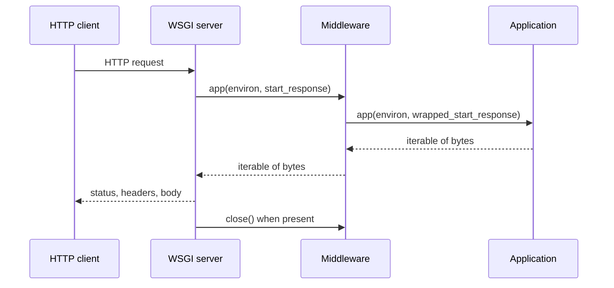

<TLDR>
  <TLDRCell label="what">
    <Term id="wsgi">WSGI（Web Server Gateway Interface）</Term>是同步Python Web服务器与应用之间的协议：服务器调用应用，应用返回由字节块组成的响应。
  </TLDRCell>
  <TLDRCell label="trap">
    WSGI是同步调用协议，不等于单线程服务器；最常见的契约错误是返回`str`、无界读取`wsgi.input`，或者让中间件吞掉`close()`与`exc_info`。
  </TLDRCell>
  <TLDRCell label="fix">
    把`environ`、`start_response()`和响应可迭代对象视为一个完整生命周期，并用`wsgiref.validate`与真实服务器测试协议边界。
  </TLDRCell>
</TLDR>

## 是什么，为什么存在

WSGI是PEP 3333定义的Python Web Server Gateway Interface。它规定Web服务器如何把一次HTTP请求表示成Python数据，怎样调用应用，以及应用如何交回状态、响应头和正文。框架与服务器依赖同一套协议，因此Flask或Django应用不需要为每一种WSGI服务器实现专用适配层。

WSGI解决的是进程内接口兼容问题，不是完整的HTTP服务器规范。套接字、HTTP解析、连接管理和客户端断开由服务器处理；路由、领域逻辑和响应内容由应用处理。反向代理、TLS、工作进程数量和部署拓扑也不属于WSGI契约。

你会在框架的应用对象、服务器启动目标以及中间件中遇到WSGI。服务器通常导入形如`module:application`的对象，再对每个请求调用它。中间件既接受服务器调用，又以服务器身份调用下一个应用，所以多个组件可以按相同接口组合。

WSGI只描述同步调用：普通可调用对象必须在当前执行上下文中完成一次请求。它不要求服务器只能使用一个线程或进程，也不保证全局状态安全。服务器可以用进程、线程或其他实现方式并发执行多个独立的WSGI调用。

长连接、WebSocket和原生异步收发不是WSGI的目标。需要这些能力时，应比较ASGI；但把成熟的同步应用机械改写成`async def`并不会自动提高容量。先从协议需求、依赖库和实际等待时间决定接口，而不是从框架标签决定。

## 工作原理

一次请求围绕三个对象展开：服务器提供`environ`和`start_response`，应用返回一个<Term id="iterable">可迭代对象（iterable）</Term>。`environ`描述请求与服务器能力，`start_response()`提交状态和响应头，可迭代对象逐块提供正文。三者共同构成协议，不能只检查函数签名。



图中的返回并不表示应用已经生成全部正文。应用可以返回列表，也可以返回稍后逐块执行的生成器。服务器迭代结果时才取得正文，并在结果提供`close()`时负责调用它。

### 应用可调用对象

最小应用具有`application(environ, start_response)`形状。它先计算状态和响应头，在产生第一个正文块之前调用`start_response()`，然后返回可迭代对象。可迭代对象产出的每一项都必须是`bytes`，包括空响应之外的所有正文块。

`start_response(status, response_headers, exc_info=None)`的`status`是形如`"200 OK"`的字符串。响应头是由`(name, value)`字符串对组成的列表。第三个参数只用于应用在处理异常时尝试替换尚未发送的响应头，普通成功路径不应传入它。

`start_response()`会返回旧式`write()`可调用对象，这是为了兼容早期推送风格。新代码应返回正文可迭代对象，不要依赖`write()`。混用两种正文路径会让顺序、流式传输和错误处理更难推断。

### `environ`中的请求

<Term id="wsgi-environ">WSGI environ</Term>是一个普通字典，但键和值受到协议约束。CGI风格键描述HTTP请求，`wsgi.*`键描述协议和服务器能力，服务器或中间件还可以加入名称不会冲突的扩展键。应用不应假设每个HTTP请求头都有对应键。

| 键 | 含义 | 应用侧注意点 |
| --- | --- | --- |
| `REQUEST_METHOD` | HTTP方法 | 不要自行改写大小写后猜测语义 |
| `SCRIPT_NAME` | 应用挂载路径 | 构造应用自身URL时保留它 |
| `PATH_INFO` | 挂载点后的路径 | 它不是原始URL字节 |
| `QUERY_STRING` | 不含`?`的查询串 | 可以为空，仍应与路径分开处理 |
| `CONTENT_TYPE` | 请求正文媒体类型 | 不使用`HTTP_CONTENT_TYPE` |
| `CONTENT_LENGTH` | 声明的正文长度 | 可能缺失或为空，解析前要校验 |
| `wsgi.input` | 二进制输入流 | 按受控长度读取，不做无界`read()` |
| `wsgi.errors` | 文本错误流 | 用于诊断，不作为HTTP响应正文 |
| `wsgi.multithread` | 同进程多线程调用是否可能 | 为真时不能依赖线程不交错 |
| `wsgi.multiprocess` | 多进程调用是否可能 | 为真时进程内状态不会全局一致 |

除`CONTENT_TYPE`和`CONTENT_LENGTH`外，请求头通常变成大写、连字符改为下划线并带`HTTP_`前缀，例如`X-Request-ID`对应`HTTP_X_REQUEST_ID`。这是服务器提供的规范化视图，不是授权信任证明。来自公网的头可能由客户端伪造，除非受信代理明确清洗并重写它们。

请求正文从`wsgi.input`读取，而不是从`environ`中取一个已经解析的对象。应用应先验证`CONTENT_LENGTH`和自身大小上限，再读取允许的字节数。媒体类型、字符编码和JSON等结构解析属于应用或框架的责任。

### 状态、响应头与正文

状态和响应头必须在第一个正文块可供服务器发送前交给`start_response()`。应用不能生成`Connection`、`Transfer-Encoding`等逐跳响应头，因为服务器负责当前HTTP连接。`Content-Length`可以由应用在已知准确字节数时设置，不能根据字符数猜测。

正文的字节边界很重要。应用先用选定编码把文本转换成`bytes`，再以字节长度计算`Content-Length`。返回Python `str`即使只含ASCII也违反协议，验证器或服务器应把它当作错误。

服务器必须按可迭代对象给出的顺序处理字节块，并在开始下一个请求前完成每个块的传输。WSGI不承诺每个`yield`对应一个网络数据包，也不承诺代理会立即把块交给客户端。应用可以流式产生数据，但端到端的缓冲行为仍需在真实部署链路中验证。

### 中间件链

<Term id="middleware">中间件（middleware）</Term>包装另一个WSGI应用，并对外保持同一协议。它可以修改`environ`，包装`start_response()`来观察状态或响应头，也可以包装返回的可迭代对象。认证、追踪、异常映射与安全响应头常在这一层实现。

透明中间件必须保留没有修改的协议细节。若它消费下游可迭代对象，就要转发正文顺序并确保下游`close()`得到调用；若它包装`start_response()`，就要接受并传递`exc_info`。为了记录一个状态码而把整个响应收集进内存，会意外破坏流式传输。

中间件顺序具有行为意义。异常处理中间件放在认证层外侧时可以转换认证层异常；放在内侧时则看不到那些异常。把顺序当作架构的一部分测试，不要只检查每个中间件的孤立单元测试。

### 并发由服务器声明

`wsgi.multithread`、`wsgi.multiprocess`和`wsgi.run_once`是描述执行环境的布尔值，不是应用向服务器发出的配置命令。应用可以据此判断某些优化是否安全，但通常更稳妥的做法是避免让正确性依赖某一种工作进程模型。数据库连接池、缓存和锁的作用域必须与实际进程和线程边界一致。

同步协议意味着一次调用不能在等待时把控制权交回ASGI风格的事件循环。服务器仍可以让其他线程或进程服务别的请求。因此，把“WSGI是同步的”推导成“WSGI一次只能处理一个请求”是错误的。

## 示例

下面三个示例只使用Python标准库。输出由本地`python3`执行对应文件得到；示例使用的协议在Python 3.14文档与PEP 3333中核对过。

### 最小应用与协议验证器

第一个应用读取方法、路径和查询串，返回一个已经编码的正文列表。小型调用器用`setup_testing_defaults()`构造基础环境，并让`wsgiref.validate.validator()`检查双方是否遵守WSGI断言。

<Depth level="quick">

```python run title="minimal_wsgi.py"
from wsgiref.util import setup_testing_defaults
from wsgiref.validate import validator


def application(environ, start_response):
    query = environ.get("QUERY_STRING", "")
    suffix = f"?{query}" if query else ""
    body = f"{environ['REQUEST_METHOD']} {environ['PATH_INFO']}{suffix}".encode()
    headers = [
        ("Content-Type", "text/plain; charset=utf-8"),
        ("Content-Length", str(len(body))),
    ]
    start_response("200 OK", headers)
    return [body]


def invoke(path, query):
    environ = {}
    setup_testing_defaults(environ)
    environ.update(PATH_INFO=path, QUERY_STRING=query)
    captured = {}

    def start_response(status, headers, exc_info=None):
        captured.update(status=status, headers=headers)
        return lambda data: None

    result = validator(application)(environ, start_response)
    try:
        body = b"".join(result)
    finally:
        if hasattr(result, "close"):
            result.close()
    return captured["status"], captured["headers"], body


status, headers, body = invoke("/orders", "limit=2")
print(status)
print(f"{headers[0][0]}: {headers[0][1]}")
print(f"{headers[1][0]}: {headers[1][1]}")
print(body.decode())
```

```text
200 OK
Content-Type: text/plain; charset=utf-8
Content-Length: 19
GET /orders?limit=2
```

</Depth>

调用器也履行了服务器侧责任：它保存状态与响应头、消费正文，并在可用时调用`close()`。`validator()`适合开发和测试；它是检查协议断言的中间件，不是生产安全边界，也不能证明业务逻辑正确。

这个示例一次返回完整正文，所以可以准确设置`Content-Length`。`len(body)`计算字节数；若先对Unicode字符串调用`len()`，含非ASCII字符时会得到不同结果。

### 有界读取JSON正文

第二个应用把传输边界与解析边界分开。它先把`CONTENT_LENGTH`转成整数并执行64字节上限，再从`wsgi.input`读取恰好允许的长度，最后解析JSON。

```python run title="json_body.py"
from io import BytesIO
import json

MAX_BODY = 64

def respond(start_response, status, payload):
    body = json.dumps(payload, separators=(",", ":")).encode()
    start_response(status, [("Content-Type", "application/json"),
                            ("Content-Length", str(len(body)))])
    return [body]


def application(environ, start_response):
    raw_length = environ.get("CONTENT_LENGTH", "")
    try:
        length = int(raw_length or "0")
    except ValueError:
        return respond(start_response, "400 Bad Request", {"error": "bad length"})
    if length < 0 or length > MAX_BODY:
        return respond(start_response, "413 Content Too Large", {"error": "too large"})
    try:
        document = json.loads(environ["wsgi.input"].read(length))
    except (UnicodeDecodeError, json.JSONDecodeError):
        return respond(start_response, "400 Bad Request", {"error": "bad json"})
    return respond(start_response, "200 OK", {"received": document})

def invoke(payload):
    environ = {"CONTENT_LENGTH": str(len(payload)), "wsgi.input": BytesIO(payload)}
    captured = []

    def start_response(status, headers, exc_info=None):
        captured.append(status)
        return lambda data: None

    body = b"".join(application(environ, start_response))
    return captured[0], body.decode()


print(*invoke(b'{"order_id":7}'), sep="\n")
print(*invoke(b"x" * 65), sep="\n")
```

```text
200 OK
{"received":{"order_id":7}}
413 Content Too Large
{"error":"too large"}
```

<TryToBreak items={['缺失或为空的CONTENT_LENGTH', '声明长度小于实际正文', '无效的UTF-8或JSON', '恰好64字节的正文']} />

这里的64字节只是可运行示例的明确测试边界，不是生产推荐值。真实服务应按端点、媒体类型和基础设施限制确定上限，并测试服务器在声明长度与实际传输不一致时的行为。

这个小应用没有实现媒体类型检查，也没有区分空正文与JSON解析错误。框架通常提供更完整的请求对象与错误映射，但底层仍必须面对相同的字节数、输入流和资源上限。

### 保留流式响应的中间件

第三个示例包装`start_response()`，记录方法、路径和最终状态，再添加安全响应头。中间件直接返回下游生成器，没有把正文收集成一个列表。

```python run title="streaming_middleware.py"
class SecurityHeaderMiddleware:
    def __init__(self, app):
        self.app = app

    def __call__(self, environ, start_response):
        method = environ["REQUEST_METHOD"]
        path = environ["PATH_INFO"]

        def add_header(status, headers, exc_info=None):
            print(f"{method} {path} -> {status.split()[0]}")
            updated = [*headers, ("X-Content-Type-Options", "nosniff")]
            return start_response(status, updated, exc_info)

        return self.app(environ, add_header)


def application(environ, start_response):
    start_response("200 OK", [("Content-Type", "text/plain")])
    yield b"part-1"
    yield b"|part-2"


captured = {}


def start_response(status, headers, exc_info=None):
    captured.update(status=status, headers=headers)
    return lambda data: None


wrapped = SecurityHeaderMiddleware(application)
result = wrapped({"REQUEST_METHOD": "GET", "PATH_INFO": "/report"}, start_response)
try:
    body = b"".join(result)
finally:
    result.close()

print(captured["headers"][-1])
print(body.decode())
```

```text
GET /report -> 200
('X-Content-Type-Options', 'nosniff')
part-1|part-2
```

因为`application()`是生成器函数，函数体在服务器开始迭代前不会运行，日志也到那时才出现。中间件没有自行消费结果，因此最外层服务器仍拥有迭代和关闭责任。

如果中间件需要修改正文，它就必须返回自己的包装可迭代对象，并在包装对象的`close()`中关闭下游结果。单纯使用生成器的`finally`只能清理生成器自己已经取得的资源，不能替代明确转发下游生命周期。

## 陷阱

### 把同步误写成单线程

> [!PITFALL]
> “WSGI一次只能处理一个请求”混淆了应用调用模型与服务器并发模型。多个进程或线程可以同时调用同一个应用对象，进程全局变量既可能并发修改，也可能在不同进程间各有副本。

**修复方法：** 读取真实服务器配置与`wsgi.multithread`、`wsgi.multiprocess`，按实际边界设计状态。跨请求数据放入具备明确一致性契约的外部存储；进程内缓存和连接池则明确其每进程作用域。

### 返回文本而不是字节

> [!PITFALL]
> 生成代码常返回`["ok"]`，或者让生成器`yield`一个字符串。Python能迭代这些对象不代表它们满足WSGI；响应正文项必须是`bytes`。

**修复方法：** 先决定字符编码，再显式调用`.encode()`。`Content-Type`声明文本编码，`Content-Length`从编码后的字节计算，并用`wsgiref.validate`在测试中捕获类型错误。

### 无界读取输入流

> [!PITFALL]
> 对`wsgi.input`调用无参数`read()`可能等待客户端结束输入，也可能把攻击者控制的大正文全部读入内存。只信任`CONTENT_LENGTH`而没有应用上限，同样无法控制资源占用。

**修复方法：** 校验缺失、空、负数和非数字长度，再执行端点级字节上限。需要流式上传时按有界块读取，同时在服务器或代理层设置相容限制，并处理客户端提前断开。

### 中间件破坏生命周期

> [!PITFALL]
> 为了记录或修改响应，中间件容易先执行`list(result)`，从而缓冲整个响应，并忘记调用下游结果的`close()`。另一个常见错误是包装函数只接受两个参数，异常路径传入`exc_info`时便失败。

**修复方法：** 不修改正文时直接返回下游可迭代对象；修改正文时实现能转发顺序、异常和`close()`的包装器。`start_response`包装函数保留第三个参数并原样传递，测试生成器响应与迭代中异常。

### 信任规范化请求头

> [!PITFALL]
> `HTTP_X_USER`、`HTTP_X_FORWARDED_FOR`或相似键只是请求头的WSGI表示。若公网客户端可以直接提供这些头，把它们当作已认证身份或真实来源地址会越过信任边界。

**修复方法：** 只信任由已知代理清洗并重写的头，并限制可信代理路径。身份来自经过验证的认证机制；日志同时保留直接对端与经过策略解析的客户端地址，便于审计。

### 在发送后替换错误响应

> [!PITFALL]
> 应用在部分正文已经发送后发生异常，不能可靠地把状态改成`500 Internal Server Error`。若错误处理器再次调用`start_response()`却没有传`exc_info`，还违反了重复调用规则。

**修复方法：** 在提交响应头前完成可能失败的验证与授权。异常发生后使用`exc_info`遵守服务器的已发送判断，并接受已经提交的响应只能中止连接；不要伪造一个完整的新响应。

<Depth level="deep">

## WSGI契约边界

### 可迭代对象的时间线

调用应用与消费结果是两个阶段。普通函数可以在返回列表前调用`start_response()`；生成器函数通常要到第一次迭代才执行函数体。服务器因此必须允许应用返回后才收到状态与响应头，但必须在处理第一个正文块之前收到它们。

服务器不能假设可迭代对象有长度，也不能为了计算`Content-Length`先消费全部结果。只有结果长度恰好为一且服务器能可靠判断时，规范允许服务器自行推导长度；应用若已设置该头，服务器必须尊重经过验证的值。对一般生成器而言，是否使用分块传输或关闭连接由服务器和HTTP版本决定。

每个非空正文块都应尽快交给服务器处理，服务器不得任意等待后续块再一起处理。不过，这项要求只覆盖WSGI服务器与应用之间的缓冲。反向代理、压缩层、TLS和客户端库仍可能重新缓冲，所以延迟敏感的流式响应必须做端到端测量。

若返回对象提供`close()`，服务器无论请求正常完成还是提前终止，都必须调用它。中间件一旦用自己的对象替换下游结果，就接管了转发这一责任。关闭用于释放生成器的`finally`、文件句柄或其他迭代期资源，而不是依赖垃圾回收时机。

### `start_response()`与异常替换

应用通常只调用一次`start_response()`。如果捕获到异常并想在响应头尚未发送时替换响应，可以带当前`sys.exc_info()`再调用一次。服务器若尚未发送头部，可以接受新状态与响应头；若已经发送，则必须重新抛出原异常。

这个机制不能撤回已经到达客户端的字节。错误中间件应把“尚未提交”和“已经提交”视为不同状态：前者可以构造完整错误响应，后者只能清理资源、记录失败并让连接或流终止。把两种状态统一成总能返回JSON错误，会制造状态码与正文互相矛盾的响应。

应用传给`start_response()`的响应头列表应当被服务器当作应用数据读取，但中间件仍应避免原地修改下游持有的列表。构造新列表可以减少别名引起的意外，也让重复头的处理更显式。`Set-Cookie`等允许重复的响应头不能先粗暴转换成字典。

逐跳响应头属于单次传输连接，而WSGI应用位于连接管理之上。应用和中间件不应生成`Connection`、`Keep-Alive`、`Transfer-Encoding`、`TE`、`Trailer`、`Upgrade`等头。服务器必须控制这些字段，才能正确适配HTTP版本、代理和连接复用。

### 字符串与URL字节

PEP 3333使用Python `str`表示CGI风格元数据，但这些字符串并不等于任意Unicode文本。协议以ISO-8859-1兼容方式让原始字节在字符串中往返，框架再按URL规则解释路径。直接把`PATH_INFO`当作已经正确解码的用户文本，可能造成双重解码或路由差异。

应用构造自身URL时需要同时考虑`SCRIPT_NAME`与`PATH_INFO`。前者表示服务器已经消费的应用挂载前缀，后者表示应用内剩余路径。忽略`SCRIPT_NAME`的代码在站点根路径测试正常，挂载到`/service`后却会生成错误重定向和链接。

查询串保留在`QUERY_STRING`，不包含开头的问号。不要从`PATH_INFO`再切一次`?`，也不要在验证前对同一百分号编码重复解码。成熟框架会集中处理这些兼容细节；直接写WSGI应用时，应使用经过测试的URL工具并保留原始边界数据用于诊断。

状态与响应头名称和值是字符串，响应正文则严格是字节。文本正文的正确顺序是选择编码、编码成字节、计算字节长度、再声明匹配的媒体类型与字符集。这一顺序也适用于中间件修改正文；改写字节后必须删除或重算旧的`Content-Length`。

### 输入流与资源上限

`wsgi.input`是服务器提供的二进制流。应用按`CONTENT_LENGTH`读取时，不应尝试取得超出声明长度的字节；服务器可能通过有限流模拟文件结束，也可能在更多数据到达前阻塞。规范接口本身没有替应用选择正文上限。

缺失的长度不应自动解释为“无限读取”。具体服务器可能支持协议扩展，例如以`wsgi.input_terminated`表示可安全读到流结束，但这不是PEP 3333的核心保证。可移植应用应通过框架或服务器文档明确处理无长度请求，不要猜测扩展存在。

读取长度只是第一层限制。压缩内容解压后可能更大，表单字段与嵌套JSON也会消耗额外CPU和内存。把传输字节上限、解压上限、解析深度和业务对象数量分别限制，才能避免一个看似很小的正文扩大成昂贵对象图。

客户端断开可以在读取输入、写出正文或关闭结果时表现为异常。应用必须让事务与外部副作用具有明确边界，不能假设没能发送响应就代表写入没有发生。对可重试写入使用幂等协议，并让日志区分应用失败、客户端断开与服务器取消。

### 服务器、框架与应用的责任

服务器把HTTP连接转换成WSGI调用，提供必需的`wsgi.*`键，并执行响应迭代。框架把低层映射转换成请求对象、路由参数和响应对象。应用负责授权、领域不变量和副作用；中间件负责被明确委托的横切策略。

边界清楚后，测试也应分层。纯应用测试可以用小型调用器快速覆盖状态和正文，协议测试加入`wsgiref.validate`，服务器集成测试再覆盖代理头、上传限制、断开、流式缓冲和并发模型。只调用视图函数会绕过WSGI与中间件，不能证明部署边界正确。

`wsgiref.simple_server`是标准库中的参考实现，适合示例与局部测试。它不是生产服务器建议。生产选择应根据维护状态、平台支持、工作进程模型和实际负载验证，并遵循所用框架的部署文档。

WSGI版本键当前是`(1, 0)`，而PEP 3333是面向Python 3的1.0.1说明。不要根据Python包版本或服务器品牌猜测另一个应用协议版本。若组件需要非标准能力，应使用带所有者前缀的扩展键，并为缺少扩展的情况定义回退或明确拒绝。

</Depth>

<Checkpoint id="backend/wsgi" />

## 延伸阅读

- [PEP 3333：Python Web Server Gateway Interface v1.0.1](https://peps.python.org/pep-3333/)
- [Python 3.14文档：`wsgiref`](https://docs.python.org/3.14/library/wsgiref.html)
- [Python 3.14文档：`wsgiref.validate`](https://docs.python.org/3.14/library/wsgiref.html#wsgiref.validate)
- [Flask文档：部署到生产环境](https://flask.palletsprojects.com/en/stable/deploying/)
