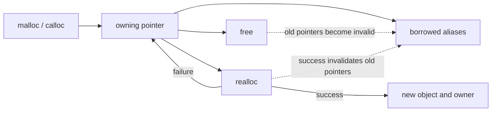

<TLDR>
  <TLDRCell label="what">
    C's dynamic allocation functions create storage at runtime and leave release responsibility to the program. The language does not record which pointer must release it or automatically check its size and lifetime.
  </TLDRCell>
  <TLDRCell label="trap">
    `count * sizeof *pointer` can overflow before `malloc` is called. A successful `realloc` invalidates the old pointer, while failure leaves the old allocation valid, and aliases can hide double-free and use-after-free bugs.
  </TLDRCell>
  <TLDRCell label="fix">
    Prove size arithmetic before allocating, check every result, give each owning pointer one release path, and make APIs state transfers, borrows, and lengths explicitly.
  </TLDRCell>
</TLDR>

## What it is and why it exists

C <Term id="dynamic-allocation">dynamic allocation</Term> lets a program decide at runtime how much storage an object needs and when that storage's lifetime ends. `malloc`, `calloc`, and `realloc` return a pointer to the start of allocated storage; `free` ends the corresponding allocation. These functions manage raw storage, not array lengths, element types, or business ownership.

You need dynamic allocation when an element count comes from a file, network, or user, or when data must outlive the function call that creates it. Linked-list nodes, growing buffers, and objects returned by factory functions are common boundaries. When a size is fixed and the lifetime ends with the current block, automatic storage is usually simpler.

The central question is not “stack or heap,” but who releases the allocation and how long every borrowed pointer remains usable. C defines four storage durations: static, thread, automatic, and allocated. Implementations commonly use a call stack for automatic storage and a heap allocator for allocated storage, but the standard does not require that physical layout.

Dynamic allocation is useful for runtime sizes and explicit lifetimes, not as a default. It introduces allocation failure, size overflow, leaks, double-free, out-of-bounds access, and use-after-free. A correct interface carries both a pointer and its range and states who must release it.

## How it works

### Storage duration, lifetime, and ownership

A successful allocation creates storage disjoint from other allocations. Its lifetime continues until `free`, or until a successful `realloc` replaces the old object. The allocated bytes initially have no value you may rely on; write objects of suitable types before reading them. An address from `malloc` meets fundamental alignment requirements for object types no larger than the requested size and requiring only fundamental alignment.

“Ownership” is a C API design convention, not a language property. An owning pointer carries responsibility for one matching release. A borrowed pointer provides temporary access, does not release the storage, and must not outlive the owner. Copying a pointer creates an alias; it does not copy the allocation or arrange shared release responsibility.



Passing an owning pointer to `free` ends that allocation. Another alias cannot be dereferenced or freed again even if it still stores the same address. Assigning `NULL` to one local pointer only prevents misuse through that variable; it does not repair other aliases.

### Four basic operations

`malloc(size)` requests `size` bytes. It returns a pointer to uninitialized storage on success and a null pointer on failure. A zero-size request is implementation-defined: an implementation may return null or a non-null pointer that cannot be used to access an object. Application code should normally reject or handle zero explicitly before the call.

`calloc(count, size)` requests `count` elements of `size` bytes and sets every bit to zero. C23 requires a null result if the product of element count and size would wrap around `size_t`. An all-bits-zero representation need not be floating-point zero or a null pointer on every platform, so do not treat `calloc` as a value initializer for arbitrary types.

`realloc(pointer, new_size)` creates a new object of `new_size` bytes and preserves the contents through the smaller of the old and new sizes. Added bytes have unspecified values. On success, the old object's lifetime has ended even if the returned address has the same numeric value, so only the returned pointer may be used. On failure, it returns null and leaves the old object and its value unchanged.

`free(pointer)` accepts a null pointer and does nothing. Any other argument must match a still-valid result from a memory-management function. Passing an automatic object's address, an interior element address, an already freed pointer, or the old pointer from before a successful `realloc` has <Term id="undefined-behavior">undefined behavior</Term>.

### Size comes before allocation

The allocator sees only an already-computed `size_t`. If `count * sizeof *items` wraps as unsigned arithmetic, `malloc` may successfully allocate a block much smaller than intended; writing the original `count` elements then runs out of bounds. This is an <Term id="allocation-size-overflow">allocation-size overflow</Term>, and the check must occur before multiplication.

The usual condition is `count > SIZE_MAX / sizeof *items`. It proves the product is representable before computing it. Decide separately what `count == 0` means, because even a successful zero-size request does not provide an accessible element.

## Examples

The following three programs build from checked array allocation to failure-safe resizing and multi-resource cleanup. I compiled each file locally with GCC 13.3.0 using `-std=c2x -Wall -Wextra -Wconversion -Wpedantic -Werror`, then ran it to obtain the shown output.

### Allocate a runtime-length array

The helper rejects zero elements and proves the multiplication cannot exceed `SIZE_MAX`. The caller receives the only owning pointer, initializes and reads the elements, and then releases it.

<Depth level="quick">

```c title="allocate_readings.c"
#include <stdint.h>
#include <stdio.h>
#include <stdlib.h>

static int *make_readings(size_t count) {
    if (count == 0 || count > SIZE_MAX / sizeof(int)) {
        return NULL;
    }
    return (int *)malloc(count * sizeof(int));
}

int main(void) {
    const size_t count = 4;
    int *readings = make_readings(count);
    if (readings == NULL) {
        fputs("allocation failed\n", stderr);
        return EXIT_FAILURE;
    }

    int total = 0;
    for (size_t index = 0; index < count; ++index) {
        readings[index] = 12 + (int)index * 3;
        total += readings[index];
    }

    printf("readings: %d %d %d %d\n",
           readings[0], readings[1], readings[2], readings[3]);
    printf("total: %d\n", total);
    free(readings);
    return EXIT_SUCCESS;
}
```

```text
readings: 12 15 18 21
total: 66
```

<TryToBreak items={['Set count to 0', 'Make count exceed SIZE_MAX / sizeof(int)', 'Read readings[0] before initialization']} />

</Depth>

`sizeof(int)` matches the target pointer's type, but generic code should prefer `sizeof *readings` so the expression follows a later pointer-type change. This helper uses `NULL` for both its zero-element policy and allocation failure. A real API that must distinguish those causes should return a status and deliver the pointer through an output parameter.

### Grow without losing the old allocation

The resizing function stores the `realloc` result in a temporary pointer. It updates the caller's owning pointer only after success and explicitly initializes every added element.

```c title="resize_readings.c"
#include <stdint.h>
#include <stdio.h>
#include <stdlib.h>
static int resize_readings(int **readings, size_t old_count, size_t new_count) {
    if (new_count == 0 || new_count > SIZE_MAX / sizeof **readings) {
        return 0;
    }
    int *resized = (int *)realloc(*readings, new_count * sizeof **readings);
    if (resized == NULL) {
        return 0;
    }
    for (size_t index = old_count; index < new_count; ++index) {
        resized[index] = 0;
    }
    *readings = resized;
    return 1;
}

int main(void) {
    size_t count = 3;
    int *readings = (int *)malloc(count * sizeof *readings);
    if (readings == NULL) {
        return EXIT_FAILURE;
    }
    readings[0] = 8;
    readings[1] = 13;
    readings[2] = 21;

    if (!resize_readings(&readings, count, 5)) {
        free(readings);
        return EXIT_FAILURE;
    }
    count = 5;
    printf("count: %zu\n", count);
    printf("values: %d %d %d %d %d\n",
           readings[0], readings[1], readings[2], readings[3], readings[4]);
    free(readings);
    return EXIT_SUCCESS;
}
```

```text
count: 5
values: 8 13 21 0 0
```

The failure branch can still release the original `readings` because the function has not overwritten it. After success, however, you cannot use an element pointer saved before `realloc`, such as `&readings[1]`. It belongs to the old object whose lifetime ended and must be recomputed from the new base.

This interface trusts `old_count` to be the old block's real element count and trusts `readings` to refer to an owning pointer accepted by `realloc`. Production APIs commonly keep pointer, length, and capacity in one structure and allow only a small function set to maintain those invariants.

### Clean several resources through one exit

A function can fail after acquiring its first resource but before acquiring its second. Initializing owning pointers to null and sending every failure to one cleanup label makes every acquired resource release exactly once.

```c title="cleanup_report.c"
#include <stdint.h>
#include <stdio.h>
#include <stdlib.h>
#include <string.h>
static int print_scaled(const int *readings, size_t count) {
    int *scaled = NULL;
    char *label = NULL;
    int ok = 0;
    if (readings == NULL || count == 0 ||
        count > SIZE_MAX / sizeof *scaled) {
        goto cleanup;
    }
    scaled = (int *)malloc(count * sizeof *scaled);
    if (scaled == NULL) {
        goto cleanup;
    }
    label = (char *)malloc(sizeof "scaled readings");
    if (label == NULL) {
        goto cleanup;
    }
    memcpy(label, "scaled readings", sizeof "scaled readings");
    printf("%s:", label);
    for (size_t index = 0; index < count; ++index) {
        scaled[index] = readings[index] * 10;
        printf(" %d", scaled[index]);
    }
    putchar('\n');
    ok = 1;
cleanup:
    free(label);
    free(scaled);
    return ok;
}
int main(void) {
    const int readings[] = {3, 5, 7};
    return print_scaled(readings, 3) ? EXIT_SUCCESS : EXIT_FAILURE;
}
```

```text
scaled readings: 30 50 70
```

The no-op guarantee for `free(NULL)` keeps the common exit simple. Cleanup usually runs in reverse acquisition order. These two allocations are independent, so either order works here, but teardown that depends on another resource must run first.

This pattern is useful for failures within one function; it does not make every `goto` appropriate. The label only releases resources this function owns, and control flow must not jump into a region whose initialization has not completed. Larger objects should provide paired initialization and destruction functions that centralize the rules.

## Pitfalls

### Multiply first, check later

> [!PITFALL]
> Multiplication in `malloc(count * sizeof *items)` is evaluated as `size_t` before the call. Comparing the result with `SIZE_MAX` is too late because an unsigned value may already have wrapped to a small number.

**Fix:** Check `count > SIZE_MAX / sizeof *items` before multiplying, and handle zero elements explicitly. For several dimensions, validate each multiplication in sequence rather than multiplying every factor first.

### Overwrite the only pointer with `realloc`

> [!PITFALL]
> `items = realloc(items, bytes)` overwrites the sole owning pointer with null on failure and causes a <Term id="memory-leak">memory leak</Term>. On success, every old alias is invalid too.

**Fix:** Receive the result in a temporary pointer and commit the new owner only when it is non-null. Recompute all element addresses from the returned pointer after success; continue using or release the old allocation after failure.

### Assume nulling one pointer handles every alias

> [!PITFALL]
> `free(owner); owner = NULL;` changes only the `owner` variable. Other pointer copies remain <Term id="dangling-pointer">dangling pointers</Term>, and testing them against `NULL` cannot reveal that the lifetime has ended.

**Fix:** Keep borrows short and do not let aliases cross a release point. Encapsulate an owning pointer in one module and make destruction clear the pointer, length, and capacity invariants in any exposed structure.

### Confuse zero bits with type initialization

> [!PITFALL]
> `calloc` guarantees all bits zero, not the semantic zero value of every type. It also cannot create nested ownership or allocate each pointer member of a structure.

**Fix:** Use cleared storage for byte or integer buffers when the platform contract permits it. Assign valid values to pointer, floating-point, and invariant-bearing structure members individually, and include initialization failure in the common cleanup path.

### Treat allocation success as a bounds proof

> [!PITFALL]
> A non-null pointer proves only that one byte request succeeded. It does not prove that a caller's `count` is correct or that an index lies within the block. A wrong element type or length can still cause an out-of-bounds access.

**Fix:** Carry the pointer with a trusted length, validate external sizes at the boundary, and iterate only over the half-open range `[0, count)`. Allocator-result checks and bounds checks solve different problems; you need both.

## In the AI era

**What generated code gets wrong here**

Models often generate `malloc(count * sizeof(T))` and check only the returned pointer, missing multiplication wraparound. They also assign `realloc` directly to the only pointer or keep using element addresses saved before a successful resize. With several early returns, generated code often misses a resource acquired midway. Another common “safety” fix nulls one pointer while ignoring aliases, cross-function ownership, and double-free paths for the same allocation.

**Ask your AI to check**

- For every allocation, list the size expression, the pre-multiplication upper-bound check, and the zero-size policy.
- Trace each owning pointer from acquisition through transfer to release, and list every alias that crosses `free` or a successful `realloc`.
- For every `return`, `goto`, and error branch, state which resources have been acquired and the exact statement that releases each one.

**Review checklist**

- Test size and loop boundaries with zero, one element, the largest permitted count, and the first rejected count.
- Force each allocation to fail and confirm the old state remains cleanable and no partially initialized object leaks.
- Run normal, failure, and resize paths with strict warnings and AddressSanitizer, then compare the code against its ownership contract.

**Prompt vocabulary**

Use exact terms: `allocated storage duration`, `owning pointer`, `borrowed pointer`, `allocation-size overflow`, `dangling pointer`, `use-after-free`, `double free`, and `failure-atomic realloc`. Ask for an ownership table, a size proof, and a per-exit cleanup table. “Check memory safety” does not identify the boundaries that need proof.

<Depth level="deep">

## Sizes, zero requests, and representations

### `size_t` arithmetic is an input boundary

`size_t` can represent object sizes, but it cannot guarantee that an arbitrary element count multiplied by an element size remains representable. It is an unsigned integer type, so arithmetic wraparound is defined even though it normally violates the allocation intent. The divisor in the check must be nonzero; `sizeof` a complete object type is at least 1, so `SIZE_MAX / sizeof *items` is safe to evaluate.

A two-dimensional allocation needs a proof at each step. To allocate `rows * columns` elements, first check `rows > SIZE_MAX / columns`, then check the resulting element count against the element size. If `columns == 0`, apply the API's empty-matrix policy first to avoid division by zero.

C23 `calloc(count, size)` fails when the product would wrap around `size_t`, which makes array-byte calculation safer. It still cannot decide whether `count` exceeds a business limit or promise that physical memory is immediately available. An API that distinguishes “invalid size” from “resource exhausted” should perform its own check first and return separate statuses.

### Zero size is not one element

The result of `malloc(0)` or `calloc(0, size)` is implementation-defined. It may be null or a non-null value that can be passed to `free`. Even when non-null, it cannot be used to access an object. Representing an empty container as `pointer == NULL, count == 0` often simplifies invariants, but that is an application choice.

In C23, calling `realloc(pointer, 0)` with a non-null pointer has undefined behavior. Do not depend on old code that treats it as `free`. Call `free(pointer)` directly and then update the container state explicitly, keeping the zero-size policy independent of language version and implementation differences.

### Cleared and unspecified bytes

Storage returned by `malloc` has an indeterminate representation; you cannot read it to guess whether the allocator reused an old block. When `realloc` grows an object, it preserves only the contents within the old size. Added bytes have unspecified values, so initialize each new element before reading it.

`calloc` sets every bit to zero. That is directly useful for byte arrays and commonly useful for integer counters. The standard explicitly warns that all-bits-zero need not represent floating-point zero or a null pointer. Portable code establishes those values through typed assignments instead of generalizing one bit pattern to every object type.

## `realloc` as a commit boundary

### Success and failure have opposite ownership results

You can reason about `realloc` as one library operation that allocates a new object, copies the preservable prefix, and ends the old object. The implementation may perform it in place, so the new and old pointers can have the same numeric value; the object lifetime still changes. The success branch must treat the result as the only new base address.

The failure branch neither releases the old object nor changes its contents. That guarantee lets the temporary-pointer pattern provide failure atomicity: before commit, the caller still owns the complete old state; after commit, it owns only the complete new state. When length or capacity changes too, update those fields only after `realloc` succeeds.

Element pointers, one-past pointers, and slices into a container are derived aliases of the old object. After a successful resize, regenerate them from the new base whether or not the address appears to move. A test must not use address equality from one run as proof that an old alias remains valid.

### Shrinking invalidates old pointers too

Shrinking is still a successful `realloc`, so the old base and every derived pointer become invalid. Only contents within the new size are preserved; the truncated portion no longer exists. Destroy or transfer any resources owned by truncated structure elements before shrinking their array.

Calling `realloc` for every appended element complicates the interface and failure paths and may repeatedly copy data. Containers usually separate logical length from capacity and grow in batches according to a policy. The right growth factor requires workload measurements, so this topic makes no unmeasured performance claim.

## Alignment, types, and release identity

### `malloc` supplies fundamental alignment

An ordinary allocation result is suitable for objects with fundamental alignment requirements whose size does not exceed the request. Objects requiring extended alignment need `aligned_alloc`, with a check that the implementation supports the requested alignment. Do not adjust a returned pointer manually and later pass the adjusted address to `free`.

`free` needs the identity of the original allocation result, not merely an address within the block. `free(items + 1)`, `free(&record->field)`, and freeing an automatic array all have undefined behavior. If an API exposes only an interior pointer, it must retain the original owner and stop callers from mistaking the borrow for a releasable pointer.

Allocated storage has no declared type; the program establishes object representations through suitable writes. Access through a wrong lvalue type, insufficient alignment, or reading a value that has not been established are not problems the allocator can repair. Raw byte copies still have to follow effective-type, object-representation, and overlap rules.

### A C cast is not an allocation check

`malloc` returns `void *`, which converts implicitly to an object pointer in C. The explicit casts in these examples are not semantically required. With or without a cast, include `<stdlib.h>` for the correct declaration. A conversion does not validate size, alignment, type, or allocation success.

Compiling C source as C++ changes conversion and object-lifetime rules. The examples in this topic are compiled as C23. A C++ project should prefer containers and RAII owners and follow the related C++ topics instead of copying C allocation patterns directly.

## API ownership contracts

### Supply the semantics missing from a signature

A raw pointer type does not distinguish ownership from borrowing. Documentation must state at least whether a pointer may be null, how many elements are accessible, whether the callee takes ownership, who releases a returned pointer, and whether inputs remain unchanged on failure. Names such as `create`/`destroy` and `clone`/`free` can suggest a pair, but they do not replace the contract.

A function returning a fresh allocation can transfer ownership to its caller. A function that changes the caller's owning pointer commonly accepts a pointer-to-pointer and writes it only on success; a destroy function can also accept a pointer-to-pointer and clear caller state. A borrowing function accepts a pointer and length and does not retain an alias beyond the declared lifetime.

A structure holding `data`, `length`, and `capacity` together can centralize a growing array's invariants. It still needs defined empty, partially initialized, and moved-from states. Copying the structure also copies its owning pointer, so the API must forbid shallow copies or provide a real clone operation.

### Cleanup paths are control flow

Every successful acquisition should immediately establish cleanup responsibility for the next failure path. A multi-resource function can use a reverse-order `goto cleanup`, or split resources into small objects with paired destruction functions. The syntax is secondary; every exit must release exactly the resources the current function still owns.

A cleanup function should accept defined empty and partially initialized states. Initialize members to null before acquiring them one at a time, and the destructor can conditionally release every acquired member. If cleanup itself can fail, as with flushing a file or committing a transaction, separate the reportable operation from final fallback release.

Ownership transfer must occur at an explicit commit point. Before commit, the current function cleans up; after commit, the recipient does. An error path that is ambiguous about which side of that point it occupies invites either a double-free or a leak.

## Diagnostics and verification

### Compiler warnings do not cover lifetimes

`-Wall -Wextra -Wconversion -Wpedantic` catches declarations, conversions, and some boundary mistakes, but clean warnings do not prove memory safety. Optimizers may use undefined-behavior assumptions to reorder or remove code, so “it looks fine in a debug build” is not lifetime evidence.

GCC's AddressSanitizer detects many out-of-bounds, use-after-free, and double-free faults. Rebuild representative paths with `-fsanitize=address,undefined -g` during diagnosis. Sanitizers cover only behavior that actually executes. Allocation-failure paths still need planned tests through an injectable allocator, fault injection, or wrapper functions.

A leak check tells you which allocations remain reachable or lost at exit; it does not define ownership for you. A process-wide cache may intentionally remain until shutdown, while a tiny allocation retained by each short request may be a defect. State the lifetime contract first, then use tools to test whether the implementation follows it.

### A minimum verification matrix

For an allocating function that accepts a count, test zero, one element, an ordinary count, the largest allowed count, and the first rejected count. A resize test cannot require the allocator to move or stay in place. Assert contents and state, not whether the address changed.

For a function owning several resources, make the first, second, and every later acquisition fail in turn. In each case, verify that acquired resources release once, unacquired resources are not released, and the caller retains whatever input the contract promises. Then run the success and failure matrix under sanitizers.

Finish review by tracing backward from every `free` to one acquisition and forward from every acquisition to every exit. If that graph cannot fit in a short table, the interface usually needs to be narrowed or encapsulated.

</Depth>

<Checkpoint id="cpp/c-memory" />

## Further reading

- [ISO/IEC 9899:2024 working draft N3220](https://www.open-std.org/jtc1/sc22/wg14/www/docs/n3220.pdf)
- [cppreference: `malloc`](https://en.cppreference.com/w/c/memory/malloc)
- [cppreference: `realloc`](https://en.cppreference.com/w/c/memory/realloc)
- [cppreference: `free`](https://en.cppreference.com/w/c/memory/free)
- [GCC 13.3: instrumentation options](https://gcc.gnu.org/onlinedocs/gcc-13.3.0/gcc/Instrumentation-Options.html)
