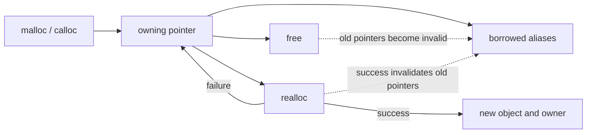

<TLDR>
  <TLDRCell label="what">
    C 的动态分配函数在运行时建立一段存储，并把释放责任交给程序。语言不会记录哪个指针负责释放，也不会自动检查大小与生命周期。
  </TLDRCell>
  <TLDRCell label="trap">
    `count * sizeof *pointer` 会在调用 `malloc` 前溢出；`realloc` 成功后旧指针失效，失败时旧分配却仍然有效。别名还会把重复释放和释放后使用藏起来。
  </TLDRCell>
  <TLDRCell label="fix">
    先验证大小算术，再检查分配结果；为每个拥有型指针规定唯一释放路径，并让 API 明确表达转移、借用和长度。
  </TLDRCell>
</TLDR>

## 是什么，为什么存在

C 的<Term id="dynamic-allocation">动态内存分配（dynamic allocation）</Term>让程序在运行时决定对象需要多少存储，以及这段存储何时结束生命周期。`malloc`、`calloc` 和 `realloc` 返回指向已分配存储起始位置的指针，`free` 结束对应分配。它们只管理原始存储，不知道数组长度、元素类型或业务所有者。

当元素数量来自文件、网络或用户输入，或者数据必须比创建它的函数调用存活更久时，就会遇到动态分配。链表节点、可增长缓冲区和由工厂函数返回的对象都是常见边界。若大小固定且生命周期只到当前代码块，自动存储期对象通常更简单。

这里的核心问题不是「栈还是堆」，而是谁负责释放，以及所有借用指针能用到什么时候。C 标准规定静态、线程、自动和已分配四种存储期；具体实现通常用调用栈支持自动存储，用堆分配器支持已分配存储，但标准并不要求这种物理布局。

动态分配适合运行时大小和显式生命周期，不应成为默认选择。它引入分配失败、大小溢出、泄漏、重复释放、越界和释放后使用等失败模式。正确接口必须同时传递指针与范围，并把释放责任写进契约。

## 工作原理

### 存储期、生命周期与所有权

成功的分配会建立一段与其他分配互不重叠的存储，其生命周期持续到 `free`，或持续到成功的 `realloc` 替换旧对象。分配所得字节最初没有可依赖的值；向其中写入合适类型的对象后才能读取该值。`malloc` 返回的地址满足基本对齐要求，可用于大小不超过请求值、且只要求基本对齐的对象类型。

「所有权（ownership）」是 C API 的设计约定，不是语言属性。拥有型指针承担一次配对释放；借用指针只临时访问，不释放存储，也不能比所有者存活更久。复制指针只会建立别名，不会复制分配或自动共享释放责任。



把拥有型指针传给 `free` 后，该分配结束。即使另一个别名仍保存相同地址，也不能解引用或再次释放它。把一个局部指针设为 `NULL` 只能避免通过这个变量误用，无法修复其他别名。

### 四个基本操作

`malloc(size)` 请求 `size` 个字节，成功时返回指向未初始化存储的指针，失败时返回空指针。零大小请求由实现定义：实现可以返回空指针，也可以返回一个不能用于访问对象的非空指针。业务代码通常应在调用前明确拒绝或单独处理零大小。

`calloc(count, size)` 请求 `count` 个 `size` 字节元素，并把所有位清零。C23 要求元素数量与大小的乘积若会绕回 `size_t`，则返回空指针。全零位不保证能表示所有平台上的浮点零或空指针，因此不要把 `calloc` 当作任意类型的值初始化器。

`realloc(pointer, new_size)` 建立一个 `new_size` 字节的新对象，保留新旧大小较小者范围内的内容。新增长的字节具有未指定值。成功时旧对象已结束，即使返回地址的数值没有变化，也只能使用返回的新指针；失败时返回空指针，旧对象和值保持有效。

`free(pointer)` 接受空指针并且不做任何事。其他实参必须匹配仍然有效的内存管理函数返回值；传入自动对象地址、内部元素地址、已经释放的指针或成功 `realloc` 前的旧指针都会产生<Term id="undefined-behavior">未定义行为（undefined behavior）</Term>。

### 大小先于分配

分配器看到的只是已经计算完成的 `size_t`。若 `count * sizeof *items` 发生无符号回绕，`malloc` 可能成功分配一个远小于预期的块，随后按原始 `count` 写入就会越界。这是<Term id="allocation-size-overflow">分配大小溢出（allocation size overflow）</Term>，检查必须发生在乘法之前。

常用条件是 `count > SIZE_MAX / sizeof *items`。它先证明乘积可表示，再执行乘法。还要单独决定 `count == 0` 的业务含义，因为成功的零大小请求也不能提供可访问的元素。

## 示例

下面三个程序依次展示受检数组分配、安全扩容和多资源清理。每个文件都用本地 GCC 13.3.0 执行 `-std=c2x -Wall -Wextra -Wconversion -Wpedantic -Werror` 编译，再运行得到所示输出。

### 分配运行时长度的数组

辅助函数先拒绝零元素，再证明乘法不会超过 `SIZE_MAX`。调用方取得唯一拥有型指针，完成初始化和读取后释放它。

<Depth level="quick">

```c title="allocate_readings.c"
#include <stdint.h>
#include <stdio.h>
#include <stdlib.h>

static int *make_readings(size_t count) {
    if (count == 0 || count > SIZE_MAX / sizeof(int)) {
        return NULL;
    }
    return (int *)malloc(count * sizeof(int));
}

int main(void) {
    const size_t count = 4;
    int *readings = make_readings(count);
    if (readings == NULL) {
        fputs("allocation failed\n", stderr);
        return EXIT_FAILURE;
    }

    int total = 0;
    for (size_t index = 0; index < count; ++index) {
        readings[index] = 12 + (int)index * 3;
        total += readings[index];
    }

    printf("readings: %d %d %d %d\n",
           readings[0], readings[1], readings[2], readings[3]);
    printf("total: %d\n", total);
    free(readings);
    return EXIT_SUCCESS;
}
```

```text
readings: 12 15 18 21
total: 66
```

<TryToBreak items={['把 count 改为 0', '让 count 大于 SIZE_MAX / sizeof(int)', '在初始化前读取 readings[0]']} />

</Depth>

`sizeof(int)` 与目标指针的类型一致，但在通用代码中更推荐 `sizeof *readings`，因为指针类型改变时表达式也会跟着改变。这个辅助函数用 `NULL` 同时表示零元素策略和分配失败；实际 API 若需要区分原因，应返回状态码并通过输出形参交付指针。

### 不丢失旧分配地扩容

扩容函数把 `realloc` 结果先保存到临时指针。只有成功后才更新调用方的拥有型指针，并显式初始化新增元素。

```c title="resize_readings.c"
#include <stdint.h>
#include <stdio.h>
#include <stdlib.h>
static int resize_readings(int **readings, size_t old_count, size_t new_count) {
    if (new_count == 0 || new_count > SIZE_MAX / sizeof **readings) {
        return 0;
    }
    int *resized = (int *)realloc(*readings, new_count * sizeof **readings);
    if (resized == NULL) {
        return 0;
    }
    for (size_t index = old_count; index < new_count; ++index) {
        resized[index] = 0;
    }
    *readings = resized;
    return 1;
}

int main(void) {
    size_t count = 3;
    int *readings = (int *)malloc(count * sizeof *readings);
    if (readings == NULL) {
        return EXIT_FAILURE;
    }
    readings[0] = 8;
    readings[1] = 13;
    readings[2] = 21;

    if (!resize_readings(&readings, count, 5)) {
        free(readings);
        return EXIT_FAILURE;
    }
    count = 5;
    printf("count: %zu\n", count);
    printf("values: %d %d %d %d %d\n",
           readings[0], readings[1], readings[2], readings[3], readings[4]);
    free(readings);
    return EXIT_SUCCESS;
}
```

```text
count: 5
values: 8 13 21 0 0
```

失败分支仍能释放原来的 `readings`，因为函数尚未覆盖它。成功分支则不能再使用调用 `realloc` 前保存的元素指针，例如 `&readings[1]`；它们属于已经结束生命周期的旧对象，必须从新基址重新计算。

这个接口相信 `old_count` 是旧块的真实元素数，也相信 `readings` 指向可由 `realloc` 接收的拥有型指针。生产接口通常把指针、长度和容量放进同一个结构体，并只允许一组函数维护这些不变量。

### 用统一出口清理多个资源

函数可能在取得第一个资源后、取得第二个资源前失败。把拥有型指针初始化为空，并让所有失败路径跳到同一个清理标签，可让每项已取得资源恰好释放一次。

```c title="cleanup_report.c"
#include <stdint.h>
#include <stdio.h>
#include <stdlib.h>
#include <string.h>
static int print_scaled(const int *readings, size_t count) {
    int *scaled = NULL;
    char *label = NULL;
    int ok = 0;
    if (readings == NULL || count == 0 ||
        count > SIZE_MAX / sizeof *scaled) {
        goto cleanup;
    }
    scaled = (int *)malloc(count * sizeof *scaled);
    if (scaled == NULL) {
        goto cleanup;
    }
    label = (char *)malloc(sizeof "scaled readings");
    if (label == NULL) {
        goto cleanup;
    }
    memcpy(label, "scaled readings", sizeof "scaled readings");
    printf("%s:", label);
    for (size_t index = 0; index < count; ++index) {
        scaled[index] = readings[index] * 10;
        printf(" %d", scaled[index]);
    }
    putchar('\n');
    ok = 1;
cleanup:
    free(label);
    free(scaled);
    return ok;
}
int main(void) {
    const int readings[] = {3, 5, 7};
    return print_scaled(readings, 3) ? EXIT_SUCCESS : EXIT_FAILURE;
}
```

```text
scaled readings: 30 50 70
```

`free(NULL)` 的无操作保证让统一出口保持简单。清理顺序通常与获取顺序相反；这个示例的两块内存互不依赖，因此两种顺序都有效，但依赖另一个资源的析构逻辑应先执行。

该模式适合一个函数内部的失败处理，不表示所有 `goto` 都合适。标签只负责释放当前函数拥有的资源，且控制流不应跳入尚未完成初始化的区域。更大的对象应提供成对的初始化／销毁函数，把规则集中在一处。

## 陷阱

### 先乘法，后检查

> [!PITFALL]
> `malloc(count * sizeof *items)` 中的乘法先按 `size_t` 计算。把结果与 `SIZE_MAX` 比较已经太晚，因为无符号值可能先回绕成较小数字。

**修复方法：** 在乘法前检查 `count > SIZE_MAX / sizeof *items`，并明确处理零元素。对多个维度逐步检查每次乘法，不要先把所有因子相乘。

### 直接覆盖 `realloc` 的唯一指针

> [!PITFALL]
> `items = realloc(items, bytes)` 在失败时把唯一拥有型指针覆盖为空，从而造成<Term id="memory-leak">内存泄漏（memory leak）</Term>。成功时，任何旧别名也都会失效。

**修复方法：** 用临时指针接收结果，只有非空时才提交新所有者。成功后从返回指针重新计算所有元素地址；失败后继续使用或释放原分配。

### 认为置空一个指针会处理所有别名

> [!PITFALL]
> `free(owner); owner = NULL;` 只能改变 `owner` 变量。其他复制出来的指针仍是<Term id="dangling-pointer">悬空指针（dangling pointer）</Term>，检查它们是否为 `NULL` 也无法发现生命周期已经结束。

**修复方法：** 缩短借用范围，不要让别名跨过释放点。由一个模块封装拥有型指针，并让销毁操作同时清除公开结构中的指针、长度和容量不变量。

### 混淆清零位与类型初始化

> [!PITFALL]
> `calloc` 保证所有位为零，不保证这种位模式是每种类型的语义零值。它也不能建立嵌套拥有关系，不能替每个结构体成员执行分配。

**修复方法：** 对整数或字节缓冲区可在平台契约允许时利用清零；对指针、浮点数和带不变量的结构体，逐个成员赋予合法值。把初始化失败纳入同一清理路径。

### 把分配成功当作范围证明

> [!PITFALL]
> 非空指针只证明某次字节请求成功，不证明调用方传来的 `count` 正确，也不证明索引位于块内。错误的元素类型或长度仍会产生越界访问。

**修复方法：** API 同时携带指针与可信长度，在入口验证外部大小，并只用半开范围 `[0, count)` 遍历。分配器返回值检查与边界检查解决的是不同问题，两者都需要。

## AI 时代

**生成代码在这里常犯的错**

模型常生成 `malloc(count * sizeof(T))`，只检查返回指针，却没有检查乘法回绕；它还会把 `realloc` 直接赋回唯一指针，或者在成功扩容后继续使用扩容前保存的元素地址。处理多个提前返回时，生成代码容易漏掉中间已取得的资源。另一类错误是为了「安全」只把一个指针置空，却忽略同一分配的别名、跨函数所有权和重复释放。

**让 AI 检查**

- 为每个分配列出大小表达式、乘法前的上界检查，以及零大小策略。
- 画出每个拥有型指针从取得、转移到释放的路径，并列出跨过释放或成功 `realloc` 的所有别名。
- 对每个 `return`、`goto` 和错误分支，说明当时已经取得哪些资源，以及各自由哪条语句释放。

**审查清单**

- 用零、一个元素、最大合法数量和超过上界的数量测试大小与循环边界。
- 强制每次分配可能失败，确认旧状态仍可清理，而且没有部分初始化对象泄漏。
- 在严格警告和 AddressSanitizer 下运行正常、失败与扩容路径，并检查所有权契约是否与代码一致。

**提示词词汇**

使用准确术语：`allocated storage duration`（已分配存储期）、`owning pointer`（拥有型指针）、`borrowed pointer`（借用指针）、`allocation-size overflow`（分配大小溢出）、`dangling pointer`（悬空指针）、`use-after-free`（释放后使用）、`double free`（重复释放）、`failure-atomic realloc`（失败原子性的 `realloc`）。要求模型输出所有权表、大小证明和逐出口清理表；「检查内存安全」无法说明要验证哪些边界。

<Depth level="deep">

## 大小、零请求与表示

### `size_t` 算术也是输入边界

`size_t` 能表示对象大小，但不能保证任意元素数量与元素大小的乘积可表示。它是无符号整数类型，算术回绕有定义，却通常违反分配意图。检查式中的除数必须非零；`sizeof` 完整对象类型的结果至少为 1，所以 `SIZE_MAX / sizeof *items` 可安全计算。

二维分配需要逐步证明。例如为 `rows * columns` 个元素分配空间时，先检查 `rows > SIZE_MAX / columns`，得到元素总数后，再检查总数与元素大小的乘法。若 `columns == 0`，应先按 API 契约处理空矩阵，避免除零。

C23 的 `calloc(count, size)` 会在乘积绕回 `size_t` 时失败，这让数组字节数检查更可靠。它仍不能验证 `count` 是否符合业务上限，也不能保证物理内存立即可用。对于必须区分「大小非法」和「资源不足」的接口，应先自行检查并返回不同状态。

### 零大小不是一个元素

`malloc(0)` 和 `calloc(0, size)` 的结果由实现定义，可以为空，也可以是可传给 `free` 的非空值。即使结果非空，也不能通过它访问对象。把零元素容器表示为 `pointer == NULL, count == 0` 往往更容易保持不变量，但这是应用选择。

C23 中，对非空指针调用 `realloc(pointer, 0)` 的行为未定义。不要再依赖旧代码中把它当作 `free` 的写法；需要释放时直接调用 `free(pointer)`，然后显式更新容器状态。这样零大小策略不会依赖语言版本或实现差异。

### 清零与未指定字节

`malloc` 返回存储的表示不确定，不能通过读取来猜测分配器是否复用了旧块。`realloc` 扩大对象时，只保留旧大小范围内的内容，新增字节具有未指定值。代码必须在读取新元素前逐一初始化它们。

`calloc` 把每一位清零，这非常适合字节数组，也常用于整数计数数组。标准明确提醒，全零位不一定是浮点零或空指针表示。可移植代码应通过类型赋值建立这些值，而不是把位模式假设扩展到所有对象类型。

## `realloc` 的提交边界

### 成功与失败具有相反所有权结果

可以把 `realloc` 看成「分配新对象、复制可保留前缀、结束旧对象」的单个库操作。实现可以原地完成，因此新旧指针的数值可能相等；对象生命周期仍然发生了切换。成功分支必须以返回值为唯一新基址。

失败分支不会释放旧对象，也不会改变其中的内容。这项保证允许临时指针模式保持失败原子性：提交前，调用方仍拥有完整旧状态；提交后，调用方只拥有完整新状态。若同时更新长度或容量，应在 `realloc` 成功后再更新这些字段。

容器内部的元素指针、尾后指针和切片都是旧对象的派生别名。成功扩容后，无论地址看起来是否移动，都要从新基址重新生成。测试不应通过观察一次运行的地址相等来证明旧别名可用。

### 缩小也会使旧指针失效

缩小对象仍是成功的 `realloc`，所以旧基址和所有派生指针同样失效。只有新大小范围内的内容得到保留；被截断部分不再存在。先销毁或转移截断区域所拥有的其他资源，再缩小保存结构体的数组。

频繁对每个新增元素调用一次 `realloc` 会让接口和失败路径变复杂，也可能反复复制数据。通常把逻辑长度与容量分开，并按策略批量增长。具体增长因子需要结合工作负载测量，本主题不提供没有基准的性能结论。

## 对齐、类型与释放身份

### `malloc` 提供基本对齐

普通分配结果适合具有基本对齐要求、且大小不超过请求值的对象。需要扩展对齐的对象应使用 `aligned_alloc`，并验证实现支持请求的对齐。不要通过手工移动返回指针再把移动后的地址交给 `free`。

`free` 需要原始分配返回值的身份，而不是仅仅落在块内的地址。`free(items + 1)`、`free(&record->field)` 和释放栈上数组都属于未定义行为。若接口向外只暴露内部指针，它必须保留原始所有者，并阻止调用方误以为借用指针可释放。

分配存储没有声明类型；程序通过合适的写入建立要访问的对象表示。用错误类型的左值访问、违反对齐要求或读取尚未建立的值都不是分配器可以修复的问题。原始字节复制需要遵守有效类型、对象表示和重叠规则。

### C 的转换不是分配检查

`malloc` 返回 `void *`，在 C 中可隐式转换为对象指针；示例里的显式转换在语义上不是必需的。无论是否写转换，都必须包含 `<stdlib.h>` 取得正确声明。转换不会验证大小、对齐、类型或分配成功。

把 C 代码误用 C++ 编译器会改变转换和对象生命周期规则。这个主题的代码按 C23 编译；C++ 项目应优先使用容器和 RAII 所有者，并参考相关 C++ 主题，而不是把 C 分配模式直接复制过去。

## API 所有权契约

### 在函数签名之外补足语义

裸指针类型本身不区分拥有与借用。函数文档至少要说明：指针是否可为空、可访问多少元素、函数是否取得所有权、返回指针由谁释放，以及失败时输入是否保持不变。名称如 `create`／`destroy`、`clone`／`free` 可以提示配对关系，但不能代替契约。

返回新分配的函数适合把所有权交给调用方。修改调用方拥有型指针的函数通常接收双重指针，只有在成功时写回；销毁函数也可接收双重指针并把调用方状态清空。借用函数应接收指针与长度，不保存超出声明生命周期的别名。

一个结构体同时保存 `data`、`length` 和 `capacity`，可以集中表达可增长数组的不变量。仍需规定空状态、部分初始化状态和移动所有权后的状态。只复制这个结构体会复制拥有型指针，因此 API 要禁止浅复制，或提供真正的克隆操作。

### 清理路径是控制流的一部分

每次成功获取都应立即建立下一条失败路径的清理责任。多资源函数可用反向 `goto cleanup`，也可拆成带配对销毁函数的小对象。关键不是语法，而是每个出口恰好释放当前函数仍拥有的资源。

清理函数应能处理已定义的空状态和部分初始化状态。把成员初始化为空后再逐项获取，销毁函数就可以无条件检查并释放已取得成员。若清理本身可能失败，例如刷新文件或提交事务，应把可报告操作与最终兜底释放分开。

所有权转移必须发生在明确的提交点。提交前由当前函数清理；提交后由接收方清理。若错误分支在提交点两侧含糊不清，就容易出现双方都释放或双方都不释放。

## 诊断与验证

### 编译器警告覆盖不了生命周期

使用 `-Wall -Wextra -Wconversion -Wpedantic` 可以发现声明、转换和部分边界问题，但通过警告不能证明内存安全。优化器还可能利用未定义行为假设重排或删除代码，所以「调试构建看起来正常」不是生命周期证据。

GCC 的 AddressSanitizer 可检测许多越界、释放后使用和重复释放。调试时可用 `-fsanitize=address,undefined -g` 重新编译并运行代表性路径；它们只能覆盖实际执行到的行为。分配失败路径仍需通过可注入分配器、故障注入或包装函数有计划地测试。

泄漏检查只告诉你退出时哪些分配仍可达或已经丢失，不能替你定义所有权。长期缓存和进程级对象可能有意保持到退出，而短请求中保留一块小内存也可能是缺陷。先写生命周期契约，再用工具验证实现是否遵守。

### 最小验证矩阵

对接收数量的分配函数，至少测试零、一个元素、普通数量、最大允许数量和第一个被拒绝的数量。对扩容函数，同时覆盖原地或移动不能由测试强制保证的事实：断言内容与状态，不断言地址是否改变。

对拥有多个资源的函数，让第一次、第二次和之后每次获取分别失败。每种情况下都检查已经取得的资源被释放一次，尚未取得的资源不会被释放，调用方仍拥有契约规定的输入。再在 sanitizer 下执行成功和失败矩阵。

代码评审最后应从每个 `free` 反向找到唯一获取点，从每个获取点正向找到所有出口。若这个图无法用简短表格解释，接口通常需要缩小或封装。

</Depth>

<Checkpoint id="cpp/c-memory" />

## 延伸阅读

- [ISO/IEC 9899:2024 工作草案 N3220](https://www.open-std.org/jtc1/sc22/wg14/www/docs/n3220.pdf)
- [cppreference：`malloc`](https://en.cppreference.com/w/c/memory/malloc)
- [cppreference：`realloc`](https://en.cppreference.com/w/c/memory/realloc)
- [cppreference：`free`](https://en.cppreference.com/w/c/memory/free)
- [GCC 13.3：程序插桩选项](https://gcc.gnu.org/onlinedocs/gcc-13.3.0/gcc/Instrumentation-Options.html)
