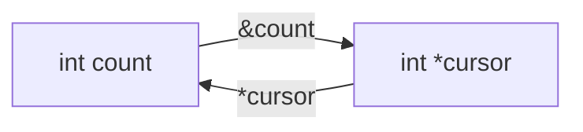

<TLDR>
  <TLDRCell label="what">
    A pointer is a scalar value that stores the address of an object or function. An object pointer's type determines what dereferencing accesses and how far pointer arithmetic advances.
  </TLDRCell>
  <TLDRCell label="trap">
    A non-null address isn't necessarily a valid pointer. Dereferencing can have undefined behavior if its bounds, lifetime, alignment, target type, or write permission is wrong.
  </TLDRCell>
  <TLDRCell label="fix">
    Initialize every pointer, express nullability, length, lifetime, and mutability in the interface, and keep pointer arithmetic within one array and its one-past position.
  </TLDRCell>
</TLDR>

## What it is and why it exists

A pointer is a scalar type whose values can represent addresses. An <Term id="object-pointer">object pointer</Term> has `void` or an object type as its target, distinguishing it from a function pointer; `int *balance` can store the address of an `int` object. A pointer variable is itself an object, and copying it copies only the address, not the pointed-to object.

Unary `&` takes the address of an lvalue, while unary `*` dereferences a pointer and produces an lvalue for the pointed-to object. If `balance` is a usable `int *`, `*balance = 500` writes the target `int`; it doesn't change the address stored in `balance`. The `*` in a declaration and the `*` in an expression look alike but serve different roles.

Pointers let functions access caller-owned objects indirectly. They also represent array ranges, dynamic objects, linked data structures, and memory-mapped hardware. C passes every argument by value: a function receiving a pointer gets a copy of the address but can still use that copy to access the same target object. This is the basis of output parameters and borrowing interfaces in C.

A pointer value carries no array length, ownership, or remaining lifetime. An `int *` might point to one `int`, an array element, nothing, or an object that has already ceased to exist. Correctness comes from a contract beyond the declaration, so review the address, range, and lifetime together.

Function pointers also store addresses, but they follow a different set of conversion and call rules. This topic focuses on object pointers; callback signatures and indirect calls belong to `cpp/c-function-pointers`, allocation and release belong to `cpp/c-memory`, and the complete array-to-pointer rules belong to `cpp/c-arrays`.

| Question | Can the pointer type answer alone? | Where the contract belongs |
|---|---|---|
| What is the target element type? | Yes | The pointed-to type |
| Is the current value null? | No | A runtime check and API contract |
| How many elements are accessible? | No | A separate count, sentinel, or array type |
| Who ends the object's lifetime? | No | Ownership documentation and control flow |
| May this pointer modify the target? | Partly | `const` qualification and a higher-level contract |

## How it works

The diagram shows the basic round trip. `&count` produces a pointer value that points to `count`, and `*cursor` produces an lvalue designating the same object. There is no length or ownership edge because a raw pointer stores neither fact.



### Declarations, addresses, and dereferencing

Read a declaration outward from its name. `int *cursor` declares a pointer to `int`; `int **slot` declares a pointer to an `int *` object; and `int (*row)[4]` declares a pointer to an array of four `int` elements. Parentheses change the binding and aren't optional decoration.

The pointer type determines the type of the lvalue produced by dereferencing. The compiler checks reads, writes, and arithmetic against the target type, but it doesn't prove that the address still denotes a live, aligned object of that type. A cast can change the type visible to the compiler; it can't make an address satisfy missing validity conditions.

A <Term id="null-pointer">null pointer</Term> explicitly represents no target. `NULL` is an implementation-provided null pointer constant macro, and the integer constant `0` also converts to a null pointer in a pointer context. You can copy and compare a null pointer, but you cannot dereference it.

### Array ranges and pointer arithmetic

An array expression undergoes an <Term id="array-to-pointer-conversion">array-to-pointer conversion</Term> in most value-taking contexts, producing a pointer to its first element. The conversion supplies an address, not an element count. A function parameter written as `int values[8]` is also adjusted to `int *values`; the `8` creates no runtime bounds check.

If `cursor` points to an array element, `cursor + 1` advances by one target element, not one byte. `cursor[index]` is defined as `*(cursor + index)`. This addition or subtraction follows the array traversal rules only when its result points within the same array or exactly one past it.

You may compare or subtract a one-past pointer or use it as the end of a half-open range, but you may not dereference it. Two element pointers can be reliably subtracted or ordered only when they belong to the same array object or its one-past position. Two numerically adjacent independent objects do not become one array.

| Expression | Meaning | Precondition |
|---|---|---|
| `values + i` | Points to element `i` | Result is within the array or one past it |
| `*(values + i)` | Accesses element `i` | Result points to a live element |
| `end - begin` | Element distance between pointers | Both belong to the same array range |
| `cursor < end` | Ordering within an array | Both belong to the same array range |

### Null pointers, validity, and lifetime

A null check excludes only one invalid case. A non-null pointer can still be uninitialized, dangling, out of bounds, misaligned, or accessing storage through a disallowed type. Program logic must prove each required condition before dereferencing.

Aliases that store an object's address do not clear themselves when its lifetime ends. Such an alias is a <Term id="dangling-pointer">dangling pointer</Term> and must not be used to read or write the target or passed to an API requiring a valid object. Assigning `NULL` to one variable protects only that variable; it cannot repair other copies.

A local automatic object normally ends its lifetime when its block exits. Returning its address immediately leaves a dangling result. Static-storage objects, caller-provided objects, and dynamically allocated objects have different end conditions, so an interface must say how long a borrow lasts.

### Where `const` applies

`const` can qualify the target or the pointer object itself. Read from the variable name outward and inspect both sides of `*`: `const int *view` can change its address but cannot modify the target through `view`; `int *const fixed` can modify the target but cannot be assigned a new address.

| Declaration | Pointer can be reassigned | Target can be modified through it |
|---|---|---|
| `int *cursor` | Yes | Yes |
| `const int *view` | Yes | No |
| `int *const fixed` | No | Yes |
| `const int *const fixed_view` | No | No |

Passing an `int *` to a read-only interface that accepts `const int *` normally adds a safe qualification. The reverse conversion discards a qualifier; even if a cast makes it compile, modifying an object actually defined as `const` has <Term id="undefined-behavior">undefined behavior</Term>. `const` is also shallow: it doesn't recursively freeze other objects reached through a structure's pointer members.

### Parameters are still passed by value

A function receives a copy of a pointer argument. Assigning another address to the parameter changes only that copy, leaving the caller's pointer variable unchanged; dereferencing the parameter can change the object both point to. Distinguishing “change the target” from “change the address saved by the caller” prevents an extra or missing `*`.

If a function must update the caller's `int *`, it can receive `int **` and the argument can use `&pointer`. This is still pass-by-value: the copied value is an `int **` address through which the function finds and modifies the caller's `int *` object. An output parameter should also specify whether failure preserves the old value.

`void *` can carry an object address while temporarily erasing the concrete target type. An object pointer can convert to `void *` and back to its original type, but caller and callee must agree on that original type, alignment, length, and lifetime. A `void *` cannot itself be dereferenced and is not a dynamic type-checking mechanism.

## Examples

The following four programs progress through a borrowed object, a half-open array range, a read-only search result, and a double-pointer output. I compiled every file locally with GCC 13.3.0 using `-std=c2x -Wall -Wextra -Wconversion -Wpedantic -Werror`, then ran it to obtain the shown output.

### Modify one object through a borrow

`debit` receives a copy of an `int *`. It neither owns nor releases the account object, but it can modify the caller's `balance` through a valid, non-null pointer.

<Depth level="quick">

```c title="debit.c"
#include <stdio.h>

static int debit(int *balance, int cents) {
    if (balance == NULL || cents < 0 || cents > *balance) {
        return 0;
    }

    *balance -= cents;
    return 1;
}

int main(void) {
    int balance = 1200;

    printf("before: %d\n", balance);
    printf("accepted: %d\n", debit(&balance, 150));
    printf("after: %d\n", balance);
    return 0;
}
```

```text
before: 1200
accepted: 1
after: 1050
```

</Depth>

`&balance` has type `int *`, matching the parameter. The lifetime of `balance` covers the whole call, so the borrow remains valid while the function runs. The original object is still managed by `main` after the function returns.

Checking `NULL` is only part of the function's contract. The caller must still supply the address of a live, writable `int` object; `debit` cannot establish that fact from the numeric address itself.

### Traverse a half-open pointer range

`count_at_least` receives beginning and one-past pointers into the same array. The loop dereferences only elements in `[first, last)`, never the end pointer itself.

```c title="pointer_range.c"
#include <stdio.h>

static int count_at_least(const int *first,
                          const int *last,
                          int floor) {
    int count = 0;
    for (const int *cursor = first; cursor != last; ++cursor) {
        if (*cursor >= floor) {
            ++count;
        }
    }
    return count;
}

int main(void) {
    const int readings[] = {18, 21, 17, 24, 21};
    const int *end = readings + 5;

    printf("matches: %d\n", count_at_least(readings, end, 21));
    printf("empty: %d\n", count_at_least(end, end, 21));
    return 0;
}
```

```text
matches: 3
empty: 0
```

<TryToBreak items={['make first equal last', 'make the threshold equal an element', 'change last to readings + 4']} />

`readings + 5` can serve as the end marker because it is exactly one past the array. Substituting an address from another array for `last` would violate the interface precondition; this loop cannot detect that mistake from two addresses alone.

The parameter uses `const int *`, so the function observes but doesn't modify elements. The local `cursor` itself can still advance because `const` qualifies the target `int`, not the pointer object.

### Return a read-only position in an array

The search function returns the address of the first even element, or a null pointer when no match exists. The caller dereferences only after a null check and retains the result only while the original array remains alive.

```c title="find_even.c"
#include <stddef.h>
#include <stdio.h>

static const int *find_first_even(const int *values, size_t count) {
    for (size_t index = 0; index < count; ++index) {
        if (values[index] % 2 == 0) {
            return &values[index];
        }
    }
    return NULL;
}

int main(void) {
    const int readings[] = {11, 17, 24, 31};
    const size_t count = sizeof readings / sizeof readings[0];
    const int *found = find_first_even(readings, count);

    if (found != NULL) {
        printf("index: %td\n", found - readings);
        printf("value: %d\n", *found);
    }
    return 0;
}
```

```text
index: 2
value: 24
```

`found - readings` is defined because both pointers refer into the same array. The result type is `ptrdiff_t`, so `printf` uses `%td`. If the array had ended its lifetime after the function returned, neither the subtraction nor dereferencing would remain valid.

Returning `const int *` preserves the input's read-only constraint. If generated code changed the result to `int *`, it would discard a qualifier and promise write access that the function never received.

### Update a selection with a double pointer

`select_slot` must modify the caller's `selected` pointer, so it receives `int **`. Failure returns before writing `*selection`, preserving the caller's previous selection.

```c title="select_slot.c"
#include <stddef.h>
#include <stdio.h>

static int select_slot(int **selection,
                       int *slots,
                       size_t count,
                       size_t index) {
    if (selection == NULL || index >= count || slots == NULL) {
        return 0;
    }

    *selection = &slots[index];
    return 1;
}

int main(void) {
    int slots[] = {10, 20, 30};
    int *selected = NULL;

    printf("selected: %d\n", select_slot(&selected, slots, 3, 1));
    *selected += 5;
    printf("value: %d\n", *selected);
    printf("invalid: %d\n", select_slot(&selected, slots, 3, 8));
    printf("preserved: %d\n", *selected);
    return 0;
}
```

```text
selected: 1
value: 25
invalid: 0
preserved: 25
```

At the call site, `&selected` is an `int **`, while `slots` converts to a pointer to its first element. On success, `selected` borrows the second array element; it cannot outlive the `slots` array.

A double pointer doesn't automatically signify ownership. This function only updates a borrowed result and performs no allocation or release. If an interface delivers a dynamic object through `int **`, it must separately define release responsibility and failure state.

## Pitfalls

### Returning the address of a local object

> [!PITFALL]
> An ordinary local object's lifetime ends when the function returns. An address returned as `&local` no longer points to that accessible object, even if its numeric value appears unchanged.

**Fix:** let the caller provide storage, return an owning value, or use an explicit owner with a sufficient lifetime. Don't mechanically add `static`; that shares state between all calls and introduces reentrancy and concurrency problems.

### Treating non-null as proof of validity

> [!PITFALL]
> `if (pointer != NULL)` cannot detect dangling, out-of-bounds, misaligned, or wrongly typed pointers. An alias commonly retains a nonzero bit pattern after release.

**Fix:** prove lifetime from ownership and control flow, bounds from the pointer and length, and alignment and access type through typed interfaces. Check null only at boundaries whose contract actually permits it.

### Recovering an array length from a pointer

> [!PITFALL]
> `sizeof pointer / sizeof pointer[0]` inside a function uses the pointer object's size, not the caller's array length. A parameter written as `int values[8]` has likewise already been adjusted to a pointer.

**Fix:** pass an element count or end pointer alongside the data and state whether its unit is elements or bytes. `sizeof array / sizeof array[0]` computes an element count only in a scope where the array type is still present.

### Using casts to hide qualifier or type errors

> [!PITFALL]
> Casting `const int *` to `int *` doesn't make an actually read-only object writable. Casting an arbitrary byte address to a structure pointer doesn't automatically satisfy alignment, size, or object-access rules either.

**Fix:** correct producer and consumer declarations so type and mutability agree at the boundary. When parsing a byte representation, validate its length and use a permitted character type or `memcpy`; don't treat a cast as validation.

### Clearing only one alias after release

> [!PITFALL]
> `free(owner); owner = NULL;` doesn't change an address copied earlier into `cached`. Checking or using `cached` can still hit a dangling-pointer bug, and releasing it again violates the allocator contract.

**Fix:** design one clear owner and release path, limit the spread of borrows, and finish all uses before release. Clearing a pointer can prevent reuse through that variable, but it cannot replace an ownership design.

## In the AI era

**What generated code gets wrong here**

Models often generate only `T *data` for a buffer parameter and then guess its length with `sizeof(data)`, or write `cursor <= end` and dereference the one-past position. They also return addresses of local array elements, clear only one alias after `free`, or cast away `const` merely to silence a diagnostic. Another frequent failure is using `if (pointer)` as the entire safety check without tracing which object produced the address, whether that object is alive, or how many elements remain accessible.

**Ask your AI to check**

- For every dereference, list the pointer's origin, target type, accessible element range, and evidence that the object's lifetime is active.
- For every pointer addition, subtraction, difference, and ordering comparison, prove that both endpoints belong to one array and mark whether a one-past pointer is dereferenced.
- List every pointer copy, ownership transfer, and release, then state which aliases remain valid on each failure path.

**Review checklist**

- Test every pointer loop with empty, one-element, exactly-at-boundary, and out-of-range inputs, with AddressSanitizer and UndefinedBehaviorSanitizer enabled in test builds.
- Confirm that every raw-pointer parameter has a contract for nullability, length units, mutability, ownership, and retention duration.
- Check that return values and output parameters don't point into local objects, that failures preserve old pointers, and that no partially updated state escapes.

**Prompt vocabulary**

Use the exact terms `object pointer`, `pointee`, `dereference`, `null pointer`, `dangling pointer`, `one-past-the-end pointer`, `pointer provenance`, `pointee constness`, and `ownership transfer`. Ask for a dereference proof and pointer-lifetime table; “check this pointer” is too vague to expose range and aliasing errors.

<Depth level="deep">

## Pointer values and object lifetimes

An initialized pointer can be null, point to an object or function, or point one past an array. A once-valid value can also become invalid when an object's lifetime ends. The category isn't a permanent label carried by the address integer itself; it depends on the object, execution point, and intended operation.

An uninitialized automatic pointer has no value your program may rely on. Set it to `NULL` or a valid address before comparing, copying, or dereferencing it. Delaying initialization until some later first use makes control flow harder to prove and makes it easier for a model to miss a branch.

A local object ends its lifetime when its block exits, while an allocated object's lifetime ends at its matching release. A successful `realloc` also ends the old object and invalidates every address into it, even if the returned address has the same numeric value. The ownership flow for allocation belongs in `cpp/c-memory`.

A one-past pointer is a range sentinel, not an extra element. You can advance from the first element to it and move back into the array, but you cannot read `*end` or continue by forming `end + 1`. A half-open range reduces the valid-dereference condition to `cursor != end` or a proven `cursor < end`.

After a lifetime ends, don't compare or print an old address or turn it into an integer to decide whether memory has been reused. An allocator may produce the same numeric address again, but the new object isn't a continuation of the old one. Correct code determines validity from ownership events, not observed address equality.

## Conversions, representations, and nested qualifiers

A pointer to an object type can convert to a correspondingly qualified pointer to `void` and back to its original object-pointer type; the restored value compares equal to the original. This guarantee supports generic context arguments and allocation interfaces, but carries no runtime type tag. Converting back to the wrong type and dereferencing still violates the access contract.

A pointer to a character type may inspect the bytes of an object's representation, an important exception for low-level parsing and copying. Permission to inspect a representation doesn't mean arbitrary modifications produce a valid value of the original type; padding bytes, trap representations, byte order, and object invariants still need separate treatment. Protocol decoders should normally validate individual fields instead of casting an input buffer to a structure pointer.

A null pointer is a special language-level value and need not have all bits zero. Assignment with `pointer = NULL` and static initialization produce a proper null pointer; zeroing all bytes of a pointer object with `memset` is not a portable null-pointer initialization. Pointer size is likewise not guaranteed to equal any integer type's size.

Print an object pointer with `%p` and explicitly convert the argument to `void *`. The representation is implementation-defined and suitable only for diagnosis, not as a persistent identifier or ordering key. Function pointers cannot rely on the same `void *` conversion guarantee.

Qualification conversions become stricter at multiple pointer levels. Treating `char **` as `const char **` would let the callee store a `const char *` in the original `char *` slot, after which code might modify an actually read-only object through `char *`. Safe addition of `const` at one level therefore cannot be extended mechanically through arbitrary indirection.

`restrict` is a promise about pointer access associations, not an optimization switch. Access through `restrict`-qualified pointers that violates the applicable association rules has undefined behavior. Add it only when the interface truly guarantees the required non-overlap, and retain another implementation for inputs that may overlap.

## Expressing API contracts with pointers

A pointer parameter must answer at least what it targets, its count, mutability, nullability, ownership, and retention duration. The type expresses only part of that information, so names, companion parameters, and documentation must supply the rest. These facts must never depend on caller guesswork across module or language boundaries.

| Interface intent | Common shape | Contract that must be added |
|---|---|---|
| Optionally read one object | `const T *value` | Meaning of `NULL` and borrow duration |
| Read a contiguous range | `const T *data, size_t count` | Unit of `count` and empty-range representation |
| Write a caller-owned object | `T *out` | Whether success and failure write it |
| Update a caller's pointer | `T **out` | Ownership, old value, and failure atomicity |
| Carry a type-erased context | `void *context` | Original type, alignment, and callback retention |

The count needs an explicit unit. Element count, byte count, capacity, and final valid index are four different values; treating a byte count as the iteration count for `T *` crosses the actual range whenever `sizeof(T) > 1`. In `data + count`, `count` must be measured in elements.

An empty range also needs one representation. An interface can promise not to read `data` when `count == 0` and state whether `data == NULL` is then allowed. The implementation should handle the count before any dereference; don't form a seemingly harmless `&data[0]` from a null pointer.

An output parameter should preferably update only when the result commits successfully. Validate the input and prepare the complete result first, then write `*out` once so the caller retains its old value after failure. If the function consumes an old object or delivers a new owner, the contract must also name the commit point and release responsibility.

A raw pointer conventionally represents a borrow more often than ownership, but C's type rules don't enforce that convention. Reducing the number of owners to one and keeping borrow ranges shorter than the release point removes many dangling aliases. Shared ownership requires a separate counting or resource-management protocol.

Tests can expose only some errors on executed paths. Strict warnings find incompatible conversions and formatting mistakes, AddressSanitizer often catches bounds errors and use-after-free, and UndefinedBehaviorSanitizer detects some undefined operations. None proves every lifetime or aliasing contract, so source, range, and release paths still need individual review.

</Depth>

<Checkpoint id="cpp/c-pointers" />

## Further reading

- [ISO/IEC 9899:2024 working draft N3220](https://www.open-std.org/jtc1/sc22/wg14/www/docs/n3220.pdf)
- [cppreference: pointer declarations](https://en.cppreference.com/c/language/pointer)
- [SEI CERT C: ARR30-C, do not form or use out-of-bounds pointers or array subscripts](https://cmu-sei.github.io/secure-coding-standards/sei-cert-c-coding-standard/rules/arrays-arr/arr30-c/)
- [GCC 13.3: instrumentation options](https://gcc.gnu.org/onlinedocs/gcc-13.3.0/gcc/Instrumentation-Options.html)
