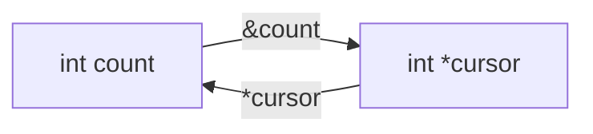

<TLDR>
  <TLDRCell label="what">
    指针是保存对象或函数地址的标量值；对象指针的类型决定解引用后访问哪种对象，以及指针运算跨过多大的元素。
  </TLDRCell>
  <TLDRCell label="trap">
    非空地址不等于有效指针。边界、对象生命周期、对齐、目标类型与写权限中任一条件不成立，解引用都可能产生未定义行为。
  </TLDRCell>
  <TLDRCell label="fix">
    初始化每个指针，在接口中同时表达可空性、长度、生命周期和可变性，并让所有指针运算停留在同一个数组及其尾后位置内。
  </TLDRCell>
</TLDR>

## 是什么，为什么存在

指针（pointer）是一种标量类型，它的值可以表示一个地址。<Term id="object-pointer">对象指针（object pointer）</Term>是目标为`void`或对象类型的指针，与函数指针相区别；`int *balance`可以保存`int`对象的地址。指针变量本身也是对象，复制它只会复制地址，不会复制所指对象。

一元`&`从左值取得地址，一元`*`解引用指针并产生所指对象的左值。若`balance`是可用的`int *`，`*balance = 500`会写入目标`int`，不是改变`balance`中保存的地址。声明中的`*`与表达式中的`*`写法相同，角色却不同。

指针让函数间接访问调用方对象，也让代码表示数组区间、动态对象、链式数据结构和硬件映射。C按值传递所有实参；把指针交给函数时，函数得到的是地址副本，却仍可通过该副本访问同一个目标对象。这是C模拟输出参数与借用接口的基础。

一个指针值不携带数组长度、所有权或剩余生命周期。`int *`既可能指向单个`int`，也可能指向数组中的元素，还可能为空或已经失效。正确性来自声明之外的接口契约，因此代码审查必须把地址、范围和生命周期放在一起看。

函数指针也保存地址，但它们遵守另一组转换与调用规则。本主题聚焦对象指针；回调签名和间接调用属于`cpp/c-function-pointers`，动态分配与释放属于`cpp/c-memory`，数组类型与数组到指针转换的完整规则属于`cpp/c-arrays`。

| 问题 | 指针类型能否独自回答 | 契约应放在哪里 |
|---|---|---|
| 目标元素类型是什么 | 能 | 指针的目标类型 |
| 当前值是否为空 | 不能 | 运行时检查与接口约定 |
| 可以访问多少个元素 | 不能 | 单独的数量、哨兵或数组类型 |
| 谁结束对象生命周期 | 不能 | 所有权文档与控制流 |
| 能否经此指针修改目标 | 部分能 | `const`限定与更高层约定 |

## 工作原理

下面的关系描述了最基本的往返。`&count`生成指向`count`的指针值，`*cursor`再产生表示同一个对象的左值。图中没有长度或所有权边，因为裸指针不保存这两项信息。



### 声明、地址与解引用

声明应从名称向外读。`int *cursor`声明一个指向`int`的指针；`int **slot`声明一个指向`int *`对象的指针；`int (*row)[4]`则声明一个指向四元素`int`数组的指针。括号会改变结合方式，不能当作装饰省略。

指针类型决定解引用所得左值的类型。编译器会按目标类型检查读取、写入和算术，但不会证明地址仍对应一个活着且对齐的该类型对象。强制转换可以改变编译器看到的类型，不能让不满足条件的地址变得有效。

<Term id="null-pointer">空指针（null pointer）</Term>明确表示没有目标。`NULL`是实现提供的空指针常量宏；在指针上下文中，整数常量`0`也可转换为空指针。空指针可以复制和比较，却不能解引用。

### 数组范围与指针运算

数组表达式在多数取值上下文中发生<Term id="array-to-pointer-conversion">数组到指针转换（array-to-pointer conversion）</Term>，结果指向首元素。转换只提供首元素地址，不附带元素数。函数形参中的`int values[8]`也会调整为`int *values`，其中的`8`不形成运行时边界检查。

若`cursor`指向数组元素，`cursor + 1`会前进一个目标元素，而不是一个字节。`cursor[index]`定义为`*(cursor + index)`。只有当结果仍指向同一数组的元素或恰好指向尾后位置时，这种加减才符合数组遍历规则。

尾后指针可以比较、相减或充当半开区间的结束标记，但不能解引用。两个元素指针只有在属于同一数组对象或其尾后位置时，才能可靠地相减或做顺序比较。数值上相邻的两个独立对象不会因此组成一个数组。

| 表达式 | 含义 | 前置条件 |
|---|---|---|
| `values + i` | 指向第`i`个元素 | 结果位于数组内或尾后 |
| `*(values + i)` | 访问第`i`个元素 | 结果必须指向活着的元素 |
| `end - begin` | 两指针之间的元素数 | 两者属于同一数组范围 |
| `cursor < end` | 数组内的顺序比较 | 两者属于同一数组范围 |

### 空指针、有效性与生命周期

空值检查只排除一种无效情况。一个非空指针仍可能未初始化、已经悬空、越过边界、没有满足对齐，或者以不允许的类型访问存储。解引用前必须由程序逻辑分别证明这些条件。

对象生命周期结束后，保存其地址的别名不会自动清空。这样的别名是<Term id="dangling-pointer">悬空指针（dangling pointer）</Term>，不得继续读取目标、写入目标或交给要求有效对象的API。把某一个变量设为`NULL`只能保护那一个变量，无法修复其他副本。

局部自动对象通常在所属块退出时结束生命周期。返回其地址会立刻留下悬空结果。静态存储期对象、调用方提供的对象和动态分配对象有不同的结束条件；接口需要明确借用能持续到何时。

### `const`限定放在哪里

`const`可以限定目标，也可以限定指针对象本身。读声明时先找变量名，再看`*`两侧：`const int *view`允许改变`view`的地址，但不能经它修改目标；`int *const fixed`可以修改目标，却不能给`fixed`重新赋地址。

| 声明 | 指针可重新赋值 | 可经该指针修改目标 |
|---|---|---|
| `int *cursor` | 可以 | 可以 |
| `const int *view` | 可以 | 不可以 |
| `int *const fixed` | 不可以 | 可以 |
| `const int *const fixed_view` | 不可以 | 不可以 |

把`int *`交给接收`const int *`的只读接口通常是安全的限定增加。反方向转换会丢弃限定；即使强制转换让代码通过编译，修改一个实际定义为`const`的对象仍产生<Term id="undefined-behavior">未定义行为（undefined behavior）</Term>。`const`还是浅层约束，不会递归冻结结构体指针成员所指的其他对象。

### 参数仍按值传递

函数取得指针实参的副本。给形参重新赋值只改变这个副本，调用方的指针变量不变；经形参解引用则能改变双方共同指向的对象。区分“改目标”与“改调用方保存的地址”可以避免多加或少加一层`*`。

如果函数需要更新调用方的`int *`，可以接收`int **`，让实参使用`&pointer`。这仍然是按值传递：被复制的是`int **`地址，而函数通过它找到并修改调用方的`int *`对象。输出形参还应说明失败时是否保持原值。

`void *`可以承载对象地址而暂时擦除具体目标类型。对象指针可转换为`void *`并再转换回原类型，但调用方和被调用方必须对原始类型、对齐、长度与生命周期达成一致。`void *`本身不能解引用，也不是动态类型检查机制。

## 示例

下面四个程序依次展示单对象借用、半开数组区间、只读查找结果和二级指针输出。每个文件都用本地GCC 13.3.0按`-std=c2x -Wall -Wextra -Wconversion -Wpedantic -Werror`编译，再运行得到所示输出。

### 通过借用修改一个对象

`debit`接收`int *`的副本。它不会拥有或释放账户对象，但在非空时可通过解引用修改调用方的`balance`。

<Depth level="quick">

```c title="debit.c"
#include <stdio.h>

static int debit(int *balance, int cents) {
    if (balance == NULL || cents < 0 || cents > *balance) {
        return 0;
    }

    *balance -= cents;
    return 1;
}

int main(void) {
    int balance = 1200;

    printf("before: %d\n", balance);
    printf("accepted: %d\n", debit(&balance, 150));
    printf("after: %d\n", balance);
    return 0;
}
```

```text
before: 1200
accepted: 1
after: 1050
```

</Depth>

`&balance`的类型是`int *`，与形参匹配。`balance`的生命周期覆盖整个调用，因此函数执行期间借用有效。函数返回后，原对象仍由`main`管理。

检查`NULL`只是函数契约的一部分。调用方仍必须传入一个活着且可写的`int`对象地址；`debit`无法从地址数值自行验证这件事。

### 遍历半开指针区间

`count_at_least`接收同一数组中的起始和尾后指针。循环只解引用`[first, last)`内的元素，结束指针本身从不解引用。

```c title="pointer_range.c"
#include <stdio.h>

static int count_at_least(const int *first,
                          const int *last,
                          int floor) {
    int count = 0;
    for (const int *cursor = first; cursor != last; ++cursor) {
        if (*cursor >= floor) {
            ++count;
        }
    }
    return count;
}

int main(void) {
    const int readings[] = {18, 21, 17, 24, 21};
    const int *end = readings + 5;

    printf("matches: %d\n", count_at_least(readings, end, 21));
    printf("empty: %d\n", count_at_least(end, end, 21));
    return 0;
}
```

```text
matches: 3
empty: 0
```

<TryToBreak items={['让first与last相等', '让阈值恰好等于一个元素', '把last改为readings + 4']} />

`readings + 5`可以形成结束标记，因为它恰好是尾后位置。把`last`换成另一个数组的地址会破坏接口前置条件；这个循环没有办法仅凭两个地址检测这种错误。

参数使用`const int *`，表示函数只观察元素。局部变量`cursor`自身仍可递增，因为`const`限定的是目标`int`，不是指针对象。

### 返回数组中的只读位置

查找函数返回首个偶数元素的地址，没有匹配时返回空指针。调用方只有在空值检查后才解引用，并且只在原数组仍存活时保存结果。

```c title="find_even.c"
#include <stddef.h>
#include <stdio.h>

static const int *find_first_even(const int *values, size_t count) {
    for (size_t index = 0; index < count; ++index) {
        if (values[index] % 2 == 0) {
            return &values[index];
        }
    }
    return NULL;
}

int main(void) {
    const int readings[] = {11, 17, 24, 31};
    const size_t count = sizeof readings / sizeof readings[0];
    const int *found = find_first_even(readings, count);

    if (found != NULL) {
        printf("index: %td\n", found - readings);
        printf("value: %d\n", *found);
    }
    return 0;
}
```

```text
index: 2
value: 24
```

`found - readings`有定义，因为两个指针都指向同一个数组。结果类型是`ptrdiff_t`，所以`printf`使用`%td`。如果函数返回后数组已经结束生命周期，这个减法与解引用都不再成立。

返回`const int *`保留了输入的只读约束。若生成代码把返回类型改成`int *`，它既会丢弃限定，也会向调用方承诺并不存在的写权限。

### 用二级指针更新选择结果

`select_slot`需要修改调用方的`selected`指针，所以接收`int **`。失败路径在写入`*selection`之前返回，因而保持调用方原来的选择。

```c title="select_slot.c"
#include <stddef.h>
#include <stdio.h>

static int select_slot(int **selection,
                       int *slots,
                       size_t count,
                       size_t index) {
    if (selection == NULL || index >= count || slots == NULL) {
        return 0;
    }

    *selection = &slots[index];
    return 1;
}

int main(void) {
    int slots[] = {10, 20, 30};
    int *selected = NULL;

    printf("selected: %d\n", select_slot(&selected, slots, 3, 1));
    *selected += 5;
    printf("value: %d\n", *selected);
    printf("invalid: %d\n", select_slot(&selected, slots, 3, 8));
    printf("preserved: %d\n", *selected);
    return 0;
}
```

```text
selected: 1
value: 25
invalid: 0
preserved: 25
```

调用处的`&selected`是`int **`，而`slots`转换为首元素`int *`。成功后，`selected`借用数组的第二个元素；它不能比`slots`数组活得更久。

二级指针不自动表示拥有关系。这里只更新一个借用结果，没有分配也没有释放。若接口通过`int **`交付动态对象，还必须另行规定释放责任和失败时的状态。

## 陷阱

### 返回局部对象的地址

> [!PITFALL]
> 函数返回后，普通局部对象的生命周期结束。返回`&local`得到的地址即使数值看起来没有变化，也不再指向可访问的那个对象。

**修复方法：** 让调用方提供存储，返回拥有型对象，或使用生命周期足够长的明确所有者。不要用`static`机械修补；它会把状态变成所有调用共享，并引入重入与并发问题。

### 把非空当作有效证明

> [!PITFALL]
> `if (pointer != NULL)`不能识别悬空、越界、错位或目标类型错误。释放后的别名往往仍保留非零位模式。

**修复方法：** 从所有者和控制流证明生命周期，从指针与长度证明边界，并通过类型化接口保存对齐和访问类型。空值检查只用于契约确实允许为空的边界。

### 从指针恢复数组长度

> [!PITFALL]
> 函数中的`sizeof pointer / sizeof pointer[0]`使用的是指针对象大小，不是调用方数组长度。`int values[8]`形参同样已经调整为指针。

**修复方法：** 同时传递元素数或结束指针，并明确单位是元素还是字节。只有在数组类型仍然存在的作用域中，`sizeof array / sizeof array[0]`才能计算元素数。

### 用强制转换掩盖限定或类型错误

> [!PITFALL]
> 把`const int *`强制转换成`int *`不会让实际只读对象变得可写。把任意字节地址转换成结构体指针，也不会自动满足对齐、大小和对象访问规则。

**修复方法：** 修正生产者与消费者的声明，使类型和可变性在边界上一致。必须解析字节表示时，先验证长度并使用标准允许的字符类型访问或`memcpy`，不要把一次转换当作验证。

### 释放后只清空一个别名

> [!PITFALL]
> `free(owner); owner = NULL;`不会修改此前复制到`cached`的地址。继续检查或使用`cached`仍可能触发悬空指针错误，第二次释放更会破坏分配器契约。

**修复方法：** 设计一个明确拥有者和单一释放路径，限制借用的传播范围，并在释放前让所有使用完成。置空可以防止当前变量被重复使用，但不能替代所有权设计。

<Depth level="deep">

## 指针值与对象生命周期

一个已初始化指针可以为空、指向对象或函数，或者指向数组的尾后位置。过去有效的值还可能因对象生命周期结束而失效。分类不是地址整数自身永久携带的标签，而取决于对象、执行时刻和准备执行的操作。

未初始化的自动指针没有可供程序依赖的值。先把它设为`NULL`或某个有效地址，再比较、复制或解引用。把错误初始化推迟到第一次使用之前，会让控制流更难证明，也容易让模型漏掉某条分支。

局部对象在块退出时结束生命周期，已分配对象在匹配的释放操作后结束生命周期。成功的`realloc`也会结束旧对象，并使所有指向旧对象的地址失效，即使返回地址的数值碰巧相同。详细的分配规则应由`cpp/c-memory`的所有权流程处理。

尾后指针是范围哨兵，不是额外元素。可以从同一数组的首元素逐次前进到它，也可以从它退回数组；不能读取`*end`，也不能继续形成`end + 1`。半开区间把合法解引用条件简化为`cursor != end`或经过证明的`cursor < end`。

生命周期结束后，不要靠比较旧地址、打印旧地址或把它转成整数来判断内存是否已被复用。分配器可以再次给出相同数值，但新对象不是旧对象的延续。正确程序通过所有权事件决定可用性，而不是通过观察地址是否相等。

## 转换、表示与多级限定

指向对象类型的指针可以转换为限定符相应的`void`指针，再转回原对象指针类型；转换回来应与原指针比较相等。这项保证适合通用上下文参数与分配接口，但不携带运行时类型标签。恢复为错误类型并解引用仍违反访问契约。

字符类型指针可以查看对象表示的各个字节，这是解析与复制底层表示的重要例外。查看对象表示不表示任意修改都能产生该类型的有效值；填充字节、陷阱表示、大小端和对象不变量仍需单独处理。协议解码通常应逐字段验证，而不是把输入缓冲区直接转换为结构体指针。

空指针是语言层面的特殊值，不要求所有位都为零。赋值`pointer = NULL`和静态初始化会产生正确空指针；用`memset`把指针对象的字节全部清零并不是可移植的空指针初始化方法。类似地，指针大小不保证等于整数类型大小。

打印对象指针应使用`%p`，并把实参显式转换为`void *`。输出格式由实现决定，只适合诊断，不应成为持久化标识或排序键。函数指针不能依赖同一种`void *`转换保证。

多级指针的限定转换比单级更严格。把`char **`当作`const char **`会允许被调用方把`const char *`写进原来的`char *`槽，随后可能经`char *`修改实际只读对象。因此，单级上安全的增加`const`不能机械推广到任意间接层。

`restrict`是对指针访问关系的承诺，不是优化开关。带`restrict`的访问若违反相应执行期间的关联要求，程序会产生未定义行为。只有接口确实能保证不重叠访问时才添加它，并为允许重叠的输入保留其他实现。

## 用指针表达API契约

一个指针形参至少需要回答目标、数量、可变性、可空性、所有权和保留时长。类型只能表达其中一部分，因此名称、伴随参数和文档必须补全其余信息。跨模块或跨语言边界时，这些条件更不能依赖调用方猜测。

| 接口意图 | 常见形状 | 必须补充的契约 |
|---|---|---|
| 可选读取一个对象 | `const T *value` | `NULL`的含义与借用时长 |
| 读一个连续范围 | `const T *data, size_t count` | `count`的单位与空范围表示 |
| 写一个调用方对象 | `T *out` | 成功与失败时是否写入 |
| 更新调用方指针 | `T **out` | 所有权、原值与失败原子性 |
| 擦除类型的上下文 | `void *context` | 原始类型、对齐与回调保留时长 |

数量必须标明单位。元素数、字节数、容量和最后有效索引是四种不同值；把字节数当成`T *`的循环次数，会在`sizeof(T) > 1`时越过真实范围。表达式`data + count`中的`count`必须是元素数。

空范围也需要统一表示。接口可以约定`count == 0`时不读取`data`，并明确此时是否允许`data == NULL`。实现应先处理数量，再执行任何解引用；不要为了计算`&data[0]`而在空指针上形成看似无害的表达式。

输出形参最好只在成功提交时更新。先验证输入并准备完整结果，最后一次性写入`*out`，可以让调用方在失败后仍掌握旧值。若函数会接管旧对象或交付新所有者，还要把提交点和释放责任写进契约。

裸指针通常表示借用，而不是自动表示拥有；这只是项目约定，不是C类型规则。将拥有者数量压缩到一个，并让借用范围短于释放点，可以显著减少悬空别名。需要共享所有权时，必须另外设计计数或资源管理协议。

测试只能发现被执行路径上的一部分错误。严格警告能发现不兼容转换和格式问题，AddressSanitizer常能捕获越界与释放后使用，UndefinedBehaviorSanitizer能发现部分未定义操作。它们无法证明所有生命周期和别名契约，所以仍需逐个审查来源、范围与释放路径。

</Depth>

<Checkpoint id="cpp/c-pointers" />

## 延伸阅读

- [ISO/IEC 9899:2024工作草案N3220](https://www.open-std.org/jtc1/sc22/wg14/www/docs/n3220.pdf)
- [cppreference：指针声明](https://en.cppreference.com/c/language/pointer)
- [SEI CERT C：ARR30-C不形成或使用越界指针与数组下标](https://cmu-sei.github.io/secure-coding-standards/sei-cert-c-coding-standard/rules/arrays-arr/arr30-c/)
- [GCC 13.3：程序检测选项](https://gcc.gnu.org/onlinedocs/gcc-13.3.0/gcc/Instrumentation-Options.html)
