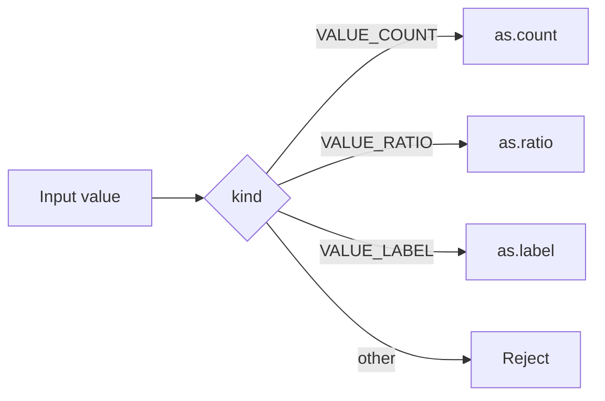

<TLDR>
  <TLDRCell label="what">
    A struct stores all of its members, a union reuses one region of storage for several members, and an enum names integer states.
  </TLDRCell>
  <TLDRCell label="trap">
    Padding, alignment, enum width, and bit-field layout can be implementation-defined, while a union's type tag must always match its current member.
  </TLDRCell>
  <TLDRCell label="fix">
    Inspect local layouts with `sizeof`, `alignof`, and `offsetof`, use tagged unions for alternatives, and encode external data field by field.
  </TLDRCell>
</TLDR>

## What it is and why it exists

A <Term id="structure-type">structure type</Term> combines named members, possibly of different types, into one record. Every struct object contains all of its members at once; a product, for example, can hold an identifier, a price, and inventory together. Assigning, passing, or returning a struct copies the complete struct value.

A <Term id="c-union">union</Term> also declares named members, but those members reuse the same storage. A union object usually represents one alternative at a time, so it suits mutually exclusive data rather than several simultaneously valid fields. After you write one member, the value previously represented by another member is generally no longer usable.

A <Term id="c-enumeration">C enumeration</Term> names integer constants and declares an enum type. Enums work well for opcodes, states, and union discriminants, but a C enum is not a closed algebraic type restricted to the listed values. Integers from files, networks, and casts still need validation at the boundary.

The three mechanisms often work together. A struct holds common fields, an enum identifies the current alternative, and a union stores only that alternative's payload. This combination is a <Term id="tagged-union">tagged union</Term>, the usual C representation of a variant value.

| Mechanism | What one object stores | Main use | Contract you maintain |
|---|---|---|---|
| `struct` | Every member | Records, contexts, data-structure nodes | Layout and member ownership |
| `union` | One region usable by any member | Alternative payloads, representation interfaces | Current member |
| `enum` | A value of an implementation-selected integer type | Named states, opcodes, discriminants | Valid value set |

You meet these types in system-call parameters, protocol parsers, device registers, abstract syntax trees, and foreign-function interfaces. Once data crosses a file, process, compiler, or machine boundary, identical-looking declarations do not guarantee identical binary layouts; the external format needs its own explicit contract.

## How it works

The core of a tagged union is not its syntax but the invariant connecting its tag and payload. Write paths set both together; read, copy, and destruction paths inspect the tag before selecting the same member.



Each valid branch in the diagram may read only its corresponding member. If the payload owns a resource, that branch must also decide how to copy and release it; the tag selects a rule but does not perform resource management itself.

### Structure types and members

The declaration `struct Product { ... };` creates a tagged structure type. Tags occupy a separate tag namespace, so without a `typedef` you write `struct Product`. The declaration `typedef struct Product Product;` also places `Product` in the ordinary identifier namespace, letting later declarations use the shorter name.

Members have increasing addresses in declaration order. An implementation may insert <Term id="padding-byte">padding bytes</Term> between members and at the end of the object to satisfy member alignment and struct-array alignment, but it does not add padding before the first member. Consequently, `sizeof(struct S)` covers all members but need not equal the sum of their sizes.

The dot operator, `object.member`, accesses a member through a struct or union object. The arrow operator, `pointer->member`, is equivalent to `(*pointer).member` when the pointer is valid and points to the corresponding object. A `const Product *` prevents modification through that pointer but does not extend the object's lifetime.

A struct may contain another complete struct, and it may contain a pointer to its own type. It cannot directly contain an object of its own type because that would require infinite size; `struct Node *next` in a linked-list node works because the pointer type has a finite size.

### Shared union storage

A union is large enough for its largest member and aligned suitably for every member; it may also have tail padding. Every member begins at the same address as the union object, but its type determines how much storage an access uses and how those bits are interpreted.

The most recently written member is commonly called the current or active member. C does not store that state for you, so a bare `union` cannot answer “which member should I read now?” The program must preserve that invariant through a separate enum, a protocol field, or control flow.

Reading a member other than the one most recently written reinterprets the relevant <Term id="object-representation">object representation</Term> as the new type. C permits this form of type punning, but the result can depend on representations and may even be a trap representation; it is not portable serialization or byte-order conversion. To copy a scalar's bytes, use `memcpy` into an object of a suitable type, then handle byte order and the external format separately.

When a union contains several structs whose compatible members form a common initial sequence, C permits inspection of that common part through either corresponding struct member. This is a narrow exception: it does not establish arbitrary layout compatibility or replace an explicit discriminant.

### Enums and discriminants

Enumerators are compile-time integer constants. Without explicit values, the first starts at `0` and each following value is one greater than the previous one; explicit values may repeat or leave gaps. If an external protocol specifies the numbers, assign each one explicitly so inserting a new member cannot silently change the interface.

An enum is a distinct type compatible with a character, signed integer, or unsigned integer type selected according to the implementation and representable values. Do not assume `sizeof(enum State) == sizeof(int)`, and do not mix a compiler's short-enum mode into builds that lack one shared ABI configuration.

A `switch` can help the compiler find omitted branches, but a data boundary still needs prior validation or a `default`. Internal exhaustive logic often omits `default` deliberately so strict warnings report a new enumerator; code handling untrusted integers needs a rejection path.

### Copying, pointers, and ownership

Struct assignment copies the value of every member, including complete array members. Pointer members copy only their addresses, so two struct copies may still point to the same allocation. This is a <Term id="shallow-copy">shallow copy</Term>, not an automatic copy of the pointed-to object.

A struct containing owning pointers must define initialization, copying, transfer, and destruction conventions. C does not call destructors automatically; if both shallow copies call `free`, the result is a double free, while releasing neither leaks the allocation. The simplest design often forbids ordinary copying and provides clearly named clone and release functions.

Passing a small struct by value can express an independent value, while passing a pointer lets a function modify the original or avoid copying a larger record. Choose for performance only after considering the calling convention and measuring; the interface must first define nullability, lifetime, aliasing, and ownership.

### Initialization and update order

An initializer can supply values in member declaration order, while a designated initializer uses `.member = value` to name a target. Remaining members omitted from an aggregate initializer receive the language's aggregate initialization; this differs from declaring an automatic object and later assigning only some members, which can leave other members uninitialized.

A union initializer can initialize only one member. Without a designator it selects the first member; if that is not the intended alternative, name the member and set the containing struct's discriminant at the same time.

Updating a tagged union must account for cleanup of the old payload. If the old member owns memory, release it according to the old tag, construct the new member, and only then publish the new tag; when allocation fails, the API must say whether the object retains its old value, becomes empty, or reports an error.

Zeroing the entire object does not replace those state transitions. An all-zero state is meaningful only if the type design explicitly declares it a valid empty state, and an old resource-owning payload still needs to be released first.

Public constructor functions should return complete values that already satisfy the invariant, not require callers to perform hidden member-setting steps. A mutator that can fail should report failure through its return value and document the object's post-failure state.

Reader functions can accept `const` pointers, both expressing non-modification and centralizing validation. Public writable members are concise, but they make every call site responsible again for tag synchronization, range checks, and ownership.

This encapsulation does not require hiding the struct definition; even with a public layout, an API can establish that only a small set of functions changes alternatives. The compiler will not enforce the convention, so tests and review must still catch writes that bypass it.

## Examples

The following programs progress from an ordinary struct to an enum-tagged union and then to byte encoding independent of memory layout. Each was compiled locally with GCC 13.3.0 using `-std=c2x -Wall -Wextra -Wconversion -Wpedantic -Werror`; the output shown is from those executions.

### Mutating a struct while keeping a snapshot

The product record stores a fixed-size identifier and two unsigned integers in one object. `reserve` receives a pointer so it can update the original inventory, while assignment to `snapshot` copies the array and integer members.

<Depth level="quick">

```c title="product.c"
#include <stdbool.h>
#include <stdio.h>

typedef struct {
    char sku[8];
    unsigned price_cents;
    unsigned stock;
} Product;

static bool reserve(Product *product, unsigned quantity) {
    if (product == NULL || quantity > product->stock) {
        return false;
    }
    product->stock -= quantity;
    return true;
}

int main(void) {
    Product cable = {"CBL-2M", 1299u, 4u};
    Product snapshot = cable;

    printf("before: %s stock=%u\n", cable.sku, cable.stock);
    printf("reserved: %s\n", reserve(&cable, 2u) ? "yes" : "no");
    printf("after: stock=%u snapshot=%u\n", cable.stock, snapshot.stock);
    return 0;
}
```

```text
before: CBL-2M stock=4
reserved: yes
after: stock=2 snapshot=4
```

</Depth>

`reserve` first checks the null and inventory boundaries, then modifies the caller's object through `->`. After it returns, `cable.stock` is `2`, while the struct copy still has `snapshot.stock` equal to `4`.

The array member stores the characters themselves, so struct assignment copies the identifier. If the member were `char *sku`, assignment would copy only the pointer and both records would share the same string and lifetime.

### Guarding union access with an enum

`ValueKind` is the discriminant, and the `as` union holds its payload. Each initializer sets both together, and the reader touches a member only in its matching branch.

```c title="tagged_value.c"
#include <stdio.h>

typedef enum {
    VALUE_COUNT,
    VALUE_RATIO,
    VALUE_LABEL
} ValueKind;

typedef struct {
    ValueKind kind;
    union {
        int count;
        double ratio;
        const char *label;
    } as;
} Value;

static void print_value(const Value *value) {
    switch (value->kind) {
        case VALUE_COUNT:
            printf("count=%d\n", value->as.count);
            break;
        case VALUE_RATIO:
            printf("ratio=%.3f\n", value->as.ratio);
            break;
        case VALUE_LABEL:
            printf("label=%s\n", value->as.label);
            break;
        default:
            puts("invalid value");
            break;
    }
}

int main(void) {
    Value pending = {VALUE_COUNT, {.count = 7}};
    Value progress = {VALUE_RATIO, {.ratio = 0.625}};
    Value state = {VALUE_LABEL, {.label = "ready"}};

    print_value(&pending);
    print_value(&progress);
    print_value(&state);
    return 0;
}
```

```text
count=7
ratio=0.625
label=ready
```

The `.count`, `.ratio`, and `.label` designators make the selected members visible at construction. Larger APIs usually provide constructors such as `value_from_count` as well, preventing callers from setting the tag and payload separately.

`VALUE_LABEL` contains a borrowed pointer and does not own the string. If a label comes from an allocation, the copy and destruction contract must also say who frees it; the discriminant does not settle ownership.

### Encoding an external format explicitly

The in-memory `FrameHeader` is convenient for computation, but the wire format explicitly specifies a two-byte big-endian kind followed by a four-byte big-endian length. The encoder writes those six bytes field by field, so it does not depend on struct padding, host byte order, or `sizeof(FrameHeader)`.

```c title="wire_header.c"
#include <stdbool.h>
#include <stdint.h>
#include <stdio.h>

typedef struct {
    uint16_t kind;
    uint32_t length;
} FrameHeader;

static void encode_header(const FrameHeader *header, uint8_t out[6]) {
    out[0] = (uint8_t)(header->kind >> 8);
    out[1] = (uint8_t)header->kind;
    out[2] = (uint8_t)(header->length >> 24);
    out[3] = (uint8_t)(header->length >> 16);
    out[4] = (uint8_t)(header->length >> 8);
    out[5] = (uint8_t)header->length;
}

static bool decode_header(const uint8_t in[6], FrameHeader *header) {
    header->kind = (uint16_t)((uint16_t)in[0] << 8 | in[1]);
    header->length = (uint32_t)in[2] << 24 |
                     (uint32_t)in[3] << 16 |
                     (uint32_t)in[4] << 8 |
                     (uint32_t)in[5];
    return header->length <= 4096u;
}

int main(void) {
    const FrameHeader outbound = {2u, 1234u};
    uint8_t wire[6];
    FrameHeader inbound = {0};

    encode_header(&outbound, wire);
    printf("wire: %02X %02X %02X %02X %02X %02X\n",
           wire[0], wire[1], wire[2], wire[3], wire[4], wire[5]);
    printf("valid: %s\n", decode_header(wire, &inbound) ? "yes" : "no");
    printf("kind=%u length=%u\n",
           (unsigned)inbound.kind, (unsigned)inbound.length);
    return 0;
}
```

```text
wire: 00 02 00 00 04 D2
valid: yes
kind=2 length=1234
```

Casting to `uint32_t` before shifting prevents integer promotion from performing a left shift into an unrepresentable signed `int` value. The decoder also rejects lengths above `4096`, but a real protocol must still validate the kind, remaining buffer length, and later allocation limits.

Do not cast the input byte pointer directly to `FrameHeader *`. That approach combines alignment, effective-type, padding, and byte-order assumptions, and it also reads out of bounds when the input is truncated.

## Pitfalls

> [!PITFALL]
> Treating struct size as the sum of member sizes ignores internal or tail padding; presenting one machine's result as a language guarantee is equally wrong.

**Fix:** Inspect the active target with `sizeof`, `alignof`, and `offsetof`. Add static assertions only when an ABI, file, or hardware contract truly requires a fixed layout, and verify every supported target separately.

> [!PITFALL]
> Changing a union payload without synchronizing its discriminant makes a reader interpret storage as the wrong type; changing only the tag without constructing the new payload has the same defect.

**Fix:** Maintain the tag and payload together through constructor and accessor functions rather than exposing raw write access everywhere. Test every alternative, an unknown tag, and destruction after changing alternatives.

> [!PITFALL]
> Using a union, bit fields, a `packed` attribute, or `fwrite(&record, sizeof record, 1, file)` to define a wire or disk format turns compiler layout and host byte order into an implicit protocol.

**Fix:** Specify field widths, byte order, and length rules for the external format, then encode and decode each field. Compiler extensions belong only at local boundaries constrained to one controlled ABI.

> [!PITFALL]
> Ordinary struct assignment shallow-copies owning pointers. Two copies may later free the same address, or one may release it and leave the other with a dangling pointer.

**Fix:** Distinguish owning pointers from borrowed pointers and provide initialization, clone, and destruction functions for owning records. A failed copy must keep the source valid and clean up any members already copied.

> [!PITFALL]
> When an enum object originates as an untrusted integer, a `switch` cannot assume it equals one of the enumerators. Array indexes, function-table indexes, and union dispatch are especially vulnerable to out-of-range values or wrong-member reads.

**Fix:** Validate the number before conversion or indexing and preserve a rejection branch at external boundaries. If enumerator values contain gaps, match the values individually rather than checking only a minimum and maximum.

> [!PITFALL]
> Comparing two structs with `memcmp` includes padding bytes. Even when corresponding members compare equal, padding can hold different unspecified values.

**Fix:** Compare semantic values member by member, choosing domain-appropriate rules for strings, floating-point values, and pointers. Hashing, persistence, and cross-process comparison likewise cannot rely directly on object representations.

<Depth level="deep">

## Memory layout and ABI boundaries

An alignment requirement restricts the addresses where an object can be placed. `alignof(T)` reports type `T`'s alignment, `offsetof(T, member)` reports an ordinary member's byte offset from the object start, and `sizeof(T)` includes tail padding needed between adjacent array elements. Read size, alignment, and offsets as one layout description.

Reordering members can sometimes reduce padding, but it also changes the ABI, initializer order, and readability. A struct already exposed in a public header, persistent format, or FFI cannot be casually reordered to save a few bytes. When space matters, record the target, object count, and measured layout before changing the interface.

`_Static_assert` can turn a target-ABI assumption such as an `offsetof` or `sizeof` result into a compile-time check. It proves only that the current build configuration satisfies the condition; it does not promote an implementation-specific layout into a portable language guarantee. Compiler flags, preprocessor definitions, bitness, and packing settings must all belong to the same ABI contract.

A foreign-function interface also needs agreement on field types, calling convention, and both compilers' layout rules. Fixed-width integers solve integer width only; they do not remove padding or specify enum and bit-field layouts. The safest boundaries usually use simple scalars, explicit lengths, and opaque pointers.

### Padding, representations, and initialization

An object's object representation contains the bits that participate in its value and may contain padding. Assigning every member does not mean all padding acquires stable bytes, so hashing, comparing, or writing the whole object can produce non-portable results and can disclose old data left in the same storage.

`memset(&record, 0, sizeof record)` sets every byte in this object to zero, but an all-bits-zero representation is not guaranteed to denote the zero value of every type; do not generalize it to arbitrary pointer or floating representations. Use an initializer when you need semantic zero initialization, and encode an external format when you need specified zero bytes.

C permits inspecting any object's bytes through a character type. Inspection does not create a stable format: byte order, padding, type width, and floating representation can still vary. Diagnostic tools may display the current implementation, while protocol code must define a representation outside that implementation.

### Bit fields are not wire formats

Bit fields let struct members occupy a specified number of bits and can serve compact internal state. The allocation unit, bit ordering, whether a field can cross a unit, and behavior of some base types can be implementation-defined, so one declaration does not automatically map to bit numbers in a packet or hardware manual.

You cannot apply unary `&` to a bit-field member, nor apply `sizeof` or `alignof` directly to it. Concurrent access to neighboring bit fields must also account for whether they occupy the same memory location; an ordinary read-modify-write is not atomic.

For external registers and protocol fields, unsigned integers with explicit masks and shifts are usually easier to review. First promote input into an unsigned type wide enough for the operation, so integer promotion, signed right shift, or an out-of-range shift cannot change the meaning.

### Flexible array members

A <Term id="flexible-array-member">flexible array member</Term> is an incomplete array in the last position of a struct, such as `unsigned char data[]`. The struct must have at least one other named member, and its `sizeof` excludes storage for the array elements, though it may include padding up to the array member's offset.

These objects are usually allocated as `sizeof(Header) + count * sizeof(element)` and accessed through a pointer. Before allocation, verify that the multiplication and addition cannot exceed `SIZE_MAX`, and enforce protocol or business limits on `count`. Once allocated, the object has the same explicit release responsibility as other dynamic storage.

Assigning a struct with a flexible array member copies only the fixed portion, not the trailing elements. Passing it by value or placing it in an array is misleading, so interfaces normally pass a pointer together with a separately validated total size.

Do not treat the old `data[1]` struct hack or a zero-length array as equivalent standard syntax. The former changes `sizeof` and invites an off-by-one allocation formula, while the latter is commonly a compiler extension; new code should use a standard flexible array member.

### Evolving enums and unions

Inserting an auto-numbered member into a published enum changes later numeric values. Adding an alternative to a tagged union requires coordinated updates to construction, copying, comparison, serialization, dispatch, and destruction; a successful build alone does not prove that every consumer understands the new tag.

Persistent and interprocess interfaces should assign discriminant numbers explicitly and treat unknown numbers as an expected versioning case. A receiver can reject them, skip a length-delimited unknown payload, or retain raw data, but it must not silently enter an existing union branch.

Omitting `default` from an internal `switch` while enabling exhaustive-enum warnings helps expose missing branches when a member is added. Validate an external integer as a known value before passing it to that internal exhaustive function, preserving both forward-compatible error handling and compile-time coverage checks.

</Depth>

<Checkpoint id="cpp/c-structs-unions" />

## Further reading

- [GCC manual: C dialect options](https://gcc.gnu.org/onlinedocs/gcc/C-Dialect-Options.html)
- [cppreference: C struct declaration](https://en.cppreference.com/w/c/language/struct.html)
- [cppreference: C union declaration](https://en.cppreference.com/w/c/language/union.html)
- [cppreference: C enum declaration](https://en.cppreference.com/w/c/language/enum.html)
- [cppreference: C object representation and alignment](https://en.cppreference.com/w/c/language/object.html)
