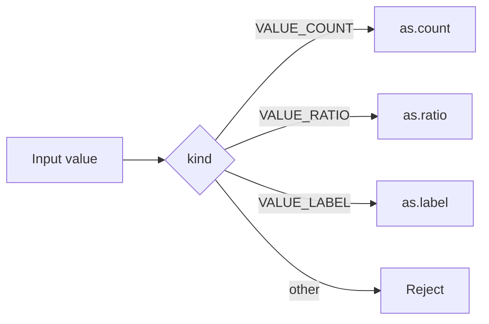

<TLDR>
  <TLDRCell label="what">
    结构体让多个成员各自保存值，联合体让多个成员重用同一块存储，枚举则为整数状态命名。
  </TLDRCell>
  <TLDRCell label="trap">
    填充、对齐、枚举宽度和位域布局都可能由实现决定；联合体还必须让类型标记与当前成员保持一致。
  </TLDRCell>
  <TLDRCell label="fix">
    用`sizeof`、`alignof`和`offsetof`验证本机布局，用带标记联合体表达互斥值，并逐字段编码外部数据。
  </TLDRCell>
</TLDR>

## 是什么，为什么存在

<Term id="structure-type">结构体类型（structure type）</Term>把一组有名称、可能类型不同的成员组合成一个记录。每个结构体对象同时包含所有成员，例如商品可以同时包含编号、价格和库存。赋值、传参或返回结构体时，C会按值复制整个结构体值。

<Term id="c-union">联合体（union）</Term>也声明一组有名称的成员，但这些成员重用同一块存储。一个联合体对象通常只用来表示其中一种形态，因此它适合存放互斥数据，而不适合把几个同时有效的字段挤在一起。写入一个成员后，先前成员所表示的值通常不再可用。

<Term id="c-enumeration">C枚举（C enumeration）</Term>给整数常量命名，并声明一个枚举类型。它适合表示操作码、状态和联合体的判别值，但C枚举并不是只能保存列出取值的封闭代数类型。来自文件、网络或强制转换的整数仍然需要边界检查。

三种机制经常配合使用。结构体保存共同字段，枚举说明当前形态，联合体只为该形态保存载荷。这种组合叫作<Term id="tagged-union">带标记联合体（tagged union）</Term>，也是C中表达变体值最常见的方式。

| 机制 | 一个对象中保存什么 | 主要用途 | 需要维护的契约 |
|---|---|---|---|
| `struct` | 所有成员 | 记录、上下文、数据结构节点 | 布局、成员所有权 |
| `union` | 一块可供任一成员使用的存储 | 互斥载荷、底层表示接口 | 当前成员 |
| `enum` | 一个实现所选整数类型的值 | 具名状态、操作码、判别值 | 有效取值范围 |

你会在系统调用参数、协议解析器、设备寄存器、抽象语法树和跨语言接口中遇到它们。只要数据要跨文件、进程、编译器或机器边界，声明看起来相同并不代表二进制布局相同；外部格式必须另有明确契约。

## 工作原理

带标记联合体的关键不是语法，而是标签与载荷之间始终成立的不变量。写入路径必须一起设置两者，读取、复制和销毁路径则先检查标签，再选择同一个成员。



图中的每条合法分支只能读取对应成员。若载荷拥有资源，同一分支还必须决定如何复制和释放该资源；标签只选择规则，本身不会执行资源管理。

### 结构体的类型与成员

声明`struct Product { ... };`创建一个带标签的结构体类型。标签位于单独的标签命名空间，所以没有`typedef`时要写`struct Product`。`typedef struct Product Product;`可以再把`Product`放进普通标识符命名空间，之后用短名称声明对象。

成员按声明顺序排列，后声明的普通成员地址更高。实现可以在成员之间以及对象末尾插入<Term id="padding-byte">填充字节（padding byte）</Term>，以满足各成员及结构体数组的对齐要求，但不会在第一个成员之前插入填充。因而`sizeof(struct S)`至少覆盖所有成员，却不保证等于成员`sizeof`之和。

点运算符`object.member`从结构体或联合体对象访问成员。箭头运算符`pointer->member`等价于`(*pointer).member`，前提是指针有效并指向相应对象。`const Product *`禁止通过该指针修改成员，但不会延长对象生命周期。

结构体可以包含另一个完整结构体，也可以包含指向自身类型的指针。它不能直接包含自身类型的对象，因为那会要求无限大小；链表节点中的`struct Node *next`可以成立，是因为指针类型自身大小有限。

### 联合体的共享存储

联合体的大小足以容纳最大的成员，并满足每个成员的对齐要求；它还可能带有尾部填充。所有成员从联合体对象的同一地址开始，但成员类型决定一次访问会解释多少存储以及如何解释其中的位。

最近一次写入的成员通常被称为当前成员或活动成员。C语言没有替你保存这个状态，所以裸`union`无法回答“现在应读哪个成员”。程序必须通过独立枚举、协议字段或控制流维护这个不变量。

读取不同于最近写入成员的另一个成员，会把相应<Term id="object-representation">对象表示（object representation）</Term>按新类型重新解释。C允许这种形式的类型双关，但结果可能依赖表示方式，甚至可能产生陷阱表示；它不适合作为可移植序列化或字节序转换方案。要复制标量的原始字节，应使用`memcpy`复制到适当类型的对象，并单独处理端序和格式。

联合体包含多个结构体，而且这些结构体以兼容成员组成共同初始序列时，标准允许通过任一对应结构体成员检查这段共同部分。该规则范围很窄，不能推广为任意布局兼容，也不能替代显式判别值。

### 枚举与判别值

枚举器是编译期整数常量。未显式赋值时，第一个枚举器从`0`开始，之后每个值在前一个值上加`1`；显式值可以重复，也可以留下空档。若外部协议规定数字，应逐项写出值，避免插入新成员后悄悄改变接口。

枚举类型是与某个字符、有符号整数或无符号整数类型兼容的独立类型，具体选择受实现和取值范围影响。不要假设`sizeof(enum State) == sizeof(int)`，也不要把编译器的短枚举选项混入没有统一ABI配置的构建。

`switch`可以让编译器帮助发现遗漏分支，但数据边界仍需要`default`或预先验证。内部穷举逻辑常故意省略`default`，以便严格警告指出新增枚举器；处理不可信整数时则应保留拒绝路径。

### 复制、指针与所有权

结构体赋值会复制每个成员的值，数组成员也随结构体一起复制。指针成员只复制地址，所以两个结构体副本仍可能指向同一分配区。这是<Term id="shallow-copy">浅拷贝（shallow copy）</Term>，不是自动复制被指向的对象。

包含拥有型指针的结构体必须说明初始化、复制、移动式转交和销毁约定。C不会自动调用析构函数；若两个浅副本都执行`free`，会发生双重释放，若谁都不释放则会泄漏。最简单的设计通常是禁止普通复制，并提供命名明确的克隆与释放函数。

按值传递小型结构体能表达独立值，传入指针则允许修改原对象或避免复制较大记录。性能选择应以调用约定和测量为依据；接口首先要明确空指针、生命周期、别名和所有权规则。

### 初始化与更新顺序

初始化器按成员声明顺序提供值，指定初始化器则用`.member = value`指明目标成员。没有显式初始化的剩余成员会按聚合初始化规则初始化；这不同于先声明一个自动对象，再只给其中几个成员赋值，后者可能留下未初始化成员。

联合体初始化器只能为一个成员提供初值。未使用指定初始化器时，它初始化第一个成员；若第一个成员不是所需形态，应明确写出成员名称，并同时设置外层结构体中的判别值。

更新带标记联合体时，顺序必须考虑旧载荷的清理。若旧成员拥有内存，应先按旧标签释放，再构造新成员，最后发布新标签；发生分配失败时，接口还要定义对象保持旧值、变为空值还是返回错误。

把整个对象先清零并不能代替这些状态转换。零值只有在类型设计明确把全零表示定义成合法空状态时才有意义，而且拥有资源的旧载荷仍然必须先释放。

公共构造函数应返回已经满足不变量的完整值，而不是要求调用方按若干隐藏步骤填成员。修改函数若可能失败，应通过返回值报告失败，并把失败后的对象状态写进接口契约。

读取函数可以接收`const`指针，既表达不修改，也让同一验证逻辑集中在一处。直接公开可写成员虽然简短，却会让每个调用点都重新承担标签同步、范围检查和所有权处理。

这种封装不要求隐藏结构体定义；即使布局公开，也可以约定只有一组函数负责改变形态。编译器不会强制该约定，因此测试和代码审查仍要覆盖绕过接口的写入。

## 示例

下面三个程序依次展示普通结构体、枚举标记的联合体，以及独立于内存布局的字节编码。它们都以本地GCC 13.3.0的`-std=c2x -Wall -Wextra -Wconversion -Wpedantic -Werror`编译，输出来自实际运行结果。

### 修改结构体并保留快照

商品记录把固定长度编号和两个无符号整数放在同一对象中。`reserve`接收指针以修改原库存，而赋值给`snapshot`会复制数组成员和整数成员。

<Depth level="quick">

```c title="product.c"
#include <stdbool.h>
#include <stdio.h>

typedef struct {
    char sku[8];
    unsigned price_cents;
    unsigned stock;
} Product;

static bool reserve(Product *product, unsigned quantity) {
    if (product == NULL || quantity > product->stock) {
        return false;
    }
    product->stock -= quantity;
    return true;
}

int main(void) {
    Product cable = {"CBL-2M", 1299u, 4u};
    Product snapshot = cable;

    printf("before: %s stock=%u\n", cable.sku, cable.stock);
    printf("reserved: %s\n", reserve(&cable, 2u) ? "yes" : "no");
    printf("after: stock=%u snapshot=%u\n", cable.stock, snapshot.stock);
    return 0;
}
```

```text
before: CBL-2M stock=4
reserved: yes
after: stock=2 snapshot=4
```

</Depth>

`reserve`先检查空指针和库存边界，再通过`->`修改调用方对象。函数返回后，`cable.stock`已变成`2`，但结构体副本中的`snapshot.stock`仍然是`4`。

这里的数组成员保存字符本身，因此结构体赋值会复制编号。如果成员改成`char *sku`，赋值只会复制指针，两个记录将共享同一字符串及其生命周期。

### 用枚举保护联合体访问

`ValueKind`是判别值，`as`联合体保存对应载荷。每个构造式初始化都同时设置二者，读取函数则只在匹配分支访问成员。

```c title="tagged_value.c"
#include <stdio.h>

typedef enum {
    VALUE_COUNT,
    VALUE_RATIO,
    VALUE_LABEL
} ValueKind;

typedef struct {
    ValueKind kind;
    union {
        int count;
        double ratio;
        const char *label;
    } as;
} Value;

static void print_value(const Value *value) {
    switch (value->kind) {
        case VALUE_COUNT:
            printf("count=%d\n", value->as.count);
            break;
        case VALUE_RATIO:
            printf("ratio=%.3f\n", value->as.ratio);
            break;
        case VALUE_LABEL:
            printf("label=%s\n", value->as.label);
            break;
        default:
            puts("invalid value");
            break;
    }
}

int main(void) {
    Value pending = {VALUE_COUNT, {.count = 7}};
    Value progress = {VALUE_RATIO, {.ratio = 0.625}};
    Value state = {VALUE_LABEL, {.label = "ready"}};

    print_value(&pending);
    print_value(&progress);
    print_value(&state);
    return 0;
}
```

```text
count=7
ratio=0.625
label=ready
```

指定初始化器`.count`、`.ratio`和`.label`让所选成员在构造点可见。更大型接口通常再提供`value_from_count`之类的构造函数，避免调用方分别设置标签和载荷。

`VALUE_LABEL`保存的是借用指针，不拥有字符串。若标签来自动态分配区，类型的复制和销毁约定还必须说明谁负责释放；判别值本身解决不了所有权问题。

### 显式编码外部格式

内存中的`FrameHeader`便于计算，但线上格式明确规定为两个大端字节的类型和四个大端字节的长度。编码器逐字段写出六个字节，因此不依赖结构体填充、宿主端序或`sizeof(FrameHeader)`。

```c title="wire_header.c"
#include <stdbool.h>
#include <stdint.h>
#include <stdio.h>

typedef struct {
    uint16_t kind;
    uint32_t length;
} FrameHeader;

static void encode_header(const FrameHeader *header, uint8_t out[6]) {
    out[0] = (uint8_t)(header->kind >> 8);
    out[1] = (uint8_t)header->kind;
    out[2] = (uint8_t)(header->length >> 24);
    out[3] = (uint8_t)(header->length >> 16);
    out[4] = (uint8_t)(header->length >> 8);
    out[5] = (uint8_t)header->length;
}

static bool decode_header(const uint8_t in[6], FrameHeader *header) {
    header->kind = (uint16_t)((uint16_t)in[0] << 8 | in[1]);
    header->length = (uint32_t)in[2] << 24 |
                     (uint32_t)in[3] << 16 |
                     (uint32_t)in[4] << 8 |
                     (uint32_t)in[5];
    return header->length <= 4096u;
}

int main(void) {
    const FrameHeader outbound = {2u, 1234u};
    uint8_t wire[6];
    FrameHeader inbound = {0};

    encode_header(&outbound, wire);
    printf("wire: %02X %02X %02X %02X %02X %02X\n",
           wire[0], wire[1], wire[2], wire[3], wire[4], wire[5]);
    printf("valid: %s\n", decode_header(wire, &inbound) ? "yes" : "no");
    printf("kind=%u length=%u\n",
           (unsigned)inbound.kind, (unsigned)inbound.length);
    return 0;
}
```

```text
wire: 00 02 00 00 04 D2
valid: yes
kind=2 length=1234
```

转成`uint32_t`后再左移，避免较窄整数提升后在有符号`int`中移入不可表示范围。解码器还拒绝大于`4096`的长度，但真实协议仍需验证类型范围、缓冲区剩余长度和后续分配上限。

不要用强制转换把输入字节指针直接变成`FrameHeader *`。那种写法同时引入对齐、有效类型、填充和端序假设，输入长度不足时还会越界读取。

## 陷阱

> [!PITFALL]
> 把结构体大小写成成员大小之和，会漏掉内部或尾部填充；把一次机器上的结果写成语言保证也同样错误。

**修复：** 在当前目标上用`sizeof`、`alignof`和`offsetof`检查布局。只有ABI、文件或硬件契约确实要求固定布局时才写静态断言，并为每个受支持目标单独验证。

> [!PITFALL]
> 修改联合体载荷却忘记同步判别值，会让读取函数按错误类型解释存储；只改标签而没构造新载荷也有同样问题。

**修复：** 通过构造函数和访问函数同时维护标签与载荷，不把裸成员写权限暴露给所有调用方。测试每种形态、未知标签以及形态切换后的销毁路径。

> [!PITFALL]
> 用联合体、位域、`packed`属性或`fwrite(&record, sizeof record, 1, file)`定义网络和磁盘格式，会把编译器布局与本机端序变成隐含协议。

**修复：** 把外部格式写成明确的字段宽度、字节序和长度规则，再逐字段编码与解码。编译器扩展只适合由同一ABI严格控制的局部边界。

> [!PITFALL]
> 普通结构体赋值会浅拷贝拥有型指针。两个副本随后可能重复释放同一地址，或一个副本释放后让另一个留下悬空指针。

**修复：** 明确区分拥有指针与借用指针，为拥有型记录提供初始化、克隆和销毁函数。复制失败时也要保持原对象有效，并清理已经复制的成员。

> [!PITFALL]
> 枚举变量来自不可信整数时，`switch`不能假定它一定等于某个枚举器。数组索引、函数表索引和联合体分派尤其容易因此越界或读错成员。

**修复：** 在转换或索引前验证数值范围，并在外部输入路径保留拒绝未知值的分支。若枚举值有空档，应逐项匹配，而不是只检查最小值和最大值。

> [!PITFALL]
> 对两个结构体使用`memcmp`判断值相等，会把填充字节也纳入比较。即使对应成员都相等，填充中的未指定值也可能不同。

**修复：** 逐成员比较语义值，并为字符串、浮点数和指针选择符合领域含义的比较方式。哈希、持久化和跨进程比较同样不能直接依赖对象表示。

<Depth level="deep">

## 内存布局与ABI边界

对齐要求限制对象可以放置的地址。`alignof(T)`给出类型`T`的对齐要求，`offsetof(T, member)`给出普通成员相对对象起点的字节偏移。`sizeof(T)`则包括数组相邻元素所需的尾部填充，所以`sizeof`、`alignof`和偏移必须作为一组理解。

成员重排有时能减小填充，但它也会改变ABI、初始化器顺序和可读性。已经出现在公共头文件、持久化格式或FFI中的结构体不能只为节省几个字节就随意重排。若空间确实重要，应先记录目标、对象数量和实测布局，再决定是否改变接口。

`_Static_assert`可以把某个目标ABI的假设变成编译期检查，例如验证`offsetof`或`sizeof`。它证明的只是当前编译配置满足条件，不会把实现相关布局升级为可移植语言规则。编译器选项、预处理宏、位数和打包设置都应属于同一份ABI契约。

跨语言接口还要核对字段类型、调用约定和两侧编译器的布局规则。固定宽度整数只解决整数宽度，不会自动取消填充，也不会规定枚举和位域布局。最稳妥的边界通常使用简单标量、显式长度和不透明指针。

### 填充、表示与初始化

一个对象的对象表示包含组成值的位，也可能包含填充。给每个成员赋值并不意味着所有填充都取得稳定字节值，所以整块哈希、比较或写盘可能得到不可移植结果，还可能泄露同一存储先前留下的数据。

`memset(&record, 0, sizeof record)`能把当前对象的全部字节清零，但全零位模式不保证代表每种类型的零值，尤其不应把这条做法推广到任意指针或浮点表示。若只是得到语义上的零初始化，应使用初始化器；若外部格式要求零字节，应编码那个格式，而不是猜测对象表示。

按字符类型观察任意对象的字节是C提供的底层能力。观察不等于得到稳定格式：字节顺序、填充、类型宽度和浮点表示仍可能变化。诊断工具可以显示当前实现，协议代码则必须规定实现之外的表示。

### 位域不是线缆格式

位域能让结构体成员占用指定数量的位，适合实现内部紧凑状态。分配单元、位的排列方向、能否跨越单元以及某些基础类型的行为都可能由实现决定，因此同一声明不能自动映射到网络包或硬件手册中的位编号。

位域成员不能用一元`&`取得地址，`sizeof`和`alignof`也不能直接作用于位域。并发访问相邻位域还要考虑它们是否位于同一个内存位置；普通读改写不是原子操作。

对外部寄存器或协议字段，使用无符号整数、掩码和移位明确取位通常更可审查。还要先把输入放进具有足够宽度的无符号类型，避免整数提升、有符号右移或越界移位改变含义。

### 柔性数组成员

<Term id="flexible-array-member">柔性数组成员（flexible array member）</Term>是结构体最后一个成员处的不完整数组，例如`unsigned char data[]`。结构体必须至少还有一个具名成员，而且`sizeof`不包含数组元素所需空间，但可能包含到该成员偏移处为止的填充。

这类对象通常按`sizeof(Header) + count * sizeof(element)`分配，再用指针访问末尾元素。计算前必须验证乘法与加法不会超过`SIZE_MAX`，还要确认输入`count`没有超过协议或业务上限。分配成功后，对象的释放责任与普通动态分配相同。

含柔性数组成员的结构体赋值只复制固定部分，不会复制尾随元素。把它按值传递或放进数组也会制造误导，接口通常应只传指针和单独验证过的总大小。

不要把旧式`data[1]`或零长度数组当作等价的标准写法。前者会影响`sizeof`并容易让分配公式错一项，后者通常是编译器扩展；新代码应使用标准柔性数组成员。

### 枚举和联合体的演进

给已发布枚举插入自动编号的成员，会改变后续数值。给带标记联合体新增形态，则要求构造、复制、比较、序列化、分派和销毁路径一起更新；只让编译通过不能证明所有消费者都理解新标签。

持久化或进程间接口应显式固定判别数字，并把未知数字当作可预期的版本情况处理。接收方可以拒绝、跳过带长度的未知载荷，或保留原始数据，但不能默认进入某个已有联合体分支。

内部`switch`省略`default`并开启枚举穷举警告，有助于新增成员时暴露遗漏。外部边界先把整数验证为已知值，再交给内部穷举函数，可以同时得到前向兼容的错误处理和编译期覆盖检查。

</Depth>

<Checkpoint id="cpp/c-structs-unions" />

## 延伸阅读

- [GCC手册：C方言选项](https://gcc.gnu.org/onlinedocs/gcc/C-Dialect-Options.html)
- [cppreference：C结构体声明](https://en.cppreference.com/w/c/language/struct.html)
- [cppreference：C联合体声明](https://en.cppreference.com/w/c/language/union.html)
- [cppreference：C枚举声明](https://en.cppreference.com/w/c/language/enum.html)
- [cppreference：C对象表示与对齐](https://en.cppreference.com/w/c/language/object.html)
