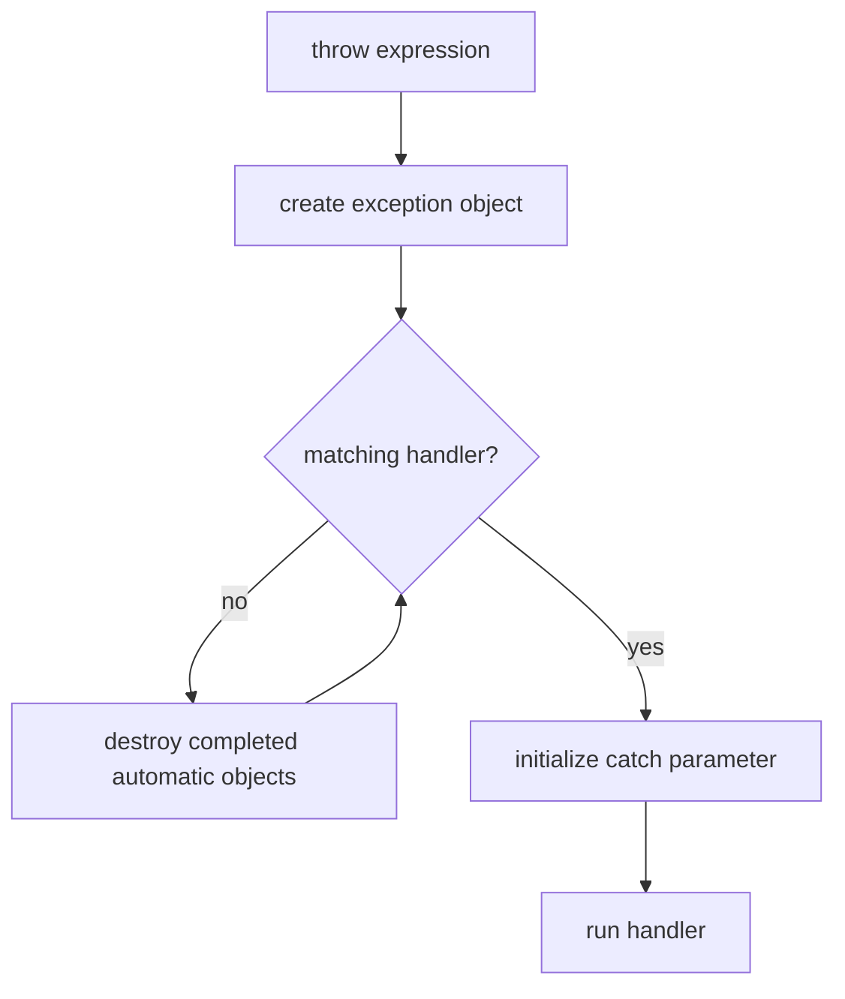

<TLDR>
  <TLDRCell label="what">
    An <Term id="exception">exception</Term> is both an object and a control-flow path: `throw` reports that the current operation cannot finish, and a matching `catch` handles the failure up the call chain.
  </TLDRCell>
  <TLDRCell label="trap">
    An exception skips ordinary statements and starts stack unwinding. Raw resources, partial updates, catches by value, and false `noexcept` promises can turn a recoverable failure into a leak, corrupt state, or termination.
  </TLDRCell>
  <TLDRCell label="fix">
    Throw objects and catch them by `const` reference, manage resources with RAII, state each operation's exception-safety guarantee, and declare `noexcept` only when the function truly cannot throw.
  </TLDRCell>
</TLDR>

## What it is and why it exists

A C++ exception combines an exception object with a non-local transfer of control. A `throw` expression creates the exception object and stops the current normal path; the runtime searches the call chain for a type-compatible handler. A matching `catch` takes control and can recover, translate the failure, or propagate the same exception outward.

This mechanism separates the place that detects a failure from the place that decides what to do about it. A parsing function knows why input is invalid, but it may not know whether to retry, display a message, or abandon a request; its caller owns that policy. Exceptions are especially natural when a constructor cannot establish an object's invariant because constructors have no ordinary return value for an error.

Exceptions fit cases where an operation cannot fulfill its contract and the current layer cannot recover. Bounds-checked standard-library operations, allocation, streams, and user-defined domain operations can use them. You also meet exception propagation or translation around `std::future::get()`, plugin boundaries, and top-level request handlers.

Exceptions are not the default answer for every failure. Expected branches such as a missing lookup result or temporarily unavailable input often fit `std::optional`, `std::expected`, error codes, or ordinary conditions better. The interface should expose the result callers need to handle instead of disguising a routine branch as an unexpected fault.

## How it works

Executing `throw expression;` initializes an exception object. Its type participates in handler matching, and the object lives independently of locals at the throw site. The runtime first checks handlers that dynamically enclose the throw point; when none matches, it continues into callers.

Handlers are tried in source order. The same type, an unambiguous accessible base, and certain standard pointer conversions can match; `catch (...)` matches any exception. A derived-exception handler must therefore precede its base handler, and a catch-all handler must come last.

As the search proceeds outward, <Term id="stack-unwinding">stack unwinding</Term> takes place. Fully constructed automatic objects are destroyed in reverse construction order. Control does not return to skipped statements, so cleanup must be attached to object destruction instead of relying on one manual call at the end of a function.



One propagation can be summarized as follows:

1. `throw` initializes the exception object from its operand.
2. The runtime checks the dynamically enclosing handlers in source order.
3. If none matches, fully constructed automatic objects in the exited scope are destroyed.
4. A match initializes the `catch` parameter and runs the handler.
5. The exception object is destroyed when nothing refers to it after the handler; a bare `throw;` can rethrow it first.

<Term id="raii">Resource Acquisition Is Initialization (RAII)</Term> turns unwinding into a reliable cleanup path. `std::vector`, `std::string`, smart pointers, file streams, and lock guards release ownership in their destructors. Once a resource belongs to such an object, a later exception cannot bypass its release logic.

If an exception leaves a `noexcept` function, or another exception escapes a destructor during propagation, the program calls `std::terminate()`. An exception with no matching handler also ultimately terminates the program. Exceptions are therefore not an automatic recovery mechanism; they only deliver failure to a boundary that can still apply a policy.

## Examples

The next three examples build from typed handling to stack unwinding and then the strong exception guarantee. Each program was compiled with `-std=c++23 -Wall -Wextra -Wpedantic -Werror` under GCC 13.3.0 and executed; the displayed output is from those runs.

### Handle input failures by type

`parse_age()` distinguishes a format error from a range error. The caller can give the two failures different outcomes while the success path returns only an age.

<Depth level="quick">

```cpp title="parse_age.cpp"
#include <cstddef>
#include <iostream>
#include <stdexcept>
#include <string>

int parse_age(const std::string& text) {
    std::size_t parsed = 0;
    int age = std::stoi(text, &parsed);
    if (parsed != text.size()) {
        throw std::invalid_argument("age contains trailing characters");
    }
    if (age < 0 || age > 130) {
        throw std::out_of_range("age is outside 0..130");
    }
    return age;
}

int main() {
    for (const std::string text : {"42", "42years", "200"}) {
        try {
            int age = parse_age(text);
            std::cout << text << " -> " << age << '\n';
        } catch (const std::invalid_argument& error) {
            std::cout << text << " -> invalid: " << error.what() << '\n';
        } catch (const std::out_of_range& error) {
            std::cout << text << " -> range: " << error.what() << '\n';
        }
    }
}
```

```text
42 -> 42
42years -> invalid: age contains trailing characters
200 -> range: age is outside 0..130
```

</Depth>

Both handlers receive their exceptions by `const` reference. That avoids a copy and preserves the actual exception type and virtual dispatch to `what()`. This boundary does not need `catch (const std::exception&)` because it promises to handle only the two known failures.

`std::stoi()` can itself throw `std::invalid_argument` or `std::out_of_range`. The wrapper then checks `parsed` because `std::stoi("42years")` accepts the numeric prefix instead of rejecting the trailing characters. The wrapper must complete its own input contract.

Exception types express failure categories that callers can distinguish; the message is diagnostic detail. Program logic should not parse `what()` text because a standard-library implementation, locale, or later edit can change it.

### Observe unwinding and rethrowing

The next program constructs trace objects across three call layers. The service layer logs the exception and uses a bare `throw;`, so the outer layer still receives the original `std::runtime_error`.

```cpp title="unwind.cpp"
#include <iostream>
#include <stdexcept>
#include <string>
#include <utility>

class Trace {
public:
    explicit Trace(std::string name) : name_(std::move(name)) {
        std::cout << "acquire " << name_ << '\n';
    }

    ~Trace() {
        std::cout << "release " << name_ << '\n';
    }

private:
    std::string name_;
};

void read_response() {
    Trace response("response");
    throw std::runtime_error("checksum mismatch");
}

void load_order() {
    Trace transaction("transaction");
    try {
        read_response();
    } catch (const std::exception& error) {
        std::cout << "service logged: " << error.what() << '\n';
        throw;
    }
}

int main() {
    Trace request("request");
    try {
        load_order();
    } catch (const std::runtime_error& error) {
        std::cout << "main caught: " << error.what() << '\n';
    }
}
```

```text
acquire request
acquire transaction
acquire response
release response
service logged: checksum mismatch
release transaction
main caught: checksum mismatch
release request
```

`response` is destroyed before control enters the handler in `load_order()`. While that handler runs, `transaction` remains in scope; it is destroyed only after the bare `throw;` exits the handler. `request` is outside `main()`'s `try`, so it lives until `main()` finishes normally.

This order shows that a handler has an ordinary scope and local lifetime too. Logging code can read context that remains alive, but it must not retain references to objects that the rethrow is about to destroy. Copy stable data or construct a new exception with context when that information must survive another layer.

Writing `throw error;` instead of `throw;` constructs a new object from an expression whose static type is `std::exception`, causing <Term id="object-slicing">object slicing</Term>. A bare rethrow preserves the current exception object and its dynamic type.

### Commit before changing visible state

`Ledger::append_batch()` first validates and appends into a temporary copy, then swaps that copy into the member only after all work succeeds. A rejected batch does not change the ledger visible before the call.

```cpp title="ledger.cpp"
#include <iostream>
#include <stdexcept>
#include <vector>

class Ledger {
public:
    Ledger() : entries_{100} {}

    void append_batch(const std::vector<int>& amounts) {
        auto next = entries_;
        for (int amount : amounts) {
            if (amount < 0) {
                throw std::invalid_argument("amount must be non-negative");
            }
            next.push_back(amount);
        }
        entries_.swap(next);
    }

    void print() const {
        std::cout << "ledger:";
        for (int amount : entries_) {
            std::cout << ' ' << amount;
        }
        std::cout << '\n';
    }

private:
    std::vector<int> entries_;
};

int main() {
    Ledger ledger;
    try {
        ledger.append_batch({20, -5, 30});
    } catch (const std::invalid_argument& error) {
        std::cout << "rejected: " << error.what() << '\n';
    }
    ledger.print();

    ledger.append_batch({20, 30});
    ledger.print();
}
```

```text
rejected: amount must be non-negative
ledger: 100
ledger: 100 20 30
```

The first call fails after `20` has already been appended to the temporary vector. Unwinding destroys the temporary, while the member `entries_` still contains only `100`. The second call completes every potentially failing construction and append before it performs the non-throwing `vector::swap()`.

This prepare-then-commit structure implements the strong exception guarantee. Its costs include copying the existing vector and holding extra storage, so it is not a mechanical recipe. Another design could fully validate the input and then mutate directly, but allocation and every other failure point would still need analysis.

Exception safety describes observable state after failure, not the presence of a `try`. You can prove a guarantee only by listing each potentially throwing operation and the state changes already committed before it.

## Pitfalls

### Throwing pointers or catching by value

> [!PITFALL]
> `throw new Error` mixes exception delivery with pointer ownership, while `catch (std::exception error)` copies only the base part and slices away the derived type.

**Fix:** throw a complete object by value and catch it by `const` reference. Custom exceptions normally derive from `std::runtime_error` or another suitable standard exception so that `what()` and polymorphic handling work naturally; do not make a handler guess who releases an exception pointer.

### Swallowing a failure at the wrong layer

> [!PITFALL]
> Generated code often adds `catch (...) {}` or logs and continues even though the current function has neither restored its state nor produced a valid result.

**Fix:** catch only at a boundary that can recover, translate the failure into an interface result, or end a defined unit of work. Use a bare `throw;` when logging before propagation; when translating, retain the original context and make clear that the operation still failed.

### Fighting non-local control flow with manual cleanup

> [!PITFALL]
> Releasing a `new` allocation, lock, or handle manually at the end of a function skips cleanup when an intervening statement throws. Adding `try`/`catch` cleanup around every call easily misses new exit paths.

**Fix:** give the resource to an RAII type immediately after acquisition, such as `std::unique_ptr`, a container, a stream, or a lock guard. A destructor must perform infallible local cleanup; a close operation that needs to report failure can be a separate explicit member function.

### Validating after half the mutation

> [!PITFALL]
> A function changes several members and then runs validation, allocation, or a callback that can throw. It leaves partially committed state while claiming the strong exception guarantee.

**Fix:** validate every condition that can be checked before mutation, do potentially failing work in temporary state, and commit with a non-throwing operation. If cost or domain rules permit only the basic guarantee, document which state remains valid and which values can change after failure.

### Making a false `noexcept` promise

> [!PITFALL]
> A model marks every destructor, move operation, or small wrapper `noexcept` while its body allocates, formats a log message, invokes a callback, or calls some other potentially throwing code.

**Fix:** inspect exception specifications across the complete call path and use `std::is_nothrow_*` traits to verify generic operations. Remove the declaration when non-throwing behavior cannot be proved; if a cleanup path must absorb errors, catch internally and report through a channel that cannot throw again.

### Driving ordinary loops with exceptions

> [!PITFALL]
> Treating out-of-range, not-found, or temporarily-empty states as loop termination hides the contract and sends every normal completion through the exceptional path.

**Fix:** use iterator bounds, a Boolean, `std::optional`, `std::expected`, or an error code for expected outcomes. Throw only when an operation cannot keep its promise and the handling policy belongs to an outer layer; choose by semantics, not an unmeasured performance slogan.

## In the AI era

**What generated code gets wrong here**

Generated code often catches `std::exception` by value and rethrows with `throw error;`, slicing away the dynamic type and diagnostic behavior. It also inserts empty `catch (...)` blocks that let partially built results continue, or combines raw pointers with a `delete` reached only on success. More dangerous combinations mutate an object before a throwing call while claiming the strong guarantee, or mislabel a function that allocates or invokes user callbacks as `noexcept`, making a formerly catchable failure terminate the process.

**Ask your AI to check**

- List the call path from every `throw` to its intended handling boundary, including the objects destroyed and the state still observable as each layer exits.
- Find every `catch`, bare `throw;`, `throw expression;`, and `noexcept`; explain whether the dynamic type survives and whether an exception can cross the declared boundary.
- For each function claiming the strong guarantee, list potentially throwing operations in execution order and the mutations already committed before each one.

**Review checklist**

- Inject exceptions or use controlled failing inputs at the first operation, a middle operation, and just before commit; verify resource counts and object invariants.
- Confirm that exceptions are caught by `const` reference, derived handlers precede base handlers, and catch-all handlers do not silently discard unknown failures.
- Inspect thread entry points, callbacks, destructors, `noexcept` functions, and C ABI boundaries so exceptions are translated or end a work unit at an allowed point.

**Prompt vocabulary**

Use the exact terms `exception object`, `handler matching`, `stack unwinding`, `catch by const reference`, `rethrow`, `object slicing`, `basic guarantee`, `strong guarantee`, `no-throw guarantee`, and `noexcept boundary`. Ask for a failure timeline and state invariants; a vague request to “improve error handling” is unlikely to expose these defects.

<Depth level="deep">

## Matching, exception objects, and rethrows

The `throw` operand initializes the exception object, whose type does not include top-level `const` or `volatile` qualifiers from that operand. Throwing a local does not leave the handler referring to a local that is about to die; the runtime manages a separate exception object. Its storage strategy is an implementation detail and must not be assumed to use the ordinary call stack.

`catch (const Base& error)` can match a derived exception with an unambiguous accessible `Base` base and retains virtual dispatch. `catch (Base error)` can also match, but it initializes a `Base` parameter and slices off the derived portion. Handler order is semantic: once a base handler comes first, a later derived handler does not get a chance.

A bare `throw;` inside a handler reactivates the currently handled exception. It neither copies the object nor reconstructs it from the static type of the `catch` parameter. In contrast, `throw error;` is a new throw expression; if `error` is a base reference, its operand type can make the new exception object lose the original derived information.

To add context, catch a known low-level type, throw a domain type, and copy stable fields into the new message or members. If callers must inspect causality, use the project's agreed nested-exception facility or an explicit error structure. Concatenating only `what()` text while discarding types and structure is rarely enough for programmatic handling.

## Exception-safety guarantees

An <Term id="exception-safety-guarantee">exception-safety guarantee</Term> states what remains true when an operation throws. It concerns resources, object invariants, and observable state, not whether the current function catches the exception.

| Guarantee | Promise after a throw | Common implementation shape |
|---|---|---|
| No guarantee | Resources or invariants may be damaged | Redesign instead of publishing this interface |
| Basic guarantee | No leaks and the object remains valid, though its value may change | RAII members plus explicit invariants |
| Strong guarantee | Observable state matches the state before the call | Prepare then commit, copy-and-swap, or a transaction |
| No-throw guarantee | The operation does not fail by throwing | Infallible cleanup, swap, and some observers |

The strong guarantee does not mean “try to roll back.” If rollback can itself throw, it cannot restore the old state reliably. A stronger structure completes all potentially failing work in an independent temporary object and then changes visible state with an operation proved not to throw.

The basic guarantee is not a vague claim that “the object still works.” Class invariants must hold, resources cannot leak, and documentation must say which later operations still meet their preconditions. For a multi-object operation, the guarantee must also define whether its scope is one object, an aggregate, or a transaction in an external system.

## Construction failure and partial objects

When a constructor throws, the outermost object never finishes construction, so that object's own destructor does not run. Fully constructed bases and non-static data members are destroyed in reverse order. A member whose construction never started or never completed has no object to destroy.

| Failure point | Cleanup that runs |
|---|---|
| A member initializer | Destructors for earlier completed bases and members |
| The constructor body | Destructors for all completed bases and members |
| After a delegated target constructor completes | The complete object's destructor |
| A constructor called by an allocation expression | Subobject cleanup, then storage release by the matching deallocation function |

This rule requires resources to be owned by members during construction. If a constructor first stores a handle in a raw integer and a later member initializer throws, the outer destructor cannot close it. Encapsulating the handle in a self-cleaning member gives partial construction the basic guarantee.

Member initialization order follows base ordering and member declaration order, not the written order of the member-initializer list. Exception cleanup follows that real construction order too. Keeping declarations and initializers in the same order, with reorder warnings enabled, prevents imagined cleanup sequences from diverging from the program.

### Constructor function try blocks

A function try block can catch an exception from a member initializer or the constructor body, usually to add context or record the failure. Its handler must exit by throwing; construction cannot fail and then pretend to return a usable object. Code in the handler must not continue to access data from subobjects that have already been destroyed.

Most constructors do not need a function try block. RAII members perform cleanup and the exception naturally reaches the caller, which keeps the path shorter. Add this boundary only when an initializer failure must be observed or a low-level exception must be translated into a stable public contract.

## `noexcept` and termination

`noexcept` is part of a function's type and interface contract. The unconditional form `noexcept` means `noexcept(true)`; the conditional form `noexcept(expression)` computes a Boolean at compile time. The `noexcept(call())` operator only asks whether an expression is declared non-throwing and does not execute the call.

If an exception tries to leave a non-throwing function, the runtime calls `std::terminate()`; an outer `catch` cannot turn it back into ordinary exception flow. Adding `noexcept` is therefore not a local optimization hint but a change in failure semantics. The promise must be reviewed if a called function later becomes potentially throwing.

Destructors are usually implicitly non-throwing, though their exact specification depends on base and member destructors. Even if a destructor is allowed to throw, letting it escape while another exception is already unwinding still terminates the program. Destruction should perform infallible release; provide an explicit operation in normal control flow when an I/O or commit failure must reach the caller.

Non-throwing move operations also affect whether standard-library machinery chooses a copy or a move, which is why `std::move_if_noexcept` exists. But the annotation must follow facts about member operations, not be forged to push a container toward moving. The full analysis of moves and container relocation belongs to the move-semantics topic.

## Boundaries and alternatives

An exception propagates along the current thread's call stack; it does not jump to the thread's creator. A thread entry point must catch and transfer failure through shared results, `std::exception_ptr`, a promise, or its task framework; `std::future::get()` can rethrow a stored exception in the waiting thread. An exception escaping a `std::thread` initial function terminates the program.

Exceptions should not cross a C ABI or plugin boundary that does not support the same C++ exception semantics. Boundary functions catch all exceptions, translate failure into an agreed status code or result object, and guarantee diagnostic-data lifetimes. Safe propagation across dynamic libraries also depends on a shared contract for compilers, runtimes, and build options.

C++23's `std::expected<T, E>` fits explicit failures that callers handle as routine branches. It puts the error type in the return type and requires each layer to propagate or inspect it explicitly. Exceptions keep the success return type simple and can skip intermediate layers that cannot act; a boundary can translate between the two, but the rule must be consistent.

Some projects disable exception support or prohibit exceptions across real-time, kernel, embedded, or other designated regions. That is a build and architecture constraint; it does not automatically turn ordinary throwing code into error-code code. Dependencies, compiler options, destruction policy, and public interfaces must all follow the same boundary contract.

</Depth>

<Checkpoint id="cpp/exceptions" />

## Further reading

- [C++23 working draft: exception handling](https://timsong-cpp.github.io/cppwp/n4950/except)
- [C++23 working draft: handling an exception](https://timsong-cpp.github.io/cppwp/n4950/except.handle)
- [C++23 working draft: constructors and destructors](https://timsong-cpp.github.io/cppwp/n4950/except.ctor)
- [C++23 working draft: exception specifications](https://timsong-cpp.github.io/cppwp/n4950/except.spec)
- [C++ Core Guidelines: error handling](https://isocpp.github.io/CppCoreGuidelines/CppCoreGuidelines#S-errors)
