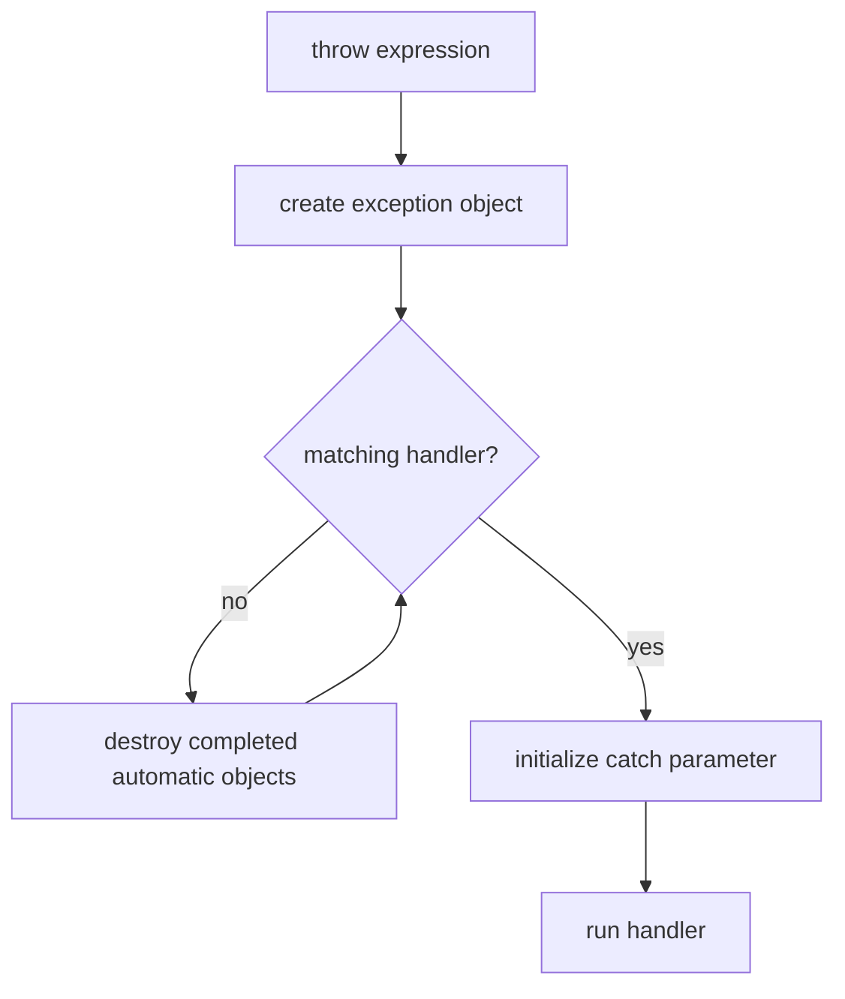

<TLDR>
  <TLDRCell label="what">
    <Term id="exception">异常（exception）</Term>是一个对象，也是一条控制流：`throw` 报告当前操作无法完成，匹配的 `catch` 在调用链上处理失败。
  </TLDRCell>
  <TLDRCell label="trap">
    异常会跳过普通语句并触发栈展开；裸资源、部分更新、按值捕获和错误的 `noexcept` 都可能把可处理的失败变成泄漏、状态破坏或程序终止。
  </TLDRCell>
  <TLDRCell label="fix">
    抛出对象并通过 `const` 引用捕获，以 RAII 管理资源，明确每个操作的异常安全保证，并只在函数确实不会抛出时声明 `noexcept`。
  </TLDRCell>
</TLDR>

## 是什么，为什么存在

C++ 异常由异常对象和非局部控制转移组成。`throw` 表达式创建异常对象，并停止当前正常路径；运行时沿调用链寻找类型兼容的处理器。匹配的 `catch` 接管控制后，可以恢复、转换失败，或把同一异常继续向外传播。

这种机制把发现失败的位置与决定如何应对的位置分开。解析函数知道输入为何无效，却未必知道应当重试、显示消息还是放弃请求；调用方掌握这项策略。构造函数没有普通返回值可携带错误，因此无法建立对象不变量时，异常尤其自然。

异常适合表示某次操作无法履行其契约，而且当前层不能完成恢复的情况。标准库的边界检查、内存分配、流操作和用户定义的领域操作都可能采用它。你也会在 `std::future::get()`、插件边界和顶层请求处理器中遇到传播或转换异常的代码。

异常不是所有失败的默认答案。查找不到元素、输入暂时不可用等预期分支通常更适合 `std::optional`、`std::expected`、错误码或普通条件判断。接口选择应表达调用方需要处理的结果，而不是把常见分支伪装成意外故障。

## 工作原理

执行 `throw expression;` 时，表达式会初始化一个异常对象。该对象的类型参与处理器匹配，并独立于抛出点的局部对象存活。运行时先检查动态包围抛出点的处理器；没有匹配项时，继续向调用方查找。

处理器按源码顺序尝试。相同类型、无歧义的可访问基类以及标准规定的部分指针转换可以匹配；`catch (...)` 匹配任何异常。因此，派生异常的处理器必须放在基类处理器之前，而兜底处理器必须放在最后。

查找向外推进时会发生<Term id="stack-unwinding">栈展开（stack unwinding）</Term>。已经完成构造的自动对象按构造的逆序销毁。控制流不会返回被跳过的语句，所以清理工作必须绑定到对象析构，而不能依赖函数末尾的一次手动调用。



一次传播可概括为以下步骤：

1. `throw` 用操作数初始化异常对象。
2. 运行时按处理器出现顺序检查当前动态包围层。
3. 若未匹配，则销毁离开作用域的已构造自动对象。
4. 匹配后，以异常对象初始化 `catch` 参数并运行处理器。
5. 处理器结束后，异常对象在不再被引用时销毁；裸 `throw;` 可以在此之前重新传播它。

<Term id="raii">RAII（Resource Acquisition Is Initialization，资源获取即初始化）</Term>让栈展开成为可靠的清理路径。`std::vector`、`std::string`、智能指针、文件流和锁守卫都在析构函数中结束所有权。只要资源已经交给这类对象，后续任何异常都不会绕过它的释放逻辑。

如果异常离开 `noexcept` 函数，或者传播过程中又有另一个异常逃出析构函数，程序会调用 `std::terminate()`。没有匹配处理器的异常最终也会终止程序。异常因此不是自动恢复机制；它只把失败交给仍有能力执行策略的边界。

## 示例

下面三个示例依次展示类型化处理、栈展开与强异常保证。每段程序都以 `-std=c++23 -Wall -Wextra -Wpedantic -Werror` 在 GCC 13.3.0 上编译并执行，输出来自实际运行。

### 按类型处理输入错误

`parse_age()` 区分格式错误与取值范围错误。调用方可以为两类失败给出不同结果，而成功路径只返回年龄。

<Depth level="quick">

```cpp title="parse_age.cpp"
#include <cstddef>
#include <iostream>
#include <stdexcept>
#include <string>

int parse_age(const std::string& text) {
    std::size_t parsed = 0;
    int age = std::stoi(text, &parsed);
    if (parsed != text.size()) {
        throw std::invalid_argument("age contains trailing characters");
    }
    if (age < 0 || age > 130) {
        throw std::out_of_range("age is outside 0..130");
    }
    return age;
}

int main() {
    for (const std::string text : {"42", "42years", "200"}) {
        try {
            int age = parse_age(text);
            std::cout << text << " -> " << age << '\n';
        } catch (const std::invalid_argument& error) {
            std::cout << text << " -> invalid: " << error.what() << '\n';
        } catch (const std::out_of_range& error) {
            std::cout << text << " -> range: " << error.what() << '\n';
        }
    }
}
```

```text
42 -> 42
42years -> invalid: age contains trailing characters
200 -> range: age is outside 0..130
```

</Depth>

两个处理器都通过 `const` 引用接收异常。这避免复制，也保留实际异常类型和 `what()` 的虚调用行为。这里不需要 `catch (const std::exception&)`，因为这个边界只承诺处理两类已知错误。

`std::stoi()` 自己也可能抛出 `std::invalid_argument` 或 `std::out_of_range`。本例随后检查 `parsed`，因为 `std::stoi("42years")` 会成功解析前缀，而不是自行拒绝尾部字符。完整的输入契约必须由封装函数补齐。

异常类型表达了调用方可区分的失败类别，消息只提供诊断。程序逻辑不应解析 `what()` 文本；标准库实现、语言环境或以后修改都可能改变消息内容。

### 观察栈展开与重新抛出

下一段程序在三层调用中创建跟踪对象。服务层记录异常后使用裸 `throw;`，让外层仍然接收到原来的 `std::runtime_error`。

```cpp title="unwind.cpp"
#include <iostream>
#include <stdexcept>
#include <string>
#include <utility>

class Trace {
public:
    explicit Trace(std::string name) : name_(std::move(name)) {
        std::cout << "acquire " << name_ << '\n';
    }

    ~Trace() {
        std::cout << "release " << name_ << '\n';
    }

private:
    std::string name_;
};

void read_response() {
    Trace response("response");
    throw std::runtime_error("checksum mismatch");
}

void load_order() {
    Trace transaction("transaction");
    try {
        read_response();
    } catch (const std::exception& error) {
        std::cout << "service logged: " << error.what() << '\n';
        throw;
    }
}

int main() {
    Trace request("request");
    try {
        load_order();
    } catch (const std::runtime_error& error) {
        std::cout << "main caught: " << error.what() << '\n';
    }
}
```

```text
acquire request
acquire transaction
acquire response
release response
service logged: checksum mismatch
release transaction
main caught: checksum mismatch
release request
```

`response` 在进入 `load_order()` 的处理器前销毁。处理器运行时，`transaction` 仍在作用域内；裸 `throw;` 离开该处理器后，它才被销毁。`request` 位于 `main()` 的 `try` 外部，所以一直存活到 `main()` 正常结束。

这种顺序说明处理器也拥有普通作用域和局部生命周期。记录代码可以读取仍存活的上下文，但不能保存指向即将因重新抛出而销毁对象的引用。错误上下文需要跨层保留时，应复制稳定数据或构造包含上下文的新异常。

把 `throw;` 写成 `throw error;` 会从静态类型为 `std::exception` 的表达式创建新对象，从而发生<Term id="object-slicing">对象切片（object slicing）</Term>。裸重新抛出会保留当前异常对象及其动态类型。

### 提交后再改变可见状态

`Ledger::append_batch()` 先在临时副本上验证并追加，全部成功后才交换到成员中。失败的批次不会改变调用前可见的账本。

```cpp title="ledger.cpp"
#include <iostream>
#include <stdexcept>
#include <vector>

class Ledger {
public:
    Ledger() : entries_{100} {}

    void append_batch(const std::vector<int>& amounts) {
        auto next = entries_;
        for (int amount : amounts) {
            if (amount < 0) {
                throw std::invalid_argument("amount must be non-negative");
            }
            next.push_back(amount);
        }
        entries_.swap(next);
    }

    void print() const {
        std::cout << "ledger:";
        for (int amount : entries_) {
            std::cout << ' ' << amount;
        }
        std::cout << '\n';
    }

private:
    std::vector<int> entries_;
};

int main() {
    Ledger ledger;
    try {
        ledger.append_batch({20, -5, 30});
    } catch (const std::invalid_argument& error) {
        std::cout << "rejected: " << error.what() << '\n';
    }
    ledger.print();

    ledger.append_batch({20, 30});
    ledger.print();
}
```

```text
rejected: amount must be non-negative
ledger: 100
ledger: 100 20 30
```

第一次调用在临时向量已经追加 `20` 后失败。临时对象随栈展开销毁，成员 `entries_` 仍只有 `100`。第二次调用完成所有可能失败的构造和追加后，才执行不抛异常的 `vector::swap()`。

这是一种先准备、后提交的强异常保证实现。它的代价包括复制现有向量和额外存储，因此不应机械套用。另一种设计可以先完整验证输入，再直接修改；是否仍有分配等失败点，需要逐条分析。

异常安全描述的是失败后的可观察状态，不是“代码使用了 `try`”。只有列出每个可能抛出的操作以及它之前已经发生的状态变化，才能证明保证级别。

## 陷阱

### 抛指针或按值捕获

> [!PITFALL]
> `throw new Error` 把异常传递与指针所有权混在一起；`catch (std::exception error)` 又会复制基类部分并切掉派生类型。

**修复：** 按值抛出完整对象，通过 `const` 引用捕获。自定义异常通常继承 `std::runtime_error` 或另一种合适的标准异常，让 `what()` 和多态处理自然工作；不要让处理器猜测谁负责释放异常指针。

### 在错误层级吞掉失败

> [!PITFALL]
> 生成代码常加入 `catch (...) {}` 或只写日志后继续执行，即使当前函数既没有恢复状态，也无法提供有效结果。

**修复：** 只在能够恢复、转换为接口结果或终止一个明确工作单元的边界捕获。需要记录后继续传播时使用裸 `throw;`；转换异常时保留原始上下文，并让调用方知道当前操作仍然失败。

### 用手动清理对抗非局部跳转

> [!PITFALL]
> `new`、加锁或打开句柄后，在函数末尾手动释放，会在中间语句抛出时跳过清理。为每个调用增加 `try`/`catch` 清理分支又容易遗漏新的退出路径。

**修复：** 获取成功后立刻把资源交给 RAII 类型，例如 `std::unique_ptr`、容器、流或锁守卫。析构函数必须完成无失败的本地清理；需要报告失败的关闭操作可以另设显式成员函数。

### 修改一半才验证

> [!PITFALL]
> 函数先改变多个成员，再执行可能抛出的验证、分配或回调，会留下局部提交的状态，却仍宣称提供强异常保证。

**修复：** 在修改前验证所有可验证条件，把可能失败的工作放在临时状态中，并以不抛异常的操作提交。若成本或领域规则只允许基本保证，就明确记录失败后哪些状态仍有效、哪些值未指定。

### 对 `noexcept` 作出虚假承诺

> [!PITFALL]
> 模型会把析构、移动操作或小型包装器一律标为 `noexcept`，却在函数体中调用分配、日志格式化、回调或其他可能抛出的代码。

**修复：** 沿完整调用路径检查异常规范，并用 `std::is_nothrow_*` 类型特征验证泛型操作。无法证明不抛出时就去掉声明；清理路径若必须吸收错误，应在内部捕获并使用不会再抛出的报告通道。

### 用异常驱动普通循环

> [!PITFALL]
> 把越界、未找到或队列暂时为空当作循环终止信号，会掩盖契约，也让每次正常结束都走异常路径。

**修复：** 为预期结果使用迭代器边界、布尔值、`std::optional`、`std::expected` 或错误码。只有调用无法履行承诺，而且处理策略属于更外层时才抛出异常；选择应基于语义，而不是未经测量的速度口号。

<Depth level="deep">

## 匹配、异常对象与重新抛出

异常对象由 `throw` 操作数初始化，其顶层 `const` 或 `volatile` 限定不会成为异常对象类型的一部分。抛出局部对象并不会让处理器引用即将销毁的局部变量；运行时管理的是单独的异常对象。异常对象的具体存储方式属于实现细节，不应假设它位于普通调用栈上。

`catch (const Base& error)` 可以匹配公开、无歧义基类为 `Base` 的派生异常，并保持虚函数分派。按值写成 `catch (Base error)` 虽然也能匹配，却只初始化一个 `Base` 参数，因此切掉派生部分。处理器的顺序是语义的一部分：基类处理器在前时，后面的派生处理器不会得到机会。

处理器内部的裸 `throw;` 会重新激活当前处理的异常。它不复制对象，也不重新根据 `catch` 参数的静态类型构造异常。相反，`throw error;` 是新的抛出表达式；如果 `error` 是基类引用，其操作数类型可能导致新异常对象丢失原始派生信息。

需要增加上下文时，可以捕获已知低层类型，再抛出领域类型，并把稳定字段复制到消息或成员中。若调用方必须检查因果链，可采用项目约定的嵌套异常或显式错误结构。仅把 `what()` 文本拼接后丢弃类型和结构，通常不足以支持程序化处理。

## 异常安全保证

<Term id="exception-safety-guarantee">异常安全保证（exception-safety guarantee）</Term>描述操作抛出时仍然成立的性质。它关注资源、对象不变量和可观察状态，而不是异常是否被当前函数捕获。

| 保证 | 抛出后的承诺 | 常用实现方式 |
|---|---|---|
| 无保证 | 资源或不变量可能已损坏 | 应重新设计，而不是对外提供这种接口 |
| 基本保证 | 无泄漏，对象仍有效，但值可能改变 | RAII 成员加明确不变量 |
| 强保证 | 可观察状态与调用前相同 | 先准备后提交、复制后交换或事务 |
| 不抛出保证 | 操作不会通过异常失败 | 无失败清理、交换和部分观察操作 |

强保证不是“尽量回滚”。回滚本身如果可能抛出，就不能稳定恢复原状态。更可靠的结构是在独立临时对象上完成所有可能失败的工作，再用已证明不抛出的提交操作改变可见状态。

基本保证也不是含糊的“对象还能用”。类不变量必须成立，资源不能泄漏，而且文档要说明哪些后续操作的前置条件仍满足。对多对象操作，保证范围还要说明是单个对象、整个聚合，还是外部系统中的事务。

## 构造失败与部分对象

构造函数抛出时，最外层对象从未完成构造，因此不会调用这个对象自身的析构函数。已经完成构造的基类和非静态数据成员会按相反顺序销毁。尚未开始或尚未完成构造的成员没有对象可供销毁。

| 失败位置 | 会执行的清理 |
|---|---|
| 某个成员初始化器 | 此前已完成的基类与成员析构 |
| 构造函数体 | 所有已完成的基类与成员析构 |
| 委托目标构造完成之后 | 完整对象的析构 |
| 分配表达式调用的构造函数 | 已构造子对象清理后，由匹配的释放函数回收存储 |

这条规则要求资源在构造过程中就由成员拥有。若构造函数先把句柄存进裸整数，之后的成员初始化又抛出，外层析构函数不会帮它关闭。把句柄封装在会自行析构的成员中，才能让部分构造也具备基本保证。

成员的初始化顺序由基类顺序和成员声明顺序决定，不由成员初始化器列表的书写顺序决定。异常路径同样遵循真实构造顺序。让声明与初始化器采用相同顺序，并启用重排警告，可以减少对错误清理顺序的想象。

### 构造函数函数 try 块

函数 try 块可以捕获成员初始化器或构造函数体抛出的异常，通常用于增加上下文或记录失败。处理器结束时必须通过抛出离开；构造失败后不能假装返回一个可用对象。依赖已经销毁子对象的数据也不应在处理器中继续访问。

多数构造函数不需要函数 try 块。RAII 成员负责清理，异常自然向调用方传播，路径通常更短。只有必须观察初始化器失败，或者要把低层异常转换成稳定的公开契约时，才增加这个边界。

## `noexcept` 与终止

`noexcept` 是函数类型和接口契约的一部分。无条件形式 `noexcept` 等价于 `noexcept(true)`；条件形式 `noexcept(expression)` 在编译期得到布尔值。`noexcept(call())` 运算符只查询表达式是否被声明为不抛出，不会执行该调用。

异常若试图离开不抛出函数，运行时调用 `std::terminate()`，外层 `catch` 无法把它恢复成普通异常路径。因此，给函数增加 `noexcept` 不是局部优化提示，而是改变失败语义。调用的函数以后变得可抛出时，这项承诺也必须重新审查。

析构函数通常隐式为不抛出，但其精确规范取决于基类和成员析构函数。即使某个析构函数允许抛出，当它在另一个异常的栈展开期间又让异常逃逸，仍会触发终止。析构应执行不会失败的释放；需要向调用方报告 I/O 或提交失败时，提供在正常控制流中调用的显式操作。

不抛出的移动操作还会影响标准库选择复制还是移动的策略，这也是 `std::move_if_noexcept` 存在的原因。但标注必须来自成员操作的事实，不能为了促使容器移动而伪造。移动规则和容器重定位的完整分析属于移动语义主题。

## 边界与替代方案

异常沿当前线程的调用栈传播，不会自动跳到创建线程。线程入口必须捕获异常并通过共享结果、`std::exception_ptr`、promise 或任务框架传递；`std::future::get()` 可以在等待线程中重新抛出已存储的异常。若从 `std::thread` 初始函数逃逸，程序会终止。

异常也不应越过不支持 C++ 异常语义的 C ABI 或插件边界。边界函数应捕获所有异常，把失败转换为双方约定的状态码或结果对象，并保证任何诊断数据的生命周期。跨动态库传播是否安全还取决于编译器、运行时和构建选项的一致契约。

C++23 的 `std::expected<T, E>` 适合调用方按常规分支处理的显式失败。它把错误类型放进返回类型，也要求每层显式传播或检查。异常则让成功返回类型保持简洁，并能越过无法采取行动的中间层；两者可以在边界处互相转换，但转换规则必须一致。

有些项目关闭异常支持，或禁止异常穿过实时、内核、嵌入式等特定区域。这是构建与架构约束，不会让普通抛出代码自动变成错误码代码。依赖库、编译选项、析构策略和公开接口必须共同采用同一种边界契约。

</Depth>

<Checkpoint id="cpp/exceptions" />

## 延伸阅读

- [C++23 工作草案：异常处理](https://timsong-cpp.github.io/cppwp/n4950/except)
- [C++23 工作草案：处理异常](https://timsong-cpp.github.io/cppwp/n4950/except.handle)
- [C++23 工作草案：构造函数与析构函数](https://timsong-cpp.github.io/cppwp/n4950/except.ctor)
- [C++23 工作草案：异常规范](https://timsong-cpp.github.io/cppwp/n4950/except.spec)
- [C++ Core Guidelines：错误处理](https://isocpp.github.io/CppCoreGuidelines/CppCoreGuidelines#S-errors)
